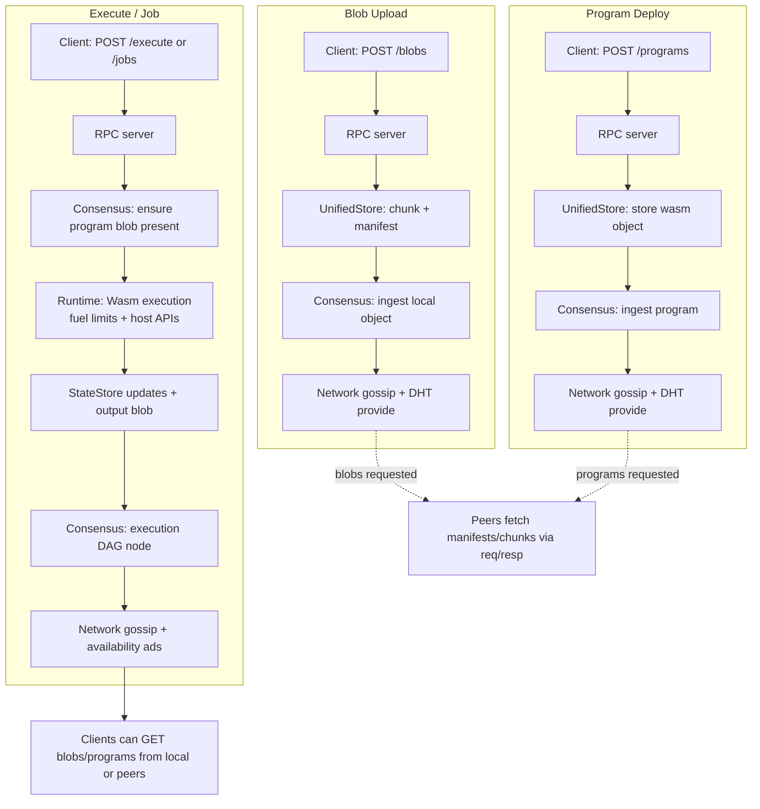

# ONVM – Open Network Virtual Machine

**ONVM** is a peer-to-peer decentralized compute platform that combines a content-addressed storage layer, a verifiable execution runtime powered by WebAssembly, a job scheduling system, and a gossip-based consensus mechanism to create a minimal, trustless virtual machine for distributed applications.

---

## Overview

ONVM nodes form a self-organizing network where participants:
- **Store** content-addressed blobs (data, programs) with chunked, merkle-verified integrity
- **Deploy** WebAssembly programs with versioned, deterministic execution
- **Execute** computations against isolated per-program state stores, producing state roots
- **Verify** execution results via aggregated BLS receipts without re-running the WASM
- **Catalog** all known programs/manifests and sync initial state across the network
- **Schedule** asynchronous jobs with retry logic, timeout enforcement, and fuel metering
- **Replicate** operations through a directed acyclic graph (DAG) consensus protocol
- **Synchronize** state, programs, blobs, receipts, and jobs across peers using gossip and Kademlia DHT

Each operation (blob publish, program deploy, execution, job completion) is embedded in a DAG node, gossiped to peers, and eventually converges network-wide, ensuring eventual consistency without centralized coordination.

---

## Architecture

### Core Components

| Module | Purpose |
|--------|---------|
| **`src/node.rs`** | Top-level orchestrator that wires together networking, consensus, execution, and storage |
| **`src/network/`** | libp2p-based P2P stack (gossipsub, Kademlia, mDNS, request-response) |
| **`src/consensus/`** | DAG engine for operation ordering, replication, receipt validation, and peer synchronization |
| **`src/execution/`** | Wasmtime-based runtime with host functions, job scheduler, and executor |
| **`src/storage/`** | BlobStore (chunked + merkle roots), ProgramCatalog (manifests/receipts), and StateStore (program-scoped KV) |
| **`src/rpc/`** | Axum-based HTTP API for blob upload, program deployment, execution, and job management |
| **`src/syncer/`** | Job synchronization manager for cross-node job and blob replication |
| **`src/crypto/`** | Ed25519 identity keys, BLS aggregate signatures (min_sig), Blake3 hashing |

### Data Flow

```
CLI → RPC → Node → Consensus (DAG) → Network (gossip)
                  ↓
            JobScheduler → ExecutionEngine → StateStore
                  ↓
            BlobStore (chunked, merkle-verified)
```

1. **Upload Blob**: client POSTs blob → RPC → BlobStore → DAG node → gossip to peers
2. **Deploy Program**: client POSTs wasm → ProgramStore → DAG node → gossip
3. **Execute**: client POSTs program_id + input → ExecutionEngine (fuel-metered wasm) → StateStore → DAG node → gossip
4. **Submit Job**: client POSTs job request → JobScheduler → JobExecutor → BlobStore (output) → gossip to peers

### Blob & Program Lifecycle Flow



### Program Catalog & Sync
- **Manifests**: Every deploy emits a signed `ProgramManifest` (id, version, entrypoints, wasm env hash, code manifest, initial state root). Manifests are gossiped and persisted in the `ProgramCatalog`.
- **Initial state**: Nodes sync manifests and initial state roots; code is fetched lazily on demand. Catalog endpoints/CLI: `GET /program-catalog`, `cargo run -- program-catalog`.
- **Bootstrap**: New nodes fetch the catalog snapshot, then pull missing manifests/state; listening logs include the peer ID to simplify copy/paste of multiaddrs.
- **State commitments**: State roots use sparse Merkle trees; nodes can build/verify proofs for individual keys to validate partial syncs.

### Verifiable Execution & Receipts
- **Deterministic execution**: Wasm runs with a fixed host ABI and fuel metering. Executions produce `ExecutionReceipt` (inputs hash, gas, state_root_in/out, write digest).
- **Aggregate verification**: A committee re-executes, signs the receipt hash with BLS, and publishes an `AggregatedReceipt` (aggregate sig + signer bitmap). Other nodes verify without re-executing.
- **Catalog storage**: Receipts are stored per program; query with `GET /programs/:id/receipts` or `cargo run -- program-receipts --id <program-id>`.

---

## Building & Running

### Prerequisites
- Rust **1.82+** (edition 2021)
- `cargo`, `cargo-fmt`, `cargo-clippy`

### Docker
Build and run a node via Docker Compose:
```bash
cp .env.example .env
# edit .env and set ONVM_IDENTITY_PASSPHRASE
docker compose up --build
```
This starts a node with a persistent volume at `/data` and binds RPC to `127.0.0.1:8080` on the host.

Generate an RPC project credential (prints `project_id=` and `project_secret=`):
```bash
docker compose exec onvm sh -lc 'onvm generate-project --rpc 127.0.0.1:8080 --identity-passphrase "$ONVM_IDENTITY_PASSPHRASE"'
```

Environment variables (see `docker/entrypoint.sh`):
- `ONVM_DATA_DIR`, `ONVM_LISTEN`, `ONVM_RPC_BIND`, `ONVM_MIN_PEERS`, `ONVM_BLOB_SYNC_MODE`, `ONVM_CONFIG`
- `ONVM_BOOTNODES` (comma-separated), `ONVM_DEV`, `ONVM_ALLOW_PLAINTEXT_IDENTITY`, `ONVM_INIT_ENABLE_MDNS`

### Build
```bash
cargo build --release
```

### Initialize a Node
```bash
cargo run -- init --data-dir ./data
```
Generates Ed25519 identity keys in `./data/identity` and a default `config.toml`.

### Run a Node
```bash
cargo run -- run-node \
  --data-dir ./data \
  --listen /ip4/0.0.0.0/tcp/37000 \
  --rpc 127.0.0.1:8080 \
  --min-peers 1 \
  --blob-sync-mode full
```
- `--listen`: P2P multiaddr (will auto-increment port on conflict). Logs now include the peer ID with the p2p suffix, e.g. `/ip4/192.168.1.100/tcp/37000/p2p/<peerid>`.
- `--rpc`: HTTP API bind address (`:8080` shorthand supported)
- `--min-peers`: minimum connected peers before accepting executions
- `--blob-sync-mode`: `full` (replicate data) or `metadata` (index only)

### Upload a Blob
```bash
cargo run -- upload-blob \
  --rpc :8080 \
  --file input.bin \
  --mime application/octet-stream
```
Returns a 64-char hex **BlobId**.

### Deploy a WASM Program
```bash
# Build a sample program first
cd wasm_programs/echo
cargo build --target wasm32-unknown-unknown --release
cd ../..

cargo run -- deploy \
  --rpc :8080 \
  --file wasm_programs/echo/target/wasm32-unknown-unknown/release/echo.wasm \
  --entrypoint onvm_main \
  --blob-refs <blob-id-1> <blob-id-2> \
  --salt <base64-salt>
```
Returns a hex **ProgramId** (deterministic hash of wasm + salt).

### Execute a Program
```bash
cargo run -- execute \
  --rpc :8080 \
  --program-id <program-id> \
  --input input.bin
```
Prints base64-decoded output to stdout; use `--json` for structured response.

### Fetch a Blob
```bash
cargo run -- get-blob \
  --rpc :8080 \
  --id <blob-id> \
  --out downloaded.bin
```

### Inspect a Program
```bash
cargo run -- program-info \
  --rpc :8080 \
  --id <program-id>
```
Returns JSON metadata (publisher, entrypoint, blob_refs, size).

### Program Catalog & Receipts
- List known program manifests (network-synced catalog):
```bash
cargo run -- program-catalog --rpc :8080
```
- Fetch aggregated execution receipts for a program:
```bash
cargo run -- program-receipts --rpc :8080 --id <program-id>
```
The catalog tracks program manifests, initial state roots, and aggregate BLS-verified execution receipts.

---

## Job System

ONVM provides an asynchronous job scheduling system with automatic retry logic, timeout enforcement, and cross-node replication.

### Submit a Job
```bash
cargo run -- submit-job \
  --rpc :8080 \
  --program-id <program-id> \
  --input input.json \
  --request-id my-job-1 \
  --max-retries 3
```
Returns a hex **JobId**. Jobs are automatically queued, executed, and replicated across all nodes.

**Example with job-test program:**
```bash
# Deploy the job-test program first
cd wasm_programs/job-test
cargo build --target wasm32-unknown-unknown --release
cd ../..

cargo run -- deploy \
  --rpc :8080 \
  --file wasm_programs/job-test/target/wasm32-unknown-unknown/release/job_test.wasm \
  --entrypoint onvm_main

# Submit compute task
cargo run -- submit-job \
  --rpc :8080 \
  --program-id <program-id> \
  --input wasm_programs/job-test/test_compute.json \
  --request-id compute-1
```

**Input formats (test_*.json files):**
- `test_compute.json`: `{"task": "compute", "iterations": 100, "data": "42"}`
- `test_hash.json`: `{"task": "hash", "iterations": 50, "data": "onvm-job-system-test"}`
- `test_transform.json`: `{"task": "transform", "data": "test the job scheduler with this message"}`
- `test_stress.json`: `{"task": "stress", "iterations": 500}`

### Check Job Status
```bash
cargo run -- job-status \
  --rpc :8080 \
  --job-id <job-id>
```
Returns JSON with status (pending/running/completed/failed/cancelled/timed_out), fuel consumed, timestamps, and error messages.

**Example output:**
```json
{
  "job_id": "5d9959d26008569cda98c1693449be01d8d3f9ce959a9a5bbd53f547d7c83612",
  "request_id": "test-1",
  "program_id": "f36d634041342c561522d403d00f9bf0592cb667f5935b1a80a6c7787ae32bb2",
  "status": "completed",
  "fuel_consumed": 23481,
  "created_at": 1765702557748,
  "started_at": 1765702558277,
  "completed_at": 1765702558495,
  "duration_ms": 218,
  "retry_count": 0,
  "error_message": null,
  "metadata": {}
}
```

### Retrieve Job Output
```bash
cargo run -- job-output \
  --rpc :8080 \
  --job-id <job-id> \
  --out result.json
```
Fetches the job's output blob from any node in the network (automatically synced).

**Example output (compute task):**
```json
{
  "result": "success",
  "task": "compute",
  "iterations": 100,
  "final_value": 142
}
```

**Example output (hash task):**
```json
{
  "result": "success",
  "task": "hash",
  "iterations": 50,
  "final_hash": "abc123...def456"
}
```

### Cancel a Job
```bash
cargo run -- cancel-job \
  --rpc :8080 \
  --job-id <job-id>
```

### List All Jobs
```bash
cargo run -- list-jobs --rpc :8080
```

**Example output:**
```json
{
  "jobs": [
    {
      "job_id": "5d9959d26008569cda98c1693449be01d8d3f9ce959a9a5bbd53f547d7c83612",
      "request_id": "test-1",
      "program_id": "f36d634041342c561522d403d00f9bf0592cb667f5935b1a80a6c7787ae32bb2",
      "status": "completed",
      "created_at": 1765702557748,
      "completed_at": 1765702558495
    }
  ],
  "total": 1
}
```

### Job Features
- **Automatic Retry**: Jobs retry on failure with exponential backoff (configurable max retries)
- **Timeout Enforcement**: Per-job timeout limits (default from manifest)
- **Fuel Metering**: Track computational cost per job
- **Cross-Node Sync**: Jobs and output blobs replicate across all nodes via gossipsub
- **Idempotent Requests**: Request IDs prevent duplicate job submissions
- **Health Monitoring**: Node capacity, queue depth, and execution metrics via `/health` endpoints

---

## WASM Programs

ONVM supports WebAssembly programs compiled to `wasm32-unknown-unknown` (or `wasm32-wasi` for broader stdlib).

### Entrypoint Signatures
Programs export one of:
- `fn onvm_main(ptr: i32, len: i32) -> (i32, i32)` (multi-value)
- `fn onvm_main(ptr: i32, len: i32) -> i64` (packed pointer+length)
- `fn onvm_main(sret_ptr: i32, input_ptr: i32, input_len: i32)` (struct return)

### Host Functions
| Function | Signature | Purpose |
|----------|-----------|---------|
| **`onvm_blob_read`** | `(id_ptr, id_len, out_ptr, out_cap) -> i32` | Read a blob by hex ID |
| **`onvm_state_put`** | `(key_ptr, key_len, val_ptr, val_len) -> i32` | Write to program-scoped state |
| **`onvm_state_get`** | `(key_ptr, key_len, out_ptr, out_cap) -> i32` | Read from state (returns len or -needed) |
| **`onvm_state_root`** | `(out_ptr) -> i32` | Get 32-byte merkle root of current state |

### Sample Programs
Located in `wasm_programs/`:

1. **`echo`** – Uppercases input bytes (no-std, minimal allocator demo)
2. **`kvstore`** – JSON-based key-value store with `put`/`get`/`list`/`clear`/`stats` operations
3. **`analytics`** – Text analysis: Blake3 hash, token counting, LZ4 compression, number stats
4. **`job-test`** – Job system test program with compute, hash, transform, and stress tasks (uses std with threading support)

Build with:
```bash
cd wasm_programs/<program-name>
cargo build --target wasm32-unknown-unknown --release
```

Resulting `.wasm` files are in `target/wasm32-unknown-unknown/release/`.

---

## Testing

```bash
cargo test --all-targets
cargo clippy --all-targets --all-features
cargo fmt --check
```

See `AGENTS.md` for full build/test conventions.

---

## Configuration

Default settings in `src/config/mod.rs`:
- **Block params**: 512 max ops/block, 500ms slot duration, 1 min op/block
- **Genesis**: empty state root
- **Network**: 1 min peer, bootnodes list (placeholder)

Override by editing `./data/config.toml` after `init`.

---

## Networking

- **Gossipsub**: Topic-based pub/sub for blobs, programs, manifests, receipts, and DAG operations
- **Kademlia DHT**: Provider records for content discovery
- **mDNS**: Local peer discovery (auto-dials LAN nodes)
- **Request-Response**: Direct blob/program/state/receipt transfer between peers
- **Multiaddr**: `/ip4/0.0.0.0/tcp/37000/p2p/<peerid>` or custom (auto-increments on bind conflict)

---

## Security

- **Identity**: Ed25519 keypair stored in `./data/identity` (never commit)
- **Hashing**: Blake3 for content IDs, merkle roots, and DAG node IDs
- **Receipts**: BLS aggregate signatures over execution receipts; manifests are signed by deployers
- **State proofs**: Sparse Merkle proofs for program state keys/values
- **Sandboxing**: Wasmtime fuel metering (default 50M instructions/exec), configurable timeouts, memory limits
- **WASM Threading**: Full std library support including threading and sync primitives (wasm_threads enabled)
- **Determinism**: Programs must be reproducible; avoid randomness in committed blobs; wasm env hash recorded in manifests
- **Job Isolation**: Each job executes in a separate WASM instance with enforced resource limits

---

## Roadmap

- [x] Job scheduling system with retry logic and timeout enforcement
- [x] Cross-node job and blob synchronization
- [x] Health monitoring and metrics endpoints
- [x] WASM threading and std library support
- [x] Program catalog with signed manifests and initial state roots
- [x] Aggregated BLS receipt verification for executions
- [ ] Advanced state sync (chunked initial state, SMT proofs)
- [ ] Committee sampling / staking integration
- [ ] Persistent execution scheduler (async task queue across node restarts)
- [ ] Program versioning and upgrade paths
- [ ] Gas/fuel economics for resource metering
- [ ] Multi-program orchestration (program calls program)

---

## License

Licensed under the Apache License, Version 2.0. See `LICENSE` for details.

---

## Contributing

Contributions are welcome! Please follow these guidelines:

### Code Style
- Use `snake_case` for functions/modules, `PascalCase` for structs/enums
- 4-space indentation (run `cargo fmt` before committing)
- Provide explicit error contexts using `anyhow::Context`
- Avoid unchecked `unwrap`/`expect` in production code

### Commit Conventions
- Use short, imperative commit messages (≤72 chars)
- Reference issues when applicable (e.g., `Fix: handle empty blobs (#42)`)
- Focus on "why" rather than "what"

### Pull Requests
- Run `cargo fmt && cargo clippy --all-targets --all-features` before submitting
- Ensure `cargo test --all-targets` passes
- Include test coverage for new features
- Document breaking changes to RPC endpoints or config files
- Add sample CLI invocations or screenshots for user-facing changes

---

## Contact

For questions, issues, or contributions, see the repository's issue tracker.
