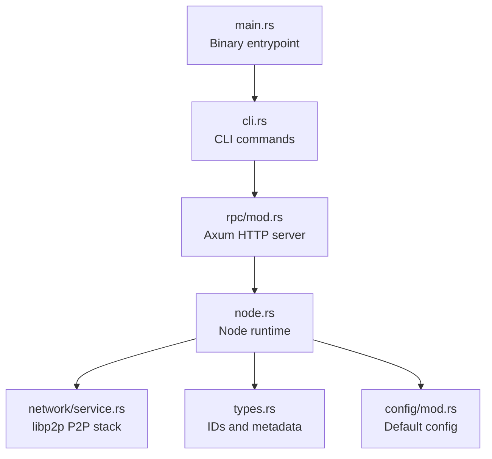
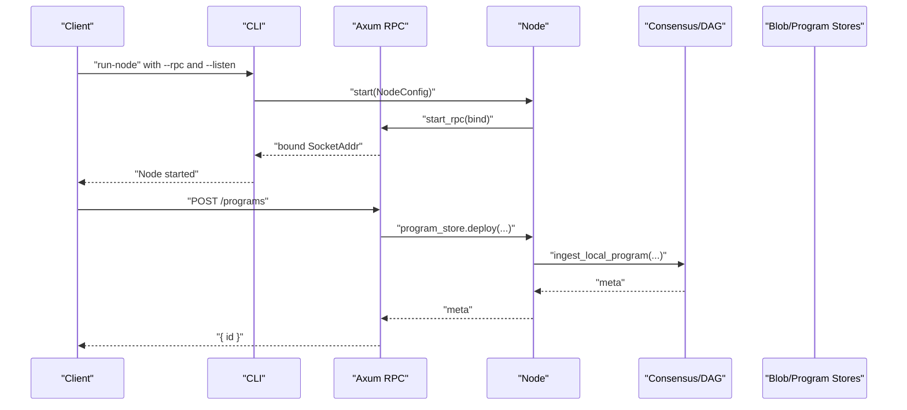
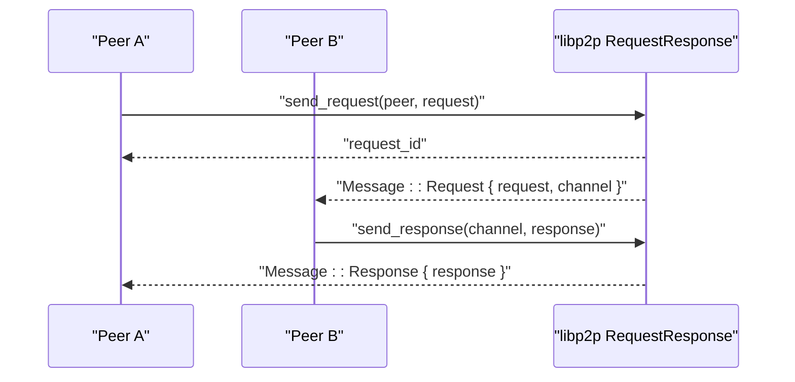
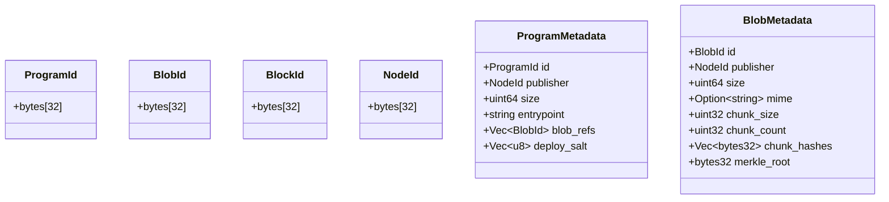
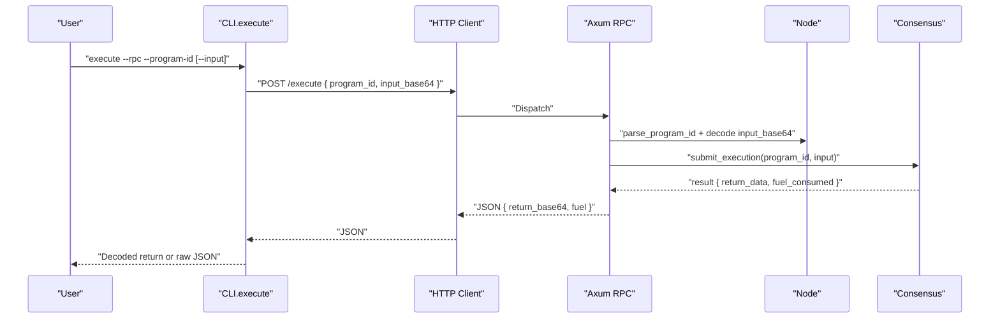
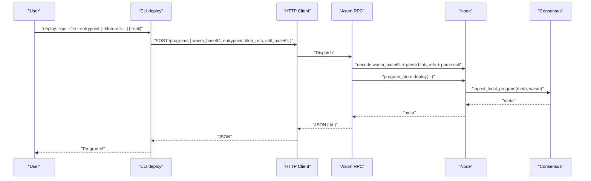
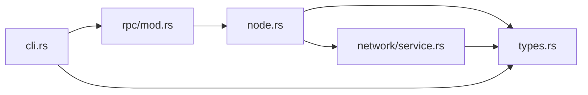

# API Reference

<cite>
**Referenced Files in This Document**
- [main.rs](file://src/main.rs)
- [lib.rs](file://src/lib.rs)
- [cli.rs](file://src/cli.rs)
- [rpc/mod.rs](file://src/rpc/mod.rs)
- [node.rs](file://src/node.rs)
- [types.rs](file://src/types.rs)
- [network/service.rs](file://src/network/service.rs)
- [config/mod.rs](file://src/config/mod.rs)
- [Cargo.toml](file://Cargo.toml)
</cite>

## Table of Contents
1. [Introduction](#introduction)
2. [Project Structure](#project-structure)
3. [Core Components](#core-components)
4. [Architecture Overview](#architecture-overview)
5. [Detailed Component Analysis](#detailed-component-analysis)
6. [Dependency Analysis](#dependency-analysis)
7. [Performance Considerations](#performance-considerations)
8. [Troubleshooting Guide](#troubleshooting-guide)
9. [Conclusion](#conclusion)
10. [Appendices](#appendices)

## Introduction
This document provides a complete API reference for the ONVM project’s public interfaces:
- CLI commands for initializing a node, running a node, uploading blobs, deploying programs, executing programs, fetching blobs, and inspecting program metadata.
- HTTP RPC endpoints exposed by the Axum server, including request/response schemas and error handling.
- Peer-to-peer APIs using libp2p request-response protocols for blob and program transfers.
- Security considerations, client implementation guidelines, and migration notes.

## Project Structure
The ONVM binary entrypoint delegates to the CLI, which orchestrates node startup and RPC server binding. The RPC module defines HTTP endpoints and integrates with the Node runtime. The network module implements libp2p gossipsub, Kademlia, and request-response protocols for peer-to-peer communication.



**Diagram sources**
- [main.rs](file://src/main.rs#L1-L7)
- [cli.rs](file://src/cli.rs#L1-L300)
- [rpc/mod.rs](file://src/rpc/mod.rs#L1-L241)
- [node.rs](file://src/node.rs#L1-L163)
- [network/service.rs](file://src/network/service.rs#L1-L458)
- [types.rs](file://src/types.rs#L1-L109)
- [config/mod.rs](file://src/config/mod.rs#L1-L140)

**Section sources**
- [main.rs](file://src/main.rs#L1-L7)
- [lib.rs](file://src/lib.rs#L1-L12)

## Core Components
- CLI: Provides commands for initialization, node operation, blob upload, program deployment, execution, blob retrieval, and program inspection.
- RPC: Exposes HTTP endpoints for health, blob upload/fetch, program deployment/info, and execution.
- Node: Aggregates storage, execution, consensus, and network subsystems.
- Types: Defines identifiers and metadata structures used across APIs.
- Network: Implements libp2p gossipsub, Kademlia, and request-response for peer-to-peer operations.

**Section sources**
- [cli.rs](file://src/cli.rs#L1-L300)
- [rpc/mod.rs](file://src/rpc/mod.rs#L1-L241)
- [node.rs](file://src/node.rs#L1-L163)
- [types.rs](file://src/types.rs#L1-L109)
- [network/service.rs](file://src/network/service.rs#L1-L458)

## Architecture Overview
The CLI starts a Node with configured identity, storage, and network. The RPC server binds to a TCP address and exposes HTTP endpoints. The Node coordinates blob and program stores, execution engine, scheduler, and consensus. Peers communicate via libp2p gossipsub/Kademlia and request-response channels.



**Diagram sources**
- [cli.rs](file://src/cli.rs#L130-L171)
- [rpc/mod.rs](file://src/rpc/mod.rs#L62-L96)
- [node.rs](file://src/node.rs#L37-L132)

## Detailed Component Analysis

### CLI Commands
All CLI commands accept an RPC endpoint argument and normalize it to http://127.0.0.1:PORT when prefixed with a colon. The CLI constructs JSON bodies and sends HTTP requests to the RPC server.

- init
  - Purpose: Initialize identity and default config in a data directory.
  - Parameters:
    - --data-dir: Directory path (default ./data).
  - Output: Prints identity location and node ID.
  - Exit codes: 0 on success; non-zero on errors.

- run-node
  - Purpose: Start a full node with network, consensus, and RPC.
  - Parameters:
    - --data-dir: Directory path (default ./data).
    - --listen: libp2p listen multiaddress (default /ip4/0.0.0.0/tcp/37000).
    - --rpc: RPC bind address (default 127.0.0.1:8080); accepts :port shorthand.
    - --min-peers: Minimum peers for block production (default 1).
    - --blob-sync-mode: "full" or "metadata" (default full).
  - Output: Prints data directory and bound RPC address.
  - Exit codes: 0 on graceful shutdown; non-zero on startup errors.

- upload-blob
  - Purpose: Upload a blob to the node.
  - Parameters:
    - --rpc: RPC endpoint (default 127.0.0.1:8080).
    - --file: Path to blob file.
    - --mime: Optional MIME type.
  - Request body: JSON with data_base64 and mime.
  - Response: JSON with id and size.
  - Exit codes: 0 on success; non-zero on HTTP errors.

- deploy
  - Purpose: Deploy a WASM program.
  - Parameters:
    - --rpc: RPC endpoint (default 127.0.0.1:8080).
    - --file: Path to WASM file.
    - --entrypoint: Program entrypoint.
    - --blob-refs: Zero or more blob IDs (hex-encoded).
    - --salt: Optional base64 salt for deterministic ProgramId.
  - Request body: JSON with wasm_base64, entrypoint, blob_refs, salt_base64.
  - Response: JSON with id.
  - Exit codes: 0 on success; non-zero on HTTP errors.

- execute
  - Purpose: Execute a deployed program with optional input.
  - Parameters:
    - --rpc: RPC endpoint (default 127.0.0.1:8080).
    - --program-id: Program ID (hex-encoded).
    - --input: Optional path to input file.
    - --json: Print raw JSON response instead of decoding return_base64.
  - Request body: JSON with program_id and input_base64.
  - Response: JSON with return_base64 and fuel consumed.
  - Exit codes: 0 on success; non-zero on HTTP errors.

- get-blob
  - Purpose: Download a blob by ID.
  - Parameters:
    - --rpc: RPC endpoint (default 127.0.0.1:8080).
    - --id: Blob ID (hex-encoded).
    - --out: Output file path.
  - Response: Binary payload written to file.
  - Exit codes: 0 on success; non-zero on HTTP errors.

- program-info
  - Purpose: Retrieve program metadata.
  - Parameters:
    - --rpc: RPC endpoint (default 127.0.0.1:8080).
    - --id: Program ID (hex-encoded).
  - Response: JSON with id, publisher, size, entrypoint, blob_refs.
  - Exit codes: 0 on success; non-zero on HTTP errors.

Examples (conceptual):
- Deploy a program:
  - curl -X POST http://127.0.0.1:8080/programs \
    -H "Content-Type: application/json" \
    -d '{"wasm_base64":"...","entrypoint":"_start","blob_refs":["..."],"salt_base64":"..."}'
- Execute a program:
  - curl -X POST http://127.0.0.1:8080/execute \
    -H "Content-Type: application/json" \
    -d '{"program_id":"...","input_base64":"..."}'

Exit codes:
- CLI commands return 0 on success; non-zero on HTTP failures or invalid arguments.

**Section sources**
- [cli.rs](file://src/cli.rs#L13-L22)
- [cli.rs](file://src/cli.rs#L31-L107)
- [cli.rs](file://src/cli.rs#L172-L296)

### HTTP RPC Endpoints (Axum)
All endpoints are served under the bound RPC address. Authentication: none by default.

- GET /health
  - Description: Health check endpoint.
  - Response: Plain text "ok".
  - Status codes: 200 OK.

- POST /blobs
  - Description: Upload a blob.
  - Request body:
    - data_base64: Base64-encoded blob bytes.
    - mime: Optional MIME type string.
  - Response body:
    - id: Hex-encoded BlobId.
    - size: Blob size in bytes.
  - Status codes: 200 OK on success; 400 Bad Request on invalid base64 or hex; 500 Internal Server Error on internal errors.

- GET /blobs/{id}
  - Description: Fetch a blob by ID.
  - Path parameters:
    - id: Hex-encoded BlobId (32 bytes).
  - Response: Binary payload.
  - Status codes: 200 OK on success; 400 Bad Request on invalid id; 404 Not Found if missing.

- POST /programs
  - Description: Deploy a WASM program.
  - Request body:
    - wasm_base64: Base64-encoded WASM bytes.
    - entrypoint: Program entrypoint string.
    - blob_refs: Array of hex-encoded BlobIds.
    - salt_base64: Optional base64-encoded salt for deterministic ProgramId.
  - Response body:
    - id: Hex-encoded ProgramId.
  - Status codes: 200 OK on success; 400 Bad Request on invalid base64/hex; 500 Internal Server Error on internal errors.

- GET /programs/{id}
  - Description: Retrieve program metadata.
  - Path parameters:
    - id: Hex-encoded ProgramId (32 bytes).
  - Response body:
    - id: Hex-encoded ProgramId.
    - publisher: Hex-encoded NodeId.
    - size: Program size in bytes.
    - entrypoint: Entrypoint string.
    - blob_refs: Array of hex-encoded BlobIds.
  - Status codes: 200 OK on success; 400 Bad Request on invalid id; 404 Not Found if missing.

- POST /execute
  - Description: Execute a program with optional input.
  - Request body:
    - program_id: Hex-encoded ProgramId.
    - input_base64: Base64-encoded input bytes.
  - Response body:
    - return_base64: Base64-encoded return bytes.
    - fuel: Fuel consumed during execution.
  - Status codes: 200 OK on success; 400 Bad Request on invalid ids/base64; 500 Internal Server Error on internal errors.

Notes:
- All endpoints return structured JSON on success except GET /blobs and GET /health.
- Validation errors return 400; missing resources return 404; internal errors return 500.

**Section sources**
- [rpc/mod.rs](file://src/rpc/mod.rs#L62-L96)
- [rpc/mod.rs](file://src/rpc/mod.rs#L98-L120)
- [rpc/mod.rs](file://src/rpc/mod.rs#L122-L132)
- [rpc/mod.rs](file://src/rpc/mod.rs#L133-L174)
- [rpc/mod.rs](file://src/rpc/mod.rs#L176-L192)
- [rpc/mod.rs](file://src/rpc/mod.rs#L194-L213)
- [rpc/mod.rs](file://src/rpc/mod.rs#L215-L233)
- [rpc/mod.rs](file://src/rpc/mod.rs#L235-L240)

### Peer-to-Peer APIs (libp2p)
The network service implements:
- Gossipsub topics for blobs, programs, and blocks.
- Kademlia for provider discovery.
- Request-response protocol for program and blob transfers.

Key protocols:
- Stream protocol: /onvm/transfer/1.0.0
- Topics:
  - TOPIC_BLOBS
  - TOPIC_PROGRAMS
  - TOPIC_BLOCKS

Request-response pattern:
- Outbound request: send_request(peer, request) -> request_id
- Inbound request: receive Message::Request { request, channel } -> send response via send_response(channel, response)
- Failure events: OutboundFailure/InboundFailure logged



**Diagram sources**
- [network/service.rs](file://src/network/service.rs#L243-L247)
- [network/service.rs](file://src/network/service.rs#L349-L369)

**Section sources**
- [network/service.rs](file://src/network/service.rs#L202-L258)
- [network/service.rs](file://src/network/service.rs#L349-L369)

### Data Models
Common identifiers and metadata used across APIs:



**Diagram sources**
- [types.rs](file://src/types.rs#L1-L109)

**Section sources**
- [types.rs](file://src/types.rs#L1-L109)

## Architecture Overview
The CLI and RPC integrate with the Node runtime, which coordinates storage, execution, consensus, and network. The RPC server exposes HTTP endpoints for program lifecycle and execution. Peers exchange messages via libp2p gossipsub and request-response.

```mermaid
graph TB
subgraph "CLI"
CLI["cli.rs"]
end
subgraph "RPC"
AX["rpc/mod.rs"]
end
subgraph "Node Runtime"
N["node.rs"]
T["types.rs"]
CFG["config/mod.rs"]
end
subgraph "Network"
NET["network/service.rs"]
end
CLI --> AX
AX --> N
N --> NET
N --> T
N --> CFG
```

**Diagram sources**
- [cli.rs](file://src/cli.rs#L1-L300)
- [rpc/mod.rs](file://src/rpc/mod.rs#L1-L241)
- [node.rs](file://src/node.rs#L1-L163)
- [types.rs](file://src/types.rs#L1-L109)
- [config/mod.rs](file://src/config/mod.rs#L1-L140)
- [network/service.rs](file://src/network/service.rs#L1-L458)

## Detailed Component Analysis

### CLI Command Flow: execute


**Diagram sources**
- [cli.rs](file://src/cli.rs#L221-L271)
- [rpc/mod.rs](file://src/rpc/mod.rs#L194-L213)

**Section sources**
- [cli.rs](file://src/cli.rs#L221-L271)
- [rpc/mod.rs](file://src/rpc/mod.rs#L194-L213)

### CLI Command Flow: deploy


**Diagram sources**
- [cli.rs](file://src/cli.rs#L191-L220)
- [rpc/mod.rs](file://src/rpc/mod.rs#L133-L174)

**Section sources**
- [cli.rs](file://src/cli.rs#L191-L220)
- [rpc/mod.rs](file://src/rpc/mod.rs#L133-L174)

### Error Handling Strategies
- HTTP status codes:
  - 200 OK: Successful responses.
  - 400 Bad Request: Invalid base64 encoding, invalid hex IDs, malformed requests.
  - 404 Not Found: Resource not present.
  - 500 Internal Server Error: Unexpected runtime errors.
- CLI error propagation:
  - CLI reads HTTP response text and returns an error on non-success status.
- Validation:
  - Hex IDs must be 32 bytes; otherwise 400.
  - Base64 decoding errors return 400.

**Section sources**
- [rpc/mod.rs](file://src/rpc/mod.rs#L102-L120)
- [rpc/mod.rs](file://src/rpc/mod.rs#L122-L132)
- [rpc/mod.rs](file://src/rpc/mod.rs#L133-L174)
- [rpc/mod.rs](file://src/rpc/mod.rs#L176-L192)
- [rpc/mod.rs](file://src/rpc/mod.rs#L194-L213)
- [rpc/mod.rs](file://src/rpc/mod.rs#L215-L240)
- [cli.rs](file://src/cli.rs#L172-L296)

### Security Considerations
- RPC binding: By default, the RPC server binds to localhost. The CLI normalizes endpoints starting with ":" to http://127.0.0.1:PORT.
- Authentication: No authentication is implemented for RPC endpoints.
- Rate limiting: Not implemented yet.
- Input validation: Strict decoding checks for base64 and hex IDs; invalid inputs return 400.
- TLS/WebSocket support: libp2p includes websocket transport and TLS features; RPC server does not enable TLS by default.

**Section sources**
- [cli.rs](file://src/cli.rs#L13-L22)
- [Cargo.toml](file://Cargo.toml#L17-L33)

### Client Implementation Guidelines
- HTTP clients:
  - Use Content-Type application/json for POST requests.
  - Encode binary payloads in base64.
  - Parse JSON responses; for execute, decode return_base64 to obtain program output.
- CLI automation:
  - Use the CLI commands to upload blobs, deploy programs, and execute them.
  - For program execution, pass --json to print raw JSON including fuel consumption.
- Peer-to-peer:
  - Use libp2p request-response protocol with stream protocol /onvm/transfer/1.0.0 for program and blob transfers.
  - Subscribe to gossipsub topics for blob, program, and block announcements.

**Section sources**
- [cli.rs](file://src/cli.rs#L172-L296)
- [rpc/mod.rs](file://src/rpc/mod.rs#L98-L120)
- [rpc/mod.rs](file://src/rpc/mod.rs#L133-L174)
- [rpc/mod.rs](file://src/rpc/mod.rs#L194-L213)
- [network/service.rs](file://src/network/service.rs#L243-L247)

### Migration Notes
- Version: 0.1.0.
- Current API surface includes health, blob upload/fetch, program deploy/info, and execution endpoints.
- Future enhancements may include:
  - Authentication (e.g., JWT).
  - Rate limiting.
  - Expanded libp2p WebSocket transports and TLS for RPC.
  - Additional program execution polling endpoints.

**Section sources**
- [Cargo.toml](file://Cargo.toml#L1-L10)

## Dependency Analysis
The CLI depends on the RPC module and Node runtime. The RPC module depends on Node services for blob and program stores, and consensus. The Node aggregates storage, execution, scheduler, and network components. libp2p features are enabled in Cargo.toml.



**Diagram sources**
- [cli.rs](file://src/cli.rs#L1-L300)
- [rpc/mod.rs](file://src/rpc/mod.rs#L1-L241)
- [node.rs](file://src/node.rs#L1-L163)
- [types.rs](file://src/types.rs#L1-L109)
- [network/service.rs](file://src/network/service.rs#L1-L458)

**Section sources**
- [Cargo.toml](file://Cargo.toml#L17-L33)

## Performance Considerations
- Base64 encoding/decoding overhead: Consider streaming binary payloads when feasible.
- Blob and program sizes: Large uploads may increase latency; consider chunking strategies at the application level.
- libp2p request-response: Batch or coalesce requests to reduce overhead.
- Deduplication: Gossipsub message deduplication reduces redundant processing.

[No sources needed since this section provides general guidance]

## Troubleshooting Guide
- RPC server fails to bind:
  - The RPC server increments the port until a free socket is found; check the bound address printed by the CLI.
- Invalid base64:
  - Ensure base64 encoding is correct; endpoints return 400 Bad Request.
- Invalid hex IDs:
  - Ensure IDs are 32-byte hex strings; otherwise 400 Bad Request.
- Missing resource:
  - GET /blobs/{id} or GET /programs/{id} returns 404 Not Found if absent.
- Internal errors:
  - 500 Internal Server Error indicates unexpected runtime issues.

**Section sources**
- [rpc/mod.rs](file://src/rpc/mod.rs#L73-L96)
- [rpc/mod.rs](file://src/rpc/mod.rs#L102-L120)
- [rpc/mod.rs](file://src/rpc/mod.rs#L122-L132)
- [rpc/mod.rs](file://src/rpc/mod.rs#L176-L192)
- [rpc/mod.rs](file://src/rpc/mod.rs#L194-L213)
- [rpc/mod.rs](file://src/rpc/mod.rs#L235-L240)

## Conclusion
This API reference covers the CLI commands, HTTP RPC endpoints, and libp2p peer-to-peer protocols of ONVM. It provides request/response schemas, error handling, and security considerations. Clients can automate deployments and executions via HTTP or leverage the CLI. Future work includes authentication, rate limiting, and expanded transport options.

[No sources needed since this section summarizes without analyzing specific files]

## Appendices

### Appendix A: Endpoint Summary
- GET /health: Health check.
- POST /blobs: Upload blob.
- GET /blobs/{id}: Fetch blob.
- POST /programs: Deploy program.
- GET /programs/{id}: Program metadata.
- POST /execute: Execute program.

**Section sources**
- [rpc/mod.rs](file://src/rpc/mod.rs#L62-L96)
- [rpc/mod.rs](file://src/rpc/mod.rs#L98-L120)
- [rpc/mod.rs](file://src/rpc/mod.rs#L122-L132)
- [rpc/mod.rs](file://src/rpc/mod.rs#L133-L174)
- [rpc/mod.rs](file://src/rpc/mod.rs#L176-L192)
- [rpc/mod.rs](file://src/rpc/mod.rs#L194-L213)