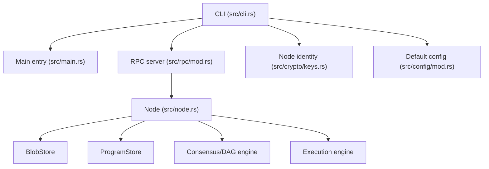
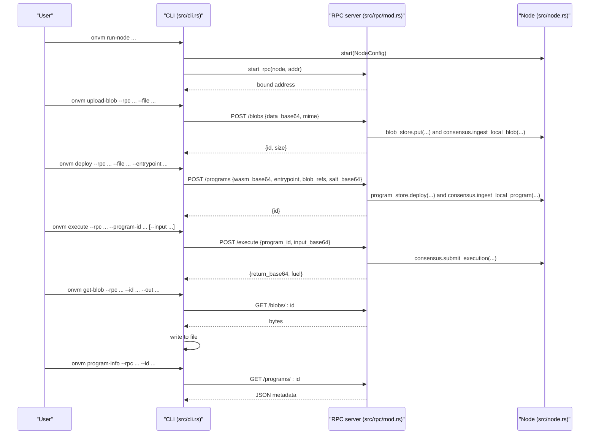
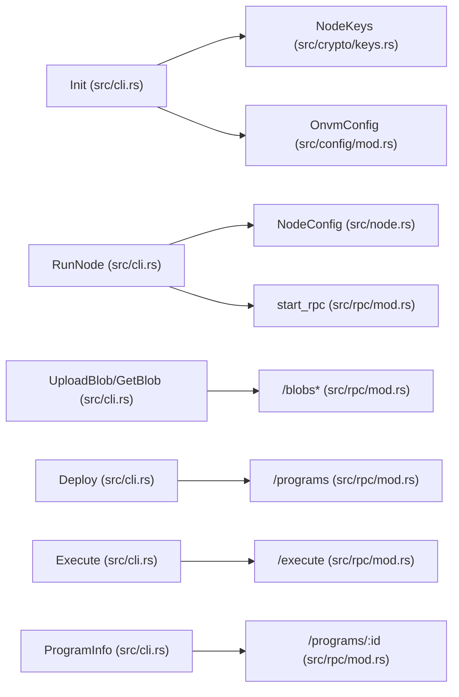

# CLI Reference

<cite>
**Referenced Files in This Document**
- [main.rs](file://src/main.rs)
- [cli.rs](file://src/cli.rs)
- [rpc/mod.rs](file://src/rpc/mod.rs)
- [node.rs](file://src/node.rs)
- [config/mod.rs](file://src/config/mod.rs)
- [keys.rs](file://src/crypto/keys.rs)
</cite>

## Table of Contents
1. [Introduction](#introduction)
2. [Project Structure](#project-structure)
3. [Core Components](#core-components)
4. [Architecture Overview](#architecture-overview)
5. [Detailed Component Analysis](#detailed-component-analysis)
6. [Dependency Analysis](#dependency-analysis)
7. [Performance Considerations](#performance-considerations)
8. [Troubleshooting Guide](#troubleshooting-guide)
9. [Conclusion](#conclusion)

## Introduction
This document provides comprehensive Command Line Interface (CLI) documentation for the ONVM toolkit. It covers all CLI commands, their purpose, syntax, parameters, and practical examples. It also explains how CLI commands map to underlying RPC endpoints and highlights error handling, exit codes, and troubleshooting tips for common issues.

## Project Structure
The CLI is implemented as a Rust binary that delegates to a set of subcommands. Each subcommand performs local actions (init) or makes HTTP requests to an RPC server (run-node, upload-blob, deploy, execute, get-blob, program-info). The RPC server exposes endpoints backed by the node’s subsystems (blob store, program store, consensus, execution).

**Diagram sources**
- [main.rs](file://src/main.rs#L1-L7)
- [cli.rs](file://src/cli.rs#L1-L120)
- [rpc/mod.rs](file://src/rpc/mod.rs#L62-L96)
- [node.rs](file://src/node.rs#L14-L35)
- [keys.rs](file://src/crypto/keys.rs#L30-L62)
- [config/mod.rs](file://src/config/mod.rs#L133-L139)

**Section sources**
- [main.rs](file://src/main.rs#L1-L7)
- [cli.rs](file://src/cli.rs#L1-L120)
- [rpc/mod.rs](file://src/rpc/mod.rs#L62-L96)
- [node.rs](file://src/node.rs#L14-L35)
- [keys.rs](file://src/crypto/keys.rs#L30-L62)
- [config/mod.rs](file://src/config/mod.rs#L133-L139)

## Core Components
- CLI parser and subcommands: Defines all supported commands and their arguments.
- RPC server: Exposes endpoints for blobs, programs, and execution.
- Node: Orchestrates network, consensus, blob store, program store, and execution.
- Identity and config: Provide default configuration and node identity persistence.

**Section sources**
- [cli.rs](file://src/cli.rs#L24-L107)
- [rpc/mod.rs](file://src/rpc/mod.rs#L62-L96)
- [node.rs](file://src/node.rs#L14-L35)
- [keys.rs](file://src/crypto/keys.rs#L30-L62)
- [config/mod.rs](file://src/config/mod.rs#L133-L139)

## Architecture Overview
The CLI commands map to RPC endpoints as follows:
- init: Local filesystem operation (no RPC).
- run-node: Starts a node and an RPC server locally.
- upload-blob: POST /blobs
- deploy: POST /programs
- execute: POST /execute
- get-blob: GET /blobs/:id
- program-info: GET /programs/:id

**Diagram sources**
- [cli.rs](file://src/cli.rs#L130-L171)
- [cli.rs](file://src/cli.rs#L172-L190)
- [cli.rs](file://src/cli.rs#L191-L220)
- [cli.rs](file://src/cli.rs#L221-L271)
- [cli.rs](file://src/cli.rs#L272-L296)
- [rpc/mod.rs](file://src/rpc/mod.rs#L62-L96)
- [rpc/mod.rs](file://src/rpc/mod.rs#L98-L120)
- [rpc/mod.rs](file://src/rpc/mod.rs#L133-L174)
- [rpc/mod.rs](file://src/rpc/mod.rs#L194-L213)
- [rpc/mod.rs](file://src/rpc/mod.rs#L122-L132)
- [rpc/mod.rs](file://src/rpc/mod.rs#L176-L191)

## Detailed Component Analysis

### onvm init
Purpose
- Initialize a data directory for a node, generate or load node identity, and write default configuration if missing.

Syntax
- onvm init --data-dir PATH

Parameters
- --data-dir PATH: Directory path to initialize. Defaults to "./data".

Behavior
- Creates the directory if it does not exist.
- Generates or loads a node identity file under PATH/identity.
- Writes a default configuration file to PATH/config.toml if it does not exist.
- Prints the initialized identity path and node ID.

Practical example
- onvm init --data-dir ./my-node

Notes
- No RPC call is made; this is a local filesystem operation.

Exit codes
- 0 on success.
- Non-zero on filesystem errors or identity generation failures.

**Section sources**
- [cli.rs](file://src/cli.rs#L116-L129)
- [keys.rs](file://src/crypto/keys.rs#L30-L62)
- [config/mod.rs](file://src/config/mod.rs#L133-L139)

### onvm run-node
Purpose
- Start a full ONVM node with network, consensus, and RPC server.

Syntax
- onvm run-node --data-dir PATH --listen MULTIADDR --rpc HOST:PORT --min-peers N --blob-sync-mode {full|metadata}

Parameters
- --data-dir PATH: Node data directory. Defaults to "./data".
- --listen MULTIADDR: Network listen multiaddress. Defaults to "/ip4/0.0.0.0/tcp/37000".
- --rpc HOST:PORT or HOST:PORT: Alias "--api" is supported. Defaults to "127.0.0.1:8080".
- --min-peers N: Minimum peers required for block production. Defaults to 1.
- --blob-sync-mode {full|metadata}: Blob synchronization mode. Defaults to "full".

Behavior
- Parses listen multiaddress and RPC endpoint.
- Loads or generates node identity from PATH/identity.
- Starts the node with configured blob sync mode and minimum peers.
- Starts the RPC server bound to the RPC address.
- Runs until interrupted.

Practical example
- onvm run-node --listen /ip4/0.0.0.0/tcp/37000 --rpc 127.0.0.1:8080 --blob-sync-mode full

Notes
- The RPC endpoint normalization accepts "HOST:PORT", ":PORT", "http://HOST:PORT", or "https://HOST:PORT".
- The node may increment the listen TCP port if the initial port is unavailable.

Exit codes
- 0 on successful shutdown via signal.
- Non-zero on parsing errors, identity loading failures, or startup errors.

**Section sources**
- [cli.rs](file://src/cli.rs#L130-L171)
- [node.rs](file://src/node.rs#L14-L35)
- [node.rs](file://src/node.rs#L135-L163)
- [rpc/mod.rs](file://src/rpc/mod.rs#L62-L96)

### onvm upload-blob
Purpose
- Upload a file as a blob to a running node.

Syntax
- onvm upload-blob --rpc HOST:PORT --file PATH [--mime TYPE]
- Aliases: --api HOST:PORT

Parameters
- --rpc HOST:PORT: RPC endpoint. Defaults to "127.0.0.1:8080".
- --file PATH: Local file to upload.
- --mime TYPE: Optional MIME type hint.

Behavior
- Reads the file content and encodes it as base64.
- Sends a POST request to /blobs with JSON payload containing data_base64 and optional mime.
- Prints the blob ID and size on success.

Practical example
- onvm upload-blob --file data.txt --mime text/plain

Exit codes
- 0 on success.
- Non-zero on HTTP errors or invalid base64.

**Section sources**
- [cli.rs](file://src/cli.rs#L172-L190)
- [rpc/mod.rs](file://src/rpc/mod.rs#L98-L120)

### onvm deploy
Purpose
- Deploy a WASM program to the network.

Syntax
- onvm deploy --rpc HOST:PORT --file PATH --entrypoint NAME [--blob-refs HEX...] [--salt-base64 BASE64]
- Aliases: --api HOST:PORT

Parameters
- --rpc HOST:PORT: RPC endpoint. Defaults to "127.0.0.1:8080".
- --file PATH: WASM file to deploy.
- --entrypoint NAME: Program entrypoint function name.
- --blob-refs HEX...: Zero or more blob IDs referenced by the program.
- --salt-base64 BASE64: Optional base64-encoded salt to ensure unique ProgramId. Defaults to random if omitted.

Behavior
- Reads the WASM file and encodes it as base64.
- Sends a POST request to /programs with JSON payload containing wasm_base64, entrypoint, blob_refs, and salt_base64.
- Prints the deployed ProgramId.

Practical example
- onvm deploy --file program.wasm --entrypoint call --blob-refs 012... 345...

Exit codes
- 0 on success.
- Non-zero on HTTP errors or invalid inputs.

**Section sources**
- [cli.rs](file://src/cli.rs#L191-L220)
- [rpc/mod.rs](file://src/rpc/mod.rs#L133-L174)

### onvm execute
Purpose
- Execute a deployed program with optional input.

Syntax
- onvm execute --rpc HOST:PORT --program-id HEX [--input PATH] [--json]
- Aliases: --api HOST:PORT

Parameters
- --rpc HOST:PORT: RPC endpoint. Defaults to "127.0.0.1:8080".
- --program-id HEX: Program identifier (hex).
- --input PATH: Optional input file to encode as base64 and pass to the program.
- --json: Print raw JSON response instead of decoding return_base64 to stdout.

Behavior
- Encodes input file (if provided) as base64.
- Sends a POST request to /execute with program_id and input_base64.
- On success:
  - Without --json: prints the base64-decoded return data.
  - With --json: prints a JSON object containing return (decoded string) and fuel consumed.
- On failure, returns an error with the HTTP response text.

Practical example
- onvm execute --program-id 012... --input input.json --json

Exit codes
- 0 on success.
- Non-zero on HTTP errors or missing return_base64 in response.

**Section sources**
- [cli.rs](file://src/cli.rs#L221-L271)
- [rpc/mod.rs](file://src/rpc/mod.rs#L194-L213)

### onvm get-blob
Purpose
- Download a blob by ID and save it to a file.

Syntax
- onvm get-blob --rpc HOST:PORT --id HEX --out PATH
- Aliases: --api HOST:PORT

Parameters
- --rpc HOST:PORT: RPC endpoint. Defaults to "127.0.0.1:8080".
- --id HEX: Blob identifier (hex).
- --out PATH: Output file path to write the blob content.

Behavior
- Sends a GET request to /blobs/:id.
- Writes the received bytes to the specified file and prints a confirmation message.

Practical example
- onvm get-blob --id 012... --out downloaded.bin

Exit codes
- 0 on success.
- Non-zero on HTTP errors.

**Section sources**
- [cli.rs](file://src/cli.rs#L272-L296)
- [rpc/mod.rs](file://src/rpc/mod.rs#L122-L132)

### onvm program-info
Purpose
- Retrieve metadata for a deployed program.

Syntax
- onvm program-info --rpc HOST:PORT --id HEX
- Aliases: --api HOST:PORT

Parameters
- --rpc HOST:PORT: RPC endpoint. Defaults to "127.0.0.1:8080".
- --id HEX: Program identifier (hex).

Behavior
- Sends a GET request to /programs/:id.
- Prints program metadata as JSON.

Practical example
- onvm program-info --id 012...

Exit codes
- 0 on success.
- Non-zero on HTTP errors.

**Section sources**
- [cli.rs](file://src/cli.rs#L284-L296)
- [rpc/mod.rs](file://src/rpc/mod.rs#L176-L191)

## Dependency Analysis
The CLI depends on:
- Node configuration and identity for run-node.
- RPC server endpoints for all remote operations.
- Base64 encoding for binary payloads.
- Hex parsing for blob and program identifiers.

**Diagram sources**
- [cli.rs](file://src/cli.rs#L116-L171)
- [keys.rs](file://src/crypto/keys.rs#L30-L62)
- [config/mod.rs](file://src/config/mod.rs#L133-L139)
- [node.rs](file://src/node.rs#L14-L35)
- [rpc/mod.rs](file://src/rpc/mod.rs#L62-L96)
- [rpc/mod.rs](file://src/rpc/mod.rs#L98-L120)
- [rpc/mod.rs](file://src/rpc/mod.rs#L133-L174)
- [rpc/mod.rs](file://src/rpc/mod.rs#L194-L213)
- [rpc/mod.rs](file://src/rpc/mod.rs#L176-L191)

**Section sources**
- [cli.rs](file://src/cli.rs#L116-L171)
- [rpc/mod.rs](file://src/rpc/mod.rs#L62-L96)
- [node.rs](file://src/node.rs#L14-L35)
- [keys.rs](file://src/crypto/keys.rs#L30-L62)
- [config/mod.rs](file://src/config/mod.rs#L133-L139)

## Performance Considerations
- Blob and program uploads are base64-encoded; large files increase CPU overhead. Prefer streaming or chunked approaches if uploading very large assets.
- Executing programs consumes fuel proportional to computation; monitor fuel usage via --json output.
- Running multiple concurrent executions increases resource usage; schedule carefully.
- Network listen port increments occur automatically if the chosen port is busy; this avoids immediate startup failures.

[No sources needed since this section provides general guidance]

## Troubleshooting Guide
Common issues and resolutions
- Connection refused or RPC unreachable
  - Ensure the node is running with onvm run-node and the RPC endpoint is reachable.
  - Verify the endpoint format: HOST:PORT, :PORT, http://HOST:PORT, or https://HOST:PORT.
  - Confirm firewall and network settings allow connections to the RPC bind address.
- Invalid listen multiaddress
  - The CLI validates the listen address; fix the multiaddress format.
- Invalid blob or program ID
  - IDs must be 32-byte hex strings; ensure correct length and format.
- Missing return_base64 in execute response
  - The CLI expects a return_base64 field; if absent, the response is malformed.
- Base64 decode errors
  - Occur when uploaded data or inputs are not valid base64; recheck encoding.
- Internal server errors
  - Returned by RPC endpoints when node subsystems encounter issues; check logs and retry.

Exit codes summary
- 0: Success for all commands except run-node (which exits on signal).
- Non-zero: Failure for CLI argument parsing, filesystem operations, RPC errors, or invalid inputs.

**Section sources**
- [cli.rs](file://src/cli.rs#L130-L171)
- [cli.rs](file://src/cli.rs#L172-L190)
- [cli.rs](file://src/cli.rs#L191-L220)
- [cli.rs](file://src/cli.rs#L221-L271)
- [cli.rs](file://src/cli.rs#L272-L296)
- [rpc/mod.rs](file://src/rpc/mod.rs#L98-L120)
- [rpc/mod.rs](file://src/rpc/mod.rs#L133-L174)
- [rpc/mod.rs](file://src/rpc/mod.rs#L194-L213)
- [rpc/mod.rs](file://src/rpc/mod.rs#L176-L191)

## Conclusion
The ONVM CLI provides a cohesive interface for initializing nodes, running full nodes with RPC, uploading blobs, deploying WASM programs, executing programs, and inspecting program metadata. Each CLI command maps directly to an RPC endpoint, enabling a clean separation between local operations and remote node services. By following the examples and troubleshooting guidance here, you can reliably operate ONVM nodes and manage programs and blobs.