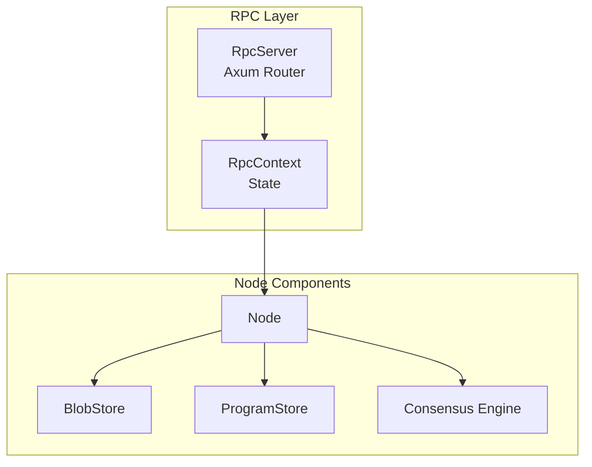
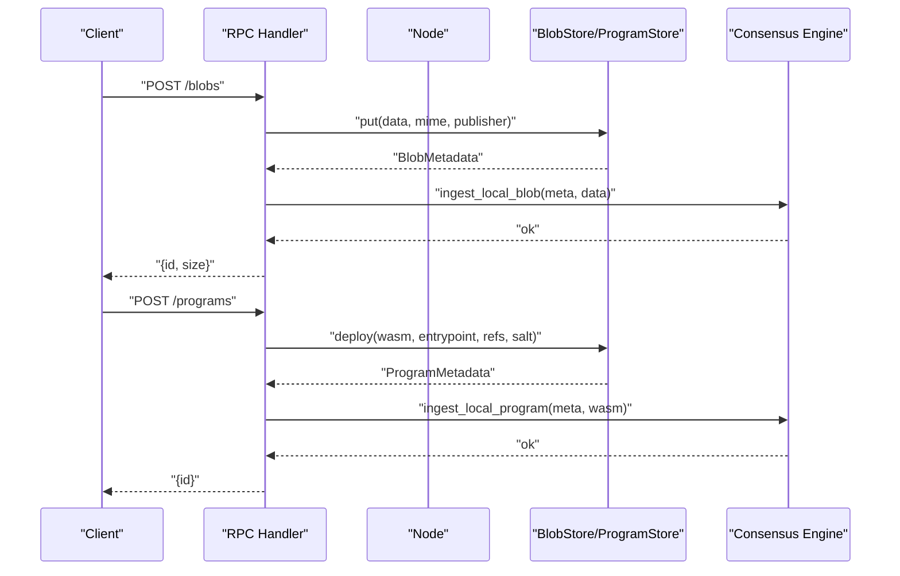
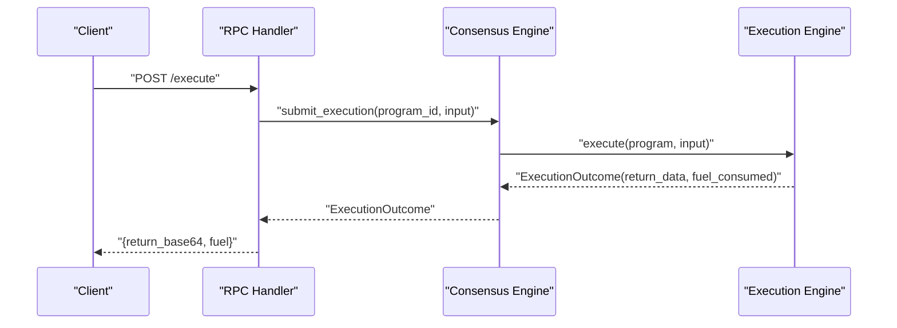
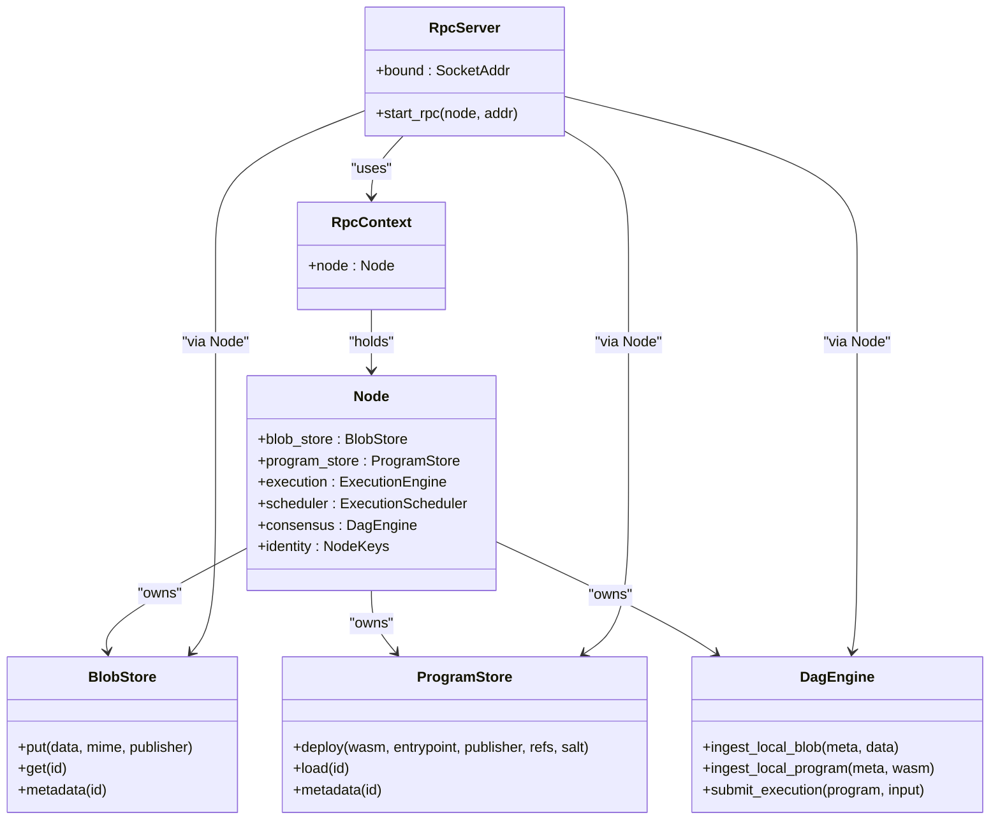

# RPC API Reference

<cite>
**Referenced Files in This Document**
- [rpc/mod.rs](file://src/rpc/mod.rs)
- [node.rs](file://src/node.rs)
- [types.rs](file://src/types.rs)
- [storage/blob_store.rs](file://src/storage/blob_store.rs)
- [execution/program_store.rs](file://src/execution/program_store.rs)
- [consensus/mod.rs](file://src/consensus/mod.rs)
- [network/service.rs](file://src/network/service.rs)
- [cli.rs](file://src/cli.rs)
</cite>

## Table of Contents
1. [Introduction](#introduction)
2. [Project Structure](#project-structure)
3. [Core Components](#core-components)
4. [Architecture Overview](#architecture-overview)
5. [Detailed Component Analysis](#detailed-component-analysis)
6. [Dependency Analysis](#dependency-analysis)
7. [Performance Considerations](#performance-considerations)
8. [Troubleshooting Guide](#troubleshooting-guide)
9. [Conclusion](#conclusion)

## Introduction
This document provides a comprehensive API reference for the axum-based RPC endpoints exposed by the node. It covers all endpoints, their request/response schemas, status codes, error handling, and the internal relationships with node components such as blob_store, program_store, and consensus.

Security considerations include the default localhost binding behavior and recommended operational practices.

## Project Structure
The RPC server is implemented as an axum router mounted under the RpcServer abstraction. It delegates to Node-owned stores and engines for persistence and execution, and integrates with the consensus engine for broadcasting and synchronization.

**Diagram sources**
- [rpc/mod.rs](file://src/rpc/mod.rs#L62-L96)
- [node.rs](file://src/node.rs#L23-L35)

**Section sources**
- [rpc/mod.rs](file://src/rpc/mod.rs#L62-L96)
- [node.rs](file://src/node.rs#L23-L35)

## Core Components
- RpcServer: Starts the axum server and binds to a socket address, exposing routes for health, blobs, programs, and execution.
- RpcContext: Holds an Arc<Node> to access blob_store, program_store, consensus, and identity.
- Node: Aggregates storage and execution engines and exposes them to RPC handlers.

Key behaviors:
- Health endpoint returns a simple text response.
- Blob upload persists data and ingests into consensus for propagation.
- Program deployment persists metadata and WASM bytes and ingests into consensus.
- Execution submits an operation to consensus and returns base64-encoded results plus fuel consumption.

**Section sources**
- [rpc/mod.rs](file://src/rpc/mod.rs#L14-L24)
- [rpc/mod.rs](file://src/rpc/mod.rs#L62-L96)
- [node.rs](file://src/node.rs#L23-L35)

## Architecture Overview
The RPC endpoints interact with internal components as follows:

**Diagram sources**
- [rpc/mod.rs](file://src/rpc/mod.rs#L98-L174)
- [storage/blob_store.rs](file://src/storage/blob_store.rs#L18-L46)
- [execution/program_store.rs](file://src/execution/program_store.rs#L16-L41)
- [consensus/mod.rs](file://src/consensus/mod.rs#L260-L292)

## Detailed Component Analysis

### Endpoint: GET /health
- Description: Health check endpoint that returns a simple text response.
- Method and path: GET /health
- Response: Text "ok" with status 200.
- Notes: No request body; useful for liveness probes.

Status codes:
- 200 OK

Example:
- curl -X GET http://localhost:8080/health

**Section sources**
- [rpc/mod.rs](file://src/rpc/mod.rs#L62-L66)

### Endpoint: POST /blobs
- Description: Upload a blob payload. The uploaded data is persisted and propagated across the network.
- Method and path: POST /blobs
- Request schema:
  - data_base64: string (required)
  - mime: string | null (optional)
- Response schema:
  - id: hex-string (32-byte identifier)
  - size: number (bytes)
- Status codes:
  - 200 OK on success
  - 400 Bad Request on invalid base64 or invalid request shape
  - 500 Internal Server Error on internal failures
- Error handling:
  - Base64 decoding errors return 400 with error text.
  - Storage or consensus errors return 500 with error text.
- Example curl:
  - curl -X POST http://localhost:8080/blobs -H "Content-Type: application/json" -d '{"data_base64": "SGVsbG8=", "mime": "text/plain"}'

Processing flow:
- Decode base64 to bytes.
- Persist to BlobStore and obtain metadata.
- Ingest into consensus for propagation.

**Section sources**
- [rpc/mod.rs](file://src/rpc/mod.rs#L25-L35)
- [rpc/mod.rs](file://src/rpc/mod.rs#L98-L120)
- [storage/blob_store.rs](file://src/storage/blob_store.rs#L18-L46)
- [consensus/mod.rs](file://src/consensus/mod.rs#L260-L271)

### Endpoint: GET /blobs/{id}
- Description: Retrieve a blob by its hex-encoded BlobId.
- Method and path: GET /blobs/{id}
- Path parameters:
  - id: hex-string (32-byte BlobId)
- Response: Binary payload (raw bytes) with status 200.
- Status codes:
  - 200 OK on success
  - 400 Bad Request on invalid hex encoding or wrong length
  - 404 Not Found when blob does not exist
  - 500 Internal Server Error on internal failures
- Error handling:
  - Hex parsing errors return 400 with error text.
  - Missing blob returns 404 with error text.
- Example curl:
  - curl -o blob.bin http://localhost:8080/blobs/<hex-id>

Processing flow:
- Parse hex to BlobId.
- Load from BlobStore; return bytes on success.

**Section sources**
- [rpc/mod.rs](file://src/rpc/mod.rs#L37-L43)
- [rpc/mod.rs](file://src/rpc/mod.rs#L122-L131)
- [storage/blob_store.rs](file://src/storage/blob_store.rs#L78-L104)

### Endpoint: POST /programs
- Description: Deploy a WASM program with entrypoint, blob references, and optional salt.
- Method and path: POST /programs
- Request schema:
  - wasm_base64: string (required)
  - entrypoint: string (required)
  - blob_refs: string[] (required; hex-encoded BlobIds)
  - salt_base64: string | null (optional; defaults to random)
- Response schema:
  - id: hex-string (32-byte ProgramId)
- Status codes:
  - 200 OK on success
  - 400 Bad Request on invalid base64, invalid hex ids, or invalid request shape
  - 500 Internal Server Error on internal failures
- Error handling:
  - Base64 decoding errors return 400 with error text.
  - Hex parsing errors return 400 with error text.
  - Storage or consensus errors return 500 with error text.
- Example curl:
  - curl -X POST http://localhost:8080/programs -H "Content-Type: application/json" -d '{"wasm_base64": "<base64>", "entrypoint": "onvm_main", "blob_refs": ["<hex-blob-id>"], "salt_base64": null}'

Processing flow:
- Decode base64 WASM and optional salt.
- Parse blob_refs to BlobIds.
- Persist to ProgramStore and obtain metadata.
- Ingest into consensus for propagation.

**Section sources**
- [rpc/mod.rs](file://src/rpc/mod.rs#L37-L43)
- [rpc/mod.rs](file://src/rpc/mod.rs#L133-L174)
- [execution/program_store.rs](file://src/execution/program_store.rs#L16-L41)
- [consensus/mod.rs](file://src/consensus/mod.rs#L273-L292)

### Endpoint: GET /programs/{id}
- Description: Retrieve program metadata by hex-encoded ProgramId.
- Method and path: GET /programs/{id}
- Path parameters:
  - id: hex-string (32-byte ProgramId)
- Response schema:
  - id: hex-string
  - publisher: hex-string
  - size: number (bytes)
  - entrypoint: string
  - blob_refs: hex-string[] (blob references)
- Status codes:
  - 200 OK on success
  - 400 Bad Request on invalid hex encoding or wrong length
  - 404 Not Found when program does not exist
  - 500 Internal Server Error on internal failures
- Error handling:
  - Hex parsing errors return 400 with error text.
  - Missing program returns 404 with error text.
- Example curl:
  - curl http://localhost:8080/programs/<hex-id>

Processing flow:
- Parse hex to ProgramId.
- Load metadata from ProgramStore; return structured JSON.

**Section sources**
- [rpc/mod.rs](file://src/rpc/mod.rs#L45-L49)
- [rpc/mod.rs](file://src/rpc/mod.rs#L176-L192)
- [execution/program_store.rs](file://src/execution/program_store.rs#L74-L82)

### Endpoint: POST /execute
- Description: Execute a deployed program with an input payload.
- Method and path: POST /execute
- Request schema:
  - program_id: hex-string (32-byte ProgramId)
  - input_base64: string (required)
- Response schema:
  - return_base64: string (base64-encoded program output)
  - fuel: number (fuel consumed)
- Status codes:
  - 200 OK on success
  - 400 Bad Request on invalid base64 or invalid hex id
  - 500 Internal Server Error on internal failures
- Error handling:
  - Base64 decoding errors return 400 with error text.
  - Hex parsing errors return 400 with error text.
  - Missing program metadata returns 500 with error text.
- Example curl:
  - curl -X POST http://localhost:8080/execute -H "Content-Type: application/json" -d '{"program_id": "<hex-id>", "input_base64": "<base64-input>"}'

Processing flow:
- Parse program_id to ProgramId.
- Decode input base64 to bytes.
- Submit execution to consensus engine; return base64-encoded result and fuel.

**Diagram sources**
- [rpc/mod.rs](file://src/rpc/mod.rs#L50-L60)
- [rpc/mod.rs](file://src/rpc/mod.rs#L194-L213)
- [consensus/mod.rs](file://src/consensus/mod.rs#L194-L258)

**Section sources**
- [rpc/mod.rs](file://src/rpc/mod.rs#L50-L60)
- [rpc/mod.rs](file://src/rpc/mod.rs#L194-L213)
- [consensus/mod.rs](file://src/consensus/mod.rs#L194-L258)

## Dependency Analysis
The RPC layer depends on Node-owned stores and engines. The Node aggregates BlobStore, ProgramStore, ExecutionEngine, ExecutionScheduler, and Consensus. The consensus engine coordinates propagation and synchronization across the network.

**Diagram sources**
- [rpc/mod.rs](file://src/rpc/mod.rs#L62-L96)
- [node.rs](file://src/node.rs#L23-L35)
- [storage/blob_store.rs](file://src/storage/blob_store.rs#L18-L46)
- [execution/program_store.rs](file://src/execution/program_store.rs#L16-L41)
- [consensus/mod.rs](file://src/consensus/mod.rs#L260-L292)

**Section sources**
- [rpc/mod.rs](file://src/rpc/mod.rs#L62-L96)
- [node.rs](file://src/node.rs#L23-L35)
- [storage/blob_store.rs](file://src/storage/blob_store.rs#L18-L46)
- [execution/program_store.rs](file://src/execution/program_store.rs#L16-L41)
- [consensus/mod.rs](file://src/consensus/mod.rs#L260-L292)

## Performance Considerations
- Blob uploads are chunked and stored with Merkle roots; large payloads increase CPU and disk I/O during hashing and persistence.
- Program deployments store both metadata and WASM bytes; repeated deployments with identical content still incur storage overhead.
- Execution submissions trigger consensus ingestion and broadcast; network latency affects round-trip time.
- Base64 encoding/decoding adds overhead; keep payloads compact when possible.

[No sources needed since this section provides general guidance]

## Troubleshooting Guide
Common issues and resolutions:
- 400 Bad Request on upload/deploy/execute:
  - Verify base64 encoding is valid and complete.
  - Ensure hex-encoded IDs are exactly 64 characters (32 bytes).
- 404 Not Found on blob or program retrieval:
  - Confirm the resource was previously uploaded/deployed.
  - Check that the node has synchronized the resource (especially in metadata-only sync modes).
- 500 Internal Server Error:
  - Inspect node logs for storage or consensus errors.
  - Retry after verifying node connectivity and disk availability.

Operational tips:
- The RPC server binds to the configured address/port; ensure firewall rules allow connections.
- Use the CLI commands to validate endpoints and inspect resources.

**Section sources**
- [rpc/mod.rs](file://src/rpc/mod.rs#L102-L120)
- [rpc/mod.rs](file://src/rpc/mod.rs#L122-L131)
- [rpc/mod.rs](file://src/rpc/mod.rs#L133-L174)
- [rpc/mod.rs](file://src/rpc/mod.rs#L176-L192)
- [rpc/mod.rs](file://src/rpc/mod.rs#L194-L213)
- [consensus/mod.rs](file://src/consensus/mod.rs#L194-L258)

## Security Considerations
- Binding behavior:
  - The RPC server attempts to bind to the specified port and increments the port until successful if the initial port is unavailable.
  - The CLI defaults to localhost-only binding for convenience; ensure the node is not exposed to untrusted networks without additional protections.
- Recommendations:
  - Run behind a reverse proxy or firewall to restrict access.
  - Use TLS termination at the proxy level.
  - Limit exposure to trusted networks.

**Section sources**
- [rpc/mod.rs](file://src/rpc/mod.rs#L73-L95)
- [cli.rs](file://src/cli.rs#L137-L171)

## Relationship to Internal Node Components
- Blob lifecycle:
  - Upload: BlobStore.put persists metadata and chunks; consensus ingests for propagation.
  - Retrieval: BlobStore.get reconstructs data from persisted chunks and validates integrity.
- Program lifecycle:
  - Deployment: ProgramStore.deploy persists metadata and WASM; consensus ingests for propagation.
  - Inspection: ProgramStore.metadata returns structured metadata.
- Execution:
  - Submitting execution triggers consensus to execute the program, persist outputs, and broadcast results.

**Section sources**
- [storage/blob_store.rs](file://src/storage/blob_store.rs#L18-L46)
- [storage/blob_store.rs](file://src/storage/blob_store.rs#L78-L104)
- [execution/program_store.rs](file://src/execution/program_store.rs#L16-L41)
- [execution/program_store.rs](file://src/execution/program_store.rs#L74-L82)
- [consensus/mod.rs](file://src/consensus/mod.rs#L194-L258)
- [consensus/mod.rs](file://src/consensus/mod.rs#L260-L292)
- [network/service.rs](file://src/network/service.rs#L22-L41)

## Data Types and Encoding
- Hex-encoded identifiers:
  - BlobId, ProgramId, NodeId, BlockId are 32-byte arrays serialized as lowercase hex strings.
- Base64 encoding:
  - Request/response payloads containing binary data are base64-encoded to ensure safe transport over JSON APIs.

**Section sources**
- [types.rs](file://src/types.rs#L1-L20)
- [types.rs](file://src/types.rs#L55-L109)
- [rpc/mod.rs](file://src/rpc/mod.rs#L102-L120)
- [rpc/mod.rs](file://src/rpc/mod.rs#L133-L174)
- [rpc/mod.rs](file://src/rpc/mod.rs#L194-L213)

## Conclusion
The RPC API provides a straightforward interface for uploading blobs, deploying programs, retrieving metadata, and executing programs. It integrates tightly with node components for persistence and consensus, ensuring reliable propagation and synchronization across the network. Follow the documented schemas and status codes to integrate reliably, and apply appropriate security measures to protect the RPC surface.