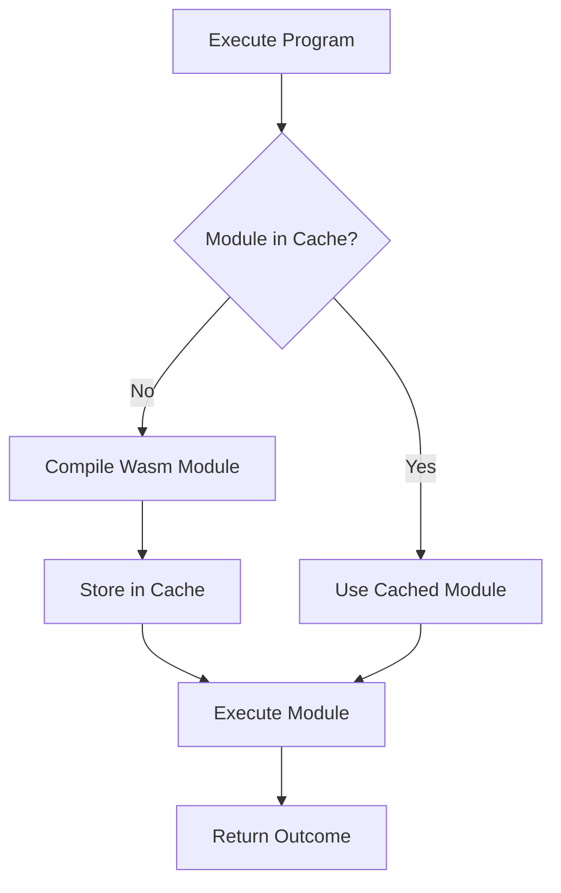
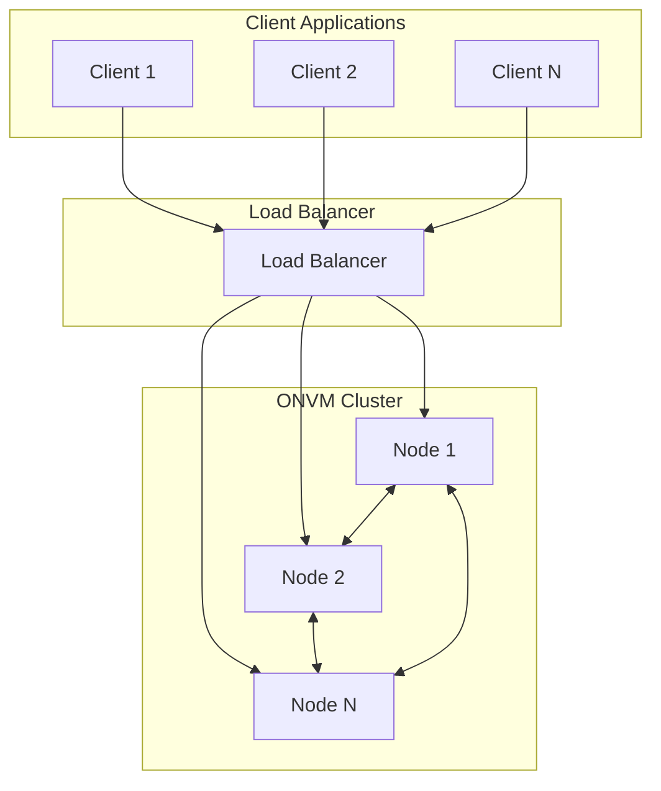
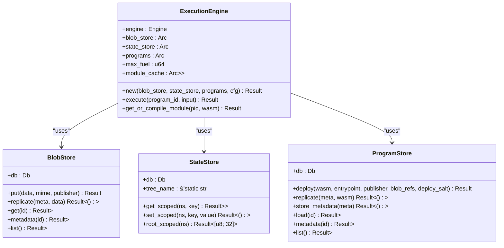
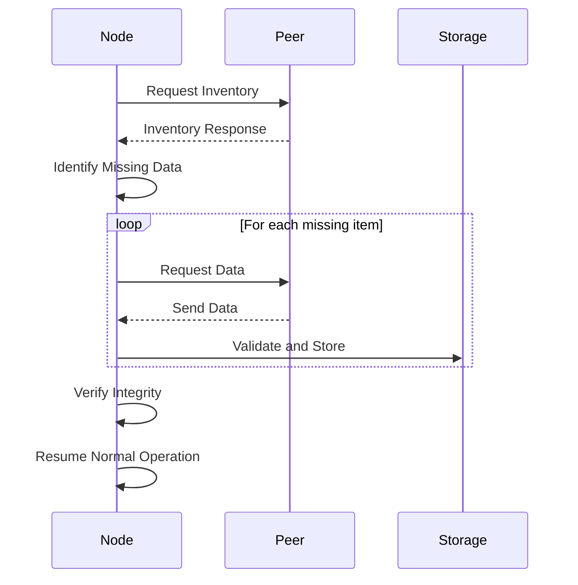

# Advanced Topics

<cite>
**Referenced Files in This Document**   
- [scheduler.rs](file://src/execution/scheduler.rs)
- [runtime.rs](file://src/execution/runtime.rs)
- [program_store.rs](file://src/execution/program_store.rs)
- [blob_store.rs](file://src/storage/blob_store.rs)
- [state_store.rs](file://src/storage/state_store.rs)
- [node.rs](file://src/node.rs)
- [config.rs](file://src/config/mod.rs)
- [cli.rs](file://src/cli.rs)
- [Cargo.toml](file://Cargo.toml)
</cite>

## Table of Contents
1. [Performance Tuning](#performance-tuning)
2. [Scaling Strategies](#scaling-strategies)
3. [Customization Points](#customization-points)
4. [High-Throughput and Low-Latency Configurations](#high-throughput-and-low-latency-configurations)
5. [Monitoring and Metrics Integration](#monitoring-and-metrics-integration)
6. [Disaster Recovery](#disaster-recovery)
7. [Enterprise Deployment Patterns](#enterprise-deployment-patterns)

## Performance Tuning

The ONVM platform implements a sophisticated performance optimization framework centered around Wasmtime configuration, sled database tuning, and Tokio runtime settings. The execution scheduler in `src/execution/scheduler.rs` manages concurrent Wasm executions through a parallelism-aware design that automatically scales to available system resources.

The `ExecutionScheduler` struct uses `std::thread::available_parallelism()` to determine optimal worker count, with a minimum of 2 workers to ensure efficient resource utilization even on single-core systems. It leverages `tokio::task::spawn_blocking` to prevent async executor thread starvation during CPU-intensive Wasm execution, allowing thousands of parallel executions without blocking the event loop.

Wasmtime is configured with several performance-critical settings:
- Fuel consumption is enabled to meter execution and prevent infinite loops
- Memory guard sizes are set to zero for optimal performance in trusted environments
- Backtrace details are disabled in production to reduce overhead
- Module compilation caching is implemented through an `RwLock<HashMap<ProgramId, Module>>` that stores compiled Wasm modules for reuse

The compilation cache in `ExecutionEngine::get_or_compile_module` provides significant performance benefits by avoiding recompilation of frequently used programs. When a program is executed, the system first checks the cache for an existing compiled module before performing compilation, reducing execution latency for repeated calls.



**Diagram sources**
- [runtime.rs](file://src/execution/runtime.rs#L185-L197)

**Section sources**
- [scheduler.rs](file://src/execution/scheduler.rs#L1-L40)
- [runtime.rs](file://src/execution/runtime.rs#L1-L377)

## Scaling Strategies

ONVM supports multiple scaling strategies to handle increased load and ensure high availability. The architecture enables horizontal scaling through multiple node deployments, load balancing of execution requests, and sharding considerations for data distribution.

Horizontal scaling is achieved by deploying multiple ONVM nodes that form a peer-to-peer network using libp2p. Each node maintains its own execution environment while synchronizing program metadata, blob data, and execution results across the network. The `NodeConfig` struct in `src/node.rs` defines the configuration parameters for node clustering, including data directory, network listening address, RPC binding, and minimum peer requirements.

Load balancing is implemented through the gossipsub protocol, which distributes program execution requests across available nodes. The network automatically discovers peers through mDNS and maintains connectivity via TCP with Yamux multiplexing. For production deployments, load balancers can be configured to distribute incoming execution requests across multiple nodes based on various strategies:

- Round-robin distribution for uniform load
- Least connections for optimal resource utilization
- IP hash for session persistence
- Weighted distribution based on node capacity

Sharding considerations are addressed through the namespace-scoped state storage system. The `StateStore::root_scoped` method implements a Merkle tree-based state root calculation that allows for efficient state verification and synchronization. Each program's state is isolated within its namespace, enabling horizontal partitioning of state data across nodes.



**Diagram sources**
- [node.rs](file://src/node.rs#L1-L163)
- [network/service.rs](file://src/network/service.rs#L1-L262)

**Section sources**
- [node.rs](file://src/node.rs#L1-L163)
- [network/service.rs](file://src/network/service.rs#L1-L262)

## Customization Points

The ONVM platform provides several customization points that allow developers to extend functionality and integrate with existing systems. These include pluggable storage backends, custom host functions, and extensible libp2p protocols.

Pluggable storage backends are supported through the abstracted storage interfaces in `src/storage/mod.rs`. The `BlobStore` and `StateStore` components are designed with dependency injection in mind, allowing replacement of the default sled database implementation with alternative storage systems such as Redis, PostgreSQL, or cloud-based object storage. The `BlobStore::new` and `StateStore::new` constructors accept a `sled::Db` instance, enabling configuration of database settings like cache size, compaction strategies, and durability guarantees.

Custom host functions are implemented through Wasmtime's linker system, which allows Rust functions to be exposed to Wasm programs. The `attach_blob_host_functions` and `attach_state_host_functions` in `src/execution/runtime.rs` demonstrate this capability by exposing blob storage and state management operations to Wasm programs. Developers can extend this pattern to expose additional functionality:

- Database access functions
- External API integration
- Cryptographic operations
- Machine learning inference
- File system operations (in trusted environments)

The libp2p protocol stack is extensible through the request-response and pubsub systems. Custom protocols can be added to handle specialized message types or optimize specific communication patterns. The existing implementation uses:
- Gossipsub for topic-based message distribution
- Kademlia for distributed hash table functionality
- Request-response for direct peer communication
- Noise for encrypted connections
- Yamux for stream multiplexing



**Diagram sources**
- [runtime.rs](file://src/execution/runtime.rs#L11-L18)
- [blob_store.rs](file://src/storage/blob_store.rs#L8-L10)
- [state_store.rs](file://src/storage/state_store.rs#L6-L8)
- [program_store.rs](file://src/execution/program_store.rs#L6-L8)

**Section sources**
- [runtime.rs](file://src/execution/runtime.rs#L1-L377)
- [blob_store.rs](file://src/storage/blob_store.rs#L1-L185)
- [state_store.rs](file://src/storage/state_store.rs#L1-L80)
- [program_store.rs](file://src/execution/program_store.rs#L1-L96)

## High-Throughput and Low-Latency Configurations

For high-throughput deployments, ONVM can be configured to maximize execution performance through several optimization techniques. The default configuration balances performance and resource usage, but production deployments can be tuned for specific workloads.

High-throughput configurations should consider:
- Increasing the Tokio thread pool size to match available CPU cores
- Configuring Wasmtime with pooling allocator for reduced memory allocation overhead
- Optimizing sled database settings for write-heavy workloads
- Using SSD storage for faster I/O operations
- Disabling unnecessary logging and monitoring in production

The pooling allocator in Wasmtime can be enabled by modifying the `Config` in `ExecutionEngine::new`:

```rust
let mut config = Config::new();
config.allocation_strategy(InstanceAllocationStrategy::Pooling);
```

This reduces the overhead of instance creation and destruction, which is particularly beneficial for workloads with frequent short-lived executions.

For low-latency configurations, the following optimizations are recommended:
- Reducing the Wasm fuel limit to prevent long-running executions
- Implementing execution timeouts at the application level
- Using in-memory databases for state storage
- Deploying nodes in close network proximity to clients
- Optimizing network settings for minimal latency

The `ExecutionConfig` struct allows tuning of the maximum fuel parameter, which directly impacts execution time limits. Lower fuel values prevent resource-intensive programs from monopolizing execution resources, ensuring predictable latency for all operations.


**Diagram sources**
- [runtime.rs](file://src/execution/runtime.rs#L79-L183)

**Section sources**
- [runtime.rs](file://src/execution/runtime.rs#L30-L39)
- [config.rs](file://src/config/mod.rs#L36-L40)

## Monitoring and Metrics Integration

ONVM integrates with standard monitoring systems through tracing and metrics collection. The platform uses the `tracing` crate for structured logging and diagnostic information, which can be exported to various monitoring backends.

Key metrics that should be monitored in production deployments include:
- Execution latency (p50, p95, p99)
- Requests per second
- Error rates
- Memory usage
- CPU utilization
- Network I/O
- Disk I/O
- Cache hit rates

The tracing system is initialized in `src/cli.rs` with configurable log levels:

```rust
let env_filter = EnvFilter::try_from_default_env()
    .unwrap_or_else(|_| EnvFilter::new("info,libp2p_mdns=off"));
tracing_subscriber::fmt().with_env_filter(env_filter).init();
```

This allows operators to adjust verbosity based on operational needs, from minimal production logging to detailed debug tracing for troubleshooting.

Custom metrics can be added to track business-specific KPIs or monitor the performance of specific programs. The architecture supports integration with popular monitoring systems:
- Prometheus for metrics collection and alerting
- Grafana for visualization
- Jaeger or Zipkin for distributed tracing
- ELK stack for log aggregation

The `ExecutionOutcome` struct includes fuel consumption data, which serves as a proxy for computational cost and can be used for rate limiting or usage-based billing.

**Section sources**
- [cli.rs](file://src/cli.rs#L110-L112)
- [runtime.rs](file://src/execution/runtime.rs#L20-L27)

## Disaster Recovery

The ONVM platform includes several features to support disaster recovery and ensure data durability. These mechanisms protect against data loss and enable rapid recovery from failures.

Backup strategies should include:
- Regular snapshots of the sled database directory
- Offsite replication of program and blob data
- Versioned backups with retention policies
- Automated backup verification
- Regular restore testing

The sled database used for storage is designed for durability, with write-ahead logging and periodic snapshots. The `flush()` calls in storage operations ensure that data is persisted to disk before acknowledging operations.

Identity recovery is supported through the node key management system. The `NodeKeys::load_or_generate` method in `src/crypto/keys.rs` handles both loading existing keys and generating new ones, with private keys stored in the data directory. For production deployments, consider:
- Regular backups of identity files
- Hardware security modules for key storage
- Multi-signature schemes for critical operations
- Key rotation procedures

Chain resynchronization is handled automatically by the consensus engine. When a node restarts or joins the network, it:
1. Requests inventory from peers
2. Identifies missing programs, blobs, and executions
3. Downloads missing components
4. Verifies data integrity
5. Rebuilds local state

The `SyncMan::await_initial_sync` method implements this process with configurable timeout settings to handle network partitions or slow peers.



**Diagram sources**
- [syncer/mod.rs](file://src/syncer/mod.rs#L1-L40)
- [consensus/mod.rs](file://src/consensus/mod.rs#L799-L836)

**Section sources**
- [syncer/mod.rs](file://src/syncer/mod.rs#L1-L40)
- [crypto/keys.rs](file://src/crypto/keys.rs#L30-L72)

## Enterprise Deployment Patterns

Enterprise deployments of ONVM should follow several best practices to ensure reliability, security, and maintainability. These patterns address the unique requirements of production environments.

High-availability clusters should be deployed with:
- Multiple nodes across availability zones
- Automated failover mechanisms
- Health checks and liveness probes
- Rolling update strategies
- Blue-green deployment patterns

Security considerations include:
- Network segmentation and firewalls
- TLS termination for RPC endpoints
- Rate limiting and DDoS protection
- Regular security audits
- Vulnerability scanning of Wasm programs

Performance monitoring should be implemented with:
- Real-time dashboards for key metrics
- Alerting on SLO violations
- Capacity planning based on usage trends
- Load testing before major releases

The CLI interface in `src/cli.rs` provides essential tools for operational management, including node initialization, program deployment, and execution. Enterprise deployments should automate these operations through CI/CD pipelines and infrastructure-as-code practices.

Configuration management should use the TOML-based configuration system, with environment-specific configuration files and secure handling of secrets. The `OnvmConfig::write_to` method enables programmatic configuration generation.

For large-scale deployments, consider:
- Sharding by program type or customer
- Dedicated nodes for specific workloads
- Hierarchical load balancing
- Content delivery networks for blob distribution
- Edge computing deployments for low-latency requirements

**Section sources**
- [cli.rs](file://src/cli.rs#L24-L300)
- [config.rs](file://src/config/mod.rs#L113-L139)
- [Cargo.toml](file://Cargo.toml)