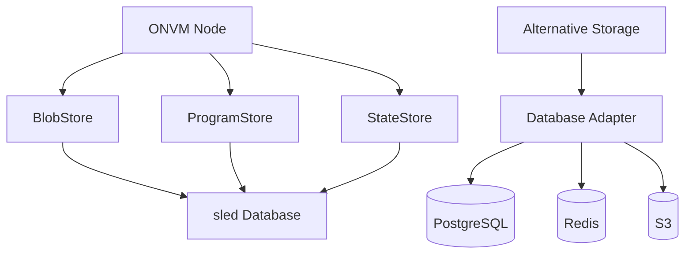
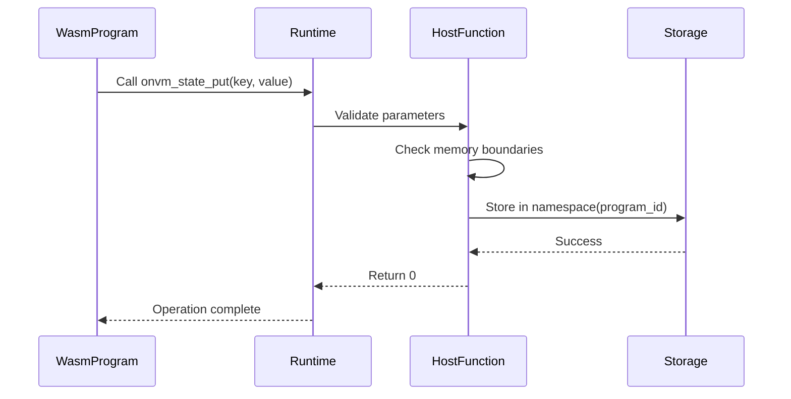
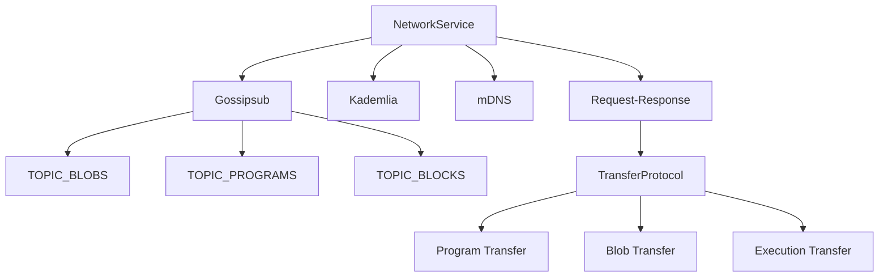
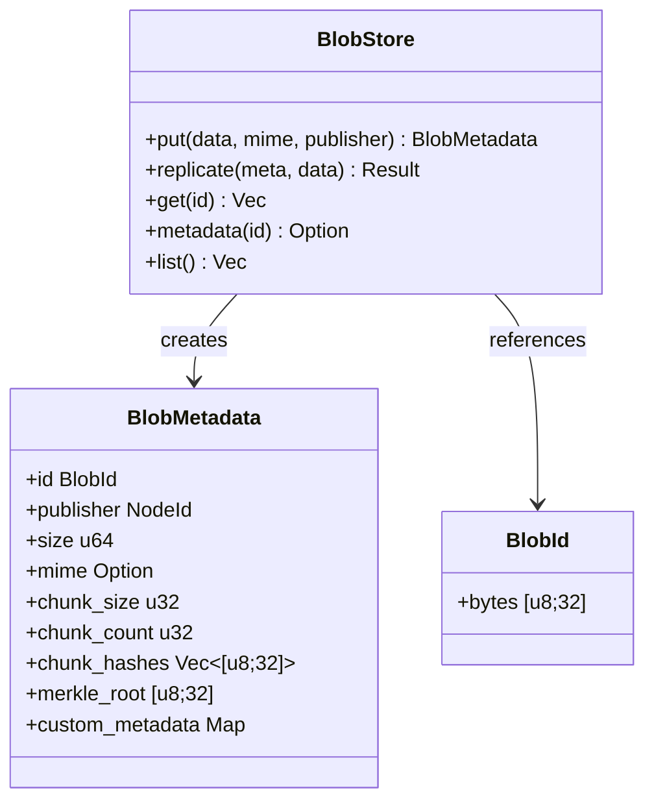
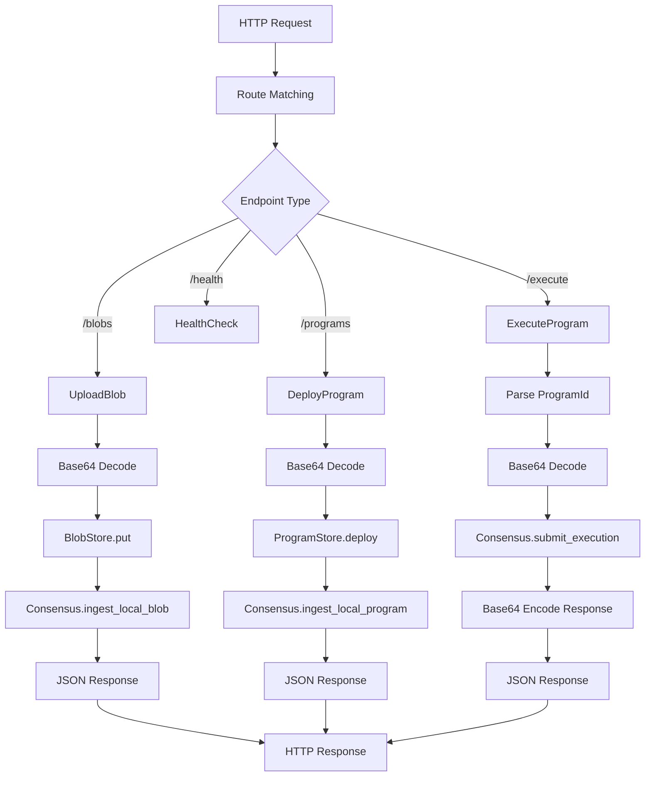

# Customization Points

<cite>
**Referenced Files in This Document**   
- [src/execution/runtime.rs](file://src/execution/runtime.rs)
- [src/storage/blob_store.rs](file://src/storage/blob_store.rs)
- [src/network/service.rs](file://src/network/service.rs)
- [src/storage/state_store.rs](file://src/storage/state_store.rs)
- [src/execution/program_store.rs](file://src/execution/program_store.rs)
- [src/node.rs](file://src/node.rs)
- [src/rpc/mod.rs](file://src/rpc/mod.rs)
</cite>

## Table of Contents
1. [Pluggable Storage Backend Architecture](#pluggable-storage-backend-architecture)
2. [Extending Host Functions for Wasm Programs](#extending-host-functions-for-wasm-programs)
3. [Customizing libp2p Protocols](#customizing-libp2p-protocols)
4. [Extending Blob Storage Interface](#extending-blob-storage-interface)
5. [Custom Program Loaders and Execution Monitors](#custom-program-loaders-and-execution-monitors)
6. [RPC Endpoint Extensions](#rpc-endpoint-extensions)
7. [Compatibility, Versioning, and Deployment](#compatibility-versioning-and-deployment)

## Pluggable Storage Backend Architecture

The ONVM platform implements a pluggable storage backend architecture centered around the sled database engine. The core storage components—BlobStore, ProgramStore, and StateStore—are designed with abstraction layers that allow for alternative storage implementations while maintaining compatibility with the core system.

The architecture follows a modular pattern where each storage component encapsulates its data operations through well-defined interfaces. The BlobStore manages large binary objects with built-in chunking and Merkle tree verification, while the ProgramStore handles WASM program deployment and metadata management. The StateStore provides key-value storage for contract state with namespace isolation and cryptographic commitment through Merkle roots.

All storage components share a common dependency on the sled database, which serves as the primary persistence layer. The node initialization process in `node.rs` demonstrates how these components are instantiated with a shared database instance, enabling atomic operations across different storage domains. This design allows for potential replacement of the sled backend with alternative databases that provide similar transactional guarantees and key-value semantics.

**Diagram sources**
- [src/node.rs](file://src/node.rs#L45-L56)
- [src/storage/blob_store.rs](file://src/storage/blob_store.rs#L13-L16)
- [src/execution/program_store.rs](file://src/execution/program_store.rs#L11-L14)
- [src/storage/state_store.rs](file://src/storage/state_store.rs#L12-L15)

**Section sources**
- [src/node.rs](file://src/node.rs#L43-L56)
- [src/storage/blob_store.rs](file://src/storage/blob_store.rs#L8-L16)
- [src/execution/program_store.rs](file://src/execution/program_store.rs#L6-L14)
- [src/storage/state_store.rs](file://src/storage/state_store.rs#L6-L15)

## Extending Host Functions for Wasm Programs

The ONVM platform extends Wasm program capabilities through host functions implemented in `src/execution/runtime.rs`. The ExecutionEngine exposes a set of host functions that Wasm programs can invoke to interact with the platform's storage and networking capabilities. These functions are registered with the Wasmtime runtime through the linker mechanism, providing a secure boundary between the sandboxed Wasm environment and the host system.

The current implementation provides two primary host function categories: blob operations (`onvm_blob_read`) and state operations (`onvm_state_put`, `onvm_state_get`, `onvm_state_root`). These functions follow a capability-based access control model where programs can only access resources within their designated namespace. The ExecutionContext maintains program-specific context including the program ID, which serves as the namespace for state operations.

Security considerations are paramount in host function design. Each function performs rigorous input validation, including memory boundary checks and error handling for invalid parameters. The functions return standardized error codes that map to specific failure modes, allowing Wasm programs to handle errors appropriately without exposing sensitive system information.

To extend the host function API, developers can implement additional `attach_*` functions that register new functions with the linker. These functions should follow the same security patterns as existing implementations, including proper memory access validation and capability-based access control.

**Diagram sources**
- [src/execution/runtime.rs](file://src/execution/runtime.rs#L199-L376)
- [src/storage/state_store.rs](file://src/storage/state_store.rs#L17-L26)
- [src/wasm_programs/kvstore/src/lib.rs](file://src/wasm_programs/kvstore/src/lib.rs#L148-L187)

**Section sources**
- [src/execution/runtime.rs](file://src/execution/runtime.rs#L199-L376)
- [src/storage/state_store.rs](file://src/storage/state_store.rs#L17-L40)
- [src/wasm_programs/kvstore/src/lib.rs](file://src/wasm_programs/kvstore/src/lib.rs#L75-L187)

## Customizing libp2p Protocols

The network service in `src/network/service.rs` implements a comprehensive libp2p-based networking stack with multiple protocol layers for different communication patterns. The architecture combines gossipsub for broadcast messaging, Kademlia for distributed hash table operations, mDNS for local peer discovery, and a custom request-response protocol for direct peer-to-peer transfers.

The NetworkService exposes customization points through its modular design. The Behaviour struct composes multiple libp2p network behaviors, allowing for the addition or replacement of protocol implementations. The current implementation defines three primary gossipsub topics (blobs, programs, and blocks) that could be extended to support additional data types or application-specific messaging.

Customization of libp2p protocols can be achieved by modifying the swarm configuration during initialization. The start method in NetworkService demonstrates how different protocol handlers are registered with the swarm. Developers can extend this by adding new request-response protocols, custom stream multiplexers, or alternative routing algorithms.

The network event system provides a clean abstraction for handling incoming messages and connection events. The NetworkHandle interface exposes methods for publishing messages, managing peer discovery, and handling direct transfers, enabling higher-level applications to interact with the network without dealing with low-level protocol details.

**Diagram sources**
- [src/network/service.rs](file://src/network/service.rs#L202-L253)
- [src/network/service.rs](file://src/network/service.rs#L213-L264)

**Section sources**
- [src/network/service.rs](file://src/network/service.rs#L202-L439)

## Extending Blob Storage Interface

The BlobStore interface in `src/storage/blob_store.rs` provides a foundation for extending blob storage with custom metadata or indexing strategies. The current implementation includes basic metadata such as MIME type, chunking information, and cryptographic hashes, but the design allows for extension through several mechanisms.

The BlobMetadata structure contains extensible fields that can be enhanced with additional information such as content indexing, access control lists, or lifecycle policies. The put and replicate methods validate blob integrity through Merkle tree verification, ensuring data consistency across the network.

To implement custom indexing strategies, developers can extend the BlobStore by adding secondary indexing structures in the sled database. For example, creating additional trees for content-based indexing, tag-based categorization, or temporal access patterns. The list method provides a foundation for querying blob metadata, which can be enhanced with filtering and pagination capabilities.

The chunking mechanism (default 1MB chunks) can be customized based on access patterns or storage requirements. Applications with different performance characteristics might benefit from smaller chunks for random access or larger chunks for sequential streaming.

**Diagram sources**
- [src/storage/blob_store.rs](file://src/storage/blob_store.rs#L8-L143)
- [src/types.rs](file://src/types.rs#L8-L10)

**Section sources**
- [src/storage/blob_store.rs](file://src/storage/blob_store.rs#L8-L143)
- [src/types.rs](file://src/types.rs#L8-L10)

## Custom Program Loaders and Execution Monitors

The ONVM platform supports customization of program loading and execution monitoring through its modular architecture. The ProgramStore component handles program deployment and retrieval, providing hooks for custom loading logic. The ExecutionEngine manages program execution with fuel-based resource limiting and outcome tracking.

Custom program loaders can be implemented by extending the ProgramStore interface to support additional program formats, verification mechanisms, or loading strategies. For example, a loader could integrate with external registries, implement content-addressable storage with IPFS, or provide differential loading for program updates.

Execution monitoring can be enhanced by extending the ExecutionOutcome structure to include additional telemetry data such as memory usage patterns, syscall frequency, or network activity. The current implementation tracks fuel consumption and state modifications, but additional metrics could be collected for performance analysis or billing purposes.

The module cache in ExecutionEngine provides optimization for frequently executed programs, which can be extended with eviction policies, pre-compilation strategies, or distributed caching mechanisms.

**Section sources**
- [src/execution/program_store.rs](file://src/execution/program_store.rs#L6-L95)
- [src/execution/runtime.rs](file://src/execution/runtime.rs#L11-L377)
- [src/types.rs](file://src/types.rs#L20-L31)

## RPC Endpoint Extensions

The RPC interface in `src/rpc/mod.rs` provides a REST-like API for interacting with the ONVM node. The current implementation exposes endpoints for blob management, program deployment, execution, and status queries. These endpoints follow a consistent pattern of request/response serialization using JSON and base64 encoding for binary data.

The RPC system can be extended by adding new route handlers to the Router in the start_rpc function. New endpoints should follow the existing pattern of state extraction, request deserialization, business logic invocation, and response serialization. The RpcContext provides access to the node's core components, enabling new endpoints to interact with storage, execution, and networking systems.

Security considerations for RPC extensions include input validation, rate limiting, and authentication mechanisms. The current implementation assumes a trusted network environment, but production deployments would benefit from authentication headers, TLS encryption, and access control policies.

**Diagram sources**
- [src/rpc/mod.rs](file://src/rpc/mod.rs#L64-L71)
- [src/rpc/mod.rs](file://src/rpc/mod.rs#L98-L241)

**Section sources**
- [src/rpc/mod.rs](file://src/rpc/mod.rs#L14-L241)

## Compatibility, Versioning, and Deployment

Maintaining compatibility with the core ONVM system while adding custom functionality requires careful consideration of versioning, testing, and deployment strategies. The platform's modular architecture facilitates extension while minimizing the risk of breaking changes.

Versioning should follow semantic versioning principles, with major version increments for breaking changes to interfaces, minor versions for backward-compatible additions, and patch versions for bug fixes. Custom components should declare their compatibility with specific ONVM core versions through dependency management.

Testing customized builds requires a comprehensive strategy that includes unit tests for individual components, integration tests for component interactions, and end-to-end tests for complete workflows. The existing codebase provides examples of testing patterns that should be followed for new functionality.

Deployment considerations include configuration management, monitoring, and rollback procedures. Customized nodes should maintain compatibility with the network protocol to ensure interoperability with standard nodes. Feature flags can be used to enable or disable custom functionality without requiring code changes.

The build process should preserve the existing toolchain and dependencies while incorporating custom components. Cargo workspaces or feature flags can be used to manage optional components without forking the entire codebase.

**Section sources**
- [Cargo.toml](file://Cargo.toml)
- [src/lib.rs](file://src/lib.rs)
- [src/main.rs](file://src/main.rs)