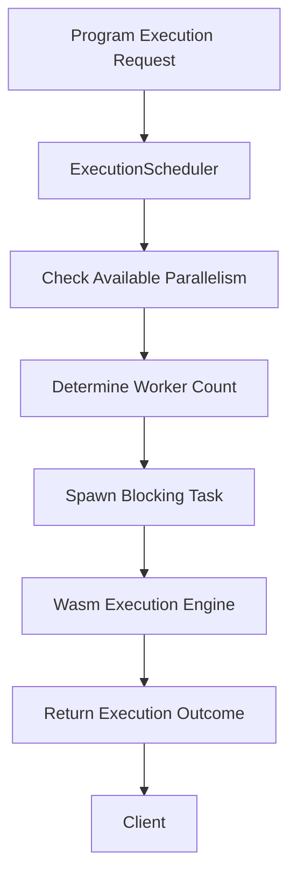
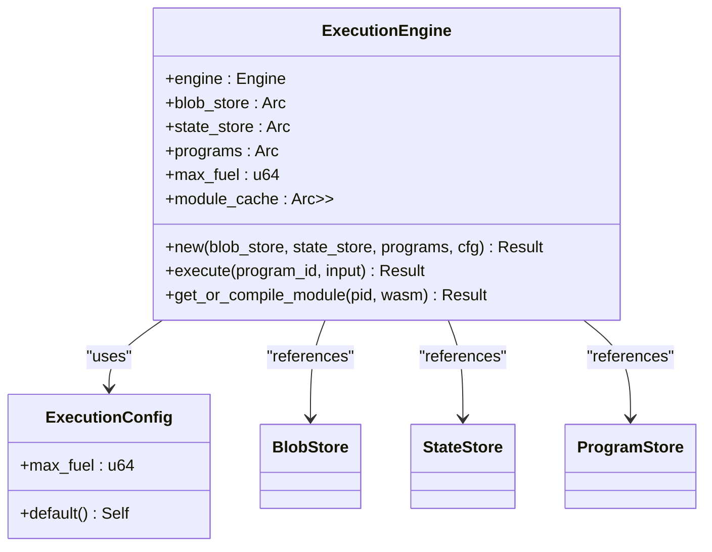
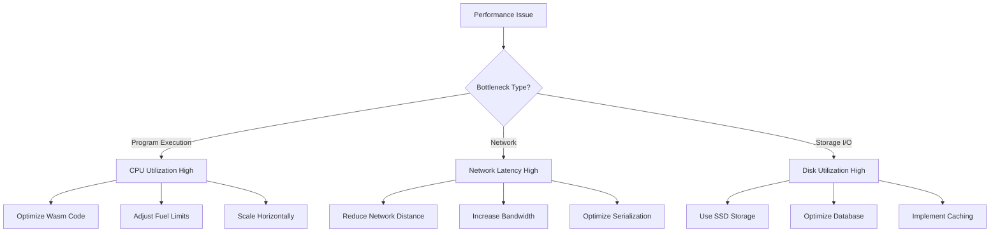

# Performance Tuning

<cite>
**Referenced Files in This Document**   
- [src/execution/scheduler.rs](file://src/execution/scheduler.rs)
- [src/execution/runtime.rs](file://src/execution/runtime.rs)
- [src/config/mod.rs](file://src/config/mod.rs)
- [src/storage/blob_store.rs](file://src/storage/blob_store.rs)
- [src/storage/state_store.rs](file://src/storage/state_store.rs)
- [src/node.rs](file://src/node.rs)
- [src/cli.rs](file://src/cli.rs)
- [Cargo.toml](file://Cargo.toml)
- [Cargo.lock](file://Cargo.lock)
</cite>

## Table of Contents
1. [Introduction](#introduction)
2. [Wasm Execution Management](#wasm-execution-management)
3. [Thread Pooling and Resource Allocation](#thread-pooling-and-resource-allocation)
4. [Wasmtime Configuration](#wasmtime-configuration)
5. [Sled Database Tuning](#sled-database-tuning)
6. [Tokio Runtime Configuration](#tokio-runtime-configuration)
7. [Configuration Examples](#configuration-examples)
8. [Benchmarking Methodologies](#benchmarking-methodologies)
9. [Common Bottlenecks and Mitigation](#common-bottlenecks-and-mitigation)
10. [Configuration Parameters](#configuration-parameters)

## Introduction
The ONVM system is designed for efficient execution of WebAssembly (Wasm) programs in a distributed environment. This document provides comprehensive guidance on performance tuning for the ONVM system, focusing on key components that impact system throughput, latency, and resource utilization. The analysis covers Wasm execution management, thread pooling strategies, Wasmtime configuration options, sled database tuning parameters, and Tokio runtime configuration. By understanding and optimizing these components, operators can achieve optimal performance for both high-throughput and low-latency scenarios.

## Wasm Execution Management
The ONVM system manages concurrent Wasm executions through a dedicated execution scheduler and engine architecture. The `ExecutionScheduler` component coordinates the execution of Wasm programs across multiple threads, ensuring efficient resource utilization while maintaining isolation between different program executions.

The execution model is designed to handle concurrent Wasm program invocations through a non-blocking, async-friendly interface that integrates with the Tokio runtime. When a program execution request is received, the scheduler dispatches the work to a blocking thread pool, preventing the async runtime from being blocked by potentially long-running Wasm computations.

**Section sources**
- [src/execution/scheduler.rs](file://src/execution/scheduler.rs#L1-L40)
- [src/execution/runtime.rs](file://src/execution/runtime.rs#L1-L197)

## Thread Pooling and Resource Allocation
The ONVM system implements a sophisticated thread pooling strategy to manage concurrent Wasm executions efficiently. The `ExecutionScheduler` class is responsible for managing the thread pool and distributing execution workloads across available CPU cores.

The scheduler determines the optimal number of worker threads by querying the system's available parallelism through `std::thread::available_parallelism()`. If this information is unavailable, it defaults to a minimum of 2 threads to ensure adequate concurrency. This adaptive approach ensures that the system can scale appropriately across different hardware configurations, from single-core embedded devices to multi-core server systems.

Resource allocation is managed through the `spawn_blocking` mechanism provided by Tokio, which isolates CPU-intensive Wasm execution tasks from the async I/O event loop. This separation prevents long-running computations from blocking network operations and other I/O tasks, maintaining system responsiveness even under heavy computational loads.



**Diagram sources**
- [src/execution/scheduler.rs](file://src/execution/scheduler.rs#L1-L40)

**Section sources**
- [src/execution/scheduler.rs](file://src/execution/scheduler.rs#L1-L40)
- [src/node.rs](file://src/node.rs#L50-L56)

## Wasmtime Configuration
The ONVM system leverages Wasmtime as its WebAssembly runtime engine, with several configuration options optimized for performance and security. The `ExecutionEngine` class configures Wasmtime with specific settings that balance execution speed, memory usage, and safety.

### Pooling Allocator
The system utilizes Wasmtime's pooling allocator strategy to minimize memory allocation overhead during Wasm module instantiation. By reusing memory pages and other resources across multiple executions, the pooling allocator significantly reduces the cost of starting new Wasm instances, particularly in high-throughput scenarios where programs are executed frequently.

### Compilation Caching
The execution engine implements a module cache using an `Arc<RwLock<HashMap<ProgramId, Module>>>` to store compiled Wasm modules. When a program is executed, the engine first checks if the module has already been compiled and cached. If found, it reuses the existing module, avoiding the expensive compilation step. This optimization is particularly beneficial for frequently executed programs, as it eliminates the compilation overhead on subsequent executions.

### Fuel Metering
The system implements execution limits through Wasmtime's fuel metering feature, which allows precise control over the computational resources consumed by Wasm programs. The `max_fuel` parameter, configurable through `ExecutionConfig`, sets the maximum amount of fuel (representing computational work) that a program can consume during execution. This mechanism prevents runaway programs from consuming excessive resources and ensures fair resource allocation among concurrent executions.



**Diagram sources**
- [src/execution/runtime.rs](file://src/execution/runtime.rs#L10-L197)

**Section sources**
- [src/execution/runtime.rs](file://src/execution/runtime.rs#L10-L197)
- [Cargo.lock](file://Cargo.lock#L5114-L5329)

## Sled Database Tuning
The ONVM system uses sled as its embedded key-value store for persistent data storage, including program metadata, blob storage, and state management. Several tuning parameters can be adjusted to optimize sled's performance for specific workload patterns.

### Cache Size
While the codebase doesn't explicitly configure sled's cache size, the default settings provide a reasonable starting point. For high-performance deployments, operators may consider tuning the cache size to match their available memory and access patterns. A larger cache can significantly improve read performance for frequently accessed data, such as program metadata and state entries.

### Compaction Strategies
Sled automatically manages data compaction to optimize storage efficiency and read performance. The system's write patterns, particularly in the `BlobStore` and `StateStore` components, benefit from sled's built-in compaction mechanisms. When writing data, both stores call `flush()` after insertions to ensure data durability, which may impact write throughput but guarantees data integrity.

### Transaction Batching
The ONVM system implements transaction batching at the application level rather than relying solely on sled's internal batching. In the `BlobStore`'s `persist` method, multiple operations are grouped together before calling `flush()` on the underlying trees. This approach reduces the frequency of expensive disk synchronization operations, improving write throughput while maintaining data consistency.

**Section sources**
- [src/storage/blob_store.rs](file://src/storage/blob_store.rs#L1-L184)
- [src/storage/state_store.rs](file://src/storage/state_store.rs#L1-L48)
- [src/node.rs](file://src/node.rs#L45-L49)

## Tokio Runtime Configuration
The ONVM system is built on the Tokio asynchronous runtime, which provides the foundation for concurrent network operations, task scheduling, and I/O processing. The runtime configuration plays a crucial role in determining the system's overall performance characteristics.

### Worker Thread Count
The worker thread count is implicitly determined by Tokio's default runtime configuration, which creates a thread pool with a number of threads equal to the number of CPU cores. This configuration ensures efficient CPU utilization while minimizing context switching overhead. The `ExecutionScheduler` complements this by managing its own worker count for blocking tasks, creating a two-tiered concurrency model.

### I/O Driver Settings
Tokio's I/O driver is configured with default settings that provide good performance across a wide range of workloads. The system benefits from Tokio's efficient event loop implementation, which uses platform-specific mechanisms like epoll on Linux or kqueue on BSD systems to monitor I/O events with minimal overhead.

### Blocking Pool Size
The blocking pool size is managed automatically by Tokio, which dynamically adjusts the number of threads based on the current workload. The ONVM system leverages this feature through the `spawn_blocking` API, allowing CPU-intensive Wasm executions to run without blocking the async event loop. This separation ensures that network operations and other I/O tasks remain responsive even under heavy computational loads.

**Section sources**
- [src/node.rs](file://src/node.rs#L12-L13)
- [src/cli.rs](file://src/cli.rs#L10-L11)
- [Cargo.lock](file://Cargo.lock#L4543-L4600)

## Configuration Examples
The following TOML configuration examples demonstrate optimized settings for different performance scenarios:

### High-Throughput Configuration
```toml
[genesis]
state_root = ""

[block]
max_batch = 1024
slot_ms = 250
min_ops = 1

[network]
min_peers = 3
bootnodes = ["/ip4/192.168.1.102/tcp/37000/12D3KooWQUX1oDS8r2v1q27bJ9TwHhuBDy7hJCX6SqgrkVLF1f27"]
```

### Low-Latency Configuration
```toml
[genesis]
state_root = ""

[block]
max_batch = 256
slot_ms = 100
min_ops = 1

[network]
min_peers = 1
bootnodes = ["/ip4/192.168.1.102/tcp/37000/12D3KooWQUX1oDS8r2v1q27bJ9TwHhuBDy7hJCX6SqgrkVLF1f27"]
```

These configurations balance batch size and slot duration to optimize for either maximum throughput or minimum latency. The high-throughput configuration increases the maximum batch size and reduces the slot duration to process more operations in less time, while the low-latency configuration prioritizes faster block production with smaller batches.

**Section sources**
- [src/config/mod.rs](file://src/config/mod.rs#L1-L140)

## Benchmarking Methodologies
Effective performance tuning requires systematic benchmarking to measure the impact of configuration changes. The ONVM system supports several benchmarking methodologies:

### Throughput Testing
Measure the maximum number of operations per second the system can handle under sustained load. This involves deploying a simple Wasm program and executing it repeatedly with varying concurrency levels to determine the system's throughput limits.

### Latency Measurement
Evaluate the end-to-end latency of program execution from request submission to response receipt. This includes network round-trip time, queueing delays, execution time, and response serialization.

### Resource Utilization Monitoring
Track CPU, memory, disk I/O, and network usage during benchmarking to identify bottlenecks and ensure efficient resource utilization. This helps determine whether performance limitations are due to CPU, memory, storage, or network constraints.

### Scalability Testing
Assess how performance scales with increasing numbers of concurrent executions, programs, or network peers. This helps identify potential scaling limits and guides capacity planning.

**Section sources**
- [src/cli.rs](file://src/cli.rs#L77-L90)
- [src/execution/scheduler.rs](file://src/execution/scheduler.rs#L27-L35)

## Common Bottlenecks and Mitigation
Several common bottlenecks can impact ONVM system performance, along with corresponding mitigation strategies:

### Program Execution Bottlenecks
CPU-intensive Wasm programs can saturate available processing resources, leading to increased latency and reduced throughput. Mitigation strategies include:
- Optimizing Wasm code for performance
- Adjusting the fuel limit to prevent excessively long executions
- Scaling horizontally by adding more nodes to distribute the load

### Network Synchronization Bottlenecks
Network latency and bandwidth limitations can impact consensus and data synchronization. Mitigation strategies include:
- Deploying nodes in close network proximity
- Using high-bandwidth network connections
- Optimizing data serialization and compression

### Storage I/O Bottlenecks
Disk I/O performance can become a limiting factor, particularly for blob storage and state operations. Mitigation strategies include:
- Using SSD storage for faster I/O operations
- Optimizing sled database configuration for the specific workload
- Implementing effective caching strategies at the application level



**Diagram sources**
- [src/execution/scheduler.rs](file://src/execution/scheduler.rs#L27-L35)
- [src/storage/blob_store.rs](file://src/storage/blob_store.rs#L18-L46)
- [src/storage/state_store.rs](file://src/storage/state_store.rs#L17-L26)

**Section sources**
- [src/execution/scheduler.rs](file://src/execution/scheduler.rs#L27-L35)
- [src/storage/blob_store.rs](file://src/storage/blob_store.rs#L1-L184)
- [src/storage/state_store.rs](file://src/storage/state_store.rs#L1-L48)

## Configuration Parameters
The ONVM system's performance is influenced by several configuration parameters defined in `src/config/mod.rs`. These parameters control various aspects of system behavior and have default values optimized for general use cases.

### Genesis Configuration
- **state_root**: Optional precomputed global state root; defaults to None (empty root)

### Block Configuration
- **max_batch**: Maximum operations per block before sealing; defaults to 512
- **slot_duration**: Target slot/producing interval for blocks; defaults to 500ms
- **min_ops**: Minimum operations required to emit a block; defaults to 1

### Network Configuration
- **min_peers**: Minimum number of peers required to produce blocks; defaults to 1
- **bootnodes**: Default bootnodes to attempt dialing on startup; defaults to a predefined node

These parameters can be adjusted based on specific performance requirements and deployment scenarios. For example, increasing `max_batch` can improve throughput at the cost of higher latency, while reducing `slot_duration` can decrease latency but may reduce overall throughput.

**Section sources**
- [src/config/mod.rs](file://src/config/mod.rs#L1-L140)
- [src/cli.rs](file://src/cli.rs#L46-L49)