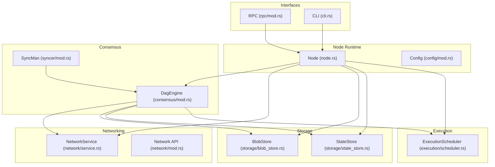
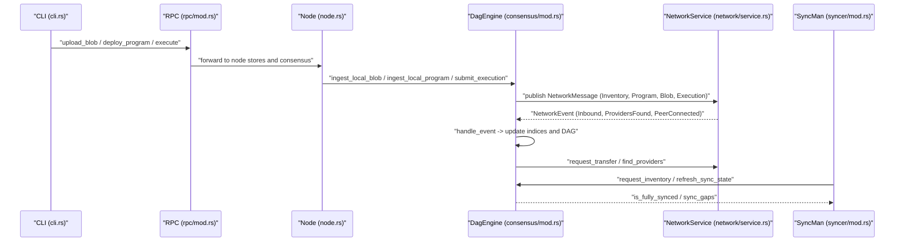
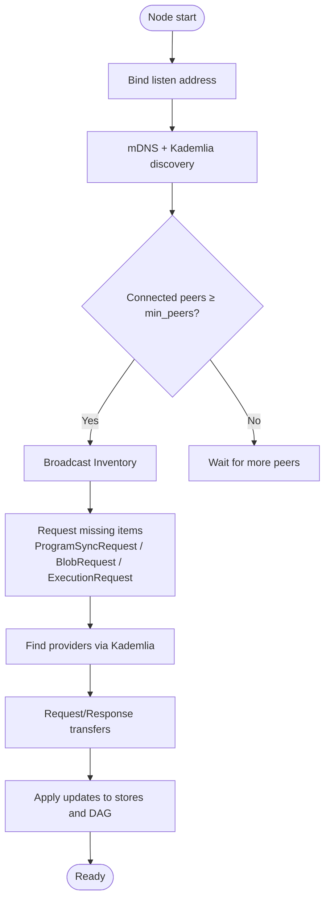
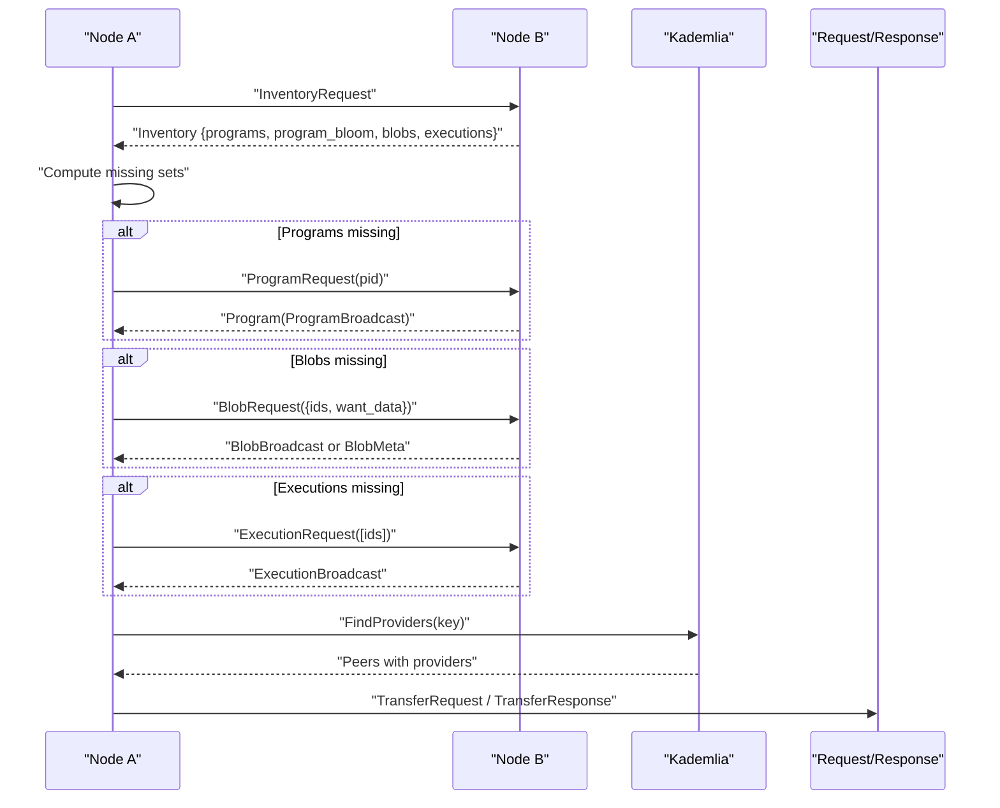
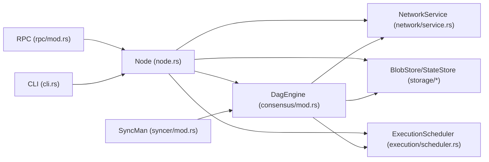

# Scaling Strategies

<cite>
**Referenced Files in This Document**
- [src/lib.rs](file://src/lib.rs)
- [src/node.rs](file://src/node.rs)
- [src/config/mod.rs](file://src/config/mod.rs)
- [src/consensus/mod.rs](file://src/consensus/mod.rs)
- [src/network/mod.rs](file://src/network/mod.rs)
- [src/network/service.rs](file://src/network/service.rs)
- [src/syncer/mod.rs](file://src/syncer/mod.rs)
- [src/cli.rs](file://src/cli.rs)
- [src/rpc/mod.rs](file://src/rpc/mod.rs)
- [src/storage/mod.rs](file://src/storage/mod.rs)
- [src/storage/blob_store.rs](file://src/storage/blob_store.rs)
- [src/storage/state_store.rs](file://src/storage/state_store.rs)
- [src/execution/mod.rs](file://src/execution/mod.rs)
- [src/execution/scheduler.rs](file://src/execution/scheduler.rs)
</cite>

## Table of Contents
1. [Introduction](#introduction)
2. [Project Structure](#project-structure)
3. [Core Components](#core-components)
4. [Architecture Overview](#architecture-overview)
5. [Detailed Component Analysis](#detailed-component-analysis)
6. [Dependency Analysis](#dependency-analysis)
7. [Performance Considerations](#performance-considerations)
8. [Troubleshooting Guide](#troubleshooting-guide)
9. [Conclusion](#conclusion)
10. [Appendices](#appendices)

## Introduction
This document provides a comprehensive guide to scaling strategies for distributed ONVM deployments. It explains how to horizontally scale across multiple node clusters, distribute load across nodes, and manage network topology for efficient peer discovery and gossip. It also covers synchronization strategies using DAG inventory exchanges and bloom filters, data sharding for blob storage and state management, and operational guidance for monitoring network health, peer connectivity, and sync status via CLI and RPC.

## Project Structure
ONVM is organized around modular subsystems:
- Node lifecycle and configuration
- Consensus and DAG execution
- Networking with gossipsub, Kademlia, and request/response
- Storage for blobs and state
- Execution engine and scheduler
- RPC and CLI for operational tasks

**Diagram sources**
- [src/node.rs](file://src/node.rs#L1-L132)
- [src/config/mod.rs](file://src/config/mod.rs#L1-L140)
- [src/consensus/mod.rs](file://src/consensus/mod.rs#L1-L120)
- [src/network/service.rs](file://src/network/service.rs#L202-L458)
- [src/network/mod.rs](file://src/network/mod.rs#L1-L9)
- [src/storage/blob_store.rs](file://src/storage/blob_store.rs#L1-L185)
- [src/storage/state_store.rs](file://src/storage/state_store.rs#L1-L80)
- [src/execution/scheduler.rs](file://src/execution/scheduler.rs#L1-L41)
- [src/rpc/mod.rs](file://src/rpc/mod.rs#L1-L96)
- [src/cli.rs](file://src/cli.rs#L1-L170)

**Section sources**
- [src/lib.rs](file://src/lib.rs#L1-L12)
- [src/node.rs](file://src/node.rs#L1-L132)
- [src/config/mod.rs](file://src/config/mod.rs#L1-L140)

## Core Components
- Node: Orchestrates storage, consensus, network, and execution subsystems. It starts the network service, initializes consensus with min_peers, and runs initial sync.
- Consensus (DagEngine): Manages DAG-based operations, blob and program synchronization, inventory exchange, and bloom-filter-based sync requests.
- NetworkService: Implements gossipsub topics for blobs, programs, and DAG blocks; integrates Kademlia for provider discovery; exposes request/response transport for targeted transfers.
- Storage: BlobStore persists chunked blobs with Merkle roots; StateStore maintains scoped state with deterministic Merkle roots.
- ExecutionScheduler: Provides bounded parallelism for program execution using blocking tasks.
- SyncMan: Coordinates initial synchronization and reports progress and timeouts.
- RPC/CLI: Expose health checks, blob upload, program deployment, execution, and program inspection.

**Section sources**
- [src/node.rs](file://src/node.rs#L1-L132)
- [src/consensus/mod.rs](file://src/consensus/mod.rs#L1-L120)
- [src/network/service.rs](file://src/network/service.rs#L1-L120)
- [src/storage/blob_store.rs](file://src/storage/blob_store.rs#L1-L185)
- [src/storage/state_store.rs](file://src/storage/state_store.rs#L1-L80)
- [src/execution/scheduler.rs](file://src/execution/scheduler.rs#L1-L41)
- [src/syncer/mod.rs](file://src/syncer/mod.rs#L1-L69)
- [src/rpc/mod.rs](file://src/rpc/mod.rs#L1-L96)
- [src/cli.rs](file://src/cli.rs#L1-L170)

## Architecture Overview
The system uses a gossip-driven topology with Kademlia provider discovery and request/response for targeted transfers. Nodes form a mesh network, exchange inventories periodically, and synchronize missing programs, blobs, and execution DAGs using bloom filters and targeted requests.

**Diagram sources**
- [src/cli.rs](file://src/cli.rs#L170-L300)
- [src/rpc/mod.rs](file://src/rpc/mod.rs#L98-L214)
- [src/node.rs](file://src/node.rs#L37-L132)
- [src/consensus/mod.rs](file://src/consensus/mod.rs#L104-L191)
- [src/network/service.rs](file://src/network/service.rs#L284-L427)
- [src/syncer/mod.rs](file://src/syncer/mod.rs#L15-L69)

## Detailed Component Analysis

### Horizontal Scaling Across Multiple Node Clusters
- Cluster formation: Nodes bind to listen addresses and accept connections; mDNS and Kademlia assist discovery. Initial peers are dialed based on configured bootnodes.
- Peer set management: The consensus tracks connected peers and triggers inventory broadcasts when peers connect or when min_peers threshold is met.
- Resource-aware scheduling: The scheduler uses bounded parallelism based on host CPU cores. For large clusters, consider running multiple nodes per host to increase parallel capacity.

Operational guidance:
- Use min_peers to ensure a minimum number of peers before broadcasting inventories and accepting blocks.
- Configure bootnodes to bootstrap discovery in private networks.
- Scale horizontally by adding nodes; each node independently participates in gossip and sync.

**Section sources**
- [src/node.rs](file://src/node.rs#L37-L132)
- [src/network/service.rs](file://src/network/service.rs#L212-L279)
- [src/consensus/mod.rs](file://src/consensus/mod.rs#L177-L191)
- [src/consensus/mod.rs](file://src/consensus/mod.rs#L732-L753)
- [src/execution/scheduler.rs](file://src/execution/scheduler.rs#L12-L25)

### Load Distribution Patterns Based on Resource Availability
- Execution parallelism: The scheduler sets parallelism proportional to available CPU cores and ensures a minimum level. This bounds concurrent execution across nodes.
- Work distribution: There is no explicit cross-node load balancer in the codebase. Practical distribution strategies include:
  - Region-based clustering: Place nodes near clients or data sources to minimize latency.
  - Edge placement: Run nodes closer to edge devices to reduce network hops.
  - Capacity planning: Add nodes to increase total parallelism; monitor peer counts and sync gaps to assess readiness.

**Section sources**
- [src/execution/scheduler.rs](file://src/execution/scheduler.rs#L12-L25)
- [src/syncer/mod.rs](file://src/syncer/mod.rs#L15-L69)

### Network Topology, Bootnodes, Peer Discovery, and Gossip Efficiency
- Topics: Three primary gossip topics are used for blobs, programs, and DAG blocks. Messages are deduplicated using a rolling window of message IDs.
- Discovery: mDNS discovers peers on the same subnet; Kademlia provides provider discovery for programs and blobs.
- Bootnodes: The configuration includes a default bootnode list; CLI supports overriding min_peers and blob sync mode.
- Gossip efficiency: Deduplication reduces redundant traffic; periodic inventory broadcasts keep peers synchronized.

**Diagram sources**
- [src/network/service.rs](file://src/network/service.rs#L212-L279)
- [src/network/service.rs](file://src/network/service.rs#L284-L427)
- [src/consensus/mod.rs](file://src/consensus/mod.rs#L732-L778)
- [src/consensus/mod.rs](file://src/consensus/mod.rs#L501-L616)
- [src/config/mod.rs](file://src/config/mod.rs#L113-L140)

**Section sources**
- [src/network/service.rs](file://src/network/service.rs#L212-L279)
- [src/network/service.rs](file://src/network/service.rs#L284-L427)
- [src/config/mod.rs](file://src/config/mod.rs#L113-L140)

### Synchronization Using DAG Inventory and Bloom Filters
- Inventory exchange: Nodes periodically broadcast inventories containing program IDs, blob inventory entries, and execution IDs. Receivers compute missing sets and request transfers.
- Bloom filters: ProgramSyncRequest uses a bloom filter to efficiently communicate which programs a node already has, enabling targeted metadata sync.
- Provider hints: When providers are found via Kademlia, nodes request missing items and trigger targeted transfers.

**Diagram sources**
- [src/consensus/mod.rs](file://src/consensus/mod.rs#L501-L616)
- [src/consensus/mod.rs](file://src/consensus/mod.rs#L732-L778)
- [src/network/service.rs](file://src/network/service.rs#L117-L167)

**Section sources**
- [src/consensus/mod.rs](file://src/consensus/mod.rs#L501-L616)
- [src/consensus/mod.rs](file://src/consensus/mod.rs#L732-L778)
- [src/network/service.rs](file://src/network/service.rs#L117-L167)

### Data Sharding Considerations for Blob Storage and State Management
- Blob sharding: Blobs are chunked and stored with Merkle roots. The system does not implement cross-node sharding; each node stores its own data independently. Blob advertisement includes locations for provider hints.
- State sharding: State is scoped by namespace and deterministically hashed into a Merkle root. There is no explicit cross-node state sharding; state is maintained per node’s local store.

Operational guidance:
- For large-scale blob storage, consider distributing blob references across nodes and relying on provider hints to locate data.
- For state, use namespaces to isolate program state and rely on DAG execution broadcasts to propagate state updates.

**Section sources**
- [src/storage/blob_store.rs](file://src/storage/blob_store.rs#L1-L185)
- [src/storage/state_store.rs](file://src/storage/state_store.rs#L1-L80)
- [src/consensus/mod.rs](file://src/consensus/mod.rs#L580-L602)

### Geographic Distribution, Region-Based Clustering, and Hybrid Cloud-Edge
- Region-based clustering: Place nodes in regions close to clients or data sources to reduce latency and improve throughput.
- Hybrid cloud-edge: Run nodes on edge devices for low-latency execution and on cloud hosts for centralized coordination and discovery.
- Bootnodes and min_peers: Configure bootnodes per region and tune min_peers to balance availability and resilience.

**Section sources**
- [src/config/mod.rs](file://src/config/mod.rs#L113-L140)
- [src/node.rs](file://src/node.rs#L37-L132)

### Monitoring Network Health, Peer Connectivity, and Sync Status
- CLI health endpoint: The RPC server exposes a health endpoint for basic liveness checks.
- Sync progress: The sync manager logs progress and gaps for missing programs, blobs, and executions. It can time out to continue startup with partial views.
- Peer counts: The consensus exposes peer counts and sync gaps for diagnostics.

Operational guidance:
- Use the health endpoint to confirm node readiness.
- Monitor logs for sync progress and warnings about timeouts.
- Track peer counts and inventory gaps to assess network health.

**Section sources**
- [src/rpc/mod.rs](file://src/rpc/mod.rs#L62-L96)
- [src/syncer/mod.rs](file://src/syncer/mod.rs#L15-L69)
- [src/consensus/mod.rs](file://src/consensus/mod.rs#L839-L853)

### min_peers Parameter Effects on Resilience and Data Availability
- min_peers influences when inventories are broadcast and when the node considers itself ready for full participation. It also gates certain sync operations to ensure minimal peer coverage.
- Lower min_peers increases responsiveness in small networks but may reduce resilience against partitions.
- Higher min_peers improves resilience but may delay initial availability.

**Section sources**
- [src/consensus/mod.rs](file://src/consensus/mod.rs#L732-L753)
- [src/consensus/mod.rs](file://src/consensus/mod.rs#L177-L191)
- [src/config/mod.rs](file://src/config/mod.rs#L113-L140)
- [src/node.rs](file://src/node.rs#L90-L110)

## Dependency Analysis
The following diagram highlights key dependencies among components involved in scaling and synchronization.

**Diagram sources**
- [src/node.rs](file://src/node.rs#L1-L132)
- [src/consensus/mod.rs](file://src/consensus/mod.rs#L1-L120)
- [src/network/service.rs](file://src/network/service.rs#L202-L458)
- [src/storage/blob_store.rs](file://src/storage/blob_store.rs#L1-L185)
- [src/storage/state_store.rs](file://src/storage/state_store.rs#L1-L80)
- [src/execution/scheduler.rs](file://src/execution/scheduler.rs#L1-L41)
- [src/syncer/mod.rs](file://src/syncer/mod.rs#L1-L69)
- [src/rpc/mod.rs](file://src/rpc/mod.rs#L1-L96)
- [src/cli.rs](file://src/cli.rs#L1-L170)

**Section sources**
- [src/node.rs](file://src/node.rs#L1-L132)
- [src/consensus/mod.rs](file://src/consensus/mod.rs#L1-L120)
- [src/network/service.rs](file://src/network/service.rs#L202-L458)
- [src/syncer/mod.rs](file://src/syncer/mod.rs#L1-L69)

## Performance Considerations
- Gossip deduplication: A rolling window prevents reprocessing the same messages, reducing bandwidth and CPU overhead.
- Chunked blob storage: Efficient for large blobs; Merkle roots enable integrity verification.
- Parallel execution: Bounded by available CPU cores; increasing nodes scales parallelism.
- Inventory cadence: Periodic broadcasts keep caches fresh; tune heartbeat and intervals for network conditions.

[No sources needed since this section provides general guidance]

## Troubleshooting Guide
Common issues and remedies:
- No peers discovered: Verify listen address, firewall, and bootnodes. Check mDNS and Kademlia logs for discovery events.
- Slow sync: Inspect sync gaps and peer counts. Increase min_peers if necessary to stabilize inventory broadcasts.
- Timeout during initial sync: The sync manager continues startup with partial data; investigate network partitions or slow peers.
- RPC errors: Confirm RPC binding and endpoint normalization. Use CLI commands to upload blobs and deploy programs.

**Section sources**
- [src/network/service.rs](file://src/network/service.rs#L284-L427)
- [src/syncer/mod.rs](file://src/syncer/mod.rs#L15-L69)
- [src/cli.rs](file://src/cli.rs#L170-L300)
- [src/rpc/mod.rs](file://src/rpc/mod.rs#L98-L214)

## Conclusion
ONVM’s distributed scaling relies on a gossip-driven mesh with Kademlia-based provider discovery and targeted request/response transfers. Horizontal scaling is achieved by adding nodes, each participating in inventory exchange and synchronization. The system’s min_peers parameter balances resilience and availability, while blob and state stores provide local persistence with integrity guarantees. Operational monitoring via CLI and RPC complements robust sync management for reliable large-scale deployments.

[No sources needed since this section summarizes without analyzing specific files]

## Appendices

### Appendix A: CLI and RPC Interfaces for Scaling Operations
- CLI commands:
  - RunNode: Starts a node with configurable listen address, RPC endpoint, min_peers, and blob sync mode.
  - UploadBlob: Uploads a blob to a running node via RPC.
  - Deploy: Deploys a program with optional blob references.
  - Execute: Executes a program with optional input.
  - GetBlob and ProgramInfo: Retrieve blob and program metadata.
- RPC endpoints:
  - /health: Liveness check.
  - /blobs: Upload blob and ingest into consensus.
  - /programs: Deploy program and ingest into consensus.
  - /execute: Execute program and return results.
  - /blobs/:id and /programs/:id: Fetch blob and program info.

**Section sources**
- [src/cli.rs](file://src/cli.rs#L1-L170)
- [src/rpc/mod.rs](file://src/rpc/mod.rs#L62-L214)