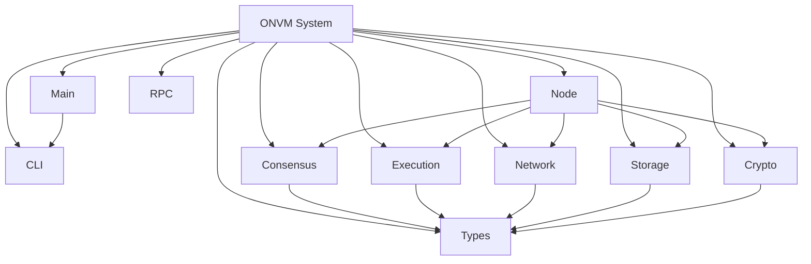
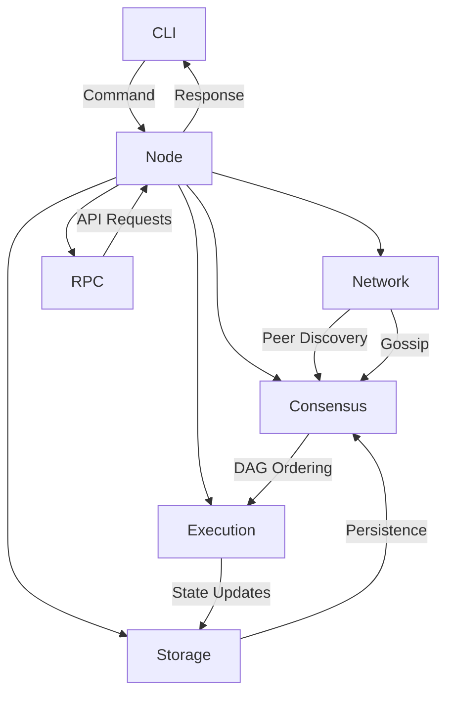
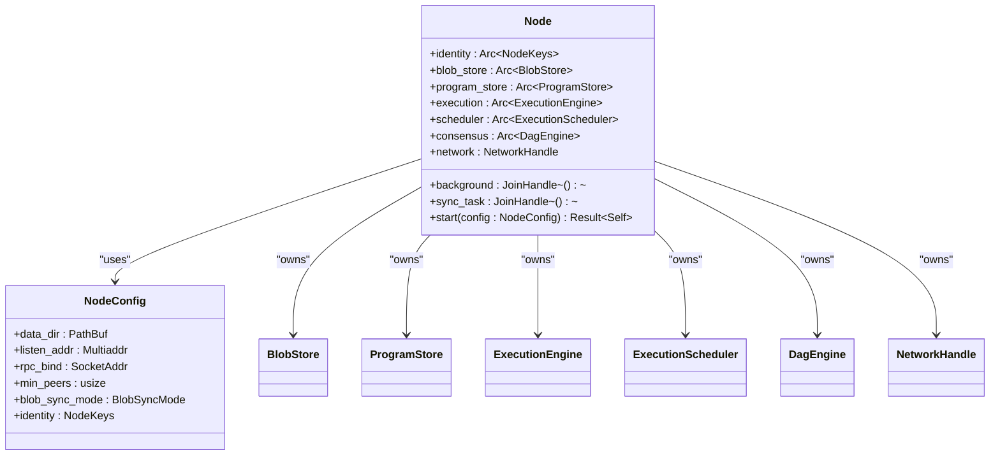
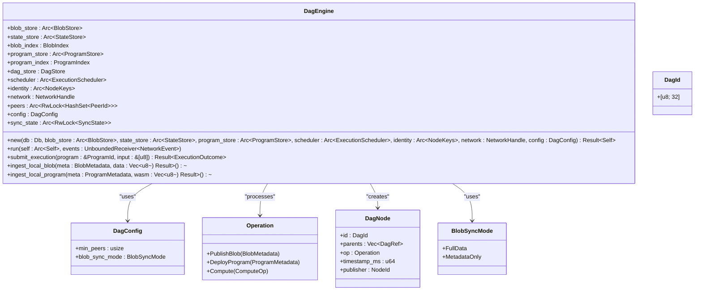
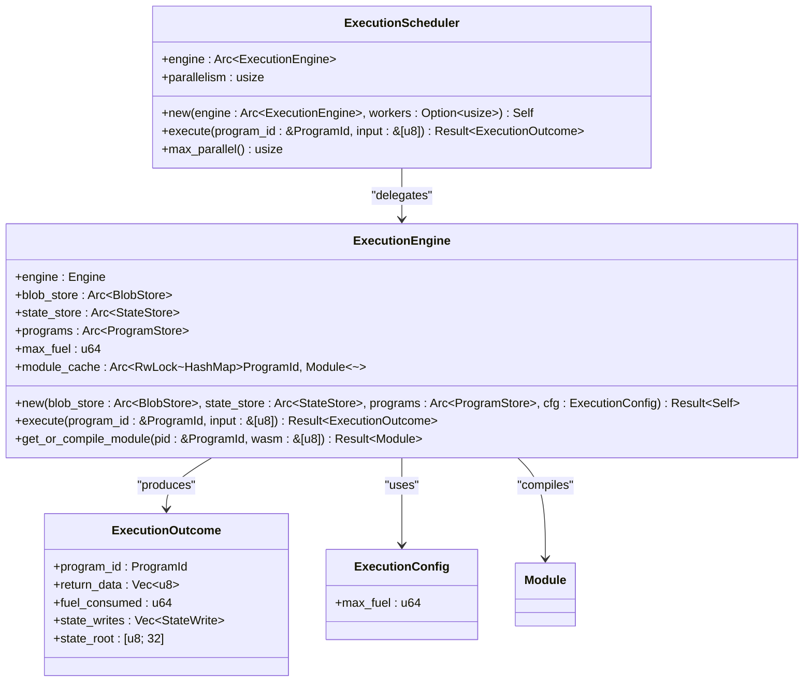
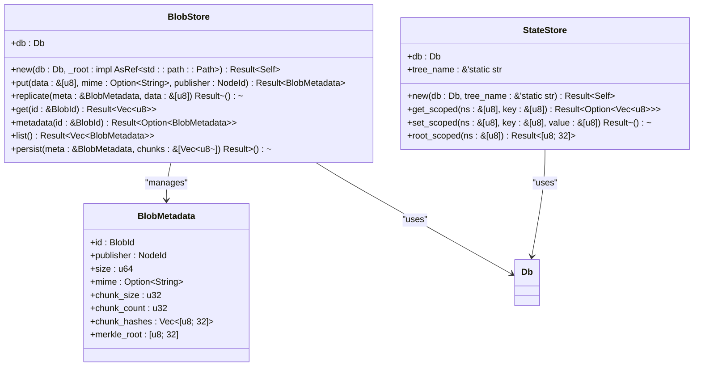
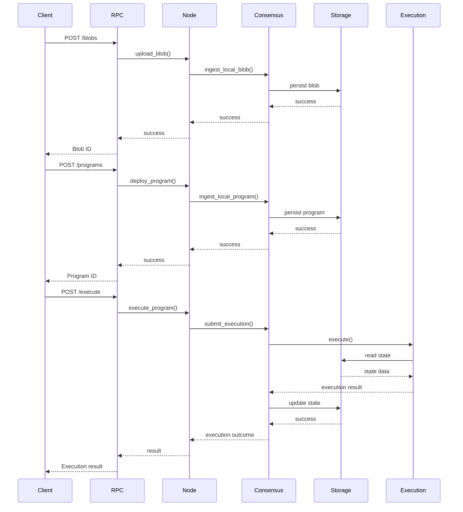
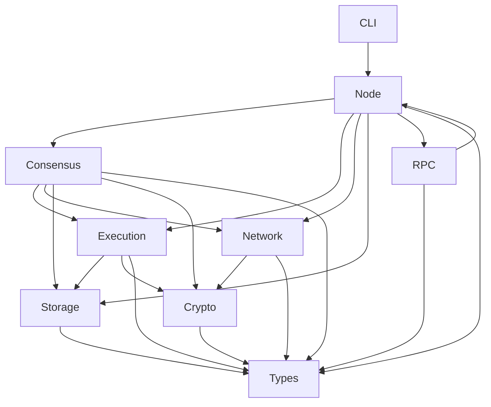

# Architecture and Design

<cite>
**Referenced Files in This Document**   
- [main.rs](file://src/main.rs)
- [lib.rs](file://src/lib.rs)
- [node.rs](file://src/node.rs)
- [cli.rs](file://src/cli.rs)
- [types.rs](file://src/types.rs)
- [consensus/mod.rs](file://src/consensus/mod.rs)
- [execution/mod.rs](file://src/execution/mod.rs)
- [execution/runtime.rs](file://src/execution/runtime.rs)
- [execution/scheduler.rs](file://src/execution/scheduler.rs)
- [network/mod.rs](file://src/network/mod.rs)
- [network/service.rs](file://src/network/service.rs)
- [storage/blob_store.rs](file://src/storage/blob_store.rs)
- [storage/state_store.rs](file://src/storage/state_store.rs)
- [rpc/mod.rs](file://src/rpc/mod.rs)
- [crypto/keys.rs](file://src/crypto/keys.rs)
- [crypto/hashing.rs](file://src/crypto/hashing.rs)
- [config/mod.rs](file://src/config/mod.rs)
</cite>

## Table of Contents
1. [Introduction](#introduction)
2. [Project Structure](#project-structure)
3. [Core Components](#core-components)
4. [Architecture Overview](#architecture-overview)
5. [Detailed Component Analysis](#detailed-component-analysis)
6. [Dependency Analysis](#dependency-analysis)
7. [Performance Considerations](#performance-considerations)
8. [Troubleshooting Guide](#troubleshooting-guide)
9. [Conclusion](#conclusion)

## Introduction
The ONVM (Open Network Virtual Machine) system is a modular monolith designed for decentralized computation and data processing. It implements a DAG-based consensus mechanism for block production, Wasm-based execution with sandboxing, libp2p-powered networking for peer discovery and gossip, and sled-based storage for persistence. The system orchestrates operations through a central Node component that coordinates consensus, execution, networking, storage, and RPC layers. This document provides comprehensive architectural documentation of the ONVM system, detailing its design principles, component interactions, technical decisions, and technology stack.

**Section sources**
- [main.rs](file://src/main.rs#L1-L7)
- [lib.rs](file://src/lib.rs#L1-L12)

## Project Structure
The ONVM system follows a modular monolith architecture with clear separation of concerns between different functional layers. The project structure organizes code into distinct modules based on their responsibilities:

- **config**: Configuration management
- **consensus**: DAG-based consensus engine
- **crypto**: Cryptographic primitives and key management
- **execution**: Wasm program execution and scheduling
- **network**: libp2p networking and peer communication
- **rpc**: Axum-based RPC server and API endpoints
- **storage**: Data persistence using sled
- **syncer**: Synchronization management
- **cli**: Command-line interface
- **node**: Core node orchestration
- **types**: Shared data types and identifiers

The system also includes a `wasm_programs` directory containing example Wasm programs (analytics, echo, kvstore) that can be deployed and executed on the network.



**Diagram sources **
- [src](file://src#L1-L163)
- [wasm_programs](file://wasm_programs#L1-L10)

**Section sources**
- [lib.rs](file://src/lib.rs#L1-L12)
- [main.rs](file://src/main.rs#L1-L7)

## Core Components
The ONVM system consists of several core components that work together to provide a decentralized computation platform. The Node component serves as the central orchestrator, coordinating operations between consensus, execution, networking, storage, and RPC layers. The Consensus layer implements a DAG-based ordering mechanism for block production, enabling parallel processing and improved scalability compared to traditional blockchain approaches. The Execution layer provides a secure Wasm runtime environment using Wasmtime, allowing for sandboxed execution of programs with resource limits. The Network layer leverages libp2p for peer discovery, gossip protocols, and secure communication between nodes. The Storage layer uses sled as an embedded key-value store for persistent data storage, with content-addressable storage for blobs and programs. The RPC layer exposes an HTTP API using Axum, enabling external interaction with the node through standardized endpoints.

**Section sources**
- [node.rs](file://src/node.rs#L1-L163)
- [consensus/mod.rs](file://src/consensus/mod.rs#L1-L1112)
- [execution/mod.rs](file://src/execution/mod.rs#L1-L9)
- [network/mod.rs](file://src/network/mod.rs#L1-L9)
- [storage/mod.rs](file://src/storage/mod.rs#L1-L6)
- [rpc/mod.rs](file://src/rpc/mod.rs#L1-L241)

## Architecture Overview
The ONVM system follows a modular monolith architecture with clear separation of concerns between different functional layers. At the core of the system is the Node component, which orchestrates operations by coordinating the consensus, execution, networking, storage, and RPC layers. The architecture enables data flow from the CLI interface through the Node to the various processing layers, creating a cohesive system for decentralized computation.



**Diagram sources **
- [node.rs](file://src/node.rs#L1-L163)
- [cli.rs](file://src/cli.rs#L1-L300)

## Detailed Component Analysis

### Node Orchestration
The Node component serves as the central orchestrator in the ONVM system, coordinating operations between different layers. It initializes and manages the lifecycle of all core components, including consensus, execution, networking, storage, and RPC. The Node establishes the data flow between components and ensures proper coordination of operations.



**Diagram sources **
- [node.rs](file://src/node.rs#L1-L163)

**Section sources**
- [node.rs](file://src/node.rs#L1-L163)

### Consensus Layer
The Consensus layer implements a DAG-based ordering mechanism for block production, providing advantages over traditional blockchain approaches. The DAG (Directed Acyclic Graph) structure allows for parallel processing of operations, improved scalability, and faster finality compared to linear blockchain structures. The consensus engine drives block production through DAG ordering, managing the creation and validation of blocks in the network.



**Diagram sources **
- [consensus/mod.rs](file://src/consensus/mod.rs#L1-L1112)

**Section sources**
- [consensus/mod.rs](file://src/consensus/mod.rs#L1-L1112)

### Execution Layer
The Execution layer provides a secure Wasm runtime environment using Wasmtime, enabling sandboxed execution of programs with resource limits. It handles Wasm program runtime with sandboxing, ensuring that programs run in isolated environments without access to system resources. The execution engine compiles and caches Wasm modules for efficient reuse, while the scheduler manages execution requests and resource allocation.



**Diagram sources **
- [execution/runtime.rs](file://src/execution/runtime.rs#L1-L377)
- [execution/scheduler.rs](file://src/execution/scheduler.rs#L1-L41)

**Section sources**
- [execution/mod.rs](file://src/execution/mod.rs#L1-L9)
- [execution/runtime.rs](file://src/execution/runtime.rs#L1-L377)
- [execution/scheduler.rs](file://src/execution/scheduler.rs#L1-L41)

### Networking Layer
The Networking layer leverages libp2p for peer discovery, gossip protocols, and secure communication between nodes. It manages peer discovery and gossip via libp2p, enabling decentralized network formation and data propagation. The network service handles various message types for program, blob, and execution data exchange between peers.

```mermaid
classDiagram
class NetworkService {
+start(identity : &NodeKeys, config : NetworkConfig) Result~NetworkStreams~
}
class NetworkStreams {
+handle : NetworkHandle
+events : UnboundedReceiver~NetworkEvent~
}
class NetworkHandle {
+publisher : UnboundedSender~NetworkMessage~
+peer_id : PeerId
+provide(key : &[u8])
+request_transfer(peer : PeerId, req : TransferRequest)
+respond_transfer(channel : ResponseChannel~TransferResponse~, response : TransferResponse)
+find_providers(key : &[u8], kind : ProviderKind)
}
class NetworkEvent {
+Inbound(PeerId, NetworkMessage)
+TransferRequest(PeerId, TransferRequest, ResponseChannel~TransferResponse~)
+TransferResponse(PeerId, TransferResponse)
+PeerConnected(PeerId)
+PeerDisconnected(PeerId)
+Listening(Multiaddr)
+ProvidersFound{key : Vec~u8~, kind : ProviderKind, providers : Vec~PeerId~}
}
class NetworkMessage {
+Program(ProgramBroadcast)
+ProgramMeta(Vec~ProgramMetadata~)
+InventoryRequest
+ProgramSyncRequest(ProgramSyncRequest)
+ProgramRequest(ProgramId)
+ProgramResponse(ProgramBroadcast)
+Blob(BlobBroadcast)
+BlobMeta(BlobAdvertisement)
+BlobRequest(BlobRequest)
+Execution(ExecutionBroadcast)
+ExecutionRequest(Vec~[u8; 32]~)
+Inventory(DagInventory)
}
NetworkService --> NetworkStreams : "returns"
NetworkHandle --> NetworkMessage : "sends"
NetworkHandle --> TransferRequest : "requests"
NetworkHandle --> TransferResponse : "responds"
NetworkEvent --> NetworkMessage : "contains"
```

**Diagram sources **
- [network/service.rs](file://src/network/service.rs)
- [network/mod.rs](file://src/network/mod.rs#L1-L9)

**Section sources**
- [network/mod.rs](file://src/network/mod.rs#L1-L9)

### Storage Layer
The Storage layer uses sled as an embedded key-value store for persistent data storage, with content-addressable storage for blobs and programs. It persists data using sled, providing reliable and efficient storage for the system's various data types. The storage system implements content-addressable storage, where data is addressed by its cryptographic hash, ensuring data integrity and enabling efficient deduplication.



**Diagram sources **
- [storage/blob_store.rs](file://src/storage/blob_store.rs#L1-L185)
- [storage/state_store.rs](file://src/storage/state_store.rs#L1-L80)

**Section sources**
- [storage/blob_store.rs](file://src/storage/blob_store.rs#L1-L185)
- [storage/state_store.rs](file://src/storage/state_store.rs#L1-L80)

### RPC Layer
The RPC layer exposes an HTTP API using Axum, enabling external interaction with the node through standardized endpoints. It provides a RESTful interface for clients to interact with the ONVM system, supporting operations such as uploading blobs, deploying programs, executing programs, and retrieving data.



**Diagram sources **
- [rpc/mod.rs](file://src/rpc/mod.rs#L1-L241)
- [node.rs](file://src/node.rs#L1-L163)

**Section sources**
- [rpc/mod.rs](file://src/rpc/mod.rs#L1-L241)

## Dependency Analysis
The ONVM system has a well-defined dependency structure with clear separation of concerns between components. The Node component serves as the central orchestrator, depending on all other core components. The Consensus layer depends on the Execution, Network, Storage, and Crypto layers for its operations. The Execution layer depends on the Storage layer for blob and state management, and on the Crypto layer for program identification. The Network layer depends on the Crypto layer for node identity and secure communication. The RPC layer depends on the Node component for all operations.



**Diagram sources **
- [lib.rs](file://src/lib.rs#L1-L12)
- [node.rs](file://src/node.rs#L1-L163)

**Section sources**
- [lib.rs](file://src/lib.rs#L1-L12)
- [node.rs](file://src/node.rs#L1-L163)

## Performance Considerations
The ONVM system incorporates several performance optimizations to ensure efficient operation. The use of a DAG-based consensus mechanism enables parallel processing of operations, improving throughput compared to traditional blockchain approaches. The Execution layer implements module caching to avoid recompiling Wasm programs, reducing execution latency. The Storage layer uses chunked storage with Merkle trees for efficient data verification and retrieval. The Networking layer employs bloom filters for efficient synchronization between peers, reducing bandwidth usage. The system uses Tokio as its async runtime, enabling efficient handling of concurrent operations. The ExecutionScheduler uses spawn_blocking to avoid tying up async executors, allowing for many parallel executions.

**Section sources**
- [execution/runtime.rs](file://src/execution/runtime.rs#L1-L377)
- [consensus/mod.rs](file://src/consensus/mod.rs#L1-L1112)
- [storage/blob_store.rs](file://src/storage/blob_store.rs#L1-L185)
- [network/mod.rs](file://src/network/mod.rs#L1-L9)

## Troubleshooting Guide
When troubleshooting issues with the ONVM system, consider the following common scenarios:

1. **Node startup failures**: Check that the data directory is writable and that the specified ports are available. The system will attempt to increment the TCP port if the configured port is in use.

2. **Peer connectivity issues**: Ensure that the network configuration allows for incoming connections on the specified port. Check firewall settings and network configuration.

3. **Program execution failures**: Verify that the Wasm program is compatible with the execution environment and that it exports the expected entry point function.

4. **Synchronization issues**: Check that the node has sufficient peers and that the network is functioning properly. Use the is_fully_synced method to check synchronization status.

5. **Storage issues**: Verify that the storage directory has sufficient disk space and that the file system is functioning properly.

**Section sources**
- [node.rs](file://src/node.rs#L1-L163)
- [consensus/mod.rs](file://src/consensus/mod.rs#L1-L1112)
- [execution/runtime.rs](file://src/execution/runtime.rs#L1-L377)
- [storage/blob_store.rs](file://src/storage/blob_store.rs#L1-L185)

## Conclusion
The ONVM system implements a sophisticated architecture for decentralized computation with clear separation of concerns between consensus, execution, networking, storage, and RPC layers. The system's use of a DAG-based consensus mechanism provides advantages in scalability and performance over traditional blockchain approaches. The Wasm-based execution environment with sandboxing ensures secure and isolated program execution. The libp2p-powered networking layer enables robust peer discovery and data propagation. The sled-based storage system provides reliable and efficient data persistence with content-addressable storage. The modular monolith design allows for cohesive integration of components while maintaining clear boundaries between functional layers. The system is well-suited for clustered or edge deployments, with considerations for scalability and performance built into its design.