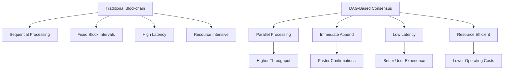
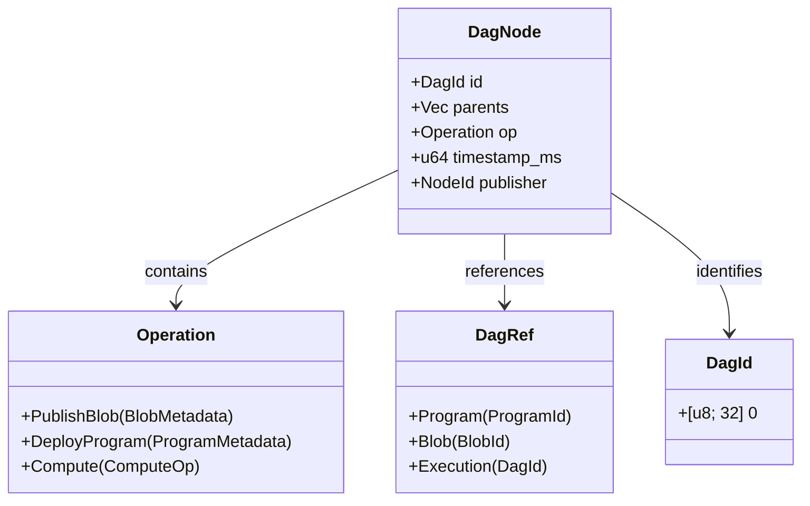
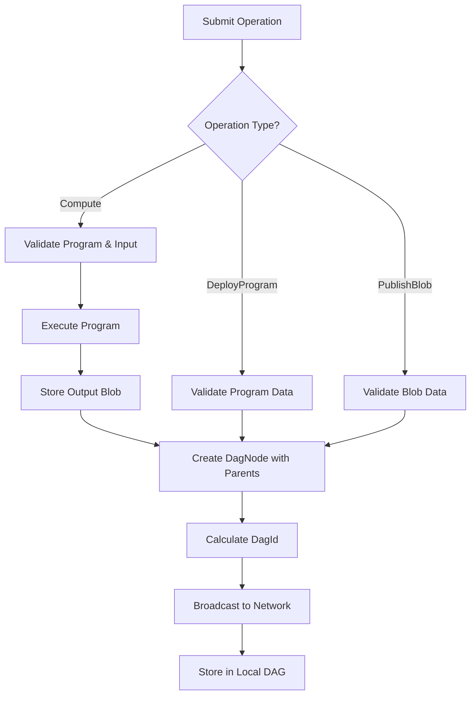
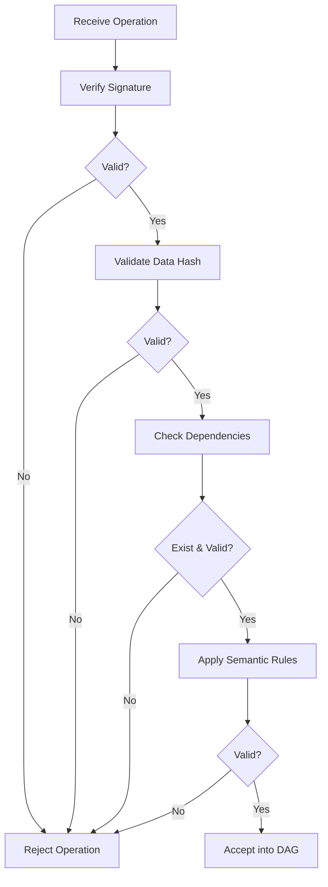
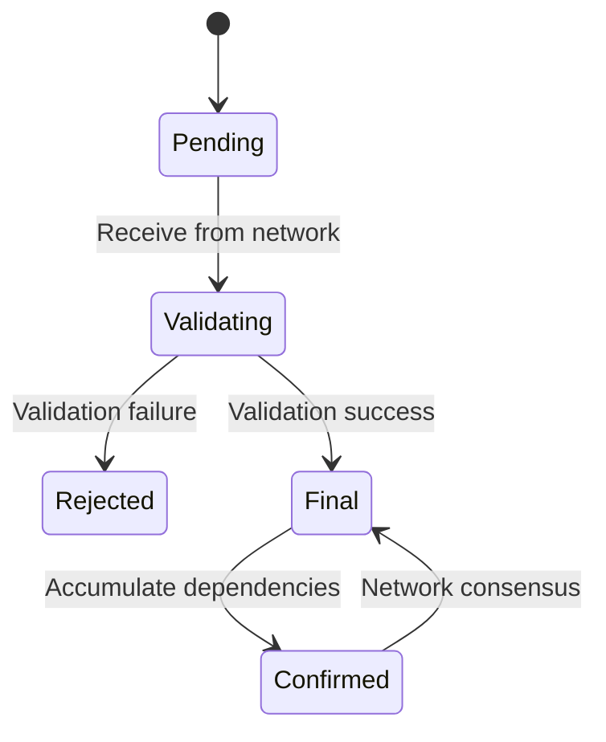
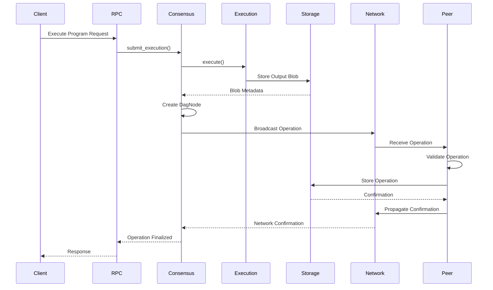
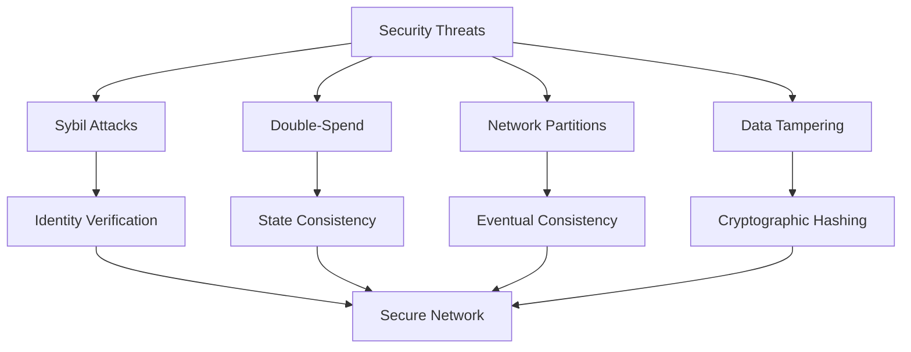

# Consensus Engine

<cite>
**Referenced Files in This Document**   
- [consensus/mod.rs](file://src/consensus/mod.rs)
- [node.rs](file://src/node.rs)
- [rpc/mod.rs](file://src/rpc/mod.rs)
- [execution/scheduler.rs](file://src/execution/scheduler.rs)
- [execution/runtime.rs](file://src/execution/runtime.rs)
- [storage/blob_store.rs](file://src/storage/blob_store.rs)
- [storage/state_store.rs](file://src/storage/state_store.rs)
- [network/mod.rs](file://src/network/mod.rs)
</cite>

## Table of Contents
1. [Introduction](#introduction)
2. [DAG-Based Architecture Rationale](#dag-based-architecture-rationale)
3. [Core Components and Data Structures](#core-components-and-data-structures)
4. [Block Production Process](#block-production-process)
5. [Validation Rules and Conflict Resolution](#validation-rules-and-conflict-resolution)
6. [Finality Conditions](#finality-conditions)
7. [Component Interactions](#component-interactions)
8. [Transaction Lifecycle](#transaction-lifecycle)
9. [Security Considerations](#security-considerations)
10. [Configuration Options](#configuration-options)

## Introduction
The DAG-based Consensus Engine is a core component of the ONVM system, designed to provide a scalable and efficient alternative to traditional blockchain structures. This documentation details the architecture, implementation, and operational characteristics of the consensus mechanism, focusing on its Directed Acyclic Graph (DAG) structure, which enables parallel processing, improved scalability, and reduced latency compared to linear blockchain architectures.

The consensus engine coordinates with multiple system components including Execution, Network, Storage, and RPC interfaces to manage the lifecycle of ComputeOps, program deployments, and data blobs. It ensures consistency across the distributed network while maintaining high throughput and low confirmation times.

**Section sources**
- [consensus/mod.rs](file://src/consensus/mod.rs#L1-L1112)
- [node.rs](file://src/node.rs#L1-L163)

## DAG-Based Architecture Rationale
The choice of a Directed Acyclic Graph (DAG) structure over traditional blockchain architectures provides several key advantages that address fundamental limitations of linear chain structures:

### Parallelism
Unlike traditional blockchains that process transactions sequentially in blocks, the DAG structure allows for inherent parallelism. Multiple ComputeOps can be processed simultaneously as long as they don't conflict on shared resources. This parallel processing capability significantly increases throughput, as the system is not bottlenecked by block production intervals or block size limitations.

### Scalability
The DAG architecture scales more efficiently than traditional blockchains because it eliminates the need for block mining competitions and the associated computational waste. New operations can be appended to the DAG as soon as they are validated, without waiting for block intervals. This results in more consistent transaction processing times and better utilization of network resources.

### Reduced Latency
Traditional blockchains suffer from latency due to block propagation times and confirmation requirements. In the DAG-based system, operations achieve faster finality because they can be confirmed as soon as their dependencies are resolved and sufficient network validation occurs. The absence of fixed block intervals means operations can be confirmed immediately upon validation, reducing end-to-end latency.

### Resource Efficiency
The DAG structure is more resource-efficient than proof-of-work or even proof-of-stake blockchains because it doesn't require energy-intensive consensus mechanisms. Validation is based on cryptographic verification of operations and their dependencies, making the system more environmentally friendly and cost-effective to operate.



**Diagram sources**
- [consensus/mod.rs](file://src/consensus/mod.rs#L22-L46)

## Core Components and Data Structures
The consensus engine is built around several key data structures that define its operation and maintain the integrity of the DAG.

### DagNode Structure
The fundamental building block of the consensus engine is the `DagNode`, which represents an atomic operation in the DAG. Each node contains:

- **id**: Unique identifier generated from the operation and its parents
- **parents**: References to parent nodes that this operation depends on
- **op**: The operation being performed (PublishBlob, DeployProgram, or Compute)
- **timestamp_ms**: Millisecond timestamp of node creation
- **publisher**: Node identifier of the entity that created this node

The `DagId` is deterministically generated using cryptographic hashing of the operation and parent references, ensuring global uniqueness and integrity.

### Operation Types
The consensus engine supports three primary operation types:

- **PublishBlob**: Records the publication of data blobs in the network
- **DeployProgram**: Records the deployment of executable programs (WASM modules)
- **Compute**: Records the execution of a program with specific input and output

Each operation type serves a specific purpose in the ONVM ecosystem, enabling the execution of decentralized applications and data processing workflows.

### Reference System
The `DagRef` enum provides a unified way to reference different types of entities within the DAG:

- **Program**: References to deployed programs
- **Blob**: References to data blobs
- **Execution**: References to previous execution results

This reference system enables the creation of complex dependency graphs where operations can depend on multiple types of resources.



**Diagram sources**
- [consensus/mod.rs](file://src/consensus/mod.rs#L22-L46)

**Section sources**
- [consensus/mod.rs](file://src/consensus/mod.rs#L22-L46)

## Block Production Process
The block production process in the DAG-based consensus engine differs significantly from traditional blockchain systems, focusing on operation validation and dependency resolution rather than block mining.

### Operation Submission
When a new operation is submitted to the network, the following steps occur:

1. **Input Validation**: The system verifies that all required inputs exist and are accessible
2. **Dependency Resolution**: Parent references are validated and resolved
3. **Execution**: For Compute operations, the program is executed with the provided input
4. **Output Generation**: Results are captured and stored as new blobs
5. **Node Creation**: A new DagNode is created with appropriate parent references
6. **Network Propagation**: The new node is broadcast to the network

For Compute operations specifically, the process involves executing a program, capturing its output, and creating references to both the input and output blobs as parent dependencies.

### Ordering Mechanism
Unlike traditional blockchains that rely on strict chronological ordering, the DAG-based system uses a partial ordering based on dependency relationships. Operations are ordered based on their parent references, creating a causal ordering where operations that depend on others must come after their dependencies.

This approach allows for multiple valid orderings of independent operations, enabling parallel processing while maintaining consistency for dependent operations.

### Linking into DAG Structure
New operations are linked into the DAG structure by establishing parent-child relationships based on data dependencies:

- Compute operations reference their program, input blob, and output blob as parents
- Program deployments reference any blobs they depend on as parents
- Blob publications have no parents (representing leaf nodes)

This linking mechanism creates a rich dependency graph that captures the complete history and relationships between all operations in the system.



**Diagram sources**
- [consensus/mod.rs](file://src/consensus/mod.rs#L194-L258)
- [execution/scheduler.rs](file://src/execution/scheduler.rs#L27-L35)

## Validation Rules and Conflict Resolution
The consensus engine employs a comprehensive set of validation rules to ensure the integrity and consistency of the DAG structure.

### Operation Validation
Each operation undergoes rigorous validation before being accepted into the DAG:

- **Identity Verification**: The publisher's signature is verified to ensure authenticity
- **Data Integrity**: Cryptographic hashes are validated to ensure data hasn't been tampered with
- **Dependency Validation**: All parent references must exist and be valid
- **Semantic Validation**: Operation-specific rules are enforced (e.g., program syntax, blob size limits)

For Compute operations, additional validation includes verifying that the program exists and that the input/output blobs are properly formatted.

### Conflict Detection
Conflicts are detected through several mechanisms:

- **Program ID Collisions**: Attempts to deploy programs with the same ID but different content are rejected
- **Blob ID Mismatches**: Data that doesn't match its expected hash is rejected
- **State Consistency**: Program executions must produce consistent state transitions when given the same inputs

The system uses cryptographic hashing to ensure that identical operations produce identical results, preventing subtle conflicts that could arise from non-deterministic execution.

### Resolution Mechanisms
When conflicts are detected, the system employs the following resolution strategies:

- **First-Seen-Wins**: For identical operations received from multiple sources, the first valid instance is accepted
- **Content-Based Rejection**: Conflicting content (different data with the same ID) is rejected regardless of timing
- **Dependency Enforcement**: Operations that depend on rejected operations are also rejected

The system prioritizes consistency over availability, ensuring that the DAG remains in a valid state even if it means rejecting some operations.



**Diagram sources**
- [consensus/mod.rs](file://src/consensus/mod.rs#L307-L483)

## Finality Conditions
Finality in the DAG-based consensus engine is achieved through a combination of network validation and dependency accumulation.

### Immediate Finality
Operations achieve immediate finality once they are successfully validated and added to the local DAG. Unlike traditional blockchains that require multiple confirmations, the DAG structure allows for faster finality because each operation explicitly references its dependencies.

An operation is considered final when:
- It has been successfully validated
- All its parent operations are final
- It has been propagated to a sufficient number of peers

### Probabilistic Finality
As operations accumulate more child operations that depend on them, their probability of being reversed approaches zero. This probabilistic finality model is similar to other DAG-based systems like IOTA or Nano, where the weight of the network's acceptance increases over time.

The system uses inventory synchronization and bloom filters to ensure that nodes have a consistent view of the DAG, further strengthening finality guarantees.

### Synchronization-Based Finality
Nodes achieve finality through continuous synchronization with peers. When a node has synchronized its view of the DAG with multiple peers and there is consensus on the operation's inclusion, the operation can be considered final.

The syncer component periodically checks for consistency across the network and resolves any discrepancies, ensuring that all nodes converge on the same DAG state.



**Diagram sources**
- [consensus/mod.rs](file://src/consensus/mod.rs#L732-L752)
- [syncer/mod.rs](file://src/syncer/mod.rs#L15-L55)

## Component Interactions
The consensus engine interacts with several other components in the ONVM system, forming a cohesive architecture for decentralized computation.

### Execution Component Integration
The consensus engine works closely with the execution component to manage program execution:

- **Execution Requests**: The consensus engine submits execution requests to the execution engine
- **Result Validation**: Execution results are validated before being incorporated into the DAG
- **State Management**: Program state changes are recorded and verified through the state store

When a Compute operation is processed, the consensus engine coordinates with the execution scheduler to run the program and capture its output, ensuring that all side effects are properly recorded.

### Network Component Integration
The network component enables communication between nodes and propagation of DAG operations:

- **Operation Broadcasting**: New operations are broadcast to peers through the network service
- **Inventory Synchronization**: Nodes exchange DAG inventory information to detect missing operations
- **Data Transfer**: The transfer request/response system handles retrieval of missing data

The network uses libp2p for peer-to-peer communication, with topic-based pub/sub for efficient operation dissemination.

### Storage Component Integration
The storage component provides persistent storage for all DAG elements:

- **DAG Storage**: DagNodes are stored in a sled database tree
- **Blob Storage**: Data blobs are stored with chunked encoding and merkle verification
- **State Storage**: Program state is stored in a namespaced key-value store with merkle roots

The blob store uses content-addressing with cryptographic hashing, ensuring data integrity and enabling efficient deduplication.

### RPC Component Integration
The RPC interface exposes consensus functionality to external clients:

- **Operation Submission**: Clients can submit new operations via HTTP endpoints
- **Status Queries**: The current state of the DAG can be queried
- **Data Retrieval**: Stored blobs and program information can be retrieved

The RPC server translates HTTP requests into consensus engine operations, providing a user-friendly interface to the underlying system.

```mermaid
graph TB
subgraph "Consensus Engine"
CE[DagEngine]
end
subgraph "Execution"
EE[ExecutionEngine]
ES[ExecutionScheduler]
end
subgraph "Network"
NS[NetworkService]
NH[NetworkHandle]
end
subgraph "Storage"
BS[BlobStore]
SS[StateStore]
DS[DagStore]
end
subgraph "RPC"
RPC[RpcServer]
end
RPC --> CE
CE --> EE
CE --> ES
CE --> NS
CE --> BS
CE --> SS
CE --> DS
NS --> CE
BS --> CE
SS --> CE
DS --> CE
```

**Diagram sources**
- [node.rs](file://src/node.rs#L23-L35)
- [consensus/mod.rs](file://src/consensus/mod.rs#L62-L75)

**Section sources**
- [node.rs](file://src/node.rs#L38-L132)
- [rpc/mod.rs](file://src/rpc/mod.rs#L62-L96)

## Transaction Lifecycle
The lifecycle of a transaction in the DAG-based consensus engine follows a well-defined path from submission to finality.

### Submission Phase
When a transaction is submitted to the network:

1. **Client Request**: A client sends a request via the RPC interface
2. **Local Validation**: The node performs initial validation of the request
3. **Execution**: For Compute operations, the program is executed locally
4. **Operation Creation**: A DagNode is created representing the operation

The RPC server handles the initial ingestion of transactions, validating inputs and formatting them as proper consensus operations.

### Validation Phase
Once created, the operation undergoes network-wide validation:

1. **Broadcast**: The operation is broadcast to connected peers
2. **Peer Validation**: Each peer independently validates the operation
3. **Conflict Checking**: Peers check for any conflicts with existing operations
4. **Storage**: Valid operations are stored in the local DAG

The system uses a gossip protocol to ensure rapid propagation of new operations while maintaining network efficiency.

### Confirmation Phase
As the operation gains acceptance in the network:

1. **Dependency Accumulation**: Other operations begin referencing it as a parent
2. **Synchronization**: Nodes exchange inventory information, confirming the operation's presence
3. **Finality**: The operation achieves finality through network consensus

The syncer component ensures that all nodes eventually converge on the same DAG state, resolving any temporary inconsistencies.

### Data Flow
The complete data flow for a Compute operation:

1. Client submits execution request via RPC
2. Node executes program and captures output
3. Input and output blobs are stored and referenced
4. DagNode is created with program, input, and output as parents
5. Operation is broadcast to network peers
6. Peers validate and store the operation
7. Operation achieves finality through network consensus



**Diagram sources**
- [rpc/mod.rs](file://src/rpc/mod.rs#L194-L208)
- [consensus/mod.rs](file://src/consensus/mod.rs#L194-L258)

## Security Considerations
The consensus engine incorporates several security mechanisms to protect against common attacks in distributed systems.

### Sybil Resistance
The system achieves Sybil resistance through:

- **Identity-Based Validation**: All operations are cryptographically signed by their publishers
- **Reputation Systems**: Nodes that consistently provide valid data gain trust
- **Resource Requirements**: Computational requirements for operation submission limit spam

The use of cryptographic identities ensures that each node has a unique, verifiable identity, making it difficult for attackers to create multiple fake identities.

### Double-Spend Prevention
Double-spend attacks are prevented through:

- **State Consistency**: Program executions must produce consistent state transitions
- **Dependency Enforcement**: Operations that spend the same resource cannot both be valid
- **Global State Tracking**: The state store maintains a consistent view of all program states

For Compute operations, the system ensures that programs cannot produce different outputs for the same inputs, preventing subtle forms of double-spending.

### Network Partition Handling
During network partitions, the system maintains consistency through:

- **Eventual Consistency**: When partitions heal, nodes synchronize their DAG views
- **Conflict Resolution**: Conflicting operations are resolved based on validation rules
- **Inventory Synchronization**: Bloom filters and inventory messages help detect missing operations

The syncer component actively works to resolve partitions by requesting missing operations and validating their consistency with the local DAG.

### Data Integrity
Data integrity is ensured through:

- **Cryptographic Hashing**: All data is content-addressed using cryptographic hashes
- **Merkle Verification**: Blobs use merkle trees for efficient integrity checking
- **Signature Validation**: All operations are signed by their publishers

The blob store's chunked encoding with merkle verification ensures that even large data objects can be efficiently validated for integrity.



**Diagram sources**
- [consensus/mod.rs](file://src/consensus/mod.rs#L307-L483)
- [storage/blob_store.rs](file://src/storage/blob_store.rs#L1-L185)

## Configuration Options
The consensus engine provides several configuration options to tune its behavior for different network conditions and use cases.

### Block Production Intervals
While the DAG structure doesn't use traditional blocks, the system has parameters that affect operation production:

- **Sync Timer**: Controls how frequently inventory is broadcast (default: 5 seconds)
- **Min Peers**: Minimum number of peers required before broadcasting inventory
- **Blob Sync Mode**: Determines whether full data or metadata only is synchronized

These parameters can be adjusted to balance network traffic with synchronization speed.

### Synchronization Strategies
The system supports different synchronization strategies through configuration:

- **Full Data Sync**: All blob data is synchronized between peers
- **Metadata Only**: Only blob metadata is synchronized, with data fetched on demand
- **Bloom Filter Optimization**: Uses bloom filters to efficiently detect missing programs

The `BlobSyncMode` enum controls this behavior, allowing nodes to optimize for bandwidth or completeness.

### Performance Tuning
Additional configuration options include:

- **Program Meta Batch**: Controls batch size for program metadata synchronization
- **Transfer Request Behavior**: Configures how transfer requests are handled
- **Inventory Frequency**: Controls how often inventory messages are sent

These options allow operators to fine-tune the system for their specific network conditions and performance requirements.

**Section sources**
- [consensus/mod.rs](file://src/consensus/mod.rs#L48-L58)
- [node.rs](file://src/node.rs#L14-L21)