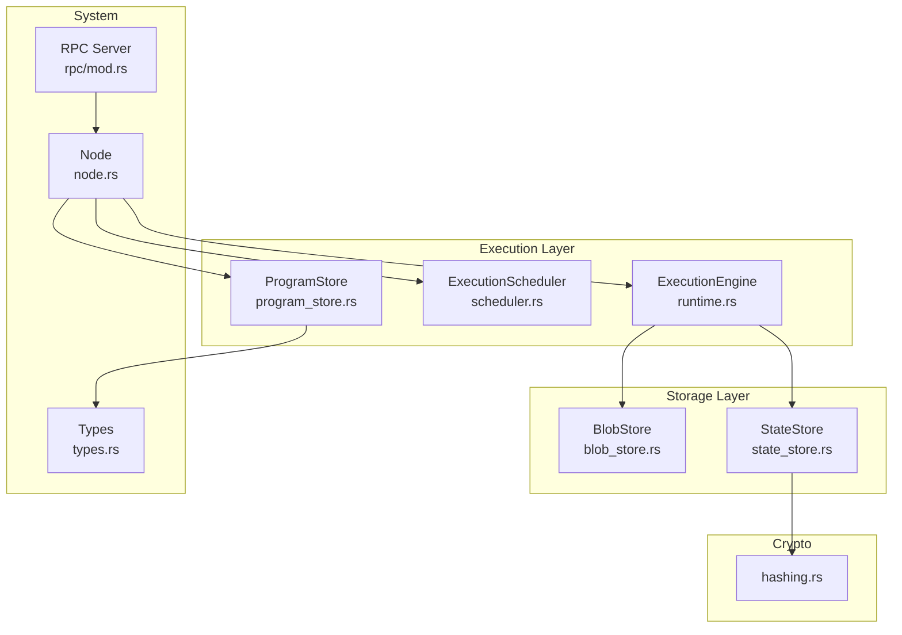
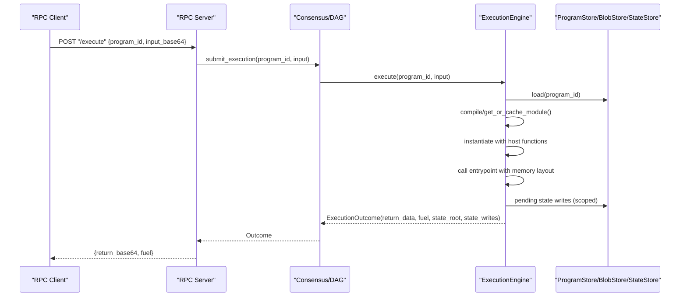
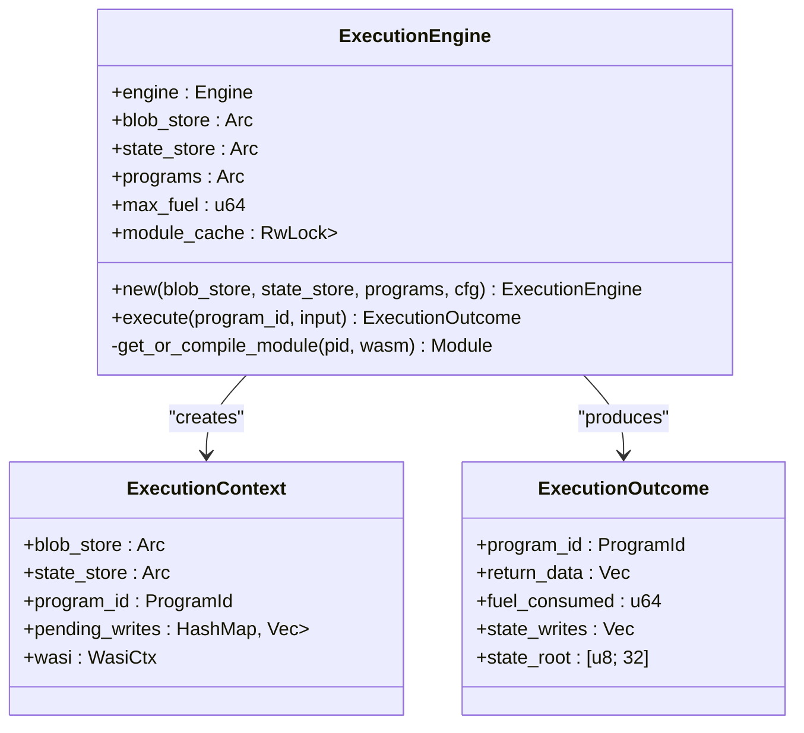
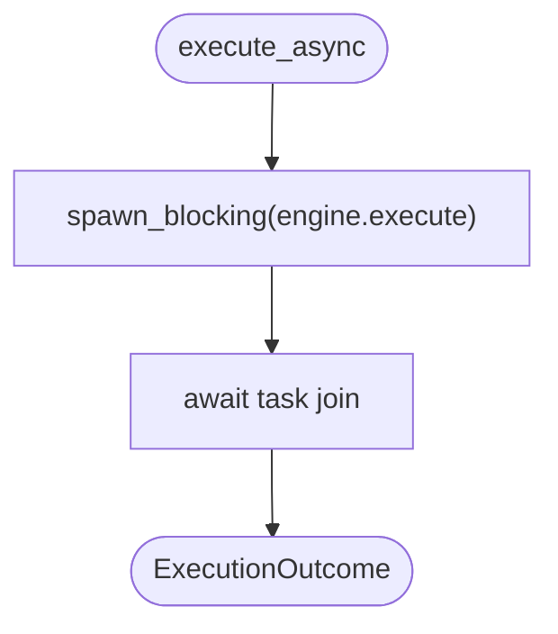
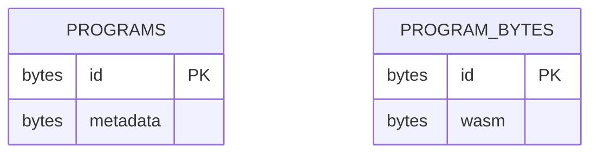
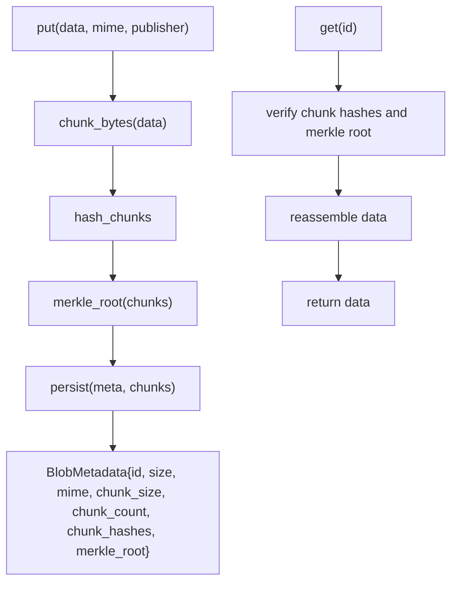
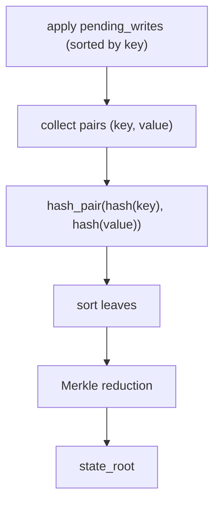
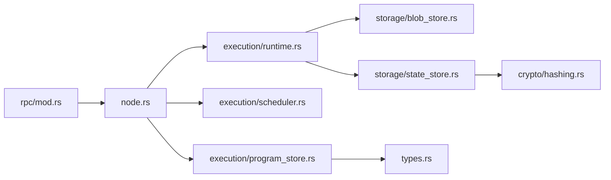

# Execution Runtime

<cite>
**Referenced Files in This Document**
- [runtime.rs](file://src/execution/runtime.rs)
- [scheduler.rs](file://src/execution/scheduler.rs)
- [program_store.rs](file://src/execution/program_store.rs)
- [blob_store.rs](file://src/storage/blob_store.rs)
- [state_store.rs](file://src/storage/state_store.rs)
- [hashing.rs](file://src/crypto/hashing.rs)
- [types.rs](file://src/types.rs)
- [node.rs](file://src/node.rs)
- [rpc/mod.rs](file://src/rpc/mod.rs)
</cite>

## Table of Contents
1. [Introduction](#introduction)
2. [Project Structure](#project-structure)
3. [Core Components](#core-components)
4. [Architecture Overview](#architecture-overview)
5. [Detailed Component Analysis](#detailed-component-analysis)
6. [Dependency Analysis](#dependency-analysis)
7. [Performance Considerations](#performance-considerations)
8. [Troubleshooting Guide](#troubleshooting-guide)
9. [Conclusion](#conclusion)
10. [Appendices](#appendices)

## Introduction
This document describes the Wasm Execution Runtime powering the ONVM platform. It focuses on the sandboxed environment built on wasmtime, detailing security isolation, resource limits, and deterministic execution guarantees. It explains the program lifecycle from content-addressable storage to instantiation, execution, and state updates. It also documents the host function interface enabling capability-based access to storage, and outlines the Scheduler’s role in managing concurrency and resource allocation. Finally, it covers performance characteristics, debugging support, error handling, and compatibility requirements for Wasm modules targeting the ONVM runtime.

## Project Structure
The execution runtime is implemented under the execution module and integrates with storage, crypto, and RPC layers. The Node composes all subsystems and wires the runtime into the broader system.

**Diagram sources**
- [runtime.rs](file://src/execution/runtime.rs#L1-L120)
- [scheduler.rs](file://src/execution/scheduler.rs#L1-L41)
- [program_store.rs](file://src/execution/program_store.rs#L1-L96)
- [blob_store.rs](file://src/storage/blob_store.rs#L1-L185)
- [state_store.rs](file://src/storage/state_store.rs#L1-L80)
- [hashing.rs](file://src/crypto/hashing.rs#L1-L8)
- [node.rs](file://src/node.rs#L1-L163)
- [rpc/mod.rs](file://src/rpc/mod.rs#L1-L241)
- [types.rs](file://src/types.rs#L1-L109)

**Section sources**
- [runtime.rs](file://src/execution/runtime.rs#L1-L120)
- [scheduler.rs](file://src/execution/scheduler.rs#L1-L41)
- [program_store.rs](file://src/execution/program_store.rs#L1-L96)
- [blob_store.rs](file://src/storage/blob_store.rs#L1-L185)
- [state_store.rs](file://src/storage/state_store.rs#L1-L80)
- [hashing.rs](file://src/crypto/hashing.rs#L1-L8)
- [node.rs](file://src/node.rs#L1-L163)
- [rpc/mod.rs](file://src/rpc/mod.rs#L1-L241)
- [types.rs](file://src/types.rs#L1-L109)

## Core Components
- ExecutionEngine: Compiles and runs Wasm modules with deterministic memory layout, fuel-based gas metering, and capability-host functions for storage and blob access. It manages a module cache keyed by ProgramId.
- ExecutionScheduler: Provides bounded concurrency using spawn_blocking to offload CPU-heavy execution to blocking threads, respecting configured parallelism.
- ProgramStore: Content-addressable storage for Wasm bytecode and program metadata, keyed by ProgramId.
- BlobStore: Content-addressable storage for arbitrary binary blobs with chunking, Merkle roots, and integrity verification.
- StateStore: Deterministic key-value store scoped by program namespace, with Merkle root computation for state updates.
- RPC Server: Exposes endpoints to upload blobs, deploy programs, query program info, and execute programs asynchronously.

**Section sources**
- [runtime.rs](file://src/execution/runtime.rs#L1-L120)
- [scheduler.rs](file://src/execution/scheduler.rs#L1-L41)
- [program_store.rs](file://src/execution/program_store.rs#L1-L96)
- [blob_store.rs](file://src/storage/blob_store.rs#L1-L185)
- [state_store.rs](file://src/storage/state_store.rs#L1-L80)
- [rpc/mod.rs](file://src/rpc/mod.rs#L1-L241)

## Architecture Overview
The runtime executes programs in a sandboxed wasmtime environment. Programs are identified by ProgramId and loaded from ProgramStore. The ExecutionEngine compiles Wasm modules, attaches host functions for blob and state access, and runs the program with a fixed memory layout. Fuel-based gas metering ensures resource limits. Pending state writes are applied deterministically and a state root is computed. The Scheduler coordinates parallel execution.

**Diagram sources**
- [rpc/mod.rs](file://src/rpc/mod.rs#L194-L214)
- [runtime.rs](file://src/execution/runtime.rs#L79-L183)
- [program_store.rs](file://src/execution/program_store.rs#L66-L81)
- [state_store.rs](file://src/storage/state_store.rs#L16-L41)

## Detailed Component Analysis

### ExecutionEngine
- Sandboxed environment: Uses wasmtime with fuel-based metering and disables backtraces for deterministic behavior. Memory guard sizes are zeroed to prevent guard page abuse.
- Program lifecycle:
  - Loads metadata and Wasm bytes from ProgramStore.
  - Compiles or retrieves module from cache keyed by ProgramId.
  - Instantiates with a Store containing ExecutionContext holding BlobStore, StateStore, ProgramId, pending writes, and WASI context.
  - Attaches host functions for blob and state access.
  - Supports multiple entrypoint signatures: (i32,i32)->(i32,i32), (i32,i32)->i64, and sret (i32,i32,i32)->().
  - Writes input to linear memory at offset 0, with optional scratch space for sret outputs.
  - Reads return buffer from memory and computes fuel consumed as max_fuel - remaining_fuel.
  - Applies pending state writes deterministically by sorting keys, then computes state root for the program namespace.
- Host functions:
  - Blob access: onvm_blob_read(id_ptr, id_len, out_ptr, out_capacity) -> length or negative error code.
  - State access: onvm_state_put(key_ptr, key_len, val_ptr, val_len) -> 0 on success.
  - State access: onvm_state_get(key_ptr, key_len, out_ptr, out_cap) -> length, 0 if missing, or -needed if capacity too small.
  - State root: onvm_state_root(out_ptr) -> 0 on success, writes 32-byte root.
- Security isolation:
  - WASI is attached but filesystem is not mounted by default; only explicit host functions grant capabilities.
  - Memory access is validated via caller memory exports and bounds checks.
  - Errors are propagated as negative return codes to the guest.
- Deterministic execution:
  - Pending writes are sorted by key before applying.
  - State root computation is deterministic via sorted leaf hashing and Merkle reduction.
  - Entry point selection is based on metadata-defined entrypoint name.

**Diagram sources**
- [runtime.rs](file://src/execution/runtime.rs#L1-L183)

**Section sources**
- [runtime.rs](file://src/execution/runtime.rs#L1-L183)

### ExecutionScheduler
- Controls concurrency by spawning blocking tasks for execution, allowing many parallel instances without blocking async runloops.
- Parallelism defaults to available_parallelism() clamped to at least 2.

**Diagram sources**
- [scheduler.rs](file://src/execution/scheduler.rs#L27-L35)

**Section sources**
- [scheduler.rs](file://src/execution/scheduler.rs#L1-L41)

### ProgramStore
- Stores program metadata and bytecode under content-addressable keys (ProgramId).
- Supports deploy, replicate, store_metadata, load, metadata, and list operations.
- Metadata includes ProgramId, publisher, size, entrypoint, blob_refs, and deploy_salt.

**Diagram sources**
- [program_store.rs](file://src/execution/program_store.rs#L16-L56)

**Section sources**
- [program_store.rs](file://src/execution/program_store.rs#L1-L96)
- [types.rs](file://src/types.rs#L33-L41)

### BlobStore
- Stores arbitrary binary data as chunked data with Merkle roots for integrity.
- Provides put, replicate, get, metadata, and list operations.
- Enforces chunking, chunk hash verification, and Merkle root validation on read.

**Diagram sources**
- [blob_store.rs](file://src/storage/blob_store.rs#L18-L104)

**Section sources**
- [blob_store.rs](file://src/storage/blob_store.rs#L1-L185)

### StateStore
- Scoped key-value store with deterministic state root computation.
- get_scoped and set_scoped operate under a namespace derived from ProgramId.
- root_scoped computes a Merkle root over (hash(key), hash(value)) pairs, sorted deterministically.

**Diagram sources**
- [state_store.rs](file://src/storage/state_store.rs#L16-L41)

**Section sources**
- [state_store.rs](file://src/storage/state_store.rs#L1-L80)

### Host Functions: Blob Access
- onvm_blob_read(id_ptr, id_len, out_ptr, out_capacity) reads a blob by its BlobId and writes into guest memory.
- Validates memory export, decodes hex id, checks length, and returns negative error codes for failures.

**Section sources**
- [runtime.rs](file://src/execution/runtime.rs#L199-L244)

### Host Functions: State Access
- onvm_state_put: stores key/value in pending_writes overlay.
- onvm_state_get: prefers pending_writes overlay, otherwise reads from state store; returns length or negative capacity requirement.
- onvm_state_root: writes the 32-byte state root for the program namespace, incorporating pending writes deterministically.

**Section sources**
- [runtime.rs](file://src/execution/runtime.rs#L246-L377)

### RPC Integration
- Exposes endpoints for health, blob upload/fetch, program deploy/info, and program execution.
- Execution endpoint delegates to consensus.submit_execution and returns base64-encoded return data and fuel consumed.

**Section sources**
- [rpc/mod.rs](file://src/rpc/mod.rs#L62-L214)

## Dependency Analysis
- ExecutionEngine depends on ProgramStore for bytecode and metadata, BlobStore for blob reads, and StateStore for state reads/writes and roots.
- Scheduler depends on ExecutionEngine and uses spawn_blocking to manage concurrency.
- Node composes all subsystems and initializes ExecutionEngine, ProgramStore, StateStore, and ExecutionScheduler.
- RPC routes depend on Node to access stores and consensus for execution submission.

**Diagram sources**
- [rpc/mod.rs](file://src/rpc/mod.rs#L1-L241)
- [node.rs](file://src/node.rs#L1-L163)
- [runtime.rs](file://src/execution/runtime.rs#L1-L120)
- [scheduler.rs](file://src/execution/scheduler.rs#L1-L41)
- [program_store.rs](file://src/execution/program_store.rs#L1-L96)
- [blob_store.rs](file://src/storage/blob_store.rs#L1-L185)
- [state_store.rs](file://src/storage/state_store.rs#L1-L80)
- [hashing.rs](file://src/crypto/hashing.rs#L1-L8)
- [types.rs](file://src/types.rs#L1-L109)

**Section sources**
- [node.rs](file://src/node.rs#L1-L163)
- [runtime.rs](file://src/execution/runtime.rs#L1-L120)
- [scheduler.rs](file://src/execution/scheduler.rs#L1-L41)
- [program_store.rs](file://src/execution/program_store.rs#L1-L96)
- [blob_store.rs](file://src/storage/blob_store.rs#L1-L185)
- [state_store.rs](file://src/storage/state_store.rs#L1-L80)
- [hashing.rs](file://src/crypto/hashing.rs#L1-L8)
- [types.rs](file://src/types.rs#L1-L109)
- [rpc/mod.rs](file://src/rpc/mod.rs#L1-L241)

## Performance Considerations
- Compilation caching: ExecutionEngine caches compiled Modules keyed by ProgramId to avoid repeated compilation overhead.
- Memory management: Linear memory is accessed via caller memory exports; input is written at offset 0 with optional scratch space for sret outputs. Guard sizes are disabled to minimize overhead.
- Gas metering: Fuel-based metering is enabled; max_fuel is configured and consumed is computed as max_fuel - remaining_fuel.
- Concurrency: Scheduler uses spawn_blocking to keep async runloops responsive while executing CPU-bound Wasm code, with parallelism derived from available_parallelism().
- Determinism: Pending state writes are sorted by key before applying, ensuring deterministic state transitions and consistent state roots.

[No sources needed since this section provides general guidance]

## Troubleshooting Guide
- Program missing exported memory: The runtime expects a memory export named "memory"; absence triggers an error during instantiation.
- Invalid entrypoint signature: The runtime supports three entrypoint forms; mismatch leads to an error indicating supported signatures.
- Negative host function return codes: These indicate errors in host calls (e.g., invalid memory, invalid id, insufficient capacity, store errors). Inspect the specific error code mapping in the host function implementations.
- State root mismatch: Occurs if stored state does not match computed root; verify pending writes and ensure deterministic ordering.
- Blob integrity failure: Chunk hashes or Merkle root mismatches during get() indicate corrupted or inconsistent data.

**Section sources**
- [runtime.rs](file://src/execution/runtime.rs#L106-L124)
- [runtime.rs](file://src/execution/runtime.rs#L199-L244)
- [runtime.rs](file://src/execution/runtime.rs#L246-L377)
- [blob_store.rs](file://src/storage/blob_store.rs#L78-L104)
- [state_store.rs](file://src/storage/state_store.rs#L29-L41)

## Conclusion
The ONVM Wasm Execution Runtime provides a secure, deterministic, and efficient environment for executing Wasm programs. It leverages wasmtime with fuel-based gas metering, capability-host functions for controlled storage access, and deterministic state updates with Merkle roots. The Scheduler enables scalable concurrency, while the ProgramStore and BlobStore offer content-addressable storage with integrity guarantees. The RPC layer integrates execution into the broader system, exposing a clean API for deployment and invocation.

[No sources needed since this section summarizes without analyzing specific files]

## Appendices

### Compatibility Requirements for Wasm Modules
- Exported memory: Must export a memory named "memory".
- Entrypoint: Must export a function matching one of the supported signatures:
  - (i32,i32)->(i32,i32)
  - (i32,i32)->i64
  - (i32,i32,i32)->() with sret
- Input layout: Input data is written to memory at offset 0; optional scratch space follows input for sret outputs.
- Host functions: Programs may call onvm_blob_read, onvm_state_put, onvm_state_get, and onvm_state_root.

**Section sources**
- [runtime.rs](file://src/execution/runtime.rs#L106-L150)
- [runtime.rs](file://src/execution/runtime.rs#L199-L377)