# Networking Layer

<cite>
**Referenced Files in This Document**
- [service.rs](file://src/network/service.rs)
- [mod.rs](file://src/network/mod.rs)
- [node.rs](file://src/node.rs)
- [consensus/mod.rs](file://src/consensus/mod.rs)
- [keys.rs](file://src/crypto/keys.rs)
- [types.rs](file://src/types.rs)
- [blob_store.rs](file://src/storage/blob_store.rs)
- [syncer/mod.rs](file://src/syncer/mod.rs)
- [Cargo.toml](file://Cargo.toml)
</cite>

## Table of Contents
1. [Introduction](#introduction)
2. [Project Structure](#project-structure)
3. [Core Components](#core-components)
4. [Architecture Overview](#architecture-overview)
5. [Detailed Component Analysis](#detailed-component-analysis)
6. [Dependency Analysis](#dependency-analysis)
7. [Performance Considerations](#performance-considerations)
8. [Troubleshooting Guide](#troubleshooting-guide)
9. [Conclusion](#conclusion)
10. [Appendices](#appendices)

## Introduction
This document describes the libp2p-based Networking Layer responsible for decentralized peer-to-peer communication. It covers transport protocols, peer discovery, connection management, gossip propagation for blocks and blobs, anti-entropy synchronization, and integrations with Consensus and Storage. Security aspects include encrypted channels and peer authentication via ed25519 keys. Topology considerations and DoS protections are addressed, along with packet flow diagrams for block gossip and DAG consistency maintenance.

## Project Structure
The networking layer is centered around a libp2p-based service that exposes a typed message API and a handle for publishing and requesting transfers. The Node composes the network service, consensus engine, and storage subsystems.

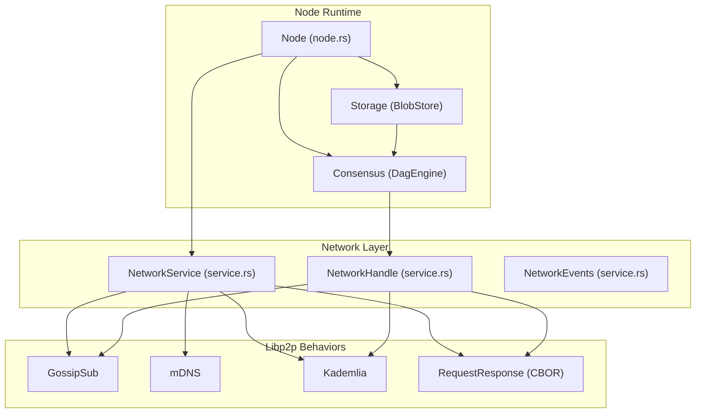

**Diagram sources**
- [node.rs](file://src/node.rs#L38-L132)
- [service.rs](file://src/network/service.rs#L202-L264)
- [consensus/mod.rs](file://src/consensus/mod.rs#L62-L102)

**Section sources**
- [node.rs](file://src/node.rs#L38-L132)
- [service.rs](file://src/network/service.rs#L202-L264)
- [mod.rs](file://src/network/mod.rs#L1-L8)

## Core Components
- NetworkService: Initializes libp2p with transports, security, multiplexing, and behaviors; manages event loops and message publishing.
- NetworkHandle: Provides methods to publish messages, announce provider records, request transfers, and respond to transfer requests.
- NetworkMessage: Typed envelope covering blob, program, execution, inventory, and request/response variants.
- Consensus integration: DagEngine consumes inbound network events, updates local stores, and publishes inventory and gossip messages.
- Storage integration: BlobStore persists and retrieves blob data; used by both ingestion and gossip handlers.

**Section sources**
- [service.rs](file://src/network/service.rs#L26-L116)
- [service.rs](file://src/network/service.rs#L136-L167)
- [consensus/mod.rs](file://src/consensus/mod.rs#L120-L191)
- [blob_store.rs](file://src/storage/blob_store.rs#L18-L144)

## Architecture Overview
The network stack combines:
- Transport: TCP/TLS with Noise handshake and Yamux multiplexing.
- Discovery: mDNS for LAN peers and Kademlia DHT for provider discovery.
- Gossip: Strict validation with message deduplication and signed identity.
- Request/Response: CBOR protocol for targeted fetches and push confirmations.
- Topics: Separate topics for blobs, programs, and DAG blocks.

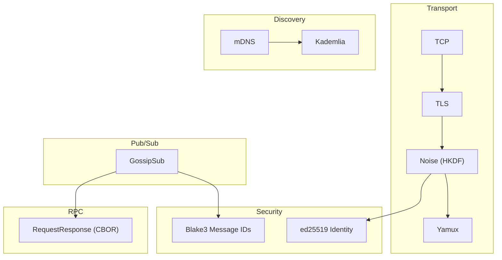

**Diagram sources**
- [service.rs](file://src/network/service.rs#L255-L264)
- [service.rs](file://src/network/service.rs#L221-L239)
- [service.rs](file://src/network/service.rs#L302-L336)
- [service.rs](file://src/network/service.rs#L315-L336)
- [service.rs](file://src/network/service.rs#L243-L247)
- [keys.rs](file://src/crypto/keys.rs#L1-L73)

## Detailed Component Analysis

### NetworkService and Transport Protocols
- Transport stack: TCP with TLS and Noise, plus Yamux multiplexing.
- Identity: Uses ed25519 keypair derived from NodeKeys to create libp2p identity and PeerId.
- Topics: Subscribes to dedicated topics for blobs, programs, and DAG blocks.
- Heartbeat: Configurable gossipsub heartbeat interval.
- Discovery: mDNS for LAN peer discovery; Kademlia for provider records.
- Request/Response: CBOR protocol for targeted fetches and push confirmations.

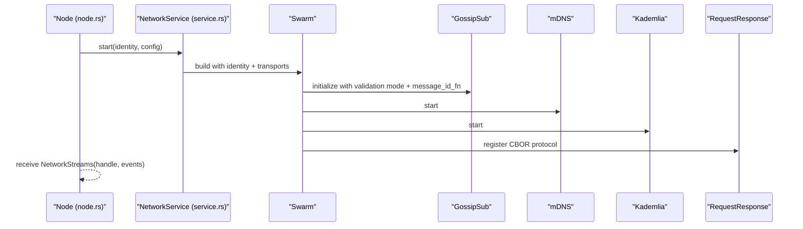

**Diagram sources**
- [service.rs](file://src/network/service.rs#L212-L264)
- [service.rs](file://src/network/service.rs#L221-L239)
- [service.rs](file://src/network/service.rs#L240-L248)
- [node.rs](file://src/node.rs#L58-L88)

**Section sources**
- [service.rs](file://src/network/service.rs#L212-L264)
- [service.rs](file://src/network/service.rs#L221-L239)
- [service.rs](file://src/network/service.rs#L240-L248)
- [keys.rs](file://src/crypto/keys.rs#L1-L73)

### Peer Discovery Mechanisms
- mDNS: Discovers peers on the same subnet and attempts dials.
- Kademlia: Announces provider records for programs and blobs; resolves providers for missing items.

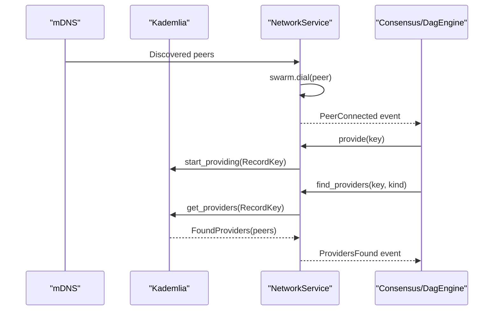

**Diagram sources**
- [service.rs](file://src/network/service.rs#L302-L336)
- [service.rs](file://src/network/service.rs#L373-L383)
- [consensus/mod.rs](file://src/consensus/mod.rs#L177-L190)

**Section sources**
- [service.rs](file://src/network/service.rs#L302-L336)
- [service.rs](file://src/network/service.rs#L373-L383)
- [consensus/mod.rs](file://src/consensus/mod.rs#L177-L190)

### Connection Management
- Swarm lifecycle: Listens on configured Multiaddr, emits listening, connected, and disconnected events.
- Idle timeouts: Configured idle connection timeout.
- Event routing: Translates libp2p events into NetworkEvent variants for higher layers.

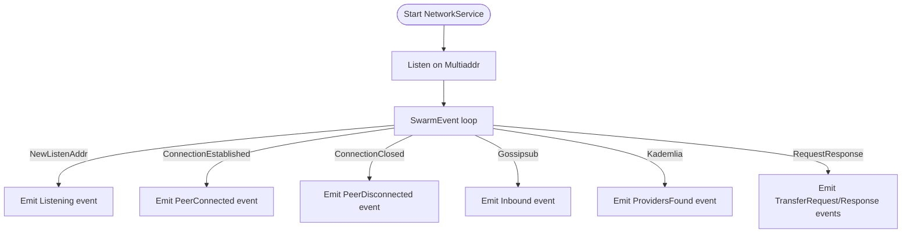

**Diagram sources**
- [service.rs](file://src/network/service.rs#L337-L371)
- [service.rs](file://src/network/service.rs#L288-L301)
- [service.rs](file://src/network/service.rs#L315-L336)
- [service.rs](file://src/network/service.rs#L349-L369)

**Section sources**
- [service.rs](file://src/network/service.rs#L337-L371)
- [service.rs](file://src/network/service.rs#L288-L301)

### Gossip Propagation and Fan-Out
- Topics: Separate topics for blobs, programs, and DAG blocks.
- Validation: Strict validation mode; message IDs derived from Blake3 hashes.
- Deduplication: Maintains a bounded window of recent message IDs to suppress duplicates.
- Fan-out: On inbound broadcasts, nodes forward to peers via request-response push.

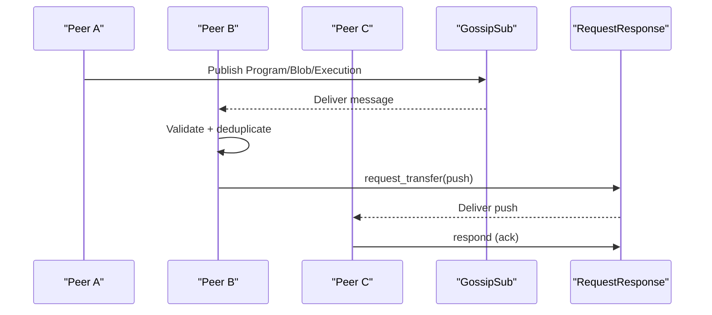

**Diagram sources**
- [service.rs](file://src/network/service.rs#L394-L424)
- [service.rs](file://src/network/service.rs#L413-L420)
- [consensus/mod.rs](file://src/consensus/mod.rs#L721-L730)

**Section sources**
- [service.rs](file://src/network/service.rs#L394-L424)
- [service.rs](file://src/network/service.rs#L413-L420)
- [consensus/mod.rs](file://src/consensus/mod.rs#L721-L730)

### Anti-Entropy Synchronization
- Inventory exchange: Periodic broadcasting of inventory with program Bloom filters and blob entries.
- Requests: Nodes request missing items via ProgramRequest, BlobRequest, and ExecutionRequest.
- Provider hints: Kademlia provider lookups for missing keys.
- Initial sync: SyncMan triggers inventory requests and waits until fully synced.

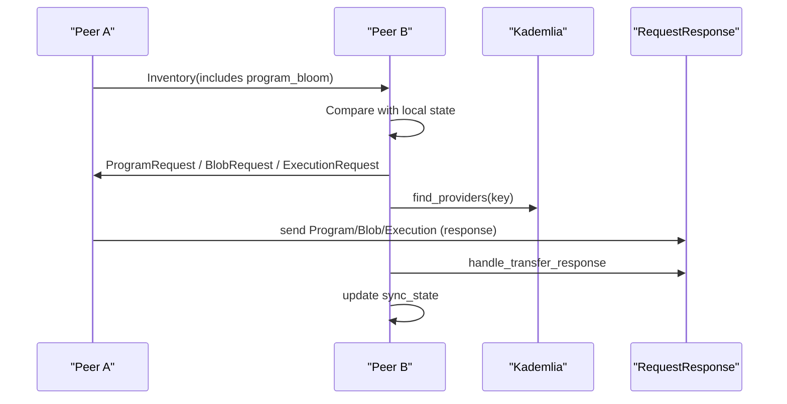

**Diagram sources**
- [consensus/mod.rs](file://src/consensus/mod.rs#L732-L753)
- [consensus/mod.rs](file://src/consensus/mod.rs#L501-L616)
- [consensus/mod.rs](file://src/consensus/mod.rs#L618-L697)
- [service.rs](file://src/network/service.rs#L373-L383)

**Section sources**
- [consensus/mod.rs](file://src/consensus/mod.rs#L732-L753)
- [consensus/mod.rs](file://src/consensus/mod.rs#L501-L616)
- [consensus/mod.rs](file://src/consensus/mod.rs#L618-L697)
- [syncer/mod.rs](file://src/syncer/mod.rs#L15-L40)

### Integration with Consensus for Block Dissemination
- Execution broadcasts: Consensus submits compute operations, publishes ExecutionBroadcast, and fans out to peers.
- DAG indexing: Consensus records DAG nodes and updates state; ensures output blobs are indexed or present.

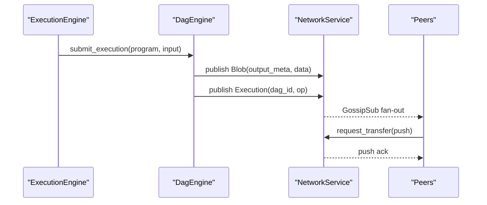

**Diagram sources**
- [consensus/mod.rs](file://src/consensus/mod.rs#L194-L258)
- [consensus/mod.rs](file://src/consensus/mod.rs#L259-L292)
- [consensus/mod.rs](file://src/consensus/mod.rs#L721-L730)

**Section sources**
- [consensus/mod.rs](file://src/consensus/mod.rs#L194-L258)
- [consensus/mod.rs](file://src/consensus/mod.rs#L259-L292)

### Integration with Storage for Blob Synchronization
- Blob ingestion: Consensus ingests local blobs and forwards to peers; BlobStore replicates and indexes.
- Blob advertisement: Nodes advertise presence and locations; consumers request via BlobRequest.
- Chunking and integrity: BlobStore enforces chunk counts, chunk hashes, and Merkle roots.

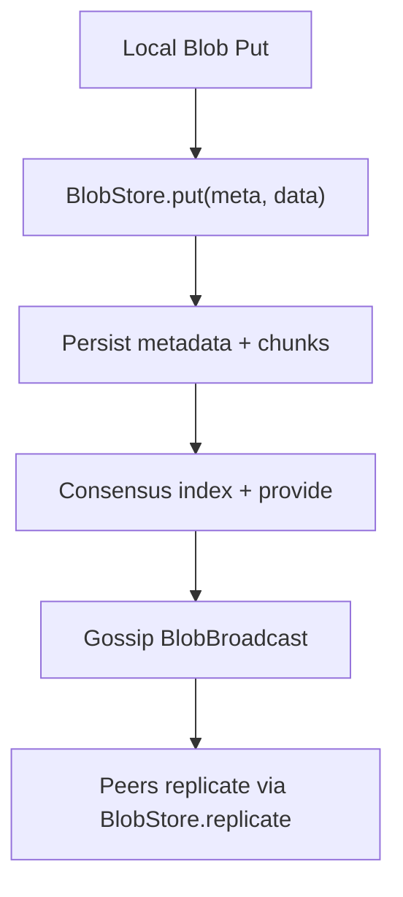

**Diagram sources**
- [consensus/mod.rs](file://src/consensus/mod.rs#L260-L271)
- [blob_store.rs](file://src/storage/blob_store.rs#L18-L144)

**Section sources**
- [consensus/mod.rs](file://src/consensus/mod.rs#L260-L271)
- [blob_store.rs](file://src/storage/blob_store.rs#L18-L144)

### Security: Encrypted Channels and Authentication
- Transport encryption: TLS + Noise handshake for secure channels.
- Identity: ed25519 keypair used to derive libp2p identity and PeerId; GossipSub operates in signed mode.
- Message integrity: Blake3-based message IDs for deduplication and integrity checks.

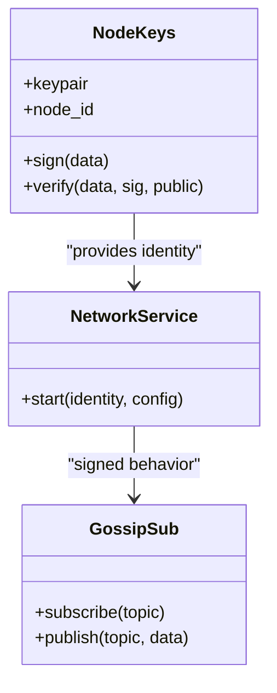

**Diagram sources**
- [keys.rs](file://src/crypto/keys.rs#L1-L73)
- [service.rs](file://src/network/service.rs#L212-L239)
- [service.rs](file://src/network/service.rs#L236-L238)

**Section sources**
- [service.rs](file://src/network/service.rs#L255-L264)
- [service.rs](file://src/network/service.rs#L221-L239)
- [keys.rs](file://src/crypto/keys.rs#L1-L73)

### Network Topology Considerations
- Local cluster: mDNS discovery accelerates peer formation; low-latency LAN gossip.
- Wide-area network: mDNS is limited to LAN; rely on Kademlia provider lookups and explicit bootstrap peers; configure appropriate listen addresses and ports.
- Port binding: Node retries listen addresses on conflicts.

**Section sources**
- [service.rs](file://src/network/service.rs#L302-L336)
- [node.rs](file://src/node.rs#L135-L163)

### DoS Protection
- Gossip validation: Strict validation mode reduces invalid message propagation.
- Deduplication: Recent message ID window prevents retransmission storms.
- Idle connections: Configured idle timeout reduces resource consumption.
- Request/Response failures: Logged warnings for outbound/inbound failures.

**Section sources**
- [service.rs](file://src/network/service.rs#L221-L239)
- [service.rs](file://src/network/service.rs#L413-L420)
- [service.rs](file://src/network/service.rs#L362-L369)

## Dependency Analysis
The network layer depends on libp2p features and integrates with consensus and storage modules.

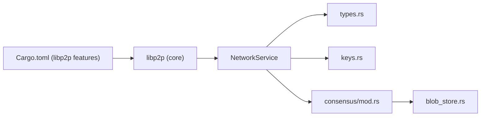

**Diagram sources**
- [Cargo.toml](file://Cargo.toml#L18-L33)
- [service.rs](file://src/network/service.rs#L1-L21)
- [types.rs](file://src/types.rs#L1-L109)
- [keys.rs](file://src/crypto/keys.rs#L1-L73)
- [consensus/mod.rs](file://src/consensus/mod.rs#L1-L21)
- [blob_store.rs](file://src/storage/blob_store.rs#L1-L18)

**Section sources**
- [Cargo.toml](file://Cargo.toml#L18-L33)
- [service.rs](file://src/network/service.rs#L1-L21)

## Performance Considerations
- Gossip heartbeat: Tune heartbeat interval to balance propagation speed and CPU usage.
- Deduplication window: Adjust window size to trade off memory vs. duplicate suppression effectiveness.
- Inventory frequency: Periodic inventory broadcasts help anti-entropy but increase bandwidth; gated by minimum peer threshold.
- Chunk sizes: BlobStore chunking affects replication throughput and integrity verification cost.

[No sources needed since this section provides general guidance]

## Troubleshooting Guide
- No peers discovered:
  - Verify mDNS is enabled and on the same subnet.
  - Check Kademlia provider lookups for missing keys.
- Gossip not propagating:
  - Confirm subscription to topics and strict validation settings.
  - Inspect deduplication window and message IDs.
- Transfer failures:
  - Review outbound/inbound failure logs and peer connectivity.
  - Ensure CBOR protocol registration and correct request/response handling.
- Initial sync never completes:
  - Confirm inventory requests and provider hints are triggered.
  - Check Bloom filter correctness and missing item counts.

**Section sources**
- [service.rs](file://src/network/service.rs#L302-L336)
- [service.rs](file://src/network/service.rs#L315-L336)
- [service.rs](file://src/network/service.rs#L349-L369)
- [consensus/mod.rs](file://src/consensus/mod.rs#L732-L753)
- [syncer/mod.rs](file://src/syncer/mod.rs#L15-L40)

## Conclusion
The libp2p-based networking layer provides a robust foundation for decentralized communication with secure transports, efficient peer discovery, and scalable gossip propagation. It integrates tightly with Consensus for block and execution propagation and with Storage for blob synchronization. Anti-entropy mechanisms and deduplication ensure consistent DAG views across the network, while security primitives protect against tampering and man-in-the-middle attacks.

## Appendices

### Packet Flow: New Block Gossip Across the Network
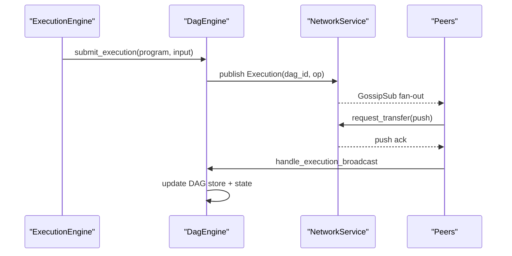

**Diagram sources**
- [consensus/mod.rs](file://src/consensus/mod.rs#L194-L258)
- [consensus/mod.rs](file://src/consensus/mod.rs#L445-L483)
- [consensus/mod.rs](file://src/consensus/mod.rs#L721-L730)

### Packet Flow: DAG Consistency Maintenance
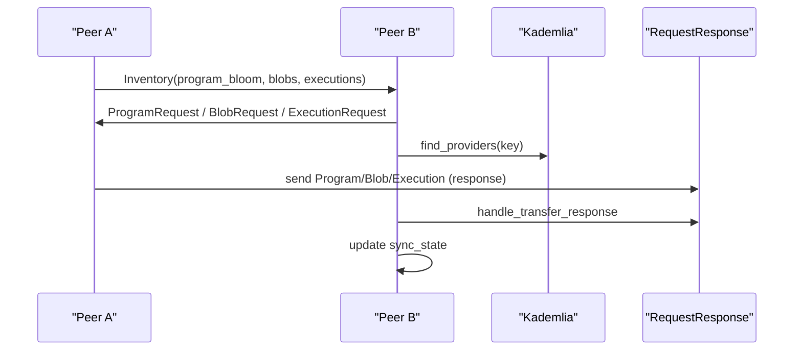

**Diagram sources**
- [consensus/mod.rs](file://src/consensus/mod.rs#L732-L753)
- [consensus/mod.rs](file://src/consensus/mod.rs#L501-L616)
- [consensus/mod.rs](file://src/consensus/mod.rs#L618-L697)