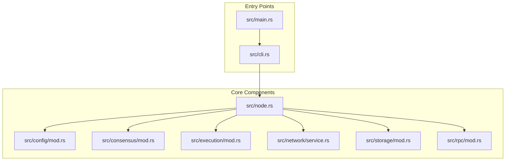
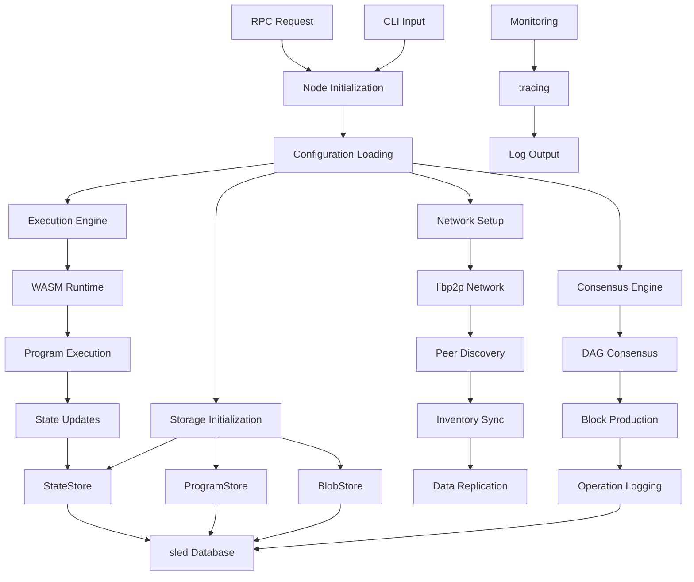
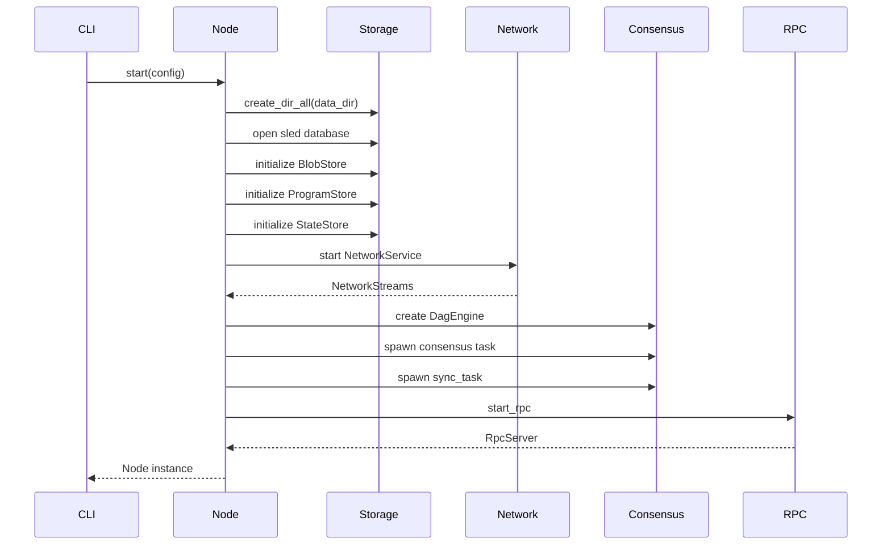
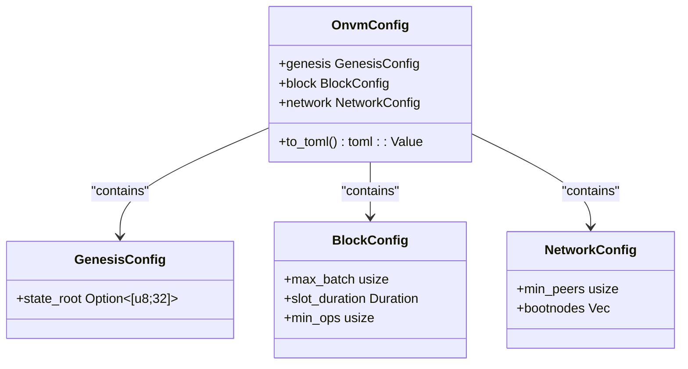
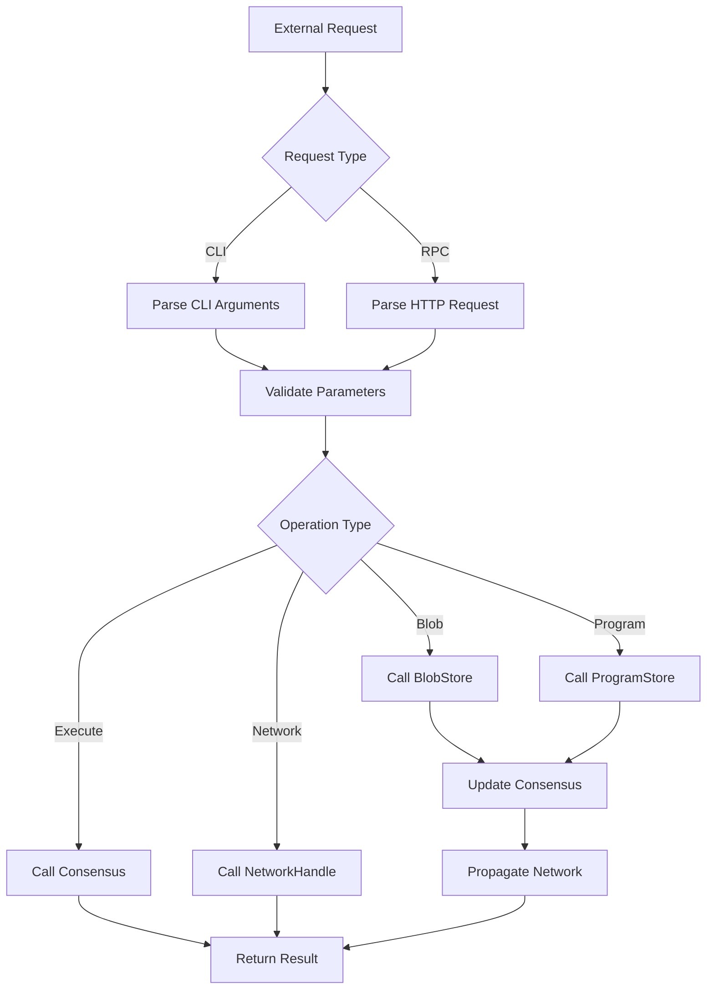
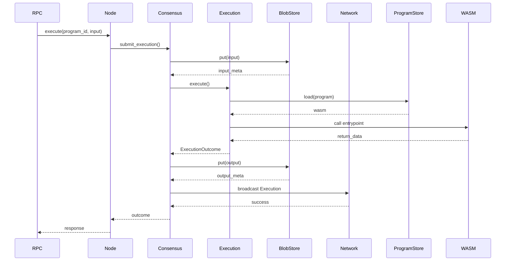
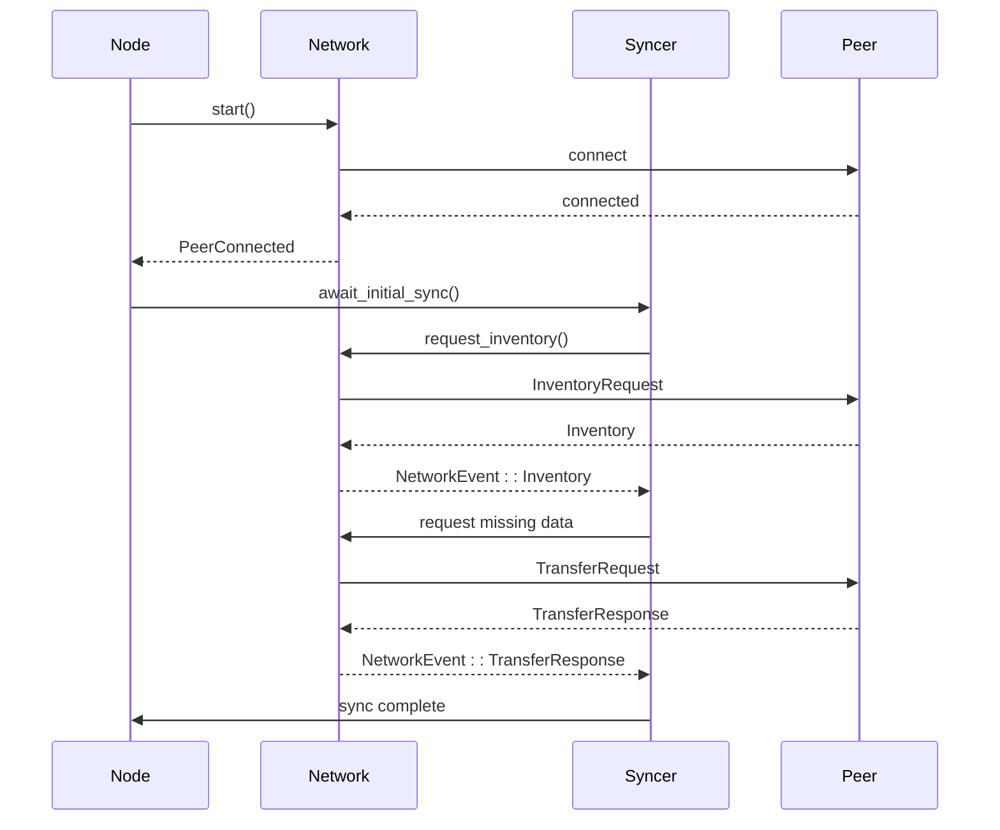
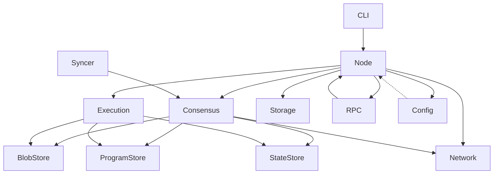

# Node Orchestration

<cite>
**Referenced Files in This Document**   
- [src/node.rs](file://src/node.rs)
- [src/cli.rs](file://src/cli.rs)
- [src/main.rs](file://src/main.rs)
- [src/config/mod.rs](file://src/config/mod.rs)
- [src/rpc/mod.rs](file://src/rpc/mod.rs)
- [src/consensus/mod.rs](file://src/consensus/mod.rs)
- [src/execution/runtime.rs](file://src/execution/runtime.rs)
- [src/execution/scheduler.rs](file://src/execution/scheduler.rs)
- [src/network/service.rs](file://src/network/service.rs)
- [src/storage/blob_store.rs](file://src/storage/blob_store.rs)
- [src/storage/state_store.rs](file://src/storage/state_store.rs)
- [src/syncer/mod.rs](file://src/syncer/mod.rs)
</cite>

## Table of Contents
1. [Introduction](#introduction)
2. [Project Structure](#project-structure)
3. [Core Components](#core-components)
4. [Architecture Overview](#architecture-overview)
5. [Detailed Component Analysis](#detailed-component-analysis)
6. [Dependency Analysis](#dependency-analysis)
7. [Performance Considerations](#performance-considerations)
8. [Troubleshooting Guide](#troubleshooting-guide)
9. [Conclusion](#conclusion)

## Introduction
The Node component in the ONVM system serves as the central orchestrator that integrates consensus, execution, networking, storage, and RPC layers. It manages the lifecycle of all subsystems, routes operations between components, and ensures coordinated operation across the distributed network. The Node initializes during startup by loading configuration, establishing data stores, and launching background tasks for consensus, networking, and synchronization. It handles both CLI and RPC requests by translating them into internal operations, coordinates block production with the Consensus layer, triggers program execution through the Execution subsystem, synchronizes state with the Network layer, and persists data via the Storage components. Built on Tokio for asynchronous event loop management, the Node provides fault tolerance, graceful shutdown procedures, and comprehensive monitoring through tracing.

## Project Structure
The ONVM system follows a modular architecture with clearly separated concerns. The core Node orchestration logic resides in `src/node.rs`, while configuration management is handled in `src/config/mod.rs`. The system integrates multiple subsystems including consensus (DAG-based), execution (WASM runtime), networking (libp2p), storage (sled database), and RPC (axum). The CLI interface in `src/cli.rs` provides user interaction points for node initialization and operation, while `src/main.rs` serves as the entry point. The WASM programs directory contains sample applications that can be deployed and executed on the network.

**Diagram sources**
- [src/node.rs](file://src/node.rs#L1-L162)
- [src/cli.rs](file://src/cli.rs#L1-L300)
- [src/main.rs](file://src/main.rs#L1-L7)

**Section sources**
- [src/node.rs](file://src/node.rs#L1-L162)
- [src/cli.rs](file://src/cli.rs#L1-L300)
- [src/main.rs](file://src/main.rs#L1-L7)

## Core Components
The Node component integrates several core subsystems that work together to provide a distributed execution environment. The NodeConfig structure defines initialization parameters including data directory, network addresses, and operational modes. During startup, the Node creates and initializes storage components (BlobStore, ProgramStore, StateStore), establishes network connectivity through libp2p, and launches the consensus engine. The execution subsystem provides WASM program execution capabilities with fuel-based resource limiting. The RPC layer exposes these capabilities through a RESTful interface, while the CLI provides command-line access. All components are managed through Arc references for safe sharing across async tasks, and the entire system runs on Tokio's event loop for efficient asynchronous operation.

**Section sources**
- [src/node.rs](file://src/node.rs#L1-L162)
- [src/execution/runtime.rs](file://src/execution/runtime.rs#L1-L377)
- [src/storage/blob_store.rs](file://src/storage/blob_store.rs#L1-L185)

## Architecture Overview
The Node acts as the central integration point for all ONVM system components, coordinating their interactions and managing their lifecycle. It follows a dependency injection pattern where configuration and shared resources are passed to subsystems during initialization. The architecture is event-driven, with the consensus engine consuming network events and triggering appropriate actions. The Node maintains references to all major components, allowing it to route operations between them efficiently. Configuration is loaded from TOML files and provides default values for genesis parameters, block production, and network settings. The system uses tracing for comprehensive monitoring, with log levels configurable through environment variables.

**Diagram sources**
- [src/node.rs](file://src/node.rs#L1-L162)
- [src/config/mod.rs](file://src/config/mod.rs#L1-L140)
- [src/consensus/mod.rs](file://src/consensus/mod.rs#L1-L800)

## Detailed Component Analysis

### Node Initialization and Lifecycle Management
The Node component manages the complete lifecycle of the ONVM system, from initialization to shutdown. During startup, it creates the necessary directory structure, opens the sled database, and initializes all storage components. The NodeConfig structure contains all parameters needed for initialization, including data directory paths, network addresses, and operational modes. The start method is asynchronous and returns a Node instance once all components are successfully initialized. Background tasks are spawned using tokio::spawn to handle consensus operations and initial synchronization, with JoinHandle references stored for potential future management.

**Diagram sources**
- [src/node.rs](file://src/node.rs#L38-L132)
- [src/cli.rs](file://src/cli.rs#L130-L163)
- [src/rpc/mod.rs](file://src/rpc/mod.rs#L62-L95)

**Section sources**
- [src/node.rs](file://src/node.rs#L1-L162)
- [src/cli.rs](file://src/cli.rs#L1-L300)

### Configuration Management
The configuration system in ONVM provides a centralized source of truth for runtime parameters. The OnvmConfig structure contains three main components: GenesisConfig for chain initialization parameters, BlockConfig for block production settings, and NetworkConfig for peer-to-peer networking options. Default values are provided through the Default trait implementation, ensuring the system can operate without explicit configuration. The configuration can be written to TOML format for persistence, allowing nodes to maintain consistent settings across restarts. Parameters include maximum batch size, slot duration, minimum operations per block, minimum peer count, and bootnode addresses.

**Diagram sources**
- [src/config/mod.rs](file://src/config/mod.rs#L11-L140)

**Section sources**
- [src/config/mod.rs](file://src/config/mod.rs#L1-L140)

### Request Processing and Operation Routing
The Node component serves as the central router for all operations in the ONVM system, translating external requests into internal operations. CLI commands and RPC requests are processed through the same internal pathways, ensuring consistent behavior across interfaces. The RPC layer uses axum to define routes for health checks, blob operations, program deployment, and execution requests. When a request is received, it is validated and converted into an appropriate internal operation, which is then passed to the relevant subsystem. The Node ensures proper error handling and response formatting, with detailed error messages returned to clients when operations fail.

**Diagram sources**
- [src/cli.rs](file://src/cli.rs#L1-L300)
- [src/rpc/mod.rs](file://src/rpc/mod.rs#L1-L241)

**Section sources**
- [src/cli.rs](file://src/cli.rs#L1-L300)
- [src/rpc/mod.rs](file://src/rpc/mod.rs#L1-L241)

### Consensus and Execution Integration
The Node tightly integrates the consensus and execution layers, ensuring that all program executions are properly recorded and replicated across the network. When a program execution request is received, the Node first verifies that the program metadata exists locally, then submits the execution request to the consensus engine. The consensus engine coordinates with the execution scheduler to run the WASM program, captures the outcome, and records the operation in the DAG. Input and output data are stored in the BlobStore and indexed by the consensus layer, ensuring data availability and integrity. The execution uses a fuel-based model to prevent resource exhaustion, with a configurable maximum fuel limit.

**Diagram sources**
- [src/node.rs](file://src/node.rs#L1-L162)
- [src/consensus/mod.rs](file://src/consensus/mod.rs#L194-L258)
- [src/execution/runtime.rs](file://src/execution/runtime.rs#L79-L183)

**Section sources**
- [src/consensus/mod.rs](file://src/consensus/mod.rs#L1-L800)
- [src/execution/runtime.rs](file://src/execution/runtime.rs#L1-L377)

### Networking and Synchronization
The Node manages network connectivity through libp2p, using gossipsub for message broadcasting and kademlia for peer discovery. The NetworkService establishes connections with peers, handles incoming messages, and manages the transfer of data between nodes. The syncer component ensures that new nodes can synchronize with the network state by requesting inventory information and downloading missing programs, blobs, and execution records. The synchronization process uses bloom filters to efficiently compare state between nodes and minimize unnecessary data transfer. The Node maintains a list of connected peers and uses this information to determine when consensus operations can proceed.

**Diagram sources**
- [src/node.rs](file://src/node.rs#L58-L83)
- [src/network/service.rs](file://src/network/service.rs#L213-L438)
- [src/syncer/mod.rs](file://src/syncer/mod.rs#L15-L54)

**Section sources**
- [src/network/service.rs](file://src/network/service.rs#L1-L458)
- [src/syncer/mod.rs](file://src/syncer/mod.rs#L1-L69)

## Dependency Analysis
The Node component has well-defined dependencies on all major subsystems in the ONVM system. It depends directly on the consensus, execution, networking, storage, and RPC layers, serving as the integration point between them. The dependency graph shows a clear hierarchy with the Node at the center, coordinating interactions between components that otherwise have minimal direct dependencies on each other. This architecture promotes loose coupling and high cohesion, making the system more maintainable and extensible. The use of Arc for shared ownership allows multiple components to access the same data without unnecessary copying, while the async/await pattern enables efficient resource utilization.

**Diagram sources**
- [src/node.rs](file://src/node.rs#L1-L162)
- [src/lib.rs](file://src/lib.rs#L1-L12)

**Section sources**
- [src/node.rs](file://src/node.rs#L1-L162)
- [src/lib.rs](file://src/lib.rs#L1-L12)

## Performance Considerations
The Node component is designed with performance in mind, leveraging asynchronous programming patterns and efficient data structures. The execution scheduler uses spawn_blocking to run WASM programs on dedicated threads, preventing them from blocking the async runtime. The BlobStore and StateStore use sled as a high-performance embedded database with ACID guarantees. The network layer uses efficient serialization (bincode) for internal messages and implements deduplication to prevent processing the same message multiple times. The WASM runtime includes a module cache to avoid recompiling programs on each execution, significantly improving performance for frequently executed programs. The system also implements batching and pipelining where appropriate to maximize throughput.

**Section sources**
- [src/execution/scheduler.rs](file://src/execution/scheduler.rs#L1-L41)
- [src/storage/blob_store.rs](file://src/storage/blob_store.rs#L1-L185)
- [src/execution/runtime.rs](file://src/execution/runtime.rs#L1-L377)

## Troubleshooting Guide
When troubleshooting issues with the Node component, start by checking the logging output, as comprehensive tracing is implemented throughout the system. Common issues include network connectivity problems, which can be diagnosed by checking the peer connection status and inventory synchronization. If program execution fails, verify that the program metadata is available locally and that the WASM module is valid. Storage issues may occur if the sled database becomes corrupted, in which case the data directory may need to be recreated. Configuration problems can be identified by checking the config.toml file and ensuring all paths are correct. The system includes health checks through the RPC /health endpoint that can be used to verify basic functionality.

**Section sources**
- [src/node.rs](file://src/node.rs#L1-L162)
- [src/cli.rs](file://src/cli.rs#L1-L300)
- [src/rpc/mod.rs](file://src/rpc/mod.rs#L1-L241)

## Conclusion
The Node component in the ONVM system serves as a sophisticated orchestrator that integrates multiple complex subsystems into a cohesive distributed execution environment. Its architecture demonstrates several best practices in systems design, including clear separation of concerns, dependency injection, and event-driven programming. The use of modern Rust libraries like tokio, axum, and libp2p enables high performance and reliability. The Node's role as the central integration point allows it to coordinate operations across consensus, execution, networking, and storage layers, providing a unified interface for both CLI and RPC interactions. Its design supports extensibility through plugin architectures and custom initialization routines, making it adaptable to various use cases. The comprehensive monitoring through tracing and structured logging ensures that the system is observable and maintainable in production environments.