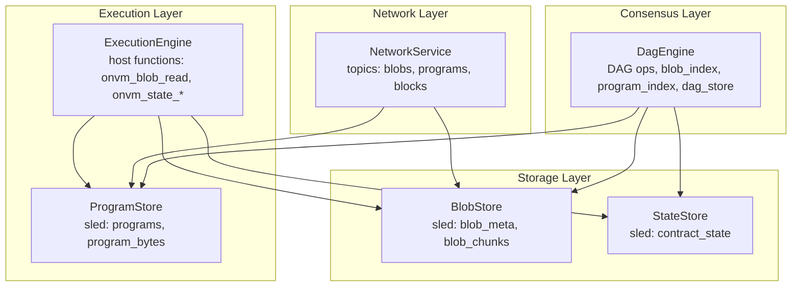
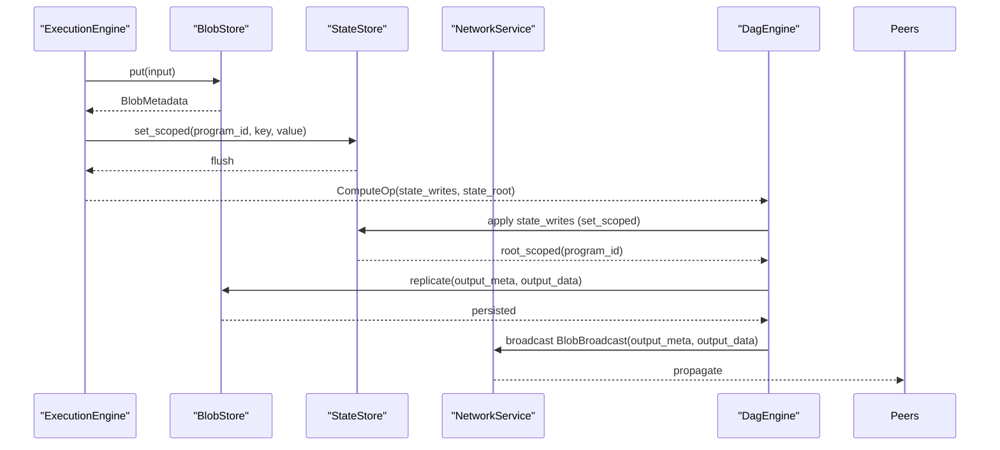
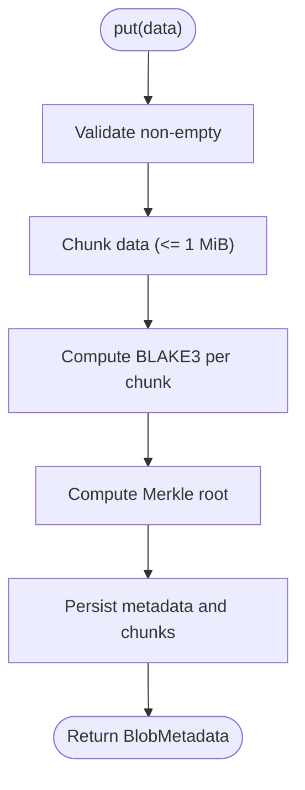
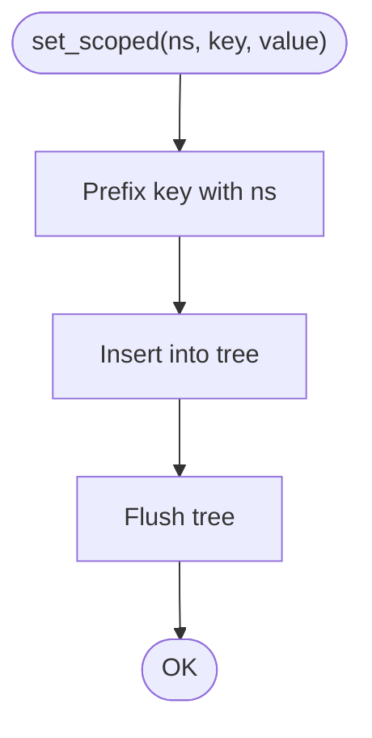
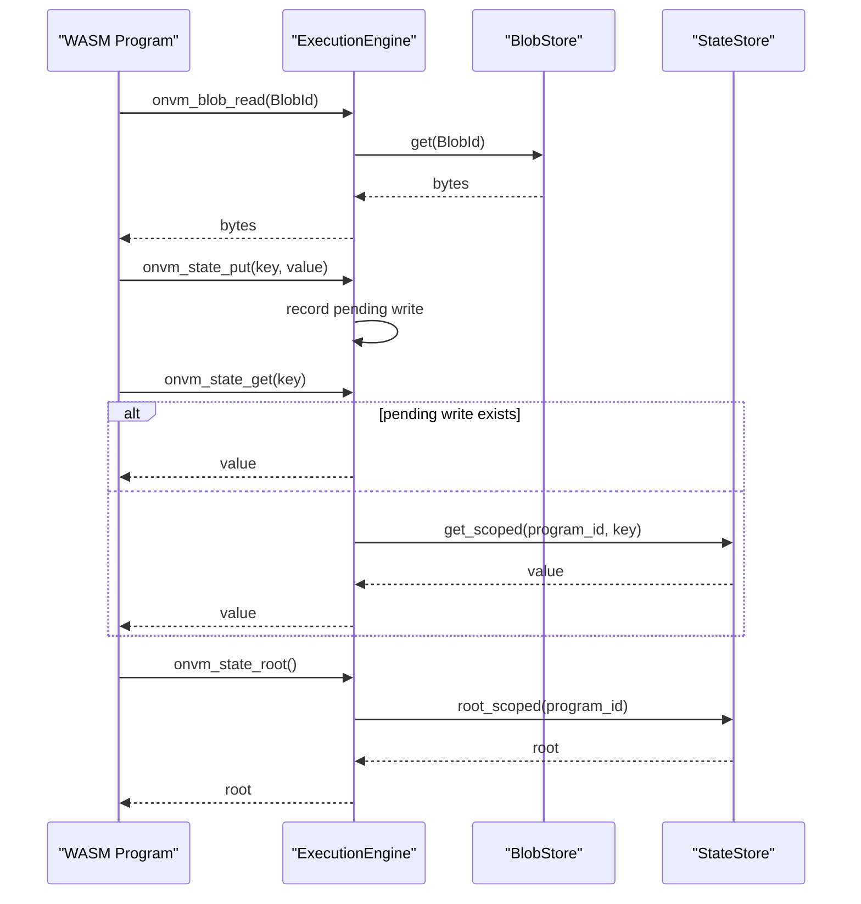
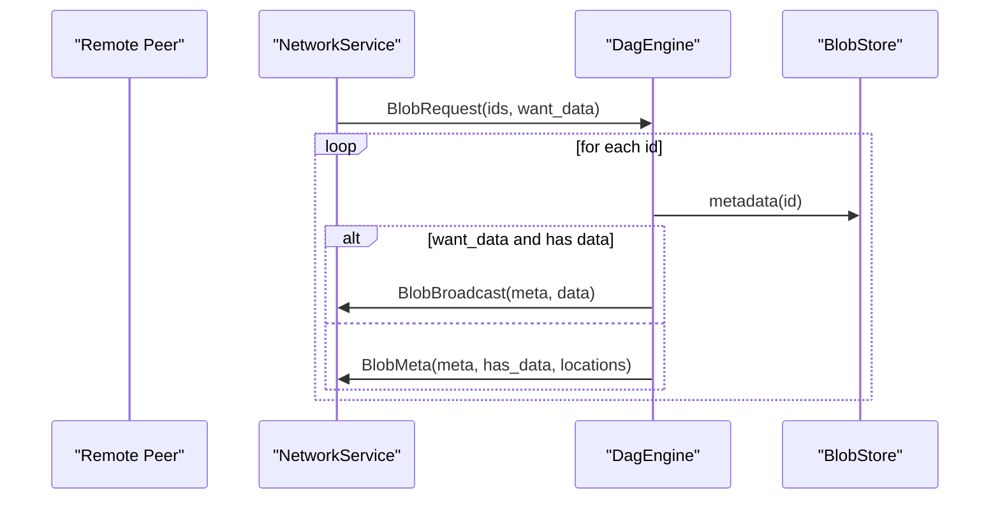
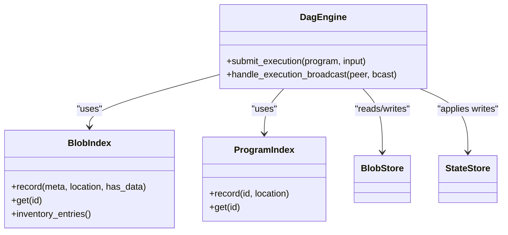
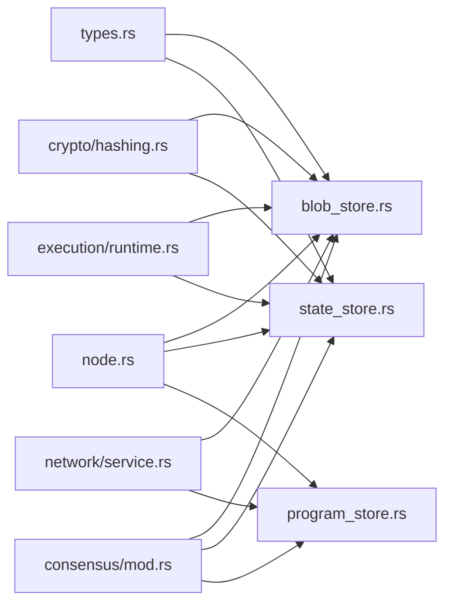
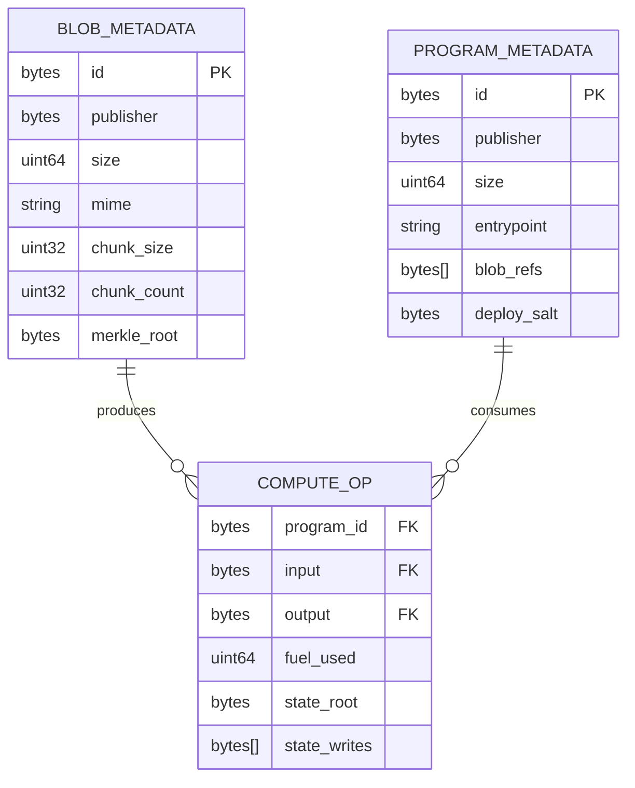

# Storage System

<cite>
**Referenced Files in This Document**
- [src/storage/mod.rs](file://src/storage/mod.rs)
- [src/storage/blob_store.rs](file://src/storage/blob_store.rs)
- [src/storage/state_store.rs](file://src/storage/state_store.rs)
- [src/crypto/hashing.rs](file://src/crypto/hashing.rs)
- [src/types.rs](file://src/types.rs)
- [src/execution/runtime.rs](file://src/execution/runtime.rs)
- [src/execution/program_store.rs](file://src/execution/program_store.rs)
- [src/network/service.rs](file://src/network/service.rs)
- [src/consensus/mod.rs](file://src/consensus/mod.rs)
- [src/node.rs](file://src/node.rs)
</cite>

## Table of Contents
1. [Introduction](#introduction)
2. [Project Structure](#project-structure)
3. [Core Components](#core-components)
4. [Architecture Overview](#architecture-overview)
5. [Detailed Component Analysis](#detailed-component-analysis)
6. [Dependency Analysis](#dependency-analysis)
7. [Performance Considerations](#performance-considerations)
8. [Troubleshooting Guide](#troubleshooting-guide)
9. [Conclusion](#conclusion)
10. [Appendices](#appendices)

## Introduction
This document describes the dual-layer Storage System powering the node. It comprises:
- A content-addressable Blob Store built on sled for immutable data storage, keyed by BLAKE3 hashes and protected by per-chunk and Merkle roots.
- A State Store for mutable program state with deterministic versioning and snapshot capabilities via BLAKE3-based Merkle roots scoped by ProgramId.
- Interfaces for Execution (WASM program runtime), Network (blob synchronization), and Consensus (block metadata and DAG operations).

The document details data layout, indexing strategies, persistence guarantees, performance characteristics, caching mechanisms, disk space management, backup/restore, data migration, and integration with Wasm program execution contexts. It also presents schema diagrams showing relationships among BlobId, ProgramId, and BlockId.

## Project Structure
The storage layer is organized under src/storage with two primary modules:
- BlobStore: content-addressable blob storage with chunking and Merkle verification.
- StateStore: key-value state storage with namespace scoping and Merkle root computation.

Execution integrates with BlobStore and StateStore via host functions. Network uses BlobStore and indexes for synchronization. Consensus uses BlobStore, StateStore, and maintains a DAG of operations.

**Diagram sources**
- [src/storage/blob_store.rs](file://src/storage/blob_store.rs#L1-L143)
- [src/storage/state_store.rs](file://src/storage/state_store.rs#L1-L80)
- [src/execution/runtime.rs](file://src/execution/runtime.rs#L1-L377)
- [src/execution/program_store.rs](file://src/execution/program_store.rs#L1-L96)
- [src/network/service.rs](file://src/network/service.rs#L1-L458)
- [src/consensus/mod.rs](file://src/consensus/mod.rs#L1-L1112)

**Section sources**
- [src/storage/mod.rs](file://src/storage/mod.rs#L1-L6)
- [src/node.rs](file://src/node.rs#L37-L132)

## Core Components
- BlobStore
  - Immutable, content-addressable storage keyed by BLAKE3 of raw bytes.
  - Stores metadata and chunked data separately; verifies integrity on read/write.
  - Provides put, replicate, get, metadata, and list APIs.
- StateStore
  - Mutable key-value store scoped by ProgramId (namespace).
  - Computes a BLAKE3 Merkle root over (key, value) pairs in the namespace.
  - Provides get_scoped, set_scoped, and root_scoped APIs.
- Types
  - Defines BlobId, ProgramId, BlockId, NodeId, and associated metadata structures.
  - Uses BLAKE3 for cryptographic hashing across identifiers.

**Section sources**
- [src/storage/blob_store.rs](file://src/storage/blob_store.rs#L1-L185)
- [src/storage/state_store.rs](file://src/storage/state_store.rs#L1-L80)
- [src/types.rs](file://src/types.rs#L1-L109)
- [src/crypto/hashing.rs](file://src/crypto/hashing.rs#L1-L8)

## Architecture Overview
The storage system is dual-layer:
- Blob Store: immutable, chunked, and verifiable via BLAKE3 and Merkle roots.
- State Store: mutable, namespace-scoped, and verifiable via BLAKE3 Merkle roots.

Interfaces:
- Execution reads/writes state and blobs via host functions attached to the WASM runtime.
- Network retrieves blobs for synchronization and advertises availability.
- Consensus persists block metadata and applies state updates from execution outcomes.

**Diagram sources**
- [src/execution/runtime.rs](file://src/execution/runtime.rs#L1-L377)
- [src/storage/blob_store.rs](file://src/storage/blob_store.rs#L1-L143)
- [src/storage/state_store.rs](file://src/storage/state_store.rs#L1-L80)
- [src/network/service.rs](file://src/network/service.rs#L1-L458)
- [src/consensus/mod.rs](file://src/consensus/mod.rs#L194-L292)

## Detailed Component Analysis

### Blob Store
- Data layout
  - Metadata stored under a dedicated tree keyed by BlobId.
  - Chunked data stored under a separate tree keyed by BlobId concatenated with chunk index.
- Integrity and verification
  - On write: data split into chunks, BLAKE3 computed per chunk, Merkle root computed; persisted atomically.
  - On read: recompute chunk hashes and Merkle root to verify integrity; enforce size and chunk count checks.
- Indexing
  - Consensus maintains a BlobIndex for advertisement and synchronization.
- Persistence guarantees
  - Flushes metadata and chunk trees after write to ensure durability.

**Diagram sources**
- [src/storage/blob_store.rs](file://src/storage/blob_store.rs#L18-L46)
- [src/storage/blob_store.rs](file://src/storage/blob_store.rs#L128-L142)
- [src/crypto/hashing.rs](file://src/crypto/hashing.rs#L1-L8)

**Section sources**
- [src/storage/blob_store.rs](file://src/storage/blob_store.rs#L1-L185)
- [src/consensus/mod.rs](file://src/consensus/mod.rs#L929-L985)

### State Store
- Data layout
  - Single tree for state, with keys prefixed by ProgramId to provide namespaces.
- Versioning and snapshots
  - root_scoped computes a BLAKE3 Merkle root over all (key, value) pairs in the namespace.
  - ExecutionEngine applies pending writes deterministically and computes the final state root.
- Persistence guarantees
  - Flushes after each set_scoped operation.

**Diagram sources**
- [src/storage/state_store.rs](file://src/storage/state_store.rs#L17-L27)
- [src/execution/runtime.rs](file://src/execution/runtime.rs#L156-L183)

**Section sources**
- [src/storage/state_store.rs](file://src/storage/state_store.rs#L1-L80)
- [src/execution/runtime.rs](file://src/execution/runtime.rs#L1-L377)

### Execution Integration (WASM Runtime)
- Host functions
  - onvm_blob_read: reads blob by BlobId into guest memory.
  - onvm_state_put: records pending writes for later application.
  - onvm_state_get: reads from pending writes overlay or StateStore.
  - onvm_state_root: computes the state root, incorporating pending writes.
- Deterministic state application
  - Pending writes are sorted by key and applied in order; final root computed after application.

**Diagram sources**
- [src/execution/runtime.rs](file://src/execution/runtime.rs#L199-L377)
- [src/storage/blob_store.rs](file://src/storage/blob_store.rs#L78-L104)
- [src/storage/state_store.rs](file://src/storage/state_store.rs#L17-L41)

**Section sources**
- [src/execution/runtime.rs](file://src/execution/runtime.rs#L1-L377)

### Network Integration (Synchronization)
- Topics and messages
  - Blobs, Programs, Blocks topics; BlobBroadcast, ProgramBroadcast, ExecutionBroadcast, Inventory, BlobRequest, ProgramSyncRequest, etc.
- Blob synchronization modes
  - FullData: replicate blob data and metadata.
  - MetadataOnly: record advertisement and index presence without data.
- Provider discovery
  - Kademlia DHT to advertise and discover providers for ProgramId and BlobId keys.

**Diagram sources**
- [src/network/service.rs](file://src/network/service.rs#L1-L458)
- [src/consensus/mod.rs](file://src/consensus/mod.rs#L416-L443)

**Section sources**
- [src/network/service.rs](file://src/network/service.rs#L1-L458)
- [src/consensus/mod.rs](file://src/consensus/mod.rs#L380-L443)

### Consensus Integration (DAG and Indexing)
- BlobIndex
  - Tracks presence and locations of blobs; supports inventory entries and record updates.
- ProgramIndex
  - Tracks presence and locations of programs.
- DAG operations
  - Records Compute operations with parent references to ProgramId and BlobId.
  - Applies state writes and ensures output blobs are indexed.

**Diagram sources**
- [src/consensus/mod.rs](file://src/consensus/mod.rs#L929-L1004)
- [src/consensus/mod.rs](file://src/consensus/mod.rs#L194-L292)

**Section sources**
- [src/consensus/mod.rs](file://src/consensus/mod.rs#L1-L1112)

## Dependency Analysis
- Storage layer depends on sled for durable key-value storage.
- ExecutionEngine depends on BlobStore and StateStore for runtime operations.
- NetworkService depends on BlobStore and ProgramStore for synchronization.
- Consensus depends on BlobStore, StateStore, ProgramStore, and maintains indices for synchronization.

**Diagram sources**
- [src/types.rs](file://src/types.rs#L1-L109)
- [src/crypto/hashing.rs](file://src/crypto/hashing.rs#L1-L8)
- [src/node.rs](file://src/node.rs#L37-L132)
- [src/storage/blob_store.rs](file://src/storage/blob_store.rs#L1-L185)
- [src/storage/state_store.rs](file://src/storage/state_store.rs#L1-L80)
- [src/execution/runtime.rs](file://src/execution/runtime.rs#L1-L377)
- [src/execution/program_store.rs](file://src/execution/program_store.rs#L1-L96)
- [src/network/service.rs](file://src/network/service.rs#L1-L458)
- [src/consensus/mod.rs](file://src/consensus/mod.rs#L1-L1112)

**Section sources**
- [src/node.rs](file://src/node.rs#L37-L132)
- [src/consensus/mod.rs](file://src/consensus/mod.rs#L1-L1112)

## Performance Considerations
- Blob chunking
  - Default chunk size is approximately 1 MiB; reduces memory pressure during reads and enables efficient partial retrieval.
- Merkle verification
  - On read, recomputes chunk hashes and Merkle root to ensure integrity; adds CPU overhead proportional to chunk count.
- State hashing
  - StateStore sorts pending writes deterministically before applying; complexity grows with number of writes.
- Flush behavior
  - Both BlobStore and StateStore flush after writes; improves durability but increases I/O latency.
- Network bandwidth
  - BlobSyncMode::FullData replicates full data; MetadataOnly reduces bandwidth but may increase subsequent requests.
- Caching
  - ExecutionEngine caches compiled Wasm modules per ProgramId to reduce compilation overhead.

[No sources needed since this section provides general guidance]

## Troubleshooting Guide
- BlobStore errors
  - Empty blob or invalid chunk size leads to errors during put/replicate.
  - Mismatch in chunk count, chunk hashes, or Merkle root triggers verification failures on replicate/get.
- StateStore errors
  - Missing program bytes or metadata cause errors when loading programs.
- Network synchronization
  - If providers are not found, Kademlia queries may fail; ensure provide/find_providers are invoked for ProgramId and BlobId keys.
- Consensus DAG
  - Execution broadcast with mismatched DAG id is rejected; ensure correct parent references and consistent state application.

**Section sources**
- [src/storage/blob_store.rs](file://src/storage/blob_store.rs#L48-L104)
- [src/execution/program_store.rs](file://src/execution/program_store.rs#L66-L72)
- [src/network/service.rs](file://src/network/service.rs#L145-L167)
- [src/consensus/mod.rs](file://src/consensus/mod.rs#L445-L483)

## Conclusion
The dual-layer Storage System provides a robust foundation for immutable blob storage and mutable state management. BlobStore ensures integrity via BLAKE3 and Merkle roots; StateStore offers deterministic versioning through Merkle roots. Execution, Network, and Consensus integrate cleanly through well-defined interfaces, enabling scalable synchronization and verifiable state transitions.

[No sources needed since this section summarizes without analyzing specific files]

## Appendices

### Data Layout and Indexing Strategies
- BlobStore
  - Trees: blob_meta (metadata), blob_chunks (chunked data).
  - Keys: BlobId for metadata; BlobId + chunk index for chunks.
- StateStore
  - Tree: contract_state.
  - Keys: ProgramId + key (prefixed).
- Indices
  - BlobIndex: blob_index tree storing presence, locations, and data availability.
  - ProgramIndex: program_index tree storing presence and locations.

**Section sources**
- [src/storage/blob_store.rs](file://src/storage/blob_store.rs#L106-L143)
- [src/storage/state_store.rs](file://src/storage/state_store.rs#L17-L41)
- [src/consensus/mod.rs](file://src/consensus/mod.rs#L929-L1004)

### Persistence Guarantees
- Flush after insert ensures durability for both BlobStore and StateStore.
- Consensus persists DAG nodes and indices for fault tolerance.

**Section sources**
- [src/storage/blob_store.rs](file://src/storage/blob_store.rs#L132-L142)
- [src/storage/state_store.rs](file://src/storage/state_store.rs#L22-L27)
- [src/consensus/mod.rs](file://src/consensus/mod.rs#L294-L306)

### Backup and Restore Procedures
- Backup
  - Snapshot the sled database directory containing all trees (blob_meta, blob_chunks, contract_state, blob_index, program_index, programs, program_bytes).
- Restore
  - Replace the database directory with the snapshot and restart the node.
- Notes
  - Ensure consistent shutdown to avoid partial flushes.

**Section sources**
- [src/node.rs](file://src/node.rs#L37-L62)

### Data Migration Paths
- Versioned schema changes
  - Introduce new trees or alter key formats; migrate existing data by reading old keys and writing new keys.
- Backward compatibility
  - Maintain legacy trees during migration; remove after successful migration.

**Section sources**
- [src/storage/blob_store.rs](file://src/storage/blob_store.rs#L128-L142)
- [src/storage/state_store.rs](file://src/storage/state_store.rs#L12-L15)

### Schema Diagram: BlobId, ProgramId, BlockId Relationships

**Diagram sources**
- [src/types.rs](file://src/types.rs#L17-L41)
- [src/consensus/mod.rs](file://src/consensus/mod.rs#L22-L47)