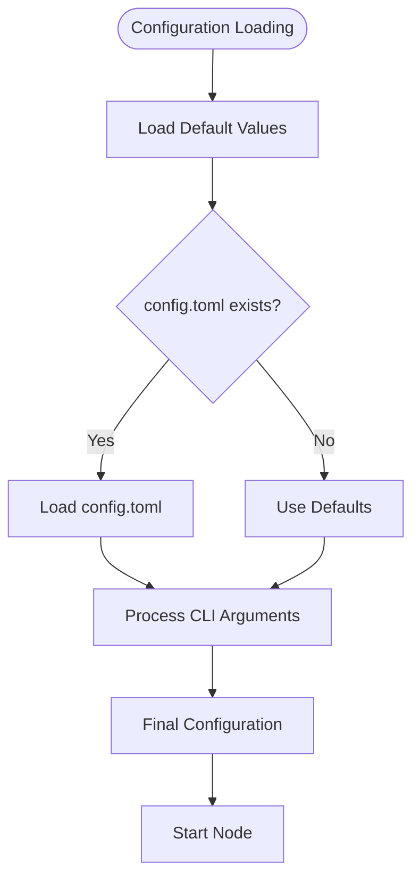

# Configuration Reference

<cite>
**Referenced Files in This Document**   
- [config/mod.rs](file://src/config/mod.rs)
- [cli.rs](file://src/cli.rs)
- [node.rs](file://src/node.rs)
- [consensus/mod.rs](file://src/consensus/mod.rs)
- [Cargo.toml](file://Cargo.toml)
</cite>

## Table of Contents
1. [Introduction](#introduction)
2. [Configuration File Structure](#configuration-file-structure)
3. [Core Configuration Options](#core-configuration-options)
4. [Configuration Loading and Precedence](#configuration-loading-and-precedence)
5. [Development vs. Production Configurations](#development-vs-production-configurations)
6. [Advanced Configuration Options](#advanced-configuration-options)
7. [Common Configuration Mistakes](#common-configuration-mistakes)
8. [Deployment Environment Integration](#deployment-environment-integration)
9. [Version Compatibility and Migration](#version-compatibility-and-migration)

## Introduction
This document provides comprehensive reference documentation for all configuration options in the ONVM (Open Network Virtual Machine) system. The configuration system is designed to provide a centralized source of truth for genesis parameters, block production settings, and networking defaults across all components of the node.

The configuration is primarily managed through a TOML file format, with support for command-line overrides and environment-based settings. This document details the structure of the configuration, default values, loading precedence, and best practices for different deployment scenarios.

**Section sources**
- [config/mod.rs](file://src/config/mod.rs#L1-L140)

## Configuration File Structure
The ONVM configuration follows a hierarchical TOML structure with three main sections: `genesis`, `block`, and `network`. The configuration file is typically named `config.toml` and is located in the node's data directory.

The configuration structure is defined by the `OnvmConfig` struct in the codebase, which contains nested configuration objects for different subsystems. When written to disk, the configuration uses snake_case field names and appropriate TOML data types.

```toml
# Example configuration file structure
[genesis]
state_root = ""

[block]
max_batch = 512
slot_ms = 500
min_ops = 1

[network]
min_peers = 1
bootnodes = ["/ip4/192.168.1.102/tcp/37000/12D3KooWQUX1oDS8r2v1q27bJ9TwHhuBDy7hJCX6SqgrkVLF1f27"]
```

**Diagram sources**
- [config/mod.rs](file://src/config/mod.rs#L35-L40)

**Section sources**
- [config/mod.rs](file://src/config/mod.rs#L1-L140)

## Core Configuration Options
The ONVM configuration system provides several key options that control the fundamental behavior of the node. These options are organized into logical groups based on their function.

### Genesis Configuration
The genesis configuration contains static chain parameters that are established at network initialization.

- **state_root**: Optional precomputed global state root; if absent, an empty root is assumed.
  - Type: String (hex-encoded)
  - Default: Empty string (represents None)
  - Rationale: Allows for network initialization with a predefined state, useful for network forks or migrations.

### Block Configuration
The block configuration controls block production parameters and batching behavior.

- **max_batch**: Maximum operations per block before sealing.
  - Type: Integer
  - Default: 512
  - Rationale: Balances throughput with block propagation time; higher values increase throughput but may increase latency.

- **slot_ms**: Target slot/producing interval for blocks in milliseconds.
  - Type: Integer
  - Default: 500
  - Rationale: Sets the target block production rate; 500ms provides a balance between responsiveness and network stability.

- **min_ops**: Minimum operations required to emit a block (prevents empty/heartbeat blocks).
  - Type: Integer
  - Default: 1
  - Rationale: Ensures blocks contain meaningful operations, preventing unnecessary network traffic from empty blocks.

### Network Configuration
The network configuration manages peer-to-peer networking parameters and bootstrapping.

- **min_peers**: Minimum number of peers (excluding self) required to produce blocks.
  - Type: Integer
  - Default: 1
  - Rationale: Ensures network connectivity before block production, preventing isolated nodes from creating forks.

- **bootnodes**: Default bootnodes to attempt dialing on startup.
  - Type: Array of strings
  - Default: ["/ip4/192.168.1.102/tcp/37000/12D3KooWQUX1oDS8r2v1q27bJ9TwHhuBDy7hJCX6SqgrkVLF1f27"]
  - Rationale: Provides initial connectivity points for network bootstrapping; the default points to a known stable node.

**Section sources**
- [config/mod.rs](file://src/config/mod.rs#L11-L130)

## Configuration Loading and Precedence
The ONVM node follows a specific configuration loading order with well-defined precedence rules. Configuration sources are processed in the following order, with later sources overriding earlier ones:

1. **Default Configuration**: The base configuration is established by the `Default` trait implementation in `OnvmConfig`.
2. **Configuration File**: If a `config.toml` file exists in the data directory, it is loaded and merged with the defaults.
3. **Command-Line Arguments**: CLI parameters take precedence over both defaults and configuration file values.
4. **Environment Variables**: Not currently implemented in the codebase.

When the node is initialized using the `init` command, a default configuration file is created in the specified data directory if one does not already exist. The `RunNode` command processes configuration in the following order:



**Diagram sources**
- [cli.rs](file://src/cli.rs#L130-L163)
- [config/mod.rs](file://src/config/mod.rs#L131-L139)

**Section sources**
- [cli.rs](file://src/cli.rs#L114-L163)
- [config/mod.rs](file://src/config/mod.rs#L131-L139)

## Development vs. Production Configurations
Different deployment scenarios require different configuration approaches. This section provides examples and recommendations for both development and production environments.

### Development Configuration
For development and testing, a simplified configuration is typically used:

```toml
[genesis]
state_root = ""

[block]
max_batch = 64
slot_ms = 1000
min_ops = 1

[network]
min_peers = 0
bootnodes = []
```

Key characteristics of development configurations:
- Higher block intervals (1000ms) to reduce resource usage
- Lower batch sizes for faster block finalization during testing
- Reduced peer requirements to allow single-node operation
- No bootnodes for isolated network testing

### Production Configuration
Production deployments should use more conservative settings:

```toml
[genesis]
state_root = ""

[block]
max_batch = 1024
slot_ms = 250
min_ops = 4

[network]
min_peers = 3
bootnodes = [
  "/ip4/192.168.1.102/tcp/37000/12D3KooWQUX1oDS8r2v1q27bJ9TwHhuBDy7hJCX6SqgrkVLF1f27",
  "/ip4/192.168.1.103/tcp/37000/12D3KooWQUX1oDS8r2v1q27bJ9TwHhuBDy7hJCX6SqgrkVLF1f28"
]
```

Key characteristics of production configurations:
- Higher batch sizes for optimal throughput
- Lower block intervals for faster finality
- Higher minimum operations to ensure block quality
- Multiple bootnodes for reliable network connectivity
- Higher minimum peer requirements for network stability

**Section sources**
- [config/mod.rs](file://src/config/mod.rs#L114-L129)
- [cli.rs](file://src/cli.rs#L40-L49)

## Advanced Configuration Options
In addition to the core configuration, ONVM supports several advanced options that can be configured through command-line parameters.

### Resource Limits
Resource limits are configured through the execution engine, with default values defined in `ExecutionConfig`:

- **max_fuel**: Maximum fuel units for WASM program execution
  - Default: 50,000,000
  - Purpose: Prevents infinite loops and resource exhaustion in smart contracts

These limits are not exposed in the TOML configuration but are hardcoded in the execution engine.

### Logging Configuration
Logging is controlled through environment variables rather than the configuration file:

- **RUST_LOG**: Controls the logging level and filtering
  - Default: "info,libp2p_mdns=off"
  - Example: "debug" for verbose output, "warn" for minimal output

The logging configuration is initialized in the CLI module using `tracing_subscriber::EnvFilter`.

### Experimental Features
Experimental features are controlled through command-line parameters rather than configuration files:

- **blob_sync_mode**: Blob synchronization mode
  - Options: "full" (default), "metadata"
  - Purpose: Controls whether full blob data is replicated or only metadata
  - Use case: "metadata" mode reduces bandwidth requirements for light nodes

**Section sources**
- [execution/runtime.rs](file://src/execution/runtime.rs#L30-L40)
- [cli.rs](file://src/cli.rs#L48-L49)
- [consensus/mod.rs](file://src/consensus/mod.rs#L48-L52)

## Common Configuration Mistakes
This section addresses common configuration errors and how to avoid them.

### Incorrect Multiaddr Format
The `listen` parameter requires a valid libp2p multiaddr format. Common mistakes include:

- Using plain IP:port format like "0.0.0.0:37000" instead of "/ip4/0.0.0.0/tcp/37000"
- Missing protocol specification (tcp, udp)
- Incorrect peer ID format in bootnodes

The node validates multiaddr format on startup and will fail with a descriptive error if the format is invalid.

### Permission Issues on Data Directory
The node requires write permissions to the data directory. Common issues include:

- Directory owned by a different user
- Insufficient permissions for the process user
- Parent directory permissions preventing creation

The node attempts to create the data directory if it doesn't exist, but will fail if it lacks the necessary permissions.

### Port Conflicts
Port conflicts occur when the configured port is already in use. The node implements a port bumping mechanism:

- If the configured port is unavailable, it automatically tries the next port
- This continues until port 65535 or until a free port is found
- The selected port is logged at startup

To avoid port conflicts in production, ensure that the configured ports are reserved for ONVM usage.

**Section sources**
- [node.rs](file://src/node.rs#L58-L83)
- [cli.rs](file://src/cli.rs#L42-L43)
- [node.rs](file://src/node.rs#L157-L158)

## Deployment Environment Integration
ONVM can be integrated with various deployment environments, each with specific configuration considerations.

### Docker Integration
When deploying ONVM in Docker containers, consider the following:

- Mount the data directory as a volume to persist node state
- Expose the listen and RPC ports in the Dockerfile
- Use environment variables to override configuration (requires code modification)
- Set appropriate resource limits in docker-compose

Example docker-compose configuration:
```yaml
version: '3'
services:
  onvm-node:
    build: .
    volumes:
      - ./data:/data
    ports:
      - "37000:37000"
      - "8080:8080"
    command: ["run-node", "--data-dir", "/data"]
```

### Kubernetes Integration
For Kubernetes deployments:

- Use PersistentVolumeClaims for data persistence
- Configure Service resources for network connectivity
- Use ConfigMaps for configuration management
- Implement readiness and liveness probes

The node's logging and configuration system is compatible with Kubernetes logging and monitoring practices.

### systemd Integration
For systemd service management:

- Create a service file with appropriate restart policies
- Configure log rotation through journald
- Set appropriate user and group permissions
- Use environment files for configuration

The node's graceful shutdown handling works well with systemd's service management.

**Section sources**
- [cli.rs](file://src/cli.rs#L130-L163)
- [node.rs](file://src/node.rs#L38-L132)

## Version Compatibility and Migration
Configuration schema changes require careful migration planning to maintain network compatibility.

### Schema Evolution
When configuration options are added, modified, or removed:

- New options should have sensible defaults to maintain backward compatibility
- Deprecated options should continue to be supported for several versions
- Breaking changes require a network upgrade procedure

The current configuration system uses TOML serialization, which handles missing fields gracefully by using default values.

### Migration Paths
For configuration migrations:

1. Introduce new options alongside existing ones
2. Deprecate old options with warnings in logs
3. Provide migration tools or scripts if necessary
4. Remove deprecated options after sufficient deprecation period

The `OnvmConfig::write_to` method generates configuration files with all default values, which can be used as a template for migration.

### Backward Compatibility
The system maintains backward compatibility through:

- Default implementations that provide values for missing fields
- Forward-compatible TOML parsing that ignores unknown fields
- Graceful handling of configuration errors

When upgrading node versions, administrators should review the configuration defaults in the new version and update their configuration files accordingly.

**Section sources**
- [config/mod.rs](file://src/config/mod.rs#L42-L91)
- [config/mod.rs](file://src/config/mod.rs#L112-L130)