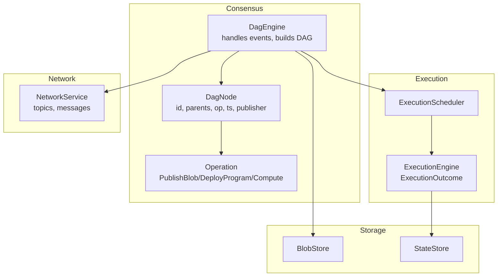
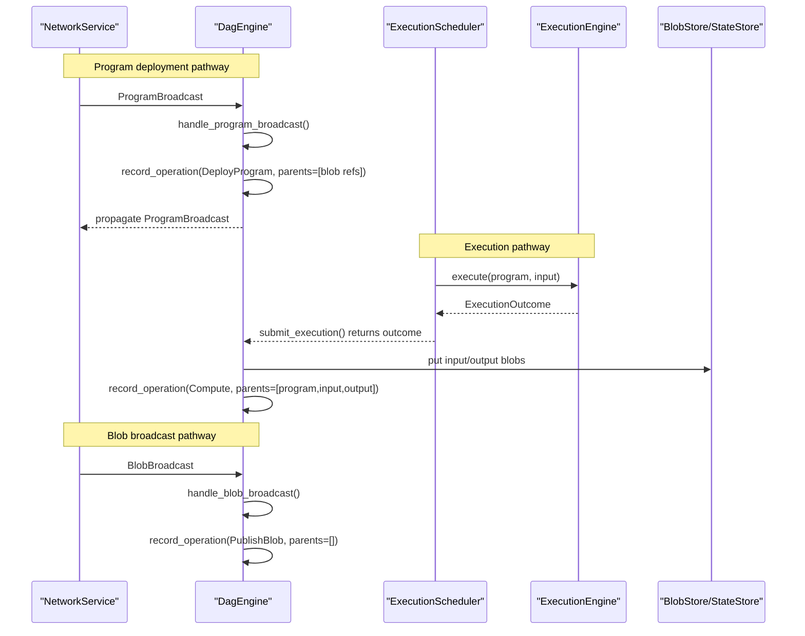
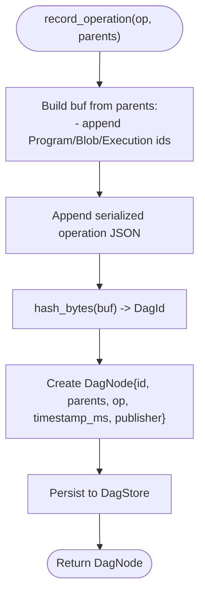
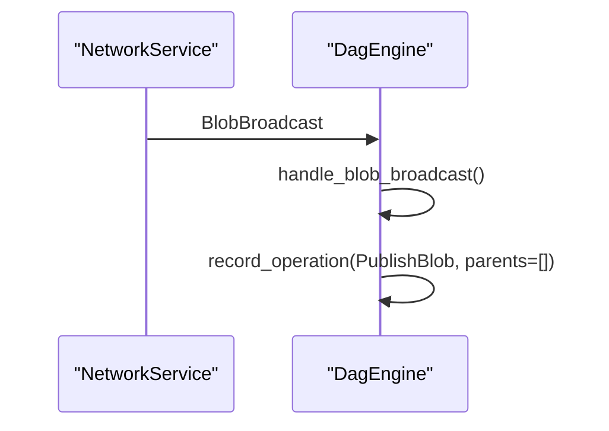
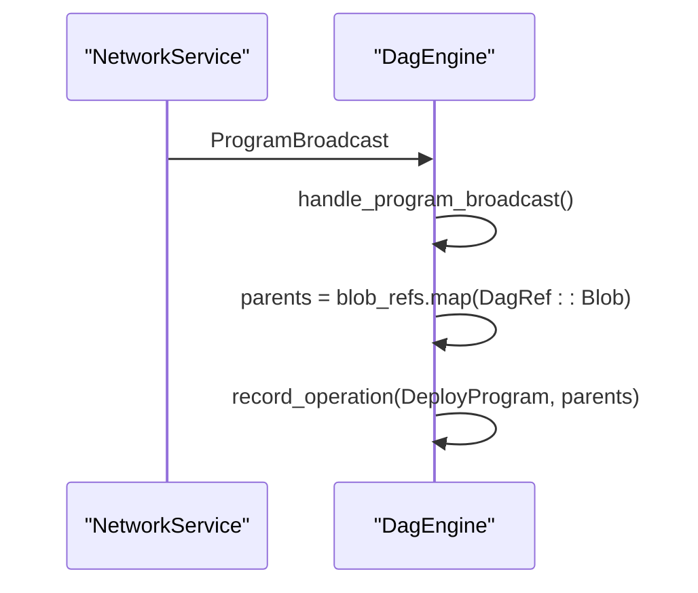
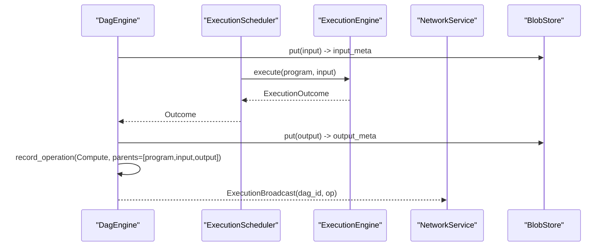
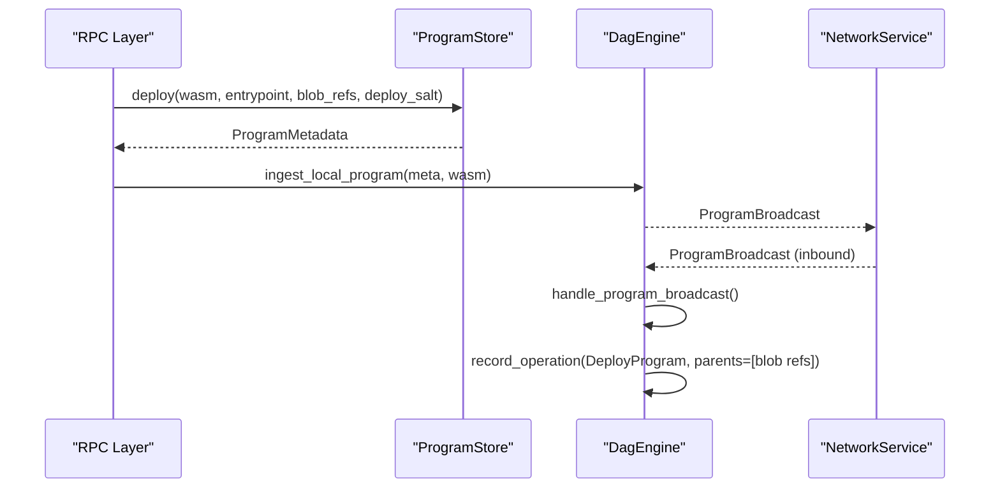
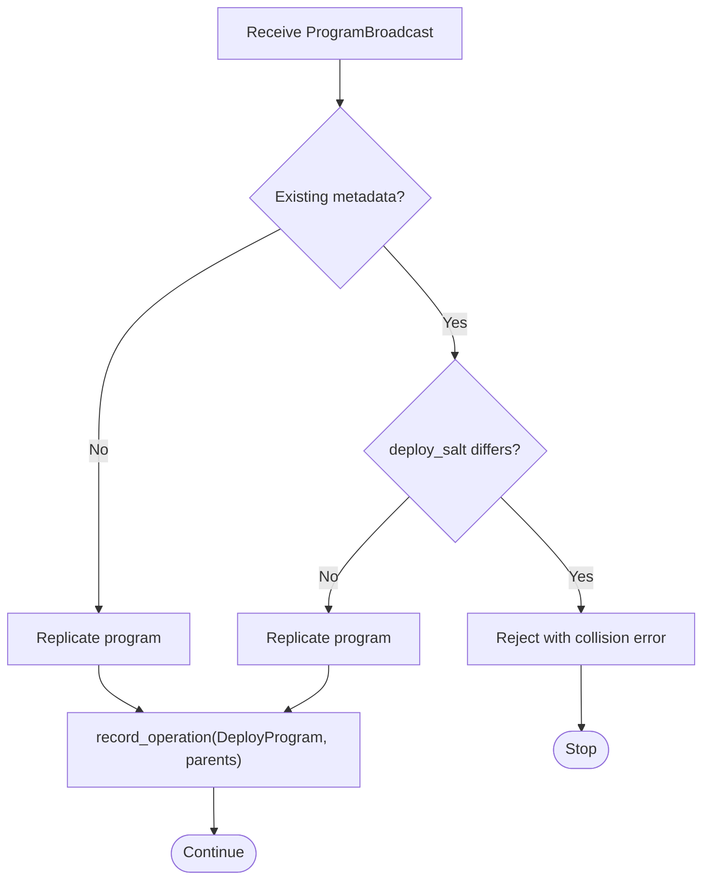
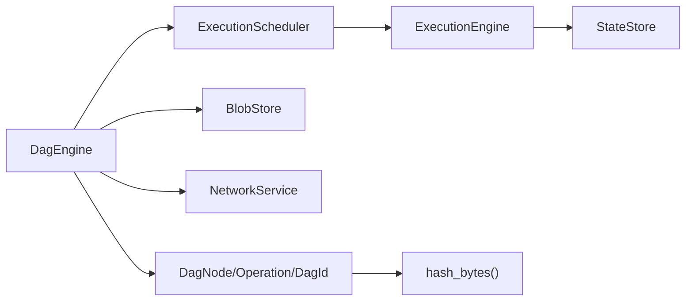

# Block Production

<cite>
**Referenced Files in This Document**
- [consensus/mod.rs](file://src/consensus/mod.rs)
- [types.rs](file://src/types.rs)
- [hashing.rs](file://src/crypto/hashing.rs)
- [scheduler.rs](file://src/execution/scheduler.rs)
- [runtime.rs](file://src/execution/runtime.rs)
- [service.rs](file://src/network/service.rs)
- [blob_store.rs](file://src/storage/blob_store.rs)
- [state_store.rs](file://src/storage/state_store.rs)
- [program_store.rs](file://src/execution/program_store.rs)
</cite>

## Table of Contents
1. [Introduction](#introduction)
2. [Project Structure](#project-structure)
3. [Core Components](#core-components)
4. [Architecture Overview](#architecture-overview)
5. [Detailed Component Analysis](#detailed-component-analysis)
6. [Dependency Analysis](#dependency-analysis)
7. [Performance Considerations](#performance-considerations)
8. [Troubleshooting Guide](#troubleshooting-guide)
9. [Conclusion](#conclusion)

## Introduction
This document explains the block production mechanism in the DAG consensus. It focuses on how DagNode instances are created through the record_operation method, how cryptographic DagId is computed by hashing operation and parent references, and how the three operation types—PublishBlob, DeployProgram, and Compute—are produced and linked. It also covers the timestamp_ms and publisher fields for temporal ordering and identity attribution, and demonstrates concrete examples from the codebase. Finally, it addresses integration with other components, common issues like ID collisions, and performance optimization tips for high-load scenarios.

## Project Structure
The DAG consensus lives primarily in the consensus module and integrates with execution, storage, and network layers. The key elements are:
- Consensus engine that handles network events, creates DAG nodes, and manages synchronization
- Types that define IDs, operations, and metadata
- Execution subsystem that produces Compute operations and outcomes
- Storage subsystems for blobs and state
- Network layer that propagates events and broadcasts messages

**Diagram sources**
- [consensus/mod.rs](file://src/consensus/mod.rs#L62-L111)
- [types.rs](file://src/types.rs#L1-L53)
- [scheduler.rs](file://src/execution/scheduler.rs#L1-L41)
- [runtime.rs](file://src/execution/runtime.rs#L1-L40)
- [service.rs](file://src/network/service.rs#L22-L41)
- [blob_store.rs](file://src/storage/blob_store.rs#L1-L46)
- [state_store.rs](file://src/storage/state_store.rs#L1-L27)

**Section sources**
- [consensus/mod.rs](file://src/consensus/mod.rs#L62-L111)
- [service.rs](file://src/network/service.rs#L22-L41)

## Core Components
- DagNode: The fundamental unit of the DAG with a cryptographic id, parent references, operation payload, timestamp, and publisher identity.
- Operation: Enumerates the three block types:
  - PublishBlob: records a blob’s metadata into the DAG
  - DeployProgram: records a program’s metadata and its blob dependencies
  - Compute: records an execution outcome linking program and input/output blobs
- DagId computation: Deterministic hash of parent references plus serialized operation payload.
- Timestamp and publisher: Used for ordering and attribution.

**Section sources**
- [consensus/mod.rs](file://src/consensus/mod.rs#L37-L61)
- [consensus/mod.rs](file://src/consensus/mod.rs#L1089-L1111)
- [types.rs](file://src/types.rs#L23-L53)

## Architecture Overview
The DAG consensus orchestrates block production across three primary pathways:
- Program deployment spawns DeployProgram nodes
- Execution outcomes spawn Compute nodes
- Blob broadcasts spawn PublishBlob nodes

**Diagram sources**
- [consensus/mod.rs](file://src/consensus/mod.rs#L194-L258)
- [consensus/mod.rs](file://src/consensus/mod.rs#L307-L338)
- [consensus/mod.rs](file://src/consensus/mod.rs#L380-L407)
- [scheduler.rs](file://src/execution/scheduler.rs#L27-L35)
- [runtime.rs](file://src/execution/runtime.rs#L79-L183)
- [blob_store.rs](file://src/storage/blob_store.rs#L18-L46)

## Detailed Component Analysis

### DagNode Creation and DagId Computation
- record_operation constructs a DagNode with:
  - id computed by dag_id(op, parents)
  - parents supplied by the caller
  - timestamp_ms set to current milliseconds
  - publisher set to the local node identity
- dag_id concatenates parent identifiers and the serialized operation, then hashes the buffer.

**Diagram sources**
- [consensus/mod.rs](file://src/consensus/mod.rs#L294-L305)
- [consensus/mod.rs](file://src/consensus/mod.rs#L1089-L1111)
- [hashing.rs](file://src/crypto/hashing.rs#L1-L8)

**Section sources**
- [consensus/mod.rs](file://src/consensus/mod.rs#L294-L305)
- [consensus/mod.rs](file://src/consensus/mod.rs#L1089-L1111)

### Operation Types and Parent Selection Strategies

#### PublishBlob
- Trigger: handle_blob_broadcast
- Parents: none
- Purpose: index or replicate blob metadata and data, then create a PublishBlob node

**Diagram sources**
- [consensus/mod.rs](file://src/consensus/mod.rs#L380-L407)

**Section sources**
- [consensus/mod.rs](file://src/consensus/mod.rs#L380-L407)

#### DeployProgram
- Trigger: handle_program_broadcast
- Parents: derived from ProgramMetadata.blob_refs (DagRef::Blob entries)
- Purpose: record program metadata and its blob dependencies, then create a DeployProgram node

**Diagram sources**
- [consensus/mod.rs](file://src/consensus/mod.rs#L307-L338)

**Section sources**
- [consensus/mod.rs](file://src/consensus/mod.rs#L307-L338)
- [types.rs](file://src/types.rs#L33-L41)

#### Compute
- Trigger: submit_execution
- Parents: [program_id, input_blob_id, output_blob_id]
- Purpose: record execution outcome and create a Compute node; also propagate execution broadcast

**Diagram sources**
- [consensus/mod.rs](file://src/consensus/mod.rs#L194-L258)
- [scheduler.rs](file://src/execution/scheduler.rs#L27-L35)
- [runtime.rs](file://src/execution/runtime.rs#L79-L183)

**Section sources**
- [consensus/mod.rs](file://src/consensus/mod.rs#L194-L258)
- [runtime.rs](file://src/execution/runtime.rs#L176-L183)

### Timestamp and Publisher Fields
- timestamp_ms: set during node creation to capture wall-clock ordering
- publisher: set to the local node identity, enabling attribution and provider hints

These fields support:
- Temporal ordering across nodes
- Identity attribution for provenance and reputation
- Provider discovery and replication

**Section sources**
- [consensus/mod.rs](file://src/consensus/mod.rs#L294-L305)

### Integration with Other Components
- Program deployment:
  - ProgramStore.deploy creates ProgramMetadata with deploy_salt
  - RPC layer calls ingest_local_program to broadcast and record
- Execution scheduler:
  - ExecutionScheduler.execute delegates to ExecutionEngine
  - ExecutionEngine.execute produces ExecutionOutcome with state_writes and state_root
- Network:
  - NetworkService publishes messages on appropriate topics
  - DagEngine pushes updates to peers via request-transfer channels

**Diagram sources**
- [program_store.rs](file://src/execution/program_store.rs#L16-L40)
- [consensus/mod.rs](file://src/consensus/mod.rs#L273-L292)
- [consensus/mod.rs](file://src/consensus/mod.rs#L307-L338)
- [service.rs](file://src/network/service.rs#L22-L41)

**Section sources**
- [program_store.rs](file://src/execution/program_store.rs#L16-L40)
- [consensus/mod.rs](file://src/consensus/mod.rs#L273-L292)
- [consensus/mod.rs](file://src/consensus/mod.rs#L307-L338)
- [service.rs](file://src/network/service.rs#L22-L41)

### Common Issues and Solutions

#### ID Collisions
- Symptom: Program id collision with different deploy_salt
- Detection: handle_program_broadcast checks existing.deploy_salt against incoming
- Resolution: ensure unique deploy_salt per program deployment; reject conflicting duplicates

**Diagram sources**
- [consensus/mod.rs](file://src/consensus/mod.rs#L307-L338)
- [types.rs](file://src/types.rs#L33-L41)

**Section sources**
- [consensus/mod.rs](file://src/consensus/mod.rs#L307-L338)
- [types.rs](file://src/types.rs#L33-L41)

## Dependency Analysis
The DAG consensus depends on:
- Execution subsystem for producing Compute operations
- Storage subsystems for blob and state persistence
- Network subsystem for broadcasting and synchronization

**Diagram sources**
- [consensus/mod.rs](file://src/consensus/mod.rs#L62-L111)
- [scheduler.rs](file://src/execution/scheduler.rs#L1-L41)
- [runtime.rs](file://src/execution/runtime.rs#L1-L40)
- [blob_store.rs](file://src/storage/blob_store.rs#L1-L46)
- [state_store.rs](file://src/storage/state_store.rs#L1-L27)
- [hashing.rs](file://src/crypto/hashing.rs#L1-L8)

**Section sources**
- [consensus/mod.rs](file://src/consensus/mod.rs#L62-L111)
- [scheduler.rs](file://src/execution/scheduler.rs#L1-L41)
- [runtime.rs](file://src/execution/runtime.rs#L1-L40)
- [blob_store.rs](file://src/storage/blob_store.rs#L1-L46)
- [state_store.rs](file://src/storage/state_store.rs#L1-L27)
- [hashing.rs](file://src/crypto/hashing.rs#L1-L8)

## Performance Considerations
- Parallel execution scheduling:
  - ExecutionScheduler uses spawn_blocking and configurable parallelism to avoid blocking async executors and scale with available cores
- Efficient block production under load:
  - Use MetadataOnly mode for blob sync to reduce bandwidth when full data is not immediately needed
  - Batch program metadata requests using Bloom filters to minimize redundant transfers
  - Limit flush frequency by batching writes to stores where possible
  - Deduplicate inbound gossip messages to reduce redundant processing
- State writes:
  - ExecutionEngine applies state writes deterministically and computes state root efficiently

**Section sources**
- [scheduler.rs](file://src/execution/scheduler.rs#L1-L41)
- [consensus/mod.rs](file://src/consensus/mod.rs#L732-L753)
- [service.rs](file://src/network/service.rs#L284-L301)
- [runtime.rs](file://src/execution/runtime.rs#L150-L183)

## Troubleshooting Guide
- Program id collision:
  - Verify deploy_salt uniqueness per program deployment
  - Reject broadcasts with differing deploy_salt for the same program id
- Execution dag id mismatch:
  - Validate that the received dag_id matches the recomputed id from parents and operation
- Blob replication errors:
  - Ensure chunk sizes, counts, and Merkle roots match metadata before replicating
- State root mismatches:
  - Confirm deterministic ordering of state writes and correct namespace scoping

**Section sources**
- [consensus/mod.rs](file://src/consensus/mod.rs#L445-L483)
- [consensus/mod.rs](file://src/consensus/mod.rs#L307-L338)
- [blob_store.rs](file://src/storage/blob_store.rs#L48-L76)
- [runtime.rs](file://src/execution/runtime.rs#L150-L183)

## Conclusion
The DAG consensus produces blocks by deterministically computing DagId from operation and parent references, then persisting DagNode instances with timestamp and publisher metadata. Three operation types integrate with execution, storage, and network layers:
- PublishBlob: records blob metadata and data
- DeployProgram: records program metadata and its blob dependencies
- Compute: records execution outcomes and links program and input/output blobs

Robust mechanisms prevent ID collisions, ensure deterministic state application, and scale under load through parallel execution and selective synchronization.