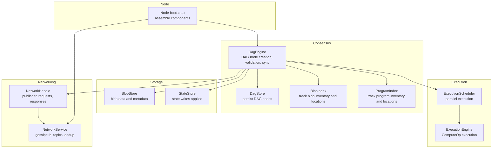
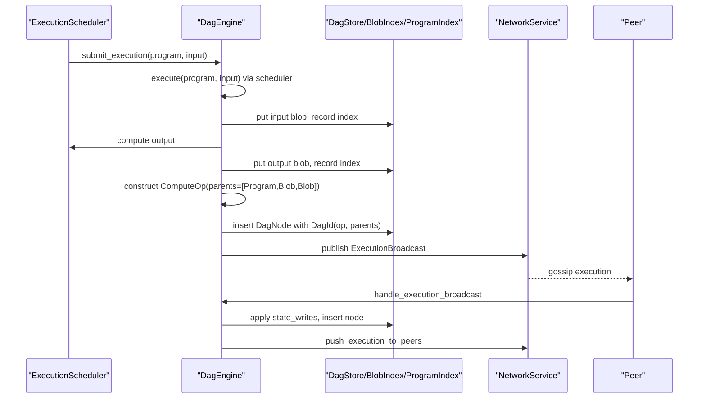
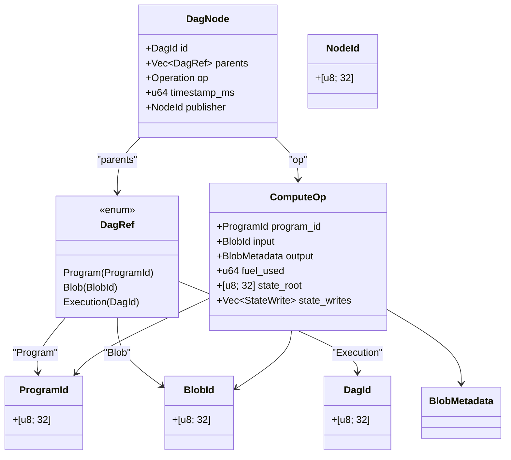
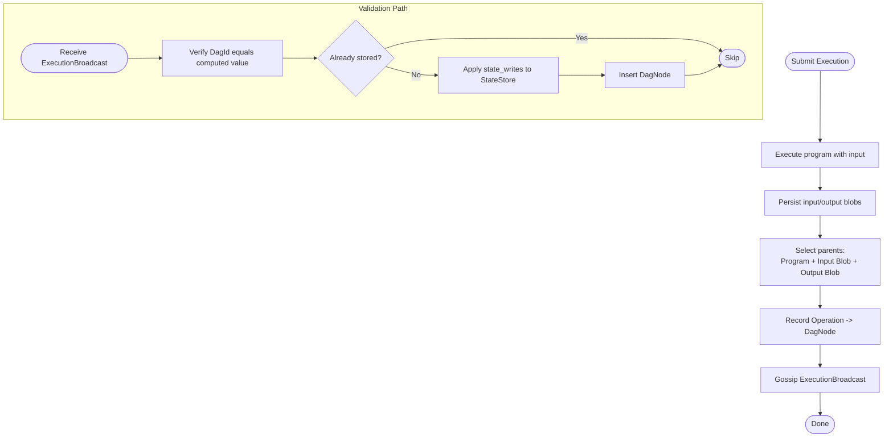
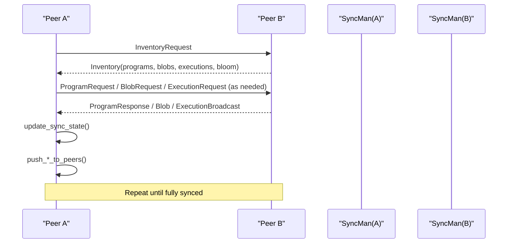
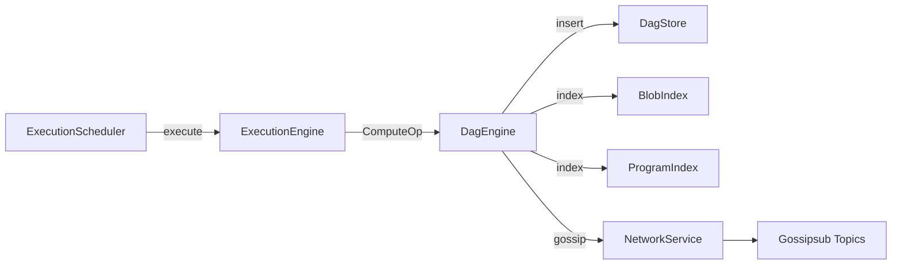
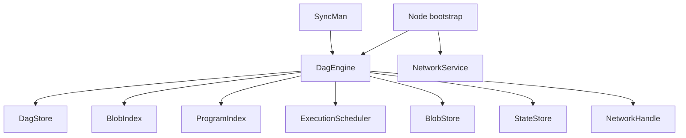

# Consensus Mechanism

<cite>
**Referenced Files in This Document**
- [src/consensus/mod.rs](file://src/consensus/mod.rs)
- [src/syncer/mod.rs](file://src/syncer/mod.rs)
- [src/types.rs](file://src/types.rs)
- [src/network/mod.rs](file://src/network/mod.rs)
- [src/network/service.rs](file://src/network/service.rs)
- [src/execution/scheduler.rs](file://src/execution/scheduler.rs)
- [src/node.rs](file://src/node.rs)
- [src/config/mod.rs](file://src/config/mod.rs)
</cite>

## Table of Contents
1. [Introduction](#introduction)
2. [Project Structure](#project-structure)
3. [Core Components](#core-components)
4. [Architecture Overview](#architecture-overview)
5. [Detailed Component Analysis](#detailed-component-analysis)
6. [Dependency Analysis](#dependency-analysis)
7. [Performance Considerations](#performance-considerations)
8. [Troubleshooting Guide](#troubleshooting-guide)
9. [Conclusion](#conclusion)
10. [Appendices](#appendices)

## Introduction
This document describes the DAG-based consensus engine that enables parallel execution and eventual consistency across peers. Blocks in this system are represented as nodes in a directed acyclic graph (DAG), where each node references prior nodes as parents. This design allows multiple computations to proceed concurrently while maintaining cryptographic integrity and causal ordering. The consensus engine integrates with execution (ComputeOps), storage, and networking to synchronize DAG state across peers and to gossip new blocks.

## Project Structure
The consensus mechanism spans several modules:
- Consensus engine: DAG node creation, parent selection, cryptographic linking, and validation
- Sync manager: initial synchronization and gap tracking
- Types: domain identifiers and operation models
- Network: message types, gossip topics, and transport
- Execution: scheduling and parallel execution of ComputeOps
- Node bootstrap: wiring components together

**Diagram sources**
- [src/consensus/mod.rs](file://src/consensus/mod.rs#L62-L111)
- [src/network/service.rs](file://src/network/service.rs#L400-L458)
- [src/execution/scheduler.rs](file://src/execution/scheduler.rs#L1-L41)
- [src/node.rs](file://src/node.rs#L85-L131)

**Section sources**
- [src/consensus/mod.rs](file://src/consensus/mod.rs#L62-L111)
- [src/syncer/mod.rs](file://src/syncer/mod.rs#L1-L69)
- [src/types.rs](file://src/types.rs#L1-L109)
- [src/network/mod.rs](file://src/network/mod.rs#L1-L9)
- [src/network/service.rs](file://src/network/service.rs#L400-L458)
- [src/execution/scheduler.rs](file://src/execution/scheduler.rs#L1-L41)
- [src/node.rs](file://src/node.rs#L85-L131)

## Core Components
- DagEngine: central coordinator for DAG lifecycle, including block creation, parent selection, cryptographic linking, validation, and synchronization.
- DagNode: the fundamental unit of the DAG, containing an identifier, parent references, operation payload, timestamp, and publisher.
- DagId: cryptographic hash derived from parents and serialized operation, ensuring integrity and uniqueness.
- DagStore: persistent storage for DAG nodes keyed by DagId.
- BlobIndex and ProgramIndex: indices tracking blob and program inventory, locations, and presence of data.
- ExecutionScheduler: executes ComputeOps in parallel using blocking tasks.
- SyncMan: orchestrates initial synchronization and monitors progress.

**Section sources**
- [src/consensus/mod.rs](file://src/consensus/mod.rs#L37-L111)
- [src/consensus/mod.rs](file://src/consensus/mod.rs#L884-L926)
- [src/consensus/mod.rs](file://src/consensus/mod.rs#L929-L1024)
- [src/execution/scheduler.rs](file://src/execution/scheduler.rs#L1-L41)
- [src/syncer/mod.rs](file://src/syncer/mod.rs#L1-L69)

## Architecture Overview
The DAG consensus engine operates as follows:
- Execution produces ComputeOps, which are recorded as DAG nodes with parent references to the program and input/output blobs.
- Nodes are persisted with a deterministic DagId computed from parents and operation payload.
- The engine gossips new nodes and inventory updates to peers via gossipsub topics.
- Peers synchronize missing programs, blobs, and executions using Bloom filters and targeted requests.
- State writes from ComputeOps are applied in-order to maintain causal consistency.

**Diagram sources**
- [src/consensus/mod.rs](file://src/consensus/mod.rs#L194-L258)
- [src/consensus/mod.rs](file://src/consensus/mod.rs#L445-L483)
- [src/execution/scheduler.rs](file://src/execution/scheduler.rs#L27-L35)
- [src/network/service.rs](file://src/network/service.rs#L400-L458)

## Detailed Component Analysis

### DAG Node Model and Parent Selection
- Domain models:
  - BlockId: a legacy identifier type used elsewhere in the system.
  - ProgramId, BlobId, NodeId: typed identifiers for programs, blobs, and node identities.
  - ComputeOp: encapsulates program execution details including fuel used, state root, and state writes.
- Parent selection:
  - Compute operations reference the program, input blob, and output blob as parents.
  - Program deployments reference their blob dependencies as parents.
  - Blob publications have no parents.
- Cryptographic linking:
  - DagId is computed from the concatenation of parent identifiers and the serialized operation, then hashed deterministically.

**Diagram sources**
- [src/consensus/mod.rs](file://src/consensus/mod.rs#L37-L46)
- [src/consensus/mod.rs](file://src/consensus/mod.rs#L1089-L1104)
- [src/types.rs](file://src/types.rs#L1-L53)

**Section sources**
- [src/types.rs](file://src/types.rs#L1-L53)
- [src/consensus/mod.rs](file://src/consensus/mod.rs#L1089-L1104)

### Block Creation and Validation Rules
- Creation:
  - Submit execution triggers program execution, persists input/output blobs, constructs ComputeOp, selects parents, records node, and gossips the execution.
  - Program broadcasts and blob advertisements are ingested similarly, selecting appropriate parents and recording nodes.
- Validation:
  - Execution broadcast validation checks DagId consistency against computed value and ensures the node is not already present.
  - State writes are applied in-order for Compute operations to preserve causal ordering.
  - Program id collisions are prevented by enforcing deploy salt differences.

**Diagram sources**
- [src/consensus/mod.rs](file://src/consensus/mod.rs#L194-L258)
- [src/consensus/mod.rs](file://src/consensus/mod.rs#L445-L483)

**Section sources**
- [src/consensus/mod.rs](file://src/consensus/mod.rs#L194-L258)
- [src/consensus/mod.rs](file://src/consensus/mod.rs#L307-L338)
- [src/consensus/mod.rs](file://src/consensus/mod.rs#L380-L407)
- [src/consensus/mod.rs](file://src/consensus/mod.rs#L445-L483)

### Synchronization Across Peers
- Inventory exchange:
  - Nodes periodically broadcast inventory containing program IDs, blob inventory entries, and execution IDs. A Bloom filter is included to efficiently communicate program presence.
- Request-response:
  - Peers request missing programs, blobs, and executions via targeted messages. Blob requests can opt to fetch data or metadata only depending on configuration.
- Sync state:
  - Missing counts for programs, blobs, and executions are tracked to compute progress and determine completion.
- Initial sync:
  - The sync manager waits for peers, requests inventory, refreshes sync state, and logs progress until fully synced or a timeout elapses.

**Diagram sources**
- [src/consensus/mod.rs](file://src/consensus/mod.rs#L732-L753)
- [src/consensus/mod.rs](file://src/consensus/mod.rs#L501-L616)
- [src/consensus/mod.rs](file://src/consensus/mod.rs#L799-L837)
- [src/syncer/mod.rs](file://src/syncer/mod.rs#L15-L69)

**Section sources**
- [src/consensus/mod.rs](file://src/consensus/mod.rs#L732-L753)
- [src/consensus/mod.rs](file://src/consensus/mod.rs#L501-L616)
- [src/consensus/mod.rs](file://src/consensus/mod.rs#L799-L837)
- [src/syncer/mod.rs](file://src/syncer/mod.rs#L15-L69)

### Integration with Execution and Networking
- Execution:
  - ExecutionScheduler executes ComputeOps using a blocking task model to avoid blocking async executors, enabling parallelism.
- Networking:
  - NetworkService publishes messages to gossipsub topics, deduplicates recent messages, and routes messages to appropriate topics.
  - Messages include Program, Blob, Execution, Inventory, and related requests/responses.

**Diagram sources**
- [src/execution/scheduler.rs](file://src/execution/scheduler.rs#L1-L41)
- [src/consensus/mod.rs](file://src/consensus/mod.rs#L194-L258)
- [src/network/service.rs](file://src/network/service.rs#L400-L458)

**Section sources**
- [src/execution/scheduler.rs](file://src/execution/scheduler.rs#L1-L41)
- [src/network/service.rs](file://src/network/service.rs#L400-L458)
- [src/consensus/mod.rs](file://src/consensus/mod.rs#L194-L258)

## Dependency Analysis
- Consensus depends on:
  - Storage: BlobStore, StateStore, and indices for blob and program inventories
  - Execution: ExecutionScheduler and ExecutionEngine
  - Network: NetworkHandle and topics for gossiping
- SyncMan depends on DagEngine’s inventory and sync state APIs
- Node bootstrap wires all components together and starts the consensus and sync tasks

**Diagram sources**
- [src/consensus/mod.rs](file://src/consensus/mod.rs#L62-L111)
- [src/syncer/mod.rs](file://src/syncer/mod.rs#L1-L69)
- [src/node.rs](file://src/node.rs#L85-L131)

**Section sources**
- [src/consensus/mod.rs](file://src/consensus/mod.rs#L62-L111)
- [src/syncer/mod.rs](file://src/syncer/mod.rs#L1-L69)
- [src/node.rs](file://src/node.rs#L85-L131)

## Performance Considerations
- Parallel execution:
  - ExecutionScheduler uses blocking tasks to parallelize ComputeOps, scaling with available CPU cores.
- DAG growth and pruning:
  - The codebase does not implement explicit DAG pruning strategies. Large DAGs can increase storage and traversal costs; consider adding pruning policies (e.g., prune by age or depth) and compaction strategies for indices and stores.
- Sync performance:
  - Bloom filters reduce bandwidth by indicating missing program IDs. Metadata-only mode reduces blob transfer overhead during initial sync.
- Gossip deduplication:
  - Recent message IDs are tracked to avoid redundant propagation, reducing network load.

[No sources needed since this section provides general guidance]

## Troubleshooting Guide
- Initial sync timeout:
  - The sync manager logs progress and continues startup if a timeout elapses. Verify peer connectivity and inventory exchange.
- Program id collision:
  - Program broadcasts enforce deploy salt differences to prevent collisions.
- Execution broadcast mismatch:
  - If the received DagId differs from the computed value, the broadcast is rejected to maintain integrity.
- Missing blobs or programs:
  - Use inventory requests and provider discovery to locate missing assets. Enable metadata-only mode to reduce bandwidth initially.

**Section sources**
- [src/syncer/mod.rs](file://src/syncer/mod.rs#L15-L69)
- [src/consensus/mod.rs](file://src/consensus/mod.rs#L307-L338)
- [src/consensus/mod.rs](file://src/consensus/mod.rs#L445-L483)
- [src/consensus/mod.rs](file://src/consensus/mod.rs#L501-L616)

## Conclusion
The DAG-based consensus engine enables parallel execution and eventual consistency by modeling blocks as nodes with cryptographic linking and causal parent references. It integrates tightly with execution and networking to propagate ComputeOps and synchronize state across peers. While the current design emphasizes correctness and synchronization, future enhancements could include pruning strategies and compaction to scale to larger DAGs.

## Appendices

### Examples and Assumptions
- Block production frequency:
  - The consensus engine gossips inventory periodically and reacts to inbound events. There is no fixed slot duration; production is driven by execution submissions and network activity.
- Conflict resolution:
  - DAG parents and deterministic DagId derivation prevent conflicting nodes with identical inputs and operations. Program id collisions are prevented by deploy salt enforcement.
- Finality assumptions:
  - The codebase does not define a finalization mechanism. Nodes accept and gossip ComputeOps; no explicit irreversible sealing is shown.

**Section sources**
- [src/consensus/mod.rs](file://src/consensus/mod.rs#L104-L118)
- [src/consensus/mod.rs](file://src/consensus/mod.rs#L307-L338)
- [src/consensus/mod.rs](file://src/consensus/mod.rs#L445-L483)

### Security Aspects
- Identity:
  - NodeId is used to track publishers and locations for blobs and programs.
- Double-spending prevention:
  - No explicit UTXO or token ledger is modeled here; the DAG tracks program and blob inventories and ComputeOps. Additional mechanisms would be required for token systems.
- Liveness:
  - Gossipsub topics and deduplication help maintain liveness. The sync manager ensures progress toward full synchronization.

**Section sources**
- [src/types.rs](file://src/types.rs#L1-L53)
- [src/network/service.rs](file://src/network/service.rs#L400-L458)
- [src/syncer/mod.rs](file://src/syncer/mod.rs#L15-L69)

### Scalability Considerations
- Handling large DAGs:
  - Consider adding pruning and compaction strategies for DagStore and indices.
- Sync performance:
  - Use Bloom filters and metadata-only mode to reduce bandwidth during initial sync.
- Parallelism:
  - ExecutionScheduler’s parallelism scales with CPU cores; tune worker count for workload characteristics.

**Section sources**
- [src/consensus/mod.rs](file://src/consensus/mod.rs#L732-L753)
- [src/execution/scheduler.rs](file://src/execution/scheduler.rs#L1-L41)

### Technical Decisions: DAG vs Linear Blockchain
- Higher throughput:
  - DAG allows multiple concurrent computations with shared dependencies, increasing throughput compared to linear chains.
- Parallel execution:
  - ComputeOps can be executed in parallel, subject to resource limits and ordering constraints enforced by parent references.

**Section sources**
- [src/consensus/mod.rs](file://src/consensus/mod.rs#L194-L258)
- [src/execution/scheduler.rs](file://src/execution/scheduler.rs#L1-L41)