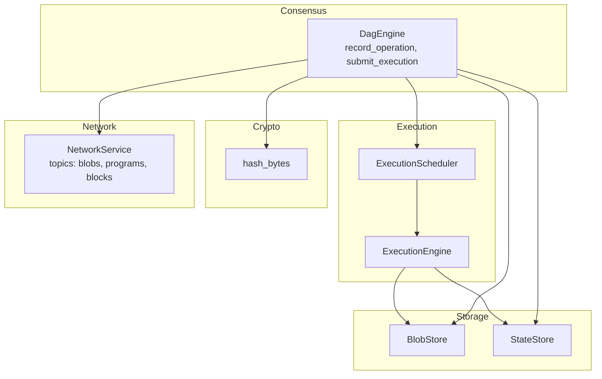
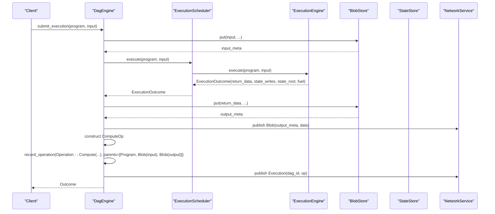
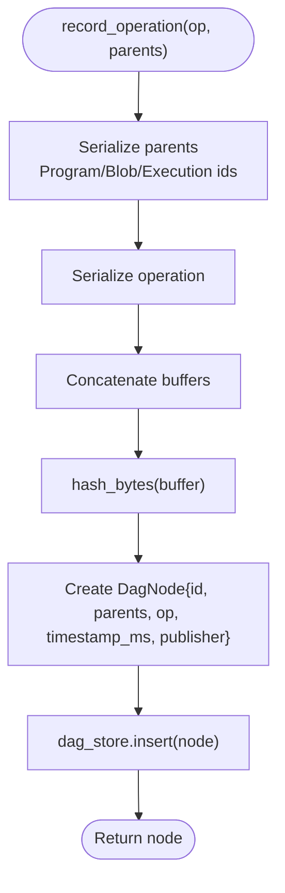
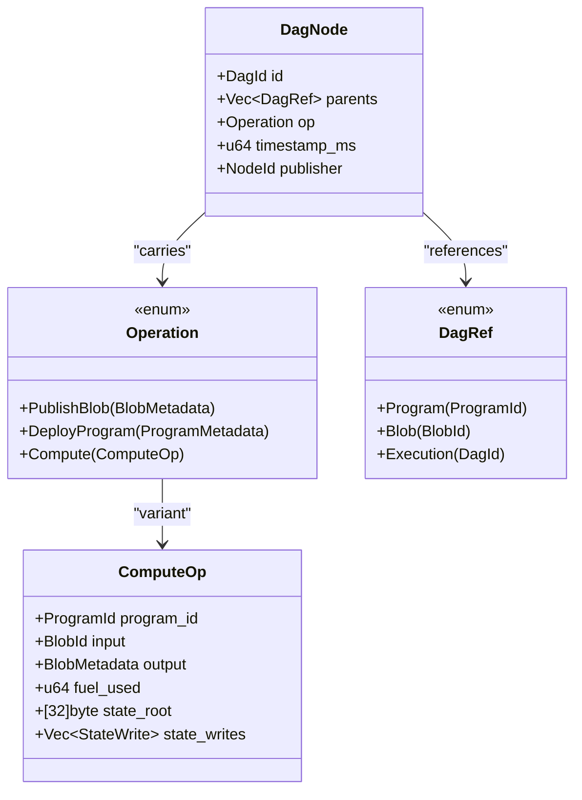
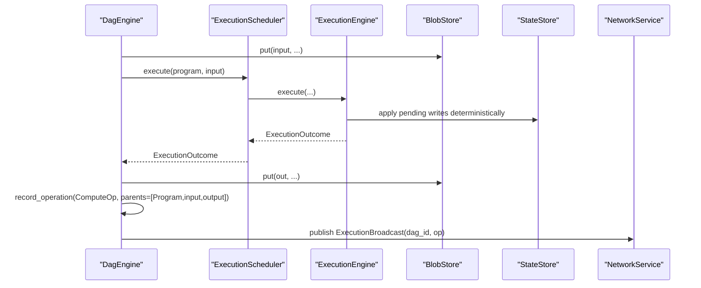
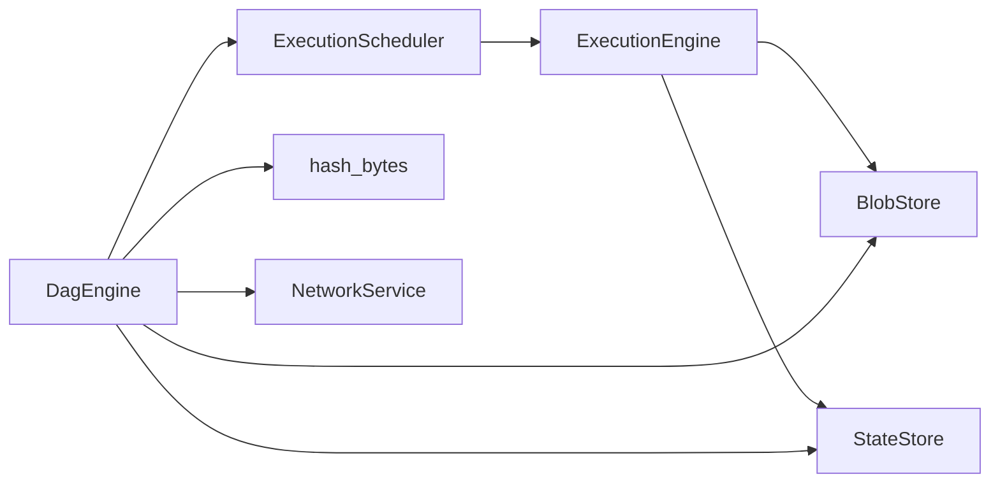

# Block Production

<cite>
**Referenced Files in This Document**
- [consensus/mod.rs](file://src/consensus/mod.rs)
- [types.rs](file://src/types.rs)
- [crypto/hashing.rs](file://src/crypto/hashing.rs)
- [execution/scheduler.rs](file://src/execution/scheduler.rs)
- [execution/runtime.rs](file://src/execution/runtime.rs)
- [storage/blob_store.rs](file://src/storage/blob_store.rs)
- [storage/state_store.rs](file://src/storage/state_store.rs)
- [network/service.rs](file://src/network/service.rs)
</cite>

## Table of Contents
1. [Introduction](#introduction)
2. [Project Structure](#project-structure)
3. [Core Components](#core-components)
4. [Architecture Overview](#architecture-overview)
5. [Detailed Component Analysis](#detailed-component-analysis)
6. [Dependency Analysis](#dependency-analysis)
7. [Performance Considerations](#performance-considerations)
8. [Troubleshooting Guide](#troubleshooting-guide)
9. [Conclusion](#conclusion)

## Introduction
This document explains the block production mechanism in the DAG-based consensus engine. It focuses on how DagNode instances are created through the record_operation function, how cryptographic hashing produces unique DagId identifiers based on operation content and parent references, and how the three operation types—PublishBlob, DeployProgram, and Compute—are handled. It also covers parent selection strategies, the role of timestamp_ms and publisher for temporal ordering and accountability, and the integration with ExecutionScheduler that turns successful program execution outcomes into new Compute operation blocks. Finally, it addresses common issues such as handling missing program metadata and ensuring referenced data exists before block creation, along with performance considerations and optimization tips.

## Project Structure
The block production pipeline spans several modules:
- Consensus engine: orchestrates DAG node creation, parent resolution, and network propagation
- Types: defines core identifiers and operation structures
- Crypto: provides hashing primitives used for DagId computation
- Execution: runs programs and produces outcomes used to create Compute blocks
- Storage: persists blobs and state, enabling deterministic DAG hashing and causal dependencies
- Network: broadcasts and requests blocks, blobs, and programs across peers

**Diagram sources**
- [consensus/mod.rs](file://src/consensus/mod.rs#L194-L258)
- [execution/scheduler.rs](file://src/execution/scheduler.rs#L27-L35)
- [execution/runtime.rs](file://src/execution/runtime.rs#L79-L183)
- [storage/blob_store.rs](file://src/storage/blob_store.rs#L18-L46)
- [storage/state_store.rs](file://src/storage/state_store.rs#L17-L41)
- [crypto/hashing.rs](file://src/crypto/hashing.rs#L1-L8)
- [network/service.rs](file://src/network/service.rs#L22-L45)

**Section sources**
- [consensus/mod.rs](file://src/consensus/mod.rs#L194-L258)
- [execution/scheduler.rs](file://src/execution/scheduler.rs#L27-L35)
- [execution/runtime.rs](file://src/execution/runtime.rs#L79-L183)
- [storage/blob_store.rs](file://src/storage/blob_store.rs#L18-L46)
- [storage/state_store.rs](file://src/storage/state_store.rs#L17-L41)
- [crypto/hashing.rs](file://src/crypto/hashing.rs#L1-L8)
- [network/service.rs](file://src/network/service.rs#L22-L45)

## Core Components
- DagNode: the fundamental block in the DAG, containing id, parents, operation, timestamp, and publisher
- Operation: the payload carried by a node; variants include PublishBlob, DeployProgram, and Compute
- DagRef: parent references to Program, Blob, or Execution (DagId)
- DagId: unique identifier derived from parents and serialized operation content
- record_operation: creates a DagNode, computes its DagId, and stores it
- submit_execution: integrates ExecutionScheduler, ensures referenced data exists, and emits Compute blocks

**Section sources**
- [consensus/mod.rs](file://src/consensus/mod.rs#L22-L46)
- [consensus/mod.rs](file://src/consensus/mod.rs#L294-L305)
- [consensus/mod.rs](file://src/consensus/mod.rs#L194-L258)
- [types.rs](file://src/types.rs#L23-L31)

## Architecture Overview
The DAG block production architecture centers on DagEngine, which:
- Receives operations from network events or local RPC ingestion
- Ensures referenced data exists (blobs and program metadata)
- Computes DagId deterministically from parents and operation
- Stores nodes and propagates them to peers

**Diagram sources**
- [consensus/mod.rs](file://src/consensus/mod.rs#L194-L258)
- [execution/scheduler.rs](file://src/execution/scheduler.rs#L27-L35)
- [execution/runtime.rs](file://src/execution/runtime.rs#L79-L183)
- [storage/blob_store.rs](file://src/storage/blob_store.rs#L18-L46)
- [network/service.rs](file://src/network/service.rs#L22-L45)

## Detailed Component Analysis

### DagNode Creation and DagId Computation
- record_operation constructs a DagNode with:
  - id computed by dag_id(op, parents)
  - parents supplied by the caller
  - timestamp_ms set to current wall-clock milliseconds
  - publisher set to the local node’s identity
- dag_id concatenates serialized parent identifiers and the serialized operation, then hashes the buffer to produce a 32-byte DagId
- now_ms provides monotonic timestamps for ordering

**Diagram sources**
- [consensus/mod.rs](file://src/consensus/mod.rs#L294-L305)
- [consensus/mod.rs](file://src/consensus/mod.rs#L1089-L1111)
- [crypto/hashing.rs](file://src/crypto/hashing.rs#L1-L8)
- [consensus/mod.rs](file://src/consensus/mod.rs#L1106-L1111)

**Section sources**
- [consensus/mod.rs](file://src/consensus/mod.rs#L294-L305)
- [consensus/mod.rs](file://src/consensus/mod.rs#L1089-L1111)
- [crypto/hashing.rs](file://src/crypto/hashing.rs#L1-L8)
- [consensus/mod.rs](file://src/consensus/mod.rs#L1106-L1111)

### Operation Types and Parent Selection Strategies
- PublishBlob
  - Parents: empty
  - Purpose: anchor blob availability in the DAG
  - Trigger: handle_blob_broadcast records a PublishBlob node with no parents
- DeployProgram
  - Parents: references to Blob metadata used by the program
  - Purpose: establish program availability and its blob dependencies
  - Trigger: handle_program_broadcast builds parents from ProgramMetadata.blob_refs and records a DeployProgram node
- Compute
  - Parents: Program(program_id), Blob(input), Blob(output)
  - Purpose: represent execution results with deterministic causal dependencies
  - Trigger: submit_execution constructs ComputeOp and calls record_operation with the three parents

**Diagram sources**
- [consensus/mod.rs](file://src/consensus/mod.rs#L22-L46)
- [consensus/mod.rs](file://src/consensus/mod.rs#L194-L258)
- [types.rs](file://src/types.rs#L23-L31)

**Section sources**
- [consensus/mod.rs](file://src/consensus/mod.rs#L380-L407)
- [consensus/mod.rs](file://src/consensus/mod.rs#L307-L338)
- [consensus/mod.rs](file://src/consensus/mod.rs#L194-L258)

### Temporal Ordering and Accountability
- timestamp_ms: monotonic timestamp set at node creation, enabling ordering across nodes
- publisher: identifies the node responsible for creating the block, aiding attribution and potential slashing conditions

**Section sources**
- [consensus/mod.rs](file://src/consensus/mod.rs#L294-L305)
- [consensus/mod.rs](file://src/consensus/mod.rs#L1106-L1111)

### Integration with ExecutionScheduler and Compute Blocks
- ExecutionScheduler executes programs off the async executor using spawn_blocking to avoid blocking the runtime
- ExecutionEngine validates program metadata, compiles and instantiates the module, executes the entrypoint, collects outputs, pending state writes, and computes state root deterministically
- submit_execution:
  - Ensures program metadata exists locally
  - Creates input and output blobs, indexing them
  - Executes the program via ExecutionScheduler
  - Builds ComputeOp with fuel_used, state_root, and state_writes
  - Calls record_operation with parents=[Program, Blob(input), Blob(output)]
  - Broadcasts the resulting Execution block

**Diagram sources**
- [consensus/mod.rs](file://src/consensus/mod.rs#L194-L258)
- [execution/scheduler.rs](file://src/execution/scheduler.rs#L27-L35)
- [execution/runtime.rs](file://src/execution/runtime.rs#L79-L183)
- [storage/state_store.rs](file://src/storage/state_store.rs#L17-L41)
- [storage/blob_store.rs](file://src/storage/blob_store.rs#L18-L46)

**Section sources**
- [execution/scheduler.rs](file://src/execution/scheduler.rs#L27-L35)
- [execution/runtime.rs](file://src/execution/runtime.rs#L79-L183)
- [consensus/mod.rs](file://src/consensus/mod.rs#L194-L258)

### Parent Resolution and Deterministic DAG Hashing
- Parents are serialized in a deterministic order before hashing:
  - Program ids
  - Blob ids
  - Execution ids (DagId)
- The serialized operation is appended to the buffer before hashing
- This guarantees identical operations with identical parents produce identical DagId values

**Section sources**
- [consensus/mod.rs](file://src/consensus/mod.rs#L1089-L1111)
- [crypto/hashing.rs](file://src/crypto/hashing.rs#L1-L8)

### Network Topics and Propagation
- Blobs, Programs, and Executions are published on distinct gossipsub topics
- Execution blocks carry both dag_id and op; receivers validate dag_id against recomputed value before accepting

**Section sources**
- [network/service.rs](file://src/network/service.rs#L22-L45)
- [network/service.rs](file://src/network/service.rs#L395-L407)
- [consensus/mod.rs](file://src/consensus/mod.rs#L445-L483)

## Dependency Analysis
- DagEngine depends on:
  - BlobStore and StateStore for data persistence and state roots
  - ExecutionScheduler for program execution
  - NetworkService for broadcasting and syncing
  - Crypto hashing for DagId computation
- ExecutionEngine depends on:
  - ProgramStore (via ProgramStore dependency chain)
  - BlobStore and StateStore for host functions and state writes
- Storage modules provide deterministic Merkle roots and chunked blob storage

**Diagram sources**
- [consensus/mod.rs](file://src/consensus/mod.rs#L194-L258)
- [execution/scheduler.rs](file://src/execution/scheduler.rs#L27-L35)
- [execution/runtime.rs](file://src/execution/runtime.rs#L79-L183)
- [storage/blob_store.rs](file://src/storage/blob_store.rs#L18-L46)
- [storage/state_store.rs](file://src/storage/state_store.rs#L17-L41)
- [crypto/hashing.rs](file://src/crypto/hashing.rs#L1-L8)
- [network/service.rs](file://src/network/service.rs#L22-L45)

**Section sources**
- [consensus/mod.rs](file://src/consensus/mod.rs#L194-L258)
- [execution/scheduler.rs](file://src/execution/scheduler.rs#L27-L35)
- [execution/runtime.rs](file://src/execution/runtime.rs#L79-L183)
- [storage/blob_store.rs](file://src/storage/blob_store.rs#L18-L46)
- [storage/state_store.rs](file://src/storage/state_store.rs#L17-L41)
- [crypto/hashing.rs](file://src/crypto/hashing.rs#L1-L8)
- [network/service.rs](file://src/network/service.rs#L22-L45)

## Performance Considerations
- Batch program metadata sync: the consensus engine batches program metadata updates to reduce network overhead during synchronization
- Parallel execution: ExecutionScheduler uses spawn_blocking to run Wasmtime execution off the async executor, allowing multiple concurrent executions
- Deterministic hashing: parents and operations are serialized deterministically, minimizing re-computation costs
- Blob chunking and Merkle roots: BlobStore uses chunked storage and Merkle roots to enable efficient verification and partial retrieval
- Bloom filters: NetworkService uses Bloom filters to advertise program presence and reduce unnecessary transfers

Optimization tips:
- Prefer MetadataOnly sync mode when bandwidth is constrained; switch to FullData when necessary
- Ensure program metadata is present locally before invoking submit_execution to avoid repeated lookups
- Reuse ExecutionScheduler workers based on available_parallelism to balance throughput and resource usage
- Batch blob and program ingestion to reduce network chatter and disk flushes

**Section sources**
- [consensus/mod.rs](file://src/consensus/mod.rs#L60-L60)
- [execution/scheduler.rs](file://src/execution/scheduler.rs#L13-L25)
- [storage/blob_store.rs](file://src/storage/blob_store.rs#L18-L46)
- [network/service.rs](file://src/network/service.rs#L106-L116)

## Troubleshooting Guide
Common issues and resolutions:
- Program metadata missing locally
  - Symptom: submit_execution returns an error indicating missing program metadata
  - Resolution: ingest the program locally via ingest_local_program or wait for network sync
- Output blob not present
  - Symptom: ExecutionBroadcast validation may fail if output blob is missing
  - Resolution: Ensure output blob is stored and indexed; the consensus engine will index it if absent
- Parent mismatch
  - Symptom: ExecutionBroadcast dag_id mismatch
  - Resolution: Verify parents and operation content match the recomputed dag_id
- Missing referenced data
  - Symptom: Errors when trying to reference blobs or programs that are not present
  - Resolution: Request missing blobs or programs via inventory and transfer protocols

**Section sources**
- [consensus/mod.rs](file://src/consensus/mod.rs#L194-L201)
- [consensus/mod.rs](file://src/consensus/mod.rs#L445-L483)
- [consensus/mod.rs](file://src/consensus/mod.rs#L468-L472)

## Conclusion
The DAG-based consensus engine produces blocks deterministically by combining operation content with causal parent references and cryptographic hashing. Three operation types are supported, each with tailored parent selection strategies. The system integrates tightly with ExecutionScheduler to turn program execution outcomes into Compute blocks, ensuring causal dependencies and state consistency. Robust parent validation, deterministic hashing, and network propagation mechanisms provide a reliable foundation for block production. By following the troubleshooting steps and applying the performance tips, operators can minimize redundant block production and maintain a healthy, synchronized DAG.