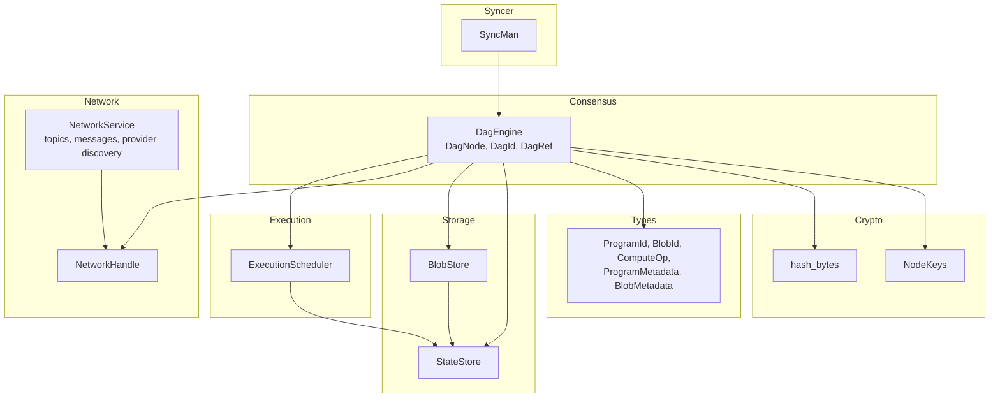
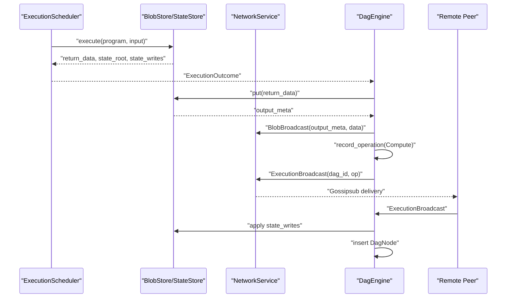
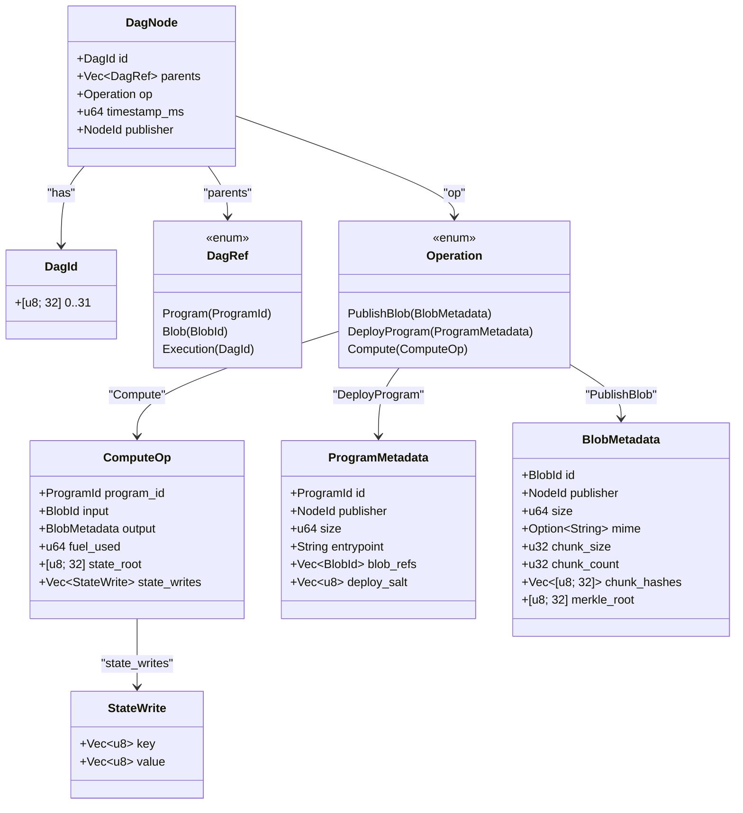
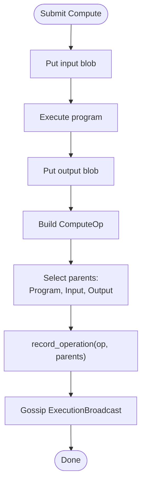
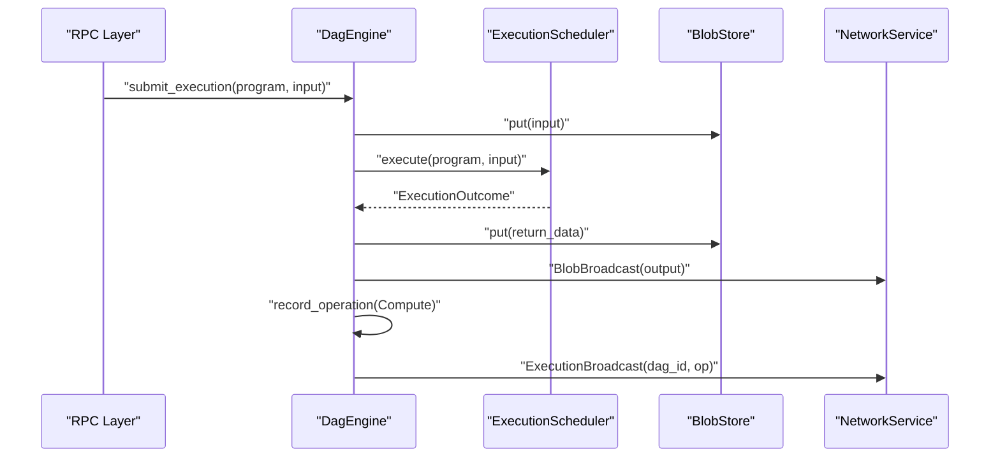
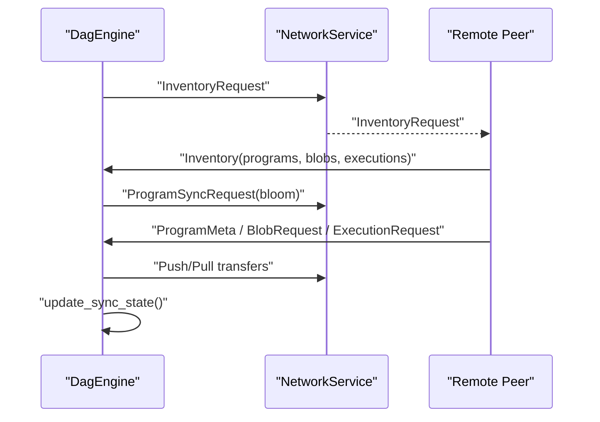
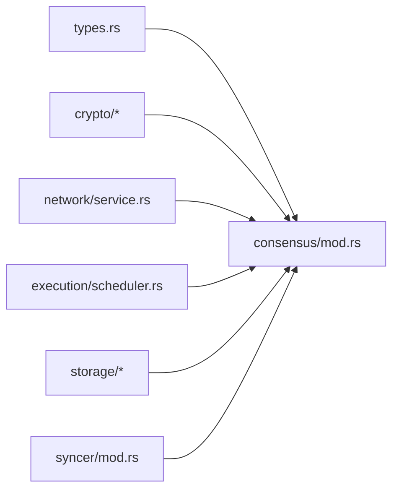

# DAG Engine

<cite>
**Referenced Files in This Document**
- [src/consensus/mod.rs](file://src/consensus/mod.rs)
- [src/types.rs](file://src/types.rs)
- [src/crypto/hashing.rs](file://src/crypto/hashing.rs)
- [src/crypto/keys.rs](file://src/crypto/keys.rs)
- [src/network/service.rs](file://src/network/service.rs)
- [src/execution/scheduler.rs](file://src/execution/scheduler.rs)
- [src/storage/blob_store.rs](file://src/storage/blob_store.rs)
- [src/storage/state_store.rs](file://src/storage/state_store.rs)
- [src/syncer/mod.rs](file://src/syncer/mod.rs)
</cite>

## Table of Contents
1. [Introduction](#introduction)
2. [Project Structure](#project-structure)
3. [Core Components](#core-components)
4. [Architecture Overview](#architecture-overview)
5. [Detailed Component Analysis](#detailed-component-analysis)
6. [Dependency Analysis](#dependency-analysis)
7. [Performance Considerations](#performance-considerations)
8. [Troubleshooting Guide](#troubleshooting-guide)
9. [Conclusion](#conclusion)

## Introduction
This document describes the DAG-based consensus engine that enables parallel execution and eventual consistency. Blocks are represented as nodes in a directed acyclic graph (DAG), where each node references its causal dependencies (parents) via DagRef. Nodes are cryptographically linked using dag_id hashing of operation content and parent references. The engine integrates with an execution scheduler for Compute operations and with a libp2p-based networking layer for gossiping and selective synchronization using bloom filters and provider discovery.

## Project Structure
The DAG engine spans several modules:
- Consensus: DAG model, node creation, validation, and synchronization logic
- Types: Domain models for ProgramId, BlobId, ComputeOp, and related structures
- Crypto: Hashing and NodeKeys identity
- Network: libp2p service, topics, message types, and provider discovery
- Execution: ExecutionScheduler for Compute operations
- Storage: BlobStore and StateStore for persistence and integrity
- Syncer: Initial synchronization manager

**Diagram sources**
- [src/consensus/mod.rs](file://src/consensus/mod.rs#L1-L120)
- [src/types.rs](file://src/types.rs#L1-L109)
- [src/crypto/hashing.rs](file://src/crypto/hashing.rs#L1-L8)
- [src/crypto/keys.rs](file://src/crypto/keys.rs#L1-L73)
- [src/network/service.rs](file://src/network/service.rs#L1-L120)
- [src/execution/scheduler.rs](file://src/execution/scheduler.rs#L1-L41)
- [src/storage/blob_store.rs](file://src/storage/blob_store.rs#L1-L60)
- [src/storage/state_store.rs](file://src/storage/state_store.rs#L1-L41)
- [src/syncer/mod.rs](file://src/syncer/mod.rs#L1-L40)

**Section sources**
- [src/consensus/mod.rs](file://src/consensus/mod.rs#L1-L120)
- [src/types.rs](file://src/types.rs#L1-L109)
- [src/crypto/hashing.rs](file://src/crypto/hashing.rs#L1-L8)
- [src/crypto/keys.rs](file://src/crypto/keys.rs#L1-L73)
- [src/network/service.rs](file://src/network/service.rs#L1-L120)
- [src/execution/scheduler.rs](file://src/execution/scheduler.rs#L1-L41)
- [src/storage/blob_store.rs](file://src/storage/blob_store.rs#L1-L60)
- [src/storage/state_store.rs](file://src/storage/state_store.rs#L1-L41)
- [src/syncer/mod.rs](file://src/syncer/mod.rs#L1-L40)

## Core Components
- DagNode: The fundamental unit of the DAG with id, parents, operation, timestamp, and publisher
- DagId: Cryptographic identifier derived from parents and operation content
- DagRef: Parent references to Program, Blob, or Execution
- Operation: Enumerated operations: PublishBlob, DeployProgram, Compute
- ComputeOp: Input/output references, fuel used, state root, and state writes
- DagEngine: Orchestrates ingestion, validation, node creation, gossip, and sync
- ExecutionScheduler: Executes Compute operations with configurable parallelism
- NetworkService/NetworkHandle: Gossipsub topics, provider discovery, and request/response transfers
- BlobStore/StateStore: Integrity-checked storage for blobs and state
- SyncMan: Initial synchronization manager

**Section sources**
- [src/consensus/mod.rs](file://src/consensus/mod.rs#L22-L120)
- [src/types.rs](file://src/types.rs#L1-L109)
- [src/execution/scheduler.rs](file://src/execution/scheduler.rs#L1-L41)
- [src/network/service.rs](file://src/network/service.rs#L1-L120)
- [src/storage/blob_store.rs](file://src/storage/blob_store.rs#L1-L60)
- [src/storage/state_store.rs](file://src/storage/state_store.rs#L1-L41)
- [src/syncer/mod.rs](file://src/syncer/mod.rs#L1-L40)

## Architecture Overview
The DAG engine runs continuously, receiving network events and periodically broadcasting inventory. It validates incoming gossip, applies state updates for Compute operations, records nodes, and gossips new nodes to peers. Selective synchronization uses bloom filters and provider discovery to minimize bandwidth and accelerate convergence.

**Diagram sources**
- [src/consensus/mod.rs](file://src/consensus/mod.rs#L194-L258)
- [src/execution/scheduler.rs](file://src/execution/scheduler.rs#L27-L40)
- [src/network/service.rs](file://src/network/service.rs#L22-L45)
- [src/storage/blob_store.rs](file://src/storage/blob_store.rs#L18-L46)
- [src/storage/state_store.rs](file://src/storage/state_store.rs#L17-L41)

## Detailed Component Analysis

### DAG Model and Cryptographic Linking
- DagNode encapsulates id, parents, operation, timestamp, and publisher
- DagId is computed by hashing the concatenation of parent identifiers and serialized operation content
- Parents are selected via causal dependencies: DeployProgram references blob references, Compute references program, input, and output blobs
- Publisher identity is NodeId derived from NodeKeys

**Diagram sources**
- [src/consensus/mod.rs](file://src/consensus/mod.rs#L22-L61)
- [src/types.rs](file://src/types.rs#L1-L109)

**Section sources**
- [src/consensus/mod.rs](file://src/consensus/mod.rs#L22-L61)
- [src/consensus/mod.rs](file://src/consensus/mod.rs#L1090-L1112)
- [src/types.rs](file://src/types.rs#L1-L109)

### Block Creation and Validation Rules
- record_operation computes dag_id from parents and operation, then persists the node
- Validation checks include:
  - Execution dag_id consistency against received broadcast
  - Program id collision detection via deploy_salt
  - Blob integrity via Merkle roots and chunk hashes
  - State writes applied in order for Compute operations
- Publisher verification is implicit via NodeId identity and cryptographic hashing

**Diagram sources**
- [src/consensus/mod.rs](file://src/consensus/mod.rs#L194-L258)
- [src/storage/blob_store.rs](file://src/storage/blob_store.rs#L18-L46)
- [src/storage/state_store.rs](file://src/storage/state_store.rs#L17-L41)

**Section sources**
- [src/consensus/mod.rs](file://src/consensus/mod.rs#L294-L305)
- [src/consensus/mod.rs](file://src/consensus/mod.rs#L445-L483)
- [src/consensus/mod.rs](file://src/consensus/mod.rs#L307-L338)
- [src/storage/blob_store.rs](file://src/storage/blob_store.rs#L18-L46)

### Integration with Execution and Networking
- Execution: SubmitCompute invokes ExecutionScheduler, which executes the program and returns ExecutionOutcome. The engine stores outputs, gossips blobs and execution broadcasts, and records a Compute node with causal parents.
- Networking: NetworkService publishes messages to topics and manages provider discovery and request/response transfers. DagEngine uses NetworkHandle to gossip and request missing data.

**Diagram sources**
- [src/consensus/mod.rs](file://src/consensus/mod.rs#L194-L258)
- [src/execution/scheduler.rs](file://src/execution/scheduler.rs#L27-L40)
- [src/network/service.rs](file://src/network/service.rs#L22-L45)
- [src/storage/blob_store.rs](file://src/storage/blob_store.rs#L18-L46)

**Section sources**
- [src/consensus/mod.rs](file://src/consensus/mod.rs#L194-L258)
- [src/execution/scheduler.rs](file://src/execution/scheduler.rs#L1-L41)
- [src/network/service.rs](file://src/network/service.rs#L1-L120)

### Synchronization and Selective Sync
- Periodic inventory broadcasting includes program bloom filters, blob inventory entries, and execution ids
- On receipt of inventory, peers request missing items; bloom filters reduce unnecessary transfers
- Provider discovery via Kademlia helps locate blob and program owners
- SyncMan waits until is_fully_synced is true, polling inventory and gaps

**Diagram sources**
- [src/consensus/mod.rs](file://src/consensus/mod.rs#L732-L778)
- [src/consensus/mod.rs](file://src/consensus/mod.rs#L501-L616)
- [src/network/service.rs](file://src/network/service.rs#L100-L135)
- [src/syncer/mod.rs](file://src/syncer/mod.rs#L1-L40)

**Section sources**
- [src/consensus/mod.rs](file://src/consensus/mod.rs#L732-L778)
- [src/consensus/mod.rs](file://src/consensus/mod.rs#L501-L616)
- [src/network/service.rs](file://src/network/service.rs#L100-L135)
- [src/syncer/mod.rs](file://src/syncer/mod.rs#L1-L40)

### Security and Liveness
- Sybil resistance: Node identity is derived from NodeKeys; all gossip carries signed identity
- Double-spending prevention: BlobStore enforces Merkle roots and chunk hashes; Program id collision detection via deploy_salt
- Liveness: Periodic inventory broadcasting ensures peers remain aware of missing items; provider discovery accelerates convergence

**Section sources**
- [src/crypto/keys.rs](file://src/crypto/keys.rs#L1-L73)
- [src/network/service.rs](file://src/network/service.rs#L214-L268)
- [src/storage/blob_store.rs](file://src/storage/blob_store.rs#L18-L46)
- [src/consensus/mod.rs](file://src/consensus/mod.rs#L307-L338)

## Dependency Analysis
The DAG engine composes multiple subsystems with clear boundaries:
- Consensus depends on Types, Crypto, Network, Execution, and Storage
- NetworkService provides transport and discovery; DagEngine consumes NetworkHandle
- ExecutionScheduler depends on ExecutionEngine and StateStore
- BlobStore and StateStore provide integrity-checked persistence

**Diagram sources**
- [src/consensus/mod.rs](file://src/consensus/mod.rs#L1-L120)
- [src/types.rs](file://src/types.rs#L1-L109)
- [src/crypto/hashing.rs](file://src/crypto/hashing.rs#L1-L8)
- [src/crypto/keys.rs](file://src/crypto/keys.rs#L1-L73)
- [src/network/service.rs](file://src/network/service.rs#L1-L120)
- [src/execution/scheduler.rs](file://src/execution/scheduler.rs#L1-L41)
- [src/storage/blob_store.rs](file://src/storage/blob_store.rs#L1-L60)
- [src/storage/state_store.rs](file://src/storage/state_store.rs#L1-L41)
- [src/syncer/mod.rs](file://src/syncer/mod.rs#L1-L40)

**Section sources**
- [src/consensus/mod.rs](file://src/consensus/mod.rs#L1-L120)
- [src/network/service.rs](file://src/network/service.rs#L1-L120)
- [src/execution/scheduler.rs](file://src/execution/scheduler.rs#L1-L41)
- [src/storage/blob_store.rs](file://src/storage/blob_store.rs#L1-L60)
- [src/storage/state_store.rs](file://src/storage/state_store.rs#L1-L41)
- [src/syncer/mod.rs](file://src/syncer/mod.rs#L1-L40)

## Performance Considerations
- Parallel execution: ExecutionScheduler spawns blocking tasks to avoid tying async executors; parallelism configurable
- Selective synchronization: Bloom filters reduce transfer volume; provider discovery accelerates retrieval
- Deduplication: NetworkService maintains a small window of recent gossipsub message ids to avoid reprocessing
- Chunked blob storage: BlobStore splits large blobs into chunks with Merkle roots for efficient partial retrieval and integrity verification

**Section sources**
- [src/execution/scheduler.rs](file://src/execution/scheduler.rs#L1-L41)
- [src/network/service.rs](file://src/network/service.rs#L390-L427)
- [src/storage/blob_store.rs](file://src/storage/blob_store.rs#L1-L60)
- [src/consensus/mod.rs](file://src/consensus/mod.rs#L732-L778)

## Troubleshooting Guide
- Missing or inconsistent data:
  - Verify blob integrity: Merkle root and chunk hashes checked during replication and retrieval
  - Check program id collisions: deploy_salt prevents conflicting program ids
- Sync stuck:
  - Ensure peers are connected and inventory requests are being sent
  - Confirm bloom filters are being generated and consumed
- Execution failures:
  - Inspect ExecutionOutcome and state writes applied in order
  - Validate that program metadata is present locally before submitting Compute

**Section sources**
- [src/storage/blob_store.rs](file://src/storage/blob_store.rs#L48-L104)
- [src/consensus/mod.rs](file://src/consensus/mod.rs#L307-L338)
- [src/consensus/mod.rs](file://src/consensus/mod.rs#L732-L778)
- [src/consensus/mod.rs](file://src/consensus/mod.rs#L445-L483)

## Conclusion
The DAG engine achieves parallelism and eventual consistency by modeling blocks as nodes with cryptographic linking and causal parents. It integrates tightly with execution and networking to support scalable, resilient operation. Selective synchronization with bloom filters and provider discovery minimizes bandwidth, while integrity checks and identity-based publisher verification ensure correctness and security.