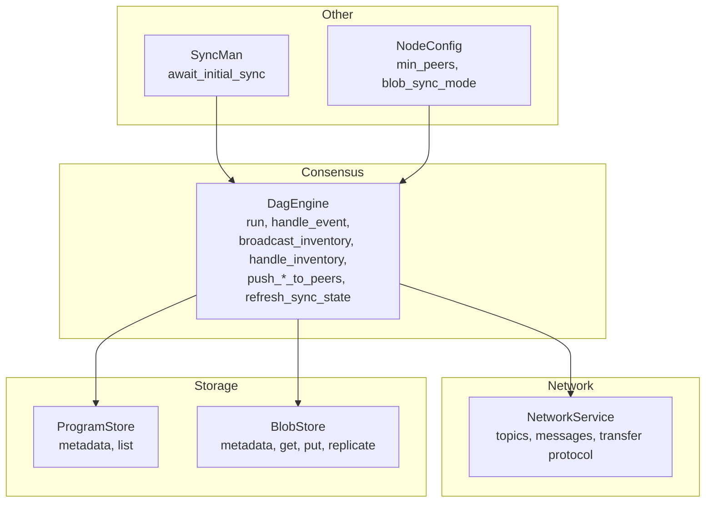
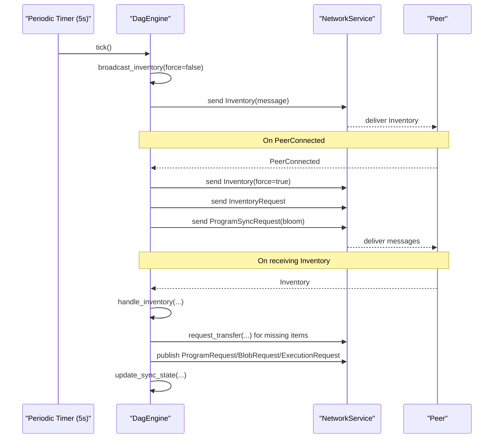
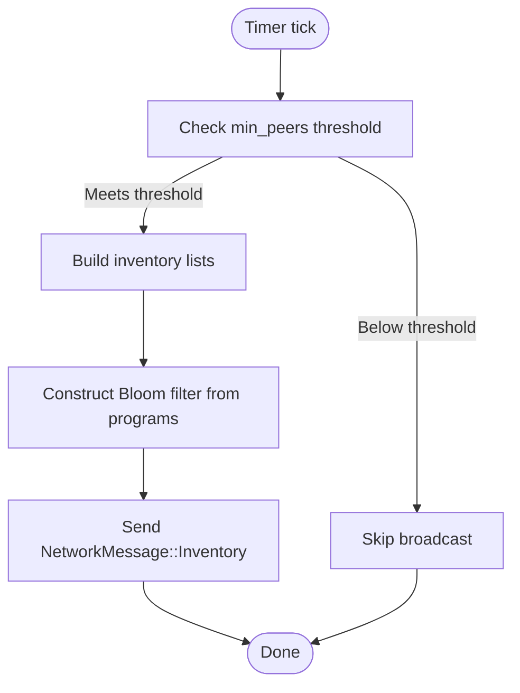
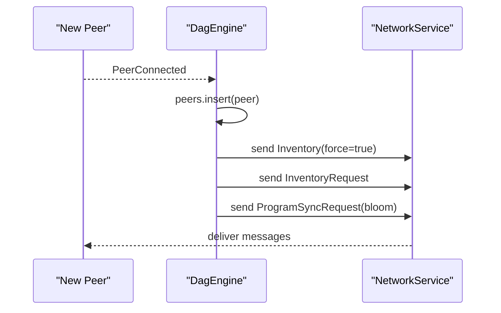
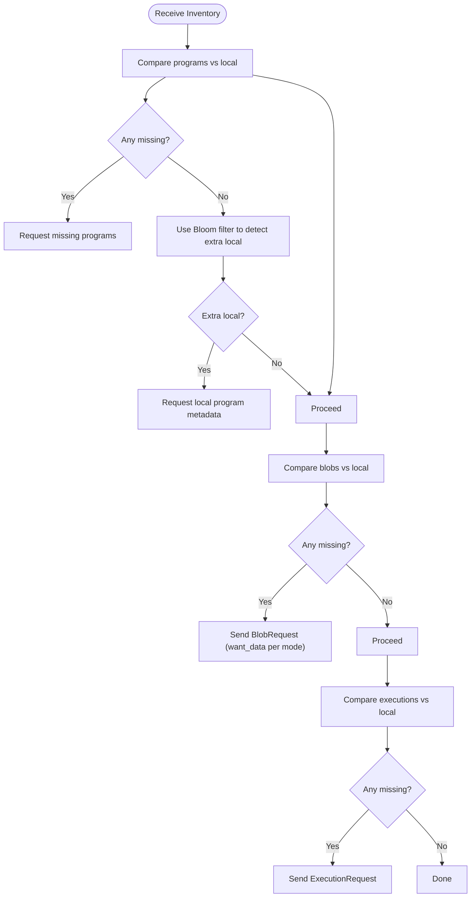
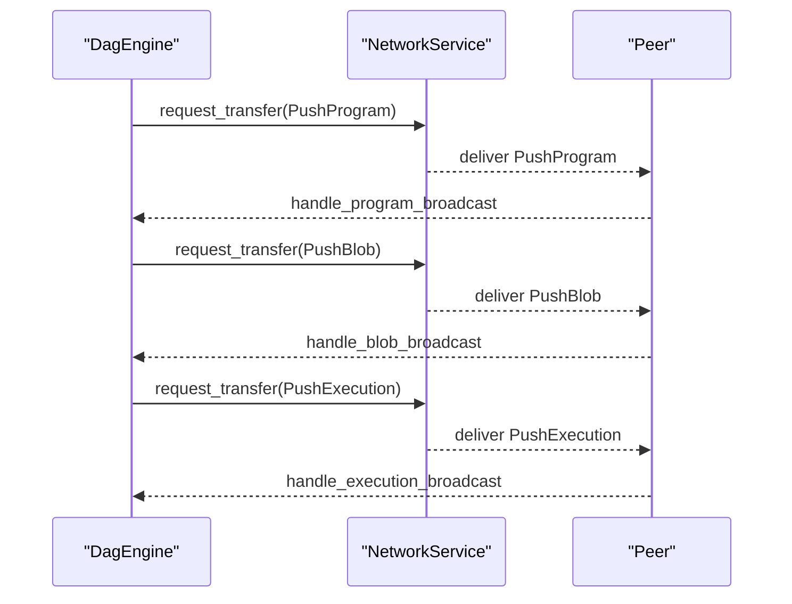
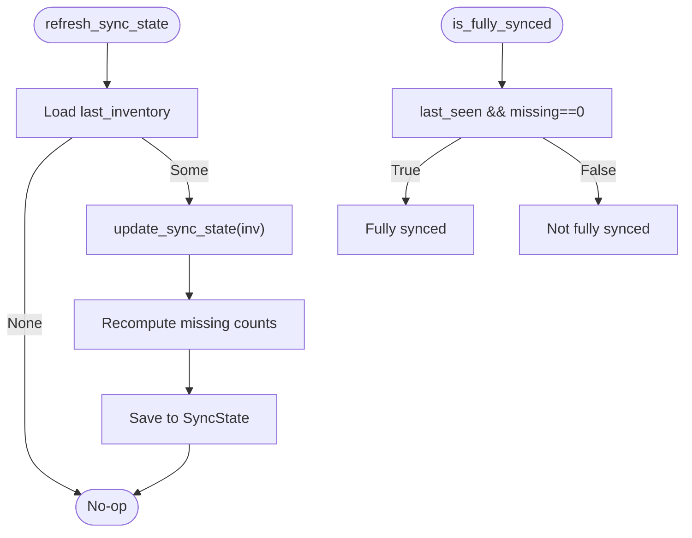
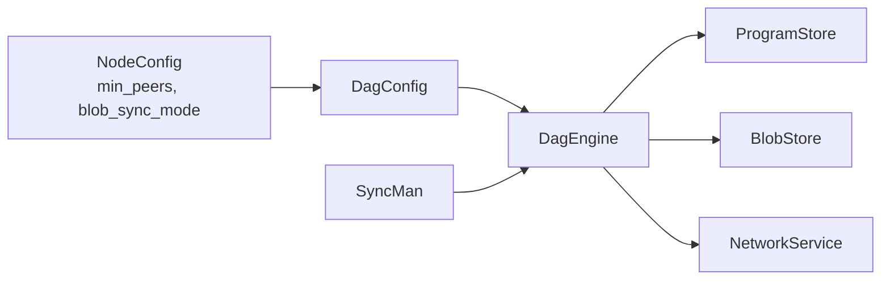

# Synchronization Coordination

<cite>
**Referenced Files in This Document**
- [consensus/mod.rs](file://src/consensus/mod.rs)
- [network/service.rs](file://src/network/service.rs)
- [syncer/mod.rs](file://src/syncer/mod.rs)
- [node.rs](file://src/node.rs)
- [types.rs](file://src/types.rs)
- [storage/blob_store.rs](file://src/storage/blob_store.rs)
- [execution/program_store.rs](file://src/execution/program_store.rs)
</cite>

## Table of Contents
1. [Introduction](#introduction)
2. [Project Structure](#project-structure)
3. [Core Components](#core-components)
4. [Architecture Overview](#architecture-overview)
5. [Detailed Component Analysis](#detailed-component-analysis)
6. [Dependency Analysis](#dependency-analysis)
7. [Performance Considerations](#performance-considerations)
8. [Troubleshooting Guide](#troubleshooting-guide)
9. [Conclusion](#conclusion)

## Introduction
This document explains the synchronization coordination mechanisms between peers in the DAG network. It covers:
- Periodic inventory broadcasting every 5 seconds via broadcast_inventory
- Construction of DagInventory messages with programs, blobs, and executions, including Bloom filters for efficient comparison
- Handshake on PeerConnected triggering mutual inventory exchange and program synchronization requests
- Selective synchronization strategy using BloomFilter to minimize bandwidth while ensuring eventual consistency
- Concrete examples from handle_inventory showing how missing programs, blobs, and executions are identified and requested
- Push-based dissemination model through push_program_to_peers, push_blob_to_peers, and push_execution_to_peers
- Sync state tracking that monitors progress and determines when a node is fully synced
- Tuning guidance for min_peers and blob_sync_mode, plus troubleshooting for stale inventories and unresponsive peers

## Project Structure
The synchronization logic spans several modules:
- Consensus engine (DagEngine) orchestrates inventory broadcasts, handshakes, and sync state updates
- Network service defines message types and topics for inventory, broadcasts, and request/response transfers
- Sync manager coordinates initial synchronization and progress monitoring
- Storage and program stores provide local data for comparison and replication
- Node wiring passes configuration (min_peers, blob_sync_mode) into the consensus engine

**Diagram sources**
- [consensus/mod.rs](file://src/consensus/mod.rs#L104-L118)
- [network/service.rs](file://src/network/service.rs#L228-L259)
- [syncer/mod.rs](file://src/syncer/mod.rs#L15-L31)
- [node.rs](file://src/node.rs#L14-L21)

**Section sources**
- [consensus/mod.rs](file://src/consensus/mod.rs#L104-L118)
- [network/service.rs](file://src/network/service.rs#L228-L259)
- [syncer/mod.rs](file://src/syncer/mod.rs#L15-L31)
- [node.rs](file://src/node.rs#L14-L21)

## Core Components
- DagEngine: central coordinator for synchronization, including periodic inventory broadcasts, handshake handling, selective sync, push-based dissemination, and sync state tracking
- Network messages and topics: define the wire protocol for inventory, broadcasts, and request/response transfers
- SyncMan: orchestrates initial synchronization and progress logging
- Storage and program stores: provide local data for Bloom-filter comparisons and replication decisions

Key responsibilities:
- Periodic inventory broadcasting every 5 seconds
- Handshake on PeerConnected to exchange inventories and request program synchronization
- Selective sync using Bloom filters to reduce bandwidth
- Push-based propagation of new operations to peers
- Tracking and reporting sync progress and completeness

**Section sources**
- [consensus/mod.rs](file://src/consensus/mod.rs#L104-L118)
- [network/service.rs](file://src/network/service.rs#L27-L41)
- [syncer/mod.rs](file://src/syncer/mod.rs#L15-L31)

## Architecture Overview
The synchronization architecture combines periodic broadcasts, on-demand selective sync, and push-based propagation.

**Diagram sources**
- [consensus/mod.rs](file://src/consensus/mod.rs#L104-L118)
- [consensus/mod.rs](file://src/consensus/mod.rs#L177-L182)
- [consensus/mod.rs](file://src/consensus/mod.rs#L501-L616)
- [consensus/mod.rs](file://src/consensus/mod.rs#L732-L753)
- [consensus/mod.rs](file://src/consensus/mod.rs#L755-L778)

## Detailed Component Analysis

### Periodic Inventory Broadcasting (every 5 seconds)
- The consensus engine runs a periodic timer that triggers broadcast_inventory every 5 seconds.
- broadcast_inventory constructs a DagInventory containing:
  - programs: list of program IDs
  - program_bloom: Bloom filter built from local program IDs
  - blobs: inventory entries (ids, presence flags, locations)
  - executions: execution IDs
- The message is published to the network publisher.

**Diagram sources**
- [consensus/mod.rs](file://src/consensus/mod.rs#L104-L118)
- [consensus/mod.rs](file://src/consensus/mod.rs#L732-L753)

**Section sources**
- [consensus/mod.rs](file://src/consensus/mod.rs#L104-L118)
- [consensus/mod.rs](file://src/consensus/mod.rs#L732-L753)

### Handshake on PeerConnected
- On PeerConnected, the engine:
  - Adds the peer to the peer set
  - Forces an inventory broadcast to the new peer
  - Requests inventory from the peer
  - Requests program synchronization using a Bloom filter of local programs

**Diagram sources**
- [consensus/mod.rs](file://src/consensus/mod.rs#L177-L182)
- [consensus/mod.rs](file://src/consensus/mod.rs#L755-L778)

**Section sources**
- [consensus/mod.rs](file://src/consensus/mod.rs#L177-L182)
- [consensus/mod.rs](file://src/consensus/mod.rs#L755-L778)

### Selective Synchronization Strategy Using BloomFilter
- The engine sends a ProgramSyncRequest with a Bloom filter of local program IDs.
- The peer responds with ProgramMeta messages containing missing program metadata.
- For missing blobs, the engine requests blob data according to blob_sync_mode:
  - FullData: requests blob data and replicates
  - MetadataOnly: records metadata without data
- For missing executions, the engine requests execution data.

**Diagram sources**
- [consensus/mod.rs](file://src/consensus/mod.rs#L501-L616)
- [consensus/mod.rs](file://src/consensus/mod.rs#L361-L378)
- [consensus/mod.rs](file://src/consensus/mod.rs#L380-L407)
- [consensus/mod.rs](file://src/consensus/mod.rs#L416-L443)
- [consensus/mod.rs](file://src/consensus/mod.rs#L485-L499)

**Section sources**
- [consensus/mod.rs](file://src/consensus/mod.rs#L501-L616)
- [consensus/mod.rs](file://src/consensus/mod.rs#L361-L378)
- [consensus/mod.rs](file://src/consensus/mod.rs#L380-L407)
- [consensus/mod.rs](file://src/consensus/mod.rs#L416-L443)
- [consensus/mod.rs](file://src/consensus/mod.rs#L485-L499)

### Concrete Example: handle_inventory Missing Items
- Missing programs:
  - The engine identifies missing program IDs and requests them from the peer via request_transfer and ProgramRequest.
  - It also discovers providers for missing programs.
- Missing blobs:
  - Depending on blob_sync_mode, it requests blob data or metadata advertisements.
  - It records blob metadata and provider hints.
- Missing executions:
  - The engine requests missing execution nodes and their associated data.

These steps are implemented in handle_inventory and related handlers.

**Section sources**
- [consensus/mod.rs](file://src/consensus/mod.rs#L501-L616)
- [consensus/mod.rs](file://src/consensus/mod.rs#L416-L443)
- [consensus/mod.rs](file://src/consensus/mod.rs#L485-L499)

### Push-Based Dissemination Model
- New program, blob, and execution broadcasts are proactively pushed to peers using request_transfer with PushProgram, PushBlob, and PushExecution.
- This reduces reliance on pull-only requests and accelerates propagation.

**Diagram sources**
- [consensus/mod.rs](file://src/consensus/mod.rs#L699-L730)
- [consensus/mod.rs](file://src/consensus/mod.rs#L618-L677)

**Section sources**
- [consensus/mod.rs](file://src/consensus/mod.rs#L699-L730)
- [consensus/mod.rs](file://src/consensus/mod.rs#L618-L677)

### Sync State Tracking Mechanism
- The engine maintains a SyncState with:
  - last_inventory: the last received inventory
  - missing_programs, missing_blobs, missing_execs: counts derived from the last inventory
  - last_seen: whether an inventory was ever seen
- refresh_sync_state loads the last inventory and recomputes missing counts.
- is_fully_synced checks that last_seen is true and all missing counts are zero.

**Diagram sources**
- [consensus/mod.rs](file://src/consensus/mod.rs#L788-L837)
- [consensus/mod.rs](file://src/consensus/mod.rs#L780-L787)
- [consensus/mod.rs](file://src/consensus/mod.rs#L1026-L1033)

**Section sources**
- [consensus/mod.rs](file://src/consensus/mod.rs#L788-L837)
- [consensus/mod.rs](file://src/consensus/mod.rs#L780-L787)
- [consensus/mod.rs](file://src/consensus/mod.rs#L1026-L1033)

## Dependency Analysis
- Consensus engine depends on:
  - ProgramStore and BlobStore for local data
  - NetworkService for publishing and request/response transfers
  - Types for IDs and operation structures
- Node wiring injects configuration (min_peers, blob_sync_mode) into DagEngine
- SyncMan depends on DagEngine for peer count, inventory requests, sync state refresh, and fully-synced checks

**Diagram sources**
- [node.rs](file://src/node.rs#L14-L21)
- [consensus/mod.rs](file://src/consensus/mod.rs#L54-L61)
- [syncer/mod.rs](file://src/syncer/mod.rs#L15-L31)

**Section sources**
- [node.rs](file://src/node.rs#L14-L21)
- [consensus/mod.rs](file://src/consensus/mod.rs#L54-L61)
- [syncer/mod.rs](file://src/syncer/mod.rs#L15-L31)

## Performance Considerations
- min_peers threshold:
  - broadcast_inventory skips sending inventory when below threshold unless forced
  - Increase min_peers to reduce unnecessary broadcasts on sparsely connected nodes
  - Decrease min_peers to accelerate initial discovery and early sync
- blob_sync_mode:
  - FullData: replicates blob data immediately; higher bandwidth and disk usage
  - MetadataOnly: records metadata and provider hints; lower bandwidth; rely on provider hints and requests for data
- PROGRAM_META_BATCH:
  - Limits batch size for program metadata responses to control memory and network load
- Bloom filter size and k:
  - BloomFilter uses a fixed-size bit vector and a small number of hash functions; adjust size/k if scaling to very large sets

Tuning tips:
- Start with moderate min_peers (e.g., 2–4) to balance discovery speed and overhead
- Use MetadataOnly in constrained environments; switch to FullData for high-throughput scenarios
- Monitor sync_gaps to assess progress and adjust thresholds accordingly

**Section sources**
- [consensus/mod.rs](file://src/consensus/mod.rs#L732-L753)
- [consensus/mod.rs](file://src/consensus/mod.rs#L380-L407)
- [consensus/mod.rs](file://src/consensus/mod.rs#L361-L378)
- [consensus/mod.rs](file://src/consensus/mod.rs#L60-L61)
- [consensus/mod.rs](file://src/consensus/mod.rs#L1035-L1087)

## Troubleshooting Guide
Common issues and remedies:
- Stale inventories:
  - Symptoms: missing counts remain unchanged despite new peers joining
  - Actions: trigger request_inventory and ensure refresh_sync_state is called; verify periodic timer is running
- Unresponsive peers:
  - Symptoms: request_transfer failures or timeouts
  - Actions: increase min_peers to ensure more peers; verify provider hints and Kademlia discovery; monitor outbound/inbound transfer failures
- Excessive bandwidth:
  - Symptoms: high CPU/network usage
  - Actions: switch to MetadataOnly; reduce min_peers; limit batches; monitor PROGRAM_META_BATCH
- Partial sync:
  - Symptoms: is_fully_synced remains false
  - Actions: inspect sync_gaps; confirm missing_programs/missing_blobs/missing_execs; verify push-based propagation and provider hints

Operational checks:
- Verify PeerConnected handshake triggers inventory exchange and program sync requests
- Confirm push_program_to_peers, push_blob_to_peers, push_execution_to_peers are invoked on new broadcasts
- Ensure refresh_sync_state is periodically called and last_inventory is updated

**Section sources**
- [consensus/mod.rs](file://src/consensus/mod.rs#L177-L182)
- [consensus/mod.rs](file://src/consensus/mod.rs#L755-L778)
- [consensus/mod.rs](file://src/consensus/mod.rs#L699-L730)
- [consensus/mod.rs](file://src/consensus/mod.rs#L788-L837)
- [network/service.rs](file://src/network/service.rs#L228-L259)

## Conclusion
The DAG synchronization system employs a hybrid approach combining periodic inventory broadcasts, Bloom-filter-based selective sync, and push-based propagation. The design minimizes bandwidth while ensuring eventual consistency across peers. Configuration knobs (min_peers, blob_sync_mode) enable tuning for different operational contexts. The sync state tracking provides visibility into progress and completion, enabling robust startup and ongoing maintenance.