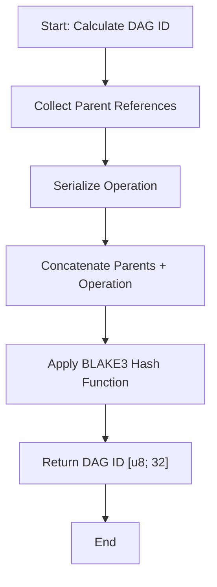
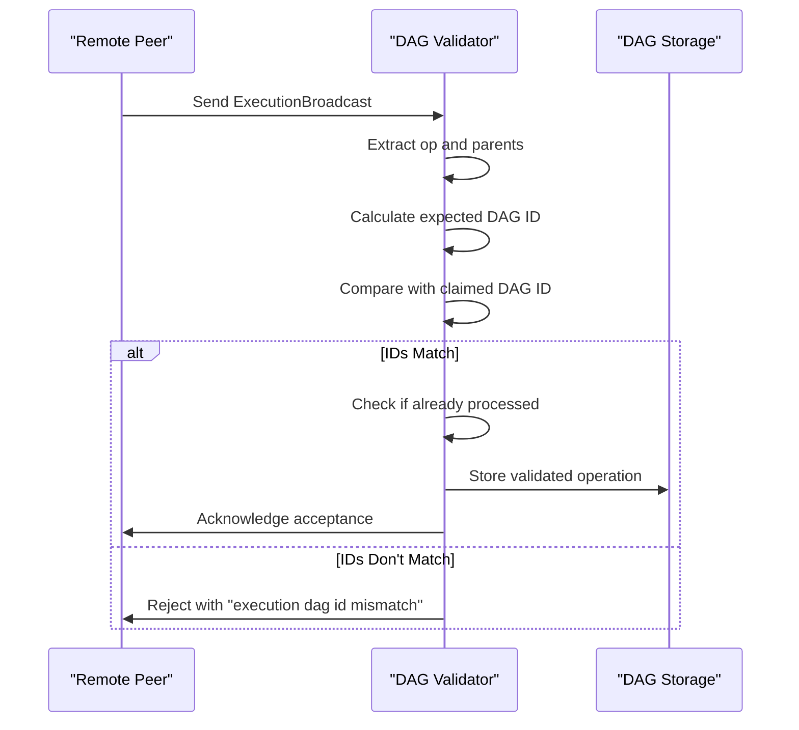
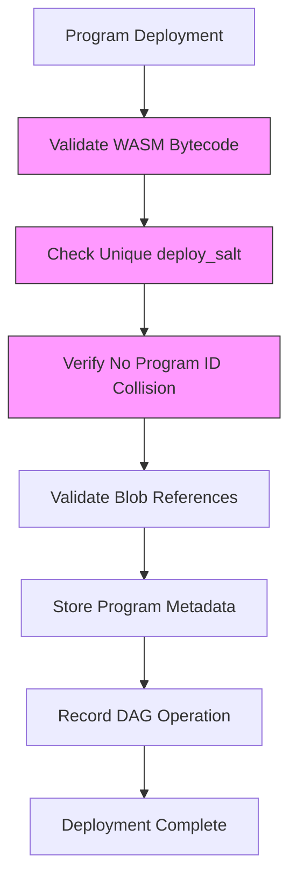
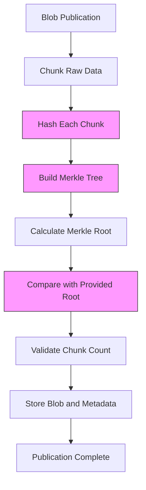
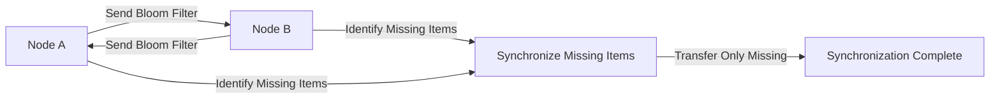

# Validation Rules

<cite>
**Referenced Files in This Document**   
- [mod.rs](file://src/consensus/mod.rs)
- [hashing.rs](file://src/crypto/hashing.rs)
- [keys.rs](file://src/crypto/keys.rs)
- [blob_store.rs](file://src/storage/blob_store.rs)
- [state_store.rs](file://src/storage/state_store.rs)
- [service.rs](file://src/network/service.rs)
- [types.rs](file://src/types.rs)
</cite>

## Table of Contents
1. [Introduction](#introduction)
2. [DAG Integrity Validation](#dag-integrity-validation)
3. [Operation Validity Rules](#operation-validity-rules)
4. [Domain-Specific Validation Rules](#domain-specific-validation-rules)
5. [Security Considerations](#security-considerations)
6. [Common Validation Failures and Solutions](#common-validation-failures-and-solutions)

## Introduction
This document details the validation rules governing DAG integrity and operation validity in the ONVM system. The validation framework ensures data consistency, prevents tampering, and maintains system security through cryptographic verification, causal dependency checking, and domain-specific constraints. The core validation logic is implemented in the consensus module, with integration points to cryptographic, storage, and network components.

## DAG Integrity Validation

### Cryptographic Verification through DAG ID Hashing
The system uses cryptographic hashing to detect tampering in the Directed Acyclic Graph (DAG) structure. Each DAG node's identity is derived from a hash of its operation and parent references, ensuring any modification can be detected. The `dag_id` function in the consensus module combines parent references with the serialized operation to produce a unique identifier:

**Diagram sources**
- [mod.rs](file://src/consensus/mod.rs#L1089-L1103)

The hashing process uses the BLAKE3 algorithm implemented in the crypto module, providing strong cryptographic guarantees against collision attacks. This ensures that any attempt to modify an operation or its dependencies will result in a different DAG ID, immediately revealing the tampering.

**Section sources**
- [mod.rs](file://src/consensus/mod.rs#L1089-L1103)
- [hashing.rs](file://src/crypto/hashing.rs#L3-L6)

### Publisher Signature Validation using NodeKeys
Publisher authenticity is verified using Ed25519 digital signatures. Each node possesses a cryptographic identity managed by the NodeKeys structure, which handles key generation, loading, and signature operations. The system validates that operations are published by authorized nodes, preventing impersonation attacks.

The NodeKeys implementation provides:
- Secure key generation using OS randomness
- Persistent storage of secret keys
- Digital signature creation and verification
- Node identity derivation from public keys

This cryptographic foundation ensures that only authorized nodes can publish valid operations to the network, maintaining the integrity of the distributed system.

**Section sources**
- [keys.rs](file://src/crypto/keys.rs#L8-L72)
- [mod.rs](file://src/consensus/mod.rs#L70)

### Causal Dependency Checking
The system prevents orphaned operations by enforcing causal dependencies through parent references. Each operation must explicitly declare its dependencies, creating a verifiable chain of causality. The DAG structure ensures that operations can only be processed when all prerequisite operations have been validated and recorded.

When a new operation is submitted, the system:
1. Validates that all parent references exist in the DAG
2. Ensures the operation's timestamp is consistent with causal ordering
3. Confirms the publisher has authority to create the operation
4. Verifies the computed DAG ID matches the claimed ID

This dependency checking creates a robust causal ordering that prevents race conditions and ensures consistent state across the distributed network.

**Section sources**
- [mod.rs](file://src/consensus/mod.rs#L40-L46)
- [mod.rs](file://src/consensus/mod.rs#L294-L304)

## Operation Validity Rules

### Execution DAG ID Mismatch Detection
The system detects and rejects execution broadcasts with DAG ID mismatches through a validation process in the `handle_execution_broadcast` function. When an execution operation is received, the system recalculates the expected DAG ID and compares it with the claimed ID:

**Diagram sources**
- [mod.rs](file://src/consensus/mod.rs#L445-L459)

The validation process first reconstructs the expected DAG ID by combining the operation with its parent references, then compares this calculated ID with the one provided in the broadcast. If they don't match, the operation is immediately rejected with an "execution dag id mismatch" error, preventing the propagation of potentially tampered or incorrectly constructed operations.

**Section sources**
- [mod.rs](file://src/consensus/mod.rs#L445-L482)

### Integration with Storage Components
The validation process integrates with storage components to verify the existence and integrity of referenced data. Before accepting operations, the system checks that required program and blob metadata exist in the respective stores.

For program deployment operations, the system verifies:
- Program metadata exists in the ProgramStore
- WASM bytecode is available and matches the metadata
- Deploy salt is unique for the program ID

For blob publication operations, the system confirms:
- Blob metadata is consistent with the provided data
- Merkle root matches the chunk hashes
- All chunks are available and correctly hashed

This tight integration between validation and storage ensures that operations only reference existing, valid data, maintaining the overall integrity of the system.

**Section sources**
- [mod.rs](file://src/consensus/mod.rs#L312-L320)
- [mod.rs](file://src/consensus/mod.rs#L385-L390)
- [blob_store.rs](file://src/storage/blob_store.rs#L48-L76)

## Domain-Specific Validation Rules

### Program Deployment Validation
Program deployment operations must satisfy several domain-specific validation rules to ensure system security and consistency:

**Diagram sources**
- [mod.rs](file://src/consensus/mod.rs#L307-L337)
- [types.rs](file://src/types.rs#L34-L41)

The validation process requires that:
1. The WASM bytecode is valid and can be loaded by the execution runtime
2. The deploy_salt is unique for the program, preventing ID collisions
3. All referenced blobs exist in the blob store
4. The publisher has authority to deploy the program

If a program with the same ID but different salt is detected, the system rejects it with a "program id collision with different salt" error, ensuring that each program ID corresponds to a unique deployment.

**Section sources**
- [mod.rs](file://src/consensus/mod.rs#L314-L316)
- [types.rs](file://src/types.rs#L60-L64)

### Blob Publication Validation
Blob publication operations must contain proper Merkle roots and chunk hashes to ensure data integrity. The system validates that the provided metadata accurately represents the blob content:

**Diagram sources**
- [blob_store.rs](file://src/storage/blob_store.rs#L48-L76)
- [blob_store.rs](file://src/storage/blob_store.rs#L163-L183)

The validation process:
1. Splits the blob data into chunks according to the specified chunk size
2. Computes the hash of each chunk
3. Builds a Merkle tree from the chunk hashes
4. Compares the calculated Merkle root with the one provided in the metadata
5. Verifies the chunk count matches the number of chunks

Any discrepancy in these values results in rejection, ensuring that blobs cannot be tampered with after publication.

**Section sources**
- [blob_store.rs](file://src/storage/blob_store.rs#L48-L76)
- [types.rs](file://src/types.rs#L44-L52)

### Compute Operation Validation
Compute operations require valid program and blob references to ensure execution integrity. The system validates that:
- The referenced program exists and is executable
- Input and output blobs are properly defined
- State writes are consistent with the program's execution

When a compute operation is submitted, the system first verifies the program metadata exists locally before proceeding with execution. It then creates metadata for input and output blobs, ensuring they are properly recorded in the blob store before the computation begins.

The causal dependencies for compute operations include references to the program, input blob, and output blob, creating a verifiable chain of execution that can be audited and replayed if necessary.

**Section sources**
- [mod.rs](file://src/consensus/mod.rs#L194-L257)
- [types.rs](file://src/types.rs#L24-L31)

## Security Considerations

### Double-Spending Prevention
The system prevents double-spending through rigorous publisher verification and operation uniqueness. Each operation is cryptographically tied to its publisher through the NodeKeys system, ensuring that only the rightful owner can create operations involving their resources.

The DAG structure inherently prevents double-spending by:
- Creating a globally ordered sequence of operations
- Requiring explicit causal dependencies
- Using unique DAG IDs for each operation
- Maintaining a distributed consensus on operation validity

When an operation is processed, it is recorded in the DAG store, which prevents the same operation from being processed twice. This ensures that resources cannot be spent multiple times, maintaining the economic integrity of the system.

**Section sources**
- [mod.rs](file://src/consensus/mod.rs#L460-L462)
- [keys.rs](file://src/crypto/keys.rs#L64-L66)

### Denial-of-Service Mitigation
The system mitigates denial-of-service attacks through bloom filter-based inventory synchronization. Instead of exchanging complete lists of available resources, nodes exchange compact bloom filters that probabilistically represent their inventory.

The bloom filter implementation:
- Uses multiple hash functions to minimize false positives
- Has a fixed size to limit memory consumption
- Allows efficient comparison of inventories
- Reduces network bandwidth usage

When nodes connect, they exchange inventory information using bloom filters, allowing them to quickly identify missing resources without transferring large amounts of data. This approach significantly reduces the attack surface for denial-of-service attacks by limiting the amount of data that must be processed during synchronization.

**Diagram sources**
- [mod.rs](file://src/consensus/mod.rs#L736-L751)
- [service.rs](file://src/network/service.rs#L107-L110)

The bloom filter approach allows nodes to efficiently discover what resources they are missing from their peers while minimizing network traffic and processing overhead, making the system more resilient to resource exhaustion attacks.

**Section sources**
- [mod.rs](file://src/consensus/mod.rs#L736-L751)
- [service.rs](file://src/network/service.rs#L107-L110)

## Common Validation Failures and Solutions

### Network Partition Handling
During network partitions, nodes may have inconsistent views of the DAG, leading to validation failures when partitions heal. The system handles this through:

1. **Inventory synchronization**: Nodes exchange bloom filters and inventory lists to identify missing operations
2. **Gossip protocol**: Uses gossipsub for reliable message dissemination across the network
3. **Request-response protocol**: Allows direct retrieval of missing operations from peers

When a node detects it is missing operations (through inventory comparison), it requests the missing items from connected peers. The system prioritizes synchronization with multiple peers to ensure rapid recovery from partitions.

**Section sources**
- [mod.rs](file://src/consensus/mod.rs#L501-L614)
- [service.rs](file://src/network/service.rs#L202-L207)

### Clock Drift Issues
Clock drift can affect timestamp-based validation and causal ordering. The system addresses this through:

- **Monotonic timestamps**: Uses system time in milliseconds since UNIX epoch
- **Causal ordering**: Relies more on dependency references than timestamps
- **Flexible validation**: Does not strictly enforce temporal ordering

The system's primary ordering mechanism is the DAG structure and dependency references rather than timestamps, making it resilient to moderate clock drift between nodes. Timestamps are used for diagnostic purposes and secondary validation but are not critical to the core consensus mechanism.

**Section sources**
- [mod.rs](file://src/consensus/mod.rs#L300)
- [mod.rs](file://src/consensus/mod.rs#L1106-L1110)