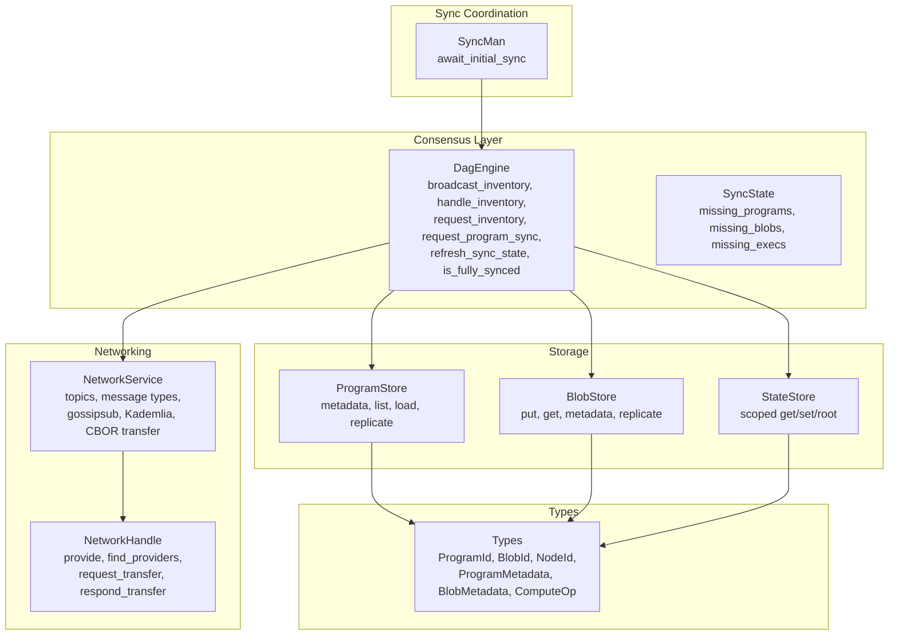
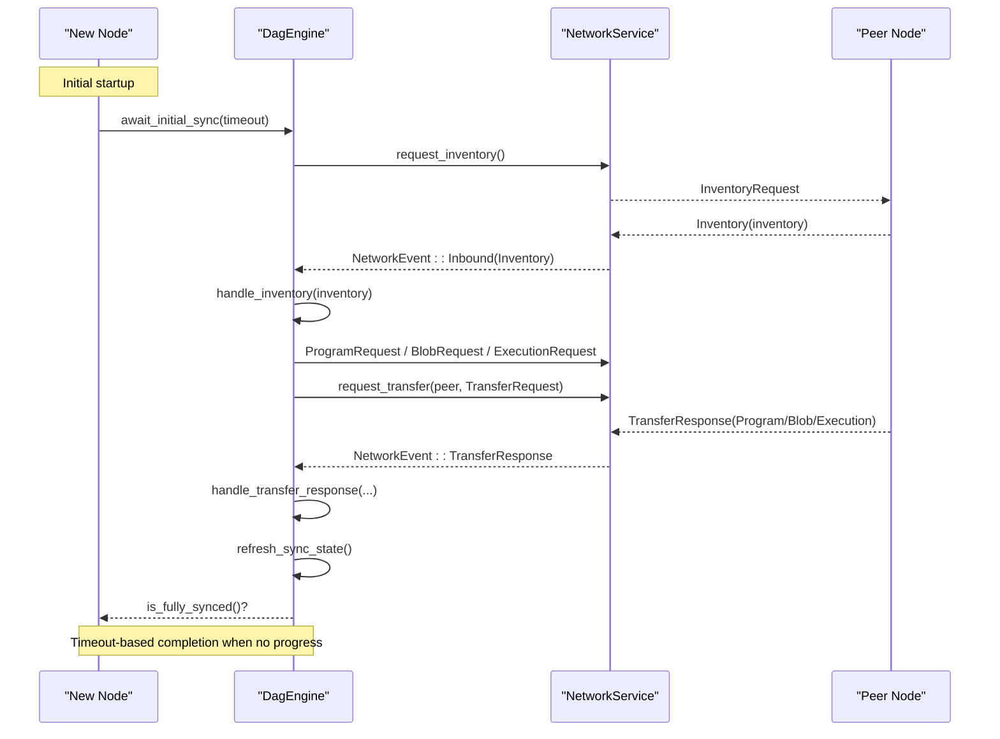
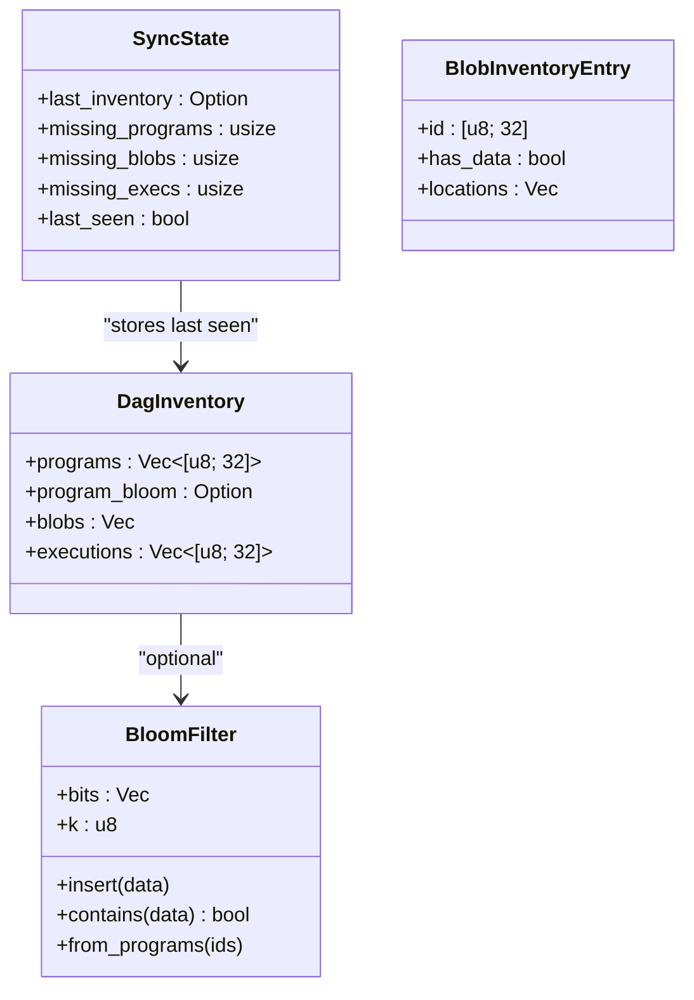
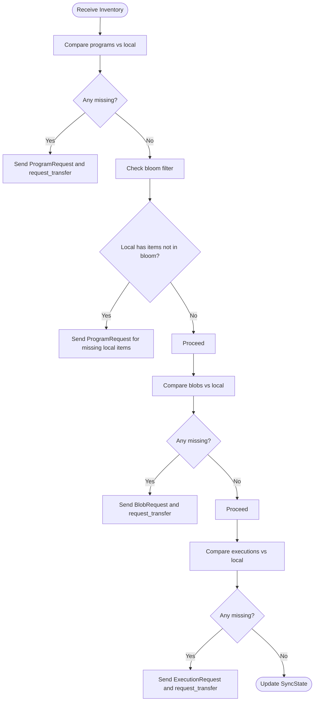
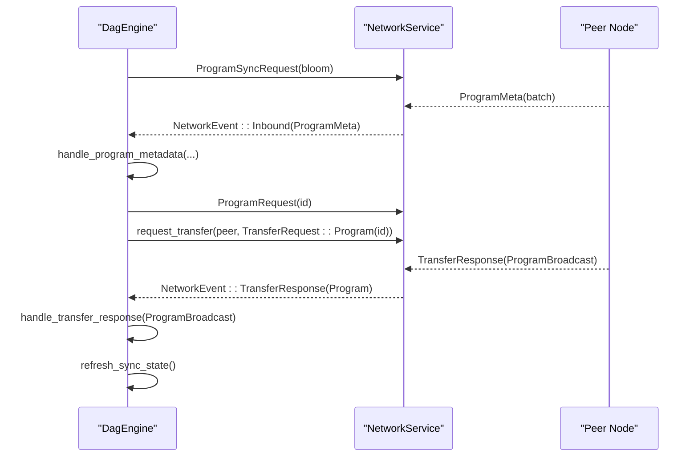
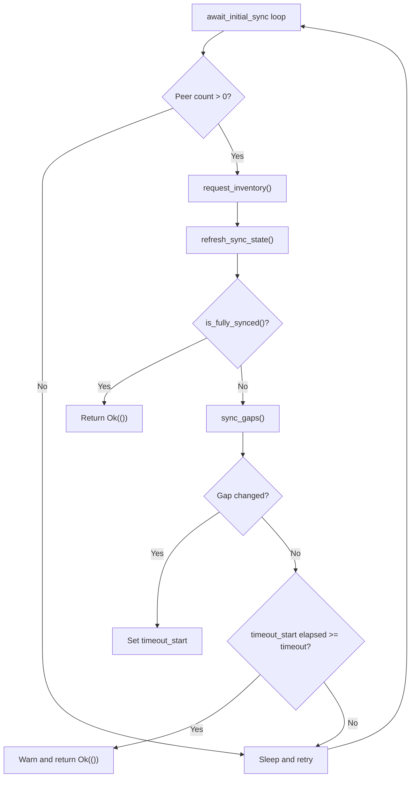
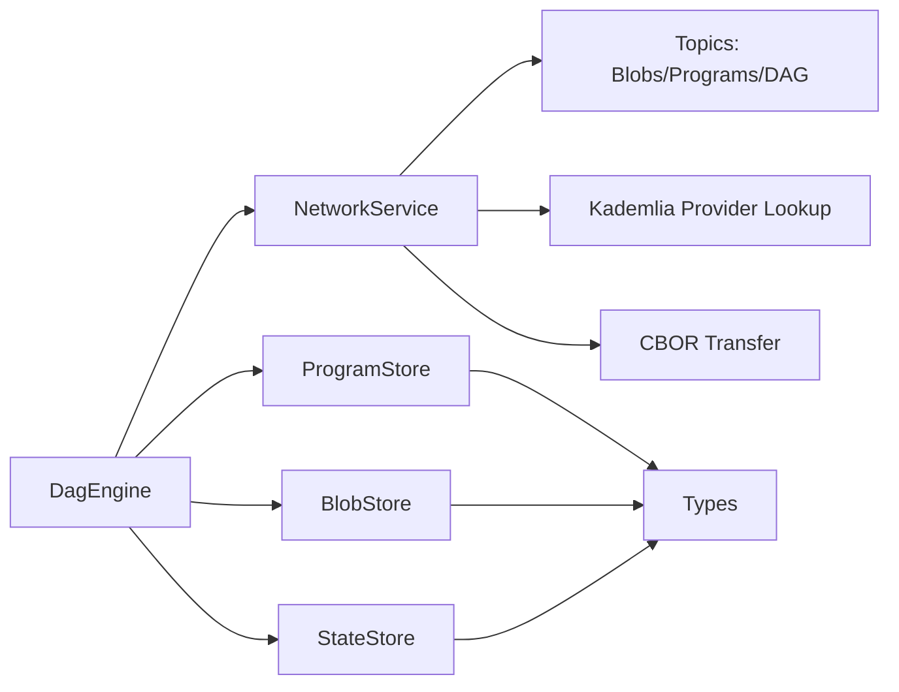
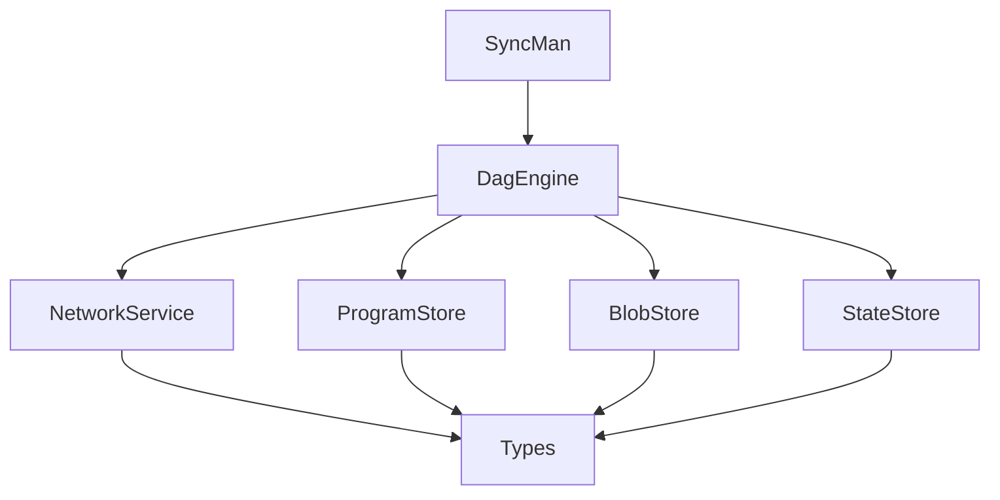

# Synchronization Protocol

<cite>
**Referenced Files in This Document**
- [consensus/mod.rs](file://src/consensus/mod.rs)
- [syncer/mod.rs](file://src/syncer/mod.rs)
- [network/service.rs](file://src/network/service.rs)
- [types.rs](file://src/types.rs)
- [storage/blob_store.rs](file://src/storage/blob_store.rs)
- [storage/state_store.rs](file://src/storage/state_store.rs)
- [execution/program_store.rs](file://src/execution/program_store.rs)
- [crypto/hashing.rs](file://src/crypto/hashing.rs)
</cite>

## Table of Contents
1. [Introduction](#introduction)
2. [Project Structure](#project-structure)
3. [Core Components](#core-components)
4. [Architecture Overview](#architecture-overview)
5. [Detailed Component Analysis](#detailed-component-analysis)
6. [Dependency Analysis](#dependency-analysis)
7. [Performance Considerations](#performance-considerations)
8. [Troubleshooting Guide](#troubleshooting-guide)
9. [Conclusion](#conclusion)
10. [Appendices](#appendices)

## Introduction
This document describes the DAG synchronization protocol implemented in the repository. It explains how nodes exchange inventory information to discover missing components and request them from peers. The protocol centers around:
- Broadcasting inventory messages with bloom filters for efficient program set comparison
- Processing peer inventories to detect gaps and initiate targeted transfer requests
- Coordinating initial synchronization through a dedicated SyncMan that polls inventory status and tracks progress until fully synced or a timeout occurs

The document also covers domain models (DagInventory, BloomFilter, SyncState), integration with networking (peer discovery, message passing, Kademlia provider lookups), and storage (verifying local presence and replicating data). Finally, it discusses technical decisions (bloom filters, batched metadata exchange, timeouts), scalability considerations, and security aspects.

## Project Structure
The synchronization protocol spans several modules:
- Consensus engine: orchestrates inventory broadcasting, processing, and transfer coordination
- Syncer: coordinates initial synchronization with polling and timeout-based completion
- Network service: defines messages, topics, and transport for gossipsub and request-response
- Storage: persists programs, blobs, and state; validates integrity during replication
- Types: shared identifiers and metadata structures
- Crypto: hashing primitives used by bloom filters and integrity checks

**Diagram sources**
- [consensus/mod.rs](file://src/consensus/mod.rs#L60-L120)
- [syncer/mod.rs](file://src/syncer/mod.rs#L1-L69)
- [network/service.rs](file://src/network/service.rs#L22-L134)
- [storage/program_store.rs](file://src/execution/program_store.rs#L1-L96)
- [storage/blob_store.rs](file://src/storage/blob_store.rs#L1-L185)
- [storage/state_store.rs](file://src/storage/state_store.rs#L1-L80)
- [types.rs](file://src/types.rs#L1-L109)

**Section sources**
- [consensus/mod.rs](file://src/consensus/mod.rs#L60-L120)
- [syncer/mod.rs](file://src/syncer/mod.rs#L1-L69)
- [network/service.rs](file://src/network/service.rs#L22-L134)
- [types.rs](file://src/types.rs#L1-L109)

## Core Components
- DagEngine: central coordinator for synchronization logic, including inventory broadcasting, processing peer inventories, initiating transfers, and maintaining SyncState.
- SyncMan: orchestrates initial synchronization by periodically requesting inventory, refreshing sync state, checking completeness, logging progress, and timing out.
- NetworkService: defines message types, topics, and transport; handles gossipsub publication, Kademlia provider discovery, and CBOR-based request-response transfers.
- Storage subsystems: ProgramStore, BlobStore, and StateStore manage persistence, integrity checks, and replication of programs, blobs, and state.

Key responsibilities:
- Broadcast inventory with programs, blobs, and executions lists; include a bloom filter for programs to reduce bandwidth.
- Detect missing components by comparing local stores against inventories.
- Request missing data via ProgramRequest, BlobRequest, and ExecutionRequest messages.
- Coordinate transfers using TransferRequest/TransferResponse channels.
- Track synchronization progress and determine completion.

**Section sources**
- [consensus/mod.rs](file://src/consensus/mod.rs#L60-L120)
- [consensus/mod.rs](file://src/consensus/mod.rs#L732-L778)
- [consensus/mod.rs](file://src/consensus/mod.rs#L501-L616)
- [consensus/mod.rs](file://src/consensus/mod.rs#L755-L778)
- [syncer/mod.rs](file://src/syncer/mod.rs#L15-L69)
- [network/service.rs](file://src/network/service.rs#L22-L134)
- [network/service.rs](file://src/network/service.rs#L136-L168)
- [network/service.rs](file://src/network/service.rs#L202-L209)
- [network/service.rs](file://src/network/service.rs#L212-L458)
- [storage/program_store.rs](file://src/execution/program_store.rs#L1-L96)
- [storage/blob_store.rs](file://src/storage/blob_store.rs#L1-L185)
- [storage/state_store.rs](file://src/storage/state_store.rs#L1-L80)

## Architecture Overview
The synchronization architecture integrates consensus, networking, and storage:

**Diagram sources**
- [syncer/mod.rs](file://src/syncer/mod.rs#L15-L69)
- [consensus/mod.rs](file://src/consensus/mod.rs#L501-L616)
- [consensus/mod.rs](file://src/consensus/mod.rs#L618-L697)
- [network/service.rs](file://src/network/service.rs#L22-L134)
- [network/service.rs](file://src/network/service.rs#L349-L394)

## Detailed Component Analysis

### Domain Models
- DagInventory: carries lists of program IDs, optional program bloom filter, blob inventory entries, and execution IDs. It enables peers to advertise their holdings efficiently.
- BloomFilter: compact probabilistic structure used to represent sets of program IDs; supports insert and membership testing with configurable hash functions.
- SyncState: tracks the last received inventory and counts of missing programs, blobs, and executions; used by SyncMan to monitor progress and decide completion.

**Diagram sources**
- [network/service.rs](file://src/network/service.rs#L92-L116)
- [network/service.rs](file://src/network/service.rs#L106-L110)
- [consensus/mod.rs](file://src/consensus/mod.rs#L1026-L1034)
- [consensus/mod.rs](file://src/consensus/mod.rs#L1035-L1088)

**Section sources**
- [network/service.rs](file://src/network/service.rs#L92-L116)
- [consensus/mod.rs](file://src/consensus/mod.rs#L1026-L1088)

### Inventory Exchange and Gap Detection
- Broadcasting inventory: DagEngine constructs inventory lists and sends an Inventory message with a bloom filter for programs when conditions permit.
- Handling peer inventory: DagEngine compares peer inventory against local stores to identify missing programs, blobs, and executions, then initiates targeted requests and provider lookups.

**Diagram sources**
- [consensus/mod.rs](file://src/consensus/mod.rs#L501-L616)

**Section sources**
- [consensus/mod.rs](file://src/consensus/mod.rs#L732-L778)
- [consensus/mod.rs](file://src/consensus/mod.rs#L501-L616)

### Request Transfer Mechanisms
- Program metadata sync: When encountering unknown program metadata, the engine requests the program and initiates provider discovery.
- Program sync request: The engine sends a ProgramSyncRequest with a bloom filter of its own programs; peers respond with missing program metadata in batches.
- Blob and execution requests: The engine sends BlobRequest and ExecutionRequest messages to peers to fetch missing data.
- Transfer request/response: Using the request-response protocol, nodes send TransferRequest and receive TransferResponse carrying ProgramBroadcast, BlobBroadcast, or ExecutionBroadcast.

**Diagram sources**
- [consensus/mod.rs](file://src/consensus/mod.rs#L340-L359)
- [consensus/mod.rs](file://src/consensus/mod.rs#L361-L378)
- [consensus/mod.rs](file://src/consensus/mod.rs#L618-L697)
- [network/service.rs](file://src/network/service.rs#L112-L134)
- [network/service.rs](file://src/network/service.rs#L349-L394)

**Section sources**
- [consensus/mod.rs](file://src/consensus/mod.rs#L340-L359)
- [consensus/mod.rs](file://src/consensus/mod.rs#L361-L378)
- [consensus/mod.rs](file://src/consensus/mod.rs#L618-L697)
- [network/service.rs](file://src/network/service.rs#L112-L134)
- [network/service.rs](file://src/network/service.rs#L349-L394)

### SyncMan and Initial Synchronization
SyncMan coordinates initial synchronization:
- Polls inventory and refreshes sync state
- Logs progress and detects lack of progress to start timeout
- Completes when fully synced or times out with partial view

**Diagram sources**
- [syncer/mod.rs](file://src/syncer/mod.rs#L15-L69)

**Section sources**
- [syncer/mod.rs](file://src/syncer/mod.rs#L15-L69)

### Integration with Networking and Storage
- Networking:
  - Topics: separate topics for blobs, programs, and blocks/DAG-related messages
  - Transport: gossipsub for pub/sub, Kademlia for provider discovery, CBOR request-response for transfers
  - Deduplication: recent message IDs prevent reprocessing
- Storage:
  - ProgramStore: persists program metadata and bytes; supports replication and loading
  - BlobStore: persists blob metadata and chunked data; validates integrity on replicate and read
  - StateStore: scoped key-value storage with Merkle roots for state consistency

**Diagram sources**
- [network/service.rs](file://src/network/service.rs#L22-L41)
- [network/service.rs](file://src/network/service.rs#L202-L209)
- [network/service.rs](file://src/network/service.rs#L212-L458)
- [consensus/mod.rs](file://src/consensus/mod.rs#L60-L120)
- [storage/program_store.rs](file://src/execution/program_store.rs#L1-L96)
- [storage/blob_store.rs](file://src/storage/blob_store.rs#L1-L185)
- [storage/state_store.rs](file://src/storage/state_store.rs#L1-L80)
- [types.rs](file://src/types.rs#L1-L109)

**Section sources**
- [network/service.rs](file://src/network/service.rs#L22-L41)
- [network/service.rs](file://src/network/service.rs#L202-L209)
- [network/service.rs](file://src/network/service.rs#L212-L458)
- [storage/program_store.rs](file://src/execution/program_store.rs#L1-L96)
- [storage/blob_store.rs](file://src/storage/blob_store.rs#L1-L185)
- [storage/state_store.rs](file://src/storage/state_store.rs#L1-L80)
- [types.rs](file://src/types.rs#L1-L109)

## Dependency Analysis
- Consensus depends on:
  - NetworkService for message routing and provider discovery
  - ProgramStore, BlobStore, StateStore for persistence and integrity checks
  - Types for identifiers and metadata
- SyncMan depends on DagEngine for synchronization APIs
- NetworkService composes gossipsub, Kademlia, and CBOR request-response behaviors

**Diagram sources**
- [consensus/mod.rs](file://src/consensus/mod.rs#L60-L120)
- [syncer/mod.rs](file://src/syncer/mod.rs#L1-L20)
- [network/service.rs](file://src/network/service.rs#L202-L209)
- [types.rs](file://src/types.rs#L1-L109)

**Section sources**
- [consensus/mod.rs](file://src/consensus/mod.rs#L60-L120)
- [syncer/mod.rs](file://src/syncer/mod.rs#L1-L20)
- [network/service.rs](file://src/network/service.rs#L202-L209)
- [types.rs](file://src/types.rs#L1-L109)

## Performance Considerations
- Bloom filters reduce bandwidth by allowing peers to advertise program sets efficiently and enabling batched metadata exchange.
- Batched program metadata exchange limits overhead when responding to ProgramSyncRequest.
- Periodic inventory broadcasts balance freshness with network load.
- Deduplication in NetworkService prevents redundant processing of messages.
- Parallelism opportunities:
  - Concurrently request missing programs/blobs/executions from multiple peers
  - Parallelize blob chunk verification and state writes
- Scalability:
  - Large networks: rely on Kademlia provider discovery to locate data holders
  - Optimize sync performance: prioritize high-throughput peers, stagger requests, and leverage caching
  - Manage partial synchronization: continue operation with partial state while background sync completes

[No sources needed since this section provides general guidance]

## Troubleshooting Guide
Common issues and mitigations:
- No peers connected: SyncMan sleeps and retries; ensure discovery is enabled and reachable.
- Inventory not updating: Verify broadcast_inventory conditions (peer count threshold) and periodic tick.
- Missing data despite requests: Check provider discovery and Kademlia queries; confirm request_transfer is issued and responses are handled.
- Integrity failures: BlobStore and ProgramStore enforce integrity checks during replicate and read; investigate mismatches in chunk hashes or Merkle roots.
- Excessive bandwidth: Confirm bloom filters are used and batch sizes are appropriate; adjust min_peers thresholds.

**Section sources**
- [syncer/mod.rs](file://src/syncer/mod.rs#L15-L69)
- [consensus/mod.rs](file://src/consensus/mod.rs#L732-L778)
- [consensus/mod.rs](file://src/consensus/mod.rs#L501-L616)
- [consensus/mod.rs](file://src/consensus/mod.rs#L618-L697)
- [storage/blob_store.rs](file://src/storage/blob_store.rs#L48-L104)
- [storage/program_store.rs](file://src/execution/program_store.rs#L43-L56)

## Conclusion
The DAG synchronization protocol leverages inventory messages with bloom filters to minimize bandwidth and accelerate discovery of missing components. DagEngine coordinates broadcast, gap detection, and transfer requests, while SyncMan ensures timely completion or graceful partial synchronization. The integration with gossipsub, Kademlia, and CBOR request-response provides robust peer-to-peer communication, and storage modules enforce data integrity. With careful tuning of bloom sizes, batch sizes, and timeouts, the system scales to large networks while maintaining reliability and performance.

[No sources needed since this section summarizes without analyzing specific files]

## Appendices

### Example Synchronization Workflow
- New node starts:
  - SyncMan calls request_inventory and refresh_sync_state
  - If not fully synced, logs progress and waits
  - On timeout with no progress, continues with partial view
- Peer connects:
  - DagEngine broadcasts inventory and requests inventory from peer
  - Handles peer inventory to detect missing programs/blobs/executions
  - Initiates ProgramRequest, BlobRequest, and ExecutionRequest
  - Uses request_transfer and TransferResponse to fetch data
  - Updates SyncState and repeats until fully synced

**Section sources**
- [syncer/mod.rs](file://src/syncer/mod.rs#L15-L69)
- [consensus/mod.rs](file://src/consensus/mod.rs#L177-L182)
- [consensus/mod.rs](file://src/consensus/mod.rs#L501-L616)
- [consensus/mod.rs](file://src/consensus/mod.rs#L618-L697)

### Security Aspects
- Authentication and integrity:
  - Gossipsub uses signed messages with Ed25519 keys
  - BlobStore and ProgramStore enforce integrity checks on replicate and read
  - Merkle roots validate chunked data consistency
- Denial-of-service mitigation:
  - Rate-limiting and backoff can be implemented at the application level (e.g., throttling requests per peer)
  - Deduplication reduces redundant processing
  - Provider discovery via Kademlia avoids flooding

**Section sources**
- [network/service.rs](file://src/network/service.rs#L212-L264)
- [storage/blob_store.rs](file://src/storage/blob_store.rs#L48-L104)
- [storage/program_store.rs](file://src/execution/program_store.rs#L43-L56)