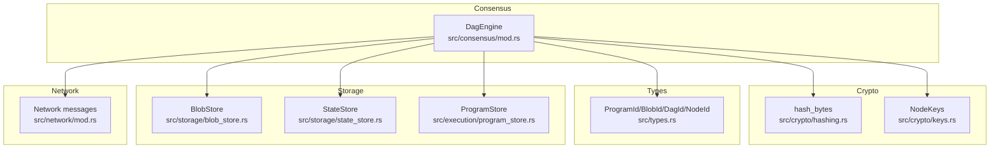
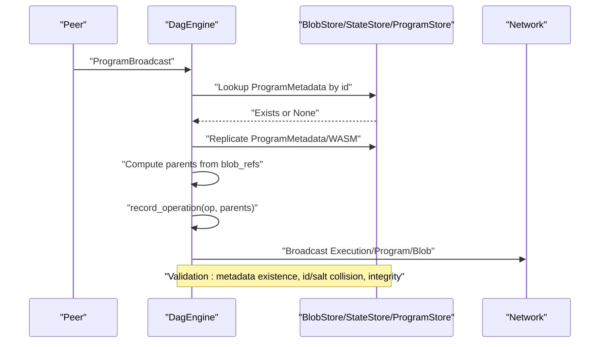
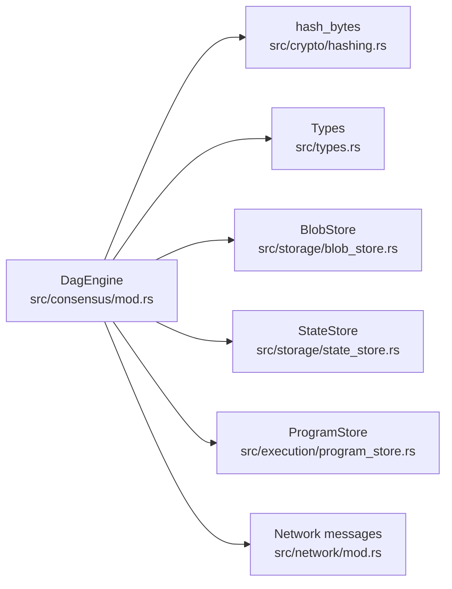

# Validation Rules

<cite>
**Referenced Files in This Document**
- [src/consensus/mod.rs](file://src/consensus/mod.rs)
- [src/crypto/hashing.rs](file://src/crypto/hashing.rs)
- [src/crypto/keys.rs](file://src/crypto/keys.rs)
- [src/types.rs](file://src/types.rs)
- [src/storage/blob_store.rs](file://src/storage/blob_store.rs)
- [src/storage/state_store.rs](file://src/storage/state_store.rs)
- [src/execution/program_store.rs](file://src/execution/program_store.rs)
- [src/network/mod.rs](file://src/network/mod.rs)
</cite>

## Table of Contents
1. [Introduction](#introduction)
2. [Project Structure](#project-structure)
3. [Core Components](#core-components)
4. [Architecture Overview](#architecture-overview)
5. [Detailed Component Analysis](#detailed-component-analysis)
6. [Dependency Analysis](#dependency-analysis)
7. [Performance Considerations](#performance-considerations)
8. [Troubleshooting Guide](#troubleshooting-guide)
9. [Conclusion](#conclusion)

## Introduction
This document explains the validation rules implemented in the DAG consensus system. It focuses on how operations are validated before acceptance into the DAG, including cryptographic verification of node identifiers, publisher identity checks, and structural integrity validations. It covers operation-specific checks for program deployments, blob publications, and execution records, and details how execution broadcasts are verified against computed DAG IDs and how output blobs are indexed. It also describes how storage components enforce existence checks and integrity constraints prior to accepting operations.

## Project Structure
The validation logic is primarily implemented in the consensus engine, with cryptographic primitives, typed identifiers, and storage backends providing the underlying guarantees.

**Diagram sources**
- [src/consensus/mod.rs](file://src/consensus/mod.rs#L1-L120)
- [src/crypto/hashing.rs](file://src/crypto/hashing.rs#L1-L8)
- [src/crypto/keys.rs](file://src/crypto/keys.rs#L1-L73)
- [src/types.rs](file://src/types.rs#L1-L109)
- [src/storage/blob_store.rs](file://src/storage/blob_store.rs#L1-L185)
- [src/storage/state_store.rs](file://src/storage/state_store.rs#L1-L80)
- [src/execution/program_store.rs](file://src/execution/program_store.rs#L1-L96)
- [src/network/mod.rs](file://src/network/mod.rs#L1-L9)

**Section sources**
- [src/consensus/mod.rs](file://src/consensus/mod.rs#L1-L120)
- [src/crypto/hashing.rs](file://src/crypto/hashing.rs#L1-L8)
- [src/crypto/keys.rs](file://src/crypto/keys.rs#L1-L73)
- [src/types.rs](file://src/types.rs#L1-L109)
- [src/storage/blob_store.rs](file://src/storage/blob_store.rs#L1-L185)
- [src/storage/state_store.rs](file://src/storage/state_store.rs#L1-L80)
- [src/execution/program_store.rs](file://src/execution/program_store.rs#L1-L96)
- [src/network/mod.rs](file://src/network/mod.rs#L1-L9)

## Core Components
- DagEngine: Central coordinator for inbound network events, validation, and DAG insertion. It computes node IDs, validates operations, applies state updates, and ensures storage preconditions are met.
- dag_id: Deterministic computation of a node’s identifier from its parents and serialized operation payload.
- NodeKeys: Provides NodeId derived from public key and signing/verification utilities.
- Storage backends: BlobStore and StateStore enforce integrity and existence checks before acceptance.

Key responsibilities:
- Cryptographic verification of DagId via dag_id.
- Publisher identity validation using NodeId.
- Structural integrity checks for operations (parent references, metadata presence).
- Execution broadcast verification against computed hash and output blob indexing.
- Storage preconditions for program and blob operations.

**Section sources**
- [src/consensus/mod.rs](file://src/consensus/mod.rs#L1-L120)
- [src/consensus/mod.rs](file://src/consensus/mod.rs#L1089-L1112)
- [src/crypto/keys.rs](file://src/crypto/keys.rs#L1-L73)
- [src/types.rs](file://src/types.rs#L1-L109)

## Architecture Overview
The consensus engine receives network messages and routes them to operation-specific handlers. Each handler performs validation, applies state changes, and inserts nodes into the DAG store. Storage backends enforce integrity constraints and existence checks.

**Diagram sources**
- [src/consensus/mod.rs](file://src/consensus/mod.rs#L307-L338)
- [src/consensus/mod.rs](file://src/consensus/mod.rs#L294-L305)
- [src/execution/program_store.rs](file://src/execution/program_store.rs#L43-L56)
- [src/storage/blob_store.rs](file://src/storage/blob_store.rs#L106-L114)

## Detailed Component Analysis

### Cryptographic Verification of DagId
The node identifier (DagId) is computed deterministically from the operation and its parents. The engine recomputes the ID and compares it to the provided one to prevent tampering.

- Computation: Parents’ IDs concatenated, then serialized operation appended, hashed to produce the node ID.
- Comparison: The recomputed ID must equal the provided ID in the broadcast.

Concrete example references:
- Execution broadcast validation compares recomputed ID with the provided DAG ID.
- The dag_id function concatenates parent IDs and serialized operation, then hashes to produce the node ID.

Operational impact:
- Ensures structural consistency and prevents forged node IDs.
- Detects mismatches early, avoiding invalid DAG entries.

**Section sources**
- [src/consensus/mod.rs](file://src/consensus/mod.rs#L445-L483)
- [src/consensus/mod.rs](file://src/consensus/mod.rs#L1089-L1112)

### Publisher Identity Validation Using NodeKeys
- Node identity: NodeId is derived from the public key and stored in NodeKeys.
- Publisher field: Each DAG node carries the publisher’s NodeId.
- Consistency: The engine sets the publisher field to the local identity when creating nodes.

Operational impact:
- Ensures provenance of operations.
- Enables attribution and potential future signature verification if added.

**Section sources**
- [src/crypto/keys.rs](file://src/crypto/keys.rs#L1-L73)
- [src/consensus/mod.rs](file://src/consensus/mod.rs#L294-L305)

### Structural Integrity Checks for Operations
- Parent references: For Compute operations, parents must include Program and input/output Blobs.
- Existence checks: Before accepting, the engine ensures referenced metadata exists in storage.
- Duplicate prevention: For Program deployments, ID-salt collision detection prevents conflicting program identities.

Concrete example references:
- Program deployment collision detection using deploy_salt.
- Compute parents include Program and two Blob references.

**Section sources**
- [src/consensus/mod.rs](file://src/consensus/mod.rs#L307-L338)
- [src/consensus/mod.rs](file://src/consensus/mod.rs#L445-L483)
- [src/types.rs](file://src/types.rs#L33-L53)

### Operation-Specific Validation Rules

#### Program Deployment Checks (ID-Salt Collisions)
- Precondition: Program metadata must not collide with an existing ID under a different salt.
- Enforcement: If metadata exists with the same ID but different deploy_salt, validation fails.
- Replication: On acceptance, metadata and WASM are replicated and indexed.

Concrete example references:
- Salt collision detection and error raised when deploy_salt differs for the same ProgramId.

**Section sources**
- [src/consensus/mod.rs](file://src/consensus/mod.rs#L307-L338)
- [src/execution/program_store.rs](file://src/execution/program_store.rs#L43-L56)

#### Blob Publication Validates Metadata Integrity
- Precondition: Blob metadata must be consistent with the provided data (chunk counts, chunk hashes, Merkle root).
- Enforcement: BlobStore replicate and get routines validate chunk sizes, chunk hashes, Merkle roots, and sizes.
- Indexing: The engine records blob index entries and advertises availability.

Concrete example references:
- BlobStore replicate/get validate chunk hashes and Merkle roots; metadata lookup returns presence or absence.

**Section sources**
- [src/storage/blob_store.rs](file://src/storage/blob_store.rs#L48-L76)
- [src/storage/blob_store.rs](file://src/storage/blob_store.rs#L78-L104)
- [src/storage/blob_store.rs](file://src/storage/blob_store.rs#L106-L114)
- [src/consensus/mod.rs](file://src/consensus/mod.rs#L380-L407)

#### Execution Records Validate State Writes and Output Consistency
- DAG ID verification: The engine recomputes the node ID and compares it to the provided one.
- State writes: Applies state_writes in order to StateStore scoped to the program namespace.
- Output blob presence: Ensures the output BlobMetadata exists; if absent, records it in the blob index without data.
- DAG insertion: Inserts the node into the DAG store and updates sync state.

Concrete example references:
- Execution ID mismatch check.
- State writes applied to StateStore.
- Output blob metadata existence check and index recording.

**Section sources**
- [src/consensus/mod.rs](file://src/consensus/mod.rs#L445-L483)
- [src/storage/state_store.rs](file://src/storage/state_store.rs#L17-L41)
- [src/storage/blob_store.rs](file://src/storage/blob_store.rs#L106-L114)

### Integration with Storage Components
- Blob metadata lookups: Used to validate existence before acceptance and to index output blobs when data is not present.
- Program metadata lookups: Used to detect collisions and to decide whether to replicate and index.
- State writes: Applied to StateStore with deterministic ordering to maintain consistency.

Concrete example references:
- Blob metadata existence checks in execution broadcast handler.
- Program metadata existence checks in program broadcast handler.

**Section sources**
- [src/consensus/mod.rs](file://src/consensus/mod.rs#L445-L483)
- [src/consensus/mod.rs](file://src/consensus/mod.rs#L307-L338)
- [src/storage/blob_store.rs](file://src/storage/blob_store.rs#L106-L114)
- [src/storage/state_store.rs](file://src/storage/state_store.rs#L17-L41)

### Common Issues and Solutions
- Invalid parent references:
  - Symptom: Execution rejected due to missing Program or Blob metadata.
  - Solution: Ensure referenced Program and Blob metadata are present locally or discoverable via inventory and provider hints.
- Execution DAG ID mismatch:
  - Symptom: Error indicating execution DAG ID mismatch.
  - Solution: Recompute the node ID using the same parents and operation serialization logic; verify the broadcast payload matches computed ID.
- Program ID-salt collision:
  - Symptom: Error indicating program ID collision with different salt.
  - Solution: Use a unique deploy_salt for the program; do not reuse an existing ProgramId with a different salt.
- Output blob missing:
  - Symptom: Output blob not present locally during execution acceptance.
  - Solution: Request the blob via inventory or transfer requests; the engine will index it without data until available.

**Section sources**
- [src/consensus/mod.rs](file://src/consensus/mod.rs#L445-L483)
- [src/consensus/mod.rs](file://src/consensus/mod.rs#L307-L338)
- [src/storage/blob_store.rs](file://src/storage/blob_store.rs#L106-L114)

### Extending Validation Rules for Custom Operation Types
To add a new operation type:
- Define the operation variant in the Operation enum and ensure it serializes deterministically.
- Add a handler in DagEngine to validate the operation, enforce storage preconditions, and compute parents.
- Integrate with dag_id so the node ID remains deterministic across parents and operation payload.
- Ensure the handler inserts nodes into the DAG store and updates sync state appropriately.

Guidance:
- Keep serialization deterministic (prefer stable ordering for maps and sets).
- Enforce existence checks for referenced metadata before acceptance.
- Apply state changes in a deterministic order if applicable.
- Broadcast the new operation type consistently with existing patterns.

**Section sources**
- [src/consensus/mod.rs](file://src/consensus/mod.rs#L1-L47)
- [src/consensus/mod.rs](file://src/consensus/mod.rs#L1089-L1112)

## Dependency Analysis
The consensus engine depends on cryptographic hashing, typed identifiers, and storage backends. The network module defines message types consumed by the engine.

**Diagram sources**
- [src/consensus/mod.rs](file://src/consensus/mod.rs#L1-L120)
- [src/crypto/hashing.rs](file://src/crypto/hashing.rs#L1-L8)
- [src/types.rs](file://src/types.rs#L1-L109)
- [src/storage/blob_store.rs](file://src/storage/blob_store.rs#L1-L185)
- [src/storage/state_store.rs](file://src/storage/state_store.rs#L1-L80)
- [src/execution/program_store.rs](file://src/execution/program_store.rs#L1-L96)
- [src/network/mod.rs](file://src/network/mod.rs#L1-L9)

**Section sources**
- [src/consensus/mod.rs](file://src/consensus/mod.rs#L1-L120)
- [src/crypto/hashing.rs](file://src/crypto/hashing.rs#L1-L8)
- [src/types.rs](file://src/types.rs#L1-L109)
- [src/storage/blob_store.rs](file://src/storage/blob_store.rs#L1-L185)
- [src/storage/state_store.rs](file://src/storage/state_store.rs#L1-L80)
- [src/execution/program_store.rs](file://src/execution/program_store.rs#L1-L96)
- [src/network/mod.rs](file://src/network/mod.rs#L1-L9)

## Performance Considerations
- Deterministic hashing: dag_id uses a deterministic serialization and hashing pipeline; keep operation payloads minimal and stable to reduce recomputation overhead.
- Storage I/O: BlobStore and StateStore operations involve disk reads/writes; batch operations where possible and avoid redundant lookups.
- Bloom filters: Inventory uses Bloom filters to reduce unnecessary transfers; tune parameters for expected scale.
- Concurrency: Use read/write locks judiciously to avoid contention on shared indices and stores.

[No sources needed since this section provides general guidance]

## Troubleshooting Guide
- Execution broadcast rejected:
  - Verify the provided DAG ID matches the recomputed ID.
  - Confirm the DAG node does not already exist.
  - Ensure state_writes are ordered and valid.
  - Ensure output blob metadata exists or is indexed.
- Program broadcast rejected:
  - Check for ID-salt collisions with existing metadata.
  - Ensure ProgramMetadata and WASM are consistent with replication rules.
- Blob broadcast rejected:
  - Validate chunk counts, chunk hashes, and Merkle roots.
  - Confirm metadata lookup succeeds and data integrity holds.

Concrete example references:
- Execution ID mismatch check.
- Program salt collision detection.
- Blob integrity checks in replicate and get.

**Section sources**
- [src/consensus/mod.rs](file://src/consensus/mod.rs#L445-L483)
- [src/consensus/mod.rs](file://src/consensus/mod.rs#L307-L338)
- [src/storage/blob_store.rs](file://src/storage/blob_store.rs#L48-L76)
- [src/storage/blob_store.rs](file://src/storage/blob_store.rs#L78-L104)

## Conclusion
The DAG consensus system enforces robust validation through cryptographic DAG ID computation, publisher identity tracking, and strict structural and integrity checks. Program deployments prevent ID-salt collisions, blob publications validate metadata integrity, and execution records ensure state writes and output consistency. Storage backends provide the necessary preconditions and integrity guarantees. By following the documented patterns and troubleshooting steps, operators can maintain a secure and consistent DAG.