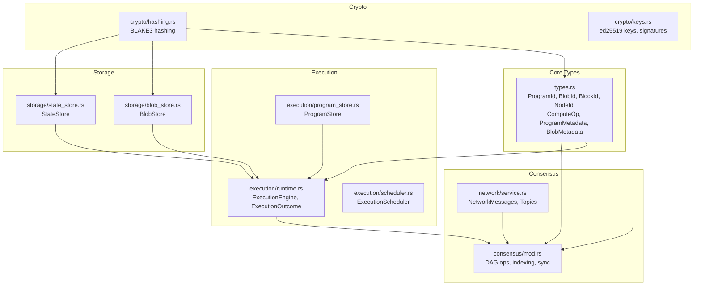
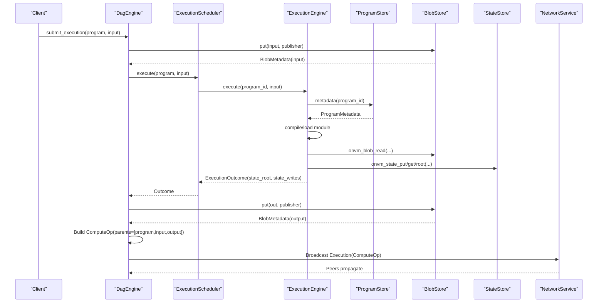
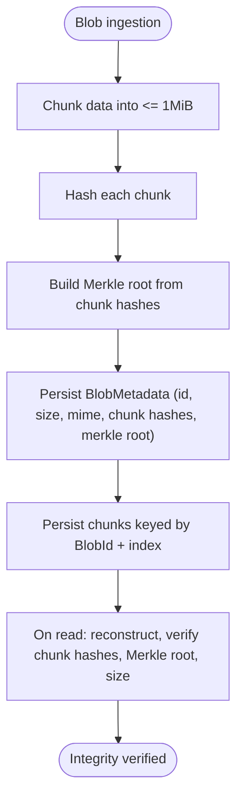
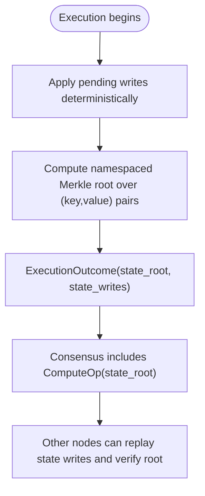
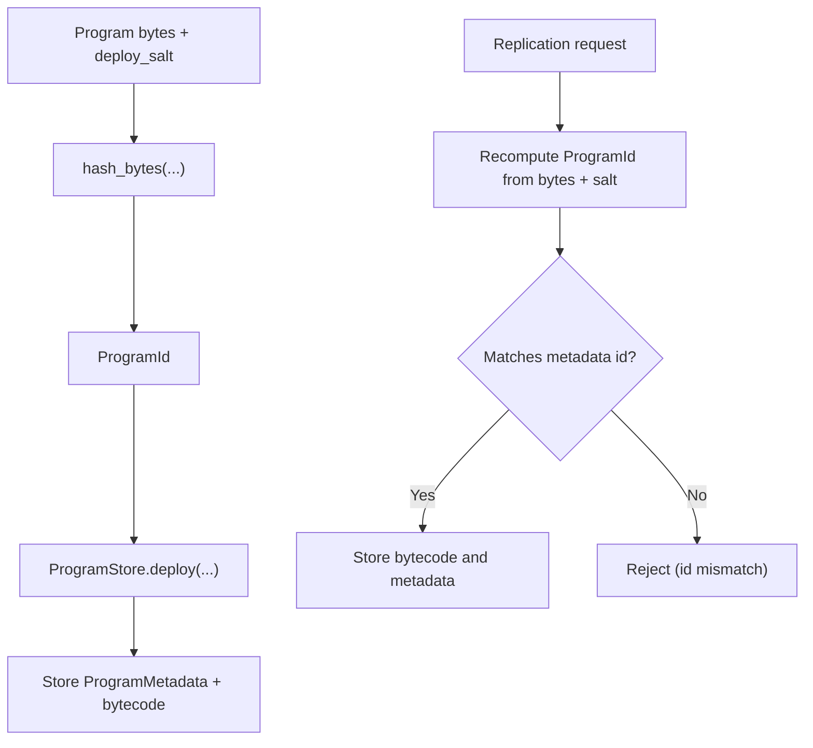
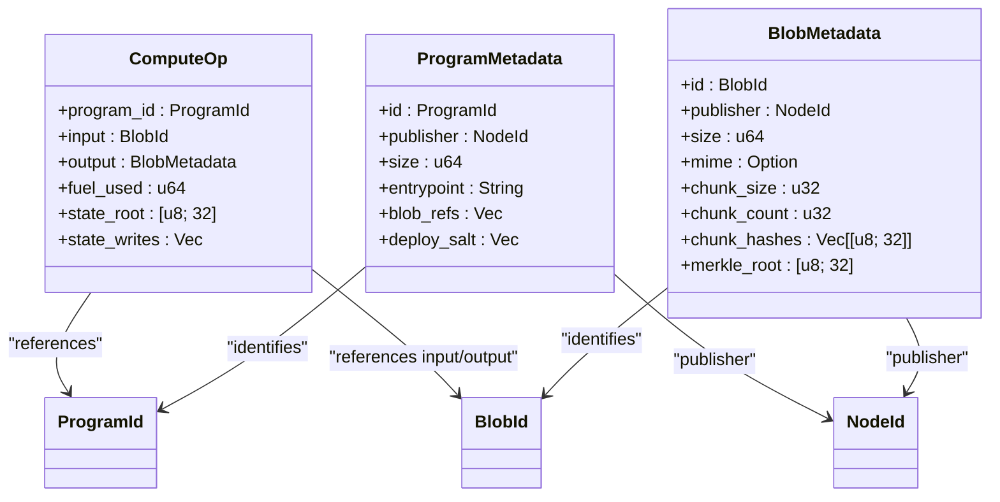
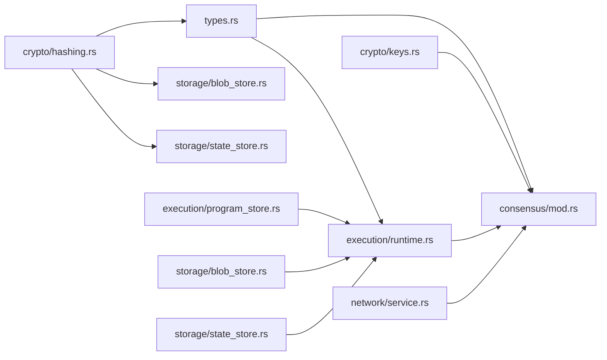

# Core Concepts

<cite>
**Referenced Files in This Document**
- [types.rs](file://src/types.rs)
- [hashing.rs](file://src/crypto/hashing.rs)
- [keys.rs](file://src/crypto/keys.rs)
- [runtime.rs](file://src/execution/runtime.rs)
- [scheduler.rs](file://src/execution/scheduler.rs)
- [program_store.rs](file://src/execution/program_store.rs)
- [blob_store.rs](file://src/storage/blob_store.rs)
- [state_store.rs](file://src/storage/state_store.rs)
- [mod.rs](file://src/consensus/mod.rs)
- [service.rs](file://src/network/service.rs)
- [lib.rs](file://src/lib.rs)
- [analytics/lib.rs](file://wasm_programs/analytics/src/lib.rs)
- [echo/lib.rs](file://wasm_programs/echo/src/lib.rs)
- [kvstore/lib.rs](file://wasm_programs/kvstore/src/lib.rs)
</cite>

## Table of Contents
1. [Introduction](#introduction)
2. [Project Structure](#project-structure)
3. [Core Components](#core-components)
4. [Architecture Overview](#architecture-overview)
5. [Detailed Component Analysis](#detailed-component-analysis)
6. [Dependency Analysis](#dependency-analysis)
7. [Performance Considerations](#performance-considerations)
8. [Troubleshooting Guide](#troubleshooting-guide)
9. [Conclusion](#conclusion)

## Introduction
This document explains the fundamental abstractions that underpin ONVM’s distributed execution model. It defines the core identifiers and data structures used across execution, storage, and consensus, and shows how they relate to each other. It also covers cryptographic primitives, content-addressable storage semantics, state versioning via Merkle roots, and practical examples of program identity and integrity verification.

## Project Structure
ONVM organizes its core types and subsystems into focused modules:
- types.rs defines the foundational identifiers and metadata structures
- crypto/ provides hashing and key management
- execution/ manages program loading, sandboxed execution, and scheduling
- storage/ provides blob and state stores with content-addressable semantics
- consensus/ builds a DAG of operations and coordinates synchronization
- network/ defines messaging and transport for discovery and replication
- wasm_programs/ contains example WebAssembly programs demonstrating usage of the runtime APIs

**Diagram sources**
- [types.rs](file://src/types.rs#L1-L109)
- [hashing.rs](file://src/crypto/hashing.rs#L1-L8)
- [keys.rs](file://src/crypto/keys.rs#L1-L73)
- [runtime.rs](file://src/execution/runtime.rs#L1-L197)
- [scheduler.rs](file://src/execution/scheduler.rs#L1-L41)
- [program_store.rs](file://src/execution/program_store.rs#L1-L96)
- [blob_store.rs](file://src/storage/blob_store.rs#L1-L185)
- [state_store.rs](file://src/storage/state_store.rs#L1-L80)
- [mod.rs](file://src/consensus/mod.rs#L1-L120)
- [service.rs](file://src/network/service.rs#L1-L120)

**Section sources**
- [lib.rs](file://src/lib.rs#L1-L12)

## Core Components
This section defines the primary abstractions and their roles.

- ProgramId: 32-byte identifier for a WebAssembly program derived from its bytes plus a deploy salt. It uniquely identifies a program across the network and is used to locate program bytes and metadata.
- BlobId: 32-byte identifier for immutable data chunks. It is content-addressed by hashing the raw bytes and is used to reference inputs and outputs in execution.
- BlockId: 32-byte identifier for blocks in the DAG consensus layer. It is derived from the operation and parent references.
- NodeId: 32-byte identity for nodes, typically derived from a node’s public key material.
- ComputeOp: Atomic operation representing a program execution. It includes the program identifier, input and output BlobIds, fuel used, state root, and ordered state writes.
- ProgramMetadata: Discovery and validation metadata for a program, including its ProgramId, publisher, size, entrypoint, blob references, and deploy salt.
- BlobMetadata: Discovery and validation metadata for a blob, including its BlobId, publisher, size, MIME type, chunking details, per-chunk hashes, and Merkle root.

These types are defined in the core types module and are used pervasively across execution, storage, and consensus.

**Section sources**
- [types.rs](file://src/types.rs#L1-L109)

## Architecture Overview
The system composes content-addressable storage, sandboxed execution, and a DAG consensus layer:
- Content-addressable storage ensures integrity and deduplication for programs and blobs.
- Execution runs WebAssembly programs in a sandbox and produces deterministic state roots.
- Consensus builds a DAG of operations (publish blob, deploy program, compute) and synchronizes across peers.

**Diagram sources**
- [mod.rs](file://src/consensus/mod.rs#L194-L258)
- [scheduler.rs](file://src/execution/scheduler.rs#L27-L35)
- [runtime.rs](file://src/execution/runtime.rs#L79-L183)
- [program_store.rs](file://src/execution/program_store.rs#L66-L82)
- [blob_store.rs](file://src/storage/blob_store.rs#L18-L46)
- [state_store.rs](file://src/storage/state_store.rs#L17-L40)
- [service.rs](file://src/network/service.rs#L26-L40)

## Detailed Component Analysis

### Type Definitions and Semantics
- ProgramId, BlobId, BlockId, NodeId: Strongly typed 32-byte identifiers with display formatting and hashing helpers. They are used as keys for content-addressable stores and DAG references.
- ComputeOp: Captures a single execution run, including fuel usage, state root, and ordered state writes. It anchors the DAG node and enables replay and verification.
- ProgramMetadata: Describes a program’s identity, entrypoint, and dependencies. The ProgramId is derived from the program bytes plus a deploy salt, ensuring deterministic identity.
- BlobMetadata: Describes a blob’s structure and integrity. It includes chunking, per-chunk hashes, and a Merkle root for integrity verification.

These definitions appear in the types module and are used across execution and storage.

**Section sources**
- [types.rs](file://src/types.rs#L1-L109)

### Cryptographic Foundations
- ed25519 keys: Node identities are derived from ed25519 keypairs. Keys support signing and verification, and NodeId construction uses public key material. Identity persistence and loading are supported with secret key serialization.
- BLAKE3 hashing: Used for content-addressing and Merkle tree construction. It appears in hashing utilities and is used to derive ProgramId, BlobId, and state roots.
- Signature schemes: The NodeKeys API exposes signing and verification operations suitable for authenticating operations and identities.

**Section sources**
- [keys.rs](file://src/crypto/keys.rs#L1-L73)
- [hashing.rs](file://src/crypto/hashing.rs#L1-L8)

### Content-Addressable Storage and Integrity
- Program storage: Programs are stored by ProgramId with separate metadata and bytecode trees. Replication validates that the program bytes match the declared ProgramId using the deploy salt.
- Blob storage: Blobs are split into fixed-size chunks, each hashed, and a Merkle tree is built from leaf hashes. Integrity is verified on read by recomputing chunk hashes, Merkle root, and size checks.
- State storage: State is stored under a namespaced key and a Merkle root is computed over sorted (key, value) pairs. Pending writes are folded into a temporary root during execution to reflect in-memory changes.

**Diagram sources**
- [blob_store.rs](file://src/storage/blob_store.rs#L18-L143)
- [state_store.rs](file://src/storage/state_store.rs#L29-L80)

**Section sources**
- [program_store.rs](file://src/execution/program_store.rs#L16-L56)
- [blob_store.rs](file://src/storage/blob_store.rs#L18-L143)
- [state_store.rs](file://src/storage/state_store.rs#L17-L80)

### State Versioning and Deterministic Roots
- During execution, pending state writes are accumulated and deterministically ordered by key. After execution, the state store computes a namespaced Merkle root over all writes. This root is included in ComputeOp and can be used to verify state transitions.
- The runtime also exposes an on-chain-like state root computation that folds pending writes into the current root for deterministic verification.

**Diagram sources**
- [runtime.rs](file://src/execution/runtime.rs#L156-L183)
- [state_store.rs](file://src/storage/state_store.rs#L29-L80)

**Section sources**
- [runtime.rs](file://src/execution/runtime.rs#L156-L183)
- [state_store.rs](file://src/storage/state_store.rs#L29-L80)

### Program Identity and Integrity
- Program identity: ProgramId is derived from the program bytes plus a deploy salt. This ensures that identical code with different salts yields distinct identities, preventing collisions while enabling reproducible deployments.
- Integrity: Program replication validates that the provided bytes match the declared ProgramId given the deploy salt. This guarantees that published programs cannot be substituted without detection.

**Diagram sources**
- [types.rs](file://src/types.rs#L55-L66)
- [program_store.rs](file://src/execution/program_store.rs#L16-L56)

**Section sources**
- [types.rs](file://src/types.rs#L55-L66)
- [program_store.rs](file://src/execution/program_store.rs#L16-L56)

### Example WASM Programs and Runtime Usage
- Analytics program: Demonstrates JSON parsing, tokenization, and BLAKE3 hashing. It uses the runtime’s host functions for reading inputs and writing outputs.
- Echo program: Minimal example showing the onvm_main entrypoint and output buffer reuse.
- KV store program: Uses onvm_state_put/get/root to manage key-value state, demonstrating deterministic state updates and Merkle root computation.

These programs illustrate how ComputeOp state_writes and state_root integrate with the runtime’s state management.

**Section sources**
- [analytics/lib.rs](file://wasm_programs/analytics/src/lib.rs#L39-L57)
- [echo/lib.rs](file://wasm_programs/echo/src/lib.rs#L23-L43)
- [kvstore/lib.rs](file://wasm_programs/kvstore/src/lib.rs#L148-L162)
- [kvstore/lib.rs](file://wasm_programs/kvstore/src/lib.rs#L164-L187)
- [kvstore/lib.rs](file://wasm_programs/kvstore/src/lib.rs#L225-L240)

### DAG Consensus and Relationships
- Operations: The DAG aggregates PublishBlob, DeployProgram, and Compute operations. Each DAG node references its parents by ProgramId, BlobId, or another DAG id.
- Sync: The consensus engine maintains indices for programs and blobs, broadcasts inventory, and requests missing items. Execution outcomes are applied to state and recorded as DAG nodes.
- Networking: Messages carry ProgramMetadata, BlobMetadata, and ComputeOp, enabling discovery and replication across peers.

**Diagram sources**
- [types.rs](file://src/types.rs#L17-L53)
- [mod.rs](file://src/consensus/mod.rs#L22-L47)

**Section sources**
- [mod.rs](file://src/consensus/mod.rs#L22-L47)
- [service.rs](file://src/network/service.rs#L26-L40)

## Dependency Analysis
- Execution depends on ProgramStore, BlobStore, and StateStore. It constructs ExecutionOutcome with state_root and state_writes.
- Consensus depends on execution outcomes, blob and program stores, and network messages to build DAG nodes and synchronize state.
- Storage relies on BLAKE3 hashing for integrity and on sled for persistence.
- Crypto underpins identity and signing, used by consensus and network layers.

**Diagram sources**
- [types.rs](file://src/types.rs#L1-L109)
- [runtime.rs](file://src/execution/runtime.rs#L1-L197)
- [program_store.rs](file://src/execution/program_store.rs#L1-L96)
- [blob_store.rs](file://src/storage/blob_store.rs#L1-L185)
- [state_store.rs](file://src/storage/state_store.rs#L1-L80)
- [mod.rs](file://src/consensus/mod.rs#L1-L120)
- [service.rs](file://src/network/service.rs#L1-L120)
- [hashing.rs](file://src/crypto/hashing.rs#L1-L8)
- [keys.rs](file://src/crypto/keys.rs#L1-L73)

**Section sources**
- [lib.rs](file://src/lib.rs#L1-L12)

## Performance Considerations
- Content-addressing reduces bandwidth and storage by deduplicating identical blobs and programs.
- Chunking and Merkle roots enable efficient partial verification and selective fetching.
- Execution uses a module cache keyed by ProgramId to avoid repeated compilation.
- State root computation sorts writes deterministically; keep state writes minimal to reduce hashing overhead.
- Parallel execution via the scheduler maximizes throughput while bounding fuel consumption.

[No sources needed since this section provides general guidance]

## Troubleshooting Guide
- Program id mismatch: Occurs when deploy salt differs or bytes do not match metadata id. Ensure the deploy salt is consistent across replicas.
- Blob integrity failure: Indicates chunk hash mismatch, Merkle root mismatch, or size mismatch on read. Verify chunking parameters and data completeness.
- Missing program metadata: Execution cannot start without ProgramMetadata. Ensure the program is replicated and indexed.
- State root mismatch: Indicates divergent state writes or pending writes not applied deterministically. Confirm deterministic ordering and absence of conflicting writes.

**Section sources**
- [program_store.rs](file://src/execution/program_store.rs#L43-L56)
- [blob_store.rs](file://src/storage/blob_store.rs#L38-L104)
- [runtime.rs](file://src/execution/runtime.rs#L156-L183)

## Conclusion
ONVM’s core abstractions—ProgramId, BlobId, ComputeOp, ProgramMetadata, and BlobMetadata—form a cohesive foundation for content-addressable, verifiable execution. Cryptographic primitives (ed25519 keys and BLAKE3 hashing) ensure authenticity and integrity. The DAG consensus layer coordinates discovery, replication, and state updates, while the runtime enforces deterministic execution and state versioning. Together, these components enable a secure, scalable, and interoperable distributed execution platform.