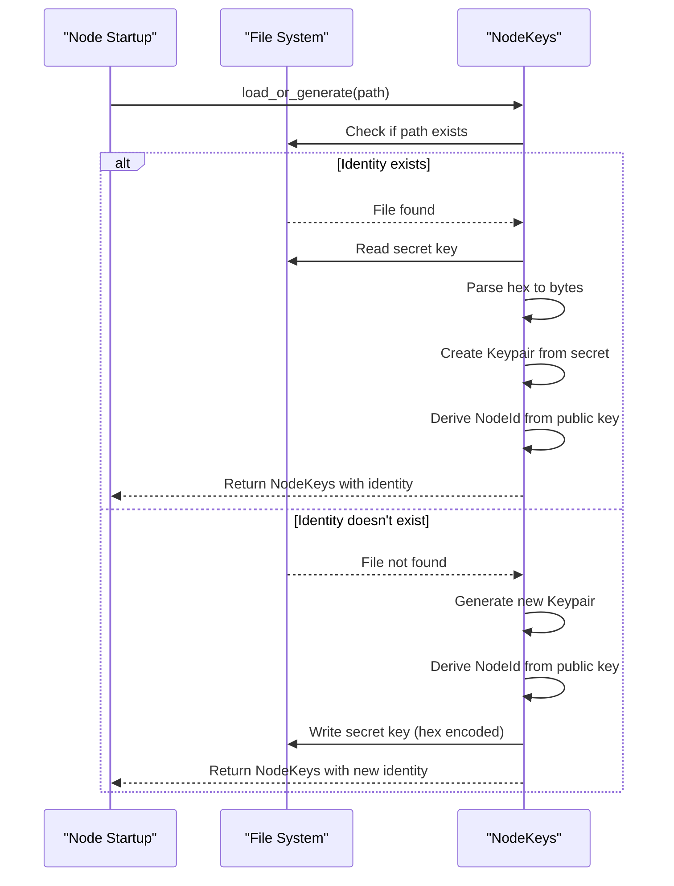
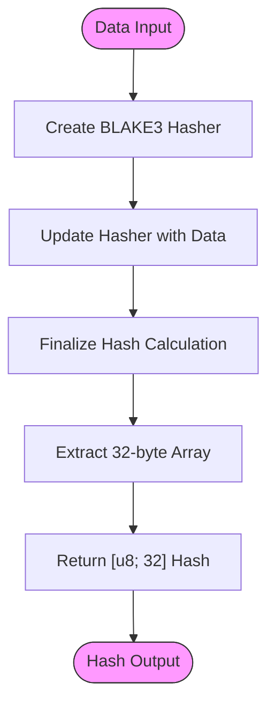
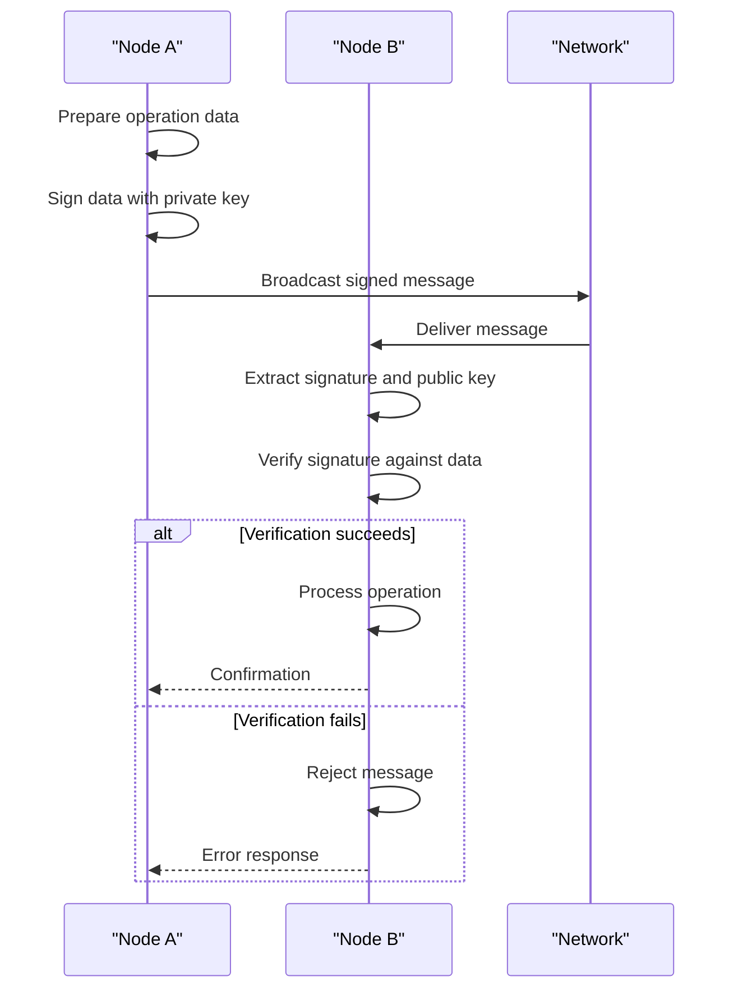
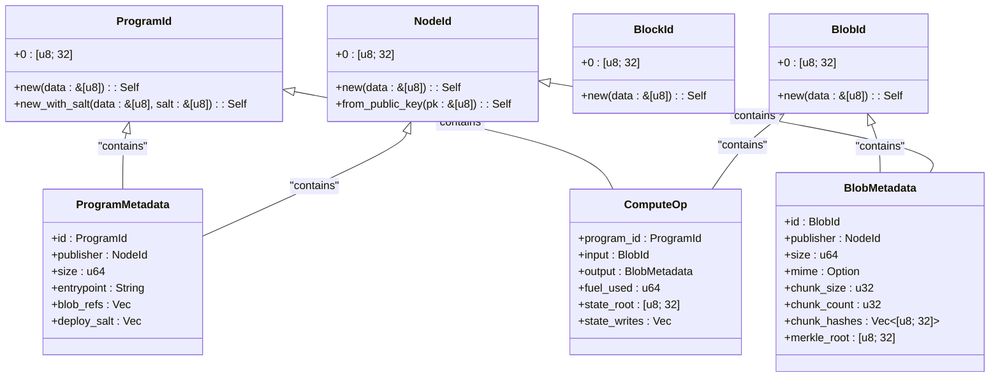

# Cryptographic Foundations

<cite>
**Referenced Files in This Document**   
- [keys.rs](file://src/crypto/keys.rs)
- [hashing.rs](file://src/crypto/hashing.rs)
- [types.rs](file://src/types.rs)
- [node.rs](file://src/node.rs)
- [service.rs](file://src/network/service.rs)
- [mod.rs](file://src/consensus/mod.rs)
</cite>

## Table of Contents
1. [Cryptographic Infrastructure Overview](#cryptographic-infrastructure-overview)
2. [Digital Signatures with ed25519_dalek](#digital-signatures-with-ed25519_dalek)
3. [Node Identity Management](#node-identity-management)
4. [Content Addressing with BLAKE3](#content-addressing-with-blake3)
5. [Signature Verification in Consensus and Networking](#signature-verification-in-consensus-and-networking)
6. [Integration with Type System](#integration-with-type-system)
7. [Security Implications](#security-implications)

## Cryptographic Infrastructure Overview

The ONVM system implements a robust cryptographic infrastructure to ensure secure node authentication, message integrity, and content addressing across its distributed architecture. The system leverages modern cryptographic primitives through the ed25519_dalek library for digital signatures and BLAKE3 for hashing operations. These cryptographic components are tightly integrated with the system's type system to provide end-to-end security guarantees against spoofing and tampering attacks in the distributed environment.

**Section sources**
- [keys.rs](file://src/crypto/keys.rs#L1-L72)
- [hashing.rs](file://src/crypto/hashing.rs#L1-L8)
- [types.rs](file://src/types.rs#L1-L109)

## Digital Signatures with ed25519_dalek

The ONVM system utilizes the ed25519_dalek library to implement Ed25519 digital signatures for node authentication and operation signing. The NodeKeys structure encapsulates a cryptographic keypair that serves as a node's identity within the network. Each node generates and maintains a public/private keypair where the private key is securely stored and the public key is used to derive the node's unique identifier.

The implementation provides standard cryptographic operations including signing and signature verification. The sign method allows nodes to cryptographically sign data using their private key, while the verify method enables validation of signatures using the corresponding public key. This asymmetric cryptography approach ensures that only the holder of the private key can generate valid signatures, while any network participant can verify the authenticity of signed messages.

```mermaid
classDiagram
class NodeKeys {
+keypair : Keypair
+node_id : NodeId
-path : PathBuf
+sign(data : &[u8]) : Signature
+verify(data : &[u8], signature : &Signature, public : &PublicKey) : Result<()>
+load_or_generate(path : impl AsRef<Path>) : Result<Self>
}
class Keypair {
+secret : SecretKey
+public : PublicKey
}
class Signature {
+bytes : [u8; 64]
}
class PublicKey {
+bytes : [u8; 32]
}
NodeKeys --> Keypair : "contains"
NodeKeys --> NodeId : "derives"
```

**Diagram sources**
- [keys.rs](file://src/crypto/keys.rs#L8-L72)

**Section sources**
- [keys.rs](file://src/crypto/keys.rs#L3-L72)

## Node Identity Management

Node identity in ONVM is managed through the NodeKeys::load_or_generate mechanism, which provides persistent identity management across node restarts. When a node starts, it attempts to load an existing identity from a specified file path. If the identity file exists, the system reads the private key from the file, reconstructs the keypair, and derives the corresponding node ID from the public key. If no identity file exists, the system generates a new cryptographic keypair using a cryptographically secure random number generator (OsRng).

The NodeId is derived directly from the public key bytes through the NodeId::from_public_key method. This deterministic derivation ensures that the same public key always produces the same node identifier, creating a strong binding between cryptographic identity and node addressing. The private key is stored in hexadecimal format, providing a simple yet secure persistence mechanism that protects against accidental exposure while enabling reliable identity recovery.



**Diagram sources**
- [keys.rs](file://src/crypto/keys.rs#L31-L62)

**Section sources**
- [keys.rs](file://src/crypto/keys.rs#L31-L62)
- [types.rs](file://src/types.rs#L88-L92)

## Content Addressing with BLAKE3

The ONVM system employs BLAKE3 hashing as the foundation for content addressing across programs, blobs, and blocks. The hash_bytes function provides a standardized interface for generating 256-bit hash values from arbitrary data inputs. This cryptographic hash function is used extensively throughout the system to create unique, deterministic identifiers for various content types.

The implementation creates a Hasher instance, updates it with the input data, and produces a fixed-size [u8; 32] output array. This hash serves as the basis for several identifier types in the system, including ProgramId, BlobId, BlockId, and NodeId. By using cryptographic hashing for content addressing, the system ensures data integrity and enables efficient content verification, as any modification to the underlying data would result in a completely different hash value.



**Diagram sources**
- [hashing.rs](file://src/crypto/hashing.rs#L3-L6)
- [types.rs](file://src/types.rs#L56-L65)

**Section sources**
- [hashing.rs](file://src/crypto/hashing.rs#L3-L6)
- [types.rs](file://src/types.rs#L55-L66)

## Signature Verification in Consensus and Networking

Signature verification plays a critical role in ONVM's consensus and networking layers, ensuring message authenticity and preventing spoofing attacks. The system verifies signatures on various operations, including program deployments, blob publications, and execution broadcasts. When a node receives a message from the network, it validates the signature using the sender's public key to confirm that the message originated from the claimed sender and has not been tampered with during transmission.

In the consensus layer, the publisher field of DAG nodes contains the NodeId of the node that created the operation, providing a direct link between cryptographic identity and consensus participation. The network layer also leverages signatures through libp2p's gossipsub protocol, which uses message signing to authenticate the source of published messages. This multi-layered approach to signature verification creates a comprehensive security model that protects against various attack vectors in the distributed system.



**Diagram sources**
- [keys.rs](file://src/crypto/keys.rs#L68-L71)
- [mod.rs](file://src/consensus/mod.rs#L294-L304)
- [service.rs](file://src/network/service.rs#L231-L234)

**Section sources**
- [keys.rs](file://src/crypto/keys.rs#L68-L71)
- [mod.rs](file://src/consensus/mod.rs#L294-L304)
- [service.rs](file://src/network/service.rs#L231-L234)

## Integration with Type System

The cryptographic primitives in ONVM are deeply integrated with the system's type system, creating a cohesive security model that spans identity, content addressing, and operation verification. The types.rs file defines several identifier types—ProgramId, BlobId, BlockId, and NodeId—that all wrap a [u8; 32] array and implement consistent interfaces for creation and display. Each of these types uses the BLAKE3 hash function as the basis for identifier generation, ensuring uniformity in content addressing across the system.

The NodeId type serves as a bridge between cryptographic identity and system addressing, being derived from either arbitrary data or directly from a public key. The display_hex macro provides a consistent hexadecimal representation for all identifier types, facilitating debugging and logging while maintaining the underlying cryptographic properties. This tight integration between cryptography and typing ensures that security properties are preserved throughout the system's data flow.



**Diagram sources**
- [types.rs](file://src/types.rs#L5-L54)

**Section sources**
- [types.rs](file://src/types.rs#L5-L109)

## Security Implications

The cryptographic design of ONVM provides strong security guarantees against common threats in distributed systems. By using Ed25519 digital signatures, the system ensures authentication, integrity, and non-repudiation of messages across the network. The deterministic derivation of NodeId from public keys creates a verifiable binding between cryptographic identity and node addressing, preventing identity spoofing attacks.

The use of BLAKE3 for content addressing ensures data integrity and enables efficient content verification throughout the system. Combined with the persistent identity management through the load_or_generate mechanism, this cryptographic infrastructure creates a robust foundation for secure distributed computation. The integration of these primitives with the type system ensures that security properties are maintained consistently across all layers of the system, from low-level networking to high-level consensus operations.

**Section sources**
- [keys.rs](file://src/crypto/keys.rs#L1-L72)
- [hashing.rs](file://src/crypto/hashing.rs#L1-L8)
- [types.rs](file://src/types.rs#L1-L109)
- [node.rs](file://src/node.rs#L1-L163)
- [service.rs](file://src/network/service.rs#L1-L458)
- [mod.rs](file://src/consensus/mod.rs#L1-L1112)