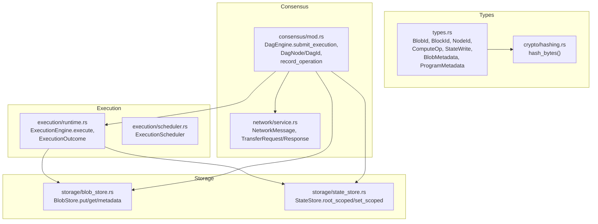
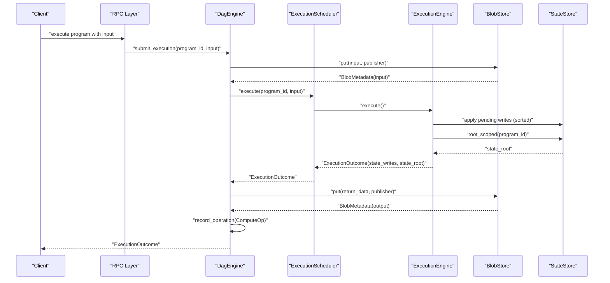
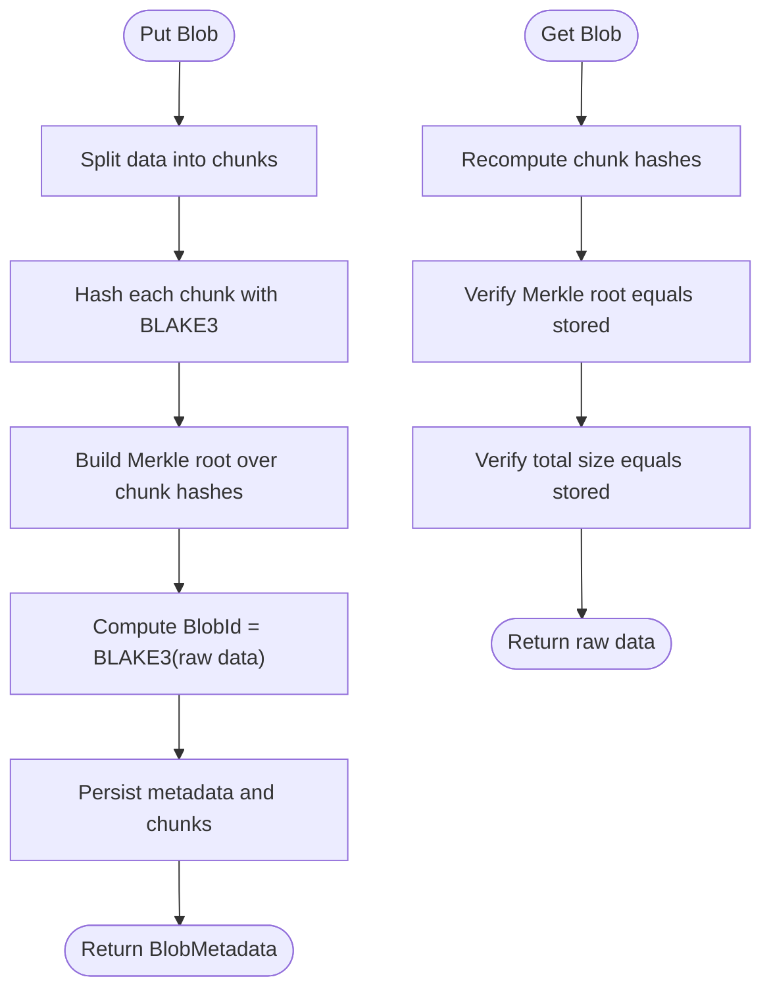
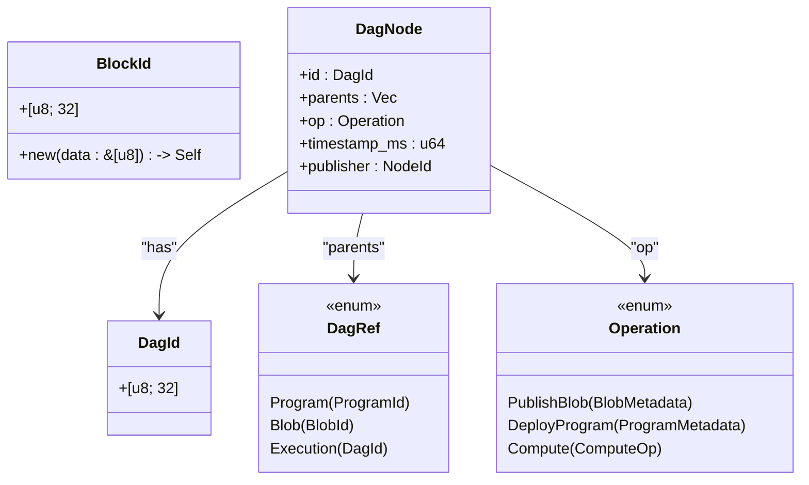
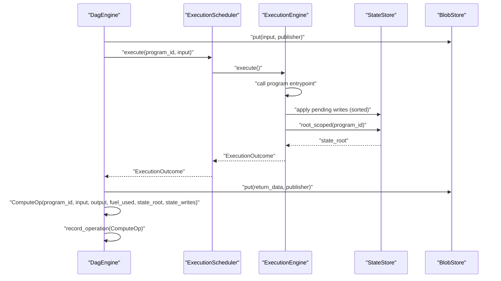
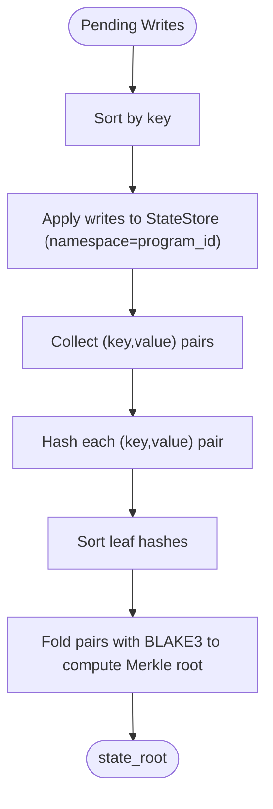
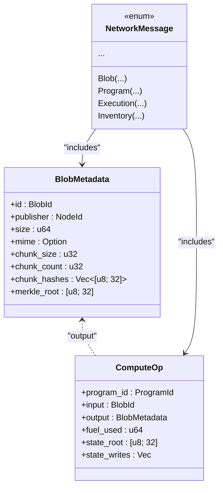
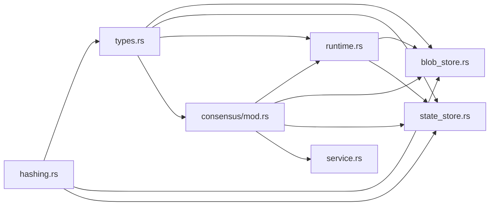

# Data Models: Blobs, Blocks, and State

<cite>
**Referenced Files in This Document**
- [types.rs](file://src/types.rs)
- [hashing.rs](file://src/crypto/hashing.rs)
- [blob_store.rs](file://src/storage/blob_store.rs)
- [state_store.rs](file://src/storage/state_store.rs)
- [runtime.rs](file://src/execution/runtime.rs)
- [scheduler.rs](file://src/execution/scheduler.rs)
- [consensus/mod.rs](file://src/consensus/mod.rs)
- [service.rs](file://src/network/service.rs)
</cite>

## Table of Contents
1. [Introduction](#introduction)
2. [Project Structure](#project-structure)
3. [Core Components](#core-components)
4. [Architecture Overview](#architecture-overview)
5. [Detailed Component Analysis](#detailed-component-analysis)
6. [Dependency Analysis](#dependency-analysis)
7. [Performance Considerations](#performance-considerations)
8. [Troubleshooting Guide](#troubleshooting-guide)
9. [Conclusion](#conclusion)

## Introduction
This document defines the foundational data models and state management primitives used across the system:
- BlobId: a 32-byte immutable identifier for data chunks, created by hashing raw bytes with BLAKE3.
- BlockId: a 32-byte identifier for DAG nodes in consensus, derived from block content hashing.
- BlobMetadata: describes a blob’s structure, publisher, and integrity roots (chunk hashes and Merkle root).
- ComputeOp: the atomic execution unit carrying program_id, input/output references, fuel usage, and state mutations.
- StateWrite and state_root: mechanisms for tracking and committing state updates deterministically.

It explains how these types are serialized and used in storage and consensus, and illustrates the end-to-end data flow from blob upload to state update, emphasizing cryptographic integrity guarantees.

## Project Structure
The relevant data model definitions live in the types module and are used by storage, execution, and consensus layers. Serialization is handled via Serde, and cryptographic hashing is performed with BLAKE3.

**Diagram sources**
- [types.rs](file://src/types.rs#L1-L109)
- [hashing.rs](file://src/crypto/hashing.rs#L1-L8)
- [blob_store.rs](file://src/storage/blob_store.rs#L1-L185)
- [state_store.rs](file://src/storage/state_store.rs#L1-L80)
- [runtime.rs](file://src/execution/runtime.rs#L1-L183)
- [scheduler.rs](file://src/execution/scheduler.rs#L1-L41)
- [consensus/mod.rs](file://src/consensus/mod.rs#L1-L111)
- [service.rs](file://src/network/service.rs#L1-L120)

**Section sources**
- [types.rs](file://src/types.rs#L1-L109)
- [hashing.rs](file://src/crypto/hashing.rs#L1-L8)
- [blob_store.rs](file://src/storage/blob_store.rs#L1-L185)
- [state_store.rs](file://src/storage/state_store.rs#L1-L80)
- [runtime.rs](file://src/execution/runtime.rs#L1-L183)
- [scheduler.rs](file://src/execution/scheduler.rs#L1-L41)
- [consensus/mod.rs](file://src/consensus/mod.rs#L1-L111)
- [service.rs](file://src/network/service.rs#L1-L120)

## Core Components
- BlobId: 32-byte BLAKE3 hash of raw data; created by hashing input bytes.
- BlockId: 32-byte BLAKE3 hash of block content; used as DAG node identifier in consensus.
- BlobMetadata: includes id, publisher, size, MIME, chunk_size, chunk_count, chunk_hashes, and merkle_root.
- ComputeOp: carries program_id, input BlobId, output BlobMetadata, fuel_used, state_root, and state_writes.
- StateWrite: a key-value pair representing a single state mutation.
- StateRoot: Merkle root of program-scoped state entries, computed deterministically.

These types are defined with Serde derive macros for serialization and are used across storage, execution, and consensus.

**Section sources**
- [types.rs](file://src/types.rs#L1-L109)
- [hashing.rs](file://src/crypto/hashing.rs#L1-L8)

## Architecture Overview
The system builds integrity guarantees around BLAKE3 hashes and Merkle trees:
- Blob integrity: raw data is split into chunks, each hashed, and a Merkle root is computed. BlobStore validates reads against chunk hashes and Merkle root.
- State integrity: StateStore computes a deterministic Merkle root over program-scoped key-value pairs.
- Consensus integrity: ComputeOps are embedded in DAG nodes whose identifiers are derived from parent references and operation content.

**Diagram sources**
- [consensus/mod.rs](file://src/consensus/mod.rs#L194-L258)
- [runtime.rs](file://src/execution/runtime.rs#L79-L183)
- [state_store.rs](file://src/storage/state_store.rs#L29-L41)
- [blob_store.rs](file://src/storage/blob_store.rs#L18-L46)

## Detailed Component Analysis

### BlobId and BlobMetadata
- BlobId is constructed by hashing raw bytes with BLAKE3.
- BlobMetadata captures publisher, size, MIME, chunking parameters, per-chunk hashes, and the Merkle root over chunk hashes.
- BlobStore.put computes chunk hashes and Merkle root, persists metadata and chunks, and returns BlobMetadata.
- BlobStore.get validates chunk hashes and Merkle root on read, ensuring referential integrity.

**Diagram sources**
- [blob_store.rs](file://src/storage/blob_store.rs#L18-L46)
- [blob_store.rs](file://src/storage/blob_store.rs#L78-L104)
- [blob_store.rs](file://src/storage/blob_store.rs#L163-L185)
- [types.rs](file://src/types.rs#L44-L53)

**Section sources**
- [types.rs](file://src/types.rs#L8-L12)
- [types.rs](file://src/types.rs#L44-L53)
- [hashing.rs](file://src/crypto/hashing.rs#L1-L8)
- [blob_store.rs](file://src/storage/blob_store.rs#L18-L46)
- [blob_store.rs](file://src/storage/blob_store.rs#L78-L104)
- [blob_store.rs](file://src/storage/blob_store.rs#L163-L185)

### BlockId and DAG Node Identifier
- BlockId is defined as a 32-byte BLAKE3 hash of block content.
- In consensus, DAG node identifiers (DagId) are derived from parent references and serialized operation content, ensuring deterministic, cryptographically bound DAG nodes.

**Diagram sources**
- [types.rs](file://src/types.rs#L11-L12)
- [consensus/mod.rs](file://src/consensus/mod.rs#L36-L47)
- [consensus/mod.rs](file://src/consensus/mod.rs#L22-L35)
- [consensus/mod.rs](file://src/consensus/mod.rs#L1089-L1104)

**Section sources**
- [types.rs](file://src/types.rs#L11-L12)
- [consensus/mod.rs](file://src/consensus/mod.rs#L36-L47)
- [consensus/mod.rs](file://src/consensus/mod.rs#L1089-L1104)

### ComputeOp and Atomic Execution Unit
- ComputeOp encapsulates program_id, input BlobId, output BlobMetadata, fuel_used, state_root, and state_writes.
- ExecutionEngine executes a program, collects pending state writes, applies them deterministically, computes state_root, and emits ExecutionOutcome.
- Consensus layer records ComputeOp as part of a DAG node and broadcasts it across the network.

**Diagram sources**
- [consensus/mod.rs](file://src/consensus/mod.rs#L194-L258)
- [runtime.rs](file://src/execution/runtime.rs#L79-L183)
- [state_store.rs](file://src/storage/state_store.rs#L29-L41)
- [scheduler.rs](file://src/execution/scheduler.rs#L27-L35)

**Section sources**
- [types.rs](file://src/types.rs#L24-L31)
- [runtime.rs](file://src/execution/runtime.rs#L79-L183)
- [scheduler.rs](file://src/execution/scheduler.rs#L27-L35)
- [consensus/mod.rs](file://src/consensus/mod.rs#L194-L258)

### StateWrite and State Root Mechanics
- StateWrite represents a single key-value mutation produced during execution.
- StateStore.set_scoped writes values under a program-scoped namespace.
- StateStore.root_scoped computes a deterministic Merkle root over all key-value pairs in the namespace, sorted by key.
- ExecutionEngine sorts pending writes by key before applying them to ensure deterministic state_root computation.

**Diagram sources**
- [runtime.rs](file://src/execution/runtime.rs#L155-L182)
- [state_store.rs](file://src/storage/state_store.rs#L29-L41)
- [state_store.rs](file://src/storage/state_store.rs#L50-L79)

**Section sources**
- [types.rs](file://src/types.rs#L17-L21)
- [runtime.rs](file://src/execution/runtime.rs#L155-L182)
- [state_store.rs](file://src/storage/state_store.rs#L29-L41)
- [state_store.rs](file://src/storage/state_store.rs#L50-L79)

### Serialization and Storage Usage
- Types are annotated with Serde Serialize/Deserialize for cross-process and network transport.
- BlobStore persists BlobMetadata and chunk data using bincode encoding keyed by BlobId.
- StateStore stores values under a namespaced key and computes state_root deterministically.
- Network messages carry BlobMetadata, ProgramMetadata, and ComputeOp for propagation.

**Diagram sources**
- [types.rs](file://src/types.rs#L24-L53)
- [service.rs](file://src/network/service.rs#L22-L41)
- [service.rs](file://src/network/service.rs#L60-L84)

**Section sources**
- [types.rs](file://src/types.rs#L1-L109)
- [blob_store.rs](file://src/storage/blob_store.rs#L128-L142)
- [state_store.rs](file://src/storage/state_store.rs#L17-L27)
- [service.rs](file://src/network/service.rs#L22-L84)

## Dependency Analysis
- types.rs depends on hashing.rs for BLAKE3 hashing.
- blob_store.rs and state_store.rs depend on hashing.rs for integrity checks and Merkle roots.
- execution/runtime.rs depends on blob_store.rs and state_store.rs for IO and state updates.
- consensus/mod.rs orchestrates execution, blob storage, and DAG node creation, depending on runtime.rs and storage modules.
- network/service.rs transports types and messages across the network.

**Diagram sources**
- [hashing.rs](file://src/crypto/hashing.rs#L1-L8)
- [types.rs](file://src/types.rs#L1-L109)
- [blob_store.rs](file://src/storage/blob_store.rs#L1-L185)
- [state_store.rs](file://src/storage/state_store.rs#L1-L80)
- [runtime.rs](file://src/execution/runtime.rs#L1-L183)
- [consensus/mod.rs](file://src/consensus/mod.rs#L1-L111)
- [service.rs](file://src/network/service.rs#L1-L120)

**Section sources**
- [hashing.rs](file://src/crypto/hashing.rs#L1-L8)
- [types.rs](file://src/types.rs#L1-L109)
- [blob_store.rs](file://src/storage/blob_store.rs#L1-L185)
- [state_store.rs](file://src/storage/state_store.rs#L1-L80)
- [runtime.rs](file://src/execution/runtime.rs#L1-L183)
- [consensus/mod.rs](file://src/consensus/mod.rs#L1-L111)
- [service.rs](file://src/network/service.rs#L1-L120)

## Performance Considerations
- Chunking: BlobStore splits large blobs into 1 MiB chunks by default, balancing throughput and integrity verification cost.
- Deterministic sorting: ExecutionEngine sorts state_writes by key before applying to ensure consistent state_root computation and enable efficient partial synchronization.
- Merkle root computation: Both chunk-level and state-level Merkle roots are computed incrementally; avoid recomputation by reusing intermediate hashes when possible.
- Network propagation: Consensus uses inventory and Bloom filters to minimize redundant transfers and accelerate partial synchronization.

[No sources needed since this section provides general guidance]

## Troubleshooting Guide
Common integrity and synchronization issues:
- Blob integrity failures: If chunk hashes or Merkle root mismatch occurs on read, the system reports errors indicating mismatch conditions. Verify chunk_size, chunk_count, and that the blob was not altered post-upload.
- State root mismatches: If state_root differs after applying state_writes, ensure writes were applied in the same deterministic order and that pending writes are included when computing the root.
- DAG node mismatch: If a received execution broadcast does not match the expected DagId, the node is rejected to prevent invalid DAG construction.

**Section sources**
- [blob_store.rs](file://src/storage/blob_store.rs#L78-L104)
- [runtime.rs](file://src/execution/runtime.rs#L155-L182)
- [consensus/mod.rs](file://src/consensus/mod.rs#L445-L483)

## Conclusion
BlobId, BlockId, BlobMetadata, ComputeOp, StateWrite, and state_root form a cohesive integrity model:
- BLAKE3 ensures referential integrity for blobs and blocks.
- Merkle roots provide compact, verifiable proofs for chunk-level and state-level integrity.
- Deterministic execution and state application guarantee reproducible state roots across nodes.
- Consensus binds these primitives into a DAG, enabling partial synchronization and robust propagation.

[No sources needed since this section summarizes without analyzing specific files]