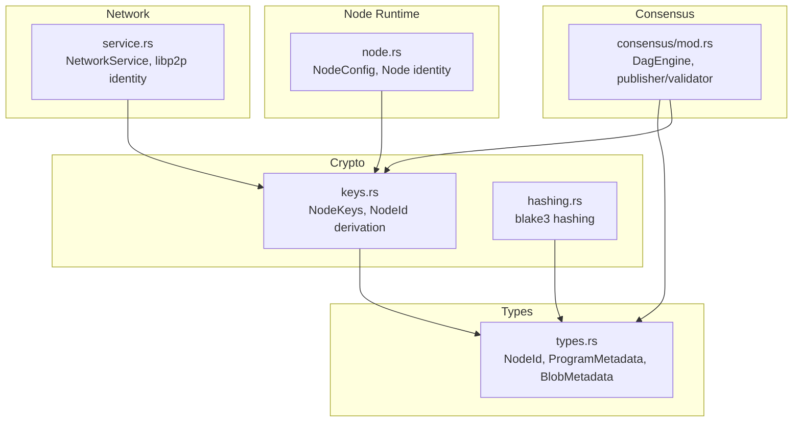
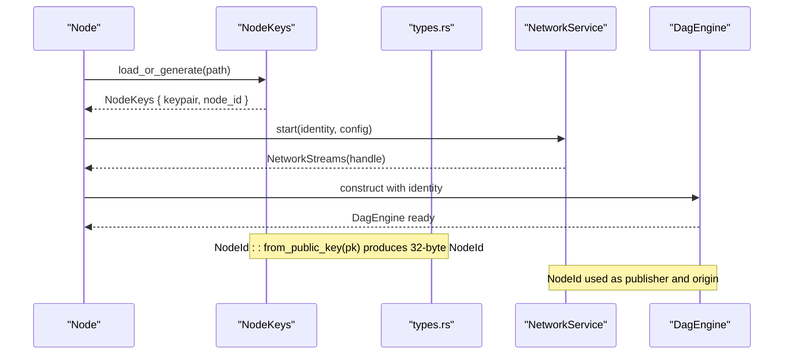
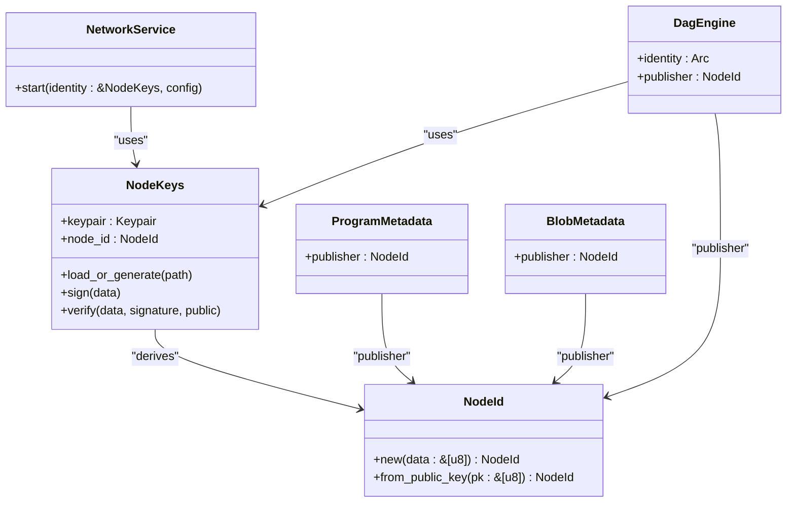

# Node Identity and Addressing

<cite>
**Referenced Files in This Document**
- [types.rs](file://src/types.rs)
- [keys.rs](file://src/crypto/keys.rs)
- [service.rs](file://src/network/service.rs)
- [mod.rs](file://src/consensus/mod.rs)
- [hashing.rs](file://src/crypto/hashing.rs)
- [node.rs](file://src/node.rs)
</cite>

## Table of Contents
1. [Introduction](#introduction)
2. [Project Structure](#project-structure)
3. [Core Components](#core-components)
4. [Architecture Overview](#architecture-overview)
5. [Detailed Component Analysis](#detailed-component-analysis)
6. [Dependency Analysis](#dependency-analysis)
7. [Performance Considerations](#performance-considerations)
8. [Troubleshooting Guide](#troubleshooting-guide)
9. [Conclusion](#conclusion)

## Introduction
This document explains NodeId and decentralized node addressing in the system. NodeId is a 32-byte identifier derived from a node’s ed25519 public key, ensuring globally unique and cryptographically verifiable identities. It is used pervasively across the system:
- As the publisher in ProgramMetadata and BlobMetadata
- As the message origin in network protocols
- As the validator identity in consensus operations

We detail the implementation of NodeId::from_public_key() and NodeId::new(), explain truncation safety and collision resistance, and show how NodeKeys encapsulates the keypair and exposes node_id for consistent identity usage. We also describe how identity integrity prevents Sybil attacks and enables trustless coordination among peers.

## Project Structure
The identity and addressing model spans several modules:
- Types define NodeId and related identifiers
- Crypto keys manage ed25519 keypairs and derive NodeId
- Network service uses NodeId for message routing and provider discovery
- Consensus uses NodeId for publisher and validator roles
- Hashing provides the foundational cryptographic primitives

**Diagram sources**
- [types.rs](file://src/types.rs#L1-L109)
- [keys.rs](file://src/crypto/keys.rs#L1-L73)
- [service.rs](file://src/network/service.rs#L1-L120)
- [mod.rs](file://src/consensus/mod.rs#L1-L120)
- [hashing.rs](file://src/crypto/hashing.rs#L1-L8)
- [node.rs](file://src/node.rs#L1-L40)

**Section sources**
- [types.rs](file://src/types.rs#L1-L109)
- [keys.rs](file://src/crypto/keys.rs#L1-L73)
- [service.rs](file://src/network/service.rs#L1-L120)
- [mod.rs](file://src/consensus/mod.rs#L1-L120)
- [hashing.rs](file://src/crypto/hashing.rs#L1-L8)
- [node.rs](file://src/node.rs#L1-L40)

## Core Components
- NodeId: A 32-byte identifier representing a node’s cryptographic identity. It is defined as a wrapper around a fixed-size byte array and supports display formatting.
- NodeKeys: Encapsulates an ed25519 keypair and derives NodeId from the public key. It supports loading an existing identity or generating a new one, and provides signing and verification helpers.
- ProgramMetadata and BlobMetadata: Both carry a publisher field typed as NodeId, establishing provenance for programs and blobs.
- NetworkService: Uses the NodeKeys-derived identity to initialize libp2p identity and propagate NodeId across network messages.
- Consensus: Uses NodeId as the publisher of operations and as a validator identity in DAG operations.

**Section sources**
- [types.rs](file://src/types.rs#L14-L15)
- [keys.rs](file://src/crypto/keys.rs#L1-L73)
- [types.rs](file://src/types.rs#L33-L53)
- [service.rs](file://src/network/service.rs#L212-L268)
- [mod.rs](file://src/consensus/mod.rs#L39-L46)

## Architecture Overview
NodeId underpins trustless coordination across the system:
- Identity creation and persistence: NodeKeys generates or loads an ed25519 keypair and derives NodeId from the public key bytes.
- Publisher provenance: Programs and blobs record NodeId as their publisher, enabling trustless attribution.
- Message origin: Network messages carry NodeId to identify the originating peer.
- Validator identity: Consensus tracks publishers and validators using NodeId.

**Diagram sources**
- [keys.rs](file://src/crypto/keys.rs#L30-L72)
- [types.rs](file://src/types.rs#L80-L93)
- [service.rs](file://src/network/service.rs#L212-L268)
- [mod.rs](file://src/consensus/mod.rs#L60-L101)

## Detailed Component Analysis

### NodeId Implementation and Safety
NodeId is a 32-byte identifier defined as a wrapper around a fixed-size array. Two constructors are provided:
- NodeId::new(data): Copies up to 32 bytes from arbitrary input, ensuring truncation safety by limiting to 32 bytes.
- NodeId::from_public_key(pk): Copies exactly 32 bytes from the ed25519 public key bytes, ensuring deterministic mapping from the public key.

Collision resistance:
- NodeId is derived from either a 32-byte public key (from_public_key) or a hash of input (other IDs). The underlying hashing uses blake3, which is collision-resistant for 32-byte outputs.
- For NodeId specifically, collision resistance relies on the uniqueness of ed25519 public keys. The system ensures NodeId is constructed from the public key bytes, preventing accidental collisions from truncated inputs.

Truncation safety:
- NodeId::new() safely truncates input to 32 bytes, avoiding panics or undefined behavior.
- NodeId::from_public_key() expects a 32-byte public key slice and copies exactly 32 bytes, preserving cryptographic guarantees.

Display formatting:
- NodeId implements Display to render the 32-byte identity as a hex string for logging and diagnostics.

**Section sources**
- [types.rs](file://src/types.rs#L80-L93)
- [types.rs](file://src/types.rs#L95-L109)
- [hashing.rs](file://src/crypto/hashing.rs#L1-L8)

### NodeKeys: Key Management and Identity Exposure
NodeKeys encapsulates:
- A keypair (ed25519)
- A NodeId derived from the public key
- Persistence/loading of the secret key and identity path

Key behaviors:
- load_or_generate(path): Loads an existing secret key if present, derives NodeId from the recovered public key, or generates a new keypair and persists the secret to disk.
- sign(data) and verify(data, signature, public): Thin wrappers around ed25519 signing and verification.

Consistent identity usage:
- NodeKeys.node_id is used across the system to represent the node’s identity in network and consensus layers.

**Section sources**
- [keys.rs](file://src/crypto/keys.rs#L1-L73)

### Publisher Identity in ProgramMetadata and BlobMetadata
Both ProgramMetadata and BlobMetadata include a publisher field typed as NodeId. This establishes trustless provenance:
- Publishers are cryptographically verifiable identities derived from ed25519 public keys.
- Consensus and storage systems use NodeId to track ownership and locate providers.

Examples of usage:
- Program index records publisher for each program.
- Blob index records publisher and locations for each blob.
- Network requests and advertisements include NodeId for provenance and provider hints.

**Section sources**
- [types.rs](file://src/types.rs#L33-L53)
- [mod.rs](file://src/consensus/mod.rs#L340-L378)
- [mod.rs](file://src/consensus/mod.rs#L380-L414)
- [service.rs](file://src/network/service.rs#L60-L110)

### Message Origin and Network Protocols
NetworkService initializes libp2p identity using the NodeKeys-derived secret key and publishes NodeId across network messages:
- libp2p identity is built from the NodeKeys secret/public key material.
- Network messages carry NodeId to identify the originating peer and to support provider discovery and transfer requests.

Provider discovery:
- Kademlia-based provider lookups use NodeId to track locations and availability of programs and blobs.

**Section sources**
- [service.rs](file://src/network/service.rs#L212-L268)
- [service.rs](file://src/network/service.rs#L145-L167)
- [node.rs](file://src/node.rs#L14-L35)

### Validator Identity in Consensus
Consensus uses NodeId in two capacities:
- As the publisher of operations (DagNode includes publisher: NodeId)
- As a validator identity when tracking peers and validating operations

DAG operations:
- Operations are associated with a publisher NodeId, enabling trustless attribution and indexing.
- Consensus tracks peers and maintains inventory using NodeId to coordinate synchronization.

**Section sources**
- [mod.rs](file://src/consensus/mod.rs#L39-L46)
- [mod.rs](file://src/consensus/mod.rs#L916-L960)

### Secure Authentication in Peer-to-Peer Interactions
NodeKeys provides cryptographic primitives for secure peer interactions:
- Signing and verification using ed25519 signatures
- Identity persistence and regeneration
- libp2p identity initialization from the NodeKeys secret key

These capabilities enable secure, verifiable authentication in peer-to-peer communications.

**Section sources**
- [keys.rs](file://src/crypto/keys.rs#L63-L72)
- [service.rs](file://src/network/service.rs#L212-L268)

## Dependency Analysis
The following diagram shows how components depend on each other to establish and use NodeId consistently:

**Diagram sources**
- [types.rs](file://src/types.rs#L14-L15)
- [types.rs](file://src/types.rs#L33-L53)
- [types.rs](file://src/types.rs#L80-L93)
- [keys.rs](file://src/crypto/keys.rs#L1-L73)
- [service.rs](file://src/network/service.rs#L212-L268)
- [mod.rs](file://src/consensus/mod.rs#L60-L101)

**Section sources**
- [types.rs](file://src/types.rs#L14-L15)
- [types.rs](file://src/types.rs#L33-L53)
- [types.rs](file://src/types.rs#L80-L93)
- [keys.rs](file://src/crypto/keys.rs#L1-L73)
- [service.rs](file://src/network/service.rs#L212-L268)
- [mod.rs](file://src/consensus/mod.rs#L60-L101)

## Performance Considerations
- NodeId construction is O(1) for both NodeId::new() and NodeId::from_public_key().
- Using 32-byte NodeId avoids overhead of variable-length identifiers.
- Hashing for other IDs uses blake3, which is fast and suitable for frequent operations.
- Network and consensus operations rely on NodeId for indexing and provider lookups; keep these operations minimal and bounded.

[No sources needed since this section provides general guidance]

## Troubleshooting Guide
Common issues and resolutions:
- Identity file parsing errors: When loading an existing identity, ensure the secret key is stored as a hex-encoded string and is valid. The loader decodes the hex and constructs the keypair; invalid hex or corrupted bytes will cause parsing failures.
- Public key mismatch: NodeId is derived from the public key bytes. Ensure the public key used to derive NodeId matches the loaded secret key.
- Network identity mismatch: libp2p identity is built from the NodeKeys secret key. Verify that the identity file corresponds to the intended secret key and that the NodeKeys instance is passed to NetworkService during startup.
- Provenance mismatches: If publisher NodeId does not match the expected identity, verify that the program or blob was published by the correct NodeKeys.node_id.

**Section sources**
- [keys.rs](file://src/crypto/keys.rs#L30-L72)
- [service.rs](file://src/network/service.rs#L212-L268)

## Conclusion
NodeId provides a compact, cryptographically grounded identity for nodes in the system. Derived from ed25519 public keys, NodeId ensures global uniqueness and verifiability. Its pervasive use as publisher in metadata, origin in network messages, and validator identity in consensus enables trustless coordination and robust anti-Sybil protections. NodeKeys centralizes identity lifecycle management, while types, network, and consensus modules consistently leverage NodeId for secure, decentralized operation.