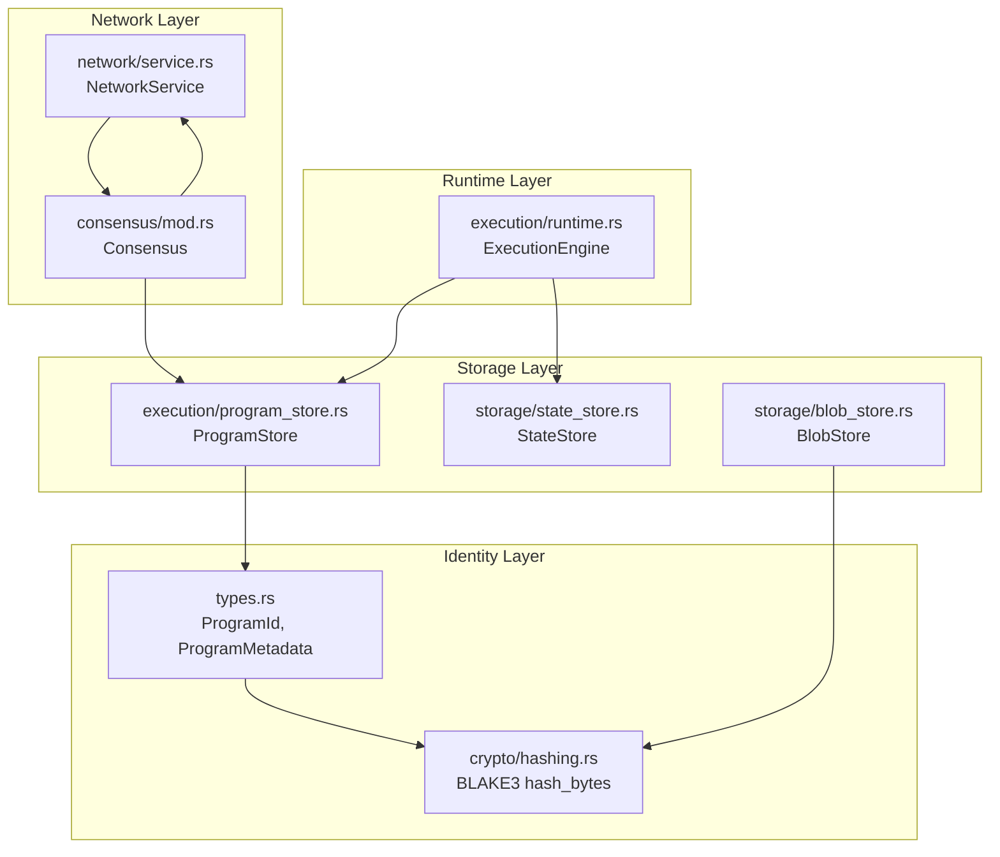
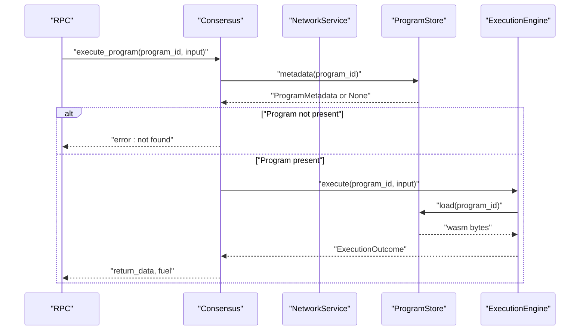
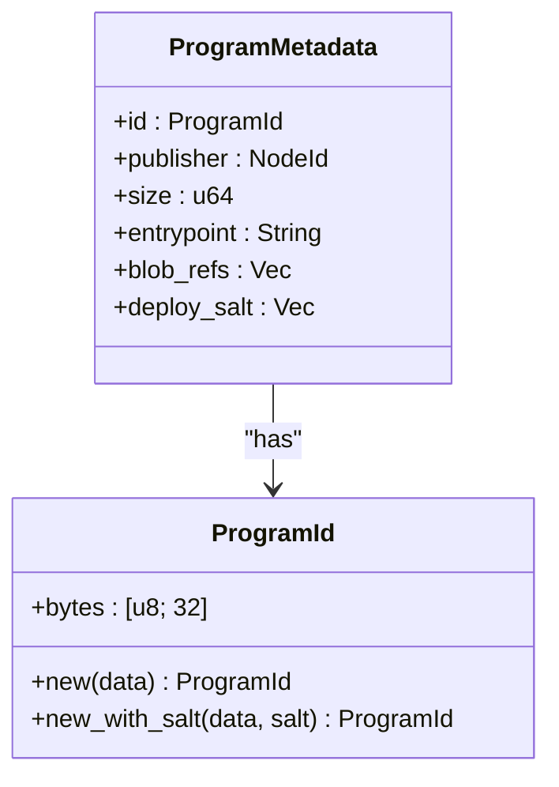
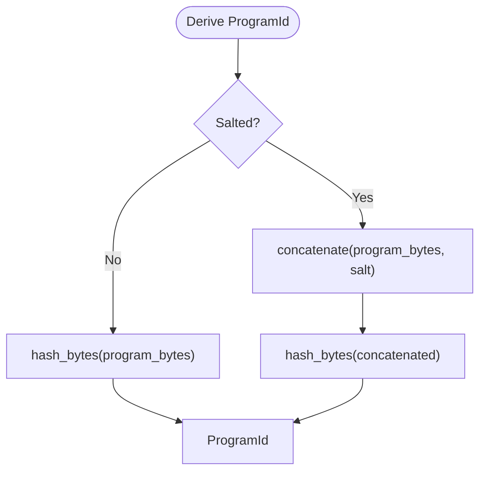
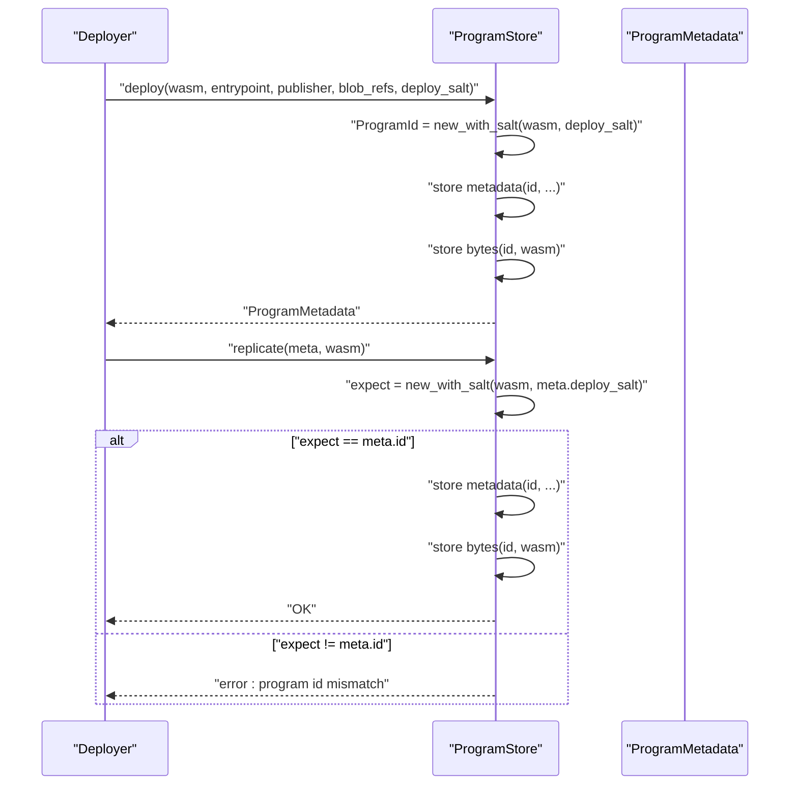
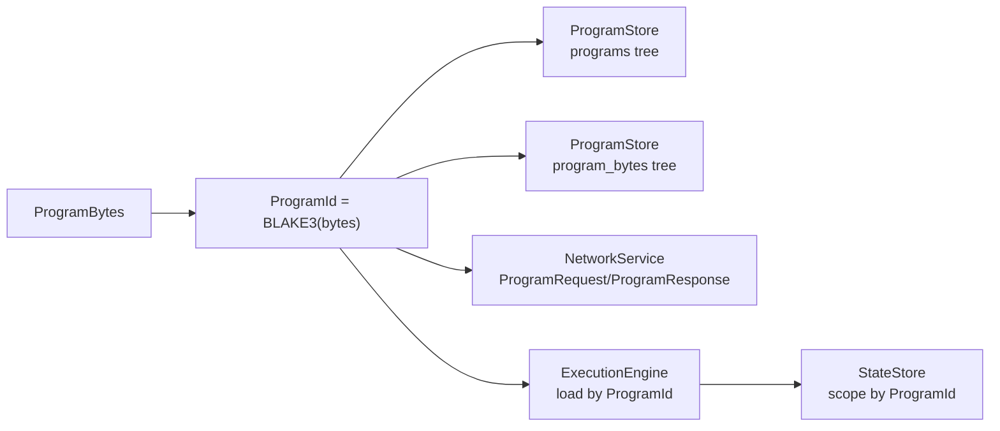
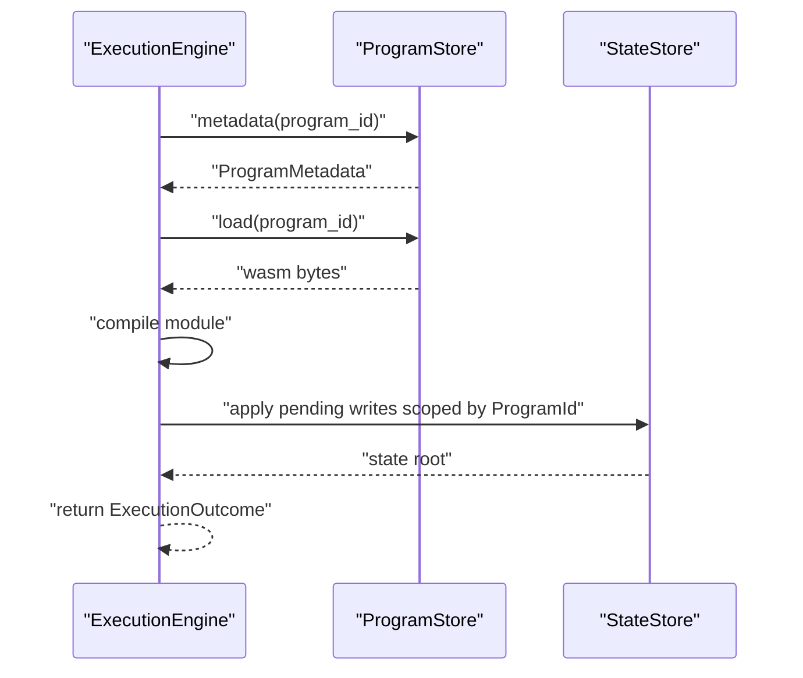
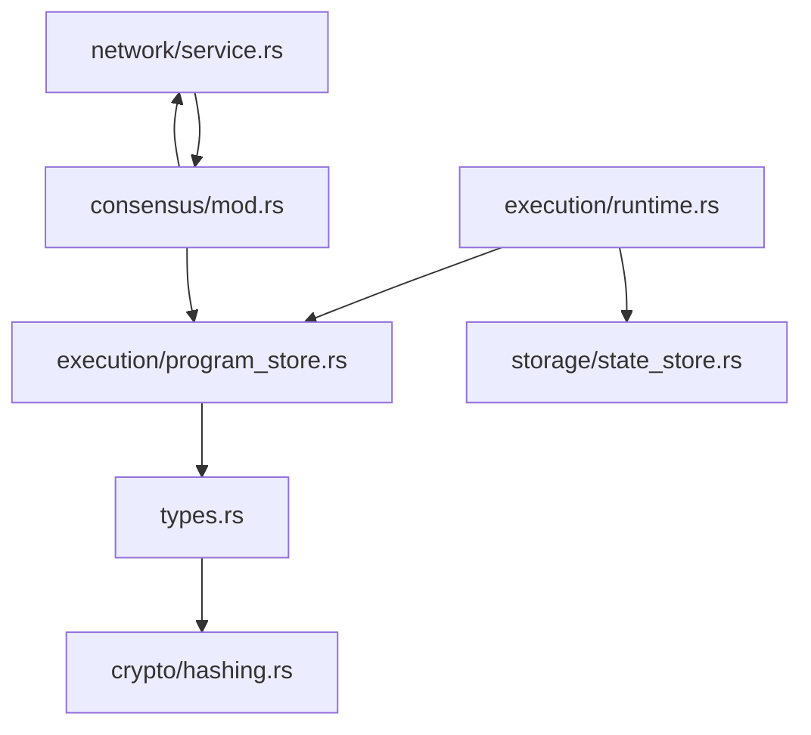

# Program Identities and Content Addressing

<cite>
**Referenced Files in This Document**
- [types.rs](file://src/types.rs)
- [hashing.rs](file://src/crypto/hashing.rs)
- [program_store.rs](file://src/execution/program_store.rs)
- [runtime.rs](file://src/execution/runtime.rs)
- [state_store.rs](file://src/storage/state_store.rs)
- [blob_store.rs](file://src/storage/blob_store.rs)
- [service.rs](file://src/network/service.rs)
- [consensus/mod.rs](file://src/consensus/mod.rs)
- [rpc/mod.rs](file://src/rpc/mod.rs)
</cite>

## Table of Contents
1. [Introduction](#introduction)
2. [Project Structure](#project-structure)
3. [Core Components](#core-components)
4. [Architecture Overview](#architecture-overview)
5. [Detailed Component Analysis](#detailed-component-analysis)
6. [Dependency Analysis](#dependency-analysis)
7. [Performance Considerations](#performance-considerations)
8. [Troubleshooting Guide](#troubleshooting-guide)
9. [Conclusion](#conclusion)

## Introduction
This document explains how ProgramId and content-addressable semantics enable trustless distribution and verification of WebAssembly programs in ONVM. ProgramId is a 32-byte BLAKE3 hash that uniquely identifies a program binary. Because the identifier is derived from the program’s content, it guarantees immutability and integrity: any change to the program content produces a different ProgramId. This content-addressable model underpins deduplication, efficient distribution, and verifiable execution across the network and storage layers.

## Project Structure
ONVM organizes program identity and content addressing across several modules:
- Identity types and hashing: types.rs and crypto/hashing.rs define ProgramId and the BLAKE3 hashing primitive.
- Program storage and identity: execution/program_store.rs stores program bytes and metadata keyed by ProgramId.
- Runtime execution: execution/runtime.rs executes programs using their ProgramId for module caching and state scoping.
- State management: storage/state_store.rs scopes state by ProgramId to compute deterministic state roots.
- Blob storage: storage/blob_store.rs demonstrates content addressing for data blobs (used by programs).
- Network and consensus: network/service.rs and consensus/mod.rs propagate and synchronize programs by ProgramId, and track provider locations.

**Diagram sources**
- [types.rs](file://src/types.rs#L1-L109)
- [hashing.rs](file://src/crypto/hashing.rs#L1-L8)
- [program_store.rs](file://src/execution/program_store.rs#L1-L96)
- [runtime.rs](file://src/execution/runtime.rs#L1-L196)
- [state_store.rs](file://src/storage/state_store.rs#L1-L80)
- [blob_store.rs](file://src/storage/blob_store.rs#L1-L185)
- [service.rs](file://src/network/service.rs#L1-L120)
- [consensus/mod.rs](file://src/consensus/mod.rs#L273-L338)

**Section sources**
- [types.rs](file://src/types.rs#L1-L109)
- [hashing.rs](file://src/crypto/hashing.rs#L1-L8)
- [program_store.rs](file://src/execution/program_store.rs#L1-L96)
- [runtime.rs](file://src/execution/runtime.rs#L1-L196)
- [state_store.rs](file://src/storage/state_store.rs#L1-L80)
- [blob_store.rs](file://src/storage/blob_store.rs#L1-L185)
- [service.rs](file://src/network/service.rs#L1-L120)
- [consensus/mod.rs](file://src/consensus/mod.rs#L273-L338)

## Core Components
- ProgramId: a 32-byte BLAKE3 hash representing a program’s immutable identity. It is derived from the program binary and used as the primary key for storage and distribution.
- ProgramMetadata: carries ProgramId, publisher NodeId, size, entrypoint, blob references, and deploy_salt.
- ProgramStore: persists ProgramMetadata and program bytes keyed by ProgramId; supports deploy, replicate, load, metadata, and list operations.
- ExecutionEngine: executes programs by ProgramId, compiles modules, and computes state roots scoped by ProgramId.
- StateStore: manages state scoped by ProgramId to produce deterministic state roots.
- BlobStore: demonstrates content addressing for data blobs; used by programs via blob_refs in ProgramMetadata.
- NetworkService and Consensus: propagate programs by ProgramId, request missing programs, and track provider locations.

**Section sources**
- [types.rs](file://src/types.rs#L1-L109)
- [program_store.rs](file://src/execution/program_store.rs#L1-L96)
- [runtime.rs](file://src/execution/runtime.rs#L1-L196)
- [state_store.rs](file://src/storage/state_store.rs#L1-L80)
- [blob_store.rs](file://src/storage/blob_store.rs#L1-L185)
- [service.rs](file://src/network/service.rs#L1-L120)
- [consensus/mod.rs](file://src/consensus/mod.rs#L273-L338)

## Architecture Overview
Content addressing ensures that a program’s identity is derived from its content. The system uses ProgramId as the canonical key across:
- Storage: ProgramStore stores program bytes and metadata keyed by ProgramId.
- Execution: ExecutionEngine loads and caches modules by ProgramId and scopes state by ProgramId.
- Distribution: NetworkService and Consensus exchange ProgramMetadata and program bytes keyed by ProgramId, and track providers.

**Diagram sources**
- [rpc/mod.rs](file://src/rpc/mod.rs#L194-L214)
- [consensus/mod.rs](file://src/consensus/mod.rs#L273-L338)
- [program_store.rs](file://src/execution/program_store.rs#L66-L82)
- [runtime.rs](file://src/execution/runtime.rs#L79-L183)

## Detailed Component Analysis

### ProgramId and ProgramMetadata
ProgramId is a 32-byte BLAKE3 hash wrapping a byte array. ProgramMetadata includes:
- id: ProgramId
- publisher: NodeId of the publishing node
- size: program size in bytes
- entrypoint: exported function name
- blob_refs: references to BlobIds used by the program
- deploy_salt: salt used to derive ProgramId during deployment

ProgramId derivation:
- ProgramId::new(data) hashes the program bytes directly.
- ProgramId::new_with_salt(data, salt) concatenates data and salt, then hashes to derive a salted identity.

Salt prevents collision attacks during deployment by ensuring different salts yield different ProgramIds even for identical binaries. This is enforced during replication checks.

**Diagram sources**
- [types.rs](file://src/types.rs#L33-L66)

**Section sources**
- [types.rs](file://src/types.rs#L33-L66)

### Implementation of ProgramId::new() and ProgramId::new_with_salt()
- ProgramId::new(data) computes BLAKE3 over the program bytes and wraps the result.
- ProgramId::new_with_salt(data, salt) concatenates data and salt, then computes BLAKE3 to derive a salted ProgramId.

These functions rely on BLAKE3 hashing implemented in crypto/hashing.rs.

**Diagram sources**
- [types.rs](file://src/types.rs#L55-L66)
- [hashing.rs](file://src/crypto/hashing.rs#L1-L8)

**Section sources**
- [types.rs](file://src/types.rs#L55-L66)
- [hashing.rs](file://src/crypto/hashing.rs#L1-L8)

### Role of Salt in Collision Resistance
During deployment, ProgramStore::deploy derives ProgramId using ProgramId::new_with_salt and stores both the ProgramId and deploy_salt in ProgramMetadata. During replication, ProgramStore::replicate recomputes ProgramId from incoming bytes and deploy_salt, enforcing that the computed ProgramId equals the stored ProgramId. If not, replication fails, preventing collisions.

**Diagram sources**
- [program_store.rs](file://src/execution/program_store.rs#L16-L56)

**Section sources**
- [program_store.rs](file://src/execution/program_store.rs#L16-L56)

### Program Identity Across Network and Storage Layers
- Storage: ProgramStore uses ProgramId as the key for both metadata and program bytes trees. This enables deduplication: identical programs share the same ProgramId and are stored once.
- Network: Consensus broadcasts ProgramMetadata and program bytes keyed by ProgramId. Nodes request missing programs by ProgramId and replicate them locally. Provider locations are tracked by ProgramId.
- Execution: ExecutionEngine loads program bytes by ProgramId, compiles modules, and scopes state writes by ProgramId to compute a deterministic state root.

**Diagram sources**
- [program_store.rs](file://src/execution/program_store.rs#L33-L72)
- [service.rs](file://src/network/service.rs#L26-L58)
- [runtime.rs](file://src/execution/runtime.rs#L79-L105)
- [state_store.rs](file://src/storage/state_store.rs#L17-L40)

**Section sources**
- [program_store.rs](file://src/execution/program_store.rs#L33-L72)
- [service.rs](file://src/network/service.rs#L26-L58)
- [runtime.rs](file://src/execution/runtime.rs#L79-L105)
- [state_store.rs](file://src/storage/state_store.rs#L17-L40)

### Relationship Between ProgramId and ProgramMetadata
ProgramMetadata encapsulates the identity (ProgramId), provenance (publisher NodeId), and composition (blob_refs) of a program. The deploy_salt is stored alongside ProgramId to ensure that any change in salt yields a different ProgramId, preserving uniqueness and integrity.

- Publisher NodeId: identifies who published the program.
- Blob references: list of BlobIds that the program depends on.
- Deploy salt: used to derive ProgramId during deployment and replication checks.

**Section sources**
- [types.rs](file://src/types.rs#L33-L41)

### Usage in Execution Runtime and Program Store
- ProgramStore::load retrieves program bytes by ProgramId.
- ExecutionEngine::execute obtains ProgramMetadata by ProgramId, loads program bytes, compiles the module, and runs the program. Pending state writes are sorted deterministically and applied to StateStore, which computes a state root scoped by ProgramId.

**Diagram sources**
- [runtime.rs](file://src/execution/runtime.rs#L79-L183)
- [program_store.rs](file://src/execution/program_store.rs#L66-L82)
- [state_store.rs](file://src/storage/state_store.rs#L17-L40)

**Section sources**
- [runtime.rs](file://src/execution/runtime.rs#L79-L183)
- [program_store.rs](file://src/execution/program_store.rs#L66-L82)
- [state_store.rs](file://src/storage/state_store.rs#L17-L40)

### Content Addressing in Blob Store and Deduplication
While this document focuses on ProgramId, BlobStore illustrates content addressing for data blobs:
- BlobId is derived from blob content via BLAKE3.
- BlobStore::put chunks data, hashes chunks, and computes a Merkle root to ensure integrity.
- BlobStore::replicate validates chunk counts, chunk hashes, and Merkle root against stored metadata.

This pattern mirrors ProgramStore’s use of ProgramId as the content-derived key, enabling deduplication and verification across the system.

**Section sources**
- [blob_store.rs](file://src/storage/blob_store.rs#L18-L76)
- [blob_store.rs](file://src/storage/blob_store.rs#L78-L143)

## Dependency Analysis
ProgramId and ProgramMetadata form the backbone of content addressing:
- types.rs defines ProgramId and ProgramMetadata and exposes constructors for deriving identities.
- crypto/hashing.rs provides BLAKE3 hashing used by ProgramId and BlobId.
- execution/program_store.rs uses ProgramId as the key for program storage and replication.
- execution/runtime.rs uses ProgramId to load and execute programs and to scope state writes.
- storage/state_store.rs scopes state by ProgramId to compute deterministic state roots.
- network/service.rs and consensus/mod.rs distribute and synchronize programs by ProgramId and track provider locations.

**Diagram sources**
- [types.rs](file://src/types.rs#L1-L109)
- [hashing.rs](file://src/crypto/hashing.rs#L1-L8)
- [program_store.rs](file://src/execution/program_store.rs#L1-L96)
- [runtime.rs](file://src/execution/runtime.rs#L1-L196)
- [state_store.rs](file://src/storage/state_store.rs#L1-L80)
- [service.rs](file://src/network/service.rs#L1-L120)
- [consensus/mod.rs](file://src/consensus/mod.rs#L273-L338)

**Section sources**
- [types.rs](file://src/types.rs#L1-L109)
- [hashing.rs](file://src/crypto/hashing.rs#L1-L8)
- [program_store.rs](file://src/execution/program_store.rs#L1-L96)
- [runtime.rs](file://src/execution/runtime.rs#L1-L196)
- [state_store.rs](file://src/storage/state_store.rs#L1-L80)
- [service.rs](file://src/network/service.rs#L1-L120)
- [consensus/mod.rs](file://src/consensus/mod.rs#L273-L338)

## Performance Considerations
- Hashing cost: BLAKE3 is fast and suitable for frequent hashing of program bytes and state updates.
- Module caching: ExecutionEngine caches compiled modules by ProgramId to avoid repeated compilation overhead.
- Storage efficiency: Using ProgramId as the key enables deduplication of identical programs across nodes and disks.
- State hashing: StateStore computes a Merkle root over deterministic key-value pairs scoped by ProgramId, enabling efficient verification and incremental updates.

[No sources needed since this section provides general guidance]

## Troubleshooting Guide
Common issues and remedies:
- Program not found: ExecutionEngine reports “program metadata missing” when ProgramId is unknown. Verify the ProgramId and ensure the program is deployed and replicated.
- Program id mismatch on replicate: Replication fails if the computed ProgramId does not match stored ProgramId. Confirm deploy_salt consistency and that the program bytes are unchanged.
- State root mismatch: If state root computation differs, inspect pending writes and ensure deterministic ordering and consistent state application.

**Section sources**
- [runtime.rs](file://src/execution/runtime.rs#L80-L87)
- [program_store.rs](file://src/execution/program_store.rs#L43-L56)
- [state_store.rs](file://src/storage/state_store.rs#L29-L40)

## Conclusion
ProgramId and content-addressable semantics in ONVM provide a robust foundation for trustless distribution and verification of WebAssembly programs. ProgramId, derived from program bytes via BLAKE3, ensures immutability and integrity. The salt prevents collision attacks during deployment and replication. ProgramId acts as the canonical key across storage, execution, and network layers, enabling deduplication, efficient distribution, and verifiable state roots. Together, these mechanisms support secure, scalable execution of distributed programs.