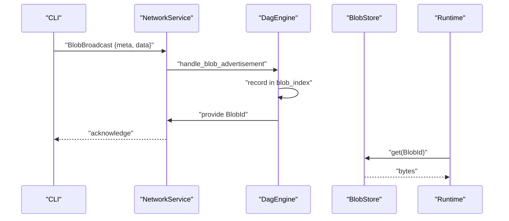
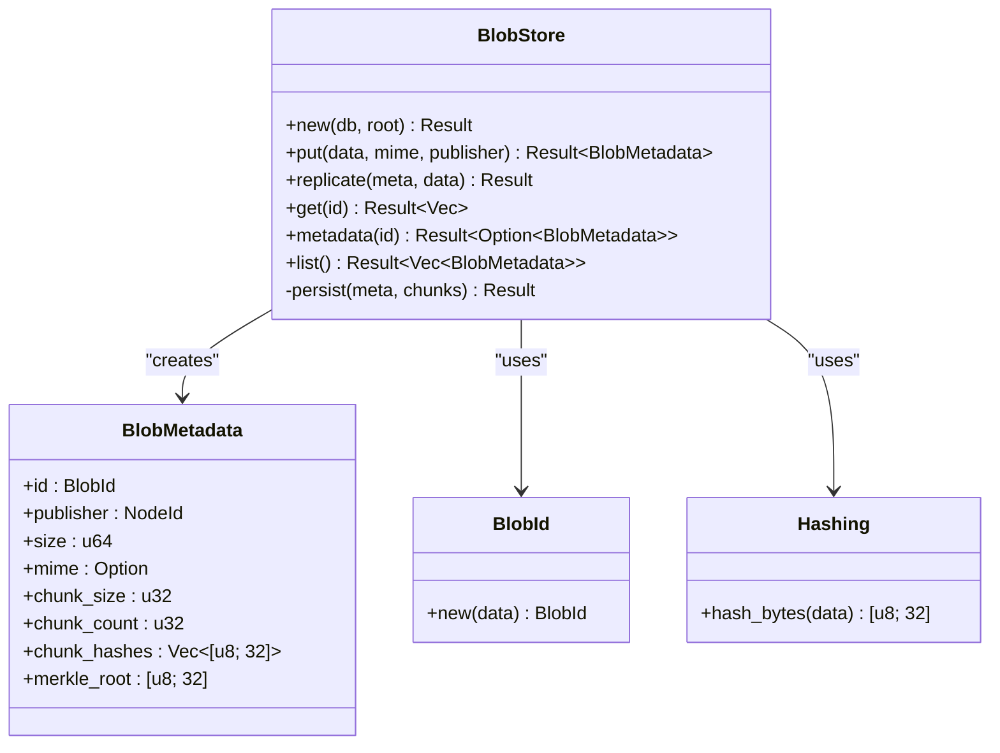
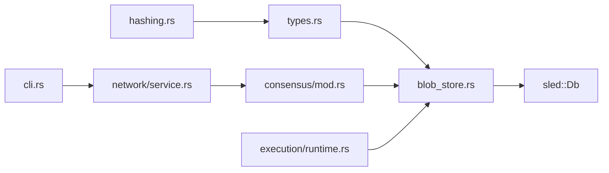

# Blob Storage

<cite>
**Referenced Files in This Document**
- [blob_store.rs](file://src/storage/blob_store.rs)
- [hashing.rs](file://src/crypto/hashing.rs)
- [types.rs](file://src/types.rs)
- [service.rs](file://src/network/service.rs)
- [mod.rs](file://src/consensus/mod.rs)
- [runtime.rs](file://src/execution/runtime.rs)
- [node.rs](file://src/node.rs)
- [cli.rs](file://src/cli.rs)
- [analytics_input.json](file://analytics_input.json)
</cite>

## Table of Contents
1. [Introduction](#introduction)
2. [Project Structure](#project-structure)
3. [Core Components](#core-components)
4. [Architecture Overview](#architecture-overview)
5. [Detailed Component Analysis](#detailed-component-analysis)
6. [Dependency Analysis](#dependency-analysis)
7. [Performance Considerations](#performance-considerations)
8. [Troubleshooting Guide](#troubleshooting-guide)
9. [Conclusion](#conclusion)
10. [Appendices](#appendices)

## Introduction
This document explains the immutable blob storage implementation used to store arbitrary binary data (such as analytics input and Wasm program binaries) in a content-addressable manner. It focuses on the BlobStore interface, the BLAKE3-based BlobId generation, integrity verification via chunk hashes and Merkle roots, and the end-to-end workflow for uploading, retrieving, and synchronizing blobs across nodes. It also covers usage patterns, integration points with execution and consensus, and practical guidance for performance and reliability.

## Project Structure
Blob storage is implemented in the storage module and integrates with cryptography, types, network, consensus, and execution layers.

```mermaid
graph TB
subgraph "Storage"
BS["BlobStore<br/>put/get/metadata/list/persist"]
Types["Types<br/>BlobId, BlobMetadata"]
Hash["Crypto Hashing<br/>BLAKE3"]
end
subgraph "Networking"
NetSvc["NetworkService<br/>BlobBroadcast/BlobRequest"]
end
subgraph "Consensus"
Cons["DagEngine<br/>BlobSyncMode, advertise/request"]
end
subgraph "Execution"
RT["Runtime<br/>onvm_blob_read host func"]
end
subgraph "CLI"
CLI["CLI UploadBlob"]
end
BS --> Types
BS --> Hash
NetSvc --> BS
Cons --> BS
RT --> BS
CLI --> NetSvc
```

**Diagram sources**
- [blob_store.rs](file://src/storage/blob_store.rs#L1-L185)
- [hashing.rs](file://src/crypto/hashing.rs#L1-L8)
- [types.rs](file://src/types.rs#L1-L109)
- [service.rs](file://src/network/service.rs#L1-L200)
- [mod.rs](file://src/consensus/mod.rs#L384-L443)
- [runtime.rs](file://src/execution/runtime.rs#L199-L244)
- [cli.rs](file://src/cli.rs#L172-L189)

**Section sources**
- [blob_store.rs](file://src/storage/blob_store.rs#L1-L185)
- [types.rs](file://src/types.rs#L1-L109)
- [hashing.rs](file://src/crypto/hashing.rs#L1-L8)
- [service.rs](file://src/network/service.rs#L1-L200)
- [mod.rs](file://src/consensus/mod.rs#L384-L443)
- [runtime.rs](file://src/execution/runtime.rs#L199-L244)
- [cli.rs](file://src/cli.rs#L172-L189)

## Core Components
- BlobStore: Provides content-addressable storage with chunking, BLAKE3 hashing, Merkle root computation, and persistence to the embedded database.
- BlobId: 32-byte BLAKE3 hash of the entire blob’s bytes, enabling deduplication and integrity.
- BlobMetadata: Stores id, publisher, size, MIME type, chunking parameters, chunk hashes, and Merkle root.
- Hashing: BLAKE3-based hashing used for BlobId and chunk hashes.
- Network integration: BlobBroadcast and BlobRequest messages for peer-to-peer synchronization.
- Consensus integration: Blob advertisement and request handling with configurable sync modes.
- Execution integration: Host function to read blobs inside Wasm programs.

**Section sources**
- [blob_store.rs](file://src/storage/blob_store.rs#L1-L185)
- [types.rs](file://src/types.rs#L43-L53)
- [hashing.rs](file://src/crypto/hashing.rs#L1-L8)
- [service.rs](file://src/network/service.rs#L60-L110)
- [mod.rs](file://src/consensus/mod.rs#L384-L443)
- [runtime.rs](file://src/execution/runtime.rs#L199-L244)

## Architecture Overview
The system uses a content-addressable model:
- On upload, the blob is split into chunks, hashed, and a Merkle root is computed.
- A BlobId is derived from the entire blob and used as the primary key.
- Metadata and chunk data are persisted separately for efficient retrieval and integrity checks.
- Peers synchronize blobs either fully or as metadata-only depending on configuration.



**Diagram sources**
- [cli.rs](file://src/cli.rs#L172-L189)
- [service.rs](file://src/network/service.rs#L60-L110)
- [mod.rs](file://src/consensus/mod.rs#L384-L443)
- [blob_store.rs](file://src/storage/blob_store.rs#L78-L104)

## Detailed Component Analysis

### BlobStore: Content-Addressable Storage
BlobStore implements:
- put(data, mime, publisher) -> BlobMetadata: Validates non-empty data, computes chunk hashes, Merkle root, derives BlobId, persists metadata and chunks, and returns metadata.
- replicate(meta, data): Verifies BlobId, chunk count, chunk hashes, and Merkle root before persisting.
- get(id): Retrieves metadata, reads all chunks, recomputes chunk hashes and Merkle root, validates size, and returns the full blob.
- metadata(id): Loads serialized BlobMetadata from the metadata tree.
- list(): Iterates metadata tree to enumerate stored blobs.
- persist(meta, chunks): Encodes metadata, inserts into metadata tree, writes each chunk keyed by BlobId and index, flushes both trees.

Chunking and keys:
- Chunks are sized up to a default 1 MiB, split evenly except the last chunk.
- Chunk keys combine BlobId and chunk index to form a stable, collision-safe key.

Merkle root:
- Leaves are chunk hashes; internal nodes concatenate left and right sibling hashes (or duplicate leaf for odd-length layers) and hash them.

Integrity:
- Reads validate chunk hashes, Merkle root, and size to detect corruption or partial data.

**Section sources**
- [blob_store.rs](file://src/storage/blob_store.rs#L18-L185)

#### Class Diagram: BlobStore and Related Types


**Diagram sources**
- [blob_store.rs](file://src/storage/blob_store.rs#L1-L185)
- [types.rs](file://src/types.rs#L43-L53)
- [hashing.rs](file://src/crypto/hashing.rs#L1-L8)

### BLAKE3-Based BlobId Generation
- BlobId is a 32-byte BLAKE3 hash of the entire blob’s bytes.
- This ensures content-addressability: identical content yields identical IDs, enabling transparent deduplication.
- BlobId.new(data) is used during put() to derive the ID and during replicate() to validate incoming data.

**Section sources**
- [types.rs](file://src/types.rs#L68-L72)
- [blob_store.rs](file://src/storage/blob_store.rs#L32-L32)

### Integrity Verification and Deduplication
- Integrity: Each chunk is hashed individually; a Merkle root is computed from chunk hashes. Reads recompute chunk hashes and Merkle root to detect corruption or missing chunks.
- Deduplication: Because BlobId is derived from the whole blob, storing the same bytes twice produces the same ID and only one persisted chunk set is needed.

**Section sources**
- [blob_store.rs](file://src/storage/blob_store.rs#L28-L41)
- [blob_store.rs](file://src/storage/blob_store.rs#L78-L104)
- [blob_store.rs](file://src/storage/blob_store.rs#L163-L184)

### Public Interfaces
- put_blob(): Implemented by BlobStore.put(); returns BlobMetadata.
- get_blob(): Implemented by BlobStore.get(); returns Vec<u8>.
- has_blob(): Implemented indirectly via BlobStore.metadata(id).is_some().
- Garbage collection: Not implemented in BlobStore; however, list() enables enumeration for external cleanup policies.

**Section sources**
- [blob_store.rs](file://src/storage/blob_store.rs#L18-L104)
- [blob_store.rs](file://src/storage/blob_store.rs#L106-L126)

### Usage Patterns
- Deduplication through content addressing: Uploading the same file multiple times yields the same BlobId and minimal storage overhead.
- Efficient large-data transfers: Chunking reduces memory pressure and enables incremental processing; Merkle root supports integrity checks without re-downloading entire blobs.
- Peer-to-peer synchronization: FullData mode replicates chunk data; MetadataOnly mode advertises presence and availability, deferring data transfer until requested.

**Section sources**
- [blob_store.rs](file://src/storage/blob_store.rs#L18-L46)
- [service.rs](file://src/network/service.rs#L60-L110)
- [mod.rs](file://src/consensus/mod.rs#L384-L418)

### Concrete Examples from the Codebase
- Uploading analytics_input.json: The CLI constructs a request body containing base64-encoded data and MIME type, then posts to the RPC endpoint. The server stores the blob via BlobStore.put() and returns the BlobId.
- Storing Wasm program binaries: The CLI deploys a program by sending base64-encoded Wasm bytes along with entrypoint and blob references; the program is stored and executed later.

**Section sources**
- [cli.rs](file://src/cli.rs#L172-L189)
- [analytics_input.json](file://analytics_input.json#L1-L5)

### Integration Points
- Networking: BlobBroadcast and BlobRequest messages carry metadata and data; providers are advertised via Kademlia-like mechanisms.
- Consensus: BlobSyncMode controls whether to replicate full data or only metadata; requests are handled to serve or fetch blobs.
- Execution: The runtime exposes onvm_blob_read to allow Wasm programs to read blobs by BlobId.

**Section sources**
- [service.rs](file://src/network/service.rs#L60-L110)
- [mod.rs](file://src/consensus/mod.rs#L384-L443)
- [runtime.rs](file://src/execution/runtime.rs#L199-L244)

## Dependency Analysis


**Diagram sources**
- [hashing.rs](file://src/crypto/hashing.rs#L1-L8)
- [types.rs](file://src/types.rs#L1-L109)
- [blob_store.rs](file://src/storage/blob_store.rs#L1-L185)
- [service.rs](file://src/network/service.rs#L1-L200)
- [mod.rs](file://src/consensus/mod.rs#L384-L443)
- [runtime.rs](file://src/execution/runtime.rs#L199-L244)
- [cli.rs](file://src/cli.rs#L172-L189)

**Section sources**
- [node.rs](file://src/node.rs#L37-L132)
- [blob_store.rs](file://src/storage/blob_store.rs#L1-L185)
- [service.rs](file://src/network/service.rs#L1-L200)
- [mod.rs](file://src/consensus/mod.rs#L384-L443)
- [runtime.rs](file://src/execution/runtime.rs#L199-L244)
- [cli.rs](file://src/cli.rs#L172-L189)

## Performance Considerations
- Batch writes: Persist writes metadata and chunks to separate trees; both trees are flushed after insertion to ensure durability. For higher throughput, consider batching multiple writes within a transaction boundary if the underlying storage supports it.
- Read-ahead caching: The current get() reads chunks sequentially. For large blobs, consider prefetching subsequent chunks after verifying the current chunk to reduce latency.
- I/O scheduling: Chunking avoids loading entire blobs into memory; adjust chunk size to balance CPU hashing overhead and memory usage. The default 1 MiB is a good starting point for large files.
- Concurrency: Multiple concurrent readers benefit from the chunked layout; ensure the database is configured for concurrent access and consider tuning underlying storage settings.

**Section sources**
- [blob_store.rs](file://src/storage/blob_store.rs#L128-L142)
- [blob_store.rs](file://src/storage/blob_store.rs#L78-L104)

## Troubleshooting Guide
Common issues and resolutions:
- Partial uploads: If a blob is partially replicated, metadata may exist but chunks are missing. The get() operation will fail with a missing chunk error. Use replicate() to supply the correct data and verify chunk count and hashes.
- Corrupted blobs: If chunk hashes or Merkle root differ upon read, the get() operation fails. Recompute hashes and Merkle root to confirm corruption; re-replicate clean data.
- Storage quotas: There is no built-in quota enforcement in BlobStore. Use list() to enumerate stored blobs and implement external policies to remove unused or oversized blobs.
- Empty data: put() rejects empty blobs; ensure clients send non-empty payloads.

**Section sources**
- [blob_store.rs](file://src/storage/blob_store.rs#L24-L26)
- [blob_store.rs](file://src/storage/blob_store.rs#L78-L104)
- [blob_store.rs](file://src/storage/blob_store.rs#L106-L126)

## Conclusion
BlobStore provides a robust, content-addressable storage layer with strong integrity guarantees via BLAKE3 and Merkle roots. It supports efficient large-data handling through chunking and integrates cleanly with networking, consensus, and execution. While garbage collection is not built-in, the exposed APIs enable straightforward external management of storage lifecycle.

## Appendices

### API Surface Summary
- put(data, mime, publisher) -> BlobMetadata
- replicate(meta, data) -> ()
- get(id) -> Vec<u8>
- metadata(id) -> Option<BlobMetadata>
- list() -> Vec<BlobMetadata>

**Section sources**
- [blob_store.rs](file://src/storage/blob_store.rs#L18-L126)

### Example Workflows

#### Upload Analytics Input
- CLI reads the JSON file, encodes to base64, and posts to the RPC endpoint.
- The server stores the blob and returns the BlobId.

**Section sources**
- [cli.rs](file://src/cli.rs#L172-L189)
- [analytics_input.json](file://analytics_input.json#L1-L5)

#### Store and Use Wasm Program Binary
- CLI reads the Wasm file, encodes to base64, and sends a deploy request.
- The program is stored and later executed; the runtime can read referenced blobs by BlobId.

**Section sources**
- [cli.rs](file://src/cli.rs#L191-L218)
- [runtime.rs](file://src/execution/runtime.rs#L199-L244)