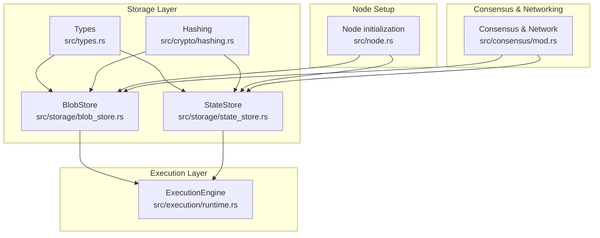
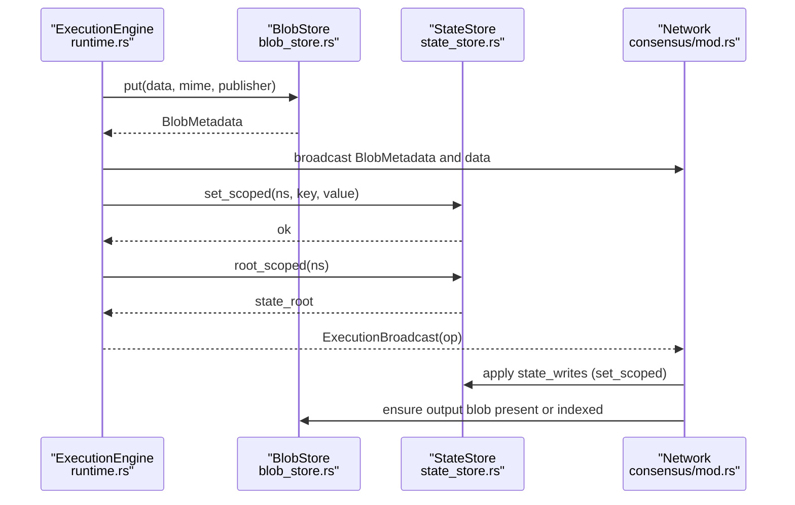
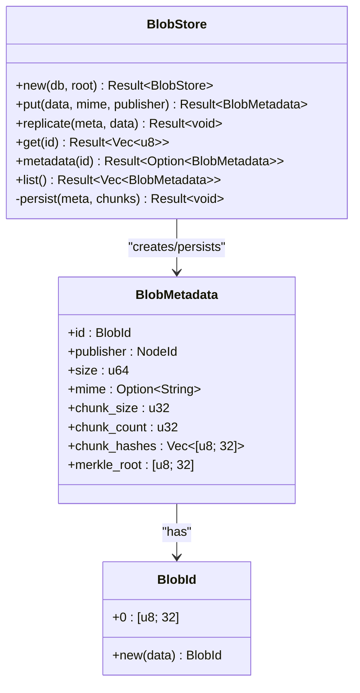
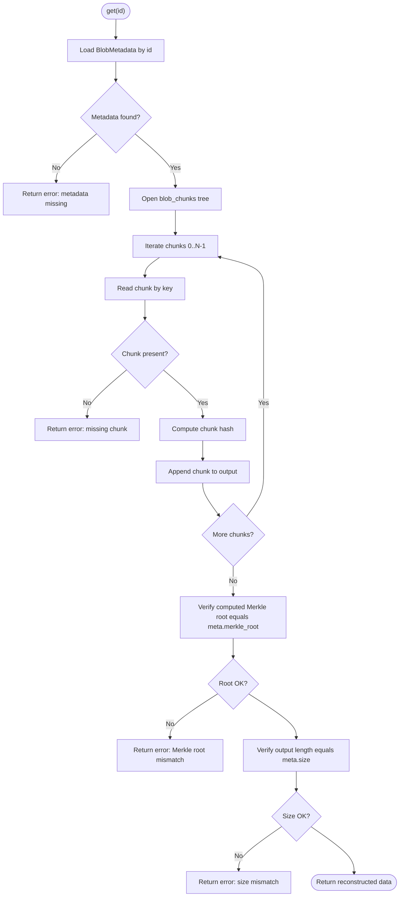
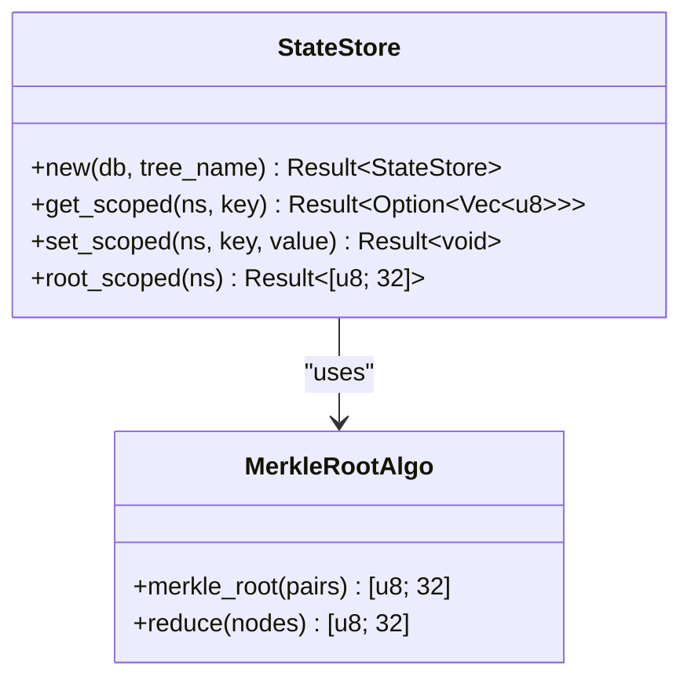
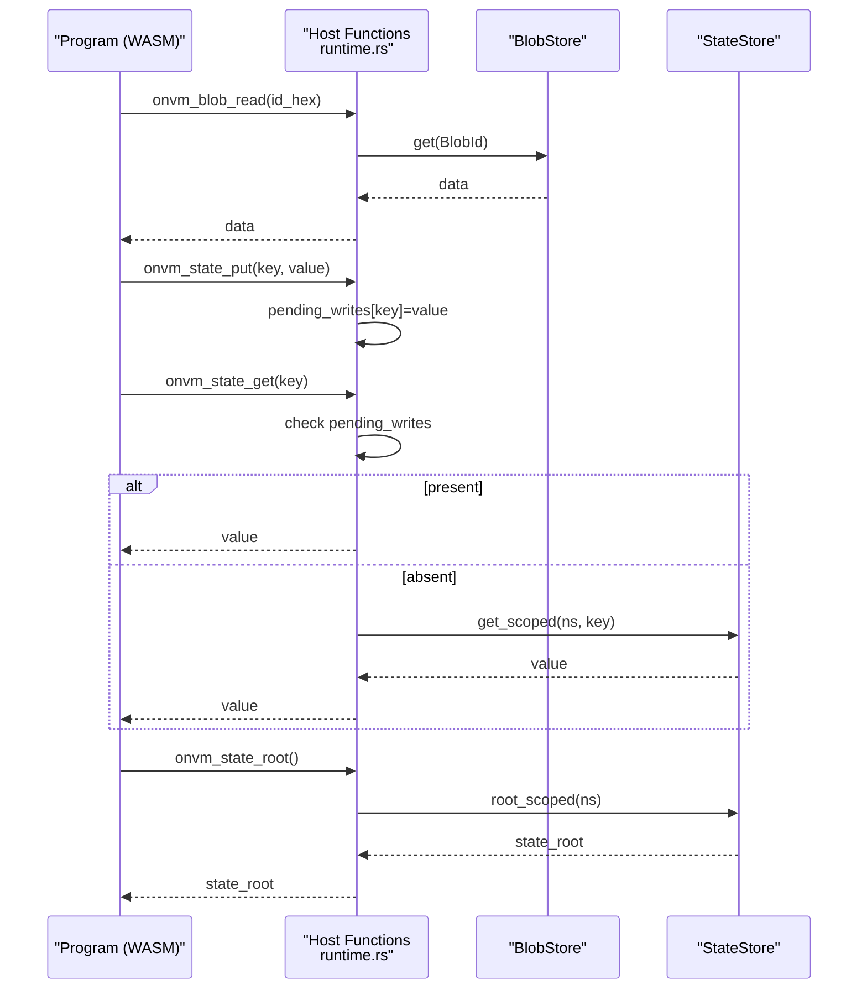
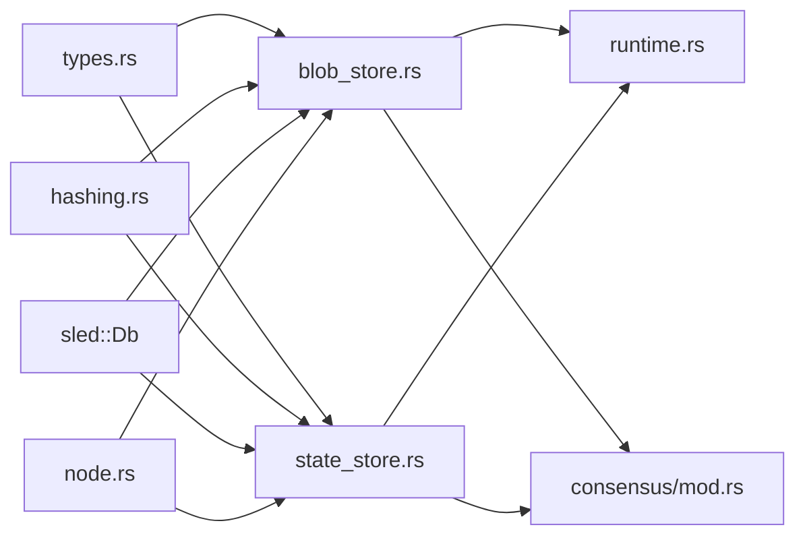

# Data Management

<cite>
**Referenced Files in This Document**
- [blob_store.rs](file://src/storage/blob_store.rs)
- [state_store.rs](file://src/storage/state_store.rs)
- [types.rs](file://src/types.rs)
- [hashing.rs](file://src/crypto/hashing.rs)
- [runtime.rs](file://src/execution/runtime.rs)
- [mod.rs](file://src/storage/mod.rs)
- [node.rs](file://src/node.rs)
- [mod.rs](file://src/consensus/mod.rs)
- [analytics_input.json](file://analytics_input.json)
- [kvstore lib.rs](file://wasm_programs/kvstore/src/lib.rs)
</cite>

## Table of Contents
1. [Introduction](#introduction)
2. [Project Structure](#project-structure)
3. [Core Components](#core-components)
4. [Architecture Overview](#architecture-overview)
5. [Detailed Component Analysis](#detailed-component-analysis)
6. [Dependency Analysis](#dependency-analysis)
7. [Performance Considerations](#performance-considerations)
8. [Troubleshooting Guide](#troubleshooting-guide)
9. [Conclusion](#conclusion)
10. [Appendices](#appendices)

## Introduction
This document explains the data persistence and retrieval mechanisms in the system, focusing on:
- Immutable blob storage via BlobStore for content-addressable data
- Structured state management via StateStore for program-scoped key-value state
- Content addressing using BLAKE3 hashes
- Domain models: BlobId, BlobMetadata, StateKey, StateValue
- Usage patterns: content-addressable lookups, state versioning, and garbage collection considerations
- Integration with execution (program inputs/outputs) and networking (blob synchronization)
- Performance considerations and common issues

## Project Structure
The data management layer is organized under src/storage with two primary modules:
- BlobStore: manages immutable blobs with chunking, Merkle roots, and metadata
- StateStore: manages program-scoped key-value state with deterministic hashing

**Diagram sources**
- [blob_store.rs](file://src/storage/blob_store.rs#L1-L185)
- [state_store.rs](file://src/storage/state_store.rs#L1-L80)
- [types.rs](file://src/types.rs#L1-L109)
- [hashing.rs](file://src/crypto/hashing.rs#L1-L8)
- [runtime.rs](file://src/execution/runtime.rs#L1-L200)
- [node.rs](file://src/node.rs#L43-L56)
- [mod.rs](file://src/consensus/mod.rs#L194-L270)

**Section sources**
- [mod.rs](file://src/storage/mod.rs#L1-L6)
- [node.rs](file://src/node.rs#L43-L56)

## Core Components
- BlobStore
  - Stores immutable blobs with chunking and Merkle root verification
  - Provides put(), replicate(), get(), metadata(), list(), and internal persist()
- StateStore
  - Manages program-scoped key-value state with deterministic hashing
  - Provides get_scoped(), set_scoped(), root_scoped()

Interfaces and domain models:
- put_blob(): stores a blob and returns BlobMetadata
- get_blob(): retrieves a blob by BlobId
- put_state(): stores a value under a scoped key
- get_state(): retrieves a value under a scoped key
- Content addressing: BlobId and BLAKE3 hashes
- Domain models: BlobId, BlobMetadata, StateKey, StateValue

**Section sources**
- [blob_store.rs](file://src/storage/blob_store.rs#L18-L143)
- [state_store.rs](file://src/storage/state_store.rs#L11-L41)
- [types.rs](file://src/types.rs#L8-L53)
- [hashing.rs](file://src/crypto/hashing.rs#L1-L8)

## Architecture Overview
The system integrates storage with execution and networking:
- ExecutionEngine reads/writes state and reads blobs during program execution
- Consensus layer uses BlobStore and StateStore to manage program inputs/outputs and propagate state updates
- Networking broadcasts blob metadata and data for synchronization

**Diagram sources**
- [runtime.rs](file://src/execution/runtime.rs#L199-L377)
- [blob_store.rs](file://src/storage/blob_store.rs#L18-L143)
- [state_store.rs](file://src/storage/state_store.rs#L11-L41)
- [mod.rs](file://src/consensus/mod.rs#L194-L270)
- [mod.rs](file://src/consensus/mod.rs#L445-L483)

## Detailed Component Analysis

### BlobStore Implementation
BlobStore provides:
- put(): computes chunk hashes and Merkle root, persists metadata and chunks
- replicate(): validates incoming blob against metadata before persisting
- get(): reconstructs blob, verifies chunk hashes and Merkle root
- metadata(): retrieves stored BlobMetadata
- list(): enumerates all stored BlobMetadata
- persist(): writes metadata and chunks to separate trees

**Diagram sources**
- [blob_store.rs](file://src/storage/blob_store.rs#L18-L143)
- [types.rs](file://src/types.rs#L8-L53)

**Section sources**
- [blob_store.rs](file://src/storage/blob_store.rs#L18-L143)
- [types.rs](file://src/types.rs#L8-L53)

#### Blob Retrieval Flow

**Diagram sources**
- [blob_store.rs](file://src/storage/blob_store.rs#L78-L104)

### StateStore Implementation
StateStore provides:
- get_scoped(): retrieves value under a namespaced key
- set_scoped(): stores value under a namespaced key
- root_scoped(): computes a deterministic Merkle root over all key-value pairs in a namespace

**Diagram sources**
- [state_store.rs](file://src/storage/state_store.rs#L11-L80)

**Section sources**
- [state_store.rs](file://src/storage/state_store.rs#L11-L80)

#### State Versioning and Deterministic Hashing
- State versioning occurs by applying writes deterministically (sorted by key) and computing a root over the namespace
- Pending writes are considered in state_root computation during execution to reflect in-progress changes

**Section sources**
- [runtime.rs](file://src/execution/runtime.rs#L155-L183)
- [runtime.rs](file://src/execution/runtime.rs#L334-L374)

### Content Addressing and BLAKE3
- BlobId is derived from BLAKE3 over the entire blob payload
- Chunk hashes and Merkle root are also BLAKE3-based
- State keys/values are hashed deterministically for state root computation

**Section sources**
- [types.rs](file://src/types.rs#L8-L13)
- [types.rs](file://src/types.rs#L68-L72)
- [hashing.rs](file://src/crypto/hashing.rs#L1-L8)
- [blob_store.rs](file://src/storage/blob_store.rs#L28-L41)
- [state_store.rs](file://src/storage/state_store.rs#L54-L79)

### Usage Patterns

#### Uploading analytics_input.json as a Blob
- Read file content
- Call BlobStore.put() with the content and publisher NodeId
- Use the returned BlobMetadata.id as the content address for subsequent retrievals

Example steps:
- Read analytics_input.json content
- Invoke BlobStore.put(content, mime, publisher)
- Store the returned BlobMetadata.id for later use

**Section sources**
- [analytics_input.json](file://analytics_input.json#L1-L5)
- [blob_store.rs](file://src/storage/blob_store.rs#L18-L46)

#### Storing kvstore State
- The kvstore program demonstrates state operations:
  - Put: state_put(key, value)
  - Get: state_get_with_resize(key)
  - List: iterate keys and fetch values
  - Clear: remove all keys
  - Stats: compute totals and checksum over keys and values

Integration with StateStore:
- During execution, pending writes are sorted and applied to the StateStore namespace for the program
- The state root is computed over the namespace and returned as part of ExecutionOutcome

**Section sources**
- [kvstore lib.rs](file://wasm_programs/kvstore/src/lib.rs#L71-L144)
- [runtime.rs](file://src/execution/runtime.rs#L155-L183)
- [runtime.rs](file://src/execution/runtime.rs#L334-L374)

#### Content-Addressable Lookups
- Retrieve blob by BlobId using BlobStore.get()
- Retrieve state by scoped key using StateStore.get_scoped()

**Section sources**
- [blob_store.rs](file://src/storage/blob_store.rs#L78-L104)
- [state_store.rs](file://src/storage/state_store.rs#L17-L27)

#### State Versioning
- State versioning is achieved by applying writes deterministically and computing a namespace-wide Merkle root
- Pending writes are included in state_root computation during execution

**Section sources**
- [runtime.rs](file://src/execution/runtime.rs#L155-L183)
- [runtime.rs](file://src/execution/runtime.rs#L334-L374)

#### Garbage Collection Considerations
- The codebase does not implement explicit blob or state garbage collection
- Practical considerations:
  - Blobs are keyed by content hash; unused blobs can accumulate
  - State namespaces grow with program keys; consider pruning old keys
  - Use BlobIndex and program indexing to track ownership and presence

**Section sources**
- [mod.rs](file://src/consensus/mod.rs#L916-L1004)

### Integration with Execution and Networking
- ExecutionEngine:
  - Reads blobs via onvm_blob_read
  - Writes state via onvm_state_put and onvm_state_get
  - Computes state_root via onvm_state_root
- Consensus and Networking:
  - Broadcasts blob metadata and data for synchronization
  - Applies remote state writes and ensures output blobs are present

**Diagram sources**
- [runtime.rs](file://src/execution/runtime.rs#L199-L377)
- [blob_store.rs](file://src/storage/blob_store.rs#L78-L104)
- [state_store.rs](file://src/storage/state_store.rs#L17-L41)

**Section sources**
- [runtime.rs](file://src/execution/runtime.rs#L199-L377)
- [mod.rs](file://src/consensus/mod.rs#L194-L270)
- [mod.rs](file://src/consensus/mod.rs#L445-L483)

## Dependency Analysis
- BlobStore depends on:
  - Types: BlobId, BlobMetadata, NodeId
  - Hashing: BLAKE3-based hash_bytes
  - sled: metadata and chunk trees
- StateStore depends on:
  - Types: ProgramId (namespace), StateWrite
  - Hashing: BLAKE3-based hash_bytes
  - sled: named tree for state
- ExecutionEngine depends on:
  - BlobStore and StateStore for runtime operations
- Node initialization wires:
  - BlobStore and StateStore into ExecutionEngine and Scheduler

**Diagram sources**
- [types.rs](file://src/types.rs#L1-L109)
- [hashing.rs](file://src/crypto/hashing.rs#L1-L8)
- [blob_store.rs](file://src/storage/blob_store.rs#L1-L185)
- [state_store.rs](file://src/storage/state_store.rs#L1-L80)
- [runtime.rs](file://src/execution/runtime.rs#L1-L200)
- [node.rs](file://src/node.rs#L43-L56)
- [mod.rs](file://src/consensus/mod.rs#L194-L270)

**Section sources**
- [types.rs](file://src/types.rs#L1-L109)
- [hashing.rs](file://src/crypto/hashing.rs#L1-L8)
- [blob_store.rs](file://src/storage/blob_store.rs#L1-L185)
- [state_store.rs](file://src/storage/state_store.rs#L1-L80)
- [runtime.rs](file://src/execution/runtime.rs#L1-L200)
- [node.rs](file://src/node.rs#L43-L56)
- [mod.rs](file://src/consensus/mod.rs#L194-L270)

## Performance Considerations
- Sled database tuning
  - BlobStore persists metadata and chunks in separate trees; flushes occur after writes
  - Consider adjusting sled configuration for durability vs throughput trade-offs
- Chunking strategy
  - DEFAULT_CHUNK_SIZE is 1 MiB; larger chunks reduce overhead but increase memory usage
- Caching strategies
  - ExecutionEngine caches compiled modules per ProgramId
  - Consider caching hot blobs or frequently accessed state keys at higher layers
- I/O optimization
  - BlobStore.get() reconstructs data by iterating chunks; ensure chunk sizes align with workload patterns
  - StateStore.root_scoped() sorts pairs deterministically; keep namespaces bounded to limit hashing cost

[No sources needed since this section provides general guidance]

## Troubleshooting Guide
Common issues and mitigations:
- Storage full errors
  - Monitor disk usage; consider pruning unused blobs and state namespaces
  - Use list() and inventory to identify unused content
- Corrupted blobs
  - get() verifies chunk hashes and Merkle root; mismatches trigger errors
  - Reprocess replication with replicate() to restore consistency
- State consistency across executions
  - Ensure pending writes are applied deterministically and state_root reflects in-progress changes
  - Validate state_writes ordering and namespace scoping

**Section sources**
- [blob_store.rs](file://src/storage/blob_store.rs#L78-L104)
- [blob_store.rs](file://src/storage/blob_store.rs#L48-L76)
- [runtime.rs](file://src/execution/runtime.rs#L155-L183)
- [runtime.rs](file://src/execution/runtime.rs#L334-L374)

## Conclusion
The data management layer provides robust, content-addressable blob storage and deterministic state management:
- BlobStore ensures integrity via chunking and Merkle roots
- StateStore enables program-scoped state with deterministic versioning
- Integration with execution and networking supports seamless synchronization and reproducible outcomes
- Performance and reliability can be tuned via sled configuration, chunk sizing, and caching strategies

[No sources needed since this section summarizes without analyzing specific files]

## Appendices

### API Surface Summary
- BlobStore
  - put(data, mime, publisher) -> BlobMetadata
  - replicate(meta, data) -> Result<void>
  - get(id) -> Vec<u8>
  - metadata(id) -> Option<BlobMetadata>
  - list() -> Vec<BlobMetadata>
- StateStore
  - get_scoped(ns, key) -> Option<Vec<u8>>
  - set_scoped(ns, key, value) -> Result<void>
  - root_scoped(ns) -> [u8; 32]

**Section sources**
- [blob_store.rs](file://src/storage/blob_store.rs#L18-L143)
- [state_store.rs](file://src/storage/state_store.rs#L11-L41)