# State Storage

<cite>
**Referenced Files in This Document**
- [state_store.rs](file://src/storage/state_store.rs)
- [runtime.rs](file://src/execution/runtime.rs)
- [types.rs](file://src/types.rs)
- [node.rs](file://src/node.rs)
- [lib.rs](file://src/lib.rs)
- [mod.rs](file://src/storage/mod.rs)
- [kvstore/lib.rs](file://wasm_programs/kvstore/src/lib.rs)
- [analytics/lib.rs](file://wasm_programs/analytics/src/lib.rs)
</cite>

## Table of Contents
1. [Introduction](#introduction)
2. [Project Structure](#project-structure)
3. [Core Components](#core-components)
4. [Architecture Overview](#architecture-overview)
5. [Detailed Component Analysis](#detailed-component-analysis)
6. [Dependency Analysis](#dependency-analysis)
7. [Performance Considerations](#performance-considerations)
8. [Troubleshooting Guide](#troubleshooting-guide)
9. [Conclusion](#conclusion)
10. [Appendices](#appendices)

## Introduction
This document explains the structured state management implemented in the onvm project’s storage subsystem, focusing on the key-value state store with hierarchical namespaces and versioned state roots. It covers the public interfaces, internal design, and integration points with execution and networking. It also provides usage patterns, performance considerations, and guidance for common issues such as state bloat, version conflicts, and schema migrations.

## Project Structure
The state storage is implemented in a dedicated module and integrated across execution, consensus, and node initialization.

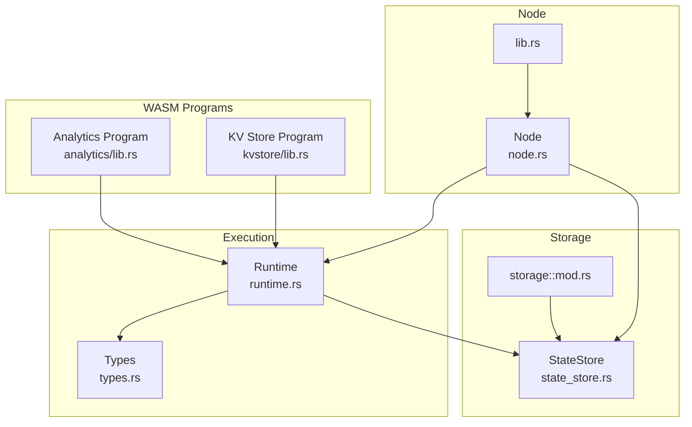

**Diagram sources**
- [state_store.rs](file://src/storage/state_store.rs#L1-L48)
- [runtime.rs](file://src/execution/runtime.rs#L270-L377)
- [types.rs](file://src/types.rs#L1-L31)
- [node.rs](file://src/node.rs#L37-L56)
- [lib.rs](file://src/lib.rs#L1-L12)
- [mod.rs](file://src/storage/mod.rs#L1-L5)
- [kvstore/lib.rs](file://wasm_programs/kvstore/src/lib.rs#L75-L187)
- [analytics/lib.rs](file://wasm_programs/analytics/src/lib.rs#L1-L167)

**Section sources**
- [state_store.rs](file://src/storage/state_store.rs#L1-L48)
- [runtime.rs](file://src/execution/runtime.rs#L270-L377)
- [types.rs](file://src/types.rs#L1-L31)
- [node.rs](file://src/node.rs#L37-L56)
- [lib.rs](file://src/lib.rs#L1-L12)
- [mod.rs](file://src/storage/mod.rs#L1-L5)

## Core Components
- StateStore: Provides scoped key-value storage with hierarchical namespaces and a state root computed as a Merkle root over the namespace.
- Runtime integration: Exposes WebAssembly host functions for state reads, writes, and state root computation, with a pending-writes overlay during execution.
- Types: Defines StateWrite and ComputeOp to capture state changes and resulting state roots for consensus and verification.
- WASM programs: Example programs demonstrate state usage for kvstore and analytics.

Key responsibilities:
- Namespace scoping: Keys are stored under a namespace derived from the program identifier.
- Deterministic state root: Root is computed over sorted key-value pairs within a namespace.
- Pending writes overlay: During execution, pending writes are prioritized for reads and folded into the temporary state root.

**Section sources**
- [state_store.rs](file://src/storage/state_store.rs#L1-L48)
- [runtime.rs](file://src/execution/runtime.rs#L270-L377)
- [types.rs](file://src/types.rs#L17-L31)
- [kvstore/lib.rs](file://wasm_programs/kvstore/src/lib.rs#L75-L187)

## Architecture Overview
The state store is a scoped key-value store backed by a persistent database. Execution engines and programs interact with the store through a namespace per program. Consensus captures state roots and writes to reconstruct state across nodes.

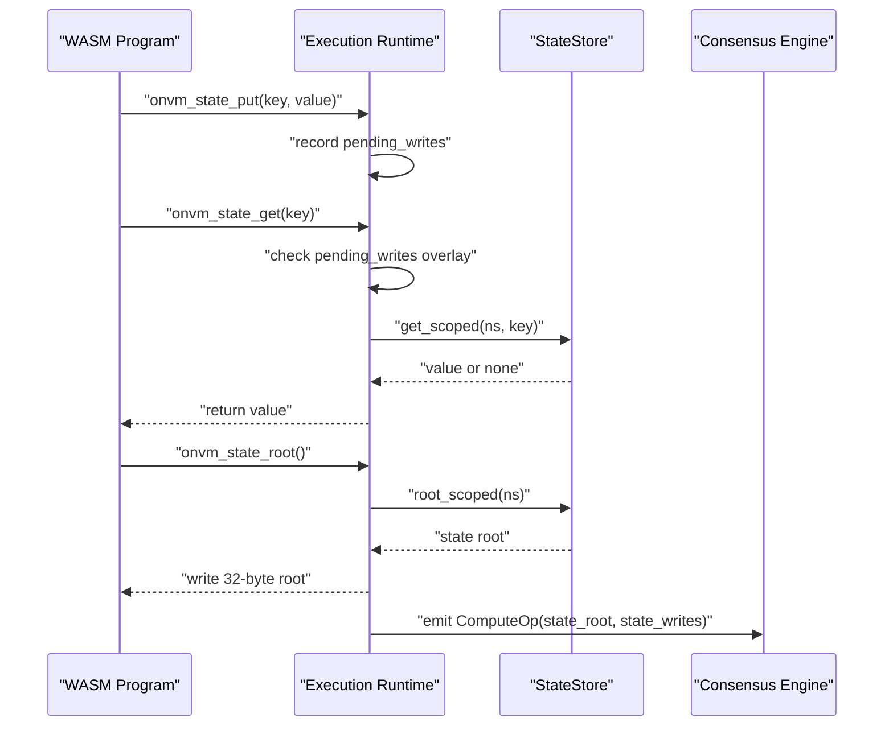

**Diagram sources**
- [runtime.rs](file://src/execution/runtime.rs#L270-L377)
- [state_store.rs](file://src/storage/state_store.rs#L17-L40)
- [types.rs](file://src/types.rs#L17-L31)

## Detailed Component Analysis

### StateStore: Scoped Key-Value Storage
StateStore encapsulates a persistent key-value store with:
- Hierarchical namespace: Keys are stored under a namespace prefix derived from the program identifier.
- Scoped operations: get_scoped and set_scoped combine namespace and key.
- State root computation: root_scoped computes a Merkle root over all key-value pairs within a namespace.

Public interface highlights:
- get_scoped(ns, key) -> Option<Vec<u8>>
- set_scoped(ns, key, value) -> Result<()>
- root_scoped(ns) -> [u8; 32]

Implementation notes:
- Keys are formed by concatenating namespace and key.
- root_scoped scans the namespace prefix, strips the prefix for stable hashing, sorts pairs, and computes a Merkle root.
- set_scoped flushes after insertion to ensure durability.

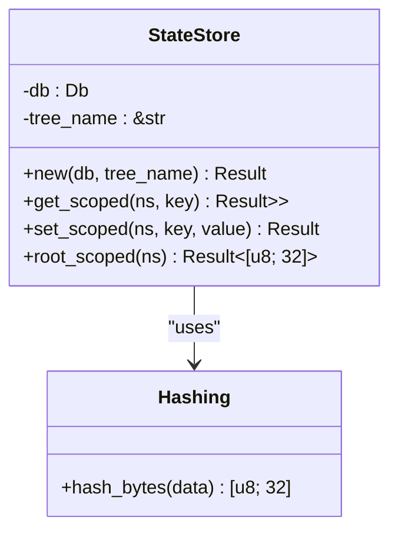

**Diagram sources**
- [state_store.rs](file://src/storage/state_store.rs#L1-L48)

**Section sources**
- [state_store.rs](file://src/storage/state_store.rs#L1-L48)

### Runtime Integration: Host Functions and Pending Writes
The runtime exposes three host functions to WASM programs:
- onvm_state_put: Records a pending write for the current program’s namespace.
- onvm_state_get: Reads from pending writes overlay first, then from the store.
- onvm_state_root: Computes a temporary state root including pending writes.

Pending writes overlay:
- During execution, pending writes are kept in-memory keyed by program_id and applied deterministically after successful execution.
- onvm_state_root folds pending writes into the root calculation to reflect the effect of the current execution.

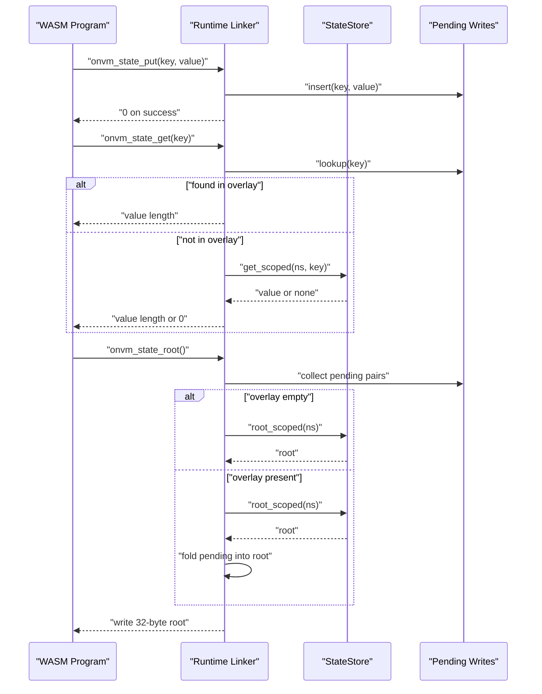

**Diagram sources**
- [runtime.rs](file://src/execution/runtime.rs#L270-L377)
- [state_store.rs](file://src/storage/state_store.rs#L17-L40)

**Section sources**
- [runtime.rs](file://src/execution/runtime.rs#L270-L377)
- [state_store.rs](file://src/storage/state_store.rs#L17-L40)

### Domain Models: StateWrite and ComputeOp
StateWrite and ComputeOp capture the state changes produced by an execution and the resulting state root for consensus.

- StateWrite: key/value pair representing a single state mutation.
- ComputeOp: carries program_id, input, output metadata, fuel used, state_root, and state_writes.

These structures enable:
- Deterministic reconstruction of state after execution.
- Consensus verification of state roots and writes.

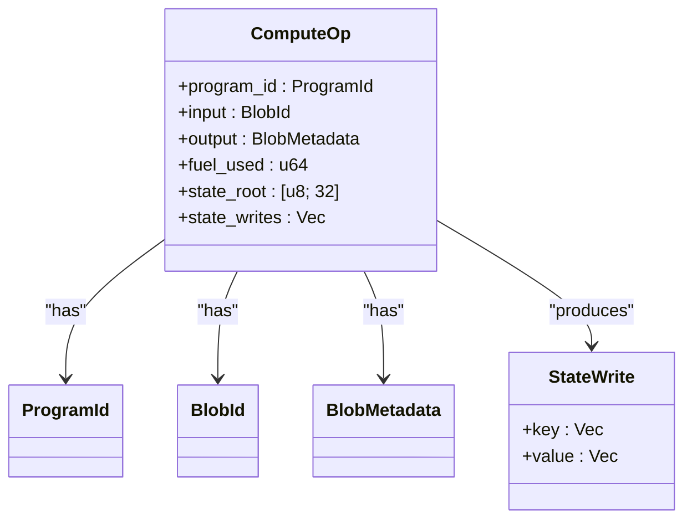

**Diagram sources**
- [types.rs](file://src/types.rs#L17-L31)

**Section sources**
- [types.rs](file://src/types.rs#L17-L31)

### WASM Programs: Examples of State Usage
- KV Store program: Demonstrates state put/get/list/clear/stats using onvm_state_* host functions. It maintains a key index and computes checksums.
- Analytics program: Performs computation and stores results in a buffer for later retrieval; illustrates state-backed analytics computation results.

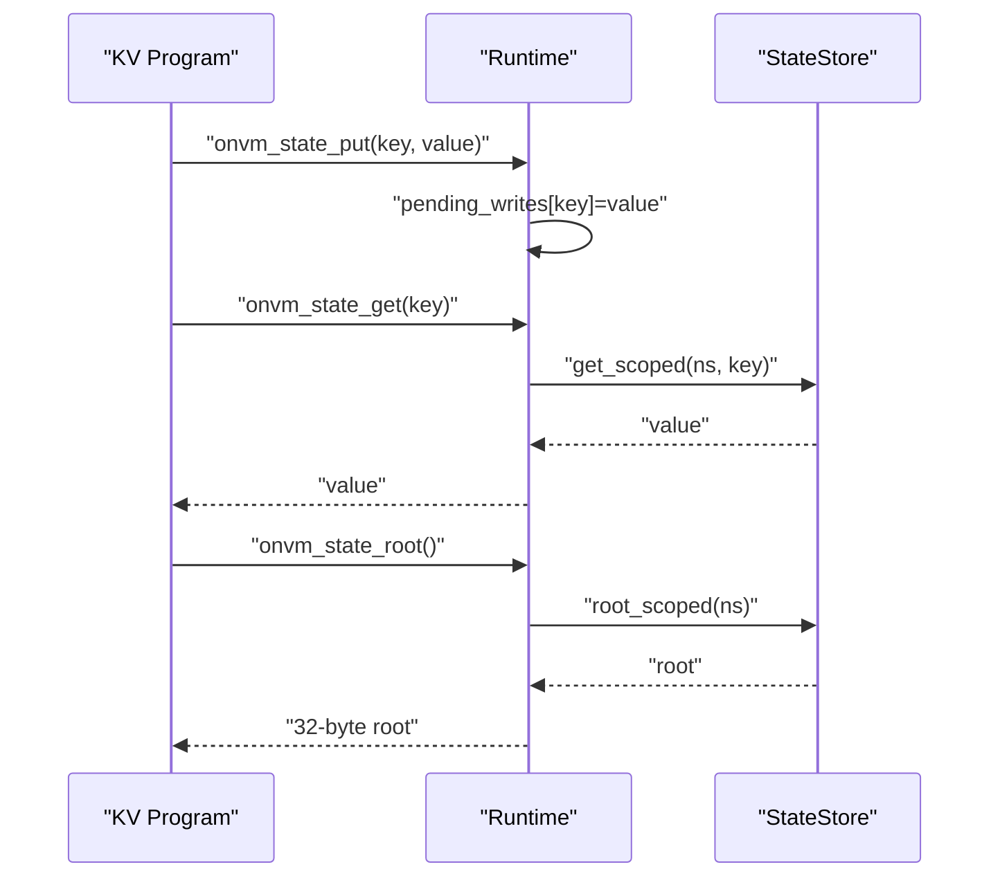

**Diagram sources**
- [kvstore/lib.rs](file://wasm_programs/kvstore/src/lib.rs#L75-L187)
- [runtime.rs](file://src/execution/runtime.rs#L270-L377)
- [state_store.rs](file://src/storage/state_store.rs#L17-L40)

**Section sources**
- [kvstore/lib.rs](file://wasm_programs/kvstore/src/lib.rs#L75-L187)
- [analytics/lib.rs](file://wasm_programs/analytics/src/lib.rs#L1-L167)

## Architecture Overview
StateStore is initialized at node startup and shared across execution and consensus. Programs operate within their own namespace, and execution applies pending writes deterministically after successful runs.

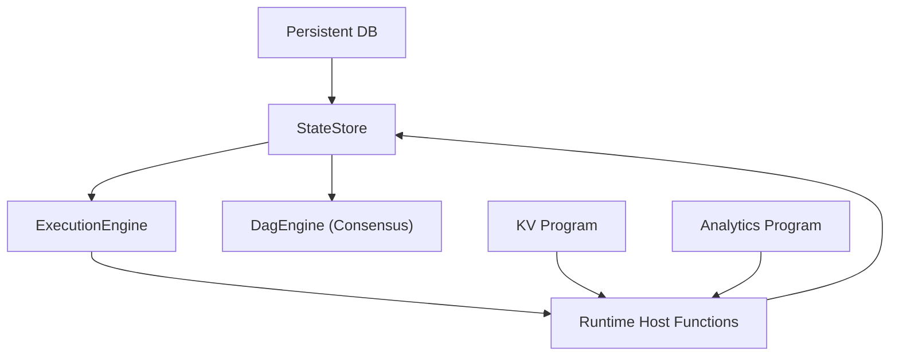

**Diagram sources**
- [node.rs](file://src/node.rs#L37-L56)
- [runtime.rs](file://src/execution/runtime.rs#L270-L377)
- [state_store.rs](file://src/storage/state_store.rs#L1-L48)

**Section sources**
- [node.rs](file://src/node.rs#L37-L56)
- [runtime.rs](file://src/execution/runtime.rs#L270-L377)
- [state_store.rs](file://src/storage/state_store.rs#L1-L48)

## Detailed Component Analysis

### Public Interfaces and Atomic Batch Operations
- get_scoped(ns, key): Reads a value under a namespace.
- set_scoped(ns, key, value): Writes a value under a namespace and flushes to disk.
- root_scoped(ns): Computes a deterministic state root over all key-value pairs in the namespace.

Atomicity and batches:
- set_scoped performs a single insert and flush per write.
- There is no explicit multi-operation atomic batch API in the current implementation. Pending writes are applied deterministically after execution as a batch keyed by program_id.

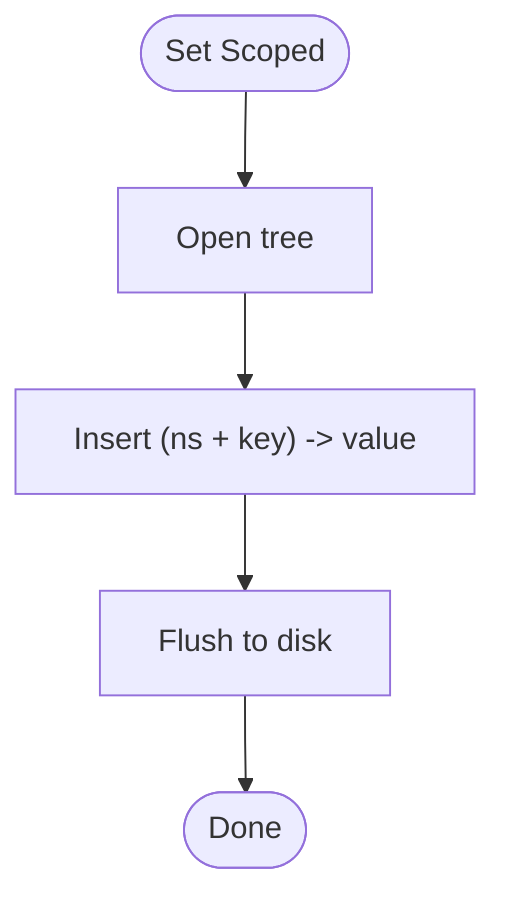

**Diagram sources**
- [state_store.rs](file://src/storage/state_store.rs#L17-L27)

**Section sources**
- [state_store.rs](file://src/storage/state_store.rs#L17-L27)

### State Key Encoding and Value Serialization
- Key encoding: Keys are stored as a concatenation of namespace and key. This ensures hierarchical scoping and efficient prefix scanning.
- Value serialization: Values are stored as raw bytes. The runtime and programs treat values as opaque binary data. Serialization for persistence elsewhere (e.g., ComputeOp) is handled by the types module.

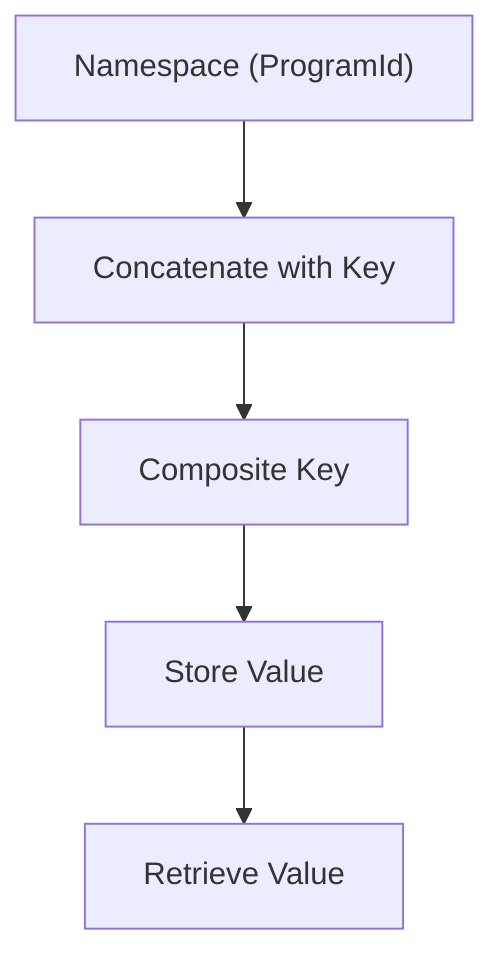

**Diagram sources**
- [state_store.rs](file://src/storage/state_store.rs#L43-L48)
- [types.rs](file://src/types.rs#L17-L31)

**Section sources**
- [state_store.rs](file://src/storage/state_store.rs#L43-L48)
- [types.rs](file://src/types.rs#L17-L31)

### Version Vector and Conflict Detection
- Current implementation does not include a version vector or explicit conflict detection mechanism in StateStore.
- State roots are computed per namespace and used by consensus to verify state consistency across peers.
- Pending writes overlay ensures deterministic application order during execution.

Implications:
- No explicit MVCC or vector clocks are present.
- Consensus relies on state roots and recorded state_writes to detect inconsistencies across nodes.

**Section sources**
- [runtime.rs](file://src/execution/runtime.rs#L143-L183)
- [types.rs](file://src/types.rs#L17-L31)

### Usage Patterns
- Transactional updates: Pending writes overlay acts as a per-execution transactional buffer. After execution, pending writes are applied deterministically by sorting keys and writing to the store.
- State snapshots for restarts: The state root per namespace can be used to verify state consistency across restarts. Programs can persist snapshot identifiers and recompute roots as needed.
- Consistency guarantees: Consensus captures state roots and writes, enabling cross-node verification and recovery.

**Section sources**
- [runtime.rs](file://src/execution/runtime.rs#L143-L183)
- [state_store.rs](file://src/storage/state_store.rs#L29-L40)

### Integration with Execution and Networking
- Execution: The runtime links host functions for state access and computes state roots including pending writes. After execution, pending writes are applied to the store deterministically.
- Networking: Consensus uses state roots and state_writes to broadcast and verify execution outcomes across peers.

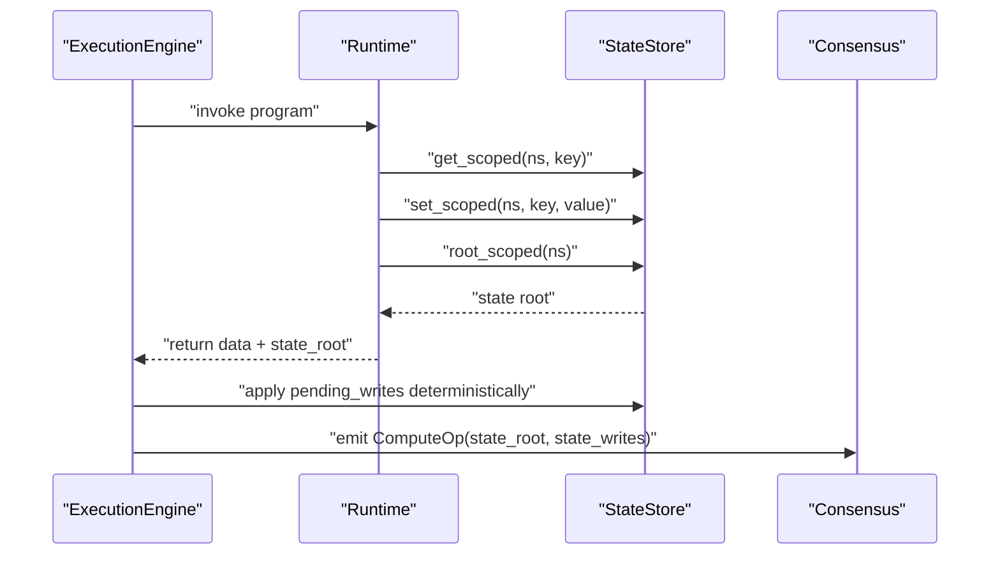

**Diagram sources**
- [runtime.rs](file://src/execution/runtime.rs#L143-L183)
- [state_store.rs](file://src/storage/state_store.rs#L17-L40)
- [types.rs](file://src/types.rs#L17-L31)

**Section sources**
- [runtime.rs](file://src/execution/runtime.rs#L143-L183)
- [state_store.rs](file://src/storage/state_store.rs#L17-L40)
- [types.rs](file://src/types.rs#L17-L31)

## Dependency Analysis
- StateStore depends on the persistent database and uses hashing utilities for state root computation.
- Runtime depends on StateStore for state access and on types for state write structures.
- Node initializes StateStore and shares it with ExecutionEngine and DagEngine.
- WASM programs depend on runtime host functions for state access.

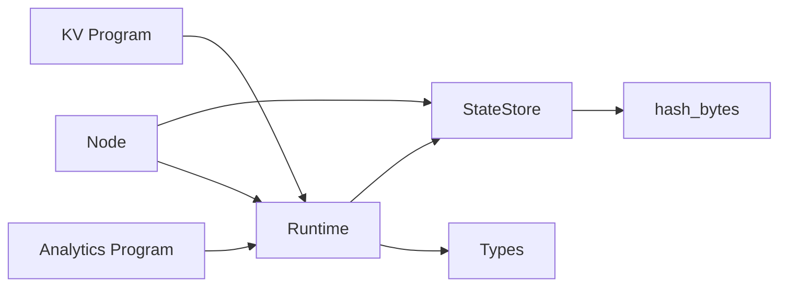

**Diagram sources**
- [state_store.rs](file://src/storage/state_store.rs#L1-L48)
- [runtime.rs](file://src/execution/runtime.rs#L270-L377)
- [types.rs](file://src/types.rs#L17-L31)
- [node.rs](file://src/node.rs#L37-L56)
- [kvstore/lib.rs](file://wasm_programs/kvstore/src/lib.rs#L75-L187)
- [analytics/lib.rs](file://wasm_programs/analytics/src/lib.rs#L1-L167)

**Section sources**
- [state_store.rs](file://src/storage/state_store.rs#L1-L48)
- [runtime.rs](file://src/execution/runtime.rs#L270-L377)
- [types.rs](file://src/types.rs#L17-L31)
- [node.rs](file://src/node.rs#L37-L56)
- [kvstore/lib.rs](file://wasm_programs/kvstore/src/lib.rs#L75-L187)
- [analytics/lib.rs](file://wasm_programs/analytics/src/lib.rs#L1-L167)

## Performance Considerations
- Sled tree partitioning: StateStore uses a single named tree for contract state. Consider partitioning by namespace or program_id to reduce hotspots and improve concurrency.
- Write amplification reduction: Frequent flushes occur on each write. Batch writes within a single execution to minimize flush overhead.
- Cache efficiency: Frequently accessed keys benefit from caching at the application layer. Consider maintaining an LRU cache for hot keys in the runtime overlay.
- State root computation: root_scoped sorts pairs and recomputes the Merkle root. For large namespaces, consider incremental updates or partial recomputation strategies.

[No sources needed since this section provides general guidance]

## Troubleshooting Guide
Common issues and resolutions:
- State bloat: Large namespaces increase state root computation cost. Periodically prune unused keys or split namespaces by logical partitions.
- Version conflicts: Without explicit version vectors, rely on deterministic execution and state roots to detect inconsistencies. Ensure pending writes are applied consistently after execution.
- Schema migration challenges: Since values are raw bytes, introduce version prefixes or metadata in keys/values to support schema evolution. Maintain compatibility by reading older formats.

**Section sources**
- [state_store.rs](file://src/storage/state_store.rs#L29-L40)
- [runtime.rs](file://src/execution/runtime.rs#L143-L183)

## Conclusion
The state storage subsystem provides a robust, namespace-scoped key-value store with deterministic state roots suitable for execution and consensus. While there is no explicit version vector, the combination of pending writes overlay, deterministic application order, and state roots enables strong consistency guarantees. Future enhancements could include atomic batch operations, version vectors, and improved partitioning strategies for scalability.

[No sources needed since this section summarizes without analyzing specific files]

## Appendices

### Example Workflows
- Storing kvstore program state: The KV program uses onvm_state_put and onvm_state_get to manage key-value pairs and maintain a key index.
- Maintaining analytics computation results: The analytics program computes statistics and stores results in a buffer for later retrieval.

**Section sources**
- [kvstore/lib.rs](file://wasm_programs/kvstore/src/lib.rs#L75-L187)
- [analytics/lib.rs](file://wasm_programs/analytics/src/lib.rs#L1-L167)