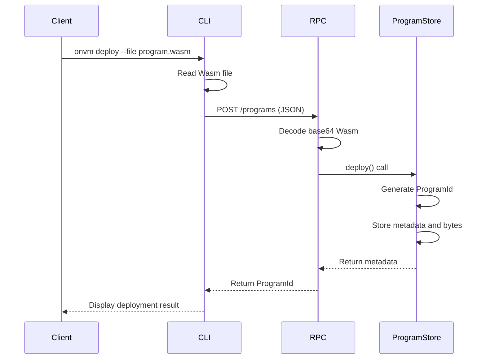
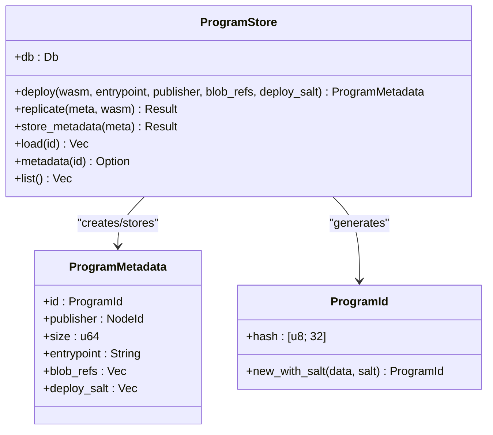
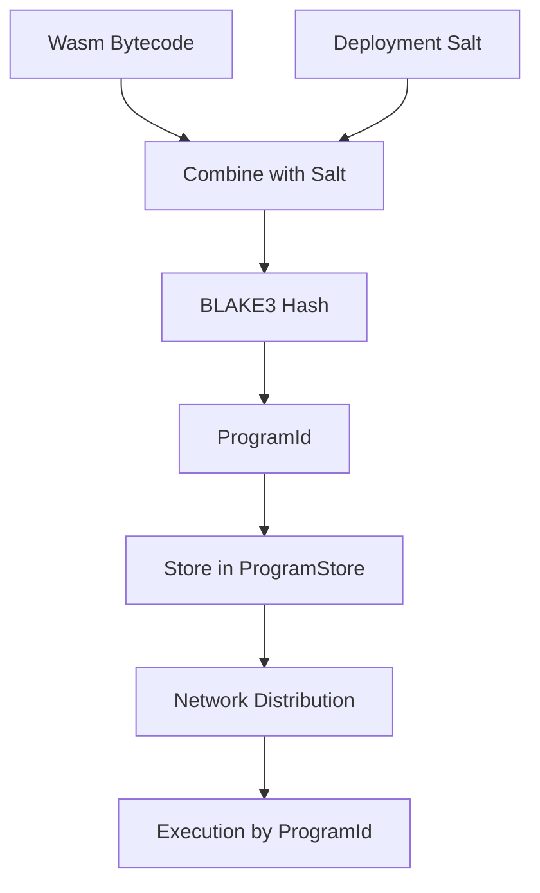
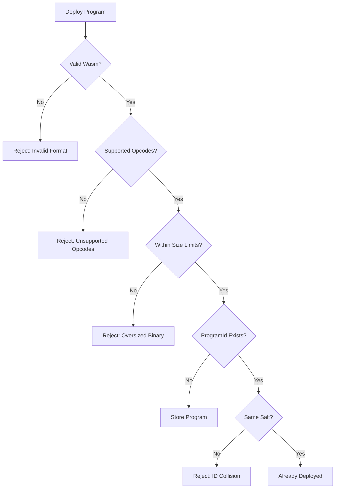

# Deployment Workflow

<cite>
**Referenced Files in This Document**   
- [cli.rs](file://src/cli.rs)
- [program_store.rs](file://src/execution/program_store.rs)
- [mod.rs](file://src/rpc/mod.rs)
- [types.rs](file://src/types.rs)
- [hashing.rs](file://src/crypto/hashing.rs)
- [echo/lib.rs](file://wasm_programs/echo/src/lib.rs)
- [kvstore/lib.rs](file://wasm_programs/kvstore/src/lib.rs)
- [analytics/lib.rs](file://wasm_programs/analytics/src/lib.rs)
- [echo/Cargo.toml](file://wasm_programs/echo/Cargo.toml)
- [kvstore/Cargo.toml](file://wasm_programs/kvstore/Cargo.toml)
- [analytics/Cargo.toml](file://wasm_programs/analytics/Cargo.toml)
</cite>

## Table of Contents
1. [Introduction](#introduction)
2. [Wasm Compilation and Optimization](#wasm-compilation-and-optimization)
3. [Program Metadata Requirements](#program-metadata-requirements)
4. [Deployment Methods](#deployment-methods)
5. [ProgramStore Architecture](#programstore-architecture)
6. [Content Addressing and Cryptographic Hashing](#content-addressing-and-cryptographic-hashing)
7. [Example Deployments](#example-deployments)
8. [Common Deployment Issues](#common-deployment-issues)
9. [Program Lifecycle Management](#program-lifecycle-management)
10. [Best Practices](#best-practices)

## Introduction
The ONVM (Open Network Virtual Machine) platform enables secure, decentralized execution of WebAssembly (Wasm) programs across a peer-to-peer network. This document details the complete deployment workflow for Wasm programs in ONVM, covering the entire process from source code compilation to on-chain execution. The workflow involves compiling Rust code to Wasm bytecode, optimizing binaries, generating program metadata, and deploying through either CLI commands or RPC endpoints. The system ensures program integrity through cryptographic hashing and content addressing, with the ProgramStore component responsible for validation and persistence of deployed programs.

## Wasm Compilation and Optimization
The deployment process begins with compiling Rust source code into Wasm bytecode. This requires targeting the `wasm32-unknown-unknown` architecture, which produces standalone Wasm binaries without dependencies on specific operating system features.

The compilation process follows these steps:
1. Configure the Cargo.toml with appropriate settings for Wasm output
2. Compile using `cargo build --target wasm32-unknown-unknown --release`
3. Optimize the resulting binary using `wasm-opt` for size and performance
4. Extract the final Wasm artifact from the target directory

Wasm programs in ONVM are configured as `cdylib` (C dynamic library) crates, which generates the appropriate output format for Wasm execution. The release profile includes several optimization settings:
- `lto = true`: Enables Link Time Optimization for maximum performance
- `opt-level = "z"`: Optimizes for size, crucial for network transmission
- `panic = "abort"`: Reduces binary size by using minimal panic handling
- `strip = true`: Removes debug symbols to minimize file size
- `codegen-units = 1`: Enables full optimization across the entire crate

The compiled Wasm binaries are stored in the `target/wasm32-unknown-unknown/release/` directory, following the naming convention `onvm_<program_name>.wasm`. These optimized binaries are then ready for deployment to the ONVM network.

**Section sources**
- [echo/Cargo.toml](file://wasm_programs/echo/Cargo.toml#L1-L19)
- [kvstore/Cargo.toml](file://wasm_programs/kvstore/Cargo.toml#L1-L22)
- [analytics/Cargo.toml](file://wasm_programs/analytics/Cargo.toml#L1-L24)

## Program Metadata Requirements
Each Wasm program deployed to ONVM requires metadata that defines its execution parameters and dependencies. The metadata structure, defined in `ProgramMetadata`, contains essential information for program validation and execution:

```rust
pub struct ProgramMetadata {
    pub id: ProgramId,
    pub publisher: NodeId,
    pub size: u64,
    pub entrypoint: String,
    pub blob_refs: Vec<BlobId>,
    pub deploy_salt: Vec<u8>,
}
```

Key metadata fields include:
- **Entrypoint**: Specifies the exported function name that serves as the program's entry point (typically `onvm_main`)
- **Blob references**: Lists dependencies on external data blobs required by the program
- **Deploy salt**: A unique salt value used to generate the program's cryptographic identifier
- **Size**: The byte size of the Wasm binary
- **Publisher**: The NodeId of the entity deploying the program

The entrypoint must be a function with the signature `(i32, i32) -> (i32, i32)`, where the parameters represent the pointer and length of input data in linear memory, and the return values represent the pointer and length of output data. This convention allows the runtime to manage memory allocation and data transfer between the host and guest environments.

**Section sources**
- [types.rs](file://src/types.rs#L33-L41)

## Deployment Methods
ONVM supports two primary methods for deploying Wasm programs: CLI commands and RPC endpoint integration. Both methods ultimately perform the same operations but provide different interfaces for integration and automation.

### CLI Deployment
The ONVM CLI provides a straightforward command-line interface for program deployment:

```bash
onvm deploy <wasm_file> --entrypoint <function_name> --rpc <endpoint>
```

The CLI command accepts several parameters:
- `--file`: Path to the compiled Wasm binary
- `--entrypoint`: Name of the exported function to use as the entry point
- `--rpc`: Address of the ONVM node's RPC endpoint
- `--blob-refs`: Optional list of blob identifiers that the program depends on
- `--salt`: Optional base64-encoded salt for generating a unique ProgramId

When no salt is provided, the CLI generates a random UUID as the salt value, ensuring a unique ProgramId even for identical Wasm binaries.

### RPC Endpoint Integration
For programmatic deployment, ONVM exposes an HTTP RPC endpoint that accepts JSON payloads. The deployment endpoint is accessible at `/programs` via POST requests with the following structure:

```json
{
  "wasm_base64": "base64-encoded-wasm-binary",
  "entrypoint": "onvm_main",
  "blob_refs": ["hex-encoded-blob-id1", "hex-encoded-blob-id2"],
  "salt_base64": "base64-encoded-salt"
}
```

The RPC endpoint decodes the base64-encoded Wasm binary and salt, validates the program, and returns the generated ProgramId. This method enables integration with CI/CD pipelines, web interfaces, and other automated deployment systems.



**Diagram sources**
- [cli.rs](file://src/cli.rs#L60-L76)
- [mod.rs](file://src/rpc/mod.rs#L37-L48)
- [program_store.rs](file://src/execution/program_store.rs#L16-L41)

**Section sources**
- [cli.rs](file://src/cli.rs#L60-L76)
- [mod.rs](file://src/rpc/mod.rs#L37-L48)

## ProgramStore Architecture
The ProgramStore component, implemented in `src/execution/program_store.rs`, is responsible for managing the lifecycle of deployed Wasm programs. It serves as the persistence layer for program binaries and metadata, ensuring integrity and availability across the network.

The ProgramStore architecture consists of two primary sled database trees:
- **programs**: Stores serialized `ProgramMetadata` objects indexed by ProgramId
- **program_bytes**: Stores the raw Wasm bytecode indexed by ProgramId

This separation allows for efficient metadata queries without loading potentially large Wasm binaries into memory. The ProgramStore provides several key operations:

- `deploy()`: Registers a new program with validation and persistence
- `replicate()`: Stores a program received from another node with integrity verification
- `store_metadata()`: Stores only the metadata for discovery purposes
- `load()`: Retrieves the Wasm bytecode for execution
- `metadata()`: Retrieves program metadata by ProgramId
- `list()`: Returns all known program metadata

The deployment process involves generating a ProgramId from the Wasm bytecode and salt, creating the metadata object, and storing both the metadata and bytecode in their respective database trees. All operations are followed by a flush to ensure data persistence.



**Diagram sources**
- [program_store.rs](file://src/execution/program_store.rs#L6-L95)

**Section sources**
- [program_store.rs](file://src/execution/program_store.rs#L6-L95)

## Content Addressing and Cryptographic Hashing
ONVM employs content addressing through cryptographic hashing to ensure program integrity and enable efficient distribution. Each program is identified by a `ProgramId`, which is a 32-byte BLAKE3 hash derived from the Wasm bytecode and a deployment salt.

The hashing process uses the BLAKE3 algorithm implemented in `src/crypto/hashing.rs`:

```rust
pub fn hash_bytes(data: &[u8]) -> [u8; 32] {
    let mut hasher = Hasher::new();
    hasher.update(data);
    *hasher.finalize().as_bytes()
}
```

The `ProgramId::new_with_salt()` method combines the Wasm bytecode and salt before hashing:

```rust
pub fn new_with_salt(data: &[u8], salt: &[u8]) -> Self {
    let mut combined = Vec::with_capacity(data.len() + salt.len());
    combined.extend_from_slice(data);
    combined.extend_from_slice(salt);
    Self(hash_bytes(&combined))
}
```

This approach provides several security and operational benefits:
- **Content integrity**: Any modification to the Wasm bytecode results in a different ProgramId
- **Deterministic addressing**: The same bytecode and salt always produce the same ProgramId
- **Collision resistance**: The salt prevents accidental or malicious collisions
- **Tamper detection**: Nodes can verify program integrity by recalculating the hash

The use of cryptographic hashing enables content-based addressing, where programs are referenced by their hash rather than location. This supports decentralized distribution, as any node can verify and serve a program based on its identifier.



**Diagram sources**
- [hashing.rs](file://src/crypto/hashing.rs#L1-L8)
- [types.rs](file://src/types.rs#L60-L65)

**Section sources**
- [hashing.rs](file://src/crypto/hashing.rs#L1-L8)
- [types.rs](file://src/types.rs#L55-L66)

## Example Deployments
This section demonstrates the deployment process for two example programs included in the ONVM repository: the echo program and the kvstore program.

### Echo Program Deployment
The echo program is a simple Wasm module that converts input text to uppercase. To deploy this program:

1. Compile the program:
```bash
cd wasm_programs/echo
cargo build --target wasm32-unknown-unknown --release
```

2. Deploy using the CLI:
```bash
onvm deploy --file target/wasm32-unknown-unknown/release/onvm_echo.wasm --entrypoint onvm_main --rpc 127.0.0.1:8080
```

The echo program's entrypoint function (`onvm_main`) follows the standard ONVM interface, accepting input through linear memory and returning output in the same manner. It uses a static output buffer to minimize memory allocation overhead.

### KVStore Program Deployment
The kvstore program provides a key-value storage interface with JSON-based requests and responses. Deployment follows the same pattern:

1. Compile the program:
```bash
cd wasm_programs/kvstore
cargo build --target wasm32-unknown-unknown --release
```

2. Deploy with the appropriate entrypoint:
```bash
onvm deploy --file target/wasm32-unknown-unknown/release/onvm_kvstore.wasm --entrypoint onvm_main --rpc 127.0.0.1:8080
```

The kvstore program demonstrates more complex functionality, including:
- JSON parsing of input requests
- Base64 encoding/decoding for binary data
- State management through the ONVM state API
- Multiple operations (put, get, list, clear, stats)

Both programs are configured with optimal release profiles to minimize binary size and maximize execution efficiency.

**Section sources**
- [echo/lib.rs](file://wasm_programs/echo/src/lib.rs#L1-L57)
- [kvstore/lib.rs](file://wasm_programs/kvstore/src/lib.rs#L1-L240)
- [echo/Cargo.toml](file://wasm_programs/echo/Cargo.toml#L1-L19)
- [kvstore/Cargo.toml](file://wasm_programs/kvstore/Cargo.toml#L1-L22)

## Common Deployment Issues
Several common issues may arise during the Wasm program deployment process. Understanding these issues and their solutions is crucial for successful deployment.

### Invalid Wasm Format
Programs must be compiled for the `wasm32-unknown-unknown` target. Using the wrong target or including incompatible dependencies will result in invalid Wasm format. Ensure the Cargo.toml specifies `crate-type = ["cdylib"]` and avoid dependencies that require OS-specific features.

### Unsupported Opcodes
ONVM's Wasm runtime may not support all Wasm opcodes. Programs should stick to the core Wasm specification and avoid experimental or non-standard features. The runtime uses wasmtime, which supports the WebAssembly 2.0 specification.

### Oversized Binaries
Large Wasm binaries can exceed network or storage limits. The release profile optimizations (`opt-level = "z"`, `strip = true`, etc.) are essential for minimizing binary size. Additionally, avoid including unnecessary dependencies and use feature flags to exclude unused functionality.

### Duplicate Program IDs
Attempting to deploy a program with an existing ProgramId will fail. This can occur when redeploying the same bytecode without changing the salt. To deploy a new version of a program, either modify the bytecode or provide a different salt value.

The system prevents ID collisions by verifying that any existing program with the same ID has the same deploy salt. This ensures that only identical deployments can share an ID, preventing accidental overwrites.



**Diagram sources**
- [program_store.rs](file://src/execution/program_store.rs#L24-L32)
- [mod.rs](file://src/rpc/mod.rs#L137-L153)

**Section sources**
- [program_store.rs](file://src/execution/program_store.rs#L16-L41)
- [mod.rs](file://src/rpc/mod.rs#L133-L174)

## Program Lifecycle Management
Effective program lifecycle management is essential for maintaining a healthy ONVM network. This includes versioning strategies, update procedures, and deprecation policies.

### Versioning Deployed Programs
Since ProgramIds are content-addressed, each unique bytecode generates a unique identifier. This creates a natural versioning system where different versions of a program coexist with distinct IDs. Applications should maintain registries or configuration files that map logical program names to their current ProgramIds.

For example:
```json
{
  "kvstore": "a1b2c3d4e5f67890...",
  "analytics": "f0e1d2c3b4a59687..."
}
```

### Update Procedures
To update a program, deploy the new version and update references to point to the new ProgramId. The old version remains available, allowing for gradual migration and rollback if needed. This approach supports blue-green deployment patterns and minimizes downtime.

### Deprecation and Cleanup
Currently, ONVM does not support program deletion. Deprecated programs remain in the system indefinitely. This immutability ensures that historical executions can be reproduced and verified. However, nodes may implement garbage collection policies for programs that are no longer referenced or executed.

The consensus layer tracks program usage through the program index, which records which nodes have deployed each program. This information can inform cleanup decisions in future versions.

**Section sources**
- [consensus/mod.rs](file://src/consensus/mod.rs#L273-L292)
- [program_store.rs](file://src/execution/program_store.rs#L43-L55)

## Best Practices
Adhering to best practices ensures reliable, efficient, and secure program deployment in ONVM.

### Compilation Optimization
Always use the release profile with size optimization (`opt-level = "z"`) to minimize network transmission time and storage requirements. Enable LTO and strip debug symbols to further reduce binary size.

### Memory Management
Use static buffers or object pools to minimize memory allocation during execution. The echo program's use of `Once<Mutex<Vec<u8>>>` demonstrates an efficient pattern for reusing memory across invocations.

### Error Handling
Implement robust error handling in Wasm programs, as panics will terminate execution. Use the `panic_handler` to ensure clean failure rather than undefined behavior.

### Security Considerations
Validate all inputs and sanitize outputs to prevent injection attacks. When handling sensitive data, ensure proper encryption and access controls at the application level.

### Testing and Validation
Test programs thoroughly in a local environment before deployment. Use the `onvm program_info` command to verify deployment success and inspect program metadata.

### Monitoring and Observability
Monitor program execution metrics such as fuel consumption and execution time. Use the execution logs to identify performance bottlenecks and optimize critical paths.

By following these best practices, developers can create efficient, reliable, and secure Wasm programs for the ONVM platform.

**Section sources**
- [echo/lib.rs](file://wasm_programs/echo/src/lib.rs#L1-L57)
- [kvstore/lib.rs](file://wasm_programs/kvstore/src/lib.rs#L1-L240)
- [analytics/lib.rs](file://wasm_programs/analytics/src/lib.rs#L1-L167)
- [program_store.rs](file://src/execution/program_store.rs#L16-L41)