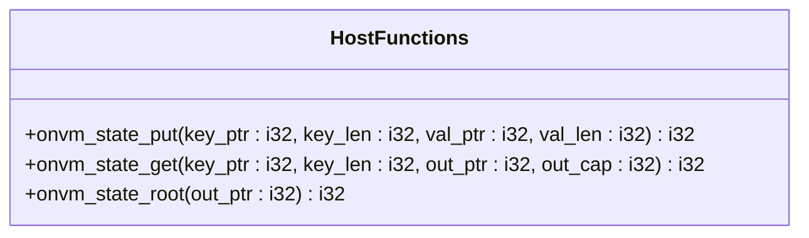
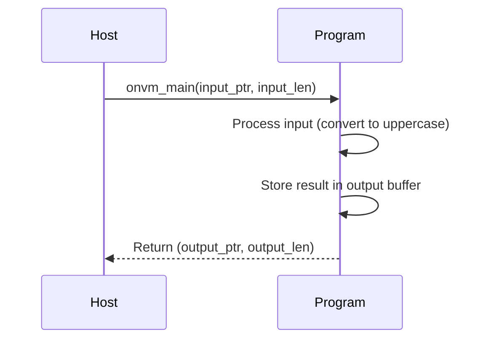
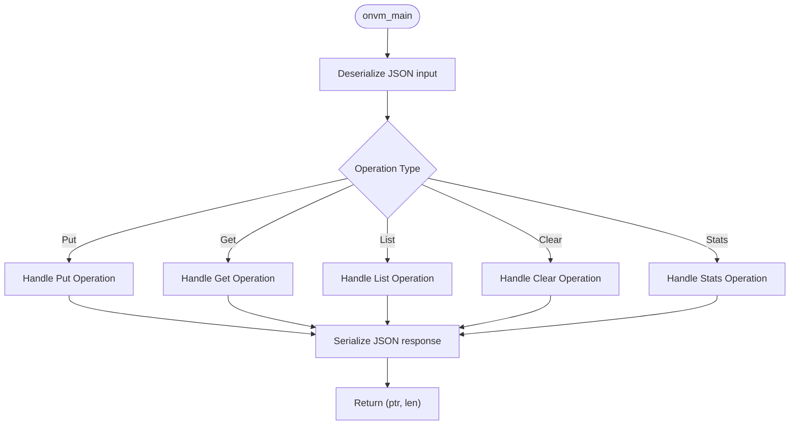
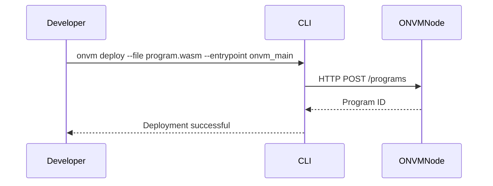

# Developer Guide

<cite>
**Referenced Files in This Document**   
- [Cargo.toml](file://Cargo.toml)
- [wasm_programs/echo/Cargo.toml](file://wasm_programs/echo/Cargo.toml)
- [wasm_programs/echo/src/lib.rs](file://wasm_programs/echo/src/lib.rs)
- [wasm_programs/kvstore/Cargo.toml](file://wasm_programs/kvstore/Cargo.toml)
- [wasm_programs/kvstore/src/lib.rs](file://wasm_programs/kvstore/src/lib.rs)
- [wasm_programs/analytics/Cargo.toml](file://wasm_programs/analytics/Cargo.toml)
- [wasm_programs/analytics/src/lib.rs](file://wasm_programs/analytics/src/lib.rs)
- [src/execution/runtime.rs](file://src/execution/runtime.rs)
- [src/execution/program_store.rs](file://src/execution/program_store.rs)
- [src/cli.rs](file://src/cli.rs)
</cite>

## Table of Contents
1. [Introduction](#introduction)
2. [Development Workflow](#development-workflow)
3. [Host Functions and Security Constraints](#host-functions-and-security-constraints)
4. [Example Programs](#example-programs)
5. [Testing Strategies](#testing-strategies)
6. [Deployment Process](#deployment-process)
7. [Common Issues](#common-issues)
8. [Performance Optimization](#performance-optimization)
9. [Debugging Tools](#debugging-tools)

## Introduction
This guide provides comprehensive documentation for developing, testing, and deploying WebAssembly (Wasm) programs for the Open Network Virtual Machine (ONVM). The ONVM platform enables secure execution of Wasm programs with access to host functions for storage, logging, and other operations. This document covers the complete development lifecycle from initial setup to production deployment.

## Development Workflow

The development workflow for ONVM Wasm programs follows a structured approach that ensures compatibility, security, and performance. Developers create Rust crates targeting the `wasm32-unknown-unknown` architecture, which are then compiled to WebAssembly bytecode for execution within the ONVM runtime.

The workflow begins with creating a new Rust library project configured for Wasm compilation. The project must use `serde` for input/output serialization to ensure proper data exchange between the host and guest environments. Programs access host functionality through defined foreign functions that provide controlled access to system resources.

Key aspects of the development workflow include:
- Setting up the Rust project with appropriate Wasm configuration
- Implementing the required entry point function (`onvm_main`)
- Using `serde` for structured data serialization
- Accessing host functions through defined interfaces
- Managing memory efficiently within Wasm constraints

**Section sources**
- [wasm_programs/echo/Cargo.toml](file://wasm_programs/echo/Cargo.toml)
- [wasm_programs/echo/src/lib.rs](file://wasm_programs/echo/src/lib.rs)
- [wasm_programs/kvstore/Cargo.toml](file://wasm_programs/kvstore/Cargo.toml)
- [wasm_programs/kvstore/src/lib.rs](file://wasm_programs/kvstore/src/lib.rs)

## Host Functions and Security Constraints

ONVM provides a set of host functions that Wasm programs can call to interact with the runtime environment. These functions are exposed through the WebAssembly import mechanism and provide controlled access to system resources while maintaining security boundaries.

The primary host functions available to Wasm programs are:

### Storage Access Functions


**Diagram sources**
- [src/execution/runtime.rs](file://src/execution/runtime.rs#L246-L376)
- [wasm_programs/kvstore/src/lib.rs](file://wasm_programs/kvstore/src/lib.rs#L235-L240)

The storage functions provide key-value storage capabilities scoped to the executing program:
- `onvm_state_put`: Writes data to persistent storage
- `onvm_state_get`: Reads data from persistent storage
- `onvm_state_root`: Retrieves the cryptographic state root

Security constraints for storage access include:
- All storage operations are scoped to the program's namespace
- Maximum key size limited to prevent abuse
- Memory access bounds checking to prevent buffer overflows
- Write operations are queued and applied deterministically

### Security Model
The ONVM runtime enforces strict security constraints on Wasm program execution:
- Programs run in a sandboxed environment with no direct system access
- All host function calls are validated for memory safety
- Fuel-based execution limits prevent infinite loops
- Cross-program access requires explicit permissions
- Cryptographic verification of program identity

**Section sources**
- [src/execution/runtime.rs](file://src/execution/runtime.rs#L1-L377)
- [wasm_programs/kvstore/src/lib.rs](file://wasm_programs/kvstore/src/lib.rs#L148-L240)

## Example Programs

The ONVM repository includes several example programs that demonstrate best practices and common patterns for Wasm development.

### Echo Program
The echo program is the simplest example, demonstrating basic Wasm program structure and execution flow.



**Diagram sources**
- [wasm_programs/echo/src/lib.rs](file://wasm_programs/echo/src/lib.rs#L26-L43)

Key features of the echo program:
- Uses `wee_alloc` for minimal memory allocation
- Implements `onvm_main` entry point with proper signature
- Manages output buffer with `spin::Once` for initialization
- Handles memory safety with proper pointer casting

### KV Store Program
The key-value store program demonstrates more complex state management and data serialization.



**Diagram sources**
- [wasm_programs/kvstore/src/lib.rs](file://wasm_programs/kvstore/src/lib.rs#L39-L56)

The KV store program showcases:
- Complex data structures with serde serialization
- State management with key indexing
- Error handling with descriptive messages
- Efficient memory usage patterns

### Analytics Program
The analytics program demonstrates computational operations and data processing.

Key features:
- Text analysis with tokenization and frequency counting
- Numerical statistics computation
- Optional data compression
- Regular expression processing

**Section sources**
- [wasm_programs/echo/src/lib.rs](file://wasm_programs/echo/src/lib.rs)
- [wasm_programs/kvstore/src/lib.rs](file://wasm_programs/kvstore/src/lib.rs)
- [wasm_programs/analytics/src/lib.rs](file://wasm_programs/analytics/src/lib.rs)

## Testing Strategies

Effective testing is critical for ensuring Wasm program correctness and reliability. ONVM supports multiple testing approaches at different levels of the development lifecycle.

### Unit Testing
Unit testing is performed locally using standard Rust testing tools. Developers can write tests that validate individual functions and components in isolation.

Best practices for unit testing:
- Test serialization/deserialization logic
- Validate error handling paths
- Verify computational correctness
- Test edge cases and boundary conditions

### Integration Testing
Integration testing involves running the Wasm program within a local ONVM node to test interactions with the runtime environment.

Integration testing workflow:
1. Start a local ONVM node
2. Deploy the Wasm program using the CLI
3. Execute the program with test inputs
4. Verify outputs and state changes
5. Clean up test state

Example test inputs for the KV store program:
- [wasm_programs/kvstore/kv_put.json](file://wasm_programs/kvstore/kv_put.json)
- [wasm_programs/kvstore/kv_get.json](file://wasm_programs/kvstore/kv_get.json)
- [wasm_programs/kvstore/kv_clear.json](file://wasm_programs/kvstore/kv_clear.json)

### Debugging Approach
The testing framework should include:
- Comprehensive test coverage of all program paths
- Performance benchmarking
- Memory usage analysis
- Fuzz testing for input validation

**Section sources**
- [src/cli.rs](file://src/cli.rs#L77-L90)
- [wasm_programs/kvstore/kv_put.json](file://wasm_programs/kvstore/kv_put.json)
- [wasm_programs/kvstore/kv_get.json](file://wasm_programs/kvstore/kv_get.json)
- [wasm_programs/kvstore/kv_clear.json](file://wasm_programs/kvstore/kv_clear.json)

## Deployment Process

The deployment process for ONVM Wasm programs involves several steps from compilation to execution.

### Compilation
Programs are compiled to Wasm bytecode using the Rust toolchain:

```bash
cargo build --target wasm32-unknown-unknown --release
```

The compilation process includes optimizations specified in the Cargo.toml profile:
- Link-time optimization (LTO)
- Size-optimized compilation (opt-level = "z")
- Panic handling set to abort
- Code stripping for minimal size
- Single code generation unit

### Upload Methods
Programs can be deployed through two primary methods:

#### CLI Deployment


**Diagram sources**
- [src/cli.rs](file://src/cli.rs#L191-L220)

#### RPC Deployment
Programs can also be deployed programmatically using the ONVM RPC API:
- POST /programs endpoint accepts base64-encoded Wasm bytecode
- Response contains the generated ProgramId
- Authentication required for deployment

**Section sources**
- [src/cli.rs](file://src/cli.rs#L60-L76)
- [src/execution/program_store.rs](file://src/execution/program_store.rs#L16-L41)

## Common Issues

Developers may encounter several common issues when working with ONVM Wasm programs. Understanding these issues and their solutions is essential for productive development.

### Unsupported Wasm Features
Certain Wasm features are not supported by the ONVM runtime:
- Garbage collection (GC) features
- Exception handling (EH) features
- Multi-threading
- Reference types beyond basic pointers

Solutions:
- Target `wasm32-unknown-unknown` instead of other Wasm environments
- Avoid using unsupported Rust features
- Use alternative algorithms that don't require unsupported features

### Memory Limits
Wasm programs operate under strict memory constraints:
- Linear memory size limitations
- No dynamic memory growth allowed
- Stack size restrictions

Best practices:
- Pre-allocate buffers when possible
- Reuse memory instead of allocating new buffers
- Use efficient data structures
- Implement proper memory management

### Serialization Errors
Serialization issues commonly occur due to:
- Mismatched serde attributes
- Large data structures exceeding limits
- Invalid JSON formatting
- Type conversion errors

Prevention strategies:
- Validate input/output structures
- Use appropriate serde configuration
- Implement proper error handling
- Test with edge cases

**Section sources**
- [src/execution/runtime.rs](file://src/execution/runtime.rs#L106-L108)
- [wasm_programs/kvstore/src/lib.rs](file://wasm_programs/kvstore/src/lib.rs#L72)
- [wasm_programs/analytics/src/lib.rs](file://wasm_programs/analytics/src/lib.rs#L74)

## Performance Optimization

Optimizing Wasm program performance is critical for efficient execution within the ONVM environment.

### Startup Time Minimization
Reduce program initialization overhead by:
- Using `once_cell` for lazy initialization
- Pre-allocating buffers
- Minimizing startup computations
- Optimizing module loading

### Efficient State Access
Optimize state operations through:
- Batch operations when possible
- Caching frequently accessed data
- Minimizing round trips to storage
- Using efficient key naming schemes

### Batch Operations
Implement batch processing for improved efficiency:
- Combine multiple state operations
- Process data in chunks
- Minimize host function calls
- Optimize data serialization

Performance monitoring should include:
- Fuel consumption tracking
- Execution time measurement
- Memory usage analysis
- State operation counts

**Section sources**
- [src/execution/runtime.rs](file://src/execution/runtime.rs#L79-L183)
- [wasm_programs/analytics/src/lib.rs](file://wasm_programs/analytics/src/lib.rs#L87-L93)

## Debugging Tools

ONVM provides several tools to assist with debugging Wasm programs.

### Log Inspection
Runtime logs provide valuable debugging information:
- Execution traces
- Error messages
- Performance metrics
- State changes

Access logs through:
- Node console output
- Log files in data directory
- Structured logging with tracing

### RPC Status Queries
The RPC API provides status information:
- Program execution results
- State inspection
- Performance metrics
- Error details

Key RPC endpoints for debugging:
- GET /programs/{id} - Program metadata
- GET /status - Node status
- POST /execute - Test execution

### Execution Tracing
Enable detailed execution tracing to:
- Track function calls
- Monitor memory usage
- Identify performance bottlenecks
- Debug complex interactions

Tracing configuration:
- Set appropriate log levels
- Filter relevant components
- Capture structured data
- Analyze execution flow

**Section sources**
- [src/cli.rs](file://src/cli.rs#L100-L107)
- [src/execution/runtime.rs](file://src/execution/runtime.rs#L21-L27)