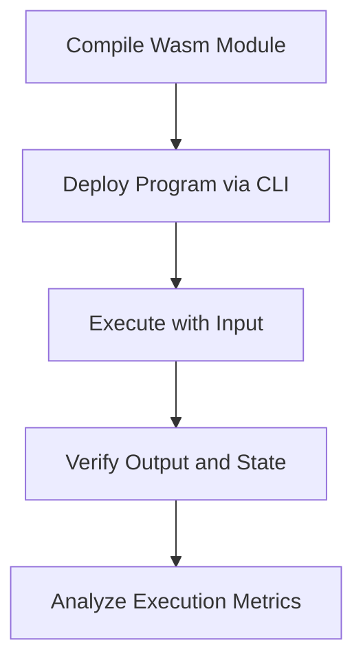
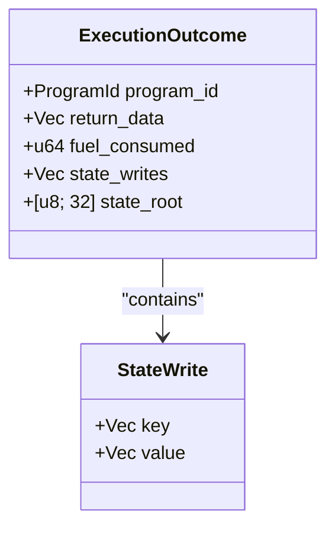
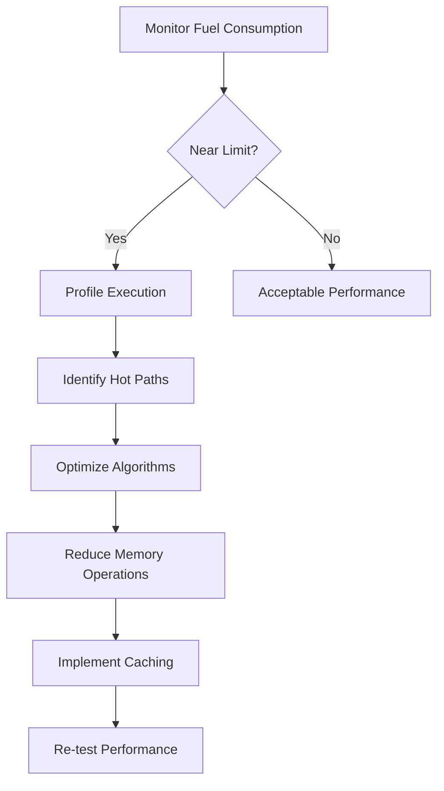

# Testing and Debugging

<cite>
**Referenced Files in This Document**   
- [cli.rs](file://src/cli.rs)
- [runtime.rs](file://src/execution/runtime.rs)
- [program_store.rs](file://src/execution/program_store.rs)
- [rpc/mod.rs](file://src/rpc/mod.rs)
- [state_store.rs](file://src/storage/state_store.rs)
- [types.rs](file://src/types.rs)
- [analytics/src/lib.rs](file://wasm_programs/analytics/src/lib.rs)
- [kvstore/src/lib.rs](file://wasm_programs/kvstore/src/lib.rs)
- [echo/src/lib.rs](file://wasm_programs/echo/src/lib.rs)
- [analytics_input.json](file://analytics_input.json)
- [kv_put.json](file://wasm_programs/kvstore/kv_put.json)
- [kv_get.json](file://wasm_programs/kvstore/kv_get.json)
- [kv_clear.json](file://wasm_programs/kvstore/kv_clear.json)
- [kv_stats.json](file://wasm_programs/kvstore/kv_stats.json)
- [list.json](file://wasm_programs/kvstore/list.json)
</cite>

## Table of Contents
1. [Introduction](#introduction)
2. [Local Unit Testing Strategies](#local-unit-testing-strategies)
3. [Integration Testing Workflows](#integration-testing-workflows)
4. [Debugging Techniques](#debugging-techniques)
5. [Error Code Interpretation](#error-code-interpretation)
6. [Execution Tracing and State Analysis](#execution-tracing-and-state-analysis)
7. [Common Debugging Scenarios](#common-debugging-scenarios)
8. [Performance Debugging](#performance-debugging)

## Introduction
This document provides comprehensive guidance on testing and debugging Wasm programs within the ONVM environment. It covers local unit testing strategies, integration testing workflows, debugging techniques, error code interpretation, execution tracing, and performance debugging. The ONVM platform enables secure execution of Wasm programs through a robust execution engine that manages program deployment, execution, and state persistence.

**Section sources**
- [cli.rs](file://src/cli.rs#L1-L300)
- [runtime.rs](file://src/execution/runtime.rs#L1-L377)

## Local Unit Testing Strategies
Local unit testing in the ONVM environment leverages standard Rust testing frameworks within the wasm_programs crates. Developers can write unit tests that validate individual functions and components of their Wasm programs before deployment. The testing approach focuses on verifying the correctness of program logic, input handling, and output generation in isolation from the ONVM runtime environment.

The wasm_programs directory contains multiple program implementations (analytics, kvstore, echo) that follow a consistent pattern of using Rust's standard testing facilities. Each program crate can include unit tests that validate specific functionality, such as input parsing, data processing algorithms, and serialization/deserialization logic. These tests run in the standard Rust testing environment and do not require the ONVM node to be running.

For example, the analytics program includes functionality for text analysis, tokenization, and statistical computation that can be tested independently. Similarly, the kvstore program implements key-value operations that can be validated through unit tests that check proper handling of put, get, list, and clear operations.

**Section sources**
- [analytics/src/lib.rs](file://wasm_programs/analytics/src/lib.rs#L1-L167)
- [kvstore/src/lib.rs](file://wasm_programs/kvstore/src/lib.rs#L1-L240)
- [echo/src/lib.rs](file://wasm_programs/echo/src/lib.rs#L1-L57)

## Integration Testing Workflows
Integration testing in the ONVM environment follows a structured workflow involving compilation, deployment, and execution of Wasm modules. The process begins with compiling Wasm modules using standard Rust tooling targeting the wasm32-unknown-unknown architecture. Once compiled, programs are deployed to a running ONVM node using the CLI deploy command, and then executed with specific inputs to validate end-to-end functionality.

The integration testing workflow consists of the following steps:
1. Compile the Wasm module using `cargo build --target wasm32-unknown-unknown --release`
2. Deploy the program using the `onvm deploy` CLI command with the compiled Wasm file
3. Execute the deployed program using the `onvm execute` command with appropriate input data

The CLI interface provides commands for each stage of the integration testing process. The `Deploy` command accepts a Wasm file, entrypoint specification, and optional blob references, while the `Execute` command allows for input data to be provided either directly or through a file. This workflow enables comprehensive testing of program behavior within the actual ONVM execution environment, including interaction with host functions and state management.



**Diagram sources**
- [cli.rs](file://src/cli.rs#L60-L76)
- [cli.rs](file://src/cli.rs#L77-L90)

**Section sources**
- [cli.rs](file://src/cli.rs#L60-L90)
- [runtime.rs](file://src/execution/runtime.rs#L79-L183)

## Debugging Techniques
Debugging Wasm programs in the ONVM environment involves multiple techniques for inspecting program behavior and identifying issues. The primary debugging methods include log inspection through node output, querying program state via RPC endpoints, analyzing fuel consumption metrics, and examining execution outcomes.

The ONVM node generates detailed logs that can be inspected to understand program execution flow and identify errors. By default, the node outputs information at the "info" level, but this can be adjusted using the RUST_LOG environment variable to provide more detailed tracing information. Logs include information about program deployment, execution requests, and any errors encountered during processing.

RPC endpoints provide a powerful mechanism for querying program state and execution outcomes. The `/programs/{id}` endpoint returns metadata about a deployed program, while the `/execute` endpoint returns the result of program execution including the return data and fuel consumed. These endpoints allow developers to inspect the state of their programs and verify that they are behaving as expected.

Fuel consumption metrics are critical for understanding program performance and identifying potential infinite loops or computationally intensive operations. The execution engine tracks fuel consumption and returns this information in the ExecutionOutcome, allowing developers to monitor resource usage and optimize their programs accordingly.

**Section sources**
- [cli.rs](file://src/cli.rs#L109-L300)
- [rpc/mod.rs](file://src/rpc/mod.rs#L1-L241)
- [runtime.rs](file://src/execution/runtime.rs#L20-L28)

## Error Code Interpretation
Interpreting error codes from host functions and execution failures is essential for effective debugging in the ONVM environment. Host functions return specific error codes that indicate the nature of any failures, allowing developers to diagnose issues accurately.

The host functions for blob and state operations return negative integer codes to indicate different types of errors:
- `-1`: Missing or invalid memory export
- `-2`: Memory read/write failure
- `-3`: Invalid UTF-8 encoding
- `-4`: Invalid hex encoding
- `-5`: Incorrect ID length
- `-6`: Blob not found
- `-7`: Output buffer too small
- `-8`: Memory write failure

These error codes help identify specific issues in program execution. For example, a return code of `-2` from `onvm_blob_read` indicates a memory access violation, while a return code of `-6` indicates that a requested blob does not exist. Understanding these error codes allows developers to pinpoint the exact cause of failures and implement appropriate error handling.

Execution failures at the engine level are reported through the RPC interface with HTTP status codes and descriptive error messages. Common error responses include:
- `400 Bad Request`: Invalid input data or malformed requests
- `404 Not Found`: Program or blob not found
- `500 Internal Server Error`: Internal processing errors

**Section sources**
- [runtime.rs](file://src/execution/runtime.rs#L200-L376)
- [rpc/mod.rs](file://src/rpc/mod.rs#L235-L240)

## Execution Tracing and State Analysis
Execution tracing in the ONVM environment involves examining state writes and return data in the ExecutionOutcome structure. This provides detailed insight into program behavior and allows for comprehensive analysis of state management.

The ExecutionOutcome structure contains several key fields that are essential for debugging:
- `program_id`: Identifies the executed program
- `return_data`: Contains the program's output
- `fuel_consumed`: Indicates the amount of fuel used during execution
- `state_writes`: Lists all state modifications made by the program
- `state_root`: Provides the cryptographic hash of the program's state

By analyzing the state_writes field, developers can trace exactly which keys were modified during program execution and what values were written. This is particularly useful for debugging state management issues and verifying that programs are correctly updating their state.

The state_root field provides a cryptographic commitment to the program's state, allowing for verification of state consistency across executions. This is important for ensuring that programs produce deterministic results and that state modifications are properly tracked.



**Diagram sources**
- [runtime.rs](file://src/execution/runtime.rs#L20-L28)
- [types.rs](file://src/types.rs#L17-L22)

**Section sources**
- [runtime.rs](file://src/execution/runtime.rs#L20-L28)
- [state_store.rs](file://src/storage/state_store.rs#L1-L80)

## Common Debugging Scenarios
This section addresses common debugging scenarios encountered when developing Wasm programs for the ONVM environment, including kvstore operation failures and malformed input handling in the analytics program.

### Debugging kvstore Operations
The kvstore program provides a key-value storage interface that can encounter several common issues:

1. **Failed kv_put operation**: When a put operation fails, check the input JSON format and ensure the base64-encoded data is valid. The kv_put.json file provides a valid example:
```json
{"op":"put","key":"test","data_base64":"SGVsbG8gV29ybGQh"}
```

2. **Missing kv_get result**: If a get operation returns "missing key", verify that the key exists using the list operation. The kv_get.json file shows the correct format:
```json
{"op":"get","key":"test"}
```

3. **State corruption after kv_clear**: After clearing the store, verify that the key index (__keys) is properly updated. Use the kv_stats.json to check the store's integrity:
```json
{"op":"stats"}
```

### Malformed Input Handling in Analytics Program
The analytics program processes JSON input and can fail with malformed input. Common issues include:

1. **Invalid JSON structure**: Ensure the input follows the expected schema with optional text, numbers, and include_compressed fields
2. **Invalid base64 encoding**: When including compressed data, verify the base64 encoding is correct
3. **UTF-8 encoding issues**: Ensure input text is valid UTF-8

The analytics_input.json file provides a valid input example that can be used for testing:
```json
{"text":"Hello world","numbers":[1,2,3,4,5],"include_compressed":true}
```

**Section sources**
- [kvstore/src/lib.rs](file://wasm_programs/kvstore/src/lib.rs#L1-L240)
- [analytics/src/lib.rs](file://wasm_programs/analytics/src/lib.rs#L1-L167)
- [analytics_input.json](file://analytics_input.json)
- [kv_put.json](file://wasm_programs/kvstore/kv_put.json)
- [kv_get.json](file://wasm_programs/kvstore/kv_get.json)
- [kv_clear.json](file://wasm_programs/kvstore/kv_clear.json)
- [kv_stats.json](file://wasm_programs/kvstore/kv_stats.json)
- [list.json](file://wasm_programs/kvstore/list.json)

## Performance Debugging
Performance debugging in the ONVM environment focuses on identifying fuel exhaustion points and optimizing compute-intensive operations. The execution engine provides detailed metrics on fuel consumption that can be used to identify performance bottlenecks.

### Identifying Fuel Exhaustion
Fuel exhaustion occurs when a program consumes all allocated fuel before completing execution. This typically indicates an infinite loop or excessively complex computation. To diagnose fuel exhaustion:

1. Monitor the fuel_consumed field in the ExecutionOutcome
2. Compare against the maximum fuel limit (50,000,000 by default)
3. Identify operations that consume disproportionate amounts of fuel

### Optimizing Compute-Intensive Operations
Several strategies can be employed to optimize performance:

1. **Algorithm optimization**: Review algorithms for computational complexity and identify opportunities for improvement
2. **Memory management**: Minimize memory allocations and copies, especially in loops
3. **Caching**: Use the OUT_BUF pattern demonstrated in the example programs to reuse buffers
4. **Batch operations**: When possible, batch multiple operations to reduce overhead

The analytics program provides a good example of performance considerations, with operations like text tokenization and statistical computation that can be computationally intensive. By analyzing the fuel consumption of these operations, developers can identify areas for optimization.



**Diagram sources**
- [runtime.rs](file://src/execution/runtime.rs#L30-L39)
- [analytics/src/lib.rs](file://wasm_programs/analytics/src/lib.rs#L1-L167)

**Section sources**
- [runtime.rs](file://src/execution/runtime.rs#L30-L39)
- [analytics/src/lib.rs](file://wasm_programs/analytics/src/lib.rs#L1-L167)