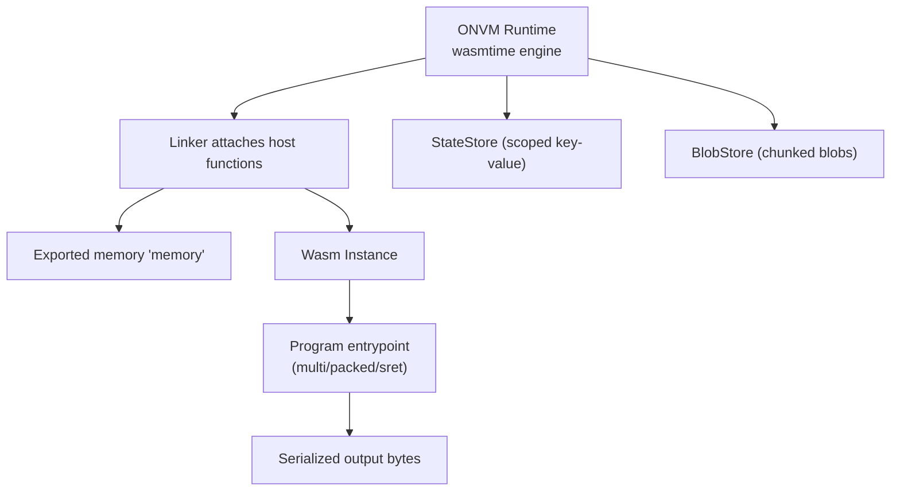
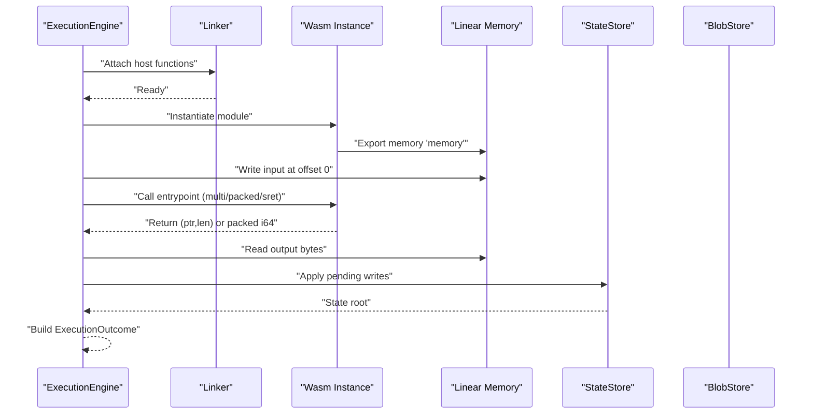
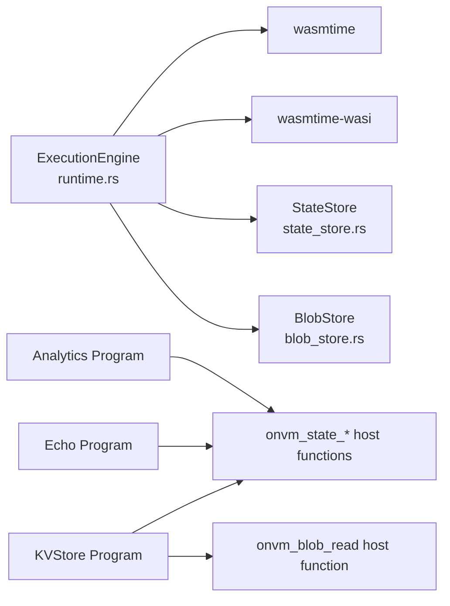
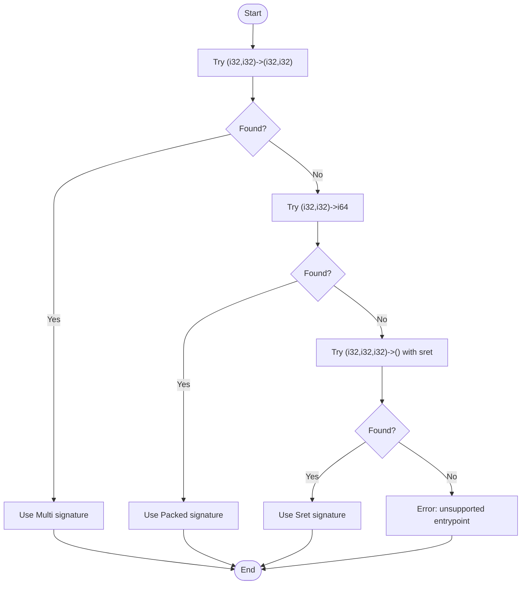

# Writing Wasm Programs

<cite>
**Referenced Files in This Document**
- [runtime.rs](file://src/execution/runtime.rs)
- [lib.rs](file://src/lib.rs)
- [types.rs](file://src/types.rs)
- [state_store.rs](file://src/storage/state_store.rs)
- [blob_store.rs](file://src/storage/blob_store.rs)
- [echo lib.rs](file://wasm_programs/echo/src/lib.rs)
- [echo Cargo.toml](file://wasm_programs/echo/Cargo.toml)
- [kvstore lib.rs](file://wasm_programs/kvstore/src/lib.rs)
- [kvstore Cargo.toml](file://wasm_programs/kvstore/Cargo.toml)
- [kv_put.json](file://wasm_programs/kvstore/kv_put.json)
- [kv_get.json](file://wasm_programs/kvstore/kv_get.json)
- [kv_stats.json](file://wasm_programs/kvstore/kv_stats.json)
- [analytics lib.rs](file://wasm_programs/analytics/src/lib.rs)
- [analytics Cargo.toml](file://wasm_programs/analytics/Cargo.toml)
- [analytics_input.json](file://analytics_input.json)
</cite>

## Table of Contents
1. [Introduction](#introduction)
2. [Project Structure](#project-structure)
3. [Core Components](#core-components)
4. [Architecture Overview](#architecture-overview)
5. [Detailed Component Analysis](#detailed-component-analysis)
6. [Dependency Analysis](#dependency-analysis)
7. [Performance Considerations](#performance-considerations)
8. [Troubleshooting Guide](#troubleshooting-guide)
9. [Conclusion](#conclusion)
10. [Appendices](#appendices)

## Introduction
This document explains how to write Wasm programs that run inside the ONVM runtime. It covers the required Rust toolchain setup for the wasm32-unknown-unknown target, proper Cargo.toml configuration for cdylib crates, and entry point conventions. It documents the supported function signatures for program entrypoints (multi, packed, sret) as defined by the runtime, and provides concrete examples from the echo, kvstore, and analytics programs. It also explains input/output serialization using serde with byte buffers in Wasm linear memory, the host functions for state and blob access (onvm_state_put, onvm_state_get, onvm_state_root, onvm_blob_read), and memory management considerations. Finally, it outlines security constraints and error handling patterns.

## Project Structure
ONVM compiles and executes Wasm programs using the Wasmtime engine. The runtime links host functions and exposes a linear memory region to each program. Programs are built as cdylib crates targeting wasm32-unknown-unknown and export a function whose name is configured in program metadata. The runtime supports three entrypoint signatures and reads the program’s exported memory to pass serialized input and receive serialized output.

**Diagram sources**
- [runtime.rs](file://src/execution/runtime.rs#L90-L183)
- [state_store.rs](file://src/storage/state_store.rs#L1-L80)
- [blob_store.rs](file://src/storage/blob_store.rs#L1-L185)

**Section sources**
- [runtime.rs](file://src/execution/runtime.rs#L90-L183)
- [lib.rs](file://src/lib.rs#L1-L12)

## Core Components
- ExecutionEngine: Compiles and instantiates Wasm modules, attaches host functions, and executes programs with a configured entrypoint signature. It writes input into linear memory, invokes the entrypoint, reads output, applies pending state writes, computes the state root, and returns an ExecutionOutcome.
- Host functions:
  - onvm_state_put(key_ptr, key_len, val_ptr, val_len) -> i32
  - onvm_state_get(key_ptr, key_len, out_ptr, out_cap) -> i32
  - onvm_state_root(out_ptr) -> i32
  - onvm_blob_read(id_ptr, id_len, out_ptr, out_capacity) -> i32
- Data structures:
  - ProgramId, BlobId, StateWrite, ComputeOp, ProgramMetadata, BlobMetadata in types.rs
  - StateStore and BlobStore manage persisted state and blob data respectively

Key runtime behaviors:
- Entry point detection: The runtime tries to bind the configured entrypoint name as (i32,i32)->(i32,i32), (i32,i32)->i64, or (i32,i32,i32)->() with sret.
- Input placement: Input bytes are written at a zero offset in linear memory.
- Output retrieval: The runtime reads output from the pointer/length returned by the entrypoint.
- State writes: Pending writes are sorted deterministically and applied to the state store; the state root is computed and returned.

**Section sources**
- [runtime.rs](file://src/execution/runtime.rs#L42-L183)
- [types.rs](file://src/types.rs#L1-L109)
- [state_store.rs](file://src/storage/state_store.rs#L1-L80)
- [blob_store.rs](file://src/storage/blob_store.rs#L1-L185)

## Architecture Overview
The runtime orchestrates program execution with deterministic memory layout and strict host function contracts.

**Diagram sources**
- [runtime.rs](file://src/execution/runtime.rs#L90-L183)
- [state_store.rs](file://src/storage/state_store.rs#L1-L80)
- [blob_store.rs](file://src/storage/blob_store.rs#L1-L185)

## Detailed Component Analysis

### Rust Toolchain Setup and Cargo.toml
- Target: wasm32-unknown-unknown
- Crate type: cdylib
- Release profile: LTO, opt-level z, panic abort, strip, single codegen unit
- Example configurations are provided in the echo, kvstore, and analytics programs’ Cargo.toml files.

Recommended minimal Cargo.toml for a Wasm program:
- crate-type = ["cdylib"]
- wasm32-unknown-unknown target
- Release optimizations suitable for Wasm size and performance

**Section sources**
- [echo Cargo.toml](file://wasm_programs/echo/Cargo.toml#L1-L19)
- [kvstore Cargo.toml](file://wasm_programs/kvstore/Cargo.toml#L1-L22)
- [analytics Cargo.toml](file://wasm_programs/analytics/Cargo.toml#L1-L24)

### Entry Point Conventions and Supported Signatures
The runtime supports three entrypoint signatures determined by the program’s exported function name:

- Multi signature: (i32, i32) -> (i32, i32)
  - Input: ptr:i32, len:i32
  - Output: (out_ptr:i32, out_len:i32)
- Packed signature: (i32, i32) -> i64
  - Input: ptr:i32, len:i32
  - Output: packed i64 with out_ptr in upper 32 bits and out_len in lower 32 bits
- Sret signature: (i32, i32, i32) -> ()
  - Input: scratch_ptr:i32, ptr:i32, len:i32
  - Output: two i32 values written to scratch_ptr (out_ptr, out_len) in little-endian order

The runtime attempts to bind the configured entrypoint name as one of these forms and falls back to an error if none match.

Practical implications:
- Choose one signature consistently.
- For sret, ensure the scratch region is writable and zeroed before calling.
- For packed, split the i64 into out_ptr and out_len.

**Section sources**
- [runtime.rs](file://src/execution/runtime.rs#L109-L150)

### Input/Output Serialization Using Serde and Linear Memory
- Input: Serialized bytes are written into the Wasm linear memory at a zero offset by the runtime. The program receives a pointer and length.
- Output: Programs return a pointer and length to a buffer containing serialized output bytes. The runtime reads these bytes into a Vec<u8> and returns them as part of ExecutionOutcome.
- Serialization: Programs commonly serialize to JSON or compact binary formats. The kvstore and analytics programs demonstrate JSON serialization with serde_json.

Example patterns:
- Parse input bytes into a typed structure using serde.
- Serialize the response to bytes and return a pointer/length pair.
- Reuse a static or thread-local buffer to avoid frequent allocations.

**Section sources**
- [runtime.rs](file://src/execution/runtime.rs#L126-L153)
- [kvstore lib.rs](file://wasm_programs/kvstore/src/lib.rs#L38-L69)
- [analytics lib.rs](file://wasm_programs/analytics/src/lib.rs#L39-L70)

### Host Functions: State Access
The runtime exposes three state-related host functions:

- onvm_state_put(key_ptr, key_len, val_ptr, val_len) -> i32
  - Purpose: Write a key/value pair to the program’s scoped state.
  - Returns: 0 on success; negative error code on failure.
- onvm_state_get(key_ptr, key_len, out_ptr, out_cap) -> i32
  - Purpose: Read a value by key into a caller-provided buffer.
  - Returns: Positive length on success; 0 if missing; negative length indicating required capacity.
- onvm_state_root(out_ptr) -> i32
  - Purpose: Write the current state root hash (32 bytes) into the provided buffer.
  - Returns: 0 on success; negative error code on failure.

Calling convention:
- Programs must pass pointers and lengths into linear memory.
- onvm_state_get uses a retry pattern with negative return codes to indicate required capacity.

Error handling:
- Programs should check return codes and propagate errors appropriately.
- onvm_state_root includes pending writes in the root computation for determinism.

**Section sources**
- [runtime.rs](file://src/execution/runtime.rs#L246-L376)
- [state_store.rs](file://src/storage/state_store.rs#L1-L80)

### Host Functions: Blob Access
The runtime exposes a blob read host function:

- onvm_blob_read(id_ptr, id_len, out_ptr, out_capacity) -> i32
  - Purpose: Read a blob by its identifier into a caller-provided buffer.
  - Input id is a hex-encoded 32-byte string.
  - Returns: Positive length on success; negative error code on failure.

Error codes:
- -1: Missing or invalid memory export
- -2: Unable to read id bytes from memory
- -3: Id is not valid UTF-8
- -4: Hex decode failed or invalid length
- -5: Id length not equal to 32 bytes
- -6: Blob not found
- -7: Capacity too small
- -8: Unable to write output to memory

**Section sources**
- [runtime.rs](file://src/execution/runtime.rs#L199-L244)
- [blob_store.rs](file://src/storage/blob_store.rs#L1-L185)

### Memory Management Considerations
- Linear memory access: Programs must read/write only within the bounds of the exported memory 'memory'.
- Buffer sizing: For state_get, use the negative-length return code to resize buffers until the call succeeds.
- Output buffers: Prefer reusing a static or OnceCell-initialized buffer to minimize allocations.
- Alignment and safety: The runtime passes raw pointers and lengths; programs must ensure validity and safety.

**Section sources**
- [runtime.rs](file://src/execution/runtime.rs#L130-L153)
- [kvstore lib.rs](file://wasm_programs/kvstore/src/lib.rs#L164-L187)
- [echo lib.rs](file://wasm_programs/echo/src/lib.rs#L1-L57)

### Security Constraints
- No direct system calls: Programs run in a sandboxed environment with limited host capabilities.
- Allowed host functions only: State and blob operations are mediated via explicit host functions.
- Deterministic execution: Fuel consumption and state writes are tracked and applied deterministically.

**Section sources**
- [runtime.rs](file://src/execution/runtime.rs#L56-L77)

### Example Programs and Patterns

#### Echo Program
- Entry point: onvm_main(ptr, len) -> (ptr, len)
- Behavior: Converts input bytes to uppercase and returns a pointer/length pair.
- Notes: Uses a global allocator and a Once-initialized mutex-protected buffer for reuse.

**Section sources**
- [echo lib.rs](file://wasm_programs/echo/src/lib.rs#L1-L57)
- [echo Cargo.toml](file://wasm_programs/echo/Cargo.toml#L1-L19)

#### KVStore Program
- Entry point: onvm_main(ptr, len) -> (ptr, len)
- Input: JSON with operation field (put, get, list, clear, stats).
- Output: JSON response with status and payload.
- State operations: Demonstrates onvm_state_put and onvm_state_get usage with dynamic buffer sizing.
- Additional host functions: Uses onvm_state_root to compute the state root.

**Section sources**
- [kvstore lib.rs](file://wasm_programs/kvstore/src/lib.rs#L38-L144)
- [kvstore lib.rs](file://wasm_programs/kvstore/src/lib.rs#L148-L239)
- [kv_put.json](file://wasm_programs/kvstore/kv_put.json#L1-L1)
- [kv_get.json](file://wasm_programs/kvstore/kv_get.json#L1-L1)
- [kv_stats.json](file://wasm_programs/kvstore/kv_stats.json#L1-L1)
- [kvstore Cargo.toml](file://wasm_programs/kvstore/Cargo.toml#L1-L22)

#### Analytics Program
- Entry point: onvm_main(ptr, len) -> (ptr, len)
- Input: JSON with text, numbers, and include_compressed flag.
- Output: JSON with analysis results including Blake3 hash, token counts, top tokens, number statistics, and optional compressed data.
- Serialization: Uses serde_json to encode responses.

**Section sources**
- [analytics lib.rs](file://wasm_programs/analytics/src/lib.rs#L39-L108)
- [analytics_input.json](file://analytics_input.json#L1-L5)
- [analytics Cargo.toml](file://wasm_programs/analytics/Cargo.toml#L1-L24)

### Error Handling Patterns
- Host function return codes: Programs should check return codes and convert them to meaningful errors.
- Dynamic buffer sizing: For onvm_state_get, retry with capacity equal to the absolute value of the negative return code.
- Serialization errors: Programs should fall back to a minimal error response when serialization fails.
- Panic handling: Programs should avoid unwinding; use abort or unreachable semantics in no-std contexts.

**Section sources**
- [runtime.rs](file://src/execution/runtime.rs#L246-L376)
- [kvstore lib.rs](file://wasm_programs/kvstore/src/lib.rs#L164-L187)
- [echo lib.rs](file://wasm_programs/echo/src/lib.rs#L17-L21)

## Dependency Analysis
The runtime depends on Wasmtime and WASI for sandboxing, and on internal stores for state and blob persistence. Programs depend on host functions exposed by the runtime and on serialization libraries.

**Diagram sources**
- [runtime.rs](file://src/execution/runtime.rs#L90-L183)
- [state_store.rs](file://src/storage/state_store.rs#L1-L80)
- [blob_store.rs](file://src/storage/blob_store.rs#L1-L185)

**Section sources**
- [runtime.rs](file://src/execution/runtime.rs#L90-L183)
- [lib.rs](file://src/lib.rs#L1-L12)

## Performance Considerations
- Optimize for Wasm: Use LTO, opt-level z, panic abort, and strip in release profiles.
- Minimize allocations: Reuse buffers via OnceCell or static storage.
- Efficient serialization: Prefer compact formats when bandwidth matters; JSON is convenient for development.
- Avoid large copies: Stream or chunk data when possible; leverage host functions for state/blobs.

[No sources needed since this section provides general guidance]

## Troubleshooting Guide
Common issues and resolutions:
- Entry point not found or wrong signature:
  - Ensure the exported function name matches the configured entrypoint and matches one of the supported signatures.
- Missing memory export:
  - Verify the module exports memory named "memory".
- onvm_state_get returns negative capacity:
  - Resize the buffer to the absolute value of the return code and retry.
- onvm_blob_read returns -7 (capacity too small):
  - Increase the output buffer capacity and retry.
- Serialization failures:
  - Fall back to a minimal error JSON response.
- Panics in no-std:
  - Configure a panic handler that calls unreachable or abort.

**Section sources**
- [runtime.rs](file://src/execution/runtime.rs#L109-L150)
- [runtime.rs](file://src/execution/runtime.rs#L199-L244)
- [runtime.rs](file://src/execution/runtime.rs#L246-L376)
- [echo lib.rs](file://wasm_programs/echo/src/lib.rs#L17-L21)

## Conclusion
To write Wasm programs for ONVM:
- Build a cdylib targeting wasm32-unknown-unknown with appropriate release optimizations.
- Export a function with one of the supported signatures and manage linear memory carefully.
- Use serde to serialize input and output; reuse buffers to reduce allocations.
- Call host functions for state and blob access; handle return codes and dynamic buffer sizing.
- Follow security constraints and error handling patterns demonstrated by the example programs.

[No sources needed since this section summarizes without analyzing specific files]

## Appendices

### Appendix A: Entry Point Signature Decision Flow

**Diagram sources**
- [runtime.rs](file://src/execution/runtime.rs#L109-L124)