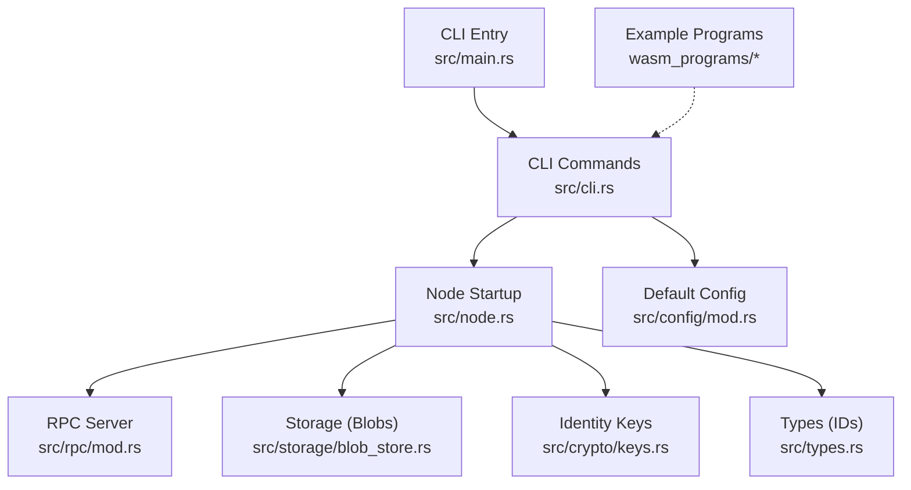
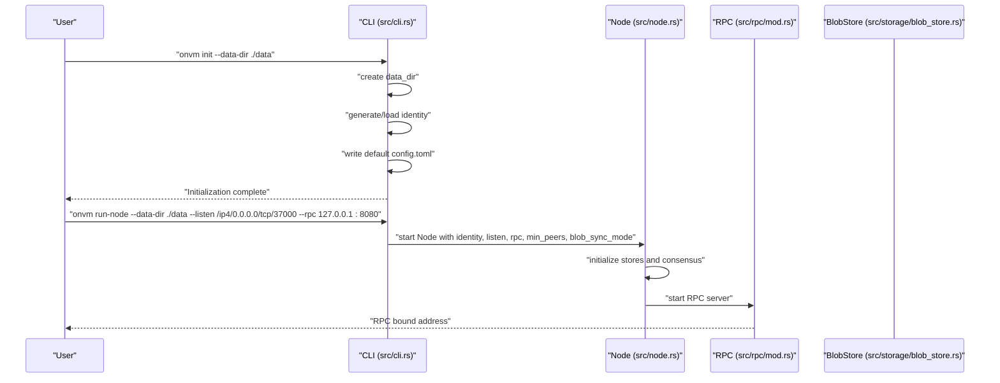
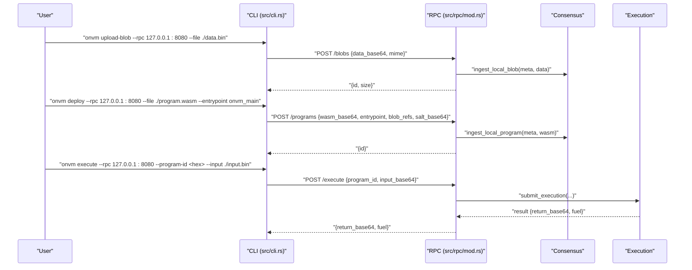
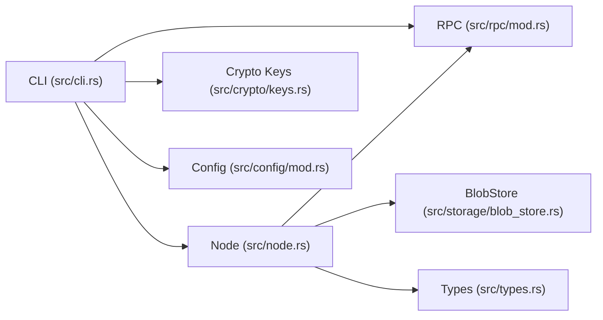

# Getting Started

<cite>
**Referenced Files in This Document**
- [Cargo.toml](file://Cargo.toml)
- [main.rs](file://src/main.rs)
- [cli.rs](file://src/cli.rs)
- [node.rs](file://src/node.rs)
- [rpc/mod.rs](file://src/rpc/mod.rs)
- [config/mod.rs](file://src/config/mod.rs)
- [crypto/keys.rs](file://src/crypto/keys.rs)
- [storage/blob_store.rs](file://src/storage/blob_store.rs)
- [types.rs](file://src/types.rs)
- [echo/lib.rs](file://wasm_programs/echo/src/lib.rs)
- [kvstore/lib.rs](file://wasm_programs/kvstore/src/lib.rs)
- [analytics/lib.rs](file://wasm_programs/analytics/src/lib.rs)
- [node1/config.toml](file://node1/config.toml)
</cite>

## Table of Contents
1. [Introduction](#introduction)
2. [Project Structure](#project-structure)
3. [Core Components](#core-components)
4. [Architecture Overview](#architecture-overview)
5. [Detailed Component Analysis](#detailed-component-analysis)
6. [Dependency Analysis](#dependency-analysis)
7. [Performance Considerations](#performance-considerations)
8. [Troubleshooting Guide](#troubleshooting-guide)
9. [Conclusion](#conclusion)
10. [Appendices](#appendices)

## Introduction
This guide helps you quickly set up and run your first ONVM node, upload a blob, deploy a WASM program, and execute it via RPC or CLI. It focuses on:
- Installing the ONVM binary via Cargo
- Initializing a node with identity and configuration
- Starting a node with network and RPC bindings
- Uploading a blob and deploying a WASM program
- Executing a program via RPC or CLI
- Understanding data directory creation, identity generation, and common pitfalls

By the end, you will have a local node running, a program deployed, and a working execution flow. For advanced configuration and CLI reference, see the CLI and configuration sections below.

## Project Structure
ONVM is a Rust application with a CLI entry point that starts a full node (network, consensus, execution, storage, and RPC). The CLI exposes commands for initialization, running a node, uploading blobs, deploying programs, and executing them.

**Diagram sources**
- [main.rs](file://src/main.rs#L1-L7)
- [cli.rs](file://src/cli.rs#L1-L300)
- [node.rs](file://src/node.rs#L1-L163)
- [rpc/mod.rs](file://src/rpc/mod.rs#L1-L241)
- [storage/blob_store.rs](file://src/storage/blob_store.rs#L1-L185)
- [crypto/keys.rs](file://src/crypto/keys.rs#L1-L73)
- [types.rs](file://src/types.rs#L1-L109)
- [config/mod.rs](file://src/config/mod.rs#L1-L140)
- [echo/lib.rs](file://wasm_programs/echo/src/lib.rs#L1-L57)
- [kvstore/lib.rs](file://wasm_programs/kvstore/src/lib.rs#L1-L240)
- [analytics/lib.rs](file://wasm_programs/analytics/src/lib.rs#L1-L167)

**Section sources**
- [main.rs](file://src/main.rs#L1-L7)
- [Cargo.toml](file://Cargo.toml#L1-L59)

## Core Components
- CLI entry point initializes logging and dispatches commands.
- Initialization creates a data directory, generates identity keys, and writes a default config file if missing.
- Running a node starts network, consensus, execution, and RPC server.
- RPC exposes endpoints for blob upload, program deployment, execution, and inspection.
- Storage persists blobs and metadata in a structured way.
- Types define identifiers and metadata used across components.

**Section sources**
- [cli.rs](file://src/cli.rs#L1-L300)
- [node.rs](file://src/node.rs#L1-L163)
- [rpc/mod.rs](file://src/rpc/mod.rs#L1-L241)
- [storage/blob_store.rs](file://src/storage/blob_store.rs#L1-L185)
- [types.rs](file://src/types.rs#L1-L109)

## Architecture Overview
The CLI orchestrates lifecycle operations. Initialization sets up identity and config. Running a node wires network, consensus, execution, and RPC. RPC endpoints delegate to node internals.

**Diagram sources**
- [cli.rs](file://src/cli.rs#L110-L171)
- [node.rs](file://src/node.rs#L37-L133)
- [rpc/mod.rs](file://src/rpc/mod.rs#L62-L96)
- [storage/blob_store.rs](file://src/storage/blob_store.rs#L1-L185)

## Detailed Component Analysis

### Quick Setup and Basic Interaction Patterns
- Install via Cargo:
  - Build and install the binary using Cargo. See [Cargo.toml](file://Cargo.toml#L1-L59) for dependencies and toolchain requirements.
  - The CLI entry point is defined in [main.rs](file://src/main.rs#L1-L7).
- Initialize a node:
  - Creates the data directory, generates or loads identity keys, and writes a default config file if absent. See [cli.rs](file://src/cli.rs#L116-L129).
  - Identity keys are persisted under the data directory and used for node identification. See [crypto/keys.rs](file://src/crypto/keys.rs#L30-L62).
  - Default configuration is written to config.toml if not present. See [config/mod.rs](file://src/config/mod.rs#L132-L139) and [node1/config.toml](file://node1/config.toml#L1-L12).
- Start a node:
  - Parses listen multiaddress and RPC bind address, loads identity, selects blob sync mode, and starts the node. See [cli.rs](file://src/cli.rs#L130-L171).
  - Node startup creates required directories, opens stores, starts network, consensus, and background tasks. See [node.rs](file://src/node.rs#L37-L133).
  - RPC server binds to the configured address and increments port if needed. See [rpc/mod.rs](file://src/rpc/mod.rs#L62-L96).
- Upload a blob:
  - CLI posts base64-encoded data to the RPC /blobs endpoint. See [cli.rs](file://src/cli.rs#L172-L190).
  - RPC decodes and stores the blob, then ingests it into consensus. See [rpc/mod.rs](file://src/rpc/mod.rs#L98-L121) and [storage/blob_store.rs](file://src/storage/blob_store.rs#L18-L46).
- Deploy a WASM program:
  - CLI posts base64-encoded WASM and deployment parameters to /programs. See [cli.rs](file://src/cli.rs#L191-L220).
  - RPC validates inputs, deploys program, and ingests into consensus. See [rpc/mod.rs](file://src/rpc/mod.rs#L133-L174).
- Execute a program:
  - CLI posts base64-encoded input to /execute. See [cli.rs](file://src/cli.rs#L221-L271).
  - RPC submits execution via consensus and returns base64-encoded result and fuel. See [rpc/mod.rs](file://src/rpc/mod.rs#L194-L213).

**Section sources**
- [Cargo.toml](file://Cargo.toml#L1-L59)
- [main.rs](file://src/main.rs#L1-L7)
- [cli.rs](file://src/cli.rs#L110-L271)
- [node.rs](file://src/node.rs#L37-L133)
- [rpc/mod.rs](file://src/rpc/mod.rs#L62-L213)
- [storage/blob_store.rs](file://src/storage/blob_store.rs#L1-L185)
- [crypto/keys.rs](file://src/crypto/keys.rs#L30-L62)
- [config/mod.rs](file://src/config/mod.rs#L132-L139)
- [node1/config.toml](file://node1/config.toml#L1-L12)

### Step-by-Step Example: Echo Program
- Prerequisites:
  - Install ONVM via Cargo (see [Cargo.toml](file://Cargo.toml#L1-L59)).
- Initialize:
  - Create a data directory and generate identity: run the initialization command. See [cli.rs](file://src/cli.rs#L116-L129).
- Start the node:
  - Launch with a listen multiaddress and RPC bind address: see [cli.rs](file://src/cli.rs#L130-L171).
- Upload a blob:
  - Upload a file to the node’s RPC /blobs endpoint: see [cli.rs](file://src/cli.rs#L172-L190).
- Deploy a WASM program:
  - Deploy a WASM program with an entrypoint and optional blob references: see [cli.rs](file://src/cli.rs#L191-L220).
  - Example WASM entrypoints are defined in [echo/lib.rs](file://wasm_programs/echo/src/lib.rs#L22-L43) and [kvstore/lib.rs](file://wasm_programs/kvstore/src/lib.rs#L38-L56).
- Execute:
  - Invoke the program via RPC /execute with base64-encoded input: see [cli.rs](file://src/cli.rs#L221-L271).
  - Alternatively, use the CLI Execute command to print decoded output or raw JSON: see [cli.rs](file://src/cli.rs#L221-L271).

**Diagram sources**
- [cli.rs](file://src/cli.rs#L172-L271)
- [rpc/mod.rs](file://src/rpc/mod.rs#L98-L213)

**Section sources**
- [cli.rs](file://src/cli.rs#L172-L271)
- [rpc/mod.rs](file://src/rpc/mod.rs#L98-L213)
- [echo/lib.rs](file://wasm_programs/echo/src/lib.rs#L22-L43)
- [kvstore/lib.rs](file://wasm_programs/kvstore/src/lib.rs#L38-L56)

### Configuration via config.toml or CLI Flags
- Default configuration:
  - A default config is written during initialization if config.toml does not exist. See [config/mod.rs](file://src/config/mod.rs#L132-L139) and [node1/config.toml](file://node1/config.toml#L1-L12).
- CLI flags:
  - Initialization: --data-dir
  - Run node: --data-dir, --listen, --rpc, --min-peers, --blob-sync-mode
  - Upload blob: --rpc, --file, --mime
  - Deploy: --rpc, --file, --entrypoint, --blob-refs, --salt
  - Execute: --rpc, --program-id, --input, --json
  - See [cli.rs](file://src/cli.rs#L31-L107) for the full flag set.

**Section sources**
- [config/mod.rs](file://src/config/mod.rs#L132-L139)
- [node1/config.toml](file://node1/config.toml#L1-L12)
- [cli.rs](file://src/cli.rs#L31-L107)

### Identity Generation and Data Directory Creation
- Identity:
  - Identity keys are generated or loaded from the data directory path. See [crypto/keys.rs](file://src/crypto/keys.rs#L30-L62).
- Data directory:
  - Initialization creates the directory and writes identity and config. See [cli.rs](file://src/cli.rs#L116-L129).
  - Node startup ensures required subdirectories exist and opens stores. See [node.rs](file://src/node.rs#L37-L57).

**Section sources**
- [crypto/keys.rs](file://src/crypto/keys.rs#L30-L62)
- [cli.rs](file://src/cli.rs#L116-L129)
- [node.rs](file://src/node.rs#L37-L57)

### Common Pitfalls and Troubleshooting
- Port conflicts:
  - RPC server increments the port until a free one is found. See [rpc/mod.rs](file://src/rpc/mod.rs#L73-L96).
  - Node listen multiaddress attempts the next TCP port if binding fails. See [node.rs](file://src/node.rs#L135-L155).
- Initialization failures:
  - Ensure the data directory path is writable and the identity file is accessible. See [crypto/keys.rs](file://src/crypto/keys.rs#L30-L62).
  - Verify config.toml is valid TOML. See [config/mod.rs](file://src/config/mod.rs#L132-L139).
- Missing dependencies:
  - Ensure Cargo toolchain and required crates are installed. See [Cargo.toml](file://Cargo.toml#L1-L59).
- RPC errors:
  - Confirm the RPC endpoint is reachable and formatted correctly (CLI normalizes endpoints). See [cli.rs](file://src/cli.rs#L13-L22) and [rpc/mod.rs](file://src/rpc/mod.rs#L62-L96).
- Blob and program operations:
  - Base64 encoding/decoding must succeed; invalid hex IDs will fail. See [rpc/mod.rs](file://src/rpc/mod.rs#L133-L174) and [types.rs](file://src/types.rs#L1-L109).

**Section sources**
- [rpc/mod.rs](file://src/rpc/mod.rs#L62-L96)
- [node.rs](file://src/node.rs#L135-L155)
- [crypto/keys.rs](file://src/crypto/keys.rs#L30-L62)
- [config/mod.rs](file://src/config/mod.rs#L132-L139)
- [Cargo.toml](file://Cargo.toml#L1-L59)
- [cli.rs](file://src/cli.rs#L13-L22)
- [types.rs](file://src/types.rs#L1-L109)

## Dependency Analysis
ONVM’s CLI depends on node, RPC, storage, and crypto modules. The node composes network, consensus, execution, and storage subsystems.

**Diagram sources**
- [cli.rs](file://src/cli.rs#L1-L300)
- [node.rs](file://src/node.rs#L1-L163)
- [rpc/mod.rs](file://src/rpc/mod.rs#L1-L241)
- [storage/blob_store.rs](file://src/storage/blob_store.rs#L1-L185)
- [crypto/keys.rs](file://src/crypto/keys.rs#L1-L73)
- [config/mod.rs](file://src/config/mod.rs#L1-L140)
- [types.rs](file://src/types.rs#L1-L109)

**Section sources**
- [cli.rs](file://src/cli.rs#L1-L300)
- [node.rs](file://src/node.rs#L1-L163)
- [rpc/mod.rs](file://src/rpc/mod.rs#L1-L241)
- [storage/blob_store.rs](file://src/storage/blob_store.rs#L1-L185)
- [crypto/keys.rs](file://src/crypto/keys.rs#L1-L73)
- [config/mod.rs](file://src/config/mod.rs#L1-L140)
- [types.rs](file://src/types.rs#L1-L109)

## Performance Considerations
- Blob chunking and Merkle roots improve integrity and efficient replication. See [storage/blob_store.rs](file://src/storage/blob_store.rs#L1-L185).
- RPC server increments ports to avoid conflicts; keep RPC and listen ports distinct and available. See [rpc/mod.rs](file://src/rpc/mod.rs#L73-L96) and [node.rs](file://src/node.rs#L135-L155).
- Execution and consensus throughput depend on min_peers and blob sync mode. Adjust via CLI flags. See [cli.rs](file://src/cli.rs#L130-L171).

[No sources needed since this section provides general guidance]

## Troubleshooting Guide
- Initialization:
  - Verify data directory permissions and identity file presence. See [crypto/keys.rs](file://src/crypto/keys.rs#L30-L62).
- Node startup:
  - Check listen multiaddress validity and port availability. See [cli.rs](file://src/cli.rs#L130-L171) and [node.rs](file://src/node.rs#L135-L155).
- RPC:
  - Confirm endpoint normalization and reachability. See [cli.rs](file://src/cli.rs#L13-L22) and [rpc/mod.rs](file://src/rpc/mod.rs#L62-L96).
- Blob/Program operations:
  - Ensure base64 encoding and hex IDs are valid. See [rpc/mod.rs](file://src/rpc/mod.rs#L98-L174) and [types.rs](file://src/types.rs#L1-L109).

**Section sources**
- [crypto/keys.rs](file://src/crypto/keys.rs#L30-L62)
- [cli.rs](file://src/cli.rs#L13-L22)
- [rpc/mod.rs](file://src/rpc/mod.rs#L62-L174)
- [types.rs](file://src/types.rs#L1-L109)
- [node.rs](file://src/node.rs#L135-L155)

## Conclusion
You now have a practical path to onboard with ONVM: install via Cargo, initialize a node, start it with realistic flags, upload a blob, deploy a WASM program, and execute it via RPC or CLI. For deeper customization, consult the CLI and configuration sections referenced throughout.

[No sources needed since this section summarizes without analyzing specific files]

## Appendices

### A. Installation via Cargo
- Build and install the ONVM binary using Cargo. See [Cargo.toml](file://Cargo.toml#L1-L59) for dependencies and toolchain requirements.
- The CLI entry point is defined in [main.rs](file://src/main.rs#L1-L7).

**Section sources**
- [Cargo.toml](file://Cargo.toml#L1-L59)
- [main.rs](file://src/main.rs#L1-L7)

### B. Node Initialization with `onvm init`
- Purpose: create data directory, generate identity, and write default config.toml if absent.
- Behavior: see [cli.rs](file://src/cli.rs#L116-L129); identity persistence and generation in [crypto/keys.rs](file://src/crypto/keys.rs#L30-L62); default config writing in [config/mod.rs](file://src/config/mod.rs#L132-L139).

**Section sources**
- [cli.rs](file://src/cli.rs#L116-L129)
- [crypto/keys.rs](file://src/crypto/keys.rs#L30-L62)
- [config/mod.rs](file://src/config/mod.rs#L132-L139)

### C. Starting the Node with `onvm run-node`
- Flags: --data-dir, --listen, --rpc, --min-peers, --blob-sync-mode.
- Behavior: parses addresses, loads identity, selects blob sync mode, starts node and RPC server. See [cli.rs](file://src/cli.rs#L130-L171) and [node.rs](file://src/node.rs#L37-L133).

**Section sources**
- [cli.rs](file://src/cli.rs#L130-L171)
- [node.rs](file://src/node.rs#L37-L133)

### D. Configuration via config.toml or CLI Flags
- Default config: written during initialization if missing. See [config/mod.rs](file://src/config/mod.rs#L132-L139) and [node1/config.toml](file://node1/config.toml#L1-L12).
- CLI flags: see [cli.rs](file://src/cli.rs#L31-L107).

**Section sources**
- [config/mod.rs](file://src/config/mod.rs#L132-L139)
- [node1/config.toml](file://node1/config.toml#L1-L12)
- [cli.rs](file://src/cli.rs#L31-L107)

### E. Sample Commands with Realistic Parameters
- Initialize: onvm init --data-dir ./data
- Start node: onvm run-node --data-dir ./data --listen /ip4/0.0.0.0/tcp/37000 --rpc 127.0.0.1:8080
- Upload blob: onvm upload-blob --rpc 127.0.0.1:8080 --file ./data.bin
- Deploy WASM: onvm deploy --rpc 127.0.0.1:8080 --file ./program.wasm --entrypoint onvm_main
- Execute: onvm execute --rpc 127.0.0.1:8080 --program-id <hex> --input ./input.bin

**Section sources**
- [cli.rs](file://src/cli.rs#L116-L271)

### F. Example WASM Programs
- Echo program entrypoint: see [echo/lib.rs](file://wasm_programs/echo/src/lib.rs#L22-L43).
- KV store entrypoint: see [kvstore/lib.rs](file://wasm_programs/kvstore/src/lib.rs#L38-L56).
- Analytics program entrypoint: see [analytics/lib.rs](file://wasm_programs/analytics/src/lib.rs#L39-L57).

**Section sources**
- [echo/lib.rs](file://wasm_programs/echo/src/lib.rs#L22-L43)
- [kvstore/lib.rs](file://wasm_programs/kvstore/src/lib.rs#L38-L56)
- [analytics/lib.rs](file://wasm_programs/analytics/src/lib.rs#L39-L57)