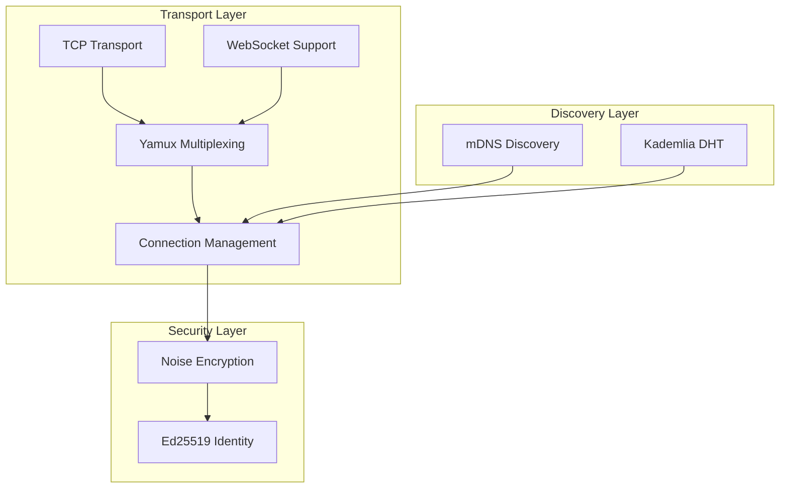
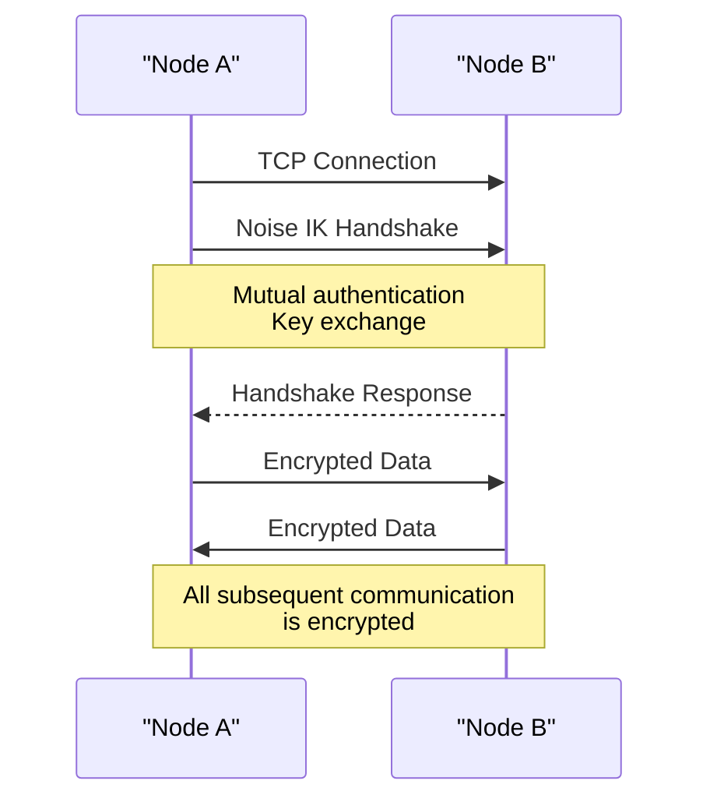
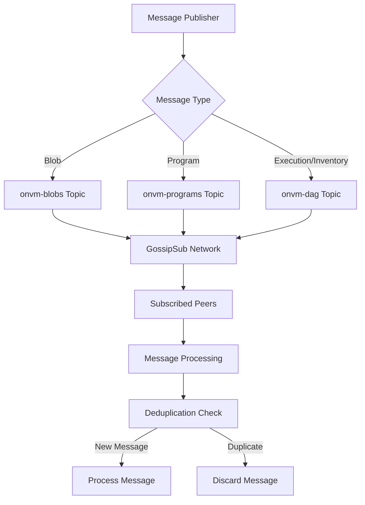
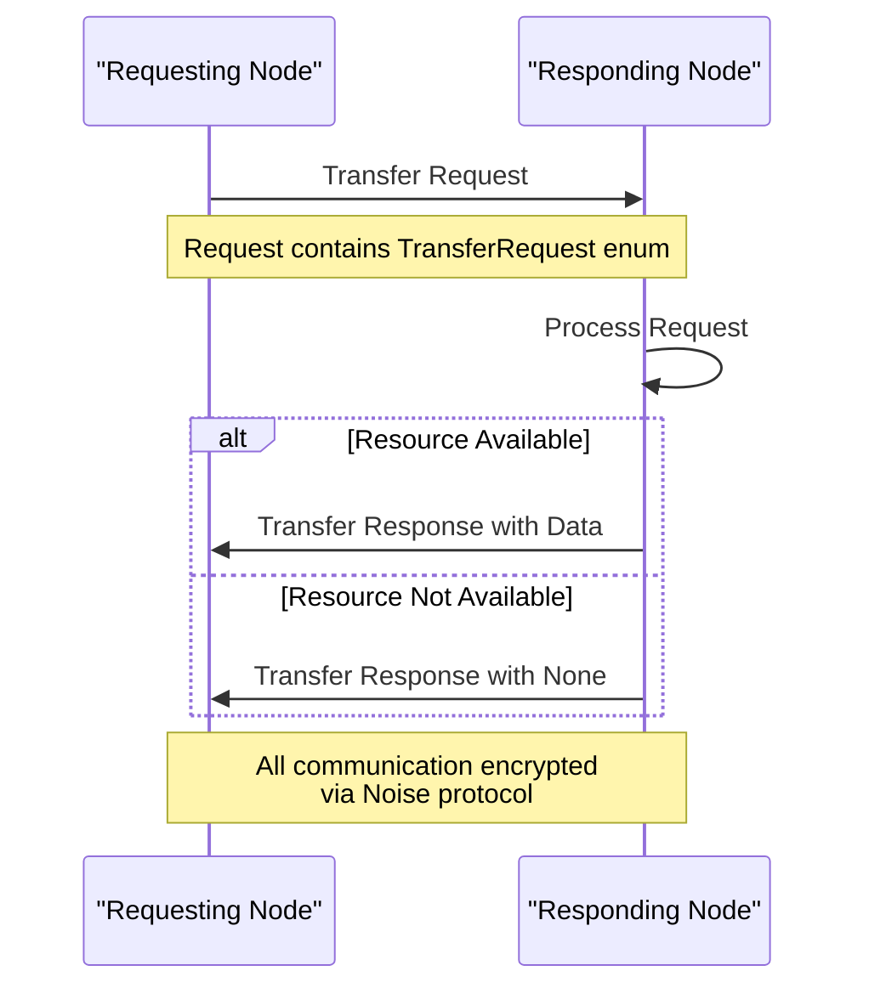
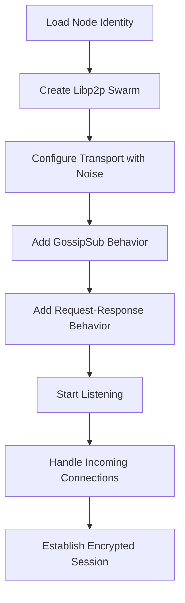
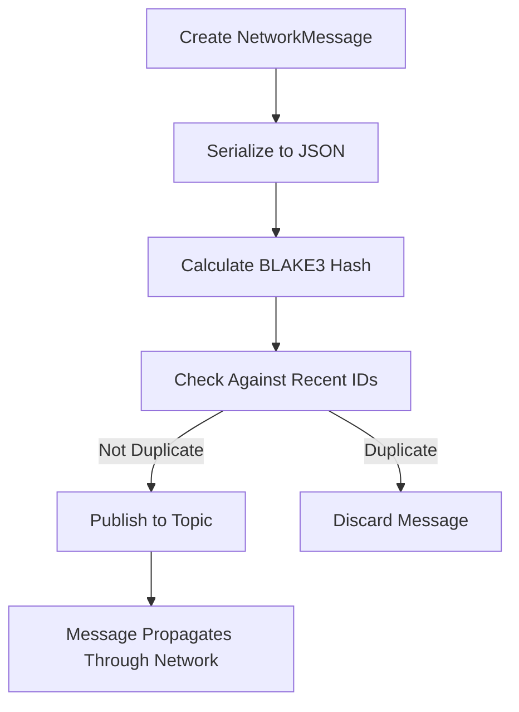

# Communication Protocols

<cite>
**Referenced Files in This Document**   
- [service.rs](file://src/network/service.rs)
- [keys.rs](file://src/crypto/keys.rs)
- [types.rs](file://src/types.rs)
- [mod.rs](file://src/consensus/mod.rs)
- [cli.rs](file://src/cli.rs)
</cite>

## Table of Contents
1. [Introduction](#introduction)
2. [Network Transport Layer](#network-transport-layer)
3. [Secure Communication with Noise Encryption](#secure-communication-with-noise-encryption)
4. [Message Broadcasting with GossipSub](#message-broadcasting-with-gossipsub)
5. [Request-Response Protocol](#request-response-protocol)
6. [Message Serialization and Framing](#message-serialization-and-framing)
7. [Practical Examples](#practical-examples)
8. [Common Issues and Security Considerations](#common-issues-and-security-considerations)
9. [Conclusion](#conclusion)

## Introduction
The ONVM network layer implements a robust peer-to-peer communication system using libp2p, providing secure, efficient, and reliable message exchange between nodes. This documentation details the communication protocols used in the network layer, focusing on TCP and WebSocket transports, Noise encryption for secure channels, GossipSub for message broadcasting, and the request-response protocol for direct peer queries. The system is designed to support decentralized applications with strong security guarantees and efficient data propagation.

**Section sources**
- [service.rs](file://src/network/service.rs#L1-L458)

## Network Transport Layer
The network transport layer is built on libp2p, utilizing TCP as the primary transport protocol with WebSocket support through the soketto library. The implementation establishes encrypted connections using the Noise protocol framework, ensuring secure communication between peers. The transport stack includes:

- **TCP Transport**: Configured with nodelay option for low-latency communication
- **Multiplexing**: Yamux protocol for stream multiplexing over a single connection
- **Connection Management**: Idle connection timeout set to 30 seconds to maintain network health
- **Peer Discovery**: mDNS for local network discovery and Kademlia DHT for global peer discovery

The network service listens on a configurable multiaddr, allowing flexible deployment options. The transport layer handles connection establishment, stream management, and error recovery, providing a reliable foundation for higher-level protocols.

**Diagram sources **
- [service.rs](file://src/network/service.rs#L255-L264)

**Section sources**
- [service.rs](file://src/network/service.rs#L255-L264)

## Secure Communication with Noise Encryption
The network layer implements secure communication using the Noise protocol framework, specifically the IK handshake pattern. This provides forward secrecy, identity authentication, and protection against replay attacks. Each node has a persistent Ed25519 keypair that serves as its identity in the network.

The Noise encryption is integrated at the transport layer, encrypting all communication between peers. The implementation uses libp2p's Noise module with the following configuration:
- **Handshake Pattern**: IK (Interactive Key Exchange)
- **Cipher Suite**: ChaCha20-Poly1305 for encryption and authentication
- **Hash Function**: BLAKE2s for key derivation
- **Key Exchange**: X25519 elliptic curve cryptography

Node identities are derived from their public keys, with the NodeId being the first 32 bytes of the public key. This binding of identity to cryptographic keys prevents impersonation attacks. The system also supports identity persistence through key storage in the data directory, allowing nodes to maintain their identity across restarts.

**Diagram sources **
- [service.rs](file://src/network/service.rs#L259)
- [keys.rs](file://src/crypto/keys.rs#L8-L73)

**Section sources**
- [service.rs](file://src/network/service.rs#L259)
- [keys.rs](file://src/crypto/keys.rs#L8-L73)

## Message Broadcasting with GossipSub
The network layer uses GossipSub for efficient message broadcasting across the peer-to-peer network. GossipSub is a scalable pub/sub routing protocol that minimizes redundant message transmission while ensuring reliable delivery. The implementation supports three primary topics:

- **onvm-blobs**: For blob data and metadata
- **onvm-programs**: For program data and metadata  
- **onvm-dag**: For execution data, inventory requests, and other DAG-related messages

The GossipSub configuration includes several optimizations:
- **Strict Validation**: All messages are validated before forwarding
- **Message Deduplication**: A sliding window of 256 recent message IDs prevents duplicate processing
- **Message ID Generation**: BLAKE3 hash of message content ensures content-based addressing
- **Heartbeat Interval**: Configurable interval for network maintenance

Topic-based filtering allows nodes to subscribe only to messages relevant to their operation. For example, a node focused on program execution would subscribe to onvm-programs and onvm-dag topics, while a storage node might focus on onvm-blobs. The system also implements inventory synchronization through periodic broadcasts of available programs and blobs, enabling efficient content discovery.

**Diagram sources **
- [service.rs](file://src/network/service.rs#L236-L238)
- [service.rs](file://src/network/service.rs#L413-L424)

**Section sources**
- [service.rs](file://src/network/service.rs#L221-L229)
- [service.rs](file://src/network/service.rs#L413-L424)

## Request-Response Protocol
The network layer implements a request-response protocol for direct peer-to-peer queries, using libp2p's request-response framework with CBOR serialization. This protocol enables nodes to request specific data from other nodes, such as program binaries, blob data, or execution results.

The protocol operates over the same encrypted transport layer as GossipSub messages, using a dedicated protocol identifier: `/onvm/transfer/1.0.0`. The implementation supports the following request types:
- **Program**: Request a specific program by ID
- **Blob**: Request a specific blob by ID  
- **Execution**: Request an execution result by ID
- **PushProgram/PushBlob/PushExecution**: Push data to a peer

The response types mirror the request types, with optional data fields that can be None if the requested resource is not available. The protocol uses libp2p's default configuration, which includes timeout handling and retry mechanisms. Error reporting is handled through the transfer protocol's failure events, with appropriate logging for debugging.

**Diagram sources **
- [service.rs](file://src/network/service.rs#L243-L247)
- [service.rs](file://src/network/service.rs#L349-L369)

**Section sources**
- [service.rs](file://src/network/service.rs#L42-L58)
- [service.rs](file://src/network/service.rs#L349-L369)

## Message Serialization and Framing
The network layer uses JSON for GossipSub messages and CBOR for request-response messages, providing a balance between human readability and efficient binary serialization. The message framing is handled by the underlying libp2p protocols, with GossipSub managing message boundaries for pub/sub messages and the request-response protocol handling framing for direct queries.

For GossipSub messages, the NetworkMessage enum serves as the primary message container, with different variants for various types of network events:
- **Blob/Program/Execution**: Broadcast messages for data propagation
- **BlobMeta/ProgramMeta**: Metadata-only messages for discovery
- **Inventory/DagInventory**: Synchronization messages for state reconciliation
- **TransferRequest/TransferResponse**: Direct query messages

The serialization process includes error handling to prevent malformed messages from crashing the node. Messages that fail to serialize or deserialize are silently dropped, with appropriate logging for debugging. The system also implements message deduplication using BLAKE3 hashes of message content, preventing redundant processing of identical messages.

**Section sources**
- [service.rs](file://src/network/service.rs#L27-L127)
- [service.rs](file://src/network/service.rs#L409-L412)

## Practical Examples
### Establishing an Encrypted Connection
To establish an encrypted connection between nodes, the network service is initialized with node identity and configuration:

The process begins with loading the node's identity from disk or generating a new one. The libp2p swarm is then configured with TCP transport, Noise encryption, and the required network behaviors. Once started, the node can accept incoming connections and initiate outgoing connections to peers.

### Publishing Messages to Topics
Publishing messages to GossipSub topics follows a simple pattern:

When a node wants to publish a message, it creates the appropriate NetworkMessage variant, serializes it to JSON, and calculates its BLAKE3 hash. The message is then checked against a sliding window of recent message IDs to prevent duplicates. If not a duplicate, the message is published to the appropriate topic based on its type.

**Section sources**
- [service.rs](file://src/network/service.rs#L429-L438)
- [service.rs](file://src/network/service.rs#L394-L424)

## Common Issues and Security Considerations
### Protocol Version Mismatches
The system uses explicit protocol identifiers (e.g., `/onvm/transfer/1.0.0`) to prevent version mismatches. Nodes negotiate protocol support during connection establishment, ensuring compatibility before exchanging data.

### Malformed Messages
The implementation includes robust error handling for malformed messages:
- JSON deserialization errors are caught and logged
- Invalid message types are silently discarded
- Corrupted data is detected through hash verification

### Denial-of-Service Risks
Several mechanisms mitigate DoS risks from unbounded subscriptions:
- **Rate Limiting**: Implicit through GossipSub's peer scoring
- **Message Size Limits**: Configurable limits on message sizes
- **Connection Limits**: Maximum number of concurrent connections
- **Idle Timeout**: 30-second timeout for inactive connections

### Security Aspects
The system implements multiple security measures:
- **Replay Attack Protection**: Noise protocol provides replay protection
- **Rate Limiting**: Peer scoring in GossipSub limits abusive behavior
- **Identity Binding**: Node identity bound to cryptographic keypair
- **Forward Secrecy**: Noise handshake ensures forward secrecy
- **Data Integrity**: BLAKE3 hashes verify message integrity

The combination of Noise encryption, Ed25519 identities, and strict message validation creates a secure communication environment resistant to common attacks.

**Section sources**
- [service.rs](file://src/network/service.rs#L222)
- [service.rs](file://src/network/service.rs#L280-L282)
- [service.rs](file://src/network/service.rs#L263)
- [keys.rs](file://src/crypto/keys.rs#L8-L73)

## Conclusion
The ONVM network layer provides a comprehensive communication system for peer-to-peer applications, combining secure transport, efficient message broadcasting, and reliable direct queries. The implementation leverages libp2p's robust protocols while adding application-specific optimizations for the ONVM use case. The use of Noise encryption ensures secure communication, while GossipSub enables efficient data propagation with minimal network overhead. The request-response protocol provides a reliable mechanism for direct peer queries, completing the communication toolkit. With proper security considerations and error handling, the system is well-suited for decentralized applications requiring robust and secure peer-to-peer communication.