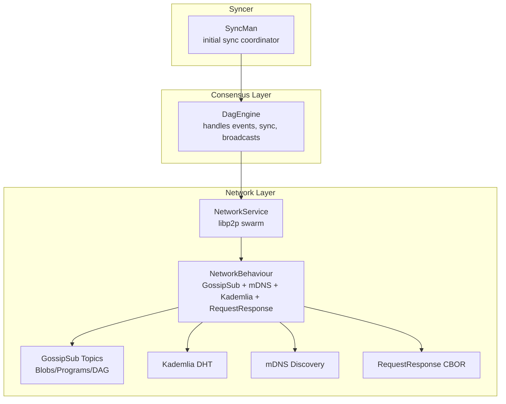
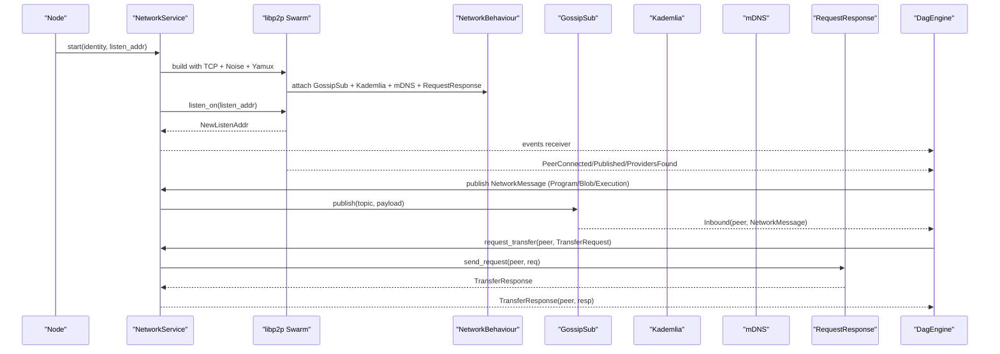
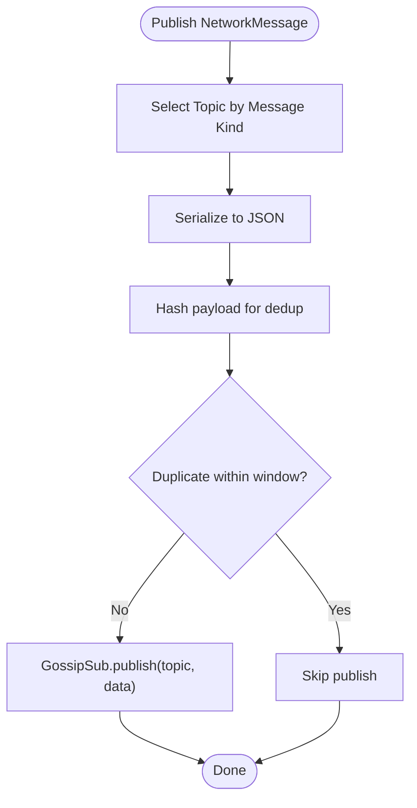
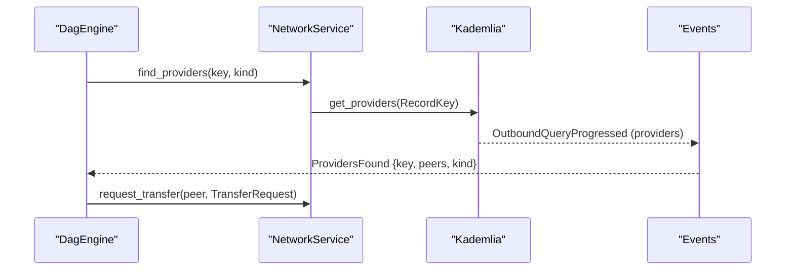
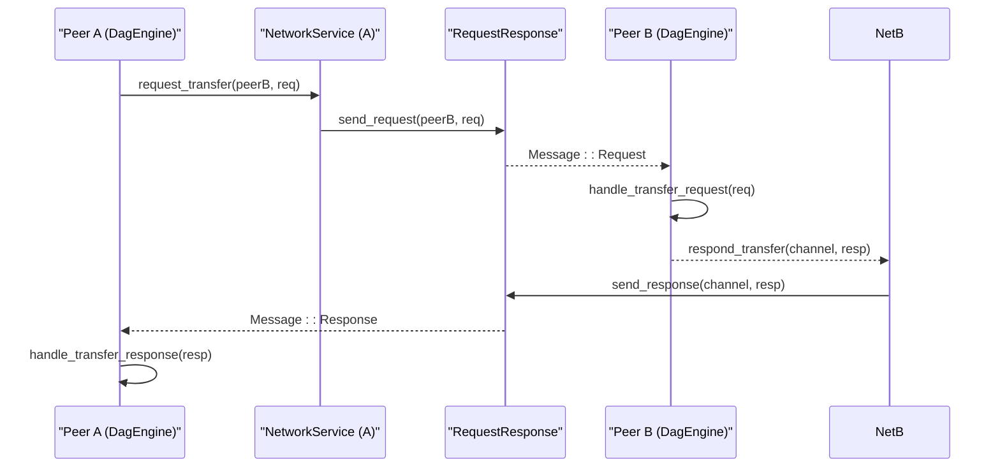
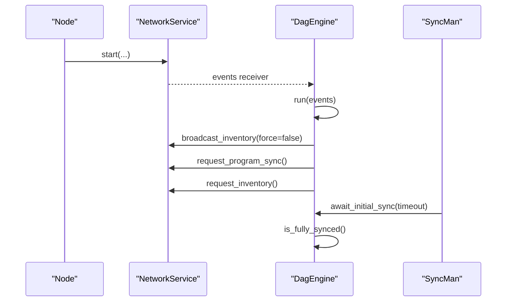
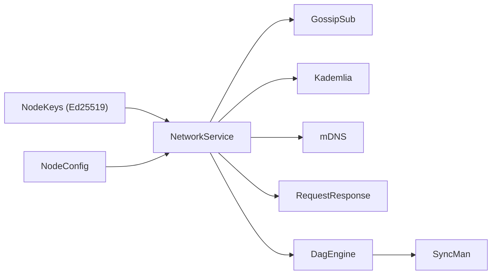

# Networking

<cite>
**Referenced Files in This Document**
- [service.rs](file://src/network/service.rs)
- [mod.rs](file://src/network/mod.rs)
- [consensus/mod.rs](file://src/consensus/mod.rs)
- [syncer/mod.rs](file://src/syncer/mod.rs)
- [node.rs](file://src/node.rs)
- [config/mod.rs](file://src/config/mod.rs)
- [keys.rs](file://src/crypto/keys.rs)
</cite>

## Table of Contents
1. [Introduction](#introduction)
2. [Project Structure](#project-structure)
3. [Core Components](#core-components)
4. [Architecture Overview](#architecture-overview)
5. [Detailed Component Analysis](#detailed-component-analysis)
6. [Dependency Analysis](#dependency-analysis)
7. [Performance Considerations](#performance-considerations)
8. [Troubleshooting Guide](#troubleshooting-guide)
9. [Conclusion](#conclusion)

## Introduction
This document explains the peer-to-peer networking subsystem that powers ONVM’s distributed synchronization and consensus. It focuses on the implementation in src/network/service.rs using libp2p with TCP transport, Noise encryption, and GossipSub for message propagation. It also covers the integration with consensus and syncer, detailing how new blocks and DAG operations are broadcast, how peers discover each other via Kademlia DHT, and how direct request-response transfers are used for targeted synchronization. Practical guidance is included for multiaddr configuration, bootstrapping, handling network partitions, and addressing common issues such as NAT traversal, peer disconnections, and message duplication. Security aspects around authenticated channels and peer identity validation are covered, along with performance considerations for batching, backpressure, and connection pooling.

## Project Structure
The networking layer is encapsulated under src/network and exposes a clean API for higher-level components. The consensus engine consumes network events and drives synchronization, while the syncer coordinates initial convergence.

**Diagram sources**
- [service.rs](file://src/network/service.rs#L202-L253)
- [consensus/mod.rs](file://src/consensus/mod.rs#L104-L118)
- [syncer/mod.rs](file://src/syncer/mod.rs#L10-L20)

**Section sources**
- [mod.rs](file://src/network/mod.rs#L1-L9)
- [service.rs](file://src/network/service.rs#L202-L253)

## Core Components
- NetworkService: Initializes libp2p with TCP, Noise encryption, and GossipSub, subscribes to topics, and runs the event loop.
- NetworkHandle: Provides APIs to publish messages, request provider discovery, and initiate direct transfers.
- NetworkMessage: Enumerates all broadcast and request/response messages used across the system.
- Consensus integration: DagEngine consumes inbound messages, updates local stores, and re-broadcasts as needed.
- Syncer coordination: SyncMan triggers inventory requests and monitors convergence.

Key responsibilities:
- Transport and security: TCP with Noise and optional TLS, Yamux multiplexing, and idle timeouts.
- Message propagation: Strict GossipSub with message deduplication and signed authenticity.
- Discovery: mDNS LAN discovery and Kademlia DHT provider lookups.
- Direct transfers: RequestResponse CBOR protocol for targeted synchronization.

**Section sources**
- [service.rs](file://src/network/service.rs#L221-L264)
- [service.rs](file://src/network/service.rs#L273-L427)
- [consensus/mod.rs](file://src/consensus/mod.rs#L120-L191)

## Architecture Overview
The networking stack composes libp2p behaviours into a single swarm. The event loop handles inbound/outbound events, publishes to GossipSub topics, and manages provider discovery and direct transfers. The consensus engine subscribes to network events and orchestrates synchronization and broadcasting.

**Diagram sources**
- [service.rs](file://src/network/service.rs#L212-L439)
- [consensus/mod.rs](file://src/consensus/mod.rs#L120-L191)

## Detailed Component Analysis

### NetworkService and libp2p Composition
- Transport: TCP with nodelay, Noise for encrypted channels, optional TLS, and Yamux multiplexing.
- Identity: Ed25519 keypair derived from NodeKeys; used to sign GossipSub messages and derive PeerId.
- Behaviours:
  - GossipSub: Strict validation mode, message deduplication via blake3 hashes, heartbeat interval.
  - mDNS: Local peer discovery.
  - Kademlia: DHT provider discovery for programs and blobs.
  - RequestResponse (CBOR): Protocol for direct, request-response transfers.

Topics:
- TOPIC_BLOBS: Blob broadcasts and advertisements.
- TOPIC_PROGRAMS: Program broadcasts and metadata sync.
- TOPIC_BLOCKS: Execution broadcasts and DAG-related requests.

**Section sources**
- [service.rs](file://src/network/service.rs#L212-L264)
- [service.rs](file://src/network/service.rs#L221-L239)
- [service.rs](file://src/network/service.rs#L273-L427)

### Message Types and Propagation
- NetworkMessage variants cover broadcasts for blobs, programs, and executions, plus inventory and request/response messages.
- GossipSub publishes serialized JSON payloads to appropriate topics; inbound messages are deserialized and emitted as NetworkEvent::Inbound.
- Deduplication window prevents reprocessing recent messages.

**Diagram sources**
- [service.rs](file://src/network/service.rs#L394-L424)

**Section sources**
- [service.rs](file://src/network/service.rs#L26-L60)
- [service.rs](file://src/network/service.rs#L394-L424)

### Discovery and Provider Lookup
- mDNS: Automatically dials discovered peers.
- Kademlia: Provider discovery for programs and blobs; pending queries tracked by QueryId.
- Provider hints: Events propagate provider lists to consensus for targeted requests.

**Diagram sources**
- [service.rs](file://src/network/service.rs#L315-L336)
- [consensus/mod.rs](file://src/consensus/mod.rs#L854-L874)

**Section sources**
- [service.rs](file://src/network/service.rs#L302-L336)
- [consensus/mod.rs](file://src/consensus/mod.rs#L854-L874)

### Direct Request-Response Transfers
- Protocol: CBOR-backed RequestResponse with a custom stream protocol identifier.
- Messages: TransferRequest supports program/blob/execution retrieval and push-based replication.
- Responses: TransferResponse carries optional payloads; handled by DagEngine and re-broadcast as needed.

**Diagram sources**
- [service.rs](file://src/network/service.rs#L349-L369)
- [consensus/mod.rs](file://src/consensus/mod.rs#L618-L677)

**Section sources**
- [service.rs](file://src/network/service.rs#L243-L247)
- [consensus/mod.rs](file://src/consensus/mod.rs#L618-L677)

### Integration with Consensus and Syncer
- Consensus: DagEngine subscribes to NetworkEvent stream, handles inbound messages, updates local stores, and re-broadcasts to peers. It also initiates inventory and program sync requests and pushes new content to peers.
- Syncer: SyncMan periodically requests inventory and tracks missing programs/blobs/executions until convergence or timeout.

**Diagram sources**
- [node.rs](file://src/node.rs#L104-L119)
- [consensus/mod.rs](file://src/consensus/mod.rs#L104-L118)
- [syncer/mod.rs](file://src/syncer/mod.rs#L15-L31)

**Section sources**
- [consensus/mod.rs](file://src/consensus/mod.rs#L104-L118)
- [syncer/mod.rs](file://src/syncer/mod.rs#L15-L31)

## Dependency Analysis
- NetworkService depends on libp2p components: gossipsub, kad, mdns, noise, request_response, swarm, tcp, tls, yamux.
- Node composes NetworkService, builds DagEngine with NetworkHandle, and spawns consensus and sync tasks.
- Consensus consumes NetworkEvent and uses NetworkHandle to publish and request transfers.
- Crypto keys provide Ed25519 identity for signing and PeerId derivation.

**Diagram sources**
- [keys.rs](file://src/crypto/keys.rs#L1-L73)
- [service.rs](file://src/network/service.rs#L212-L264)
- [node.rs](file://src/node.rs#L38-L103)

**Section sources**
- [node.rs](file://src/node.rs#L38-L103)
- [keys.rs](file://src/crypto/keys.rs#L1-L73)

## Performance Considerations
- Message batching:
  - Consolidate multiple small broadcasts into fewer GossipSub publishes to reduce overhead.
  - Batch inventory updates and program metadata announcements to minimize churn.
- Backpressure:
  - Use bounded channels for publish/transfer queues to prevent unbounded growth.
  - Throttle outbound transfers when peers are slow or disconnected.
- Connection pooling:
  - Leverage libp2p’s idle connection timeout and multiplexing to reuse connections efficiently.
  - Prefer mDNS and Kademlia to maintain a healthy peer set.
- Heartbeat tuning:
  - Adjust GossipSub heartbeat interval to balance propagation speed and CPU usage.
- Deduplication:
  - Maintain a bounded recent message ID window to avoid duplicate processing.

[No sources needed since this section provides general guidance]

## Troubleshooting Guide
Common issues and mitigations:
- NAT traversal:
  - Ensure the listening Multiaddr includes a publicly reachable address/port. If binding fails, the node attempts incrementing the TCP port until successful.
  - Consider enabling relay or hole punching if symmetric NAT is encountered.
- Peer disconnections:
  - Monitor PeerConnected/PeerDisconnected events and trigger re-sync or provider discovery.
  - Increase idle connection timeout if peers drop frequently.
- Message duplication:
  - Verify deduplication window and message ID hashing; ensure GossipSub validation mode is strict.
- Bandwidth spikes:
  - Reduce heartbeat interval or limit broadcast topics to essential traffic.
  - Use Bloom filters in program sync requests to minimize redundant metadata.
- Bootstrapping:
  - Configure bootnodes in the network config; the node will attempt to connect to them during startup.
- Provider discovery:
  - Confirm Kademlia is started and provider queries are tracked; ensure records are provided for keys.

**Section sources**
- [node.rs](file://src/node.rs#L58-L83)
- [service.rs](file://src/network/service.rs#L263-L264)
- [service.rs](file://src/network/service.rs#L337-L348)
- [config/mod.rs](file://src/config/mod.rs#L113-L129)

## Conclusion
The networking subsystem provides a robust foundation for peer-to-peer communication in ONVM. Through libp2p, it achieves secure, authenticated messaging with Noise encryption, scalable message propagation via GossipSub, and efficient provider discovery with Kademlia. The consensus engine integrates tightly with the network to broadcast new content and synchronize state, while the syncer ensures chain convergence. By following the usage patterns and performance guidelines outlined here, operators can deploy reliable, high-throughput distributed nodes.