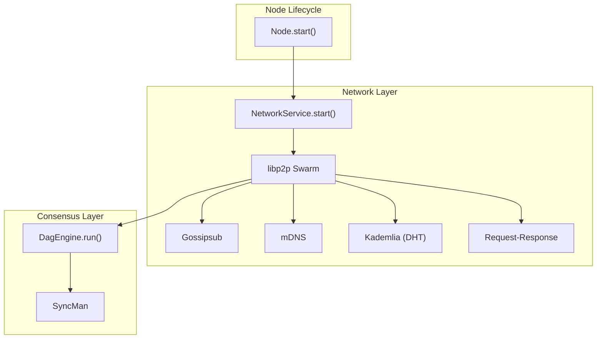
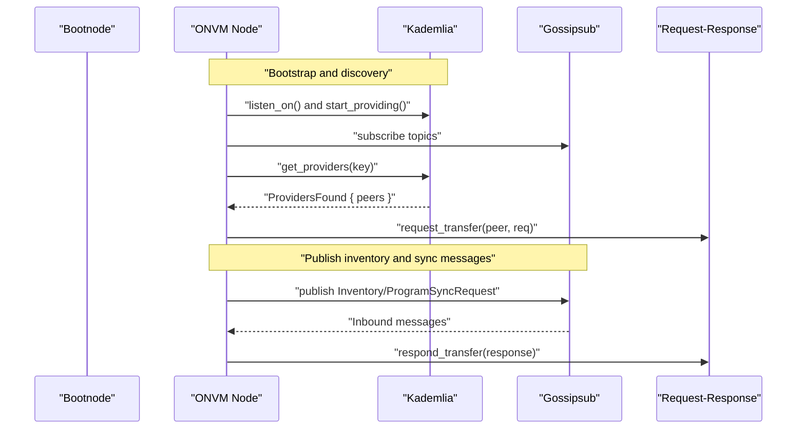
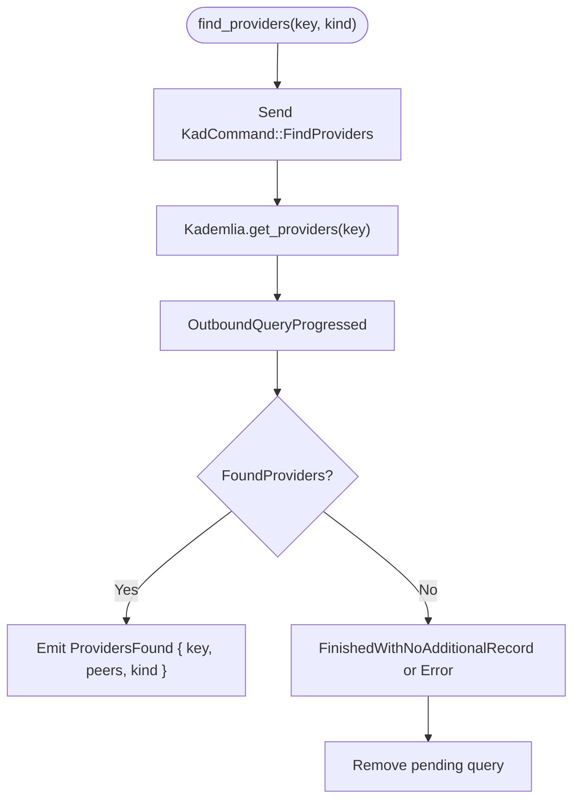
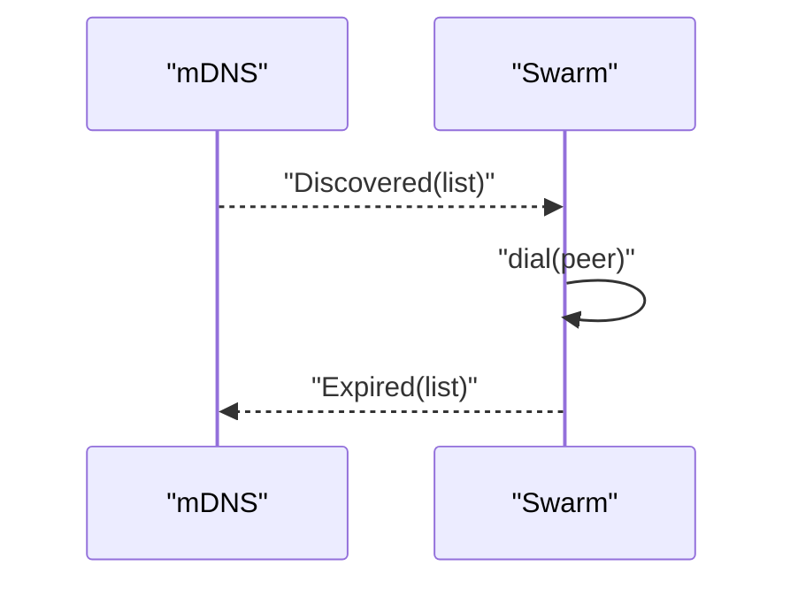
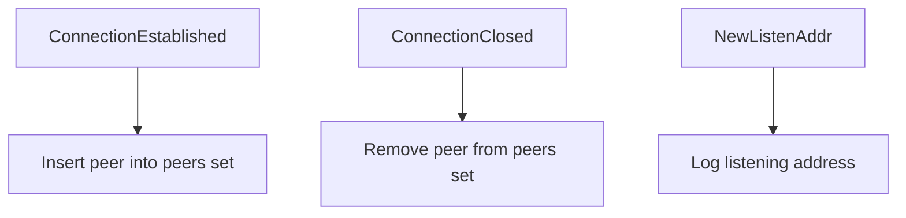
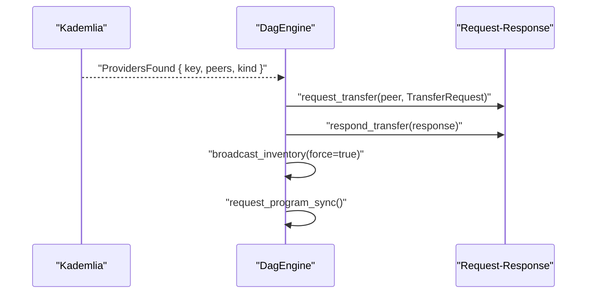
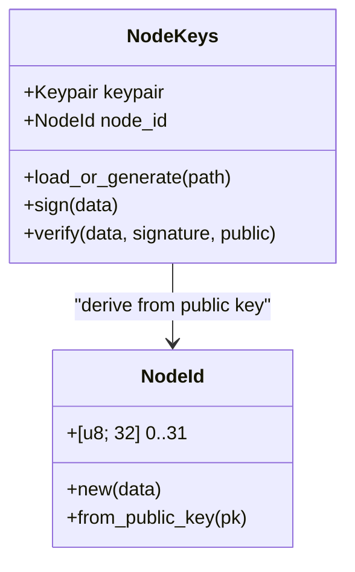
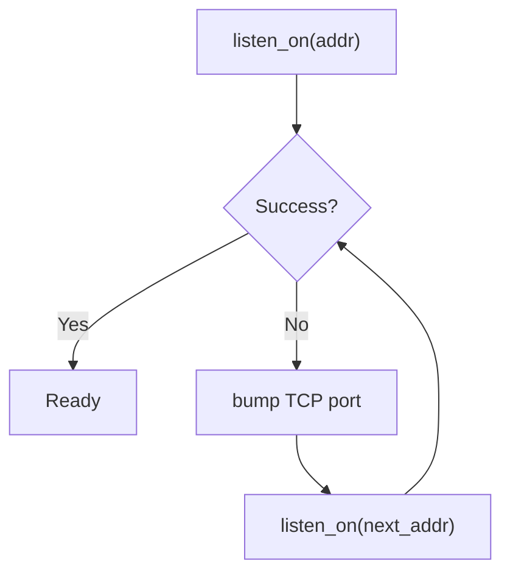
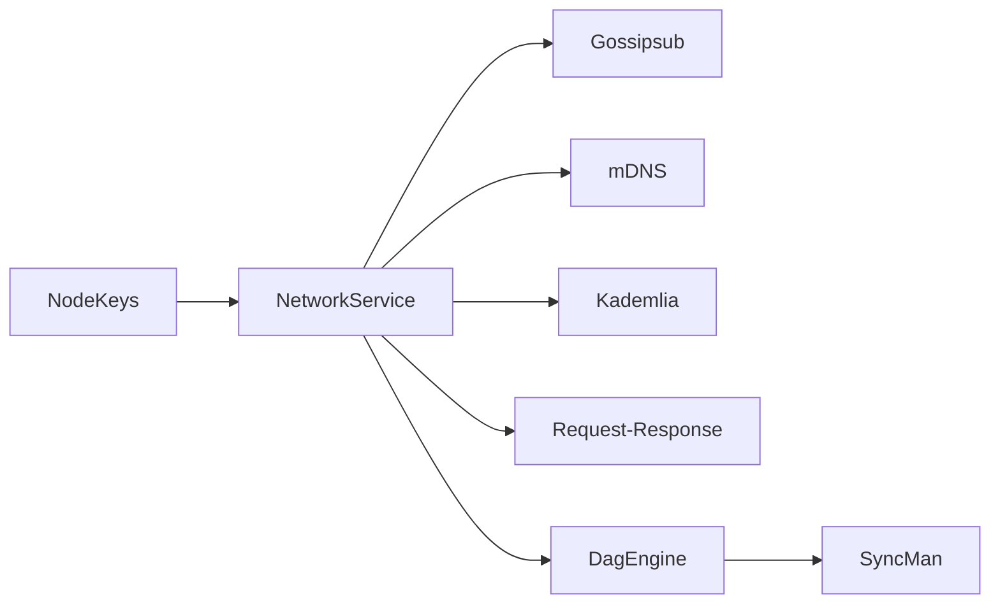

# Peer Discovery

<cite>
**Referenced Files in This Document**
- [service.rs](file://src/network/service.rs)
- [node.rs](file://src/node.rs)
- [mod.rs](file://src/consensus/mod.rs)
- [keys.rs](file://src/crypto/keys.rs)
- [types.rs](file://src/types.rs)
- [mod.rs](file://src/config/mod.rs)
- [mod.rs](file://src/syncer/mod.rs)
</cite>

## Table of Contents
1. [Introduction](#introduction)
2. [Project Structure](#project-structure)
3. [Core Components](#core-components)
4. [Architecture Overview](#architecture-overview)
5. [Detailed Component Analysis](#detailed-component-analysis)
6. [Dependency Analysis](#dependency-analysis)
7. [Performance Considerations](#performance-considerations)
8. [Troubleshooting Guide](#troubleshooting-guide)
9. [Conclusion](#conclusion)

## Introduction
This document explains the peer discovery mechanism built on libp2p’s Kademlia DHT within the ONVM node. It covers how nodes bootstrap into the network, how Kademlia routing tables are configured, how peers are discovered and maintained, and how provider hints are integrated with consensus for block synchronization. It also documents multiaddr formats used for peer identification, how NodeId is derived from public keys, and practical guidance for NAT traversal, dynamic IP handling, and mitigating peer spoofing. Finally, it outlines performance considerations such as query parallelism, bucket refresh strategies, and minimizing discovery latency.

## Project Structure
The peer discovery stack spans several modules:
- Network service: libp2p swarm setup, gossipsub, mDNS, Kademlia, and request-response transport.
- Consensus: consumes provider hints and orchestrates synchronization with discovered peers.
- Crypto and types: NodeId derivation from public keys and shared type definitions.
- Config: default bootnodes and network parameters.
- Node lifecycle: starts network service and wires it into consensus.

**Diagram sources**
- [node.rs](file://src/node.rs#L58-L120)
- [service.rs](file://src/network/service.rs#L212-L264)
- [mod.rs](file://src/consensus/mod.rs#L104-L118)
- [mod.rs](file://src/syncer/mod.rs#L15-L55)

**Section sources**
- [node.rs](file://src/node.rs#L58-L120)
- [service.rs](file://src/network/service.rs#L212-L264)
- [mod.rs](file://src/consensus/mod.rs#L104-L118)
- [mod.rs](file://src/syncer/mod.rs#L15-L55)

## Core Components
- NetworkService: constructs the libp2p identity, creates gossipsub, mDNS, Kademlia, and request-response behaviours, binds listeners, and runs the event loop.
- NetworkHandle: exposes APIs to publish messages, provide records in DHT, find providers, and issue transfer requests.
- Consensus (DagEngine): tracks connected peers, reacts to provider hints from Kademlia, and triggers synchronization workflows.
- Node: orchestrates network startup, initializes consensus, and starts the initial sync loop.

Key responsibilities:
- Bootstrap: listen on configured address; rely on mDNS and Kademlia for peer discovery.
- Routing: Kademlia maintains routing table entries and responds to provider queries.
- Validation: NodeId is derived from the node’s Ed25519 public key; gossipsub signatures and message deduplication reduce spoofing risk.
- Synchronization: provider hints trigger targeted requests for missing programs/blobs/executions.

**Section sources**
- [service.rs](file://src/network/service.rs#L136-L167)
- [service.rs](file://src/network/service.rs#L212-L264)
- [mod.rs](file://src/consensus/mod.rs#L177-L191)
- [node.rs](file://src/node.rs#L58-L120)

## Architecture Overview
The discovery pipeline integrates libp2p’s Kademlia DHT with gossipsub messaging and request-response transfers. Nodes subscribe to topics, discover peers via mDNS and Kademlia, and exchange inventory and sync messages.

**Diagram sources**
- [service.rs](file://src/network/service.rs#L212-L264)
- [service.rs](file://src/network/service.rs#L315-L336)
- [service.rs](file://src/network/service.rs#L373-L383)
- [service.rs](file://src/network/service.rs#L384-L393)
- [mod.rs](file://src/consensus/mod.rs#L732-L753)
- [mod.rs](file://src/consensus/mod.rs#L763-L778)

## Detailed Component Analysis

### Kademlia DHT and Provider Discovery
- Initialization: Kademlia is constructed with a MemoryStore keyed by the node’s PeerId.
- Queries: The NetworkHandle exposes find_providers(key, kind) which triggers get_providers on Kademlia. The event loop forwards FoundProviders to consensus as ProvidersFound events.
- Provider kinds: Program and Blob are supported; consensus routes provider hints accordingly.

**Diagram sources**
- [service.rs](file://src/network/service.rs#L145-L167)
- [service.rs](file://src/network/service.rs#L373-L383)
- [service.rs](file://src/network/service.rs#L315-L336)

**Section sources**
- [service.rs](file://src/network/service.rs#L240-L243)
- [service.rs](file://src/network/service.rs#L315-L336)
- [service.rs](file://src/network/service.rs#L373-L383)

### Peer Address Caching and mDNS
- mDNS discovery: On Discovered events, the swarm attempts to dial peers. Expired events are logged for diagnostics.
- Address caching: libp2p manages observed addresses internally; the node subscribes to gossipsub topics and relies on swarm connectivity to maintain peers.

**Diagram sources**
- [service.rs](file://src/network/service.rs#L302-L314)

**Section sources**
- [service.rs](file://src/network/service.rs#L302-L314)

### Handling Expired or Unreachable Peers
- ConnectionEstablished and ConnectionClosed events update the peer set in consensus.
- The idle connection timeout is configured to keep connections warm while avoiding resource waste.

**Diagram sources**
- [service.rs](file://src/network/service.rs#L341-L348)
- [service.rs](file://src/network/service.rs#L337-L340)

**Section sources**
- [service.rs](file://src/network/service.rs#L341-L348)
- [service.rs](file://src/network/service.rs#L337-L340)

### Integration with Consensus: Provider Hints and Synchronization
- ProvidersFound: Consensus receives provider hints and triggers targeted requests for missing artifacts.
- Inventory and sync: The node publishes inventory periodically and on peer connect; it requests program sync and handles incoming inventory to reconcile missing data.

**Diagram sources**
- [service.rs](file://src/network/service.rs#L315-L336)
- [mod.rs](file://src/consensus/mod.rs#L177-L191)
- [mod.rs](file://src/consensus/mod.rs#L732-L753)
- [mod.rs](file://src/consensus/mod.rs#L763-L778)

**Section sources**
- [service.rs](file://src/network/service.rs#L315-L336)
- [mod.rs](file://src/consensus/mod.rs#L177-L191)
- [mod.rs](file://src/consensus/mod.rs#L732-L753)
- [mod.rs](file://src/consensus/mod.rs#L763-L778)

### NodeId Derivation and Public Key Identity
- NodeId is derived from the Ed25519 public key bytes. The node’s libp2p PeerId is derived from the same public key, aligning identity across subsystems.
- NodeKeys encapsulates the Ed25519 keypair and computes NodeId from the public key.

**Diagram sources**
- [keys.rs](file://src/crypto/keys.rs#L1-L73)
- [types.rs](file://src/types.rs#L80-L93)

**Section sources**
- [keys.rs](file://src/crypto/keys.rs#L1-L73)
- [types.rs](file://src/types.rs#L80-L93)

### Multiaddr Formats and Peer Identification
- Multiaddrs are used to configure listen addresses and represent peers. The node attempts to bind to a given Multiaddr and falls back to incrementing TCP ports if binding fails.
- PeerId is the libp2p identity derived from the Ed25519 public key; NodeId is a separate identifier derived from the same public key.

Practical guidance:
- Use explicit TCP/TLS/Noise/yamux transports as configured.
- When specifying bootnodes, include the PeerId suffix in the multiaddr string.

**Section sources**
- [service.rs](file://src/network/service.rs#L255-L264)
- [node.rs](file://src/node.rs#L135-L162)

### Configuration of Kademlia Routing Tables and Peer Address Caching
- Kademlia is instantiated with a MemoryStore keyed by PeerId; libp2p manages routing table updates automatically.
- mDNS is enabled to discover peers on the local network.
- No explicit Kademlia configuration is shown in the code; defaults are used.

Operational notes:
- Routing table maintenance is handled by libp2p; the application does not manually refresh buckets.
- Address caching is implicit through swarm dialing and connection tracking.

**Section sources**
- [service.rs](file://src/network/service.rs#L240-L243)
- [service.rs](file://src/network/service.rs#L240-L241)

### Bootstrapping and Dynamic IP Handling
- The node listens on a configured Multiaddr and logs the effective listening address.
- If binding fails, the node increments the TCP port and retries until successful or exhausted.

**Diagram sources**
- [node.rs](file://src/node.rs#L58-L83)
- [node.rs](file://src/node.rs#L135-L162)

**Section sources**
- [node.rs](file://src/node.rs#L58-L83)
- [node.rs](file://src/node.rs#L135-L162)

### NAT Traversal and UPnP
- The codebase does not include explicit UPnP or NAT-PMP traversal logic. mDNS and Kademlia are used for discovery; NAT traversal depends on external router configuration and libp2p transport capabilities.
- Recommendations:
  - Configure port forwarding on the router to expose the listening TCP port.
  - Ensure firewall allows inbound connections on the configured port.
  - Consider enabling NAT traversal features in libp2p transports if available in your environment.

[No sources needed since this section provides general guidance]

### Mitigating Peer Spoofing
- Gossipsub validates messages and uses signed identities; message deduplication reduces replay attacks.
- NodeId is derived from the Ed25519 public key, providing cryptographic identity alignment across subsystems.

**Section sources**
- [service.rs](file://src/network/service.rs#L221-L239)
- [service.rs](file://src/network/service.rs#L409-L424)
- [keys.rs](file://src/crypto/keys.rs#L1-L73)

## Dependency Analysis
- NetworkService depends on libp2p’s identity, gossipsub, mDNS, Kademlia, and request-response modules.
- Consensus depends on NetworkHandle for publishing messages, requesting transfers, and receiving provider hints.
- Node composes NetworkService and DagEngine, wiring events and tasks.

**Diagram sources**
- [service.rs](file://src/network/service.rs#L212-L264)
- [mod.rs](file://src/consensus/mod.rs#L104-L118)
- [mod.rs](file://src/syncer/mod.rs#L15-L55)

**Section sources**
- [service.rs](file://src/network/service.rs#L212-L264)
- [mod.rs](file://src/consensus/mod.rs#L104-L118)
- [mod.rs](file://src/syncer/mod.rs#L15-L55)

## Performance Considerations
- Query parallelism: The event loop processes Kademlia OutboundQueryProgressed events concurrently with other swarm events. There is no explicit parallelism limit enforced in the code.
- Bucket refresh strategies: No manual refresh is performed; libp2p’s internal Kademlia lifecycle manages routing table maintenance.
- Minimizing discovery latency:
  - Enable mDNS for LAN discovery.
  - Provide records for artifacts (programs/blobs) to accelerate provider lookups.
  - Use gossipsub topics to quickly propagate inventory and sync requests.

[No sources needed since this section provides general guidance]

## Troubleshooting Guide
Common issues and remedies:
- Cannot bind to listen address:
  - The node retries by incrementing the TCP port until successful. Verify that the chosen port is free and allowed by the OS/firewall.
- No peers discovered:
  - Ensure mDNS is reachable on the local network and that peers are subscribed to the same topics.
  - Confirm that Kademlia is started and that provider queries are issued for missing artifacts.
- Provider hints not received:
  - Verify that find_providers is called with the correct keys and that the event loop is running.
- Transfer failures:
  - Inspect outbound/inbound transfer failures and ensure the remote peer is connected and responsive.

**Section sources**
- [node.rs](file://src/node.rs#L58-L83)
- [service.rs](file://src/network/service.rs#L302-L314)
- [service.rs](file://src/network/service.rs#L315-L336)
- [service.rs](file://src/network/service.rs#L349-L369)

## Conclusion
The ONVM node integrates libp2p’s Kademlia DHT with gossipsub and request-response to provide robust peer discovery and synchronization. Kademlia’s routing table is managed implicitly by libp2p, while mDNS accelerates LAN discovery. NodeId is derived from the Ed25519 public key, aligning identity across subsystems. The consensus layer consumes provider hints to drive targeted synchronization, and the node gracefully handles dynamic IP scenarios by retrying bind operations. For production deployments, ensure NAT traversal is configured externally and leverage gossipsub and provider hints to minimize discovery latency.