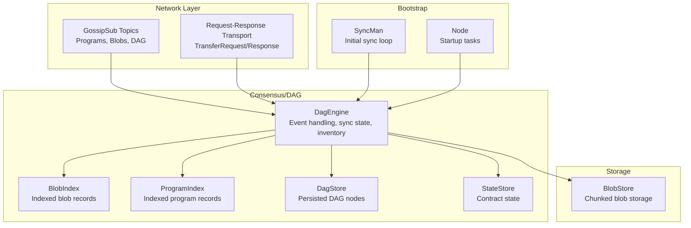
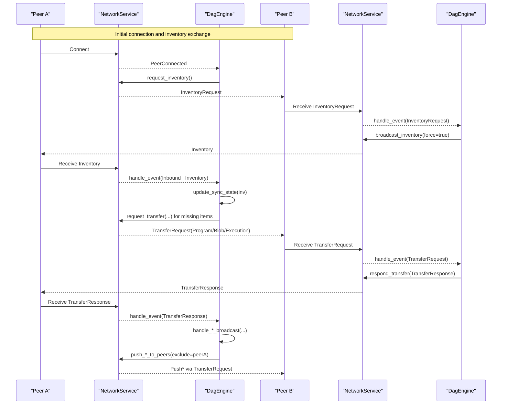
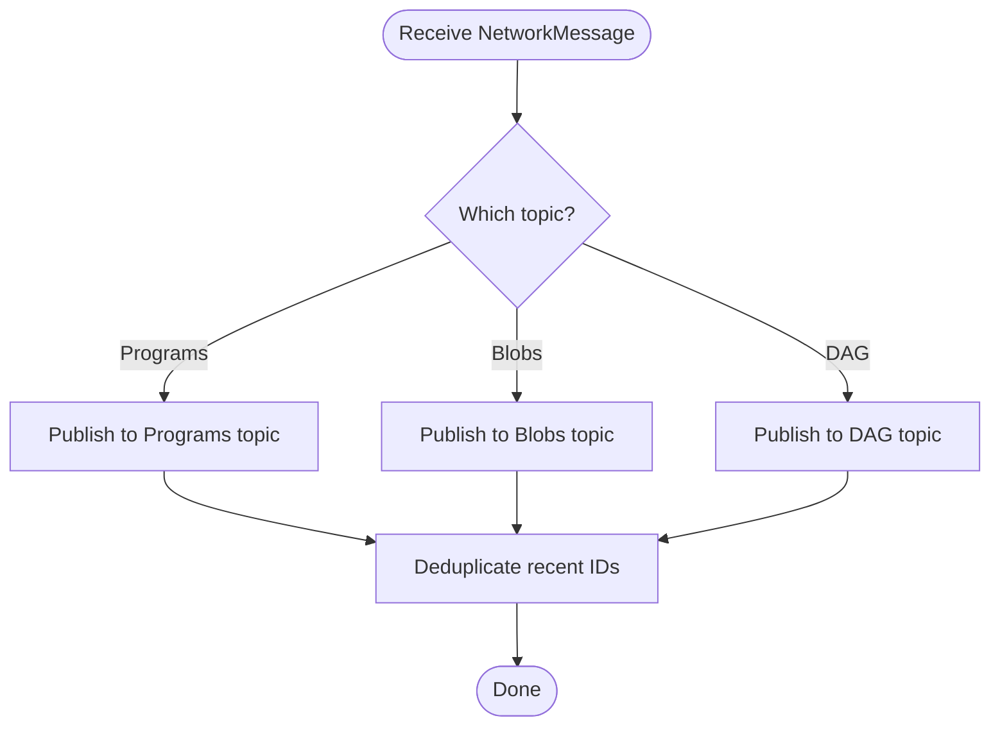
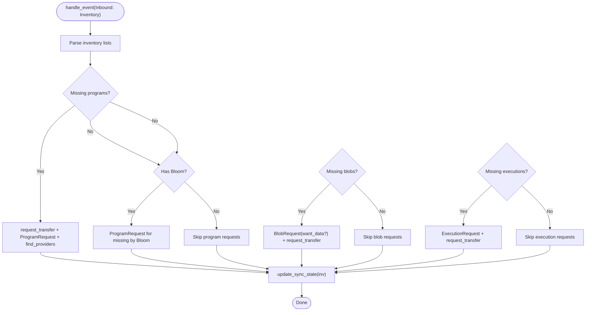
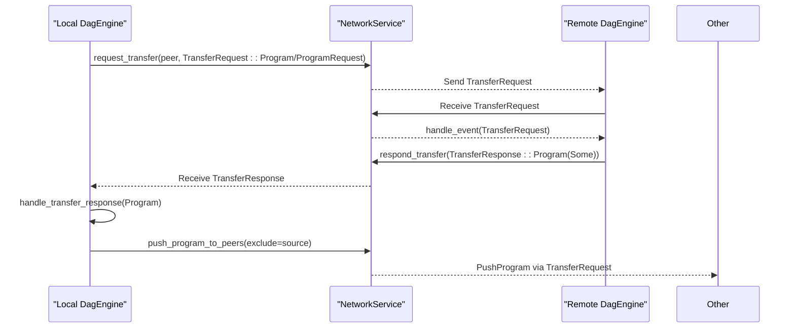
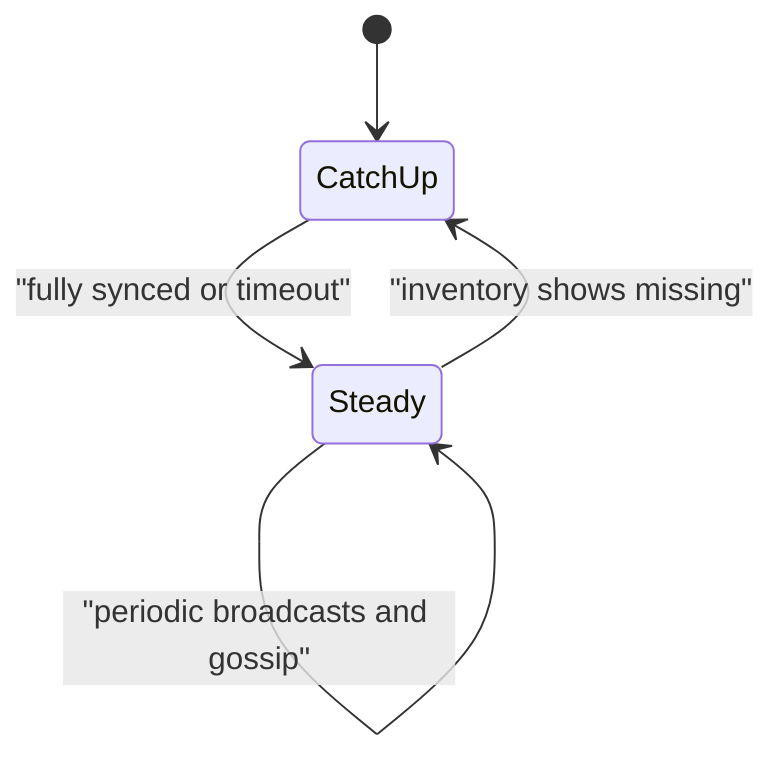
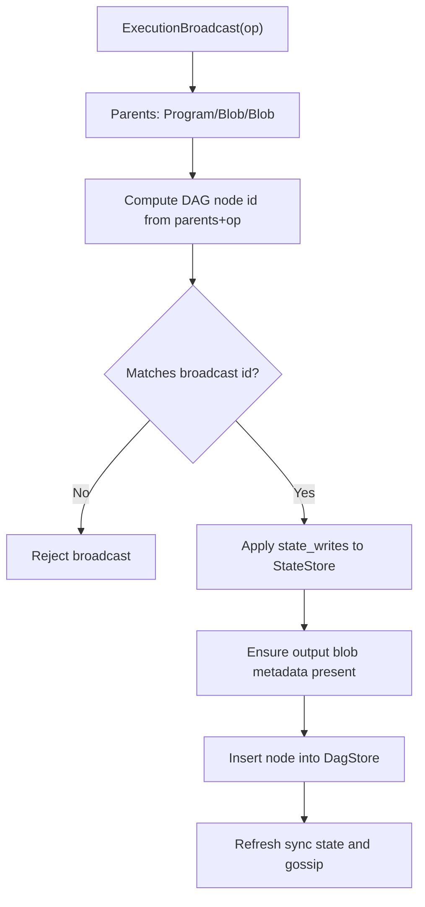
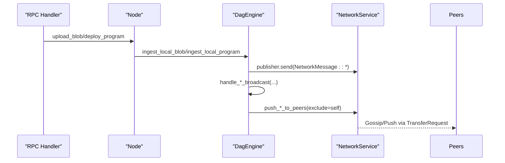
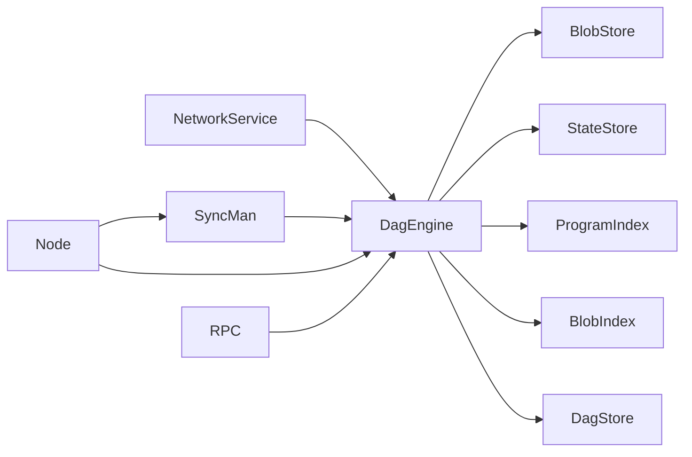

# Synchronization

<cite>
**Referenced Files in This Document**
- [src/syncer/mod.rs](file://src/syncer/mod.rs)
- [src/consensus/mod.rs](file://src/consensus/mod.rs)
- [src/network/service.rs](file://src/network/service.rs)
- [src/storage/state_store.rs](file://src/storage/state_store.rs)
- [src/storage/blob_store.rs](file://src/storage/blob_store.rs)
- [src/types.rs](file://src/types.rs)
- [src/node.rs](file://src/node.rs)
- [src/cli.rs](file://src/cli.rs)
- [src/rpc/mod.rs](file://src/rpc/mod.rs)
</cite>

## Table of Contents
1. [Introduction](#introduction)
2. [Project Structure](#project-structure)
3. [Core Components](#core-components)
4. [Architecture Overview](#architecture-overview)
5. [Detailed Component Analysis](#detailed-component-analysis)
6. [Dependency Analysis](#dependency-analysis)
7. [Performance Considerations](#performance-considerations)
8. [Troubleshooting Guide](#troubleshooting-guide)
9. [Conclusion](#conclusion)

## Introduction
This document explains how the system synchronizes blocks and state across peers in a DAG-based ledger. It covers:
- How GossipSub propagates new blocks and related data across the network
- How the syncer module ensures convergence of the DAG among peers
- Request-response flows for missing blocks and metadata using custom RPC-like protocols
- Synchronization states: catching up, steady-state gossiping, and conflict resolution during network partitions
- Examples of sync metadata exchange and handling forked chains
- Common issues: message duplication, slow peers, and bandwidth throttling
- Performance considerations: batched transfers, prioritization of recent blocks, and backpressure

## Project Structure
The synchronization pipeline spans several modules:
- Network layer: GossipSub topics and request-response transport
- Consensus/DAG engine: ingestion, validation, indexing, and sync state computation
- Storage: blob and state persistence
- Syncer: initial catch-up and progress monitoring
- Node/RPC: bootstrap and RPC-driven ingestion

**Diagram sources**
- [src/network/service.rs](file://src/network/service.rs#L22-L458)
- [src/consensus/mod.rs](file://src/consensus/mod.rs#L60-L1112)
- [src/syncer/mod.rs](file://src/syncer/mod.rs#L1-L69)
- [src/node.rs](file://src/node.rs#L37-L132)

**Section sources**
- [src/network/service.rs](file://src/network/service.rs#L22-L458)
- [src/consensus/mod.rs](file://src/consensus/mod.rs#L60-L1112)
- [src/syncer/mod.rs](file://src/syncer/mod.rs#L1-L69)
- [src/node.rs](file://src/node.rs#L37-L132)

## Core Components
- NetworkService: Initializes libp2p with GossipSub, mDNS, Kademlia, and CBOR-based request-response. Publishes to dedicated topics and deduplicates messages.
- DagEngine: Central event handler for inbound messages, maintains indices, computes sync state, and drives inventory broadcasts.
- SyncMan: Orchestrates initial catch-up with timeouts and progress logging.
- BlobStore and StateStore: Persistently store and reconstruct blobs and contract state.
- Types: Define identifiers and operation structures used across the system.

**Section sources**
- [src/network/service.rs](file://src/network/service.rs#L22-L458)
- [src/consensus/mod.rs](file://src/consensus/mod.rs#L60-L1112)
- [src/syncer/mod.rs](file://src/syncer/mod.rs#L1-L69)
- [src/storage/blob_store.rs](file://src/storage/blob_store.rs#L1-L185)
- [src/storage/state_store.rs](file://src/storage/state_store.rs#L1-L80)
- [src/types.rs](file://src/types.rs#L1-L109)

## Architecture Overview
The system uses a hybrid gossip plus request-response model:
- GossipSub topics:
  - Programs: program deployments and metadata
  - Blobs: blob publications and advertisements
  - DAG: inventory, requests, and execution broadcasts
- Request-response protocol:
  - TransferRequest/TransferResponse for targeted fetches and pushes
- Kademlia DHT:
  - Provides provider discovery for programs and blobs

**Diagram sources**
- [src/network/service.rs](file://src/network/service.rs#L22-L458)
- [src/consensus/mod.rs](file://src/consensus/mod.rs#L104-L191)
- [src/consensus/mod.rs](file://src/consensus/mod.rs#L501-L616)
- [src/consensus/mod.rs](file://src/consensus/mod.rs#L618-L697)
- [src/consensus/mod.rs](file://src/consensus/mod.rs#L699-L730)
- [src/consensus/mod.rs](file://src/consensus/mod.rs#L732-L761)
- [src/consensus/mod.rs](file://src/consensus/mod.rs#L763-L778)

## Detailed Component Analysis

### GossipSub Propagation of New Blocks and Data
- Topics:
  - Programs: program broadcasts and metadata
  - Blobs: blob broadcasts and advertisements
  - DAG: inventory, requests, and execution broadcasts
- Deduplication:
  - Recent message IDs are tracked to avoid reprocessing duplicates
- Message routing:
  - Program and blob messages are published to their respective topics
  - Inventory, requests, and execution-related messages are published to the DAG topic

**Diagram sources**
- [src/network/service.rs](file://src/network/service.rs#L395-L424)
- [src/network/service.rs](file://src/network/service.rs#L22-L41)

**Section sources**
- [src/network/service.rs](file://src/network/service.rs#L22-L458)

### DAG Convergence and Sync State Management
- Sync state computation:
  - Tracks missing programs, blobs, and executions relative to last received inventory
  - Updates counts and marks last_seen flag
- Inventory handling:
  - Parses incoming inventory and identifies missing items
  - Issues targeted requests and provider discovery hints
- Bloom filters:
  - Used to efficiently communicate program presence to peers
- Periodic broadcasting:
  - Broadcasts inventory periodically and on connect to keep peers aligned

**Diagram sources**
- [src/consensus/mod.rs](file://src/consensus/mod.rs#L501-L616)
- [src/consensus/mod.rs](file://src/consensus/mod.rs#L800-L837)

**Section sources**
- [src/consensus/mod.rs](file://src/consensus/mod.rs#L501-L616)
- [src/consensus/mod.rs](file://src/consensus/mod.rs#L800-L837)

### Request-Response Flow for Missing Items
- Protocols:
  - TransferRequest: Program, Blob, Execution, and push variants
  - TransferResponse: carries the requested payload or None
- Flow:
  - On receiving inventory, the node sends TransferRequest for missing items
  - Remote peer responds with TransferResponse containing the payload
  - The node validates and ingests the payload, then gossips it to others (excluding the source)

**Diagram sources**
- [src/network/service.rs](file://src/network/service.rs#L145-L167)
- [src/consensus/mod.rs](file://src/consensus/mod.rs#L618-L697)
- [src/consensus/mod.rs](file://src/consensus/mod.rs#L699-L730)

**Section sources**
- [src/network/service.rs](file://src/network/service.rs#L42-L58)
- [src/consensus/mod.rs](file://src/consensus/mod.rs#L618-L697)
- [src/consensus/mod.rs](file://src/consensus/mod.rs#L699-L730)

### Synchronization States and Transitions
- Catching up:
  - Initial sync loop checks peer count, requests inventory, refreshes sync state, and logs progress
  - Loop exits early on timeout or when fully synced
- Steady-state gossiping:
  - Periodic inventory broadcasts and on-connect broadcasts keep peers aligned
  - GossipSub propagates new items as they arrive
- Conflict resolution during partitions:
  - Execution broadcasts carry state_writes; applying them in order reconciles divergent states
  - DAG node IDs are deterministically derived from parents and operation, ensuring consensus on identity

**Diagram sources**
- [src/syncer/mod.rs](file://src/syncer/mod.rs#L15-L69)
- [src/consensus/mod.rs](file://src/consensus/mod.rs#L104-L118)
- [src/consensus/mod.rs](file://src/consensus/mod.rs#L445-L483)

**Section sources**
- [src/syncer/mod.rs](file://src/syncer/mod.rs#L15-L69)
- [src/consensus/mod.rs](file://src/consensus/mod.rs#L104-L118)
- [src/consensus/mod.rs](file://src/consensus/mod.rs#L445-L483)

### Sync Metadata Exchange and Fork Handling
- Sync metadata:
  - Inventory includes program IDs, Bloom filter, blob inventory entries, and execution IDs
  - Blob inventory entries include presence flags and locations
- Fork handling:
  - Execution broadcasts include state_writes; applying them in order updates state consistently
  - DAG node IDs are computed from parents and operation; mismatches are rejected

**Diagram sources**
- [src/consensus/mod.rs](file://src/consensus/mod.rs#L445-L483)
- [src/consensus/mod.rs](file://src/consensus/mod.rs#L1089-L1112)
- [src/storage/state_store.rs](file://src/storage/state_store.rs#L17-L41)

**Section sources**
- [src/consensus/mod.rs](file://src/consensus/mod.rs#L92-L116)
- [src/consensus/mod.rs](file://src/consensus/mod.rs#L445-L483)
- [src/consensus/mod.rs](file://src/consensus/mod.rs#L1089-L1112)
- [src/storage/state_store.rs](file://src/storage/state_store.rs#L17-L41)

### RPC-Driven Ingestion and Dissemination
- RPC endpoints:
  - Upload blob and deploy program endpoints trigger local ingestion and immediate gossip
- Ingestion paths:
  - Local RPC calls call DagEngine ingest methods, which publish and propagate to peers

**Diagram sources**
- [src/rpc/mod.rs](file://src/rpc/mod.rs#L98-L174)
- [src/consensus/mod.rs](file://src/consensus/mod.rs#L261-L292)
- [src/consensus/mod.rs](file://src/consensus/mod.rs#L699-L730)

**Section sources**
- [src/rpc/mod.rs](file://src/rpc/mod.rs#L98-L174)
- [src/consensus/mod.rs](file://src/consensus/mod.rs#L261-L292)
- [src/consensus/mod.rs](file://src/consensus/mod.rs#L699-L730)

## Dependency Analysis
- NetworkService depends on libp2p for GossipSub, mDNS, Kademlia, and CBOR request-response
- DagEngine depends on BlobStore, StateStore, ProgramStore, and ExecutionScheduler
- SyncMan depends on DagEngine’s sync state and inventory APIs
- Node composes all subsystems and starts background tasks

**Diagram sources**
- [src/network/service.rs](file://src/network/service.rs#L202-L253)
- [src/consensus/mod.rs](file://src/consensus/mod.rs#L60-L1112)
- [src/syncer/mod.rs](file://src/syncer/mod.rs#L1-L69)
- [src/node.rs](file://src/node.rs#L37-L132)
- [src/rpc/mod.rs](file://src/rpc/mod.rs#L62-L96)

**Section sources**
- [src/network/service.rs](file://src/network/service.rs#L202-L253)
- [src/consensus/mod.rs](file://src/consensus/mod.rs#L60-L1112)
- [src/syncer/mod.rs](file://src/syncer/mod.rs#L1-L69)
- [src/node.rs](file://src/node.rs#L37-L132)
- [src/rpc/mod.rs](file://src/rpc/mod.rs#L62-L96)

## Performance Considerations
- Batched transfers:
  - Program metadata sync batches missing items to reduce overhead
- Prioritization of recent blocks:
  - Execution broadcasts include state_writes; applying them in order ensures recent state is propagated
- Backpressure and throttling:
  - Deduplication window prevents duplicate processing
  - Minimum peer threshold controls when to broadcast inventory
  - Request-response is targeted; provider discovery avoids flooding
- Chunked blob storage:
  - Blobs are chunked and validated, enabling efficient transfer and verification

**Section sources**
- [src/consensus/mod.rs](file://src/consensus/mod.rs#L361-L378)
- [src/network/service.rs](file://src/network/service.rs#L280-L283)
- [src/network/service.rs](file://src/network/service.rs#L732-L761)
- [src/storage/blob_store.rs](file://src/storage/blob_store.rs#L1-L185)

## Troubleshooting Guide
- Message duplication:
  - Symptom: repeated processing of the same message
  - Cause: multiple paths to the same peer
  - Mitigation: deduplication window tracks recent message IDs
- Slow peers causing bottlenecks:
  - Symptom: delayed sync despite connectivity
  - Cause: slow provider lookup or transfer responses
  - Mitigation: periodic inventory broadcasts; targeted requests; minimum peer threshold
- Bandwidth throttling:
  - Symptom: high CPU usage or dropped messages
  - Mitigation: Bloom filters reduce unnecessary transfers; chunked blobs minimize memory pressure
- Forked chains:
  - Symptom: inconsistent state across peers
  - Cause: conflicting execution sequences
  - Mitigation: deterministic DAG node IDs and ordered state_writes; reject mismatches

**Section sources**
- [src/network/service.rs](file://src/network/service.rs#L280-L283)
- [src/network/service.rs](file://src/network/service.rs#L315-L336)
- [src/consensus/mod.rs](file://src/consensus/mod.rs#L445-L483)
- [src/consensus/mod.rs](file://src/consensus/mod.rs#L1089-L1112)

## Conclusion
The system achieves robust synchronization by combining GossipSub for broad propagation with targeted request-response for missing items. The DAG engine maintains precise sync state, applies state updates deterministically, and ensures convergence across peers. Startup sync is guided by a controlled loop with timeouts, while steady-state relies on periodic inventory broadcasts and on-connect handshakes. The design mitigates duplication, throttles bandwidth, and resolves conflicts through deterministic DAG semantics.