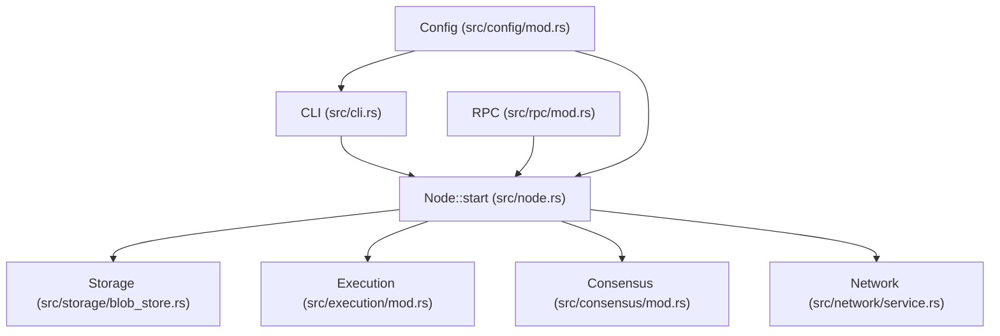
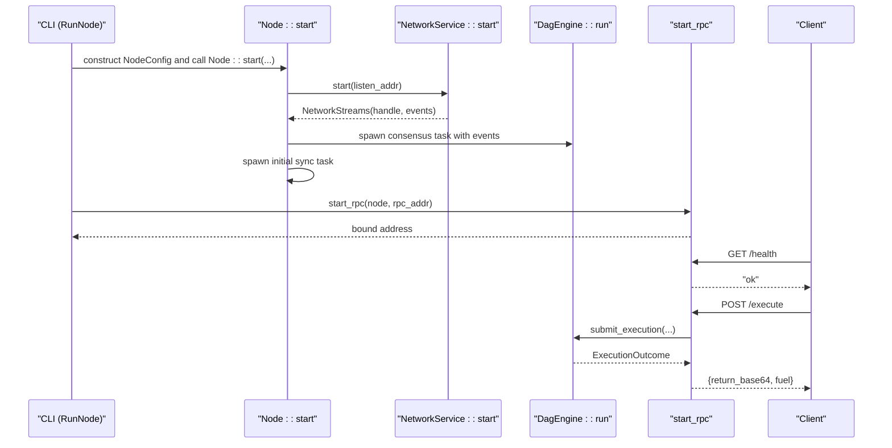
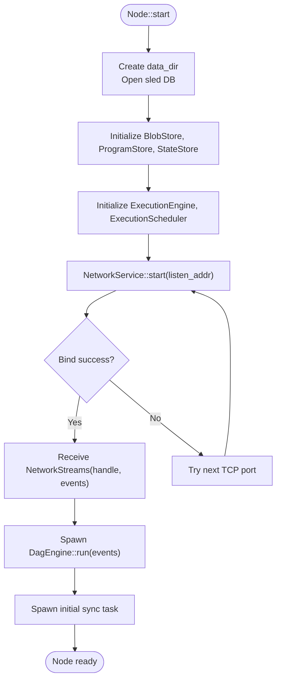
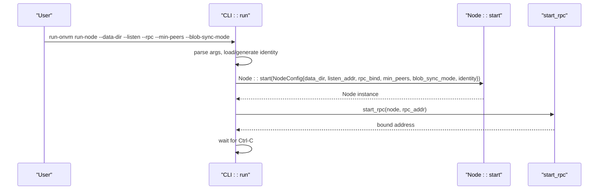
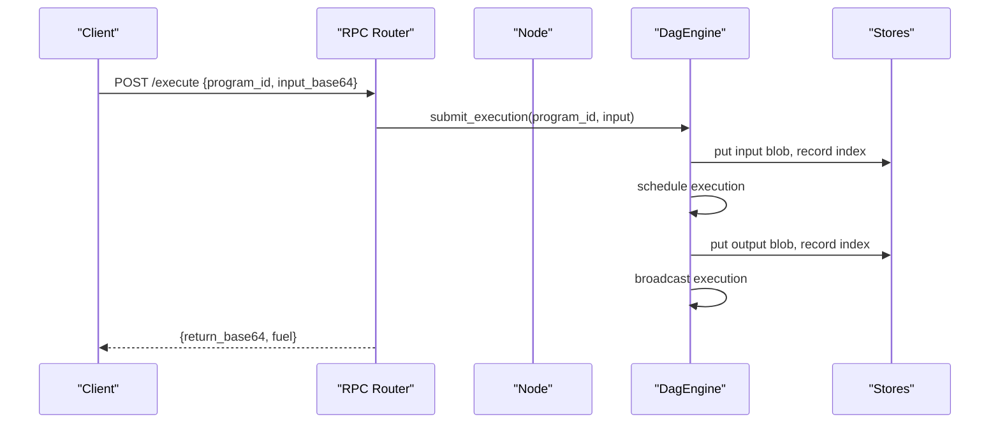
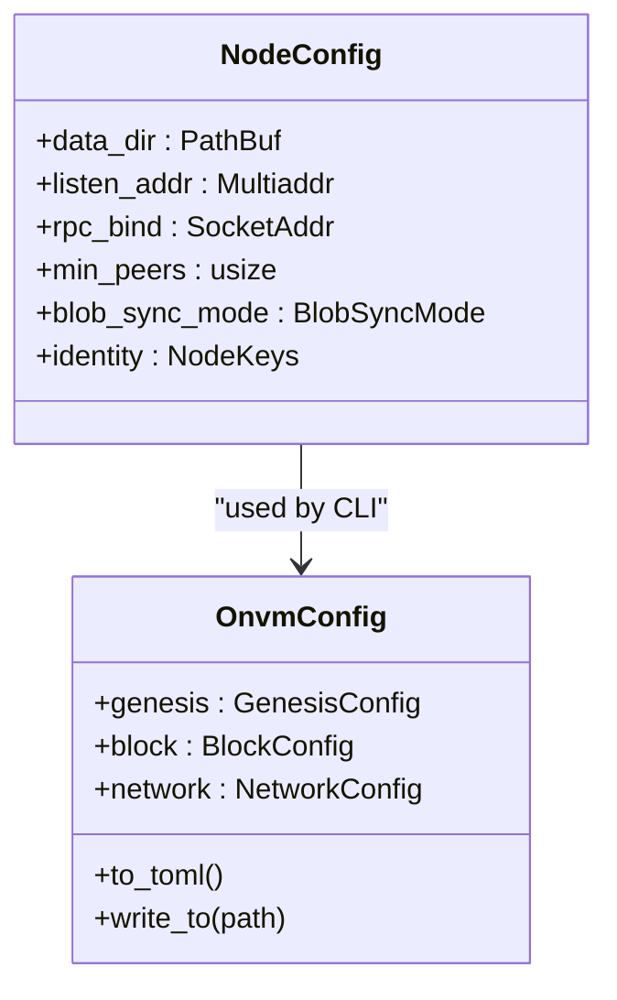
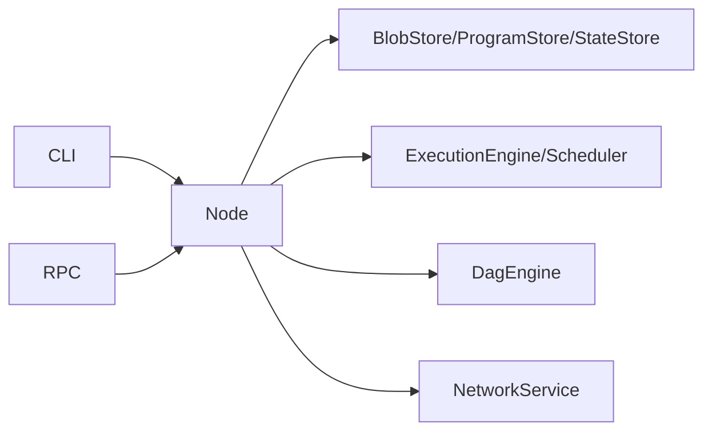

# Node Management

<cite>
**Referenced Files in This Document**
- [main.rs](file://src/main.rs)
- [cli.rs](file://src/cli.rs)
- [node.rs](file://src/node.rs)
- [rpc/mod.rs](file://src/rpc/mod.rs)
- [config/mod.rs](file://src/config/mod.rs)
- [consensus/mod.rs](file://src/consensus/mod.rs)
- [network/service.rs](file://src/network/service.rs)
- [storage/blob_store.rs](file://src/storage/blob_store.rs)
- [execution/mod.rs](file://src/execution/mod.rs)
</cite>

## Table of Contents
1. [Introduction](#introduction)
2. [Project Structure](#project-structure)
3. [Core Components](#core-components)
4. [Architecture Overview](#architecture-overview)
5. [Detailed Component Analysis](#detailed-component-analysis)
6. [Dependency Analysis](#dependency-analysis)
7. [Performance Considerations](#performance-considerations)
8. [Troubleshooting Guide](#troubleshooting-guide)
9. [Conclusion](#conclusion)
10. [Appendices](#appendices)

## Introduction
This document explains node lifecycle management in the system, focusing on how a node initializes, starts up, runs, and shuts down. It details how the Node integrates consensus, network, execution, and storage subsystems, and how event loops are managed. It also covers invocation relationships among CLI commands, configuration loading, and RPC integration. Finally, it provides usage patterns for single-node development versus multi-node production, custom configuration examples, monitoring node health, common issues (port conflicts, corrupted storage, identity file permissions), and performance considerations around resource allocation and Tokio runtime thread pooling.

## Project Structure
The node lifecycle spans several modules:
- CLI entrypoint and commands orchestrate startup and RPC exposure.
- Node composes and wires core subsystems: storage, execution, consensus, and network.
- RPC exposes health checks and program/blob APIs backed by Node internals.
- Configuration defines runtime parameters shared across components.

**Diagram sources**
- [cli.rs](file://src/cli.rs#L109-L171)
- [node.rs](file://src/node.rs#L37-L132)
- [rpc/mod.rs](file://src/rpc/mod.rs#L62-L96)
- [config/mod.rs](file://src/config/mod.rs#L113-L139)
- [storage/blob_store.rs](file://src/storage/blob_store.rs#L18-L46)
- [execution/mod.rs](file://src/execution/mod.rs#L1-L9)
- [consensus/mod.rs](file://src/consensus/mod.rs#L77-L118)
- [network/service.rs](file://src/network/service.rs#L213-L279)

**Section sources**
- [main.rs](file://src/main.rs#L1-L7)
- [cli.rs](file://src/cli.rs#L109-L171)
- [node.rs](file://src/node.rs#L37-L132)
- [rpc/mod.rs](file://src/rpc/mod.rs#L62-L96)
- [config/mod.rs](file://src/config/mod.rs#L113-L139)

## Core Components
- NodeConfig: carries data_dir, listen_addr, rpc_bind, min_peers, blob_sync_mode, and identity.
- Node: owns handles to identity, blob_store, program_store, execution engine, scheduler, consensus, and network. It spawns background tasks for consensus and initial sync.
- CLI: parses arguments, loads/generates identity, constructs NodeConfig, starts Node, and launches RPC server. It also provides subcommands for blob/program operations and health checks.
- RPC: exposes health, blob upload/fetch, program deploy/info, and execution endpoints backed by Node’s stores and consensus.
- Configuration: defines genesis, block, and network parameters and serializes to TOML.

Key interfaces:
- Node::start(NodeConfig) -> Result<Node>: Initializes storage, engines, network, consensus, and sync tasks.
- Node::run(): Not implemented in the shown code; lifecycle is driven by spawned tasks and CLI-driven shutdown.
- CLI commands: RunNode, Init, UploadBlob, Deploy, Execute, GetBlob, ProgramInfo.
- RPC endpoints: /health, /blobs, /blobs/:id, /programs, /programs/:id, /execute.

**Section sources**
- [node.rs](file://src/node.rs#L14-L36)
- [node.rs](file://src/node.rs#L37-L132)
- [cli.rs](file://src/cli.rs#L109-L171)
- [rpc/mod.rs](file://src/rpc/mod.rs#L62-L96)
- [config/mod.rs](file://src/config/mod.rs#L113-L139)

## Architecture Overview
The node lifecycle is orchestrated by the CLI, which builds a Node from configuration and starts both the consensus event loop and the RPC server. The Node composes:
- Storage: BlobStore persists and retrieves binary blobs with chunking and Merkle roots.
- Execution: ExecutionEngine and ExecutionScheduler coordinate program execution.
- Consensus: DagEngine processes network events, maintains DAG nodes, and coordinates sync.
- Network: NetworkService runs libp2p gossipsub/mdns/kademlia and request-response channels.

**Diagram sources**
- [cli.rs](file://src/cli.rs#L130-L171)
- [node.rs](file://src/node.rs#L37-L132)
- [network/service.rs](file://src/network/service.rs#L213-L279)
- [consensus/mod.rs](file://src/consensus/mod.rs#L104-L118)
- [rpc/mod.rs](file://src/rpc/mod.rs#L62-L96)

## Detailed Component Analysis

### Node Lifecycle: Initialization, Startup, Shutdown, Reconfiguration
- Initialization:
  - Node::start creates data directories, opens storage, constructs BlobStore, ProgramStore, StateStore, ExecutionEngine, ExecutionScheduler, and NetworkService.
  - It retries listen_addr with incremental TCP ports if binding fails.
- Startup:
  - NetworkService::start binds to listen_addr and initializes libp2p gossipsub, mDNS, Kademlia, and CBOR request-response.
  - DagEngine::run is spawned to process NetworkEvent stream and periodically broadcast inventory.
  - An initial sync task awaits initial synchronization with peers.
- Shutdown:
  - No explicit shutdown method is present in the shown code. The CLI waits for Ctrl-C and exits, allowing tasks to terminate naturally. Background tasks are JoinHandles stored in Node.
- Reconfiguration:
  - Node::start does not expose reconfiguration methods. Runtime parameters are primarily configured via CLI and NodeConfig. Configuration persistence is handled by CLI Init and config module.

**Diagram sources**
- [node.rs](file://src/node.rs#L37-L132)
- [network/service.rs](file://src/network/service.rs#L213-L279)

**Section sources**
- [node.rs](file://src/node.rs#L37-L132)
- [network/service.rs](file://src/network/service.rs#L213-L279)
- [consensus/mod.rs](file://src/consensus/mod.rs#L104-L118)

### CLI Invocation Relationships
- CLI::run parses arguments and routes to subcommands.
- RunNode:
  - Parses listen and rpc endpoints, loads/generates identity, constructs NodeConfig, calls Node::start, and starts RPC server.
  - Prints bound addresses and waits for Ctrl-C.
- Init:
  - Creates data_dir, generates/guards identity file, and writes default config if missing.
- Other subcommands:
  - UploadBlob, Deploy, Execute, GetBlob, ProgramInfo send HTTP requests to RPC endpoints.

**Diagram sources**
- [cli.rs](file://src/cli.rs#L109-L171)
- [node.rs](file://src/node.rs#L37-L132)
- [rpc/mod.rs](file://src/rpc/mod.rs#L62-L96)

**Section sources**
- [cli.rs](file://src/cli.rs#L109-L171)
- [main.rs](file://src/main.rs#L1-L7)

### RPC Integration and Health Monitoring
- RPC endpoints:
  - GET /health returns a simple health status.
  - POST /blobs uploads a blob and ingests it into consensus.
  - GET /blobs/:id fetches a blob.
  - POST /programs deploys a program and ingests it into consensus.
  - GET /programs/:id returns program metadata.
  - POST /execute submits execution and returns base64-encoded return data and fuel consumed.
- Health monitoring:
  - Use GET /health for liveness.
  - Use program and blob endpoints to validate data availability and ingestion.

**Diagram sources**
- [rpc/mod.rs](file://src/rpc/mod.rs#L194-L213)
- [consensus/mod.rs](file://src/consensus/mod.rs#L194-L258)
- [storage/blob_store.rs](file://src/storage/blob_store.rs#L18-L46)

**Section sources**
- [rpc/mod.rs](file://src/rpc/mod.rs#L62-L96)
- [rpc/mod.rs](file://src/rpc/mod.rs#L98-L213)

### Configuration Loading and Parameters
- CLI constructs NodeConfig from parsed arguments:
  - data_dir: base directory for DB, blobs, programs.
  - listen_addr: libp2p multiaddress to bind.
  - rpc_bind: TCP address for RPC server.
  - min_peers: minimum peers required for block production.
  - blob_sync_mode: full data replication or metadata-only.
  - identity: NodeKeys loaded or generated.
- Default configuration template:
  - GenesisConfig, BlockConfig, NetworkConfig serialized to TOML and written by CLI Init.

**Diagram sources**
- [node.rs](file://src/node.rs#L14-L21)
- [config/mod.rs](file://src/config/mod.rs#L113-L139)

**Section sources**
- [cli.rs](file://src/cli.rs#L130-L171)
- [config/mod.rs](file://src/config/mod.rs#L113-L139)

### Usage Patterns: Single-Node Development vs. Multi-Node Production
- Single-node development:
  - Use RunNode with a local listen address and a local RPC endpoint.
  - Use blob_sync_mode metadata for reduced bandwidth during development.
  - Use Init to bootstrap identity and config.
- Multi-node production:
  - Configure listen_addr to advertise reachable addresses.
  - Set min_peers according to network topology.
  - Use full blob_sync_mode for robustness.
  - Provide bootnodes in configuration for peer discovery.

[No sources needed since this section provides general guidance]

### Custom Configurations and Monitoring
- Custom configuration:
  - Use CLI Init to generate a default config file and adjust fields (e.g., min_peers, bootnodes).
  - Load and modify the TOML file before starting nodes.
- Monitoring:
  - Use GET /health for liveness.
  - Use program and blob endpoints to verify data presence and ingestion.
  - Observe logs from tracing subscribers for network and consensus events.

**Section sources**
- [config/mod.rs](file://src/config/mod.rs#L113-L139)
- [rpc/mod.rs](file://src/rpc/mod.rs#L62-L71)

### Common Issues and Resolutions
- Port conflicts:
  - Node::start retries listen_addr by incrementing TCP port until successful.
  - RPC server also increments port if binding fails.
- Corrupted storage:
  - BlobStore validates chunk counts, chunk hashes, Merkle roots, and sizes on read; mismatches raise errors.
- Identity file permissions:
  - CLI Init creates identity files under data_dir; ensure proper filesystem permissions for the data_dir.

**Section sources**
- [node.rs](file://src/node.rs#L135-L162)
- [rpc/mod.rs](file://src/rpc/mod.rs#L73-L95)
- [storage/blob_store.rs](file://src/storage/blob_store.rs#L78-L103)

## Dependency Analysis
The Node composes multiple subsystems and delegates responsibilities:
- Node depends on:
  - Storage: BlobStore, ProgramStore, StateStore.
  - Execution: ExecutionEngine, ExecutionScheduler.
  - Consensus: DagEngine, NetworkHandle.
  - Network: NetworkService, NetworkStreams.
- CLI depends on Node and RPC to orchestrate lifecycle and expose APIs.
- RPC depends on Node to access stores and consensus.

**Diagram sources**
- [cli.rs](file://src/cli.rs#L109-L171)
- [node.rs](file://src/node.rs#L37-L132)
- [rpc/mod.rs](file://src/rpc/mod.rs#L62-L96)

**Section sources**
- [node.rs](file://src/node.rs#L37-L132)
- [consensus/mod.rs](file://src/consensus/mod.rs#L77-L118)
- [network/service.rs](file://src/network/service.rs#L213-L279)
- [storage/blob_store.rs](file://src/storage/blob_store.rs#L18-L46)
- [execution/mod.rs](file://src/execution/mod.rs#L1-L9)

## Performance Considerations
- Resource allocation:
  - Node::start opens a sled database and initializes multiple stores; ensure adequate disk I/O and memory for blob chunking and Merkle computations.
  - ExecutionEngine and Scheduler manage WASM execution; tune concurrency and runtime settings accordingly.
- Thread pooling in Tokio:
  - Node spawns background tasks for consensus and sync; CLI waits for Ctrl-C. Consider adjusting runtime worker threads for heavy network or execution loads.
- Network throughput:
  - NetworkService uses gossipsub with strict validation and mDNS discovery; heartbeat intervals and provider lookups impact CPU and network usage.
- Blob sync modes:
  - MetadataOnly reduces bandwidth but may increase latency for data retrieval; FullData improves responsiveness at the cost of bandwidth.

[No sources needed since this section provides general guidance]

## Troubleshooting Guide
- Port conflicts:
  - Node::start and RPC server automatically increment ports; verify the final bound addresses printed by CLI.
- Storage corruption symptoms:
  - BlobStore read failures due to missing chunks, hash mismatches, or size mismatches indicate corruption; consider restoring from backups or re-syncing.
- Identity file permissions:
  - Ensure the data_dir and identity file are readable/writable by the running user; regenerate identity if needed via Init.
- Network connectivity:
  - Verify listen_addr is reachable and not blocked by firewalls; confirm mDNS and Kademlia bootstrap peers are configured appropriately.

**Section sources**
- [node.rs](file://src/node.rs#L135-L162)
- [rpc/mod.rs](file://src/rpc/mod.rs#L73-L95)
- [storage/blob_store.rs](file://src/storage/blob_store.rs#L78-L103)
- [network/service.rs](file://src/network/service.rs#L213-L279)

## Conclusion
The node lifecycle is centered on a clear initialization path that composes storage, execution, consensus, and network, with a robust event loop for consensus and a separate RPC server for external control and monitoring. CLI orchestration simplifies single-node development and multi-node production setups. While shutdown is implicit via process termination, the system provides strong observability via RPC health checks and tracing logs. Proper configuration, identity management, and awareness of storage integrity and port binding are essential for reliable operation.

[No sources needed since this section summarizes without analyzing specific files]

## Appendices

### Node Interfaces Reference
- Node::start(NodeConfig) -> Result<Node>
- NodeConfig fields: data_dir, listen_addr, rpc_bind, min_peers, blob_sync_mode, identity
- CLI RunNode: constructs NodeConfig and starts Node + RPC
- RPC endpoints: /health, /blobs, /blobs/:id, /programs, /programs/:id, /execute

**Section sources**
- [node.rs](file://src/node.rs#L14-L36)
- [node.rs](file://src/node.rs#L37-L132)
- [cli.rs](file://src/cli.rs#L130-L171)
- [rpc/mod.rs](file://src/rpc/mod.rs#L62-L96)