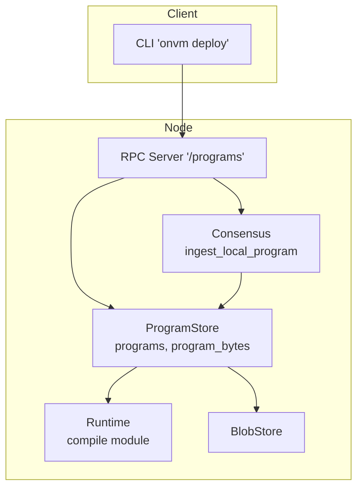
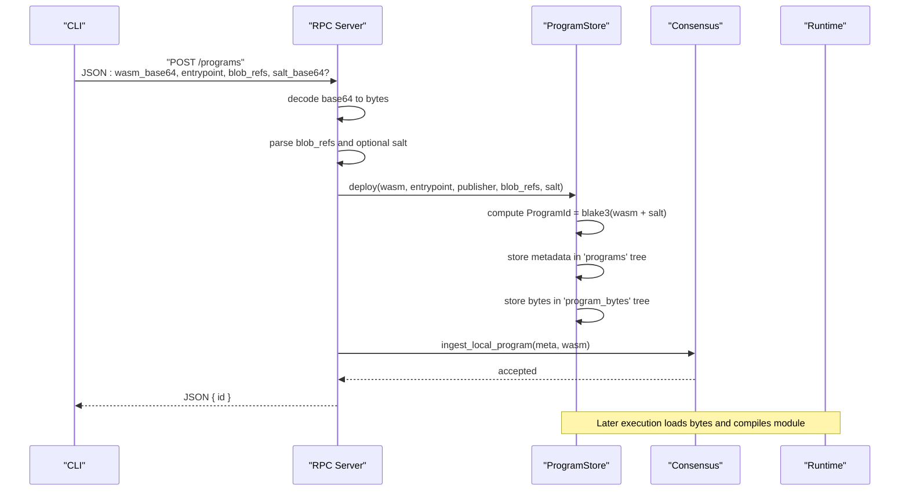
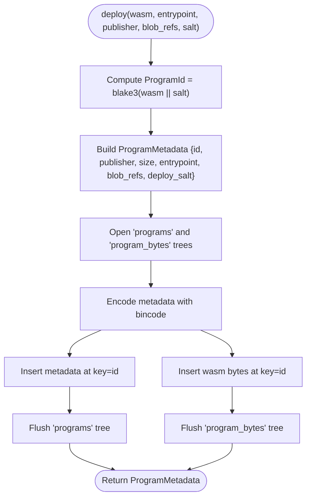
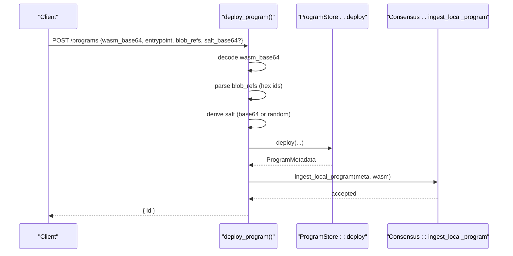
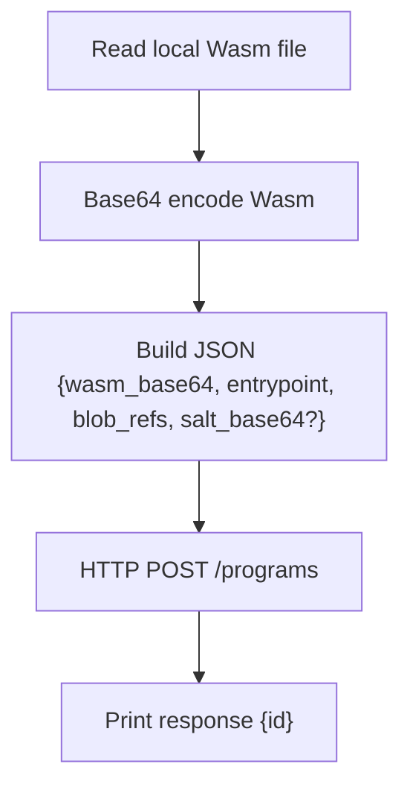
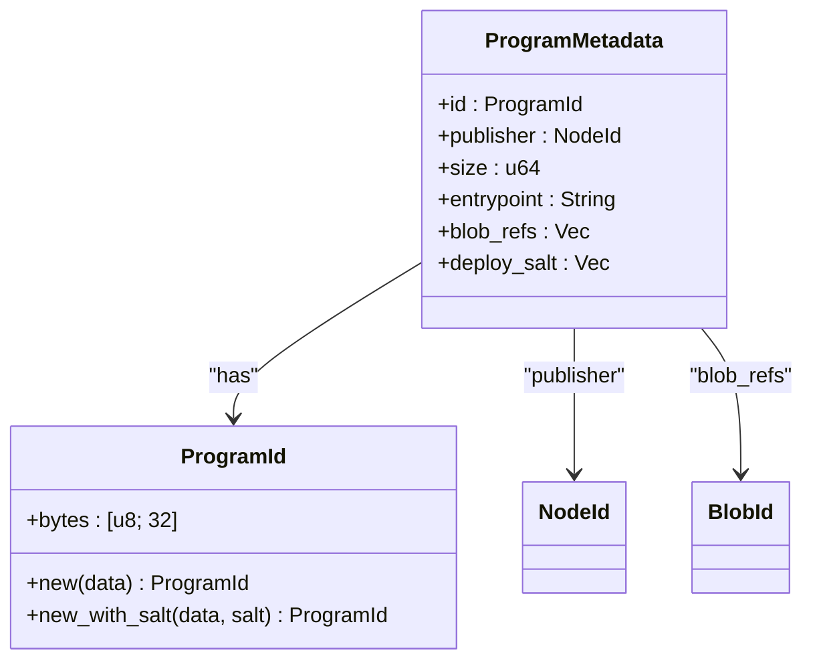
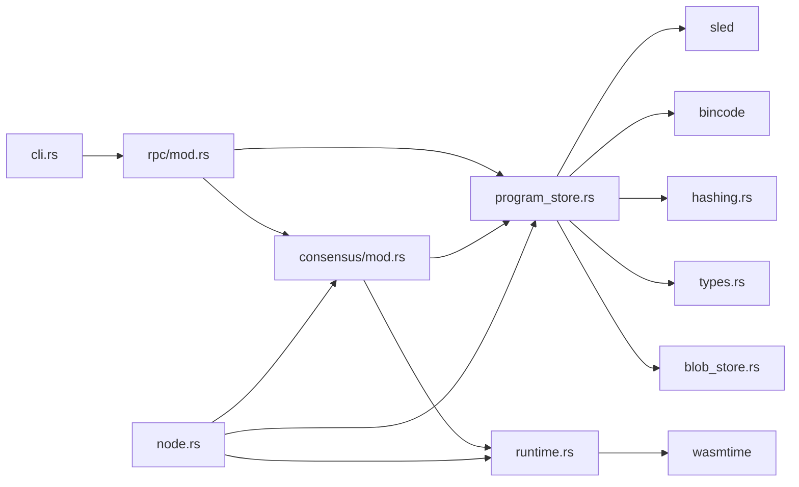

# Program Deployment

<cite>
**Referenced Files in This Document**
- [program_store.rs](file://src/execution/program_store.rs)
- [rpc/mod.rs](file://src/rpc/mod.rs)
- [cli.rs](file://src/cli.rs)
- [types.rs](file://src/types.rs)
- [hashing.rs](file://src/crypto/hashing.rs)
- [node.rs](file://src/node.rs)
- [runtime.rs](file://src/execution/runtime.rs)
- [blob_store.rs](file://src/storage/blob_store.rs)
- [consensus/mod.rs](file://src/consensus/mod.rs)
</cite>

## Table of Contents
1. [Introduction](#introduction)
2. [Project Structure](#project-structure)
3. [Core Components](#core-components)
4. [Architecture Overview](#architecture-overview)
5. [Detailed Component Analysis](#detailed-component-analysis)
6. [Dependency Analysis](#dependency-analysis)
7. [Performance Considerations](#performance-considerations)
8. [Troubleshooting Guide](#troubleshooting-guide)
9. [Conclusion](#conclusion)
10. [Appendices](#appendices)

## Introduction
This document explains the complete Wasm program deployment pipeline in the system. It covers how a client deploys a program via the CLI, how the RPC server validates and decodes payloads, how the ProgramStore persists program binaries and metadata, and how the consensus layer integrates the deployment. It also documents the domain model (ProgramId, ProgramMetadata), the content-addressable storage model, and security considerations such as salt-based collision resistance and publisher identity binding.

## Project Structure
The deployment flow spans several modules:
- CLI: builds and sends HTTP requests to the RPC server
- RPC: exposes HTTP endpoints for deployment and program inspection
- ProgramStore: persists programs and metadata in sled trees
- Types: defines identifiers and metadata structures
- Hashing: provides cryptographic hashing primitives
- Node: composes subsystems and initializes storage
- Runtime: compiles and executes programs
- BlobStore: stores auxiliary data referenced by programs
- Consensus: coordinates ingestion and propagation of deployments

**Diagram sources**
- [cli.rs](file://src/cli.rs#L191-L218)
- [rpc/mod.rs](file://src/rpc/mod.rs#L62-L96)
- [program_store.rs](file://src/execution/program_store.rs#L16-L41)
- [consensus/mod.rs](file://src/consensus/mod.rs#L313-L338)
- [runtime.rs](file://src/execution/runtime.rs#L185-L196)
- [blob_store.rs](file://src/storage/blob_store.rs#L1-L46)

**Section sources**
- [cli.rs](file://src/cli.rs#L191-L218)
- [rpc/mod.rs](file://src/rpc/mod.rs#L62-L96)
- [program_store.rs](file://src/execution/program_store.rs#L16-L41)
- [node.rs](file://src/node.rs#L37-L57)

## Core Components
- ProgramStore: stores program bytes and metadata under content-addressable keys derived from the Wasm binary and a deployment salt. It exposes methods to deploy, replicate, store metadata, load bytes, and list stored programs.
- RPC Server: exposes the /programs endpoint that accepts base64-encoded Wasm, entrypoint, blob references, and optional salt; it decodes and forwards to ProgramStore.
- CLI: constructs a JSON payload with base64-encoded Wasm, entrypoint, blob_refs, and optional salt, then posts to /programs.
- Types: ProgramId and ProgramMetadata define the domain model. ProgramId is derived from the Wasm plus salt; ProgramMetadata includes publisher, size, entrypoint, blob_refs, and deploy_salt.
- Hashing: blake3 is used for deterministic hashing.
- Node: initializes sled databases and wires ProgramStore into the node stack.
- Runtime: compiles Wasm modules for execution; deployment does not validate bytecode here, but runtime compilation will fail for invalid Wasm.
- BlobStore: stores auxiliary blobs referenced by programs; used during deployment to validate blob_refs.

**Section sources**
- [program_store.rs](file://src/execution/program_store.rs#L16-L41)
- [rpc/mod.rs](file://src/rpc/mod.rs#L133-L174)
- [cli.rs](file://src/cli.rs#L191-L218)
- [types.rs](file://src/types.rs#L33-L41)
- [hashing.rs](file://src/crypto/hashing.rs#L1-L8)
- [node.rs](file://src/node.rs#L37-L57)
- [runtime.rs](file://src/execution/runtime.rs#L185-L196)
- [blob_store.rs](file://src/storage/blob_store.rs#L1-L46)

## Architecture Overview
The deployment flow is a client-to-server pipeline with validation and persistence:

**Diagram sources**
- [cli.rs](file://src/cli.rs#L191-L218)
- [rpc/mod.rs](file://src/rpc/mod.rs#L133-L174)
- [program_store.rs](file://src/execution/program_store.rs#L16-L41)
- [consensus/mod.rs](file://src/consensus/mod.rs#L313-L338)
- [runtime.rs](file://src/execution/runtime.rs#L185-L196)

## Detailed Component Analysis

### ProgramStore::deploy
ProgramStore::deploy computes a content-addressable ProgramId using blake3 over the concatenation of the Wasm bytes and the deployment salt, then persists:
- Metadata in the 'programs' tree keyed by ProgramId
- Raw Wasm bytes in the 'program_bytes' tree keyed by ProgramId

It returns the ProgramMetadata so the RPC layer can report the ProgramId.

**Diagram sources**
- [program_store.rs](file://src/execution/program_store.rs#L16-L41)
- [types.rs](file://src/types.rs#L33-L41)
- [hashing.rs](file://src/crypto/hashing.rs#L1-L8)

**Section sources**
- [program_store.rs](file://src/execution/program_store.rs#L16-L41)
- [types.rs](file://src/types.rs#L33-L41)
- [hashing.rs](file://src/crypto/hashing.rs#L1-L8)

### RPC Handler: /programs
The RPC handler validates and decodes incoming requests:
- Decodes wasm_base64; rejects malformed base64 with BAD_REQUEST
- Parses blob_refs from hex strings; rejects invalid lengths with BAD_REQUEST
- Derives deploy_salt from salt_base64 if provided, otherwise generates a random UUID bytes and base64-encodes it
- Invokes ProgramStore::deploy with entrypoint, publisher (node identity), blob_refs, and salt
- After successful deployment, enqueues the program for consensus ingestion
- Returns JSON containing the ProgramId in hex

**Diagram sources**
- [rpc/mod.rs](file://src/rpc/mod.rs#L133-L174)
- [program_store.rs](file://src/execution/program_store.rs#L16-L41)
- [consensus/mod.rs](file://src/consensus/mod.rs#L313-L338)

**Section sources**
- [rpc/mod.rs](file://src/rpc/mod.rs#L133-L174)

### CLI Integration: onvm deploy
The CLI constructs a JSON payload:
- Encodes the local Wasm file as base64
- Sets entrypoint, blob_refs, and optional salt_base64
- Sends HTTP POST to /programs
- Prints the server response (ProgramId)

**Diagram sources**
- [cli.rs](file://src/cli.rs#L191-L218)

**Section sources**
- [cli.rs](file://src/cli.rs#L191-L218)

### Domain Model: ProgramId and ProgramMetadata
- ProgramId: 32-byte identifier. Without salt, it is blake3 of the Wasm bytes. With salt, it is blake3 of (Wasm || salt).
- ProgramMetadata: includes ProgramId, publisher (Node identity), size, entrypoint, blob_refs, and deploy_salt.

**Diagram sources**
- [types.rs](file://src/types.rs#L55-L66)
- [types.rs](file://src/types.rs#L33-L41)

**Section sources**
- [types.rs](file://src/types.rs#L33-L41)
- [types.rs](file://src/types.rs#L55-L66)

### Content-Addressable Storage Implications
- ProgramId serves as the key for both metadata and bytes, enabling deduplication: identical Wasm+salt combinations map to the same ProgramId.
- Replication and consensus rely on ProgramId equality; mismatch triggers errors.
- Publisher identity is bound to the ProgramId via the salt, preventing accidental collisions for the same Wasm.

**Section sources**
- [program_store.rs](file://src/execution/program_store.rs#L16-L41)
- [consensus/mod.rs](file://src/consensus/mod.rs#L313-L338)

## Dependency Analysis
- CLI depends on base64 and reqwest to send HTTP requests
- RPC depends on axum, base64, serde, and bincode for decoding/encoding
- ProgramStore depends on sled, bincode, and hashing
- Runtime depends on wasmtime and links host functions
- Node composes all subsystems and initializes sled databases

**Diagram sources**
- [cli.rs](file://src/cli.rs#L191-L218)
- [rpc/mod.rs](file://src/rpc/mod.rs#L62-L96)
- [program_store.rs](file://src/execution/program_store.rs#L16-L41)
- [runtime.rs](file://src/execution/runtime.rs#L185-L196)
- [node.rs](file://src/node.rs#L37-L57)
- [blob_store.rs](file://src/storage/blob_store.rs#L1-L46)

**Section sources**
- [cli.rs](file://src/cli.rs#L191-L218)
- [rpc/mod.rs](file://src/rpc/mod.rs#L62-L96)
- [program_store.rs](file://src/execution/program_store.rs#L16-L41)
- [runtime.rs](file://src/execution/runtime.rs#L185-L196)
- [node.rs](file://src/node.rs#L37-L57)
- [blob_store.rs](file://src/storage/blob_store.rs#L1-L46)

## Performance Considerations
- Base64 encoding/decoding overhead is proportional to Wasm size; keep payloads minimal.
- Sled flushes occur after insertion; frequent deployments may incur disk I/O costs.
- Program loading retrieves bytes by ProgramId; ensure adequate cache for repeated executions.
- Blob references increase storage footprint; consider chunking and deduplication via shared blobs.

[No sources needed since this section provides general guidance]

## Troubleshooting Guide

Common issues and resolutions:
- Malformed base64 encoding
  - Symptom: HTTP 400 Bad Request on /programs
  - Cause: wasm_base64 or salt_base64 not valid base64
  - Resolution: Verify base64 encoding and character set
  - Section sources
    - [rpc/mod.rs](file://src/rpc/mod.rs#L137-L140)

- Invalid Wasm bytecode
  - Symptom: Runtime compilation failure when executing
  - Cause: Invalid Wasm bytes
  - Resolution: Rebuild Wasm with compatible toolchain; verify entrypoint signature
  - Section sources
    - [runtime.rs](file://src/execution/runtime.rs#L185-L196)

- Network timeouts
  - Symptom: CLI reports timeout or connection refused
  - Cause: RPC server not reachable or overloaded
  - Resolution: Ensure RPC bind address is correct and reachable; retry
  - Section sources
    - [cli.rs](file://src/cli.rs#L191-L218)

- Storage quota limits
  - Symptom: Deployment fails due to storage constraints
  - Cause: Disk capacity exceeded
  - Resolution: Free space or adjust storage configuration
  - Section sources
    - [node.rs](file://src/node.rs#L37-L57)

- Program id mismatch on replicate
  - Symptom: Consensus rejects replicated program
  - Cause: Mismatch between computed ProgramId and provided metadata
  - Resolution: Ensure deploy_salt is preserved and consistent across nodes
  - Section sources
    - [program_store.rs](file://src/execution/program_store.rs#L43-L56)
    - [consensus/mod.rs](file://src/consensus/mod.rs#L313-L338)

Security aspects:
- Salt randomization prevents hash collision attacks by ensuring distinct ProgramIds for identical Wasm
- Publisher identity binding occurs because ProgramId includes salt; collisions across publishers are prevented
- Pre-execution validation: base64 decoding and blob reference parsing occur before persistence; invalid inputs are rejected early

**Section sources**
- [program_store.rs](file://src/execution/program_store.rs#L43-L56)
- [consensus/mod.rs](file://src/consensus/mod.rs#L313-L338)
- [rpc/mod.rs](file://src/rpc/mod.rs#L137-L140)
- [cli.rs](file://src/cli.rs#L191-L218)

## Conclusion
The deployment pipeline is robust and content-addressable. The CLI and RPC layer provide a clean interface for clients, while ProgramStore ensures durable, deduplicated persistence. Consensus ingestion guarantees network-wide propagation. Security is strengthened by salt-based ProgramId derivation and publisher identity binding. Runtime compilation acts as a secondary validation gate for executable correctness.

[No sources needed since this section summarizes without analyzing specific files]

## Appendices

### Example JSON Payloads
- Minimal deployment (random salt):
  - Fields: wasm_base64, entrypoint, blob_refs=[], optional salt_base64 omitted
  - Section sources
    - [cli.rs](file://src/cli.rs#L191-L218)
    - [rpc/mod.rs](file://src/rpc/mod.rs#L133-L174)

- Deployment with custom salt:
  - Add salt_base64 with a base64-encoded random value
  - Section sources
    - [cli.rs](file://src/cli.rs#L191-L218)
    - [rpc/mod.rs](file://src/rpc/mod.rs#L147-L153)

- Sample response:
  - { "id": "<hex-encoded ProgramId>" }
  - Section sources
    - [rpc/mod.rs](file://src/rpc/mod.rs#L171-L173)

### Validation Steps Summary
- Base64 decoding of Wasm and optional salt
- Hex decoding and length validation of blob_refs
- ProgramId computation using blake3(Wasm || salt)
- Persistence to 'programs' and 'program_bytes'
- Consensus ingestion with metadata and bytes
- Section sources
  - [rpc/mod.rs](file://src/rpc/mod.rs#L133-L174)
  - [program_store.rs](file://src/execution/program_store.rs#L16-L41)
  - [consensus/mod.rs](file://src/consensus/mod.rs#L313-L338)