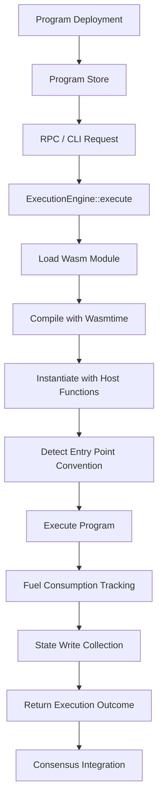
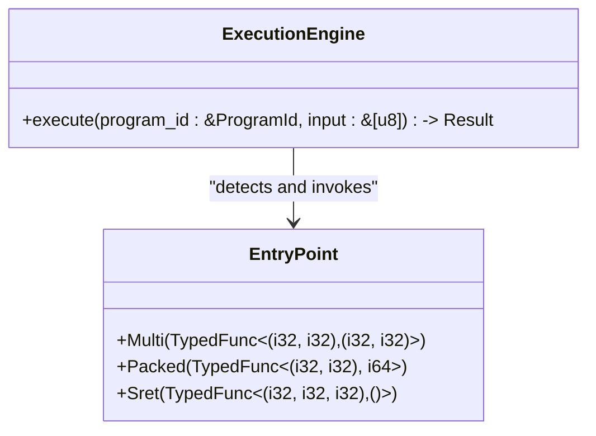
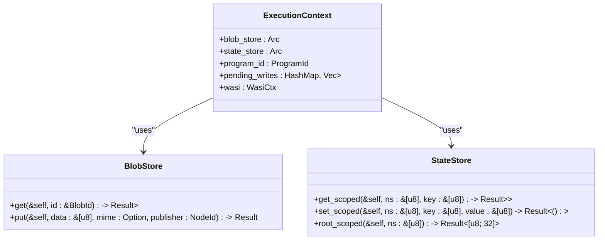
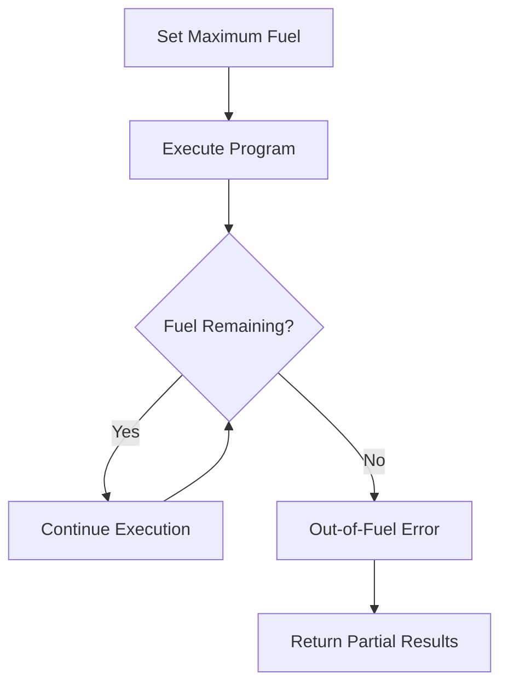
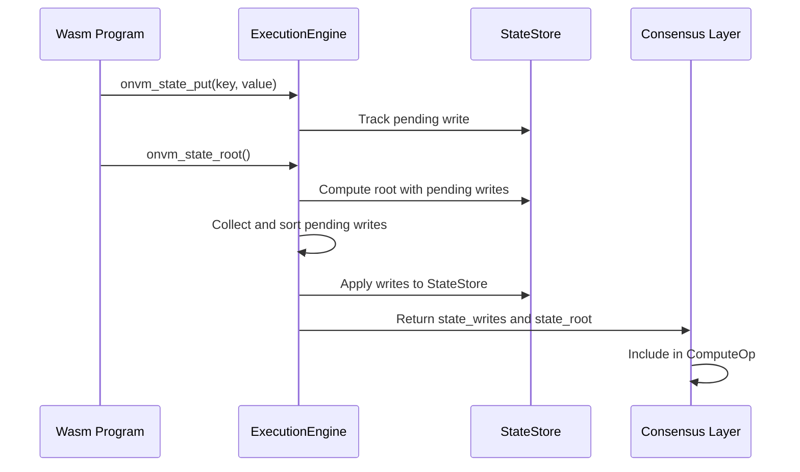
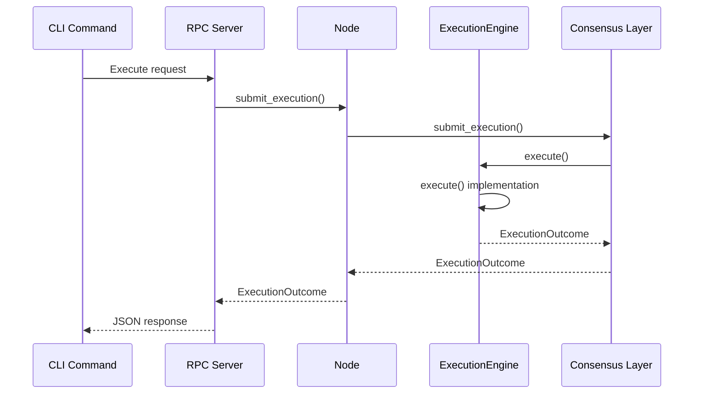
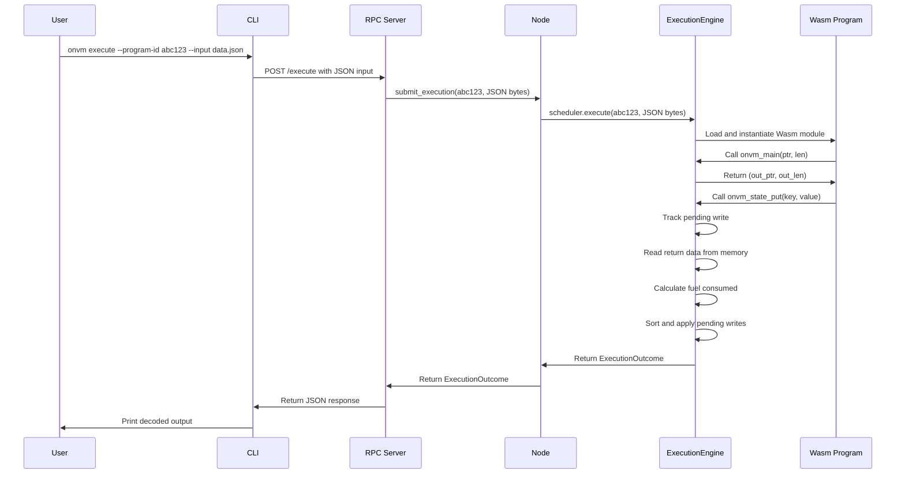
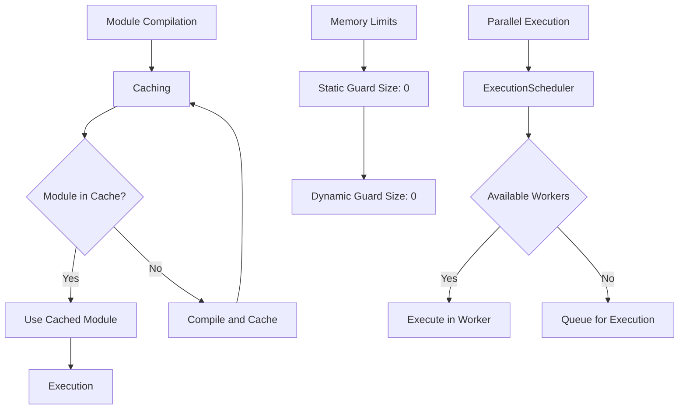

# Program Execution

<cite>
**Referenced Files in This Document**   
- [runtime.rs](file://src/execution/runtime.rs)
- [program_store.rs](file://src/execution/program_store.rs)
- [mod.rs](file://src/rpc/mod.rs)
- [cli.rs](file://src/cli.rs)
- [blob_store.rs](file://src/storage/blob_store.rs)
- [state_store.rs](file://src/storage/state_store.rs)
- [node.rs](file://src/node.rs)
- [mod.rs](file://src/consensus/mod.rs)
- [scheduler.rs](file://src/execution/scheduler.rs)
- [lib.rs](file://wasm_programs/echo/src/lib.rs)
- [lib.rs](file://wasm_programs/kvstore/src/lib.rs)
- [lib.rs](file://wasm_programs/analytics/src/lib.rs)
</cite>

## Table of Contents
1. [Introduction](#introduction)
2. [Execution Lifecycle Overview](#execution-lifecycle-overview)
3. [Core Components](#core-components)
4. [Entry Point Conventions](#entry-point-conventions)
5. [ExecutionContext and Host Functions](#executioncontext-and-host-functions)
6. [Fuel Consumption and Resource Limiting](#fuel-consumption-and-resource-limiting)
7. [State Management and Consensus](#state-management-and-consensus)
8. [Integration with RPC and CLI](#integration-with-rpc-and-cli)
9. [Example Execution Flow](#example-execution-flow)
10. [Error Handling](#error-handling)
11. [Performance Considerations](#performance-considerations)
12. [Conclusion](#conclusion)

## Introduction
This document provides a comprehensive analysis of the Wasm program execution lifecycle in the ONVM system. The execution process involves loading Wasm modules via ProgramStore, compiling them with Wasmtime using fuel-based resource limiting, and instantiating them with sandboxed host functions. The runtime supports three entry point calling conventions (multi, packed, sret) and provides access to BlobStore and StateStore through safe host functions. The document covers the complete execution flow from program deployment to execution outcome, including integration with RPC endpoints and CLI commands.

## Execution Lifecycle Overview

**Diagram sources**
- [runtime.rs](file://src/execution/runtime.rs#L79-L183)
- [program_store.rs](file://src/execution/program_store.rs#L66-L72)
- [mod.rs](file://src/rpc/mod.rs#L194-L258)

**Section sources**
- [runtime.rs](file://src/execution/runtime.rs#L79-L183)
- [program_store.rs](file://src/execution/program_store.rs#L66-L72)

## Core Components

The Wasm program execution system consists of several core components that work together to provide a secure and efficient execution environment. The ExecutionEngine is responsible for managing the execution of Wasm programs, while the ProgramStore handles the storage and retrieval of program modules. The BlobStore and StateStore provide persistent storage for program data and state, respectively. The ExecutionScheduler manages the execution of programs, allowing for parallel execution while maintaining resource limits.

The ExecutionOutcome struct captures the results of program execution, including the program ID, return data, fuel consumed, state writes, and state root. This outcome is used by the consensus layer to ensure deterministic execution across the network.

**Section sources**
- [runtime.rs](file://src/execution/runtime.rs#L20-L27)
- [program_store.rs](file://src/execution/program_store.rs#L6-L14)
- [blob_store.rs](file://src/storage/blob_store.rs#L8-L10)
- [state_store.rs](file://src/storage/state_store.rs#L6-L8)

## Entry Point Conventions

**Diagram sources**
- [runtime.rs](file://src/execution/runtime.rs#L42-L46)
- [runtime.rs](file://src/execution/runtime.rs#L114-L124)

The runtime supports three entry point calling conventions for Wasm programs:

1. **Multi**: Returns two 32-bit values as a tuple (i32, i32). This is the most common convention used by the example programs.
2. **Packed**: Returns a 64-bit value where the upper 32 bits contain the pointer and the lower 32 bits contain the length.
3. **Sret**: Uses a scratch space to store the return metadata (pointer and length) and returns void.

The runtime detects the appropriate convention by attempting to retrieve the entry point function with each signature. The first successful retrieval determines the convention used for execution. This detection mechanism allows the runtime to support multiple calling conventions without requiring programs to adhere to a specific interface.

**Section sources**
- [runtime.rs](file://src/execution/runtime.rs#L42-L46)
- [runtime.rs](file://src/execution/runtime.rs#L114-L124)
- [lib.rs](file://wasm_programs/echo/src/lib.rs#L26-L43)
- [lib.rs](file://wasm_programs/kvstore/src/lib.rs#L39-L56)

## ExecutionContext and Host Functions

**Diagram sources**
- [runtime.rs](file://src/execution/runtime.rs#L48-L54)
- [blob_store.rs](file://src/storage/blob_store.rs#L8-L10)
- [state_store.rs](file://src/storage/state_store.rs#L6-L8)

The ExecutionContext provides Wasm programs with access to the BlobStore and StateStore through sandboxed host functions. These functions are attached to the Wasmtime linker and made available to the executing program. The host functions follow a consistent pattern of accepting pointer and length parameters for input and output buffers, with return values indicating success or error conditions.

The safe host functions include:
- **onvm_blob_read**: Reads a blob from the BlobStore
- **onvm_state_put**: Writes data to the StateStore
- **onvm_state_get**: Reads data from the StateStore
- **onvm_state_root**: Computes the Merkle root of the program's state

These functions operate on the program's linear memory, using pointer and length parameters to specify memory regions. The runtime validates these parameters to prevent invalid memory access and ensures that all operations are properly sandboxed.

**Section sources**
- [runtime.rs](file://src/execution/runtime.rs#L199-L376)
- [blob_store.rs](file://src/storage/blob_store.rs#L78-L104)
- [state_store.rs](file://src/storage/state_store.rs#L17-L40)

## Fuel Consumption and Resource Limiting

**Diagram sources**
- [runtime.rs](file://src/execution/runtime.rs#L99-L100)
- [runtime.rs](file://src/execution/runtime.rs#L153-L155)

The execution engine implements fuel-based resource limiting to prevent programs from consuming excessive resources. When a program is executed, the runtime sets a maximum fuel limit based on the ExecutionConfig. The fuel is consumed as the program executes Wasm instructions, with each instruction consuming a predetermined amount of fuel.

The fuel consumption mechanism serves several purposes:
- Prevents infinite loops and denial-of-service attacks
- Provides a predictable execution time budget
- Enables fair resource allocation across programs
- Allows for graceful handling of resource exhaustion

When a program exhausts its fuel, the execution is terminated and an out-of-fuel error is returned. The runtime tracks the amount of fuel consumed, which is included in the ExecutionOutcome for consensus purposes.

**Section sources**
- [runtime.rs](file://src/execution/runtime.rs#L99-L100)
- [runtime.rs](file://src/execution/runtime.rs#L153-L155)
- [runtime.rs](file://src/execution/runtime.rs#L34-L39)

## State Management and Consensus

**Diagram sources**
- [runtime.rs](file://src/execution/runtime.rs#L156-L167)
- [runtime.rs](file://src/execution/runtime.rs#L168-L175)
- [mod.rs](file://src/consensus/mod.rs#L231-L238)

The state management system ensures that all state modifications are tracked and applied deterministically. When a program calls onvm_state_put, the write is recorded in the ExecutionContext's pending_writes map rather than being immediately applied to the StateStore. This allows the runtime to collect all state modifications during program execution.

After the program completes, the pending writes are sorted by key to ensure deterministic ordering, then applied to the StateStore. The state root is computed both before and after applying the writes to ensure consistency. The state_writes and state_root are included in the ExecutionOutcome, which is used by the consensus layer to validate and replicate the execution across the network.

This approach ensures that state modifications are atomic and consistent, even in the presence of failures or network partitions.

**Section sources**
- [runtime.rs](file://src/execution/runtime.rs#L156-L182)
- [state_store.rs](file://src/storage/state_store.rs#L29-L40)
- [mod.rs](file://src/consensus/mod.rs#L231-L238)

## Integration with RPC and CLI

**Diagram sources**
- [cli.rs](file://src/cli.rs#L221-L270)
- [mod.rs](file://src/rpc/mod.rs#L194-L258)
- [node.rs](file://src/node.rs#L125-L127)

The execution system is integrated with both RPC endpoints and CLI commands, providing multiple interfaces for program execution. The RPC server exposes an /execute endpoint that accepts program ID and input data, while the CLI provides an 'onvm execute' command with similar functionality.

When an execution request is received, it flows through the following components:
1. The RPC handler or CLI command parses the request
2. The Node's consensus layer is called to submit the execution
3. The consensus layer validates the program metadata and creates input/output blobs
4. The ExecutionScheduler executes the program via the ExecutionEngine
5. The results are returned through the call chain and formatted for the client

Both interfaces support JSON input and base64-encoded data, making it easy to execute programs with complex input data.

**Section sources**
- [cli.rs](file://src/cli.rs#L221-L270)
- [mod.rs](file://src/rpc/mod.rs#L194-L258)
- [node.rs](file://src/node.rs#L50-L55)

## Example Execution Flow

**Diagram sources**
- [cli.rs](file://src/cli.rs#L221-L270)
- [mod.rs](file://src/rpc/mod.rs#L194-L258)
- [runtime.rs](file://src/execution/runtime.rs#L79-L183)

Consider a concrete example of executing a program with JSON input. The user invokes the 'onvm execute' command with a program ID and a JSON file containing input data. The CLI reads the file, encodes the data in base64, and sends a request to the RPC server.

The RPC server decodes the request and calls the Node's submit_execution method. The consensus layer validates that the program exists, creates a blob for the input data, and submits the execution to the ExecutionScheduler.

The ExecutionEngine loads the Wasm module from the ProgramStore, compiles it with Wasmtime, and instantiates it with the appropriate host functions. The program's entry point (onvm_main) is called with pointers to the input data in linear memory.

The program processes the input, potentially making calls to host functions like onvm_state_put to modify state. When the program returns, the runtime reads the output data from linear memory, calculates the fuel consumed, and collects any pending state writes.

The ExecutionOutcome is returned through the call chain, formatted as JSON by the RPC server, and displayed to the user by the CLI. The user sees the decoded output, fuel consumption, and any state changes resulting from the execution.

**Section sources**
- [cli.rs](file://src/cli.rs#L221-L270)
- [mod.rs](file://src/rpc/mod.rs#L194-L258)
- [runtime.rs](file://src/execution/runtime.rs#L79-L183)
- [lib.rs](file://wasm_programs/analytics/src/lib.rs#L40-L56)

## Error Handling

The execution system implements comprehensive error handling for common issues:

1. **Out-of-fuel errors**: When a program exhausts its allocated fuel, execution is terminated and an error is returned. The runtime tracks the fuel consumed up to the point of exhaustion.

2. **Invalid memory access**: The runtime validates all memory access operations to prevent programs from accessing invalid memory regions. This includes checking pointer and length parameters for host function calls.

3. **Missing entrypoint functions**: If a program does not export the expected entry point function with any of the supported calling conventions, an error is returned during the detection phase.

4. **Host function permission denied**: While not explicitly implemented in the current code, the sandboxing model allows for permission checks on host function calls, which could be used to restrict access to certain resources.

Error handling is implemented consistently across the system, with specific error codes returned from host functions and detailed error messages provided where appropriate. The use of Rust's Result type ensures that errors are properly propagated through the call chain.

**Section sources**
- [runtime.rs](file://src/execution/runtime.rs#L119-L123)
- [runtime.rs](file://src/execution/runtime.rs#L209-L212)
- [runtime.rs](file://src/execution/runtime.rs#L258-L260)
- [runtime.rs](file://src/execution/runtime.rs#L307-L308)

## Performance Considerations

**Diagram sources**
- [runtime.rs](file://src/execution/runtime.rs#L185-L196)
- [scheduler.rs](file://src/execution/scheduler.rs#L27-L35)
- [runtime.rs](file://src/execution/runtime.rs#L65-L66)

Several performance optimizations are implemented in the execution system:

1. **Module compilation caching**: The ExecutionEngine maintains a cache of compiled Wasm modules to avoid recompiling the same program multiple times. When a program is executed, the runtime first checks the cache for a compiled module before compiling it from the Wasm bytes.

2. **Memory limits**: The Wasmtime configuration disables static and dynamic memory guard sizes, which can improve performance by reducing memory overhead. This is safe in the sandboxed execution environment.

3. **Parallel execution safety**: The ExecutionScheduler uses tokio::task::spawn_blocking to execute programs, allowing for parallel execution while avoiding blocking the async executor. The scheduler limits the number of concurrent executions based on available parallelism.

4. **Efficient state management**: The pending writes are collected in memory and applied in batch after program execution, reducing the number of storage operations and ensuring atomicity.

These optimizations ensure that the execution system can handle high volumes of program executions efficiently while maintaining the security and determinism required for consensus.

**Section sources**
- [runtime.rs](file://src/execution/runtime.rs#L185-L196)
- [scheduler.rs](file://src/execution/scheduler.rs#L27-L35)
- [runtime.rs](file://src/execution/runtime.rs#L65-L66)
- [runtime.rs](file://src/execution/runtime.rs#L156-L167)

## Conclusion
The Wasm program execution lifecycle in the ONVM system provides a secure, efficient, and deterministic environment for executing decentralized applications. The system combines Wasmtime's robust Wasm execution with a comprehensive sandboxing model, fuel-based resource limiting, and integration with a distributed consensus layer.

Key features of the execution system include support for multiple entry point calling conventions, safe host functions for state and blob access, deterministic state management, and comprehensive error handling. The system is accessible through both RPC endpoints and CLI commands, making it easy to integrate with various applications and workflows.

The performance optimizations, including module compilation caching and parallel execution, ensure that the system can handle high volumes of program executions efficiently. The design prioritizes security and determinism while providing the flexibility needed for complex decentralized applications.