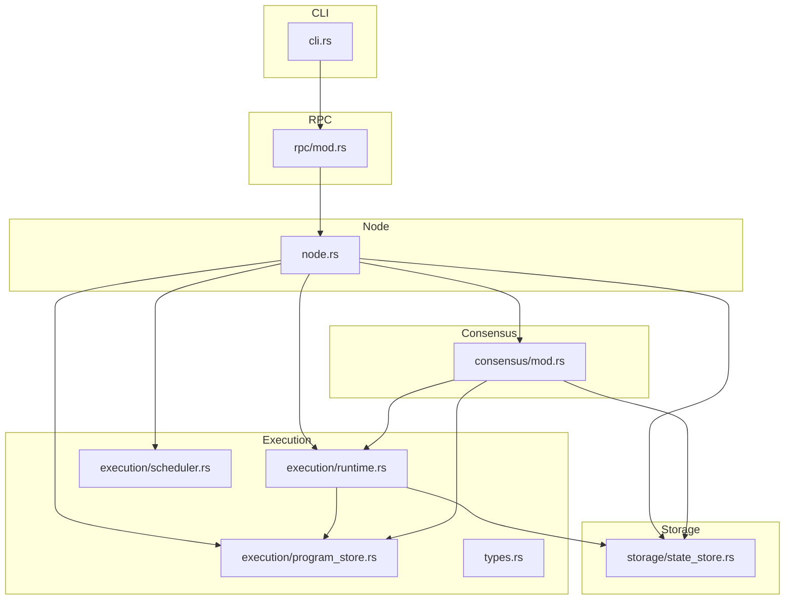
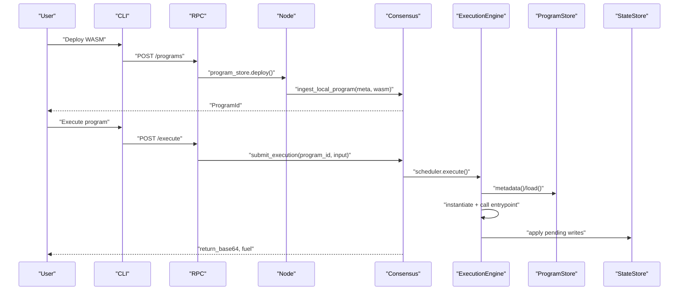
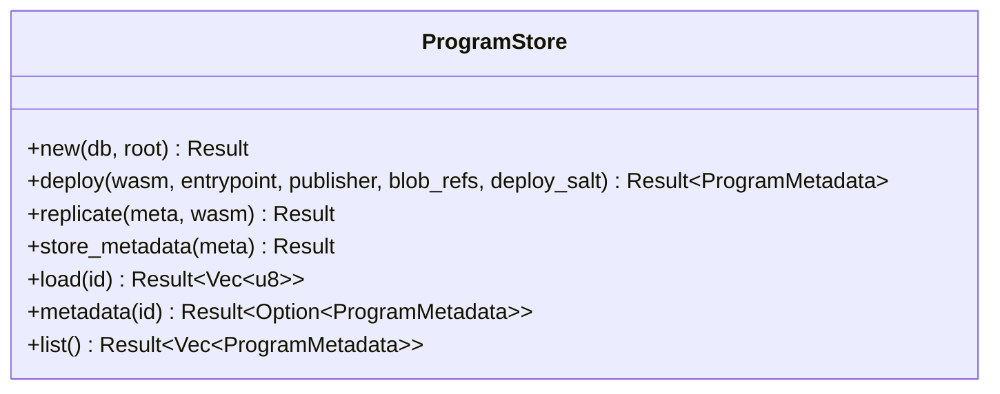
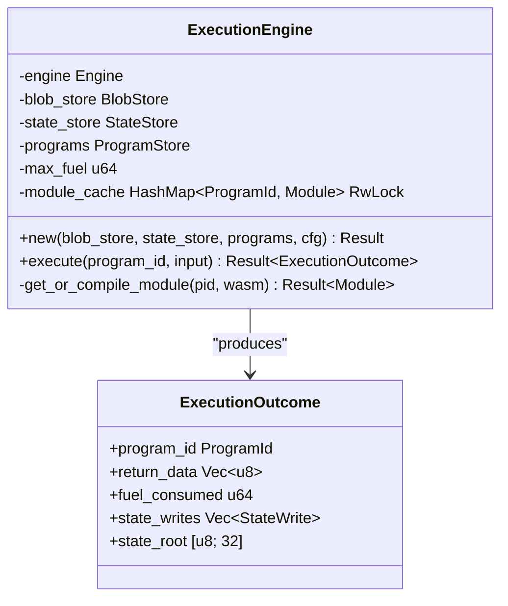
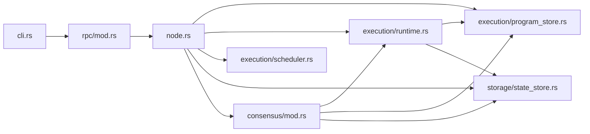

# Program Management

<cite>
**Referenced Files in This Document**
- [main.rs](file://src/main.rs)
- [cli.rs](file://src/cli.rs)
- [node.rs](file://src/node.rs)
- [rpc/mod.rs](file://src/rpc/mod.rs)
- [execution/mod.rs](file://src/execution/mod.rs)
- [program_store.rs](file://src/execution/program_store.rs)
- [runtime.rs](file://src/execution/runtime.rs)
- [scheduler.rs](file://src/execution/scheduler.rs)
- [types.rs](file://src/types.rs)
- [state_store.rs](file://src/storage/state_store.rs)
- [consensus/mod.rs](file://src/consensus/mod.rs)
- [echo/lib.rs](file://wasm_programs/echo/src/lib.rs)
- [analytics/lib.rs](file://wasm_programs/analytics/src/lib.rs)
- [kvstore/lib.rs](file://wasm_programs/kvstore/src/lib.rs)
</cite>

## Table of Contents
1. [Introduction](#introduction)
2. [Project Structure](#project-structure)
3. [Core Components](#core-components)
4. [Architecture Overview](#architecture-overview)
5. [Detailed Component Analysis](#detailed-component-analysis)
6. [Dependency Analysis](#dependency-analysis)
7. [Performance Considerations](#performance-considerations)
8. [Security Considerations](#security-considerations)
9. [Usage Patterns and Examples](#usage-patterns-and-examples)
10. [Troubleshooting Guide](#troubleshooting-guide)
11. [Conclusion](#conclusion)

## Introduction
This document explains the Wasm program deployment and execution lifecycle in the system. It focuses on:
- How programs are stored and retrieved by hash
- How Wasm modules are instantiated and executed via Wasmtime
- The CLI-driven workflow for uploading, deploying, and executing programs
- Domain models: ProgramId, ProgramMetadata, ComputeOp
- Interfaces: deploy_program(), execute_program(), get_program_info()
- Security, performance, and operational concerns

## Project Structure
The program lifecycle spans several modules:
- CLI entrypoint and commands
- RPC endpoints for program deployment, inspection, and execution
- Node orchestration wiring stores, execution engine, and scheduler
- Execution subsystem: program store, runtime engine, and scheduler
- Storage backends for program bytes and state
- Consensus layer that coordinates execution and state application

**Diagram sources**
- [main.rs](file://src/main.rs#L1-L7)
- [cli.rs](file://src/cli.rs#L1-L300)
- [rpc/mod.rs](file://src/rpc/mod.rs#L1-L241)
- [node.rs](file://src/node.rs#L1-L163)
- [program_store.rs](file://src/execution/program_store.rs#L1-L96)
- [runtime.rs](file://src/execution/runtime.rs#L1-L377)
- [scheduler.rs](file://src/execution/scheduler.rs#L1-L40)
- [types.rs](file://src/types.rs#L1-L109)
- [state_store.rs](file://src/storage/state_store.rs#L1-L80)
- [consensus/mod.rs](file://src/consensus/mod.rs#L1-L487)

**Section sources**
- [main.rs](file://src/main.rs#L1-L7)
- [cli.rs](file://src/cli.rs#L1-L300)
- [rpc/mod.rs](file://src/rpc/mod.rs#L1-L241)
- [node.rs](file://src/node.rs#L1-L163)
- [execution/mod.rs](file://src/execution/mod.rs#L1-L8)
- [program_store.rs](file://src/execution/program_store.rs#L1-L96)
- [runtime.rs](file://src/execution/runtime.rs#L1-L377)
- [scheduler.rs](file://src/execution/scheduler.rs#L1-L40)
- [types.rs](file://src/types.rs#L1-L109)
- [state_store.rs](file://src/storage/state_store.rs#L1-L80)
- [consensus/mod.rs](file://src/consensus/mod.rs#L1-L487)

## Core Components
- ProgramStore: persists program metadata and raw bytes keyed by ProgramId; supports deploy, replicate, store_metadata, load, metadata, list.
- ExecutionEngine: compiles and runs Wasm modules with Wasmtime, attaches host functions for blob and state access, enforces fuel limits, and applies state writes deterministically.
- ExecutionScheduler: executes programs asynchronously using spawn_blocking to avoid blocking async executors.
- RPC handlers: expose deploy_program(), execute_program(), and get_program_info() over HTTP.
- CLI commands: Deploy, Execute, ProgramInfo integrate with RPC endpoints.

Key domain models:
- ProgramId: 32-byte identifier derived from program bytes and optional salt.
- ProgramMetadata: includes ProgramId, publisher, size, entrypoint, blob_refs, deploy_salt.
- ComputeOp: describes a completed execution with program_id, input/output blob ids, fuel used, state_root, and state_writes.

**Section sources**
- [program_store.rs](file://src/execution/program_store.rs#L1-L96)
- [runtime.rs](file://src/execution/runtime.rs#L1-L377)
- [scheduler.rs](file://src/execution/scheduler.rs#L1-L40)
- [rpc/mod.rs](file://src/rpc/mod.rs#L133-L214)
- [types.rs](file://src/types.rs#L1-L109)
- [consensus/mod.rs](file://src/consensus/mod.rs#L194-L258)

## Architecture Overview
The lifecycle integrates CLI, RPC, Node, Consensus, Execution, and Storage:

**Diagram sources**
- [cli.rs](file://src/cli.rs#L191-L271)
- [rpc/mod.rs](file://src/rpc/mod.rs#L133-L214)
- [node.rs](file://src/node.rs#L37-L56)
- [consensus/mod.rs](file://src/consensus/mod.rs#L194-L258)
- [runtime.rs](file://src/execution/runtime.rs#L79-L183)
- [program_store.rs](file://src/execution/program_store.rs#L16-L41)
- [state_store.rs](file://src/storage/state_store.rs#L17-L41)

## Detailed Component Analysis

### ProgramStore
Responsibilities:
- Derive ProgramId deterministically from WASM bytes plus deploy_salt
- Persist ProgramMetadata and raw WASM bytes under separate trees
- Load WASM bytes and fetch metadata by ProgramId
- Replicate and list programs

**Diagram sources**
- [program_store.rs](file://src/execution/program_store.rs#L1-L96)

**Section sources**
- [program_store.rs](file://src/execution/program_store.rs#L16-L41)
- [program_store.rs](file://src/execution/program_store.rs#L43-L56)
- [program_store.rs](file://src/execution/program_store.rs#L58-L64)
- [program_store.rs](file://src/execution/program_store.rs#L66-L72)
- [program_store.rs](file://src/execution/program_store.rs#L74-L82)
- [program_store.rs](file://src/execution/program_store.rs#L84-L95)

### ExecutionEngine
Responsibilities:
- Compile WASM modules with Wasmtime and cache compiled Modules by ProgramId
- Instantiate modules with host functions for blob and state access
- Enforce fuel limits and track fuel consumption
- Determine entrypoint signature variants and read return data from linear memory
- Apply pending state writes deterministically and compute state root

**Diagram sources**
- [runtime.rs](file://src/execution/runtime.rs#L1-L183)
- [runtime.rs](file://src/execution/runtime.rs#L185-L196)

Host functions attached:
- Blob host functions: onvm_blob_read
- State host functions: onvm_state_put, onvm_state_get, onvm_state_root

**Section sources**
- [runtime.rs](file://src/execution/runtime.rs#L56-L77)
- [runtime.rs](file://src/execution/runtime.rs#L79-L183)
- [runtime.rs](file://src/execution/runtime.rs#L185-L196)
- [runtime.rs](file://src/execution/runtime.rs#L199-L244)
- [runtime.rs](file://src/execution/runtime.rs#L246-L377)

### ExecutionScheduler
Responsibilities:
- Execute programs asynchronously using spawn_blocking
- Control parallelism based on available CPU cores

**Section sources**
- [scheduler.rs](file://src/execution/scheduler.rs#L1-L40)

### RPC Handlers
Endpoints:
- POST /programs: deploy_program() -> DeployProgramResponse{id}
- GET /programs/:id: get_program_info() -> JSON with id, publisher, size, entrypoint, blob_refs
- POST /execute: execute_program() -> ExecuteResponse{return_base64, fuel}

Validation and parsing:
- Base64 decoding for wasm_base64, input_base64, salt_base64
- Hex decoding for program_id and blob_refs
- Error mapping to HTTP status codes

**Section sources**
- [rpc/mod.rs](file://src/rpc/mod.rs#L62-L96)
- [rpc/mod.rs](file://src/rpc/mod.rs#L133-L214)
- [rpc/mod.rs](file://src/rpc/mod.rs#L215-L241)

### CLI Commands
- Deploy: reads WASM file, constructs request with entrypoint, blob_refs, optional salt, posts to /programs
- Execute: reads optional input file, posts to /execute, prints return_base64 decoded output
- ProgramInfo: requests program metadata via GET /programs/:id

**Section sources**
- [cli.rs](file://src/cli.rs#L191-L271)
- [cli.rs](file://src/cli.rs#L284-L296)

### Consensus Integration
- submit_execution validates presence of program metadata locally, creates input/output blobs, schedules execution, applies state writes, records DAG node, and broadcasts results.

**Section sources**
- [consensus/mod.rs](file://src/consensus/mod.rs#L194-L258)
- [consensus/mod.rs](file://src/consensus/mod.rs#L450-L483)

## Dependency Analysis
- ProgramStore depends on sled trees for persistence and bincode for serialization.
- ExecutionEngine depends on Wasmtime, BlobStore, StateStore, and ProgramStore.
- Scheduler depends on ExecutionEngine.
- RPC handlers depend on Node context containing stores and scheduler.
- CLI depends on RPC endpoints.

**Diagram sources**
- [cli.rs](file://src/cli.rs#L1-L300)
- [rpc/mod.rs](file://src/rpc/mod.rs#L1-L241)
- [node.rs](file://src/node.rs#L1-L163)
- [program_store.rs](file://src/execution/program_store.rs#L1-L96)
- [runtime.rs](file://src/execution/runtime.rs#L1-L377)
- [scheduler.rs](file://src/execution/scheduler.rs#L1-L40)
- [state_store.rs](file://src/storage/state_store.rs#L1-L80)
- [consensus/mod.rs](file://src/consensus/mod.rs#L1-L487)

**Section sources**
- [execution/mod.rs](file://src/execution/mod.rs#L1-L8)
- [node.rs](file://src/node.rs#L37-L56)

## Performance Considerations
- Compilation caching: ExecutionEngine caches compiled Module instances keyed by ProgramId to avoid repeated compilation.
- Fuel-based execution limits: Wasmtime fuel is enabled and set via ExecutionConfig; execution tracks remaining fuel to compute consumed fuel.
- Deterministic state application: Pending writes are sorted by key before applying to StateStore to ensure deterministic state roots.
- Parallelism: ExecutionScheduler uses spawn_blocking and configurable parallelism to handle concurrent executions efficiently.

Practical tuning tips:
- Increase max_fuel for compute-intensive programs to prevent premature out-of-fuel termination.
- Ensure deterministic state writes by relying on the built-in sorting mechanism.
- Monitor fuel_consumed in responses to adjust budgets and optimize program logic.

**Section sources**
- [runtime.rs](file://src/execution/runtime.rs#L56-L77)
- [runtime.rs](file://src/execution/runtime.rs#L185-L196)
- [runtime.rs](file://src/execution/runtime.rs#L151-L183)
- [scheduler.rs](file://src/execution/scheduler.rs#L1-L40)

## Security Considerations
- Sandboxing: Wasm modules run inside Wasmtime with WASI attached; filesystem access is disabled by default. Only explicitly exposed host functions are callable.
- Host function access control: Only onvm_blob_read, onvm_state_put, onvm_state_get, onvm_state_root are attached. Programs cannot access arbitrary host APIs.
- Validation before execution:
  - Program metadata must exist locally before execution submission.
  - Program entrypoint must export a supported signature variant.
  - Program bytes are loaded from ProgramStore; replication validates ProgramId against deploy_salt.
- Input/output handling: Memory pointers and lengths are validated before reads/writes; capacity checks prevent overflows.

Common pitfalls to mitigate:
- Invalid Wasm binaries: Compilation fails early; ensure the WASM is valid and targets wasm32-unknown-unknown.
- Missing imports: Programs must export the configured entrypoint with one of the supported signatures.
- Out-of-gas: Fuel exhaustion returns an error; increase max_fuel or optimize program logic.

**Section sources**
- [runtime.rs](file://src/execution/runtime.rs#L90-L105)
- [runtime.rs](file://src/execution/runtime.rs#L109-L124)
- [consensus/mod.rs](file://src/consensus/mod.rs#L194-L201)
- [program_store.rs](file://src/execution/program_store.rs#L43-L56)

## Usage Patterns and Examples

### Deploying a Program from File
- CLI: Deploy command reads a WASM file and posts to /programs with entrypoint, optional blob_refs, and optional salt.
- RPC: deploy_program decodes base64 WASM, parses optional salt, computes ProgramId, persists metadata and bytes, and ingests locally into consensus.

Concrete example references:
- CLI Deploy command: [cli.rs](file://src/cli.rs#L191-L219)
- RPC deploy handler: [rpc/mod.rs](file://src/rpc/mod.rs#L133-L174)
- ProgramStore deploy: [program_store.rs](file://src/execution/program_store.rs#L16-L41)

### Executing a Program with JSON Input
- CLI: Execute command reads optional input file, posts to /execute with program_id and input_base64, prints decoded return data.
- RPC: execute_program decodes base64 input, submits execution via consensus, and returns base64-encoded return data and fuel consumed.
- Consensus: submit_execution validates metadata, creates input/output blobs, schedules execution, applies state writes, and records DAG.

Concrete example references:
- CLI Execute command: [cli.rs](file://src/cli.rs#L221-L271)
- RPC execute handler: [rpc/mod.rs](file://src/rpc/mod.rs#L194-L214)
- Consensus submit_execution: [consensus/mod.rs](file://src/consensus/mod.rs#L194-L258)
- Runtime execution and state application: [runtime.rs](file://src/execution/runtime.rs#L79-L183)

### Retrieving Program Information
- CLI: ProgramInfo command requests GET /programs/:id and prints JSON metadata.
- RPC: program_info resolves ProgramId, loads metadata from ProgramStore, and returns structured JSON.

Concrete example references:
- CLI ProgramInfo command: [cli.rs](file://src/cli.rs#L284-L296)
- RPC program_info handler: [rpc/mod.rs](file://src/rpc/mod.rs#L176-L192)
- ProgramStore metadata: [program_store.rs](file://src/execution/program_store.rs#L74-L82)

### Example Programs
- Echo program: exports onvm_main returning (ptr, len) of uppercase input bytes.
- Analytics program: exports onvm_main processing JSON input and returning JSON output.
- KV store program: exports onvm_main handling CRUD operations and using onvm_state_* host functions.

Concrete example references:
- Echo: [echo/lib.rs](file://wasm_programs/echo/src/lib.rs#L22-L43)
- Analytics: [analytics/lib.rs](file://wasm_programs/analytics/src/lib.rs#L39-L57)
- KV store: [kvstore/lib.rs](file://wasm_programs/kvstore/src/lib.rs#L38-L56)

## Troubleshooting Guide

Common issues and resolutions:
- Invalid Wasm binary
  - Symptom: Compilation failure during instantiate or module creation.
  - Resolution: Ensure the WASM targets wasm32-unknown-unknown and is valid; verify entrypoint export signature.
  - References: [runtime.rs](file://src/execution/runtime.rs#L185-L196), [runtime.rs](file://src/execution/runtime.rs#L109-L124)

- Out-of-gas errors
  - Symptom: Execution returns fuel exhausted; fuel_consumed equals max_fuel.
  - Resolution: Increase ExecutionConfig max_fuel or optimize program logic.
  - References: [runtime.rs](file://src/execution/runtime.rs#L56-L77), [runtime.rs](file://src/execution/runtime.rs#L151-L155)

- Missing imports
  - Symptom: Entry point not found or wrong signature.
  - Resolution: Export entrypoint with one of supported signatures: (i32,i32)->(i32,i32), (i32,i32)->i64, or (i32,i32,i32)->() with sret.
  - References: [runtime.rs](file://src/execution/runtime.rs#L109-L124)

- Program not found
  - Symptom: Program metadata missing locally.
  - Resolution: Ensure program deployed and replicated; verify ProgramId hex encoding.
  - References: [consensus/mod.rs](file://src/consensus/mod.rs#L194-L201), [rpc/mod.rs](file://src/rpc/mod.rs#L225-L233)

- State access issues
  - Symptom: onvm_state_* returns negative codes indicating memory read/write failures or capacity mismatches.
  - Resolution: Ensure correct pointer/length usage and adequate output capacity.
  - References: [runtime.rs](file://src/execution/runtime.rs#L246-L377)

- Blob access issues
  - Symptom: onvm_blob_read returns negative codes for invalid id, capacity, or read failures.
  - Resolution: Verify BlobId hex encoding and ensure blob exists.
  - References: [runtime.rs](file://src/execution/runtime.rs#L199-L244)

**Section sources**
- [runtime.rs](file://src/execution/runtime.rs#L109-L124)
- [runtime.rs](file://src/execution/runtime.rs#L185-L196)
- [runtime.rs](file://src/execution/runtime.rs#L246-L377)
- [consensus/mod.rs](file://src/consensus/mod.rs#L194-L201)
- [rpc/mod.rs](file://src/rpc/mod.rs#L215-L233)

## Conclusion
The system provides a robust, secure, and efficient lifecycle for deploying and executing Wasm programs:
- Programs are uniquely identified and persisted with metadata and bytes.
- Execution is sandboxed via Wasmtime and WASI, with controlled host function access.
- Fuel-based execution limits and deterministic state application ensure predictability.
- The CLI and RPC stack enable straightforward deployment, execution, and introspection workflows.