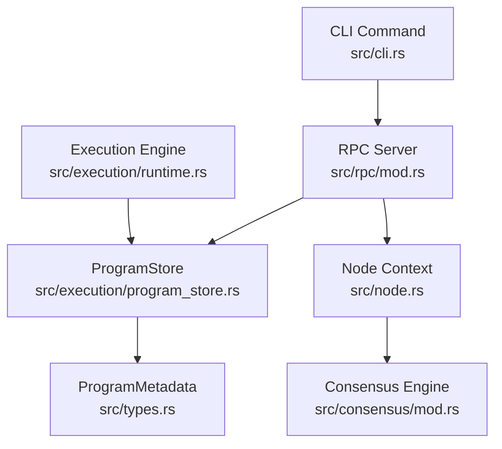
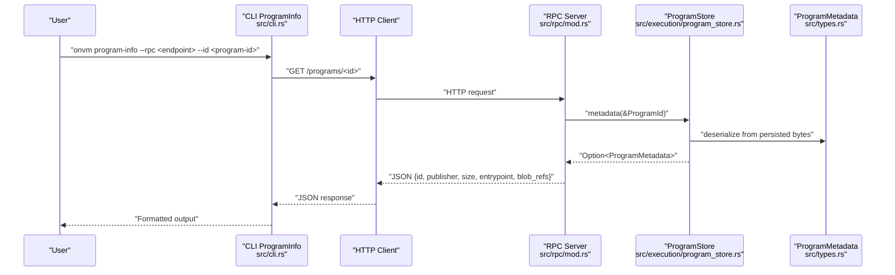
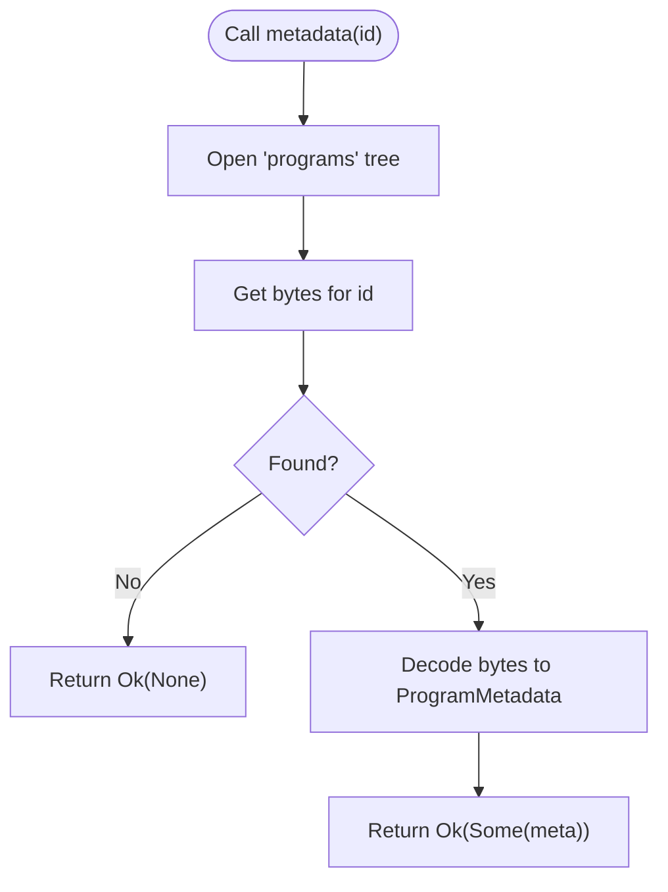
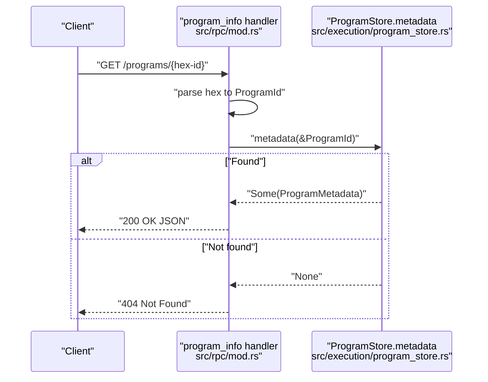
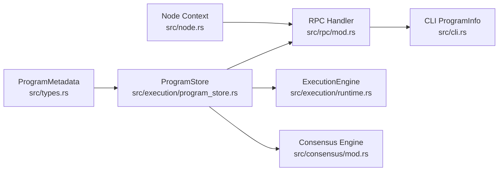

# Program Metadata Inspection

<cite>
**Referenced Files in This Document**
- [program_store.rs](file://src/execution/program_store.rs)
- [mod.rs](file://src/rpc/mod.rs)
- [cli.rs](file://src/cli.rs)
- [types.rs](file://src/types.rs)
- [runtime.rs](file://src/execution/runtime.rs)
- [mod.rs](file://src/consensus/mod.rs)
- [node.rs](file://src/node.rs)
</cite>

## Table of Contents
1. [Introduction](#introduction)
2. [Project Structure](#project-structure)
3. [Core Components](#core-components)
4. [Architecture Overview](#architecture-overview)
5. [Detailed Component Analysis](#detailed-component-analysis)
6. [Dependency Analysis](#dependency-analysis)
7. [Performance Considerations](#performance-considerations)
8. [Troubleshooting Guide](#troubleshooting-guide)
9. [Conclusion](#conclusion)
10. [Appendices](#appendices)

## Introduction
This document explains the program metadata inspection capability across the system. It focuses on:
- How metadata is stored and retrieved from the persistent store
- How the RPC endpoint serves program metadata over HTTP
- How the CLI integrates with the RPC to expose a human-friendly inspection command
- The structure and significance of ProgramMetadata for dependency resolution and execution context
- Practical examples of inspecting deployed programs and using metadata for impact analysis and verification
- Common issues and troubleshooting steps

## Project Structure
The program metadata inspection spans several modules:
- Storage and retrieval of program metadata and WASM bytes
- RPC server exposing a GET endpoint for program metadata
- CLI command that queries the RPC endpoint and prints the result
- Runtime execution that consumes ProgramMetadata to locate and execute programs
- Consensus and network layers that propagate and validate program metadata

**Diagram sources**
- [cli.rs](file://src/cli.rs#L284-L296)
- [mod.rs](file://src/rpc/mod.rs#L62-L96)
- [program_store.rs](file://src/execution/program_store.rs#L74-L82)
- [types.rs](file://src/types.rs#L33-L41)
- [node.rs](file://src/node.rs#L23-L35)
- [mod.rs](file://src/consensus/mod.rs#L133-L151)
- [runtime.rs](file://src/execution/runtime.rs#L79-L87)

**Section sources**
- [program_store.rs](file://src/execution/program_store.rs#L1-L95)
- [mod.rs](file://src/rpc/mod.rs#L62-L96)
- [cli.rs](file://src/cli.rs#L284-L296)
- [types.rs](file://src/types.rs#L33-L41)
- [runtime.rs](file://src/execution/runtime.rs#L79-L87)
- [mod.rs](file://src/consensus/mod.rs#L133-L151)
- [node.rs](file://src/node.rs#L23-L35)

## Core Components
- ProgramStore: Persistent store for program metadata and WASM bytes. Provides metadata retrieval by ProgramId.
- RPC Server: Exposes GET /programs/{id} returning structured metadata including publisher, size, entrypoint, and blob dependencies.
- CLI: Adds a program-info subcommand that queries the RPC endpoint and prints the response.
- ProgramMetadata: Defines the fields used for dependency resolution and execution context.
- ExecutionEngine: Uses ProgramMetadata to load and execute programs, relying on entrypoint and blob dependencies.

**Section sources**
- [program_store.rs](file://src/execution/program_store.rs#L74-L82)
- [mod.rs](file://src/rpc/mod.rs#L176-L192)
- [cli.rs](file://src/cli.rs#L284-L296)
- [types.rs](file://src/types.rs#L33-L41)
- [runtime.rs](file://src/execution/runtime.rs#L79-L87)

## Architecture Overview
The inspection flow connects CLI, RPC, and storage:

**Diagram sources**
- [cli.rs](file://src/cli.rs#L284-L296)
- [mod.rs](file://src/rpc/mod.rs#L62-L96)
- [mod.rs](file://src/rpc/mod.rs#L176-L192)
- [program_store.rs](file://src/execution/program_store.rs#L74-L82)
- [types.rs](file://src/types.rs#L33-L41)

## Detailed Component Analysis

### ProgramStore.metadata: Retrieving ProgramMetadata
ProgramStore.metadata reads from the "programs" sled tree keyed by ProgramId and decodes the stored ProgramMetadata. It returns None when the key is absent, enabling callers to distinguish missing programs from deserialization errors.

Key behaviors:
- Opens the "programs" tree
- Retrieves raw bytes for the given ProgramId
- Decodes using bincode with standard configuration
- Returns Ok(None) if not found; otherwise Ok(Some(meta))

**Diagram sources**
- [program_store.rs](file://src/execution/program_store.rs#L74-L82)

**Section sources**
- [program_store.rs](file://src/execution/program_store.rs#L74-L82)

### RPC Handler: GET /programs/{id}
The RPC server registers a route for GET /programs/{id}. The handler:
- Parses the hex-encoded ProgramId from the path
- Calls ProgramStore.metadata
- Returns structured JSON with id, publisher, size, entrypoint, and blob_refs
- Returns NOT_FOUND when metadata is absent

**Diagram sources**
- [mod.rs](file://src/rpc/mod.rs#L62-L96)
- [mod.rs](file://src/rpc/mod.rs#L176-L192)
- [program_store.rs](file://src/execution/program_store.rs#L74-L82)

**Section sources**
- [mod.rs](file://src/rpc/mod.rs#L176-L192)

### CLI Integration: onvm program-info
The CLI adds a ProgramInfo subcommand that:
- Normalizes the RPC endpoint URL
- Issues a GET to /programs/{id}
- Prints the raw response text

This provides a simple, human-readable inspection interface backed by the RPC endpoint.

**Section sources**
- [cli.rs](file://src/cli.rs#L284-L296)

### ProgramMetadata Fields and Their Significance
ProgramMetadata fields:
- id: Unique identifier derived from WASM content and deploy salt
- publisher: NodeId of the deploying node
- size: Byte length of the WASM program
- entrypoint: Exported function name used by the runtime
- blob_refs: List of BlobIds the program depends on
- deploy_salt: Salt used to compute id deterministically

These fields enable:
- Dependency resolution: blob_refs inform the runtime and consensus of required blobs
- Execution context: entrypoint determines the callable export
- Provenance and integrity: publisher and id support auditing and verification
- Impact analysis: listing programs and their dependencies helps assess changes

**Section sources**
- [types.rs](file://src/types.rs#L33-L41)

### Execution Context and Dependency Resolution
The runtime uses ProgramMetadata to:
- Load the program bytes by ProgramId
- Instantiate the WebAssembly module
- Resolve the entrypoint function
- Access blob dependencies during execution

This demonstrates how metadata drives execution and dependency resolution.

**Section sources**
- [runtime.rs](file://src/execution/runtime.rs#L79-L87)

### Consensus and Network Propagation
Consensus handles program broadcasts and metadata propagation:
- Validates program id collisions with differing salts
- Replicates program metadata and bytes
- Records program locations for indexing
- Requests missing programs from peers

This ensures nodes maintain consistent metadata and can serve inspection requests.

**Section sources**
- [mod.rs](file://src/consensus/mod.rs#L133-L151)
- [mod.rs](file://src/consensus/mod.rs#L307-L338)
- [mod.rs](file://src/consensus/mod.rs#L340-L348)

## Dependency Analysis
Program metadata underpins multiple subsystems. The following diagram shows key dependencies:

**Diagram sources**
- [types.rs](file://src/types.rs#L33-L41)
- [program_store.rs](file://src/execution/program_store.rs#L74-L82)
- [mod.rs](file://src/rpc/mod.rs#L176-L192)
- [runtime.rs](file://src/execution/runtime.rs#L79-L87)
- [mod.rs](file://src/consensus/mod.rs#L133-L151)
- [cli.rs](file://src/cli.rs#L284-L296)
- [node.rs](file://src/node.rs#L23-L35)

**Section sources**
- [program_store.rs](file://src/execution/program_store.rs#L74-L82)
- [mod.rs](file://src/rpc/mod.rs#L176-L192)
- [runtime.rs](file://src/execution/runtime.rs#L79-L87)
- [mod.rs](file://src/consensus/mod.rs#L133-L151)
- [cli.rs](file://src/cli.rs#L284-L296)
- [node.rs](file://src/node.rs#L23-L35)

## Performance Considerations
- Metadata retrieval is O(1) for the "programs" tree lookup plus decoding cost proportional to metadata size.
- Storing and retrieving WASM bytes separately avoids duplicating large payloads in metadata.
- Using bincode with standard configuration balances speed and compatibility.
- Network propagation of program metadata reduces repeated fetches across the cluster.

[No sources needed since this section provides general guidance]

## Troubleshooting Guide
Common issues and resolutions:

- Non-existent program ID
  - Symptom: 404 Not Found from GET /programs/{id}
  - Cause: ProgramId not present in the "programs" tree
  - Resolution: Verify the ProgramId is correct and the program was deployed; ensure consensus has replicated the metadata

- Deserialization errors
  - Symptom: Internal server error when fetching metadata
  - Cause: Corrupted or incompatible metadata bytes in storage
  - Resolution: Re-deploy the program; verify storage integrity; check encoding/decoding configuration consistency

- Network connectivity problems
  - Symptom: CLI fails to connect to RPC endpoint
  - Cause: Incorrect endpoint URL or RPC server not running
  - Resolution: Normalize endpoint using http:// prefix; confirm RPC server bound address; ensure firewall allows connections

- Execution preconditions
  - Symptom: Execution fails due to missing metadata
  - Cause: Program metadata not present locally
  - Resolution: Allow consensus to propagate metadata; verify inventory exchange; ensure program bytes are available

**Section sources**
- [mod.rs](file://src/rpc/mod.rs#L176-L192)
- [program_store.rs](file://src/execution/program_store.rs#L74-L82)
- [cli.rs](file://src/cli.rs#L13-L22)
- [mod.rs](file://src/consensus/mod.rs#L194-L201)

## Conclusion
Program metadata inspection is a foundational capability that ties together storage, RPC, CLI, execution, and consensus. ProgramMetadata provides the essential context for dependency resolution, execution, and auditing. The documented flow enables operators to verify program provenance, analyze blob dependencies, and troubleshoot deployment issues effectively.

[No sources needed since this section summarizes without analyzing specific files]

## Appendices

### Example Workflows

- Inspecting a deployed program
  - Deploy a program to obtain its ProgramId
  - Use the CLI to query metadata: onvm program-info --rpc http://127.0.0.1:8080 --id <program-id>
  - Review publisher, size, entrypoint, and blob_refs in the JSON response

- Auditing program provenance
  - Compare publisher NodeId across nodes to verify origin
  - Confirm id matches expectations using deploy_salt and WASM content

- Verifying deployment integrity
  - Cross-check size against expected WASM size
  - Ensure entrypoint exists in the compiled module
  - Validate blob_refs correspond to required blobs

- Analyzing dependency graphs for optimization
  - Aggregate blob_refs across programs to identify shared dependencies
  - Plan blob replication and caching strategies based on observed usage

[No sources needed since this section provides general guidance]