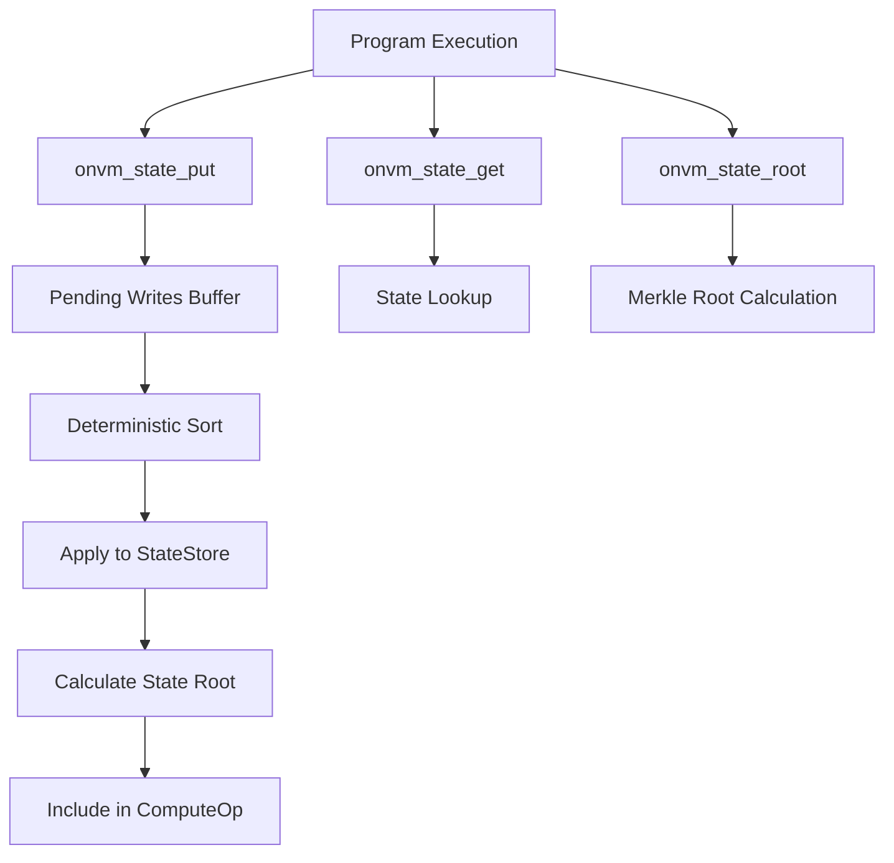

# Project Overview

<cite>
**Referenced Files in This Document**   
- [Cargo.toml](file://Cargo.toml)
- [src/lib.rs](file://src/lib.rs)
- [src/main.rs](file://src/main.rs)
- [src/types.rs](file://src/types.rs)
- [src/node.rs](file://src/node.rs)
- [src/cli.rs](file://src/cli.rs)
- [src/consensus/mod.rs](file://src/consensus/mod.rs)
- [src/execution/runtime.rs](file://src/execution/runtime.rs)
- [src/storage/blob_store.rs](file://src/storage/blob_store.rs)
- [src/storage/state_store.rs](file://src/storage/state_store.rs)
- [src/rpc/mod.rs](file://src/rpc/mod.rs)
- [src/crypto/hashing.rs](file://src/crypto/hashing.rs)
- [src/network/service.rs](file://src/network/service.rs)
- [wasm_programs/kvstore/src/lib.rs](file://wasm_programs/kvstore/src/lib.rs)
</cite>

## Table of Contents
1. [Introduction](#introduction)
2. [Core Architecture](#core-architecture)
3. [Execution Model](#execution-model)
4. [State Management](#state-management)
5. [Network and Consensus](#network-and-consensus)
6. [Security and Integrity](#security-and-integrity)
7. [Integration Points](#integration-points)
8. [Example Workflow](#example-workflow)
9. [Technology Stack](#technology-stack)
10. [Use Cases](#use-cases)

## Introduction

The ONVM (Open Network Virtual Machine) project is a decentralized network virtual machine designed for executing WebAssembly (Wasm) programs in a peer-to-peer environment. The system enables verifiable, stateful computation across distributed nodes through a Directed Acyclic Graph (DAG)-based consensus mechanism. ONVM's architecture emphasizes content-addressable storage, cryptographic integrity, and capability-based security to create a trustless execution environment where programs and data are uniquely identified by their cryptographic hashes.

The system allows users to deploy Wasm programs that can maintain persistent state and interact with networked data through well-defined host functions. All operations—program deployment, data publication, and program execution—are recorded as operations in the DAG, creating an immutable, verifiable history of computation. The use of content-addressable identifiers like ProgramId and BlobId ensures global uniqueness and integrity verification throughout the network.

**Section sources**
- [Cargo.toml](file://Cargo.toml)
- [src/lib.rs](file://src/lib.rs)
- [src/types.rs](file://src/types.rs)

## Core Architecture

ONVM follows a modular architecture with clearly separated concerns between execution, storage, networking, and consensus layers. The node structure orchestrates these components, with the Node struct in node.rs serving as the central coordinator that integrates the blob store, program store, execution engine, scheduler, consensus engine, and network service.

The system's data model revolves around several key identifiers: ProgramId for Wasm programs, BlobId for arbitrary data blobs, and DagId for operations in the consensus DAG. These identifiers are 32-byte cryptographic hashes that provide content addressing and integrity verification. The architecture supports both full data replication and metadata-only synchronization modes, allowing nodes to participate in the network with different resource constraints.

```mermaid
graph TB
subgraph "ONVM Node"
CLI[CLI Interface]
RPC[RPC Server]
Network[libp2p Network]
Consensus[DAG Consensus]
Execution[Execution Engine]
Storage[Storage Layer]
end
CLI < --> RPC
RPC < --> Consensus
Network < --> Consensus
Consensus < --> Execution
Consensus < --> Storage
Execution < --> Storage
Storage --> Sled[(Sled DB)]
Network --> libp2p[libp2p Stack]
Execution --> Wasmtime[Wasmtime Runtime]
```

**Diagram sources **
- [src/node.rs](file://src/node.rs#L14-L35)
- [src/types.rs](file://src/types.rs#L5-L15)

## Execution Model

The execution model centers around the ExecutionEngine, which uses Wasmtime to safely execute Wasm programs in a sandboxed environment. Programs are identified by ProgramId and can be deployed with a custom entrypoint function that follows specific calling conventions. The execution system supports three calling conventions for program entrypoints: multi-value return, packed return, and sret (struct return), providing flexibility for different Wasm compilation targets.

When executing a program, the system provides capability-based access to network resources through host functions. Programs can read data blobs using onvm_blob_read and perform state operations using onvm_state_put, onvm_state_get, and onvm_state_root. These host functions implement capability-based security by restricting access to specific resources based on the program's context and permissions.

The execution process consumes "fuel" as a resource limiting mechanism, with a configurable maximum fuel limit that prevents infinite loops and excessive resource consumption. After execution, the system records the ComputeOp operation in the DAG, capturing the program ID, input and output blobs, fuel consumption, state changes, and resulting state root.

**Section sources**
- [src/execution/runtime.rs](file://src/execution/runtime.rs#L10-L185)
- [src/types.rs](file://src/types.rs#L24-L31)

## State Management

ONVM provides persistent, verifiable state management through its StateStore component, which uses a Merkle tree-based approach to ensure cryptographic integrity. Each program has its own state namespace scoped to its ProgramId, preventing cross-program interference while allowing verifiable state transitions.

The state system supports three key operations: put, get, and root calculation. The onvm_state_put and onvm_state_get host functions allow programs to store and retrieve data with automatic buffer management for variable-sized values. The onvm_state_root function enables programs to obtain a cryptographic commitment to their current state, which is included in the ComputeOp record.

State changes are not immediately committed but are tracked as pending writes during execution. After successful execution, these writes are applied deterministically in key-sorted order, ensuring consistent state transitions across all verifying nodes. The Merkle root of the program's state is calculated using a sorted hash of key-value pairs, providing a compact cryptographic commitment to the entire state.



**Diagram sources **
- [src/storage/state_store.rs](file://src/storage/state_store.rs#L17-L40)
- [src/execution/runtime.rs](file://src/execution/runtime.rs#L246-L376)

## Network and Consensus

The network layer is built on libp2p, providing peer-to-peer connectivity with support for TCP, DNS, WebSocket, Noise encryption, Yamux multiplexing, GossipSub, Kademlia DHT, and mDNS. The consensus mechanism uses a DAG-based approach where operations (program deployment, blob publication, and computation) are represented as nodes with cryptographic references to their dependencies.

The system employs a gossip-based synchronization protocol where nodes exchange inventory messages containing lists of known programs, blobs, and executions. When a node detects missing operations, it requests them from peers and validates them before incorporation into its local DAG. The consensus engine ensures that all operations are properly signed and that dependencies exist before accepting new operations.

Program deployment creates a DeployProgram operation with references to any required blob dependencies, while computation creates a ComputeOp with references to the program, input blob, and output blob. This dependency tracking ensures that the network maintains a consistent view of available programs and data, with automatic synchronization of missing dependencies.

**Section sources**
- [src/consensus/mod.rs](file://src/consensus/mod.rs#L22-L27)
- [src/network/service.rs](file://src/network/service.rs)
- [src/crypto/keys.rs](file://src/crypto/keys.rs)

## Security and Integrity

ONVM implements multiple layers of security and integrity verification. All identifiers (ProgramId, BlobId, NodeId) are derived from cryptographic hashes, ensuring content addressing and preventing identifier collisions. The system uses Ed25519 digital signatures for message authentication, with each node having a cryptographic identity that signs all operations it publishes.

Data integrity is ensured through multiple mechanisms: blobs are stored with Merkle tree verification using chunked hashing, state is protected with Merkle roots, and all operations are cryptographically linked in the DAG. The blob storage system validates chunk hashes and Merkle roots on both write and read operations, preventing silent data corruption.

Capability-based security is implemented through the host function interface, where programs can only access resources they have been explicitly granted access to. The execution environment is sandboxed using Wasmtime's security features, with no direct access to system resources. Network communications are encrypted using libp2p's Noise protocol, ensuring confidentiality and integrity of data in transit.

**Section sources**
- [src/crypto/hashing.rs](file://src/crypto/hashing.rs)
- [src/storage/blob_store.rs](file://src/storage/blob_store.rs#L28-L42)
- [src/types.rs](file://src/types.rs#L55-L66)

## Integration Points

ONVM provides multiple integration points for interacting with the system. The CLI offers commands for initializing nodes, uploading blobs, deploying programs, executing operations, and inspecting program metadata. The RPC interface exposes these capabilities over HTTP, allowing programmatic access to the node's functionality.

The RPC endpoints include /blobs for data operations, /programs for program deployment and inspection, and /execute for running programs. All data is transferred in base64-encoded format for JSON compatibility, with appropriate error handling and status codes. The CLI internally uses the same RPC interface, ensuring consistency between command-line and programmatic access.

For Wasm program development, the system provides a clear interface with documented host functions and calling conventions. Example programs like the kvstore demonstrate how to structure Wasm modules for ONVM execution, including proper memory management and error handling patterns.

**Section sources**
- [src/cli.rs](file://src/cli.rs#L24-L107)
- [src/rpc/mod.rs](file://src/rpc/mod.rs#L25-L60)

## Example Workflow

Consider a user deploying and using the kvstore program, which provides key-value storage functionality. The workflow begins with program deployment: the user compiles the kvstore Wasm module and uses the CLI deploy command to upload it to the network. This creates a ProgramId based on the Wasm bytecode (optionally salted for uniqueness) and broadcasts the program to peers.

To store data, the user executes the kvstore program with a JSON input specifying a "put" operation with a key and base64-encoded data. The program executes, storing the data in its private state using onvm_state_put and updating a key index. The execution produces an output blob containing a JSON response with operation status, which is returned to the user.

Subsequent operations like "get", "list", "clear", and "stats" follow the same pattern: the user submits an execution request, the program runs in the sandboxed environment, interacts with its state, and returns a result. All operations are recorded in the DAG, creating a verifiable history of state transitions that can be independently verified by any network participant.

**Section sources**
- [wasm_programs/kvstore/src/lib.rs](file://wasm_programs/kvstore/src/lib.rs#L10-L144)
- [src/consensus/mod.rs](file://src/consensus/mod.rs#L194-L258)

## Technology Stack

ONVM is built on a modern Rust technology stack that emphasizes security, performance, and reliability. The system uses Wasmtime as its WebAssembly runtime, providing a secure, standards-compliant execution environment with support for WASI. The libp2p framework handles peer-to-peer networking with robust encryption, discovery, and transport capabilities.

For storage, ONVM uses Sled as an embedded ACID-compliant key-value store, providing reliable persistence with good performance characteristics. The system leverages Rust's strong type system and memory safety guarantees to prevent common security vulnerabilities. Serialization is handled by Serde with Bincode for efficient binary encoding of structured data.

The async runtime is powered by Tokio, enabling high-concurrency network operations and efficient resource utilization. The system uses Blake3 for cryptographic hashing, chosen for its speed and security properties. Logging and diagnostics are provided by the Tracing ecosystem, enabling detailed observability of node operations.

**Section sources**
- [Cargo.toml](file://Cargo.toml)
- [src/main.rs](file://src/main.rs)
- [src/node.rs](file://src/node.rs#L45-L49)

## Use Cases

ONVM enables several compelling use cases in decentralized computing. For edge processing, the system allows deploying lightweight Wasm programs to edge devices that can process local data and synchronize results with the broader network. The trustless execution environment makes it suitable for applications requiring verifiable computation, such as decentralized oracles or data processing pipelines.

In trustless execution environments, ONVM provides a platform for running programs with guaranteed integrity and verifiable state transitions. This is valuable for decentralized finance applications, gaming logic, or any scenario where multiple parties need to agree on computation results without trusting a central authority.

The content-addressable storage and DAG-based consensus make ONVM well-suited for distributed data processing workflows, where intermediate results are automatically cached and shared across the network. The capability-based security model allows for fine-grained access control, enabling secure multi-tenant environments where different programs can coexist without interfering with each other.

**Section sources**
- [AGENTS.md](file://AGENTS.md)
- [wasm_programs/](file://wasm_programs/)
- [analytics_input.json](file://analytics_input.json)