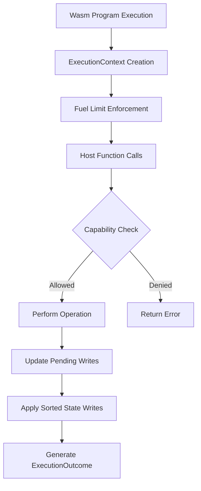
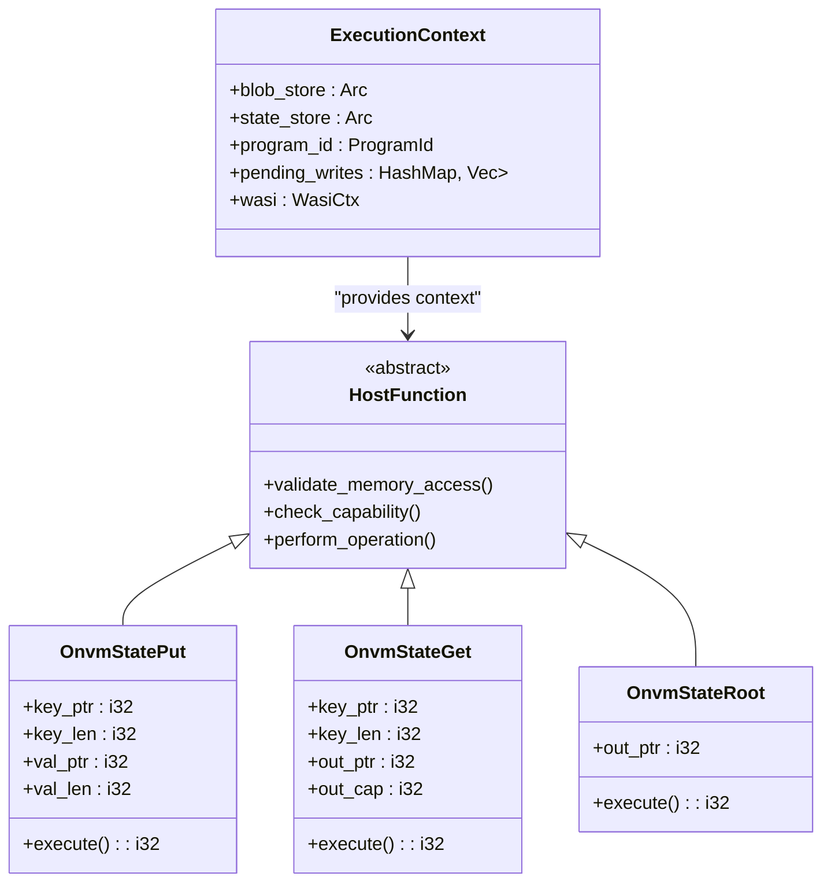
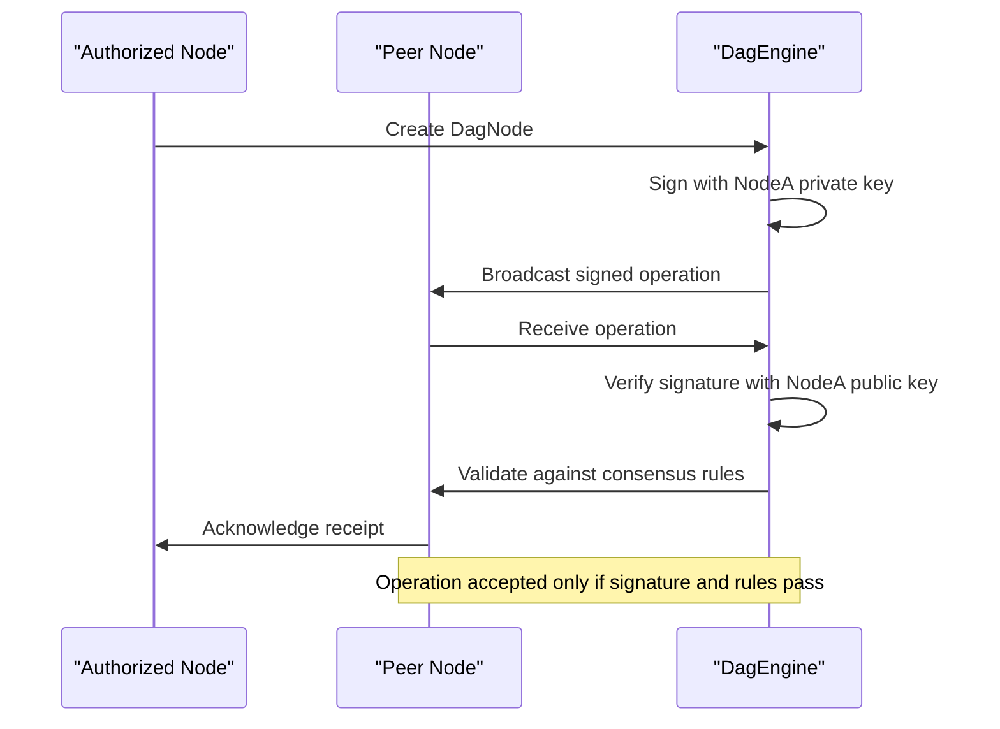
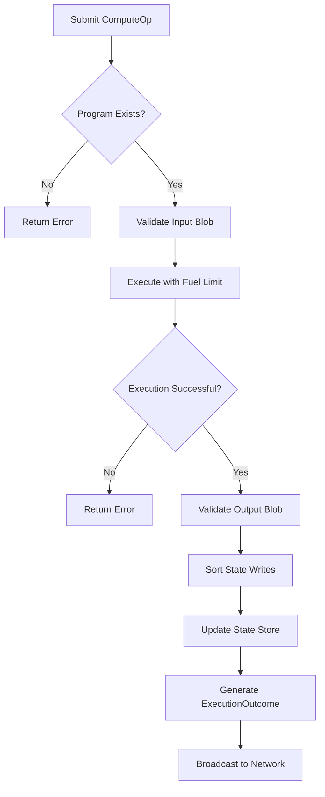
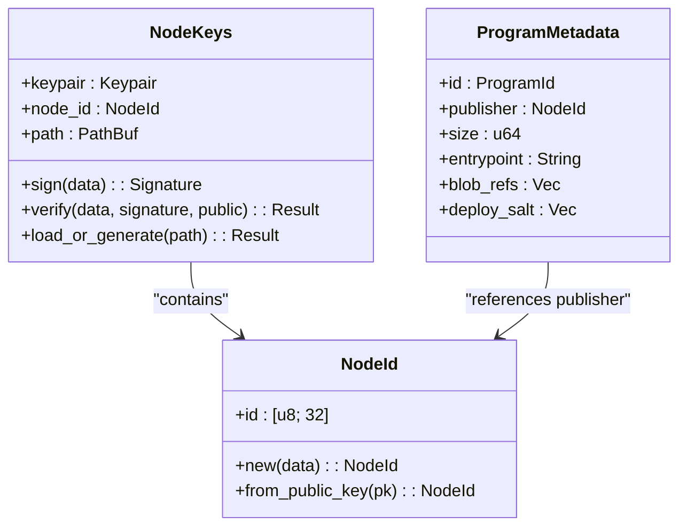
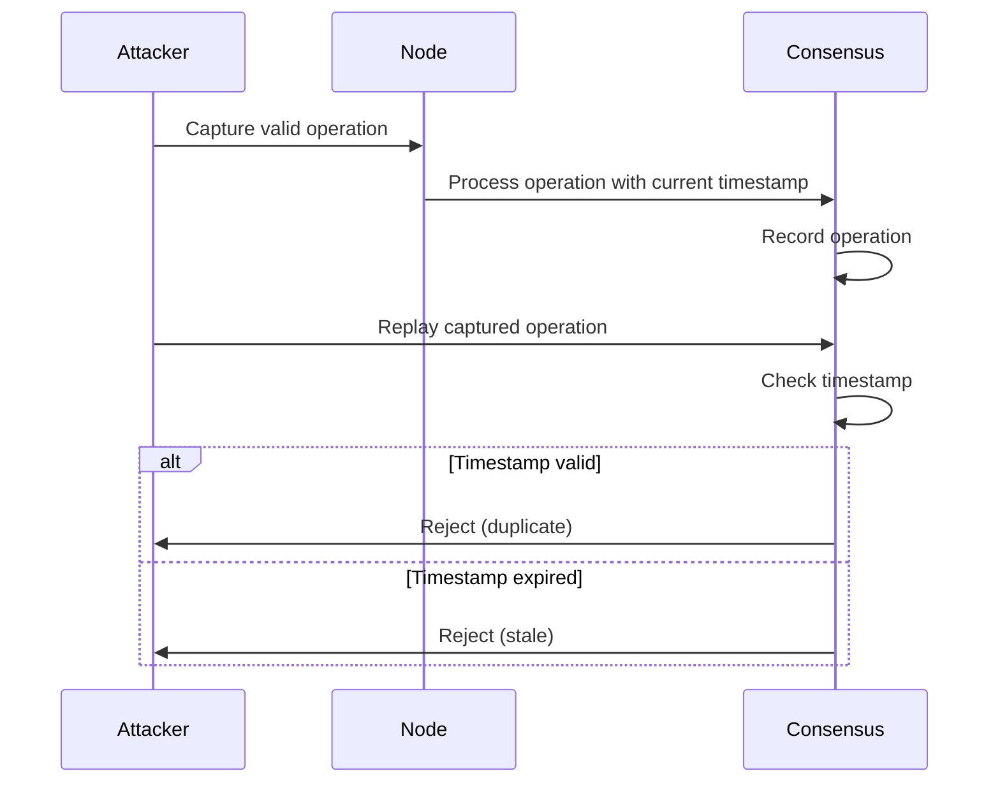
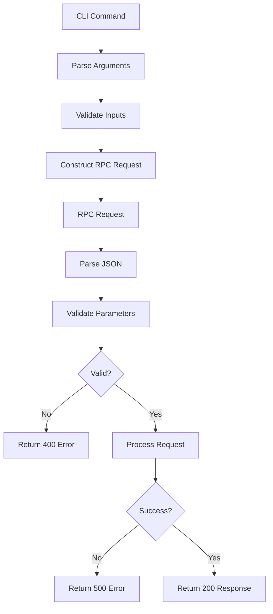

# Access Control

<cite>
**Referenced Files in This Document**   
- [main.rs](file://src/main.rs)
- [node.rs](file://src/node.rs)
- [types.rs](file://src/types.rs)
- [crypto/keys.rs](file://src/crypto/keys.rs)
- [execution/runtime.rs](file://src/execution/runtime.rs)
- [execution/scheduler.rs](file://src/execution/scheduler.rs)
- [consensus/mod.rs](file://src/consensus/mod.rs)
- [rpc/mod.rs](file://src/rpc/mod.rs)
- [cli.rs](file://src/cli.rs)
- [wasm_programs/kvstore/src/lib.rs](file://wasm_programs/kvstore/src/lib.rs)
</cite>

## Table of Contents
1. [Introduction](#introduction)
2. [Capability-Based Security in Wasm Runtime](#capability-based-security-in-wasm-runtime)
3. [Sandboxing of Host Functions](#sandboxing-of-host-functions)
4. [Block Production Rights and Consensus Rules](#block-production-rights-and-consensus-rules)
5. [Permission Checks During ComputeOp Execution](#permission-checks-during-computeop-execution)
6. [Cryptographic Identities and Access Policies](#cryptographic-identities-and-access-policies)
7. [Replay Attack Prevention](#replay-attack-prevention)
8. [Security Model for RPC and CLI Interfaces](#security-model-for-rpc-and-cli-interfaces)
9. [Node Deployment Security](#node-deployment-security)
10. [Conclusion](#conclusion)

## Introduction
The ONVM system implements a comprehensive access control framework that governs program execution, data access, and network operations through cryptographic identities, capability-based security, and consensus rules. This document details the mechanisms that ensure only authorized operations are performed within the system, from Wasm program execution to block production and RPC interface security. The system uses cryptographic signatures, capability-based permissions, and consensus validation to maintain security across distributed nodes.

## Capability-Based Security in Wasm Runtime

The ONVM system enforces program execution permissions through a capability-based security model in the Wasm runtime. Programs are executed in a sandboxed environment where access to system resources is strictly controlled through capabilities rather than ambient authority. The `ExecutionEngine` in the runtime module manages program execution with fuel limits and isolated memory spaces.

Wasm programs cannot directly access external resources; instead, they must use host functions that are explicitly exposed by the runtime. These host functions implement capability checks before performing any privileged operations. The execution model ensures that programs can only perform actions for which they have been granted explicit capabilities through the host function interface.

The capability system is implemented through the `ExecutionContext` which maintains program-specific state and enforces access controls. Each program execution is isolated with its own pending writes buffer, preventing unauthorized access to other programs' state. The runtime also implements deterministic execution by sorting state writes by key before application, ensuring consistent behavior across all nodes.

**Diagram sources**
- [execution/runtime.rs](file://src/execution/runtime.rs#L10-L182)

**Section sources**
- [execution/runtime.rs](file://src/execution/runtime.rs#L10-L182)
- [execution/scheduler.rs](file://src/execution/scheduler.rs#L6-L40)

## Sandboxing of Host Functions

Host functions in the ONVM system are carefully sandboxed to prevent unauthorized access to system resources. The runtime exposes only a minimal set of host functions to Wasm programs, each implementing strict validation and access controls. These functions are attached to the Wasm instance through the `Linker` and operate within the constraints of the `ExecutionContext`.

The system exposes three primary host functions for state management: `onvm_state_put`, `onvm_state_get`, and `onvm_state_root`. Each function performs multiple validation steps before executing. The `onvm_state_put` function validates memory access and stores writes in a pending writes buffer rather than immediately committing to storage. This allows for atomic application of all state changes after successful execution.

The `onvm_state_get` function implements a two-layer lookup system, first checking the pending writes buffer for uncommitted changes before querying the persistent state store. This ensures that programs see their own pending modifications during execution. Both functions validate memory boundaries and return appropriate error codes for invalid operations, preventing buffer overflows and other memory-related vulnerabilities.

**Diagram sources**
- [execution/runtime.rs](file://src/execution/runtime.rs#L48-L376)
- [wasm_programs/kvstore/src/lib.rs](file://wasm_programs/kvstore/src/lib.rs#L235-L239)

**Section sources**
- [execution/runtime.rs](file://src/execution/runtime.rs#L199-L376)
- [wasm_programs/kvstore/src/lib.rs](file://wasm_programs/kvstore/src/lib.rs#L148-L162)

## Block Production Rights and Consensus Rules

Block production rights in the ONVM system are restricted to authorized nodes through cryptographic signatures and consensus rules. The system uses a DAG-based consensus model where each node's identity is established through cryptographic key pairs. Only nodes with valid identities can produce blocks and participate in the consensus process.

The `DagEngine` enforces block validation rules that verify the authenticity and integrity of all operations. Each `DagNode` contains a publisher field that identifies the node that created it, and all operations are cryptographically signed by the publishing node. The consensus rules validate these signatures before accepting any operation into the DAG.

Block production follows a permissioned model where nodes must have their public keys registered in the network. The system prevents unauthorized block production by rejecting any operations from unknown or untrusted nodes. The inventory synchronization process ensures that all nodes have a consistent view of authorized participants, preventing Sybil attacks and other network-level threats.

**Diagram sources**
- [consensus/mod.rs](file://src/consensus/mod.rs#L22-L482)
- [crypto/keys.rs](file://src/crypto/keys.rs#L30-L72)

**Section sources**
- [consensus/mod.rs](file://src/consensus/mod.rs#L22-L482)
- [node.rs](file://src/node.rs#L1-L163)

## Permission Checks During ComputeOp Execution

The system implements comprehensive permission checks during `ComputeOp` execution to ensure that only authorized operations are performed. Each `ComputeOp` represents the execution of a program with specific inputs and outputs, and the system validates multiple aspects of the operation before and after execution.

Before execution, the system verifies that the program exists in the `ProgramStore` and that the requesting node has the right to execute it. The `submit_execution` method in the `DagEngine` performs this validation by checking the program metadata. During execution, the runtime enforces fuel limits to prevent denial-of-service attacks and ensure fair resource usage.

After execution, the system validates the results by checking the state root and ensuring that all state writes are properly recorded. The `ExecutionOutcome` includes a fuel consumption metric that allows the system to charge for resource usage. The consensus rules require that all nodes produce identical execution outcomes, preventing malicious nodes from altering program behavior.

**Diagram sources**
- [consensus/mod.rs](file://src/consensus/mod.rs#L194-L258)
- [execution/runtime.rs](file://src/execution/runtime.rs#L79-L182)

**Section sources**
- [consensus/mod.rs](file://src/consensus/mod.rs#L194-L258)
- [types.rs](file://src/types.rs#L24-L31)

## Cryptographic Identities and Access Policies

Cryptographic identities form the foundation of access control in the ONVM system. Each node has a unique identity established through an Ed25519 key pair, with the public key serving as the basis for the `NodeId`. The `NodeKeys` structure manages these identities and provides methods for signing and verifying operations.

Access policies are implemented through a combination of cryptographic verification and metadata validation. The system uses the `verify` method to authenticate operations by checking digital signatures against known public keys. Each operation includes the publisher's `NodeId`, allowing the system to enforce access policies based on identity.

The identity system is initialized through the CLI's `init` command, which generates or loads cryptographic keys from disk. The `load_or_generate` method ensures that each node has a persistent identity that can be used for authentication across sessions. The system prevents identity spoofing by requiring valid signatures on all network operations.

**Diagram sources**
- [crypto/keys.rs](file://src/crypto/keys.rs#L8-L72)
- [types.rs](file://src/types.rs#L15-L41)

**Section sources**
- [crypto/keys.rs](file://src/crypto/keys.rs#L8-L72)
- [cli.rs](file://src/cli.rs#L116-L129)

## Replay Attack Prevention

The ONVM system prevents replay attacks through the use of monotonic timestamps in signed operations. Each `DagNode` includes a `timestamp_ms` field that records when the operation was created, and the consensus rules reject operations with timestamps that are too far in the past or future.

The system uses a combination of cryptographic signatures and temporal validation to ensure that operations cannot be replayed. Even if an attacker captures a valid signed operation, they cannot reuse it because the timestamp will be outside the acceptable window when they attempt to replay it. The inventory synchronization process also helps prevent replay attacks by maintaining a consistent view of recent operations across the network.

The timestamp validation is implemented in the `record_operation` method, which sets the current time when creating a new `DagNode`. While the current implementation does not include explicit sequence numbers or counters, the timestamp-based approach provides effective protection against replay attacks in a distributed environment where clock synchronization is reasonably maintained.

**Diagram sources**
- [consensus/mod.rs](file://src/consensus/mod.rs#L294-L304)
- [types.rs](file://src/types.rs#L40-L46)

**Section sources**
- [consensus/mod.rs](file://src/consensus/mod.rs#L294-L304)
- [types.rs](file://src/types.rs#L40-L46)

## Security Model for RPC and CLI Interfaces

The RPC and CLI interfaces implement a security model that protects against unauthorized access and malicious operations. The RPC server, implemented in the `rpc` module, exposes endpoints for uploading blobs, deploying programs, and executing operations, with input validation and error handling for all requests.

The CLI interface provides a command-line tool for interacting with the node, with commands for initialization, node operation, and various RPC calls. The `normalize_rpc_endpoint` function ensures that RPC endpoints are properly formatted, preventing injection attacks. All RPC requests are validated for proper formatting and content before being processed.

The system uses base64 encoding for binary data in RPC requests, preventing issues with binary content in JSON payloads. The request handlers perform thorough validation of input parameters, returning appropriate error codes for invalid requests. The `internal_err` helper function standardizes error responses, preventing information leakage about internal system details.

**Diagram sources**
- [rpc/mod.rs](file://src/rpc/mod.rs#L1-L240)
- [cli.rs](file://src/cli.rs#L1-L300)

**Section sources**
- [rpc/mod.rs](file://src/rpc/mod.rs#L1-L240)
- [cli.rs](file://src/cli.rs#L1-L300)

## Node Deployment Security

Securing node deployments in the ONVM system requires attention to several key areas to mitigate privilege escalation risks. The system provides mechanisms for secure identity management, data directory protection, and network configuration that administrators should follow to maintain security.

Node identities should be protected by restricting access to the identity file on disk. The `data_dir` parameter specifies where node data is stored, and this directory should have strict file permissions to prevent unauthorized access. The system generates cryptographic keys during initialization, and these keys should be backed up securely to prevent loss of node identity.

Network configuration should follow the principle of least privilege, with nodes only exposing necessary ports to the network. The `listen_addr` and `rpc_bind` parameters control network interfaces, and administrators should restrict these to trusted networks when possible. The system's use of capability-based security and cryptographic verification helps mitigate risks even if an attacker gains partial access to a node.

Regular updates and monitoring are essential for maintaining node security. Administrators should monitor logs for suspicious activity and keep the system updated with security patches. The modular design of the system allows for security enhancements to be implemented without disrupting existing functionality.

**Section sources**
- [node.rs](file://src/node.rs#L14-L35)
- [cli.rs](file://src/cli.rs#L34-L50)

## Conclusion
The ONVM system implements a comprehensive access control framework that combines capability-based security, cryptographic identities, and consensus rules to protect against unauthorized access and malicious operations. The Wasm runtime enforces strict sandboxing through limited host functions and capability checks, while the consensus layer validates all operations through cryptographic signatures and temporal validation.

The system's security model addresses key threats including replay attacks, privilege escalation, and unauthorized program execution through a layered approach that combines cryptographic verification, capability-based permissions, and deterministic execution. The RPC and CLI interfaces provide secure access points with proper input validation and error handling.

For optimal security, node operators should follow best practices for identity management, network configuration, and system monitoring. The modular architecture allows for ongoing security improvements while maintaining compatibility with existing deployments. The combination of cryptographic security, capability-based access control, and consensus validation creates a robust foundation for secure distributed computation.