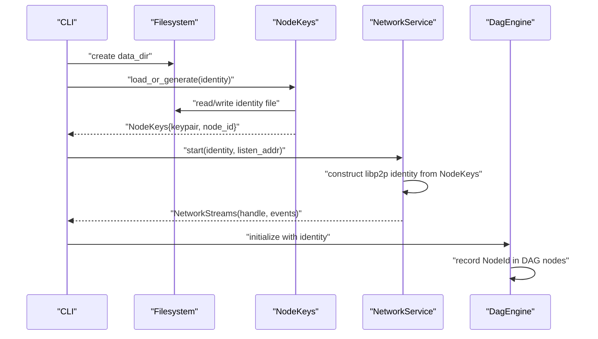
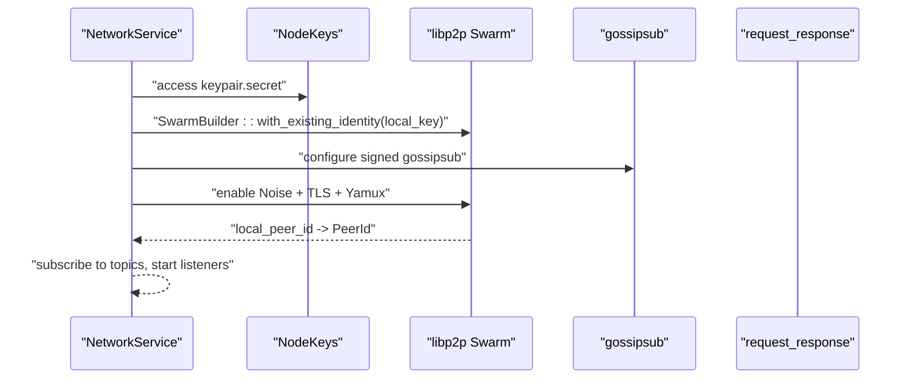
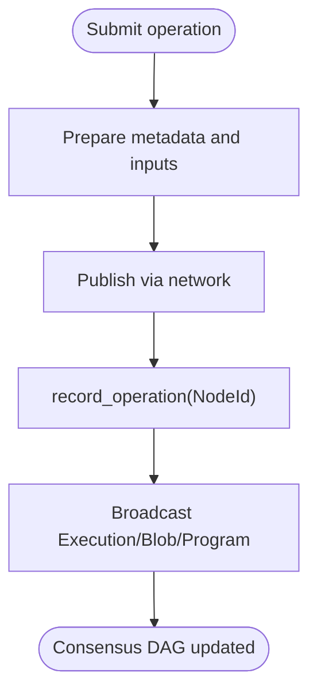
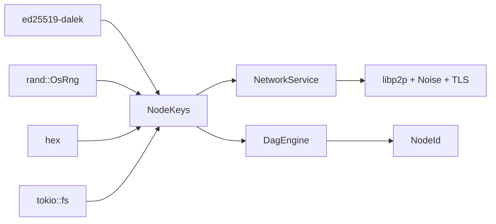

# Cryptographic Identities

<cite>
**Referenced Files in This Document**
- [keys.rs](file://src/crypto/keys.rs)
- [types.rs](file://src/types.rs)
- [service.rs](file://src/network/service.rs)
- [node.rs](file://src/node.rs)
- [mod.rs (consensus)](file://src/consensus/mod.rs)
- [cli.rs](file://src/cli.rs)
- [main.rs](file://src/main.rs)
- [Cargo.lock](file://Cargo.lock)
</cite>

## Table of Contents
1. [Introduction](#introduction)
2. [Project Structure](#project-structure)
3. [Core Components](#core-components)
4. [Architecture Overview](#architecture-overview)
5. [Detailed Component Analysis](#detailed-component-analysis)
6. [Dependency Analysis](#dependency-analysis)
7. [Performance Considerations](#performance-considerations)
8. [Troubleshooting Guide](#troubleshooting-guide)
9. [Conclusion](#conclusion)

## Introduction
This document explains how cryptographic identities are implemented using ed25519-dalek in the project’s crypto layer. It covers key pair generation, serialization, and storage in identity files; deriving NodeId from the public key for node identification; integrating with libp2p for secure peer identification; and using Noise for encrypted transport. It also describes how identities relate to consensus (block signing) and networking (peer authentication), along with security best practices for protecting private keys and mitigating common issues such as key corruption or unauthorized access.

## Project Structure
The cryptographic identity functionality is centered around:
- Identity storage and key operations in src/crypto/keys.rs
- Type definitions for NodeId in src/types.rs
- libp2p integration and Noise transport in src/network/service.rs
- Node composition and identity wiring in src/node.rs
- Consensus usage of NodeId for publishing and DAG nodes in src/consensus/mod.rs
- CLI initialization and identity file creation in src/cli.rs

```mermaid
graph TB
subgraph "Crypto Layer"
K["NodeKeys<br/>load_or_generate, sign, verify"]
T["NodeId<br/>from_public_key"]
end
subgraph "Networking"
NS["NetworkService<br/>libp2p identity + Noise"]
end
subgraph "Consensus"
CE["DagEngine<br/>uses NodeId for publishing"]
end
subgraph "CLI"
CLI["CLI Init<br/>creates identity file"]
end
K --> T
CLI --> K
NS --> K
CE --> K
```

**Diagram sources**
- [keys.rs](file://src/crypto/keys.rs#L1-L72)
- [types.rs](file://src/types.rs#L80-L93)
- [service.rs](file://src/network/service.rs#L212-L264)
- [node.rs](file://src/node.rs#L14-L35)
- [mod.rs (consensus)](file://src/consensus/mod.rs#L294-L305)
- [cli.rs](file://src/cli.rs#L116-L129)

**Section sources**
- [keys.rs](file://src/crypto/keys.rs#L1-L72)
- [types.rs](file://src/types.rs#L80-L93)
- [service.rs](file://src/network/service.rs#L212-L264)
- [node.rs](file://src/node.rs#L14-L35)
- [mod.rs (consensus)](file://src/consensus/mod.rs#L294-L305)
- [cli.rs](file://src/cli.rs#L116-L129)

## Core Components
- NodeKeys encapsulates an ed25519 keypair and the derived NodeId. It supports asynchronous loading or generation of the identity file, signing messages, and verification against a public key.
- NodeId is a 32-byte identifier derived from the first 32 bytes of the serialized public key. It is used across the system for node identification and publisher attribution.
- NetworkService integrates libp2p with Noise for encrypted transport and uses the NodeKeys to establish a signed identity for gossipsub and peer identification.
- Consensus uses NodeId to attribute published operations and track publishers in the DAG.

**Section sources**
- [keys.rs](file://src/crypto/keys.rs#L1-L72)
- [types.rs](file://src/types.rs#L80-L93)
- [service.rs](file://src/network/service.rs#L212-L264)
- [mod.rs (consensus)](file://src/consensus/mod.rs#L294-L305)

## Architecture Overview
The identity lifecycle spans initialization, persistence, and runtime usage:
- CLI initializes the identity file at startup if absent.
- NodeKeys loads or generates the identity asynchronously, storing the private key in a file and computing NodeId from the public key.
- NetworkService constructs libp2p identity from the NodeKeys and enables Noise/TLS transport.
- Consensus records NodeId in DAG nodes and metadata to attribute operations to publishers.



**Diagram sources**
- [cli.rs](file://src/cli.rs#L116-L129)
- [keys.rs](file://src/crypto/keys.rs#L30-L62)
- [service.rs](file://src/network/service.rs#L212-L264)
- [mod.rs (consensus)](file://src/consensus/mod.rs#L294-L305)

## Detailed Component Analysis

### NodeKeys: Key Pair Generation, Serialization, and Storage
- Asynchronous load_or_generate:
  - If the identity file exists, it reads the private key, parses it, derives the public key, constructs a keypair, computes NodeId from the public key, and returns the NodeKeys.
  - If the file does not exist, it generates a fresh keypair, derives NodeId, writes the private key (hex-encoded) to the identity file, and returns the NodeKeys.
- Signing and verification:
  - sign(data) produces a signature using the keypair.
  - verify(data, signature, public) validates a signature against a given public key using strict verification.

Security considerations:
- Private key is stored as hex-encoded bytes in the identity file. The implementation does not enforce filesystem permissions; ensure appropriate OS-level protections are applied externally.
- The identity file path is tracked internally; consider rotating keys and backing up securely if needed.

**Section sources**
- [keys.rs](file://src/crypto/keys.rs#L30-L72)

### NodeId Derivation and Role
- NodeId is derived from the first 32 bytes of the serialized public key. This ensures a compact, stable identifier for the node across the system.
- Roles:
  - Node identification in libp2p (PeerId is derived from the libp2p identity).
  - Publisher attribution in consensus (DAG nodes and metadata carry NodeId).
  - Display and logging convenience via hex formatting.

**Section sources**
- [types.rs](file://src/types.rs#L80-L93)
- [service.rs](file://src/network/service.rs#L212-L220)
- [mod.rs (consensus)](file://src/consensus/mod.rs#L294-L305)

### libp2p Integration and Noise Transport
- NetworkService constructs a libp2p identity from the NodeKeys’ secret and uses it to initialize gossipsub with signed messages and Noise/TLS transport.
- The PeerId is derived from the libp2p identity and exposed via NetworkHandle.
- Noise is enabled alongside TLS and configured with Yamux for multiplexing.



**Diagram sources**
- [service.rs](file://src/network/service.rs#L212-L264)

**Section sources**
- [service.rs](file://src/network/service.rs#L212-L264)

### Consensus Integration and Publisher Attribution
- The Node identity is passed into the Node and DagEngine, which use NodeId to attribute operations:
  - record_operation sets the publisher field to NodeId.
  - Various handlers and broadcasts include NodeId in metadata and inventory messages.
- This establishes a clear link between a node’s identity and the operations it publishes.



**Diagram sources**
- [mod.rs (consensus)](file://src/consensus/mod.rs#L294-L305)

**Section sources**
- [mod.rs (consensus)](file://src/consensus/mod.rs#L294-L305)

### CLI Initialization and Identity File Management
- The CLI “init” command creates the data directory and initializes the identity file by calling NodeKeys::load_or_generate.
- The CLI “run” command also loads the identity file and starts the node with the identity wired into the system.

Operational notes:
- The identity file path is data_dir/identity.
- The CLI prints the computed NodeId after initialization.

**Section sources**
- [cli.rs](file://src/cli.rs#L116-L129)
- [cli.rs](file://src/cli.rs#L130-L171)

## Dependency Analysis
- NodeKeys depends on:
  - ed25519-dalek for keypair generation, signing, and verification.
  - rand::rngs::OsRng for secure randomness.
  - tokio::fs for asynchronous file I/O.
  - hex for encoding/decoding the private key.
- NodeId is a thin wrapper around [u8; 32] with a constructor that truncates or copies the first 32 bytes of the public key.
- NetworkService depends on libp2p, Noise, and CBOR request/response for encrypted transport and messaging.
- Consensus uses NodeId for publisher attribution and DAG node construction.



**Diagram sources**
- [keys.rs](file://src/crypto/keys.rs#L1-L72)
- [service.rs](file://src/network/service.rs#L212-L264)
- [mod.rs (consensus)](file://src/consensus/mod.rs#L294-L305)
- [types.rs](file://src/types.rs#L80-L93)

**Section sources**
- [Cargo.lock](file://Cargo.lock#L1164-L1191)
- [Cargo.lock](file://Cargo.lock#L2496-L2519)

## Performance Considerations
- Key generation uses OS RNG and is performed once during identity initialization.
- Signing and verification are constant-time operations provided by the ed25519-dalek library.
- Network transport uses Noise/TLS with Yamux; overhead is typical for encrypted P2P networks.
- Consider batching or rate-limiting network publications to reduce bandwidth and CPU usage.

[No sources needed since this section provides general guidance]

## Troubleshooting Guide
Common issues and mitigations:
- Identity file corruption:
  - Symptoms: load_or_generate fails to parse the private key or derive the public key.
  - Mitigation: Recreate the identity file using the CLI init command. Back up the identity file before destructive operations.
- Unauthorized access to the identity file:
  - Mitigation: Restrict filesystem permissions on the identity file and the data directory. Do not commit the identity file to version control.
- Node fails to start due to invalid listen address:
  - Mitigation: Adjust the listen multiaddress; the node attempts to increment the TCP port if binding fails.
- Signature verification failures:
  - Mitigation: Ensure the public key used for verification matches the NodeKeys’ public key. Verify the data and signature were not altered.

Security best practices:
- Protect the identity file with restrictive permissions.
- Do not share or commit the identity file.
- Rotate keys periodically and back them up securely.
- Monitor logs for suspicious activity and reinitialize identities if compromised.

**Section sources**
- [cli.rs](file://src/cli.rs#L116-L129)
- [node.rs](file://src/node.rs#L135-L163)
- [keys.rs](file://src/crypto/keys.rs#L30-L72)

## Conclusion
The project implements robust cryptographic identities using ed25519-dalek. NodeKeys manages secure key persistence and operations, NodeId provides a compact node identifier, and libp2p with Noise ensures encrypted peer-to-peer communication. Consensus leverages NodeId to attribute operations, while the CLI streamlines identity initialization. By following the security recommendations and troubleshooting steps, operators can maintain secure and reliable node identities across the system.