# Data Integrity

<cite>
**Referenced Files in This Document**
- [hashing.rs](file://src/crypto/hashing.rs)
- [types.rs](file://src/types.rs)
- [blob_store.rs](file://src/storage/blob_store.rs)
- [state_store.rs](file://src/storage/state_store.rs)
- [runtime.rs](file://src/execution/runtime.rs)
- [service.rs](file://src/network/service.rs)
- [mod.rs](file://src/consensus/mod.rs)
- [program_store.rs](file://src/execution/program_store.rs)
- [mod.rs](file://src/config/mod.rs)
</cite>

## Table of Contents
1. [Introduction](#introduction)
2. [Project Structure](#project-structure)
3. [Core Components](#core-components)
4. [Architecture Overview](#architecture-overview)
5. [Detailed Component Analysis](#detailed-component-analysis)
6. [Dependency Analysis](#dependency-analysis)
7. [Performance Considerations](#performance-considerations)
8. [Troubleshooting Guide](#troubleshooting-guide)
9. [Conclusion](#conclusion)

## Introduction
This document explains how BLAKE3 hashing ensures data integrity across the system. It covers how content addressing is implemented for Blobs, Programs, Blocks, and State via BlobId, ProgramId, BlockId, and StateRoot. It also describes how hashing is used for ComputeOp, block headers, and program binaries; how to compute a BlobId from raw content and verify integrity upon retrieval; the role of hashing in tamper detection and consensus validation; integration with storage (content-addressable lookups) and networking (gossip verification); performance considerations for large data; and BLAKE3’s collision resistance properties for cryptographic identification in a distributed system.

## Project Structure
The data integrity pipeline spans several modules:
- Crypto hashing primitives
- Type definitions for identifiers and metadata
- Storage subsystems for Blobs and State
- Execution runtime that produces StateRoot
- Networking layer that uses BLAKE3 for message deduplication and gossip message IDs
- Consensus layer that constructs DAG nodes and ComputeOps using hashed identifiers

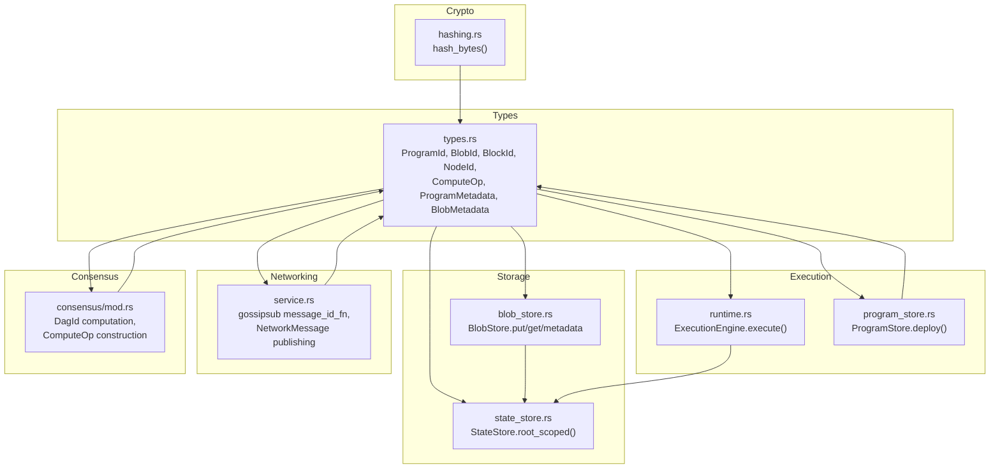

**Diagram sources**
- [hashing.rs](file://src/crypto/hashing.rs#L1-L8)
- [types.rs](file://src/types.rs#L1-L108)
- [blob_store.rs](file://src/storage/blob_store.rs#L1-L185)
- [state_store.rs](file://src/storage/state_store.rs#L1-L80)
- [runtime.rs](file://src/execution/runtime.rs#L1-L183)
- [service.rs](file://src/network/service.rs#L214-L424)
- [mod.rs](file://src/consensus/mod.rs#L1-L120)

**Section sources**
- [hashing.rs](file://src/crypto/hashing.rs#L1-L8)
- [types.rs](file://src/types.rs#L1-L108)
- [blob_store.rs](file://src/storage/blob_store.rs#L1-L185)
- [state_store.rs](file://src/storage/state_store.rs#L1-L80)
- [runtime.rs](file://src/execution/runtime.rs#L1-L183)
- [service.rs](file://src/network/service.rs#L214-L424)
- [mod.rs](file://src/consensus/mod.rs#L1-L120)

## Core Components
- BLAKE3 hashing primitive: a single function computes a 32-byte digest from arbitrary bytes.
- Identifier types: ProgramId, BlobId, BlockId, NodeId wrap 32-byte digests for strong cryptographic identification.
- Content addressing:
  - BlobId is derived from raw blob bytes.
  - ProgramId is derived from program bytecode with optional deploy salt.
  - BlockId is derived from block header bytes.
  - StateRoot is a Merkle root of state key-value pairs.
- ComputeOp carries ProgramId, input BlobId, output BlobMetadata, fuel_used, state_root, and state_writes.
- DAG node identifiers (DagId) are derived from parent references and serialized operation payload.

**Section sources**
- [hashing.rs](file://src/crypto/hashing.rs#L1-L8)
- [types.rs](file://src/types.rs#L1-L108)
- [mod.rs](file://src/consensus/mod.rs#L1-L120)

## Architecture Overview
The system uses BLAKE3 for:
- Deterministic content addressing of Blobs and Programs
- Integrity verification during storage reads and replication
- State integrity via Merkle roots
- Gossip message deduplication and message ID computation
- DAG node and ComputeOp integrity in consensus

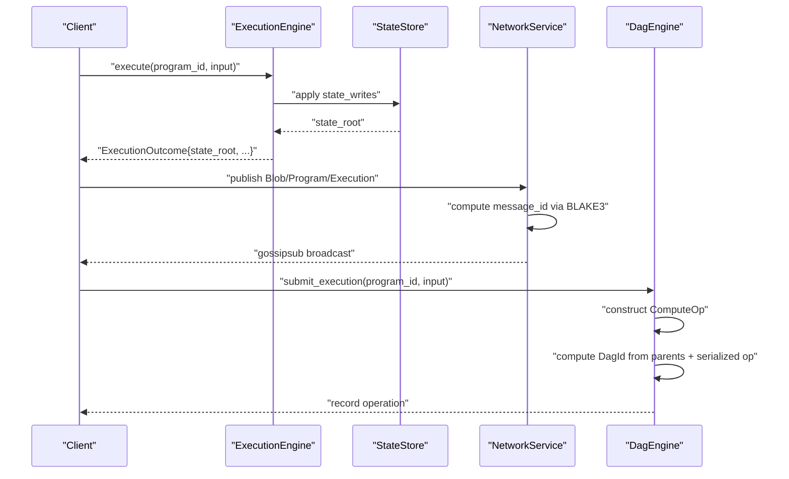

**Diagram sources**
- [runtime.rs](file://src/execution/runtime.rs#L143-L183)
- [service.rs](file://src/network/service.rs#L222-L424)
- [mod.rs](file://src/consensus/mod.rs#L231-L258)

## Detailed Component Analysis

### BLAKE3 Hashing Primitive
- Purpose: Provide fast, secure 32-byte digests for all identifiers and integrity checks.
- Usage: Single function wraps BLAKE3 hasher and returns a fixed-size digest.

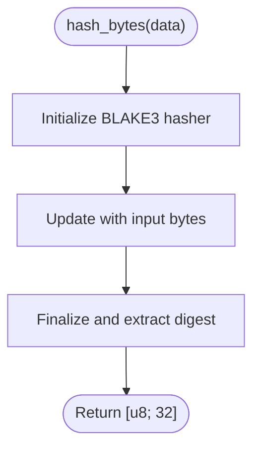

**Diagram sources**
- [hashing.rs](file://src/crypto/hashing.rs#L1-L8)

**Section sources**
- [hashing.rs](file://src/crypto/hashing.rs#L1-L8)

### Identifier Types and Content Addressing
- ProgramId: derived from program bytecode; salted derivation ensures reproducible, unique IDs across deployments.
- BlobId: derived from raw blob bytes; enables content-addressable storage and retrieval.
- BlockId: derived from block header bytes; anchors block-level integrity.
- NodeId: used for publisher identities; not BLAKE3-derived here.

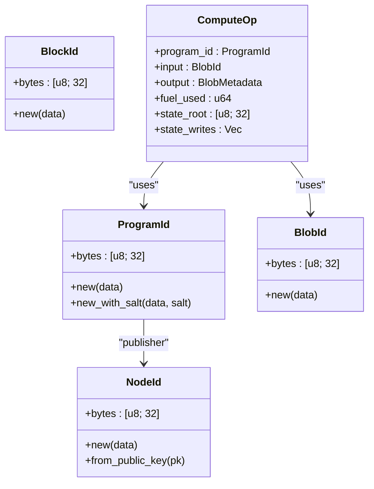

**Diagram sources**
- [types.rs](file://src/types.rs#L1-L108)

**Section sources**
- [types.rs](file://src/types.rs#L1-L108)

### Blob Integrity: Chunking, Merkle Root, and Replication
- BlobStore.put:
  - Splits raw bytes into chunks (default 1 MiB).
  - Computes chunk hashes via BLAKE3.
  - Builds Merkle root from chunk hashes.
  - Creates BlobMetadata with id, publisher, size, MIME, chunk info, and Merkle root.
  - Persists metadata and chunks.
- BlobStore.replicate:
  - Verifies BlobId matches computed id.
  - Validates chunk count, chunk hashes, and Merkle root against provided metadata.
- BlobStore.get:
  - Reassembles blob from stored chunks.
  - Recomputes chunk hashes, Merkle root, and size to verify integrity end-to-end.

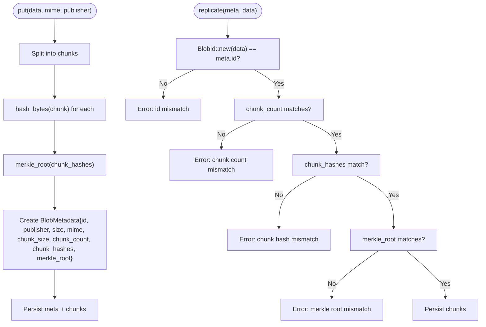

**Diagram sources**
- [blob_store.rs](file://src/storage/blob_store.rs#L18-L185)

**Section sources**
- [blob_store.rs](file://src/storage/blob_store.rs#L18-L185)

### State Integrity: StateRoot via Merkle Tree
- StateStore.root_scoped:
  - Scans namespace-scoped key-value pairs.
  - Hashes each key/value pair deterministically.
  - Sorts leaves to ensure deterministic ordering.
  - Reduces pairs into a Merkle root using BLAKE3.
- ExecutionEngine.execute:
  - Applies pending writes deterministically.
  - Computes state root after applying writes.
  - Produces ExecutionOutcome containing state_root and state_writes.

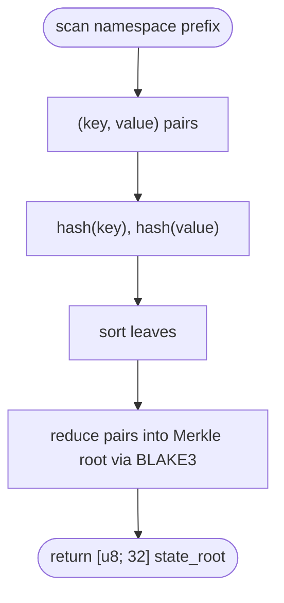

**Diagram sources**
- [state_store.rs](file://src/storage/state_store.rs#L1-L80)
- [runtime.rs](file://src/execution/runtime.rs#L143-L183)

**Section sources**
- [state_store.rs](file://src/storage/state_store.rs#L1-L80)
- [runtime.rs](file://src/execution/runtime.rs#L143-L183)

### ComputeOp and DAG Integrity
- ComputeOp includes ProgramId, input BlobId, output BlobMetadata, fuel_used, state_root, and state_writes.
- DagEngine constructs ComputeOp from execution outcomes and records it with parents Program/Blob/Execution.
- DagId is computed from serialized operation plus concatenated parent identifiers.

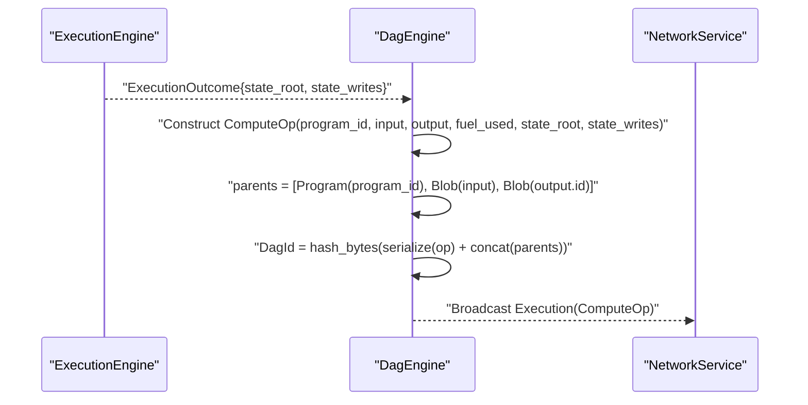

**Diagram sources**
- [runtime.rs](file://src/execution/runtime.rs#L143-L183)
- [mod.rs](file://src/consensus/mod.rs#L231-L258)
- [service.rs](file://src/network/service.rs#L395-L424)

**Section sources**
- [runtime.rs](file://src/execution/runtime.rs#L143-L183)
- [mod.rs](file://src/consensus/mod.rs#L231-L258)

### Program Integrity and Deployment
- ProgramStore.deploy:
  - Computes ProgramId using BLAKE3 with optional deploy_salt.
  - Stores metadata and program bytes under ProgramId key.
- ProgramStore.replicate:
  - Verifies ProgramId matches expected id derived from wasm + salt before storing.

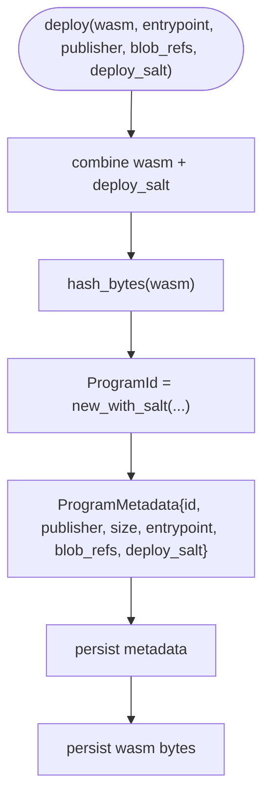

**Diagram sources**
- [program_store.rs](file://src/execution/program_store.rs#L16-L41)

**Section sources**
- [program_store.rs](file://src/execution/program_store.rs#L16-L41)

### Networking Integrity: Gossip Message Deduplication and Message IDs
- NetworkService sets up gossipsub with a message_id_fn that hashes message data with BLAKE3.
- Outbound publishes compute messages with BLAKE3-derived message IDs and maintains a small recent-IDs window to deduplicate.

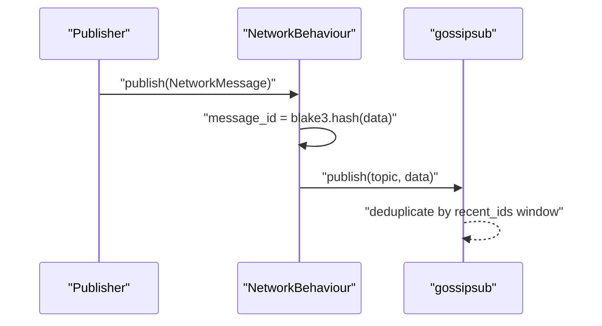

**Diagram sources**
- [service.rs](file://src/network/service.rs#L222-L424)

**Section sources**
- [service.rs](file://src/network/service.rs#L222-L424)

### Block Header Integrity
- BlockId is derived from block header bytes, ensuring block-level integrity.
- GenesisConfig contains an optional global state_root for initial conditions.

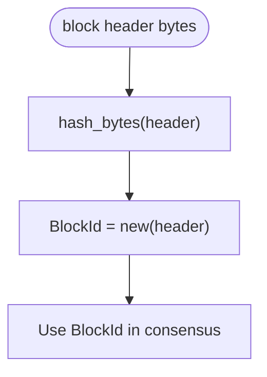

**Diagram sources**
- [types.rs](file://src/types.rs#L73-L78)
- [mod.rs](file://src/config/mod.rs#L11-L16)

**Section sources**
- [types.rs](file://src/types.rs#L73-L78)
- [mod.rs](file://src/config/mod.rs#L11-L16)

## Dependency Analysis
- hash_bytes is a shared dependency across types, storage, execution, and networking.
- BlobStore and StateStore both rely on BLAKE3 for chunk hashing and Merkle roots.
- ExecutionEngine depends on StateStore to compute state_root.
- NetworkService uses BLAKE3 for message deduplication and message IDs.
- Consensus constructs DagId from serialized operations and parent identifiers.

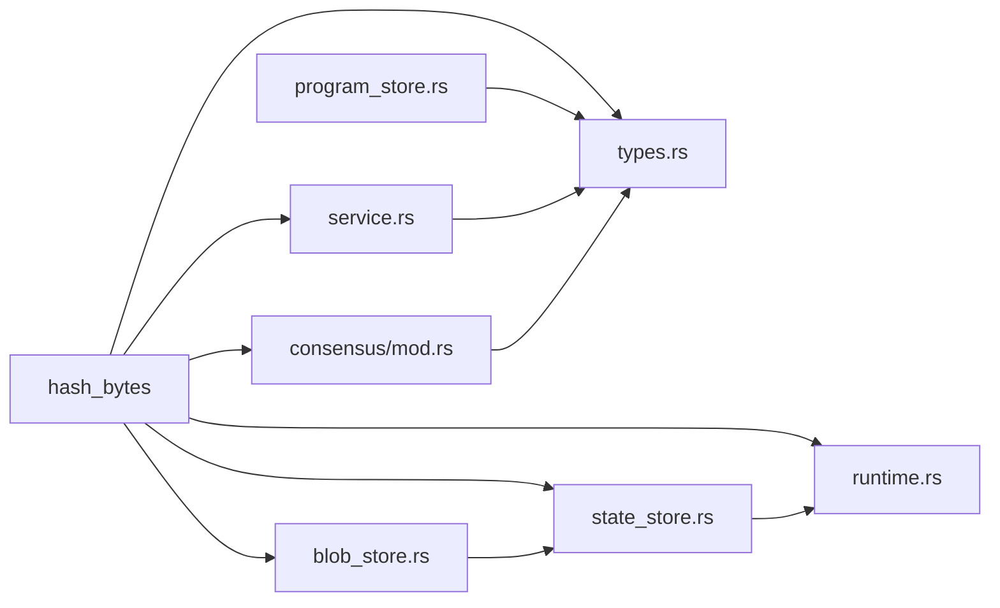

**Diagram sources**
- [hashing.rs](file://src/crypto/hashing.rs#L1-L8)
- [types.rs](file://src/types.rs#L1-L108)
- [blob_store.rs](file://src/storage/blob_store.rs#L1-L185)
- [state_store.rs](file://src/storage/state_store.rs#L1-L80)
- [runtime.rs](file://src/execution/runtime.rs#L1-L183)
- [service.rs](file://src/network/service.rs#L214-L424)
- [mod.rs](file://src/consensus/mod.rs#L1-L120)
- [program_store.rs](file://src/execution/program_store.rs#L16-L41)

**Section sources**
- [hashing.rs](file://src/crypto/hashing.rs#L1-L8)
- [types.rs](file://src/types.rs#L1-L108)
- [blob_store.rs](file://src/storage/blob_store.rs#L1-L185)
- [state_store.rs](file://src/storage/state_store.rs#L1-L80)
- [runtime.rs](file://src/execution/runtime.rs#L1-L183)
- [service.rs](file://src/network/service.rs#L214-L424)
- [mod.rs](file://src/consensus/mod.rs#L1-L120)
- [program_store.rs](file://src/execution/program_store.rs#L16-L41)

## Performance Considerations
- Chunking strategy:
  - Default chunk size is 1 MiB for BlobStore. Larger chunks reduce overhead but increase memory usage and network transfer time; smaller chunks improve resilience but increase hashing and Merkle tree computation cost.
- Streaming hashing:
  - For very large blobs, consider streaming BLAKE3 updates to reduce peak memory usage.
- Merkle root computation:
  - Merkle tree reduction is O(n log n) with n equal to the number of leaves. Sorting leaves adds O(n log n). For large state sets, consider batching writes and deferring Merkle root recomputation until commit boundaries.
- Deduplication window:
  - NetworkService maintains a bounded recent-ids queue to prevent unbounded growth; tune the window size to balance memory usage and deduplication effectiveness.
- Parallelism:
  - Where safe, parallelize chunk hashing and Merkle reductions across CPU cores.
- Salted program IDs:
  - Using deploy_salt avoids collisions across identical program binaries deployed by different publishers.

[No sources needed since this section provides general guidance]

## Troubleshooting Guide
Common integrity failures and their causes:
- Blob integrity errors:
  - BlobId mismatch: indicates tampering or wrong data.
  - Chunk count mismatch: indicates partial or corrupted data.
  - Chunk hash mismatch: indicates corruption in one or more chunks.
  - Merkle root mismatch on read: indicates inconsistency in stored chunks.
  - Size mismatch on read: indicates missing or extra bytes.
- Program integrity errors:
  - ProgramId mismatch on replicate: indicates mismatch between provided bytecode and metadata deploy_salt.
- State integrity errors:
  - Mismatch between computed state_root and expected state_root in ComputeOp indicates incorrect state writes or ordering.
- Network integrity:
  - Duplicate message drops due to BLAKE3 message_id deduplication indicate redundant broadcasts or replay attacks.

Mitigation steps:
- Verify BlobId and Merkle root after retrieval.
- Confirm chunk sizes and counts match metadata before replication.
- Ensure deterministic ordering of state writes before computing state_root.
- Monitor recent-ids window to diagnose excessive duplication.

**Section sources**
- [blob_store.rs](file://src/storage/blob_store.rs#L48-L104)
- [program_store.rs](file://src/execution/program_store.rs#L43-L56)
- [runtime.rs](file://src/execution/runtime.rs#L143-L183)
- [service.rs](file://src/network/service.rs#L222-L424)

## Conclusion
BLAKE3 provides a fast, collision-resistant foundation for cryptographic identification across Blobs, Programs, Blocks, and State. Content-addressing ensures tamper detection at rest and in transit, while Merkle roots and serialized operation hashing anchor consensus integrity. The system integrates hashing into storage, execution, networking, and consensus to deliver robust data integrity guarantees suitable for distributed environments.