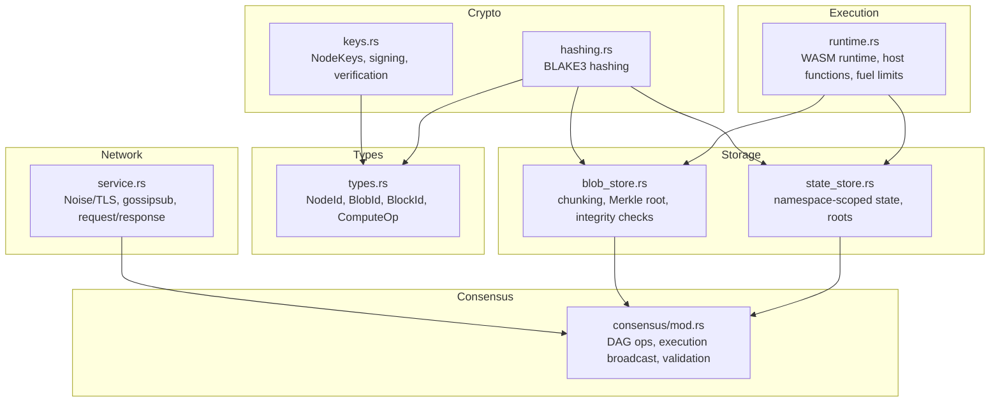
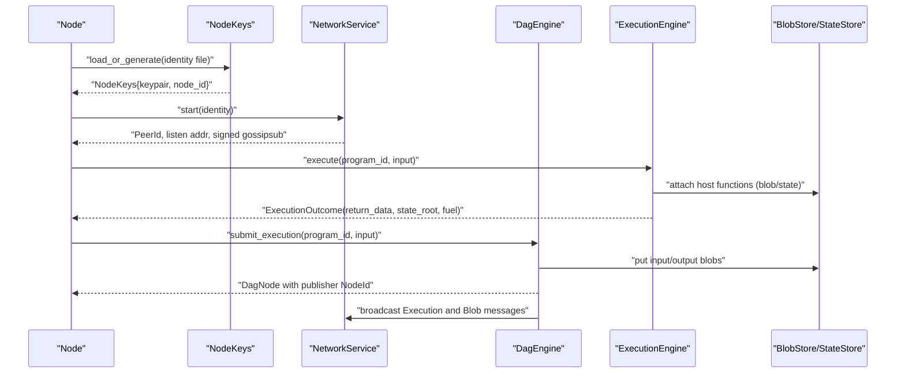
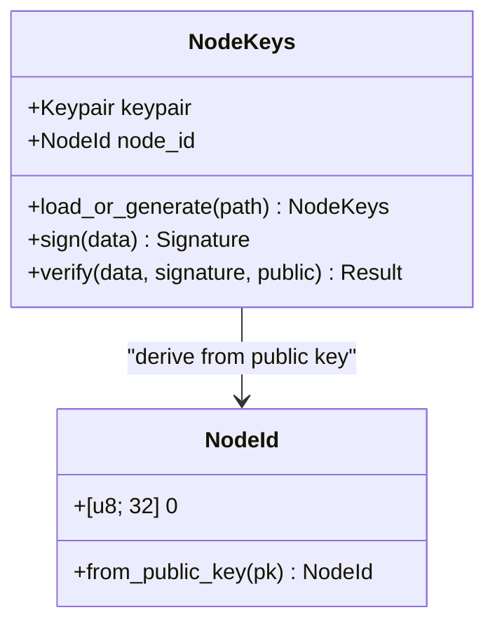
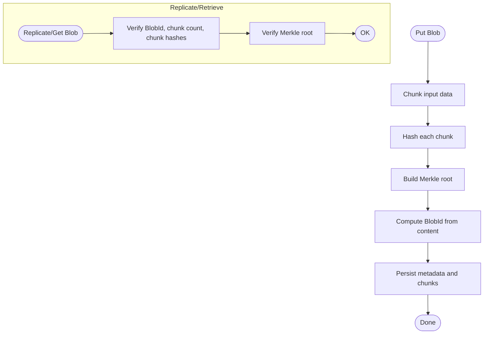
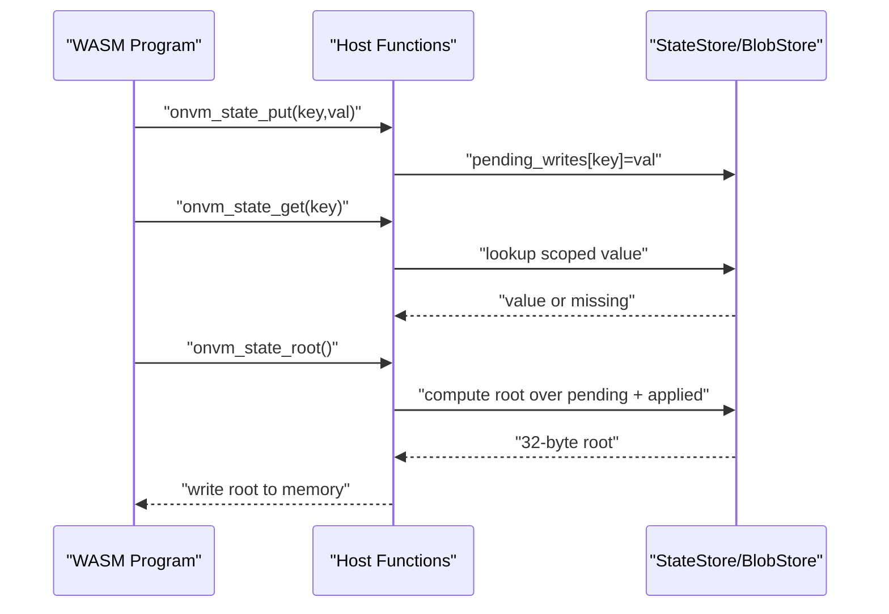
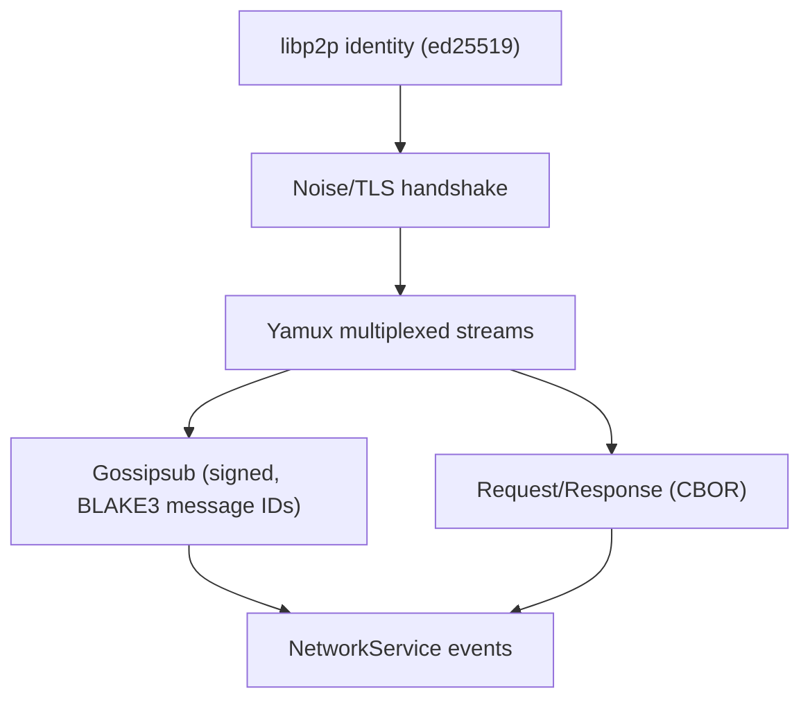
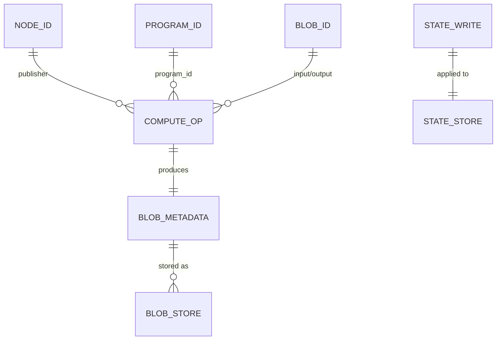
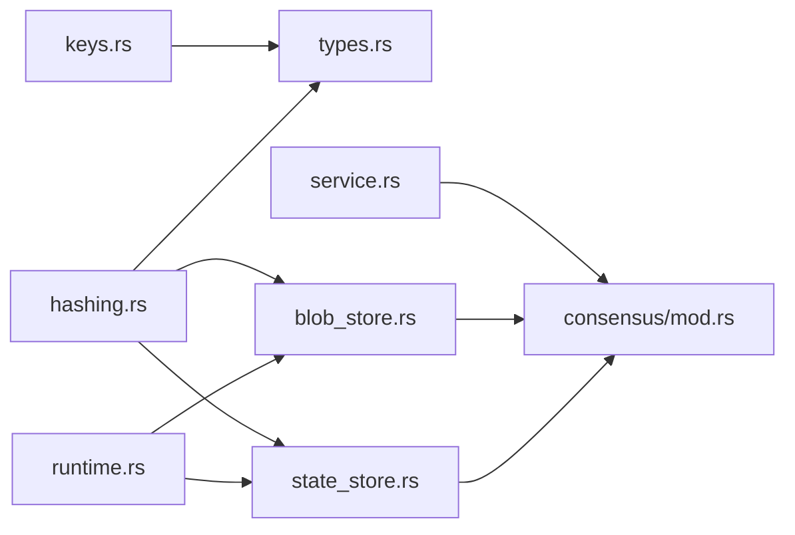

# Security Model

<cite>
**Referenced Files in This Document**
- [keys.rs](file://src/crypto/keys.rs)
- [hashing.rs](file://src/crypto/hashing.rs)
- [types.rs](file://src/types.rs)
- [service.rs](file://src/network/service.rs)
- [runtime.rs](file://src/execution/runtime.rs)
- [blob_store.rs](file://src/storage/blob_store.rs)
- [state_store.rs](file://src/storage/state_store.rs)
- [mod.rs](file://src/consensus/mod.rs)
</cite>

## Table of Contents
1. [Introduction](#introduction)
2. [Project Structure](#project-structure)
3. [Core Components](#core-components)
4. [Architecture Overview](#architecture-overview)
5. [Detailed Component Analysis](#detailed-component-analysis)
6. [Dependency Analysis](#dependency-analysis)
7. [Performance Considerations](#performance-considerations)
8. [Troubleshooting Guide](#troubleshooting-guide)
9. [Conclusion](#conclusion)
10. [Appendices](#appendices)

## Introduction
This document describes the security model of the system, focusing on cryptographic identities, data integrity, access control, and transport security. It explains how cryptographic identities are generated and stored, how signatures are produced and verified, how BLAKE3 ensures data integrity and content addressing, and how execution is sandboxed. It also documents entity relationships (NodeId, BlobId, BlockId), and outlines business rules and threat mitigations.

## Project Structure
Security-related logic is organized into focused modules:
- Cryptography: identity management and hashing
- Types: cryptographic identifiers and typed entities
- Network: transport security and message validation
- Storage: integrity-preserving blob storage and state roots
- Consensus: DAG-based operations and message validation
- Execution: sandboxed runtime with controlled host functions

**Diagram sources**
- [keys.rs](file://src/crypto/keys.rs#L1-L73)
- [hashing.rs](file://src/crypto/hashing.rs#L1-L8)
- [types.rs](file://src/types.rs#L1-L109)
- [service.rs](file://src/network/service.rs#L200-L399)
- [blob_store.rs](file://src/storage/blob_store.rs#L1-L185)
- [state_store.rs](file://src/storage/state_store.rs#L1-L79)
- [mod.rs](file://src/consensus/mod.rs#L1-L1112)
- [runtime.rs](file://src/execution/runtime.rs#L1-L377)

**Section sources**
- [keys.rs](file://src/crypto/keys.rs#L1-L73)
- [hashing.rs](file://src/crypto/hashing.rs#L1-L8)
- [types.rs](file://src/types.rs#L1-L109)
- [service.rs](file://src/network/service.rs#L200-L399)
- [blob_store.rs](file://src/storage/blob_store.rs#L1-L185)
- [state_store.rs](file://src/storage/state_store.rs#L1-L79)
- [mod.rs](file://src/consensus/mod.rs#L1-L1112)
- [runtime.rs](file://src/execution/runtime.rs#L1-L377)

## Core Components
- Cryptographic identities: Ed25519 keypairs with persistent identity files, NodeId derived from public key, and signature/verification routines.
- Data integrity: BLAKE3 hashing for content addressing and tamper detection; Merkle trees for blob integrity; state roots for deterministic state hashing.
- Access control: WASM runtime sandboxing via Wasmtime and controlled host functions; execution fuel limits; deterministic state application.
- Transport security: Noise/TLS layered on TCP with libp2p; signed gossipsub messages; request/response channels.

**Section sources**
- [keys.rs](file://src/crypto/keys.rs#L1-L73)
- [hashing.rs](file://src/crypto/hashing.rs#L1-L8)
- [types.rs](file://src/types.rs#L1-L109)
- [service.rs](file://src/network/service.rs#L200-L399)
- [runtime.rs](file://src/execution/runtime.rs#L1-L377)
- [blob_store.rs](file://src/storage/blob_store.rs#L1-L185)
- [state_store.rs](file://src/storage/state_store.rs#L1-L79)

## Architecture Overview
The security architecture integrates cryptographic primitives, integrity checks, and sandboxing across layers.

**Diagram sources**
- [keys.rs](file://src/crypto/keys.rs#L1-L73)
- [service.rs](file://src/network/service.rs#L200-L399)
- [mod.rs](file://src/consensus/mod.rs#L194-L258)
- [runtime.rs](file://src/execution/runtime.rs#L79-L183)
- [blob_store.rs](file://src/storage/blob_store.rs#L18-L46)
- [state_store.rs](file://src/storage/state_store.rs#L1-L48)

## Detailed Component Analysis

### Cryptographic Identities and Signing
- Identity lifecycle:
  - Load or generate an Ed25519 keypair from a hex-encoded identity file.
  - Persist the secret key in the identity file.
  - Derive NodeId from the public key bytes.
- Signature scheme:
  - Produce signatures over arbitrary data using the secret key.
  - Verify signatures against a given public key.
- Identity storage:
  - Identity file contains a single-line hex-encoded secret key.
  - On load, parse and construct keypair; on generate, write secret to disk.

**Diagram sources**
- [keys.rs](file://src/crypto/keys.rs#L1-L73)
- [types.rs](file://src/types.rs#L80-L93)

**Section sources**
- [keys.rs](file://src/crypto/keys.rs#L1-L73)
- [types.rs](file://src/types.rs#L80-L93)

### Data Integrity and Content Addressing
- BLAKE3 hashing:
  - Used for content addressing and message validation.
  - Provides fast, collision-resistant hashes for integrity checks.
- Blob integrity:
  - Blob metadata includes chunk hashes and a Merkle root.
  - Replication and retrieval enforce chunk count, chunk hashes, and Merkle root equality.
- State integrity:
  - State store computes a deterministic Merkle root over scoped key-value pairs.
  - Pending writes are folded into a temporary state root during execution.

**Diagram sources**
- [hashing.rs](file://src/crypto/hashing.rs#L1-L8)
- [blob_store.rs](file://src/storage/blob_store.rs#L18-L76)
- [state_store.rs](file://src/storage/state_store.rs#L29-L48)

**Section sources**
- [hashing.rs](file://src/crypto/hashing.rs#L1-L8)
- [blob_store.rs](file://src/storage/blob_store.rs#L18-L104)
- [state_store.rs](file://src/storage/state_store.rs#L29-L79)

### Access Control and Sandboxing
- Program execution:
  - Deterministic execution with fuel limits to prevent resource exhaustion.
  - Controlled host functions exposed to WASM:
    - onvm_blob_read: reads blob data by BlobId.
    - onvm_state_put/get/root: scoped state operations and root computation.
  - WASI attached for compatibility; filesystem access disabled by default.
- State writes:
  - Pending writes are sorted deterministically and applied to the state store.
  - State root computed deterministically from applied writes.
- Execution outcomes:
  - Return data, fuel consumed, state writes, and state root are recorded.

**Diagram sources**
- [runtime.rs](file://src/execution/runtime.rs#L199-L376)
- [state_store.rs](file://src/storage/state_store.rs#L1-L48)

**Section sources**
- [runtime.rs](file://src/execution/runtime.rs#L1-L377)
- [state_store.rs](file://src/storage/state_store.rs#L1-L79)

### Transport Security and Message Validation
- Transport:
  - libp2p with Noise/TLS layered over TCP; Yamux multiplexing.
  - mDNS for peer discovery; Kademlia DHT for provider discovery.
- Message validation:
  - Gossipsub messages are signed and validated; message IDs derived from BLAKE3 of payload.
  - Request/response protocol for targeted transfers.
- Message types:
  - Program, Blob, Execution broadcasts; Inventory and requests; ProgramSyncRequest.

**Diagram sources**
- [service.rs](file://src/network/service.rs#L200-L399)

**Section sources**
- [service.rs](file://src/network/service.rs#L200-L399)

### Entity Relationships and Business Rules
- Entities:
  - NodeId: derived from public key bytes.
  - BlobId: BLAKE3 hash of blob content.
  - BlockId: BLAKE3 hash of block header (conceptual; see DAG node header hashing).
- Relationships:
  - ComputeOp references ProgramId and BlobIds for input/output.
  - BlobMetadata includes publisher NodeId and Merkle root.
  - DAG nodes carry publisher NodeId and parent references.
- Business rules:
  - Only authorized nodes can produce blocks (publisher field set to NodeId).
  - All data is verifiable via BLAKE3 and Merkle roots.
  - Execution broadcasts are validated for DAG ID and state writes applied deterministically.

**Diagram sources**
- [types.rs](file://src/types.rs#L1-L109)
- [mod.rs](file://src/consensus/mod.rs#L1-L1112)
- [blob_store.rs](file://src/storage/blob_store.rs#L1-L185)
- [state_store.rs](file://src/storage/state_store.rs#L1-L79)

**Section sources**
- [types.rs](file://src/types.rs#L1-L109)
- [mod.rs](file://src/consensus/mod.rs#L1-L1112)

### Examples

#### Example: Signing a ComputeOp
- Steps:
  - Construct ComputeOp with program_id, input BlobId, output BlobMetadata, fuel_used, state_root, and state_writes.
  - Record operation in DAG with publisher NodeId and parents.
  - Broadcast execution to peers.
- Notes:
  - Publisher NodeId is set from the node’s identity.
  - DAG ID is computed from operation and parents.

**Section sources**
- [mod.rs](file://src/consensus/mod.rs#L231-L256)
- [types.rs](file://src/types.rs#L23-L31)

#### Example: Verifying a Block
- Steps:
  - Validate DAG ID against recomputation from operation and parents.
  - Ensure DAG node does not already exist.
  - Apply state_writes deterministically to StateStore.
  - Ensure output blob metadata is present or indexed.
  - Insert node into DAG store and broadcast.

**Section sources**
- [mod.rs](file://src/consensus/mod.rs#L445-L483)

## Dependency Analysis
- Direct dependencies:
  - NodeKeys depends on ed25519-dalek and hex for identity file I/O.
  - Types depend on BLAKE3 hashing for content addressing.
  - NetworkService depends on libp2p, Noise/TLS, and BLAKE3 for message IDs.
  - BlobStore and StateStore depend on BLAKE3 for integrity.
  - ExecutionEngine depends on Wasmtime and exposes controlled host functions.
- Cohesion and coupling:
  - Cryptographic logic is cohesive in crypto module.
  - Integrity logic is cohesive in hashing and storage modules.
  - Network and consensus share message types and validation logic.
- Potential circular dependencies:
  - None observed among crypto, types, network, storage, and execution modules.

**Diagram sources**
- [keys.rs](file://src/crypto/keys.rs#L1-L73)
- [hashing.rs](file://src/crypto/hashing.rs#L1-L8)
- [types.rs](file://src/types.rs#L1-L109)
- [service.rs](file://src/network/service.rs#L200-L399)
- [blob_store.rs](file://src/storage/blob_store.rs#L1-L185)
- [state_store.rs](file://src/storage/state_store.rs#L1-L79)
- [runtime.rs](file://src/execution/runtime.rs#L1-L377)
- [mod.rs](file://src/consensus/mod.rs#L1-L1112)

**Section sources**
- [keys.rs](file://src/crypto/keys.rs#L1-L73)
- [hashing.rs](file://src/crypto/hashing.rs#L1-L8)
- [types.rs](file://src/types.rs#L1-L109)
- [service.rs](file://src/network/service.rs#L200-L399)
- [blob_store.rs](file://src/storage/blob_store.rs#L1-L185)
- [state_store.rs](file://src/storage/state_store.rs#L1-L79)
- [runtime.rs](file://src/execution/runtime.rs#L1-L377)
- [mod.rs](file://src/consensus/mod.rs#L1-L1112)

## Performance Considerations
- Hashing:
  - BLAKE3 is fast and suitable for frequent hashing of chunks and state pairs.
- Chunking:
  - Default 1 MiB chunk size balances throughput and memory usage.
- Fuel limits:
  - ExecutionEngine enforces fuel to bound CPU time and memory growth.
- Deduplication:
  - NetworkService maintains a small deque of recent message IDs to reduce duplicate processing.

[No sources needed since this section provides general guidance]

## Troubleshooting Guide
- Identity file issues:
  - Ensure identity file contains a valid hex-encoded 32-byte secret.
  - On load failures, regenerate identity or fix encoding.
- Blob integrity errors:
  - Replication/get failures indicate mismatched chunk hashes or Merkle roots.
  - Verify chunk sizes and counts match metadata.
- Execution failures:
  - Missing program metadata or exported entrypoint causes execution errors.
  - Excessive fuel consumption indicates inefficient programs or bugs.
- Network connectivity:
  - Noise/TLS handshake failures often relate to identity or address configuration.
  - Ensure listen addresses and multiaddrs are normalized.

**Section sources**
- [keys.rs](file://src/crypto/keys.rs#L30-L71)
- [blob_store.rs](file://src/storage/blob_store.rs#L48-L104)
- [runtime.rs](file://src/execution/runtime.rs#L79-L124)
- [service.rs](file://src/network/service.rs#L255-L268)

## Conclusion
The system achieves strong cryptographic foundations with Ed25519 identities, BLAKE3-based integrity, and deterministic execution with strict sandboxing. Transport security is layered with Noise/TLS, and message validation ensures authenticity and integrity. Business rules enforce verifiability and authorized producers, while practical safeguards mitigate common threats like tampering, resource exhaustion, and replay.

[No sources needed since this section summarizes without analyzing specific files]

## Appendices

### Data Security Requirements
- Private key protection:
  - Identity file contains hex-encoded secret; keep it secret and secure.
- Secure transmission:
  - Noise/TLS protects in-transit data; signed gossipsub prevents spoofed messages.
- Replay attack prevention:
  - Recent message IDs kept in a bounded deque to suppress duplicates.
  - Gossipsub message IDs derived from BLAKE3 of payload.

**Section sources**
- [keys.rs](file://src/crypto/keys.rs#L30-L71)
- [service.rs](file://src/network/service.rs#L221-L239)
- [service.rs](file://src/network/service.rs#L280-L283)

### Privacy Considerations and Threat Models
- Privacy:
  - Public keys and NodeIds are 32-byte identifiers; avoid embedding sensitive data in public keys.
  - Blob content is hashed; consider encrypting at rest if confidentiality is required.
- Threats:
  - Tampering: BLAKE3 and Merkle roots detect content modification.
  - Impersonation: Ed25519 signatures authenticate publishers; ensure identity files are protected.
  - Resource abuse: Wasmtime fuel limits and deterministic state application mitigate DoS.
  - Man-in-the-middle: Noise/TLS protects transport; signed gossipsub ensures message authenticity.

[No sources needed since this section provides general guidance]